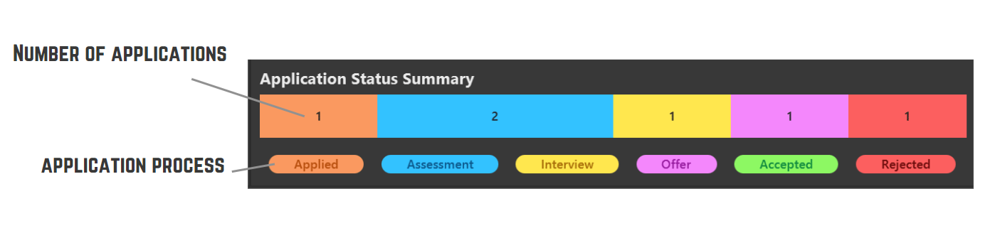

Are you a CS student struggling to keep track of your internship?
Do you feel tired of using spreadsheets to keep track of your applications?
We have just the right tool for you!

Introducing PleaseHireUs (PHU), the internship tracking application made just for you! 

{:style="display:block; margin-left:auto; margin-right:auto"}

Now you will never miss any internship application deadlines or interviews again!
PleaseHireUs has been optimized for use via a Command Line Interface (CLI) while still having the benefits of a Graphical User Interface (GUI). If you can type fast, PleaseHireUs can get your internship management tasks done faster than traditional GUI apps.
We hope you find PleaseHireUs to be very useful in your internship hunt!

* Table of Contents
{:toc}

--------------------------------------------------------------------------------------------------------------------

## Quick start

1. Ensure you have Java `11` or above installed in your Computer.

1. Download the latest `PleaseHireUs.jar` from [here](https://github.com/AY2223S1-CS2103T-W17-4/tp/releases).

1. Copy the file to the folder you want to use as the _home folder_ for your application.

1. Double-click the file to start the app. The GUI similar to the below should appear in a few seconds. Note how the app contains some sample data. 
   

1. Type the command in the command box and press Enter to execute it. e.g. typing **`help`** and pressing Enter will open the help window. 
   Some example commands you can try:

   * **`list`** : Lists all internships.

   * **`add n/Grab p/software engineer pr/ASSESSMENT web/https://www.grab.com/sg/about`** : Adds a new internship to the internship tracker.

   * **`delete 3`** : Deletes the 3rd internship shown in the current list.

   * **`clear`** : Deletes all internships.

   * **`exit`** : Exits the app.

1. Refer to the [Features](#features) below for details of each command.

--------------------------------------------------------------------------------------------------------------------
## About this User Guide

This guides aims to:
1. Teach first-time users how to start using PleaseHireUs
2. Show and explain to users how to use each command
3. Provide users with a summary of the commands available
4. Provide advance users with tips to improve their experience

## Navigating the User Guide 
**Information Box**

**:information_source: Info:** Provides extra information that is useful

**Tip Box**

**:bulb: Tip:** Provides pointers to enhance your experience using the application 

**Warning Box**

**:exclamation: Warning: Important messages**

**Highlights**  
`commands` or `PARAMETERS`

**Keyboard Inputs** 

<button>enter</button>   <button>&uarr;</button>   <button>&darr;</button>

## Navigating the GUI

**Command Box**  
Enter your command here.

**:bulb: Tip:**  
You can use <button>&uarr;</button> or <button>&darr;</button> to navigate through your command history

**Result Display**  
Returns a feedback message after a command is executed.

**Main Panel**  
Displays the list of internships.

**View Panel**  
The panel displays the internship being viewed in greater detail. 

**Statistic Panel**  

The Bar Chart (located in the bottom right corner of the application) displays the number of
applications on every stage of the possible application process **which are currently listed by
the application**.

For example, If you do `find c/n Shopee` before viewing the bar chart, the bar chart will only shows
the data for all internships whose company name contains the word `Shopee`.

**:bulb: Tip:**  
- Use tags to help you differentiate your internships eg. `Winter` and `Summer`  
- Do `find c/t Summer` for an overview of your summer internship application

**Reminder Panel** 
The reminder panel displays the number of interviews, assessments or pending offers due in the next 7 days.

## Command Format

**:information_source: Notes about the command format:** 

* Words in `UPPER_CASE` are the parameters to be supplied by the user. 
  e.g. in `add n/COMPANY_NAME`, `COMPANY_NAME` is a parameter which can be used as `add n/Grab`.

* Items in square brackets are optional. 
  e.g `n/COMPANY_NAME [t/TAG]` can be used as `n/Jane Street t/highSalary` or as `n/Jane Street`.

* Items with `…`​ after them can be used multiple times including zero times. 
  e.g. `[t/TAG]…​` can be used as ` ` (i.e. 0 times), `t/highSalary`, `t/freeLunch t/transport` etc.

* Parameters can be in any order. 
  e.g. if the command specifies `n/COMPANY_NAME pr/APPLICATION_PROCESS`, `pr/APPLICATION_PROCESS n/COMPANY_NAME` is also acceptable.

* If a parameter is expected only once in the command but you specified it multiple times, only the last occurrence of the parameter will be taken. 
  e.g. if you specify `n/Bytedance n/Tiktok`, only `n/Tiktok` will be taken.

* Extraneous parameters for commands that do not take in parameters (such as `help`, `exit` and `clear`) will be ignored. 
  e.g. if the command specifies `help 123`, it will be interpreted as `help`.

## Features

### Viewing help : `help`

Shows a message explaining how to access the help page.

Format: `help`

**:bulb: Tip:**  
- Press <button>esc</button> to close the Help window  
- Press <button>C</button> to copy the User Guide url into the clipboard when the Help window is opened

### Adding an internship: `add`

Adds an internship into the list.

Format: `add n/COMPANY_NAME p/POSITION [pr/APPLICATION_PROCESS] [d/DATE] [ph/PHONE] [e/EMAIL] [web/WEBSITE] [r/REMARK]  [t/TAG]…​`

* Possible options for `APPLICATION_PROCESS` : `APPLIED`, `ASSESSMENT`, `INTERVIEW`, `OFFER`, `ACCEPTED`, `REJECTED` 
* Case-insensitive: `Applied`, `APPLIED`, and `applied` are all acceptable inputs.
* `APPLICATION_PROCESS` will be set to `APPLIED` by default.
* `DATE` should be in dd-mm-yyyy format.
* `DATE` will be set to today’s date by default.
* `PHONE` will be set to "NA" by default.
* `EMAIL` will be set to "NA" by default.
* `WEBSITE` will be set to “NA” by default. 
* `WEBSITE` must start with `http://` or `https://`
* `REMARK` will be empty by default.
* `TAG` will be empty by default. All tags must be alphanumeric.

**:bulb: Tip:** A person can have any number of tags (including 0)

Examples:
* `add n/Google ph/98765432 e/johnd@example.com r/Y2 summer break p/Backend Intern pr/APPLIED d/11-12-2022 web/https://careers.google.com/jobs t/high t/java`
* `add n/Grab p/software engineer pr/ASSESSMENT web/https://www.grab.com/sg/about`
* `add n/Tiktok p/backend engineer`

_Before executing command:  `add n/Gojek p/Mobile Intern`_

_After executing command: `add n/Gojek p/Mobile Intern`_

### Listing all internships : `list`

Shows a list of all internships. List of internships can be sorted by category in ascending or descending order.

Format: `list [c/CATEGORY [DESCENDING]]`

* List the internships 
* Internships can be sorted by category and in ascending or descending order
* The `CATEGORY` is optional. By default, without stating the category, `list` will display all internships in no particular order
  * Possible options for `CATEGORY` : `company_name`, `position`, `application_process`, `date` (case-insensitive)
  * Case-insensitive: `company_name`, `Company_Name` are all acceptable inputs.
* The `DESCENDING` parameter is optional. It can take on the value `true` or `false` (case-insensitive). 
  * The `DESCENDING` parameter is set to `false` by default if not stated. List of internships will be shown in ascending order.
  * The `DESCENDING` parameter can only be set to `true` if the `CATEGORY` is stated
  * If `DESCENDING` is set to `true`. List of internships will be displayed in descending order

Examples:
* `list c/date true`
* `list c/position false`

**:information_source: Info:** `DESCENDING` parameter will always default to `false` if the input is misspelt

**:bulb: Tip:** Shortcuts for `CATEGORY`: 
- `company_name` --> `c` 
- `position` --> `p` 
- `application_process` --> `pr` 
- `date` --> `d` 

`list c/company_name` is equivalent to `list c/n`

### Locating internships by: `find`

Find internships whose data in the target category matches the given keyword/s.

Format: `find [c/CATEGORY] KEYWORDS…`

* The search is case-insensitive. e.g. `hans` will match `Hans`
* The order of the keywords does not matter. e.g. `Hans Bo` will match `Bo Hans`
* Possible options for `CATEGORY` : `company_name`, `position`, `application_process`, `date`, `tag` (case-insensitive)
* If not specified, the `CATEGORY` parameter will be set to `company_name` as the default category.
* Only the target category is searched.
* A `KEYWORD` will match any string if the `KEYWORD` is contained in that string e.g. `Han` will match both `Reyhan` and `Handy`
* Internships whose target category matches at least one keyword will be returned (i.e. OR search). e.g. `c/company_name Hans Bo` can return internships with company name of `Hans Gruber` or `Bo Yang`
* For the find by date category, all `KEYWORD` must be a valid date in `dd-mm-yyyy` format

Examples:
* `find c/position engineer` returns a list of internships with a position of Algorithm Engineer and Software Engineer
* `find sea shop` returns a list of internships with company name of Sea Labs, Shopee, and Shopback

**:bulb: Tip:** Shortcuts for `CATEGORY`: 
- `company_name` --> `c` 
- `position` --> `p` 
- `application_process` --> `pr` 
- `date` --> `d` 
- `tag` --> `t` 

`find c/position engineer` is equivalent to `find c/p engineer`

### Deleting internship(s) : `delete`

Deletes the specified internship(s) from the list.

Format: `delete INDEX…​`

* Deletes the internship at the specified `INDEX`.
* The index refers to the index number shown in the displayed internship list.
* The list uses 1-based indexing, which means the index **must be a positive integer** such as 1, 2, 3, …
* Can add multiple `INDEX` to delete multiple internships.

Examples:
* `list` followed by `delete 1 3` deletes the 1st and 3rd internship from the list.
* `find TikTok` followed by `delete 1` deletes the 1st internship in the results of the `find` command.

### View details of an internship: `view`

View details of list item at index

Format: `view INDEX`

* Only the index is searched.
* Similar to `delete`, the index here refers to the index number shown in the displayed internship list.
* The list uses 1-based indexing, which means the index **must be a positive integer** such as 1, 2, 3, …​
* More details about the company at the index will be displayed. 

Examples:
* `list` followed by `view 1` displays more details of the 1st internship in list.

### Editing internship : `edit`
Edit details of an internship

Format: `edit INDEX [n/COMPANY_NAME] [p/POSITION] [pr/APPLICATION_PROCESS] [d/DATE] [ph/PHONE] [e/EMAIL] [web/WEBSITE] [r/REMARK] [t/TAG]…​`

* Edit the details of internship at the specified `INDEX`.
* Similar to `delete`, the index here refers to the index number shown in the displayed internship list.

Examples:
* `list` followed by `edit 2 p/quant researcher d/01-01-2023` will edit the position and assignment date of the 1st internship in the list to quant researcher and 1 January 2023 respectively.
* `find hrt` followed by `edit 1 pr/REJECTED` will edit the application process of the 1st internship in the results of the find command to `REJECTED`.

### Copy details of internship : `copy`

Copies all details of internship at index into clipboard

Format: `copy INDEX`

* Only the internship at the specified `INDEX` is copied.
* Similar to `delete`, the index here refers to the index number shown in the displayed internship list.
* The list uses 1-based indexing, which means the index **must be a positive integer** such as 1, 2, 3, …
* Full details of the internship will be copied into system clipboard.

### Undo previous command : `undo`

Undo the most recent command that modified the internship book.

Format: `undo`

**:information_source: Info:**  
You can only undo `add`,`clear`,`delete`,`edit` commands

### Redo previous undone command : `redo`

Redo the most recent command that was undone.

Format: `redo`

### Clearing all entries : `clear`

Clears all entries from the internship tracker.

Format: `clear`

### Exiting the program : `exit`

Exits the program.

Format: `exit`

### Saving the data

PleaseHireUs data is saved in the hard disk automatically after any command that changes the data. There is no need to save manually.

### Editing the data file

PleaseHireUs data is saved as a JSON file `[JAR file location]/data/internshipbook.json`. Advanced users are welcome to update the data directly by editing that data file.

:exclamation: **Caution:**
If your changes to the data file makes its format invalid, PleaseHireUs will discard all data and start with an empty data file at the next run.

### Archiving data files `[coming in v2.0]`

_Details coming soon …​_

--------------------------------------------------------------------------------------------------------------------

## Command summary

| Action     | Undo               | Format, Examples                                                                                                                                                                                               |
|------------|--------------------|----------------------------------------------------------------------------------------------------------------------------------------------------------------------------------------------------------------|
| **Add**    | :heavy_check_mark: | `add n/COMPANY_NAME p/POSITION [pr/APPLICATION_PROCESS] [d/DATE] [ph/PHONE] [e/EMAIL] [web/WEBSITE] [r/REMARK]  [t/TAG]…​`   e.g., `add n/Tiktok p/backend engineer`                                        |
| **Clear**  | :heavy_check_mark: | `clear`                                                                                                                                                                                                        |
| **Delete** | :heavy_check_mark: | `delete INDEX…​`  e.g., `delete 1 3`                                                                                                                                                                          |
| **View**   | :x:                | `view INDEX`  e.g., `view 1`                                                                                                                                                                                |
| **Edit**   | :heavy_check_mark: | `edit INDEX [n/COMPANY_NAME] [p/POSITION] [pr/APPLICATION_PROCESS] [d/ASSESSMENT_DATE] [ph/PHONE] [e/EMAIL] [r/REMARK] [web/WEBSITE] [t/TAG]…​`  e.g.,`edit 2 p/Backend Intern pr/INTERVIEW d/01-11-2022` |
| **Find**   | :x:                | `find [c/CATEGORY] KEYWORDS…​`  e.g., `find c/p engineer`                                                                                                                                                  |
| **List**   | :x:                | `list [c/CATEGORY [DESCENDING]]`   e.g,  `list c/d true`, `list c/date`                                                                                                                                     |
| **Help**   | :x:                | `help`                                                                                                                                                                                                         |
| **Copy**   | :x:                | `copy INDEX`   e.g., `copy 1`                                                                                                                                                                               |
| **Undo**   | :x:                | `undo`                                                                                                                                                                                                         |
| **Redo**   | :heavy_check_mark: | `redo`                                                                                                                                                                                                         |

**:information_source: Info:** Valid inputs for `CATEGORY` parameter in `list` and `find`  

Command | Valid Categories (case-insensitive)
--------| -----
**`list`** | `COMPANY_NAME` `POSITION` `APPLICATION_PROCESS` `DATE`
**`find`** | `COMPANY_NAME` `POSITION` `APPLICATION_PROCESS` `DATE` `TAG`

## Prefix Summary

Prefix | Symbolize
--------| -----
**n/** | Company Name
**p/** | Position
**pr/** | Application Process
**d/** | Date
**web/** | Website
**ph/** | Phone Number
**e/** | Email
**r/** | Remark
**t/** | Tags
**c/** | Category

## FAQ
**Q**: How do I transfer my data to another Computer? 
**A**: Install the app in the other computer and overwrite the empty data file it creates with the file that contains the data of your previous PleaseHireUs home folder.

## Glossary

| Term                           | Description                                                                                                                                        |
|--------------------------------|----------------------------------------------------------------------------------------------------------------------------------------------------|
| Graphical User Interface (GUI) | GUI allows user to interact with an application through graphics such as icons, menu, etc.                                                         |
| Command Line Interface (CLI)   | CLI allows user to use text as commands to be executed by an application.                                                                          |
| Command                        | Instruction typed by the user for PHU to execute.                                                                                                  |
| Parameter                      | A component of a command for the user to input information. For PHU context, this refers to the internship application details.                    |
| Prefix                         | An abbreviation for the name of the parameter. Prefix should be entered before the actual parameter in a command and always ends with a slash (/). |
| Alphanumeric                   | Characters that are either a number or a letter.                                                                                                   |
| PHU                            | PleaseHireUs                                                                                                                                       |
  
## Acknowledgements
* This project is adapted from **[AddressBook 3(AB3)](https://github.com/se-edu/addressbook-level3)**
* Undo and Redo commands are adapted and modified from  **[AddressBook 4(AB4)](https://github.com/se-edu/addressbook-level4)**
* Libraries used: [JavaFX](https://openjfx.io/), [Jackson](https://github.com/FasterXML/jackson), [JUnit5](https://github.com/junit-team/junit5)
* The PleaseHireUs icon is obtained from [flaticon](https://www.flaticon.com/free-icon/please_599536)
