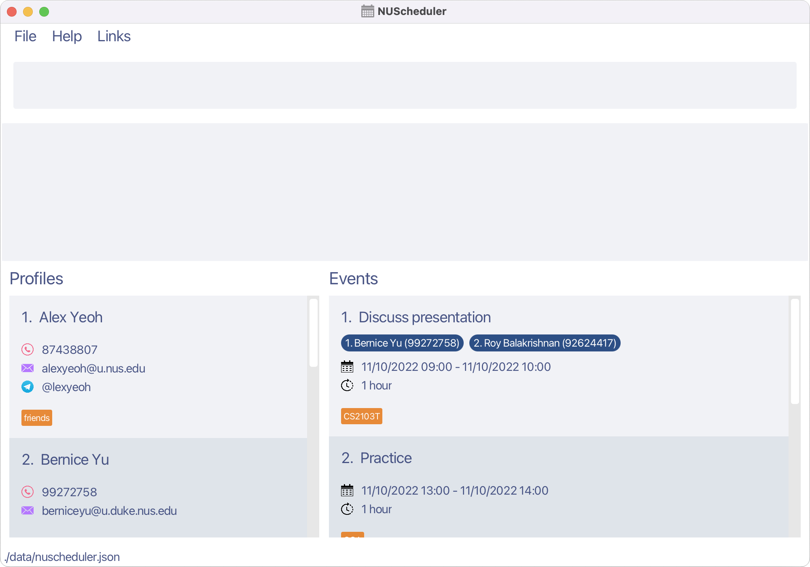
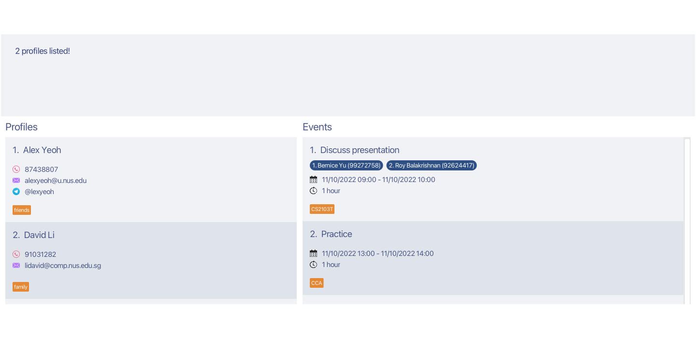
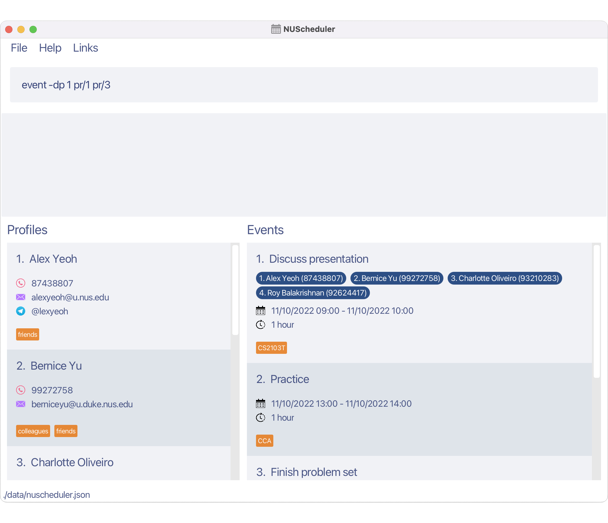
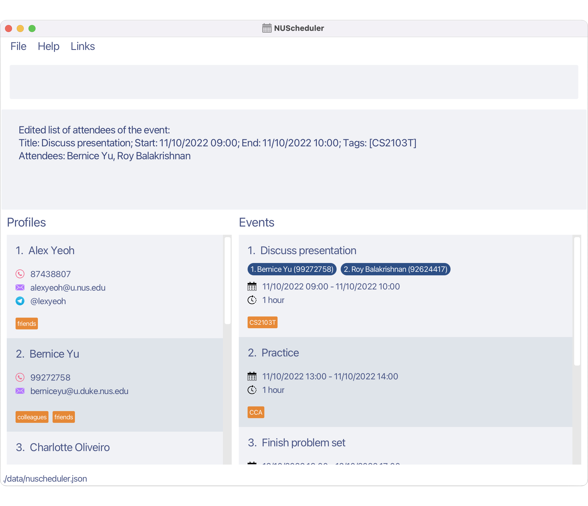
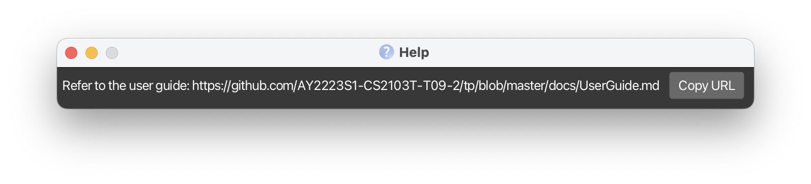

NUScheduler is a desktop app for **NUS students who have a large network of contacts to manage, optimised for use via a Command Line Interface (CLI)** while still having the benefits of a Graphical User Interface (GUI). If you can type fast, NUScheduler can get your contact management tasks done faster than traditional GUI apps.

With NUScheduler, you can store the contact details of the NUS community around you and manage your classes and events effectively.

<h2 id="toc-title" class="no-num"> Table of Contents </h2>

* Table of Contents
{:toc}

--------------------------------------------------------------------------------------------------------------------

## Using this guide

This user guide provides you with the information necessary to start using NUScheduler. 

In this user guide, you may encounter the following icons:

* :information_source: **Additional Information:** Provides general information that you might find helpful.
* :bulb: **Tips:** Provides good to know information on how to more effectively utilise NUScheduler.    

If you are a new user, check out the [Quick Start](#quick-start) to get started with NUScheduler.

If you are a returning user, the [Command Summary](#command-summary) provides you with a quick overview of some of the commands NUScheduler offers.

--------------------------------------------------------------------------------------------------------------------

## Quick start

1. Ensure you have Java `11` or above installed in your Computer.

2. Download the latest `NUScheduler.jar` from [here](https://github.com/AY2223S1-CS2103T-T17-3/tp/releases).

3. Copy the file to the folder you want to use as the _home folder_ for your NUScheduler.

4. Double-click the file to start the app. The GUI similar to the one shown below should appear. Note how the app contains some sample data. 

5. Type the command in the command box and press Enter to execute it. e.g. typing **`help`** and pressing Enter will open the help window. 
   Some example commands you can try:

   * <code class="language-plaintext highlighter-rouge"><b>profile -a</b> n/John Doe p/98765432 e/johnd@u.nus.edu t/friend</code>: Adds a profile with the name `John Doe`.

   * <code class="language-plaintext highlighter-rouge"><b>profile -d</b> 2</code>: Deletes the 2nd profile shown in the current list.

   * **`profile -v`**: Lists all profiles in NUScheduler.

6. Refer to the [Features](#features) below for details of each command.

--------------------------------------------------------------------------------------------------------------------

## User interface

The following is the main user interface of NUScheduler.

* **Menu Bar**
* **Command Box**: Enter your commands here.
* **Result Display**: Shows the details of the results of your commands.
* **Profile List**: Displays the list of profiles stored and the relevant details.
* **Event List**: Displays the list of events stored and the relevant details.

--------------------------------------------------------------------------------------------------------------------

## Features

**:information_source: Notes about the command format:** 

* Words in `UPPER_CASE` are the parameters to be supplied by the user. 
  e.g. in `add n/NAME`, `NAME` is a parameter which can be used as `add n/John Doe`.

* Items in square brackets are optional. 
  e.g `n/NAME [t/TAG]` can be used as `n/John Doe t/friend` or as `n/John Doe`.

* Items with `…`​ after them can be used multiple times, including zero times for optional items. 
  e.g. `[t/TAG]…​` can be used as ` ` (i.e. 0 times), `t/friend`, `t/friend t/family` etc.
  e.g. `pr/PROFILE_INDEX…​` must be used at least once, such as `pr/1`, `pr/3 pr/5` etc.

* For `Event` and `Profile` commands, option flags (-x where x is a placeholder for valid flags e.g. a, d, v) must be used after the `event` and `profile` command word.

* For `Event` and `Profile` commands which require an `Index`, the `Index` must be provided after the option flag.

* In addition, the `Index` provided must be a positive number less than 10000 as NUScheduler is designed to handle a maximum of 9999 entries for `Profile`s and `Event`s which covers the needs for most NUS students.

* The other parameters can be in any order. 
  e.g. if the command specifies `n/NAME p/PHONE_NUMBER`, `p/PHONE_NUMBER n/NAME` is also acceptable.

* If a parameter is expected only once in the command, but you specified it multiple times, only the last occurrence of the parameter will be taken. 
  e.g. if you specify `p/12341234 p/56785678`, only `p/56785678` will be taken.

* Command words and option flags are case-sensitive i.e. `profile -v` will work, but not `PROFILE -v` and `profile -V`. 

**:information_source: Notes about the display:** 

* `Profile`'s are listed in alphabetical order while `Event`'s are listed in chronological order, sorted by their starting date.

* Under `Profile`, the `Name`, `Email` and `PhoneNumber` will always be displayed while `Telegram` and `Tag`s will only be displayed if they exist.

* Under `Event`, the `Title`, `StartDate`, `EndDate` and duration of event will always be displayed while `Attendees`, the participants of an `Event` and `Tag`s will only be displayed if they exist.

### Profiles

Each profile is a set of contact information about a person in your NUS community.

**:information_source: Notes about profiles:** 

A profile must contain the following information:

* Name, limited to 24 alphanumeric characters including spaces
* Phone number, limited to numeric characters with at least 3 characters and at most 15 characters
* A valid NUS email, e.g. `u.nus.edu`, see [Accepted Email Formats](#accepted-email-formats) for the full list of accepted email domains

A profile may also contain:

* Telegram username
* Tags to categorise your profiles, limited to 24 characters

#### Adding a profile: `profile -a`

Adds a profile to NUScheduler.

Format: `profile -a n/NAME p/PHONE_NUMBER e/EMAIL [tg/TELEGRAM_USERNAME] [t/TAG]…`

:bulb: **Tip:**
A profile can have 0 or more tags.

Examples:
* `profile -a n/John Doe p/98765432 e/johnd@u.nus.edu t/friend`
* `profile -a n/Jane Smith e/jane_s@u.nus.edu p/91234580 tg/jane_s`
* `profile -a n/Betsy Crowe e/betsycrowe@u.nus.edu p/1234567 t/professor t/lecturer`

#### Viewing all profiles: `profile -v`

Shows a list of all profiles in the NUScheduler.

Format: `profile -v`

#### Editing a profile: `profile -e`

Edits an existing profile in NUScheduler.

Format: `profile -e INDEX [n/NAME] [p/PHONE_NUMBER] [e/EMAIL] [tg/TELEGRAM_USERNAME] [t/TAG]…`

* Edits the profile at the specified `INDEX`. The index refers to the index number shown in the displayed profile list. The index **must be a positive integer less than 10000** e.g. 1, 2, 3, …​, 9999
* At least one of the optional fields must be provided.
* Existing values will be updated to the input values.
* You can remove the profile's telegram username by typing `tg/` without specifying any username after it.
* When editing tags, the existing tags of the profile will be removed i.e adding of tags is not cumulative.
* You can remove all the profile’s tags by typing `t/` without specifying any tags after it.

Examples:
* `profile -e 1 p/91234567 e/johndoe@u.nus.edu` Edits the phone number and email address of the 1st profile to be `91234567` and `johndoe@u.nus.edu` respectively.
* `profile -e 2 n/Betsy Crower t/` Edits the name of the 2nd profile to be `Betsy Crower` and clears all existing tags.
* `profile -e 3 tg/ t/` Clears the telegram username and tags of the 3rd profile.

#### Finding profiles by name: `profile -f`

Finds profiles whose names contain any of the given keywords.

Format: `profile -f KEYWORD [MORE_KEYWORDS]…`

* The search is case-insensitive. e.g `hans` will match `Hans`
* The order of the keywords does not matter. e.g. `Hans Bo` will match `Bo Hans`
* Only the name is searched.
* Partial match will also be returned. e.g. `han` will match `hans`
* Profiles matching at least one keyword will be returned (i.e. `OR` search).
  e.g. `Hans Bo` will return `Hans Gruber`, `Bo Yang`

Examples:
* `profile -f Jane` returns `jane` and `Jane Doe`
* `profile -f alex dav` returns `Alex Yeoh`and `David Li` 
  

#### Deleting a profile: `profile -d`

Deletes a specified profile from NUScheduler.

Format: `profile -d INDEX`

* Deletes the profile at the specified `INDEX`.
* The index refers to the index number shown in the displayed profile list.
* The index **must be a positive integer less than 10000** e.g. 1, 2, 3, …​, 9999

Example:
* `profile -d 1` deletes the first profile listed.

### Events

**:information_source: Notes about events:** 

An event must contain the following information:

* Title, limited to 40 alphanumeric characters including spaces
* Start date
* End date, which must be on the same day or after the start date

An event may also contain:

* Start time
* End time
* Attendees of the event, who must exist as a `Profile` in NUScheduler.
* Tags to categorise your events, limited to 24 alphanumeric characters, with no spaces allowed

#### Adding an event: `event -a`

Adds an event with a name, a start date and end date.

Format: `event -a n/TITLE s/START e/END [t/TAG]…`

* The start and end dates can be specified in various different formats, see [Accepted Date Time Format](#accepted-date-time-formats) for the full list.
* The start and end dates must both contain either date only or date and time i.e. time is optional.
* The start date must occur before or on the same day and time as the end date.

:bulb: **Tip:**
An event can have 0 or more tags. 

Example:
* `event -a n/Presentation s/22/10/2022 e/23/10/2022 t/CS2103`

#### Adding a profile to an event: `event -ap`

Adds one or more existing profiles as attendees to an existing event in NUScheduler.

Format: `event -ap EVENT_INDEX pr/PROFILE_INDEX…​`

* Adds profiles at the specified `PROFILE_INDEX`. This index refers to the index number shown in the displayed profile list. The index **must be a positive integer less than 10000** e.g. 1, 2, 3, …​, 9999
* Profiles are added to the event at the specified `EVENT_INDEX`. This index refers to the index number shown in the displayed event list. It follows the same constraints as `PROFILE_INDEX`.
* At least one `PROFILE_INDEX` must be provided.
* Existing attendees will not be overwritten i.e. adding of profiles is cumulative.
* If one or more or all of the specified profiles have already been added to the event, the command still executes successfully.

:bulb: **Tip:**
If a profile has been added to an event as an attendee, deleting the profile from NUScheduler will delete the profile from the event as well.

Example:
* `event -ap 1 pr/1 pr/2` adds the first and second profiles listed to the first event listed.

#### Deleting an attendee from an event: `event -dp`

Removes one or more attendees from an existing event in NUScheduler.

Format: `event -dp EVENT_INDEX pr/ATTENDEE_INDEX…​`

* Removes attendees at the specified `ATTENDEE_INDEX`. This index refers to the index number shown in the displayed attendee list of the event. The index **must be a positive integer less than 10000** e.g. 1, 2, 3, …​, 9999
* Attendees are removed from the event at the specified `EVENT_INDEX`. This index refers to the index number shown in the displayed event list. It follows the same constraints as `ATTENDEE_INDEX`.
* At least one `ATTENDEE_INDEX` must be provided.

Example:
* `event -dp 1 pr/1 pr/3`

Note how the first and third attendee under the first listed event `Discuss presentation` have been deleted.

#### Viewing upcoming events: `event -u`

Displays a list of upcoming events, ordered by the date, which starts in the next specified number of days.

Format: `event -u DAYS`

* The days refer to the number of days after the current date. All events that start within this time frame will be displayed. Events occurring on the day the command is entered will not be displayed.
* The days **must be a positive integer less than 10000** e.g. 1, 2, 3, …​, 9999.

**:information_source: Notes about usage:** 

* DAYS entered is limited to 9999 days as this sufficiently covers the usage for most NUS students.

Example:
* `event -u 5` when used on `22-10-2022` displays all events taking place in the next 5 days from `23-10-22` to `27-10-22` with both dates included.

#### Viewing all events: `event -v`

Shows a list of all events in the NUScheduler.

Format: `event -v`

#### Editing an event: `event -e`

Edits an existing event in NUScheduler.

Format: `event -e INDEX [n/TITLE] [s/START] [e/END] [t/TAG]…`

* Edits the event at the specified `INDEX`. The index refers to the index number shown in the displayed event list. The index **must be a positive integer less than 10000** e.g. 1, 2, 3, …​, 9999
* At least one of the optional fields must be provided.
* Existing values will be updated to the input values.
* When editing tags, the existing tags of the event will be removed i.e adding of tags is not cumulative.
* You can remove all the event’s tags by typing `t/` without specifying any tags after it.
* The start and end dates can be specified in [various formats](#accepted-date-time-formats).

Example:
* `event -e 1 n/Formal Dinner t/RC4` Edits the title of the first event in the displayed list to `Formal Dinner` and clears existing tags before adding the tag `RC4`.

#### Finding events by date or title: `event -f`

Finds events whose title contain any of the given keywords or start times contain any of the given start times.

Format: `event -f KEYWORD_OR_DATE [MORE_KEYWORDS_OR_DATES]…`

* Date search will occur when all inputs are [valid dates](#accepted-date-time-formats), otherwise, keyword search will occur.
* The date search occurs only by date, ignoring the time, e.g. `11/10/2022 08:00` will match any events that start on `11/10/2022`.
* The keyword search is case-insensitive. e.g `birthday` will match `Birthday`.
* The order of the keywords does not matter. e.g. `one two` will match `two one`.
* Partial match will also be returned. e.g. `inter` will match `interview`
* Events matching at least one keyword will be returned (i.e. `OR` search) e.g. `interview meeting` will return `Meeting Tom`, `Job Interview`.

Example:
* `event -f Presentation` Displays all events with `Presentation` within the event title.
* `event -f 20/11/2022 05/10/2022` Displays all events that start on either `20/11/2022` or `05/10/2022`.

#### Deleting an event: `event -d`

Deletes a specified event from NUScheduler.

Format: `event -d INDEX`

* Deletes the events at the specified `INDEX`.
* The index refers to the index number shown in the displayed event list.
* The index **must be a positive integer less than 10000** e.g. 1, 2, 3, …​, 9999

Example:
* `event -v` followed by `event -d 2` deletes the 2nd event displayed.

### General

#### Viewing help: `help`

Opens a help window displaying all the recognised commands, and a link to access the user guide.

Format: `help`

:bulb: **Tip:**
Open the help window using <kbd>F1</kbd> on your keyboard

#### Clearing all profiles and events: `clear`

Clears all profiles and events from the NUScheduler.

Format: `clear`

#### Exiting the program: `exit`

Exits the program.

Format: `exit`

### Advanced Features

#### Session-Based Command History

Access the previous commands you've made within each session.

* Use the up arrow key, <kbd>&#8593;</kbd> to navigate to the previous command.
* Use the down arrow key, <kbd>&#8595;</kbd> to navigate to the next command.

:information_source: **Notes about the command history**:

* Only successful commands are tracked, commands that result in an error are not stored.
* Every time NUScheduler is closed, the command history is reset.
* Edits made on the command history are not tracked.

#### Tag Shortcuts

Use shortcuts to quickly enter tags.

Example: 

* `profile -a n/Damith e/damith@comp.nus.edu.sg p/65164359 t/prof` Creates a profile with the name `Damith` and tag `professor`.
* `event -e 1 t/tut` Edits the tag of the 1st event shown to `tutorial`.  

| Shortcut | Result       | 
|----------|--------------|
| assm     | assignment   |
| lec      | lecture      |
| pres     | presentation |
| prof     | professor    |
| rec      | recitation   |
| ta       | tutor        |
| tut      | tutorial     |

#### Quick Links

Get easy access to some of your favourite NUS websites, right from the menu.

1. Click on `Links` in the menu bar. A dropdown should appear.
2. Click on the link you want to visit, if you want to visit `Canvas`, click on `Canvas`.
3. The website should open in your browser.

:bulb: **Tips:**

* Press <kbd> F2 </kbd> to open LumiNUS.
* Press <kbd> F3 </kbd> to open Canvas.
* Press <kbd> F4 </kbd> to open EduRec.

--------------------------------------------------------------------------------------------------------------------

## FAQ

### Accepted Date Time Formats

NUScheduler accepts date-time formats both with and without a time specified. For example, date-only formats can be used to specify all day events.

#### Date-only formats

- `DAY/MONTH/YEAR`
- `DAY-MONTH-YEAR`
- `YEAR/MONTH/DAY`
- `YEAR-MONTH-DAY`
- `DAY/MONTH` (uses current year by default)
- `DAY-MONTH` (uses current year by default)

**:information_source: Notes about the date format:** 

* `DAY` can be specified with either one or two digits. e.g. `5` and `05` both refer to the same day.
* `MONTH` can be specified with either digits or letters. e.g. `3`, `03`, `mar` and `march` all refer to the same month.
* `YEAR` must be specified with four digits. e.g. `2022`

#### Date time formats

The following time formats can be appended after a whitespace to the end of the above date formats.

- `HOUR:MINUTE`
- `HOURMINUTE`

Example:
* `25/05/2015 10:00`
* `4-July-2022 2100`

**:information_source: Notes about the date format:** 

* Time is specified in the 24-hour clock format.
* `HOUR` and `MINUTE` must be specified using two digits.
* The time `2400` or `24:00` is the same as `0000` and `00:00`, i.e. it will be recognised as **the same day**.

### Accepted email formats

NUScheduler checks the emails of your profiles against a list of valid NUS email domains.

* `@u.nus.edu`
* `@u.duke.nus.edu`
* `@nus.edu.sg`
* `@comp.nus.edu.sg`
* `@u.yale-nus.edu.sg`

### Transfer data to another computer

You can simply install the app in the other computer and overwrite the data file it creates with the file that contains the data of your previous NUScheduler home folder.

--------------------------------------------------------------------------------------------------------------------

## Command summary

| Action                             | Format, Examples                                                                       |
|------------------------------------|----------------------------------------------------------------------------------------|
| **Add Profile**                    | `profile -a n/NAME p/PHONE_NUMBER e/EMAIL [tg/TELEGRAM_USERNAME] [t/TAG]…`             |
| **Delete Profile**                 | `profile -d INDEX`                                                                     |
| **Edit Profile**                   | `profile -e INDEX [n/NAME] [p/PHONE_NUMBER] [e/EMAIL] [tg/TELEGRAM_USERNAME] [t/TAG]…` |
| **View Profiles**                  | `profile -v`                                                                           |
| **Find Profile**                   | `profile -f KEYWORD [MORE_KEYWORDS]…`                                                  |
| **Add Event**                      | `event -a n/TITLE s/START e/END [t/TAG]…`                                              |
| **Add Profiles to an Event**       | `event -ap EVENT_INDEX pr/PROFILE_INDEX…`                                              |
| **Delete Attendees from an Event** | `event -dp EVENT_INDEX pr/ATTENDEE_INDEX…`                                             |
| **Delete Event**                   | `event -d INDEX`                                                                       |
| **Edit Event**                     | `event -e INDEX [n/TITLE] [s/START] [e/END] [t/TAG]…`                                  |
| **View Events**                    | `event -v`                                                                             |
| **View Upcoming Event(s)**         | `event -u DAYS`                                                                        |
| **Find Event**                     | `event -f KEYWORD_OR_DATE [MORE]…`                                                     |
