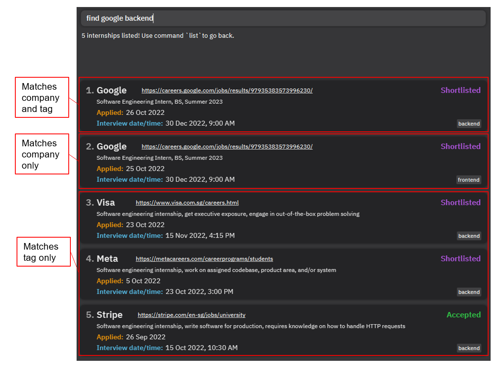

FindMyIntern helps students who are applying for internships keep track of their applications. It allows students to consolidate all these applications into a single place, manage these applications, and visualise their application statuses.
## Table of Contents
- [Quick Start](#quick-start)
- [Features](#features)
    - [Adding an internship application: `add`](#adding-an-internship-application-add)
    - [Editing an internship application: `edit`](#editing-an-internship-application-edit)
    - [Marking an internship application status: `mark`](#marking-an-internship-application-status-mark)
    - [Listing all internship applications: `list`](#listing-all-internship-applications-list)
    - [Deleting an internship application: `delete`](#deleting-an-internship-application-delete)
    - [Filtering for internship applications of a specified status: `filter`](#filtering-for-internship-applications-of-a-specified-status-filter)
    - [Finding for an internship application: `find`](#finding-for-internship-applications-or-tags-find)
    - [Exiting the program: `exit`](#exiting-the-program-exit)
    - [Saving the data](#saving-the-data)

--------------------------------------------------------------------------------------------------------------------

## Quick start

1. Ensure you have Java `11` or above installed in your Computer.

1. Download the latest `findmyintern.jar` from [here](https://github.com/AY2223S1-CS2103T-T14-1/tp/releases).

1. Copy the file to the folder you want to use as the _home folder_ for your FindMyIntern.

1. Double-click the file to start the app. The GUI similar to the below should appear in a few seconds. Note how the app contains some sample data. 
   

1. Type the command in the command box and press Enter to execute it. e.g. typing **`list`** and pressing Enter will list all internship applications. 
   Some example commands you can try:

   * **`add c/Apple l/https://jobs.apple.com/en-sg d/Software Engineering Internship a/11/10/2022`** :
     Adds an internship application for Apple to the tracker.

   * **`mark 3 s/interviewed`** : Marks the 3rd application shown in the current list as interviewed.

   * **`list`** : Lists all internship applications.

   * **`delete 3`** : Deletes the 3rd application shown in the current list.

   * **`find shopee`** : Finds an internship application called Shopee in the tracker.
   
   * **`filter rejected`** : Filters the tracker for internship applications with rejected status.

   * **`exit`** : Exits the app.

1. Refer to the [Features](#features) below for details of each command.

--------------------------------------------------------------------------------------------------------------------

## Features

### Viewing help: `help`

Shows a message explaning how to access the help page.

Format: `help`

### Adding an internship application: `add`

Adds an internship application to the tracker.

Format: `add c/COMPANY l/LINK d/DESCRIPTION a/APPLIED_DATE [i/INTERVIEW_DATE_TIME] [t/TAG]…`

* Default application status is "Applied".
* `APPLIED_DATE` must be one of these formats:
  * `d MMM yyyy` (7 Oct 2022)
  * `d/M/yyyy` (7/10/2022).
* `INTERVIEW_DATE_TIME` is optional, but if included, will automatically change application status to "Shortlisted".
* `INTERVIEW_DATE_TIME` must be one of these formats:
  * `d MMM yyyy HH:mm` (7 Oct 2022 15:00)
  * `d/M/yyyy HH:mm` (7/10/2022 15:00)
  * `d MMM yyyy, h:mm a` (7 Oct 2022, 3:00 pm)
  * `d/M/yyyy, h:mm a` (7 Oct 2022, 3:00 pm)
* The year can be omitted from `APPLIED_DATE` and `INTERVIEW_DATE_TIME` to default to current year.
* `TAG` is optional, but can be used multiple times.

Examples:
* `add c/Apple l/https://jobs.apple.com/en-sg d/Software engineering internship a/11/10/2022`
* `add c/Grab l/https://grab.careers/teams/campus d/Marketing internship a/11 Oct i/23 Nov, 3:00 pm`

### Editing an internship application: `edit`

Edits an existing internship application in the tracker.

Format: `edit INDEX [c/COMPANY] [l/LINK] [d/DESCRIPTION] [a/APPLIED_DATE] [i/INTERVIEW_DATE_TIME] [t/TAG]…`

* Edits the internship application at the specified `INDEX`. The index refers to the index number shown in the displayed
  internship application list. The index **must be a positive integer** 1, 2, 3 ...
* At least one of the optional fields must be provided.
* When editing `INTERVIEW_DATE_TIME`, the application status will change to "Shortlisted".
    * `INTERVIEW_DATE_TIME` must be one of these formats:
        * `d MMM yyyy HH:mm` (7 Oct 2022 15:00)
        * `d/M/yyyy HH:mm` (7/10/2022 15:00)
        * `d MMM yyyy, h:mm a` (7 Oct 2022, 3:00 pm)
        * `d/M/yyyy, h:mm a` (7 Oct 2022, 3:00 pm)
* When editing tags, the existing tags will removed and replaced with the input tags.
* Tags can be removed by typing `t/` without specifying any tags after it.

Examples:
* `edit 1 d/Data analyst intern` - Edits the description of the 1st internship application
  in the list to `Data analyst intern`.
* `edit 2 i/23/11/2022 15:00` - Edits the interview date/time of the 2nd internship application
  to `23 Nov 2022, 3:00 PM`, and changes the application status to "Shortlisted".
* `edit 3 t/frontend t/summer` - Edits the tags of the 3rd internship application, removing existing tags and
  adding `frontend` and `summer` tags

### Marking an internship application status: `mark` 

Marks an internship application status as "applied", "shortlisted", "interviewed", "accepted", or "rejected".

Format: `mark INDEX s/APPLICATION_STATUS`

* Updates the internship application at the specified `INDEX`. The index refers to the index number shown in the displayed 
  internship application list. The index **must be a positive integer** 1, 2, 3 ...

* Updates the internship application to the specified `APPLICATION_STATUS`. 
  The application status refers to the current status of the application. 
  The status **must be one of the following**:
  * `applied`
  * `shortlisted`
  * `interviewed`
  * `accepted`
  * `rejected`

Examples:
* `mark 3 s/interviewed` - Marks the 3rd internship application status to be `interviewed`
* `mark 2 s/accepted` - Marks the 2nd internship application status to be `accepted`

### Listing all internship applications: `list`

Shows a list of all internship applications.

Format: `list`

### Deleting an internship application: `delete`

Deletes an internship application.

Format: `delete INDEX`

* Deletes the internship application at the specified `INDEX`.
* The `INDEX` refers to the index number shown in the displayed internship application list.
* The index **must be a positive integer** 1, 2, 3, …

Examples:
*  `delete 4` - Deletes the 4th internship application in the list.

### Filtering for internship applications of a specified status: `filter`

Format: `filter APPLICATION_STATUS`

* Filters for internship applications of the specified `APPLICATION_STATUS`.

Examples:
* `filter accepted` - Shows a list of internship applications marked as `accepted`
* `filter rejected` - Shows a list of internship applications marked as `rejected`

### Finding for internship applications or tags: `find`

Finds internship applications and tags which contain any of the given keywords.

Format: `find KEYWORD [MORE_KEYWORDS]…`

* The search is case-insensitive e.g `google` will match `Google`
* Partial words will be matched e.g. `goo` will match `Google`

Examples:
* `find tiktok` returns internship application(s) and tag(s) containing `tiktok`
* `find google backend` returns internship application(s) and tag(s) containing `google` and `backend`

### Exiting the program: `exit`

Exits the program.

Format: `exit`

### Saving the data

FindMyIntern data is saved in the hard disk automatically after any command that changes the data. There is no need to save manually.

--------------------------------------------------------------------------------------------------------------------

## FAQ

**Q**: How do I transfer my data to another Computer? 
**A**: Install the app in the other computer and overwrite the empty data file it creates with the file that contains the data of your previous FindMyIntern home folder.

--------------------------------------------------------------------------------------------------------------------

## Command summary

Action | Format, Examples
--------|------------------
**Help** | `help`
**Add** | `add c/COMPANY l/LINK d/DESCRIPTION a/APPLIED_DATE [i/INTERVIEW_DATE_TIME] [t/TAG]…`   e.g., `add c/Apple l/https://jobs.apple.com/en-sg d/Software engineering internship a/11/10/2022`
**Mark** | `mark INDEX s/APPLICATION_STATUS`   e.g., `mark 3 s/interviewed`
**List** | `list`
**Delete** | `delete INDEX`   e.g., `delete 4`
**Filter** | `filter APPLICATION_STATUS`   e.g., `filter accepted`
**Find** | `find KEYWORD [MORE_KEYWORDS]…`  e.g., `find google`
**Exit** | `exit`
