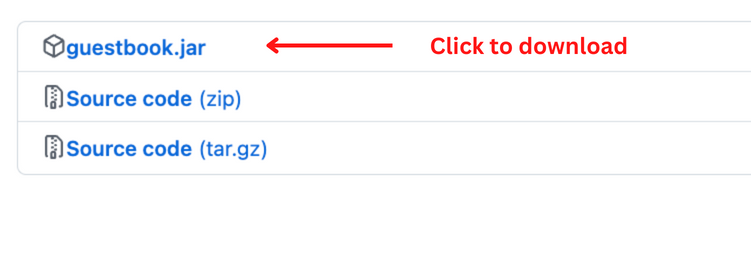

## Introduction

GuestBook is a **hotel management application** that aims to revolutionise the small
hotel and backpacker's inn industry. 
As a **hotel manager**, capitalise on
GuestBook's **efficient management style** to save you time. You can use GuestBook to manage your guests and
their details with just your keyboard, literally all in the palm of your hands! 
By using our features, your essential hotel management needs are taken care of.
With GuestBook, managing guests have never been easier. 

This user guide will ease you in using GuestBook and guide you along to incorporate GuestBook
in your management workflow. It provides an in-depth description of GuestBook's core features 
and how to best use them to suite your needs. With our intuitive design, you will become 
a master at using GuestBook in no time!

<div style="page-break-after: always;"></div>

--------------------------------------------------------------------------------------------------------------------

## Table of Contents
* Table of Contents
{:toc}

--------------------------------------------------------------------------------------------------------------------
## How to use the User Guide

* For a quick and easy way to **get started** with GuestBook, you can visit the [Quick Start](#quick-start) section.
* To **understand the terms** we use in GuestBook, you can visit the [Glossary](#glossary) section.
* To see the **amazing features** that GuestBook provides and how to use them, you can visit the [Features](#features) section.
* Having **issues**? You can check out the [FAQ](#faq) section to see find solutions to your issues.
* Have a **question** for us? Feel free to [contact us](#contact-us), and we will do our best to assist you.

<div markdown="block" class="alert alert-success">

**:bulb: Tip:**<br>
* As there is a lot of content covered in this guide, it would be good to browse through
the contents once first. This will give you a clearer idea of how GuestBook functions. After which,
go in-depth into the sections you are interested to learn more about.
* Some information (e.g., constraints of fields) are placed in separate sections to prevent information overload.
By following this incremental approach, we hope to make the content more digestible for you.
</div>

### Style Guide

These styles below are consistently used throughout this user guide. This section hopes to provide
you with a better understanding on how to interpret these formats.
* [Phrases in blue](#style-guide) mean that they are hyperlinked to a 
section of this user guide or to an external website.
* `Coded phrases` surrounded by a block indicate they are technical terms such as GuestBook commands.
* **Bolded phrases** are key terms that you should pay attention to.
* _Italicised phrases_ are used to highlight phrases that are part of an example.

[Return to Table of Contents](#table-of-contents)

--------------------------------------------------------------------------------------------------------------------

## Components of the User Interface

### Locations of the components


### Use of the components

| Component                              | Use                                                                                                                                                               |
|----------------------------------------|-------------------------------------------------------------------------------------------------------------------------------------------------------------------|
| **Command Box**                        | This is where you **enter commands**.                                                                                                                             |
| **Result Display**                     | This is where the detailed **results** of the command will be shown.                                                                                              |
| **Guest Card**                         | This is where all **guest information** of a guest will be shown.                                                                                                 |
| **Status Bar**                         | This shows the location of your **save file**.                                                                                                                    |
|              | This is the **phone number** of the guest.                                                                                                                        |
|              | This is the **email address** of the guest.                                                                                                                       |
|                | This is the **room** the guest is staying in.                                                                                                                     |
|      | These are the **dates of stay** of the guest.                                                                                                                     |
|     | This is the total **number of guests** in the guest's room.                                                                                                       |
|  | This shows whether the guest's **room has been cleaned**. **Green** means that the room has been cleaned while **red** means that the room has yet to be cleaned. |
|                | This is the current **bill** of the guest.                                                                                                                        |
|          | This shows any **requests** made by the guest.                                                                                                                    |

[Return to Table of Contents](#table-of-contents)

--------------------------------------------------------------------------------------------------------------------

## Quick start

1. Ensure you have `Java 11` or above installed in your Computer.
   * If you are using Mac, open the `Terminal` and enter `java --version`.
     * To open the `Terminal`, press `command` and `space bar` together to launch Spotlight.
     * Following, enter `terminal` in the search bar.
   * If you are using Windows, open the `Command Prompt` and enter `java -version`. 
     * To open the `Command Prompt`, press `Windows` and `R` together to launch the "Run" box.
     * Following, enter `cmd` and click `OK`. 
   * If java is installed, you would get a similar output as shown below. You can continue to step 2.
   (Do not worry about what the message says, it is not crucial to learn how to use GuestBook.)
   ```
    openjdk 11.0.16.1 2022-07-19 LTS
    OpenJDK Runtime Environment Zulu11.58+23-CA (build 11.0.16.1+1-LTS)
    OpenJDK 64-Bit Server VM Zulu11.58+23-CA (build 11.0.16.1+1-LTS, mixed mode)
   ```
   * Else, if `Java 11` is not installed, an error message will appear as shown below.
   ``` 
   'java' is not recognized as an internal or external command, operable
    program or batch file.
   ```
   * Follow these [instructions](https://www.oracle.com/sg/java/technologies/downloads/) to 
   download Java and return to step 1 once you have completed them. <br><br>

2. Download the latest `guestbook.jar` from [here](https://github.com/AY2223S1-CS2103T-W16-1/tp/releases). <br> <br>
    <br><br>

3. Copy the file to the folder you want to use as the **home folder** for your GuestBook. <br> <br>
    <br><br>

4. Double-click on `guestbook.jar` to start the app. 
   * Alternatively, if you wish to use the `Terminal` or `Command Prompt`, enter 
   `java -jar guestbook.jar` to start the app. 

   The GUI, similar to the image below, should pop up in a few seconds. Note that the GuestBook
   comes prepackaged with **sample data**.<br><br>
    <br><br>

5. Type the command in the command box and press Enter to execute it. E.g., typing **`help`** and pressing Enter will open the help window.<br><br>

6. To kickstart your journey, you can add a guest, _John Doe_, to GuestBook using the **`add`** command.
   * **`add`** `n/John Doe p/98765432 e/johnd@example.com rm/05-73 dr/13/09/22 - 15/09/22 ng/3 rq/Extra towels`: Adds a guest named _John Doe_ to GuestBook. 
<br><br>
    
7. To find _John Doe_, you can use the **`find`** command, and search through **any of _John Doe's_ fields**,
   such as his `name` or `room`. The command below can help you find guests that match the keywords you entered. For example,
   * **`find`** `John Doe` : Finds all the guests who have at least one field containing _John_ or _Doe_ (case-insensitive).
     <br><br>

8. To make changes to _John Doe_, you can use the **`edit`** command. This changes the guest's fields based on the new values you provide. The other values will remain unchanged. <br>
For example, if _John Doe_ is the second guest in the list, and you want to change his room number to _05-55_, you can do this.
    * **`edit`** `2` `rm/05-55`: Changes the `Room` of _John Doe_ to _05-55_ in GuestBook.
      <br><br>
   
9. After executing a **`find`** command, you might realise that some of your guests are no longer visible, as they are not in the current list.<br>
To see a list of all your guests, you can use the **`list`** command.
      * **`list`**: List all the guests in GuestBook.
        <br><br>

10. In the event that a guest orders room service, you can add charges to the guest's bill using the **`bill`** command.<br>
For example, you can charge the third guest _30.35_ by running the command below.
    * **`bill`** `3` `b/+30.35`: Adds _30.35_ to the `bill` of the third guest.
      <br><br>

11. When a guest checks out of your hotel, you can remove the guest using the **`delete`** command.
For example, you can check out the third guest by executing the command below.
    * **`delete`** `3` : Deletes the third guest shown in the current list.
          <br><br>

12. To clear your GuestBook of all entries, you can use the **`clear`** command.<br>
    * **`clear`** : Deletes all guests.
    <div markdown="block" class="alert alert-danger">
    
    :bangbang: **Warning:**<br>
    * Do note that this command is **irreversible**. Once cleared, all the
      guest data cannot be retrieved. Please use this command
      with utmost caution.
    </div>
    
13. Finally, to quit GuestBook, you can run the **`exit`** command.
    * **`exit`** : Exits the app.
      <br><br>
    
14. For more details, you can refer to the [Features](#features) below for the exact specifications of each command. Thank you and we hope you enjoy using GuestBook!
    <br><br>
[Return to Table of Contents](#table-of-contents)

--------------------------------------------------------------------------------------------------------------------

## Glossary

From this glossary section onwards, we will go into a deep dive of the commands of GuestBook. As there are
some technical terms present in the descriptions below, we have provided their definitions (contextualised
to GuestBook) for you to get acquainted with. 

| Term             | Definition                                                                                                                                          |
|------------------|-----------------------------------------------------------------------------------------------------------------------------------------------------|
| **Alphanumeric** | Refers to characters that are numbers **0-9** and alphabets **A-Z**, both uppercase and lowercase.                                                  |
| **dd/MM/yy**     | Refers to the date format, where dd stands for 2 digit days, 2 digit months and the last 2 digits for the year and they must be separated by a "/". |
| **Guest**        | A guest staying at the hotel.                                                                                                                       |
| **GUI**          | Stands for Graphical User Interface, it refers to an interface that allows users to interact with the system through friendly visuals.              |
| **Hard disk**    | A data storage device used to store and retrieve data.                                                                                              |
| **Index**        | The number that corresponds to the position of the Guest in the list. The index **must be a positive integer** like 1, 2 or 3.                      |
| **Java**         | A programming language used to run GuestBook.                                                                                                       |
| **JSON file**    | Stands for JavaScript Object Notation. It refers to a file format to store data.                                                                    |

[Return to Table of Contents](#table-of-contents)

--------------------------------------------------------------------------------------------------------------------

## Features

<div markdown="block" class="alert alert-info">

**:information_source: Notes about the command format:**<br>

There are some conventions the commands follow. We have laid them out here in hopes that it will
aid you in understanding their significance.

* Words in `UPPER_CASE` are the **parameters** to be supplied by you, the user.<br>
  E.g., In `add n/NAME`, `NAME` is a parameter which can be used as `add n/John Doe`.


* Items in square brackets are **optional**.<br>
  E.g., `n/NAME [rq/REQUEST]` can be used as `n/John Doe rq/Extra towels` or as `n/John Doe`.


* Parameters can be in **any order**.<br>
  E.g., If the command specifies `n/NAME p/PHONE`, `p/PHONE n/NAME` is also acceptable.


* If a parameter is expected only once but is specified multiple times in the command, only the **last occurrence** of the parameter will be considered.<br>
  E.g., If you specify `p/12341234 p/56785678`, only `p/56785678` will be taken.


* Extraneous parameters for commands that do not take in parameters (such as `help`, `list`, `exit` and `clear`) will be **ignored**.<br>
  E.g., If the command specifies `help 123`, it will be interpreted as `help`.

</div>

### Adding a guest: `add`

This command adds a guest to GuestBook.

This command is typically used to **check a guest in** to your hotel with their personal and room details.

**Format**: `add n/NAME p/PHONE e/EMAIL rm/ROOM dr/DATE_RANGE ng/NUMBER_OF_GUESTS [rq/REQUEST]`

<div markdown="block" class="alert alert-info">

**:information_source: Additional information:**

* Refer to the [Field summary](#field-summary) for more information about the limitations
  of each field.
* Please note that if you are specifying the `name`/`request` fields, ensure that they do not contain any field prefixes after whitespace in their content (e.g., `rq/Extra bed & p/c`), as GuestBook could be parsing part of your input as another field. Consider using capital letters as this check is case-sensitive (`rq/Extra bed & P/C` will be parsed correctly).
</div>

**Examples**:
* `add n/John Doe p/98765432 e/johnd@example.com rm/05-73 dr/19/05/22 - 24/05/22 ng/3` Adds the guest _John Doe_, with his details, to GuestBook.
* `add n/Betsy Crowe p/82297553 e/betsycrowe@example.com rm/Aloha5 dr/10/01/12 - 11/01/12 ng/1 rq/Extra towels` 
Adds the guest _Betsy Crowe_ to GuestBook, with the `request` to have _extra towels in her room_.


[Return to Table of Contents](#table-of-contents)

--------------------------------------------------------------------------------------------------------------------

### Editing a guest: `edit`

This command edits an existing guest in GuestBook.

This command is typically used to **amend a mistake** when keying in the details of the guest. Another common use of this
command is to **change the room clean status** of a guest's room's after it has been cleaned.

The guest specified at the `INDEX` is the guest you wish to edit in the current list. The existing values will be **updated** to the new values
you provide. The values that you **did not specify** to edit will remain **unchanged**.

**Format**: `edit INDEX [n/NAME] [p/PHONE] [e/EMAIL] [rm/ROOM] [dr/DATE_RANGE] [ng/NUMBER_OF_GUESTS] [rc/IS_ROOM_CLEAN] [rq/REQUEST]`

<div markdown="block" class="alert alert-info">

**:information_source: Additional information:**<br>

* Refer to the [Field summary](#field-summary) for more information about the limitations
  of each field.
* Please note that if you are specifying the `name`/`request` fields, ensure that they do not contain any field prefixes after whitespace in their content (e.g., `rq/Extra bed & p/c`), as GuestBook could be parsing part of your input as another field. Consider using capital letters as this check is case-sensitive (`rq/Extra bed & P/C` will be parsed correctly).
</div>

**Examples**:
*  `edit 1 p/91234567 e/johndoe@example.com` Edits the `phone number` and `email address` of the first guest to _91234567_ and _johndoe@example.com_ respectively.
*  `edit 2 n/Betsy Crower` Edits the `name` of the second guest to _Betsy Crower_.

<div markdown="block" class="alert alert-success">

**:bulb: Tip:**<br>

* You can more accurately edit your guests by first searching for them 
using the [find command](#locating-guests) and then editing them accordingly!
</div>

[Return to Table of Contents](#table-of-contents)

--------------------------------------------------------------------------------------------------------------------

### Billing a guest: `bill`

This command updates the bill of a guest in GuestBook. Note that the bill here refers to the **total additional charges incurred**
by the guest during their stay at your hotel and should **not include the cost of the room booking**.

This command updates the bill of the guest at the specified `INDEX` of the current list. 
Depending on the sign (`+` or `-`) of your input, the existing bill value will be **increased** 
or **decreased** respectively by the value you provide.

**Format**: `bill INDEX b/BILL`

<div markdown="block" class="alert alert-info">

**:information_source: Additional information:**<br>

* Refer to the [Field summary](#field-summary) for more information about the limitations
  of each field.
</div>

**Examples**:
* `bill 1 b/+99.99` or `bill 1 b/99.99` Adds _99.99_ to the `bill` of the first guest.
* `bill 2 b/-10` Subtracts _10_ from the `bill` of the second guest.

<div markdown="block" class="alert alert-warning">

:triangular_flag_on_post: **Common mistakes:**<br>

* Missing out the `b/` prefix in the bill command.
* Editing the bill using the `edit` command instead of the `bill` command.
</div>

[Return to Table of Contents](#table-of-contents)

--------------------------------------------------------------------------------------------------------------------

### Locating guests: `find`

This command locates guests whose details contain any of the given keywords. 
This allows you to search through all guests' fields.

This command is typically used when searching for a guest of a **specific characteristic**.
For example, the command `find no` will display all 
the rooms that have room clean statuses set to `no`. Likewise, the command `find yes`
will display all rooms that have been cleaned. 

**Format**: `find KEYWORD [MORE_KEYWORDS]`

<div markdown="block" class="alert alert-info">

**:information_source: Notes about using `find`:**<br>
* The search is **case-insensitive**. E.g., `hans` will match `Hans`
* The order of the keywords does not matter. E.g., `Hans Bo` will match `Bo Hans`
* **Only full words** will be matched E.g., `Han` will not match `Hans`
* Guests matching **at least one** keyword will be returned (i.e. `OR` search).
  E.g., `Hans Bo` will return `Hans Gruber`, `Bo Yang`
</div>

**Examples**:
* `find John` returns _john_ and _John Doe_
* `find alex 99272758 03-68` returns _Alex Yeoh_, _Bernice Yu_, _Charlotte Oliveiro_
(refer to the image below for the details of the guests)<br>
<br>

  

<div markdown="block" class="alert alert-warning">

:triangular_flag_on_post: **Common mistake:**<br>
* Searching for guests using incomplete keywords e.g. `170` will **not match** `170.00`.
</div>

[Return to Table of Contents](#table-of-contents)

--------------------------------------------------------------------------------------------------------------------

### Listing all guests: `list`

This command displays a list of all guests in GuestBook.

<div markdown="block" class="alert alert-success">

:bulb: **Tip:**<br>

* This command is especially useful if you would like to view the original guest list after
using the `find` command as a filter.
</div>

**Format**: `list`

[Return to Table of Contents](#table-of-contents)

--------------------------------------------------------------------------------------------------------------------

### Deleting a guest: `delete`

This command deletes an existing guest in GuestBook from the current list.

The guest specified at the `INDEX` is the guest you wish to delete. 

This command is typically used when a guest has checked out of the hotel. 

<div markdown="block" class="alert alert-danger">

:bangbang: **Warning:**<br>

* Do note that the `delete` command is **irreversible**. Once deleted, the specific 
guest's data cannot be retrieved. Please use this
command with caution.
</div>

**Format**: `delete INDEX`

**Examples**:
* `list` followed by `delete 2` deletes the second guest in GuestBook.

* `find Betsy` followed by `delete 1` deletes the first guest in the results of the `find` command.

[Return to Table of Contents](#table-of-contents)

--------------------------------------------------------------------------------------------------------------------

### Marking all rooms as unclean: `markroomsunclean`

This command functions to mark the room clean statuses of all guests as `no`.

This command is typically used at the **end or the start** of the day when the hotel manager wishes to 
update **all the room clean statuses** to `no` efficiently. This clean slate would allow the hotel 
managers to keep track of the rooms that are cleaned or uncleaned for the day.

**Format**: `markroomsunclean`

<div markdown="block" class="alert alert-warning">

:triangular_flag_on_post: **Common mistakes:**<br>

* Missing out the `s`: `markroomunclean`.
* Capitalising the `R` or `U`: `markRoomsUnclean`.
</div>

[Return to Table of Contents](#table-of-contents)

--------------------------------------------------------------------------------------------------------------------

### Clearing all entries: `clear`

This command clears **all entries** from GuestBook. 

This command is typically used as a **hard reset** of all guest data in GuestBook. You should not be using
this command unless you want to star the GuestBook on a clean slate.

<div markdown="block" class="alert alert-danger">

:bangbang: **Warning:**<br>

* Do note that this command is **irreversible**. Once cleared, all the 
guest data cannot be retrieved. Please use this command
with utmost caution.
</div>

**Format**: `clear`

[Return to Table of Contents](#table-of-contents)

--------------------------------------------------------------------------------------------------------------------

### Viewing help: `help`

This command shows a message explaining how to access the **help page**, which is this user guide you are reading.

While using GuestBook, there may be instances where you would like to refer to this user guide. As such, to help
save time, we have provided quick access to this user guide by entering the `help` command.


**Format**: `help`

[Return to Table of Contents](#table-of-contents)

--------------------------------------------------------------------------------------------------------------------

### Exiting the program: `exit`

This command exits the program.

This command is used once you have finished with the administrative tasks on GuestBook. Do not worry, 
all the data have already been saved by GuestBook and there is no further action needed.

**Format**: `exit`

[Return to Table of Contents](#table-of-contents)

--------------------------------------------------------------------------------------------------------------------

### Saving the data

GuestBook data is saved in the hard disk **automatically** after any command that changes the data. There is no need to save manually.

[Return to Table of Contents](#table-of-contents)

--------------------------------------------------------------------------------------------------------------------

### Editing the data file

GuestBook data is saved as a _JSON file_ `[JAR file location]/data/guestbook.json`.<br>
Advanced users may change data directly by editing this data file.

<div markdown="block" class="alert alert-warning">

:exclamation: **Caution:**<br>

* If your changes to the data file makes its format invalid, GuestBook will discard all data and start with an empty data file at the next run.
</div>

[Return to Table of Contents](#table-of-contents)

--------------------------------------------------------------------------------------------------------------------

## FAQ

Listed here are some frequently asked questions. Should you require any other assistance, feel free to [contact us](#contact-us).

**Q**: How do I transfer my data to another Computer?<br>
**A**: Install the app in the other computer and **overwrite the empty data file** it creates with the file that contains the data of your previous GuestBook home folder.

**Q**: Will my data be automatically saved?<br>
**A**: **Yes**, GuestBook automatically saves your data after every command entered.

**Q**: Where is my data saved?<br>
**A**: Go to where you have downloaded your `guestbook.jar` file, there a `/data` folder will be created and the data will be saved under `guestbook.json`.

**Q**: Can I rename my saved data file?<br>
**A**: **No**, GuestBook currently only supports the use of `guestbook.json` as the name of the saved data file.

**Q**: Why are there no guests in my GuestBook?<br>
**A**: If you didn't enter the `clear` command, it is likely that your `guestbook.json` file is **corrupted**, causing GuestBook to reset it to prevent any malicious files from being used.

**Q**: Why am I getting error messages for fields that are correct, or I'm not even editing?<br>
**A**: If you are using the `add`/`edit` commands and input the `name`/`request` fields, ensure that they do not contain any field prefixes after whitespace in their content (e.g., `rq/Extra bed & p/c`), as GuestBook could be parsing part of your input as another field. Consider using capital letters as this check is case-sensitive (`rq/Extra bed & P/C` will be parsed correctly). You may refer to [Field summary](#field-summary) for more information about field constraints.

[Return to Table of Contents](#table-of-contents)

--------------------------------------------------------------------------------------------------------------------

### Field summary

The format and constraints of fields in GuestBook are listed in the table below.

In the case where GuestBook rejects your field inputs, you can refer to this section to use the right format.

Please note that if you are specifying the `name`/`request` fields, ensure that they do not contain any field prefixes after whitespace in their content (e.g., `rq/Extra bed & p/c`), as GuestBook could be parsing part of your input as another field. Consider using capital letters as this check is case-sensitive (`rq/Extra bed & P/C` will be parsed correctly).

| Field                   | Corresponding prefix | Format/Constraints                                                                                                                                                                                                                                                                                                                                                                               |
|-------------------------|----------------------|--------------------------------------------------------------------------------------------------------------------------------------------------------------------------------------------------------------------------------------------------------------------------------------------------------------------------------------------------------------------------------------------------|
| **`NAME`**              | `n/`                 | Should contain only **alphabets, spaces, and special characters (`'`, `-`, `.`, `,`, `/`)**. <br/>Should not contain any field prefixes (case-sensitive) after whitespace in its content (e.g., `n/James n/Barnes`).                                                                                                                    |
| **`PHONE`**             | `p/`                 | Should contain only **numbers**, and it should be at least 3 digits and at most 15 digits long.                                                                                                                                                                                                                                                                                                  |
| **`EMAIL`**             | `e/`                 | Should contain only **alphanumeric characters and 1 `@` character**.<br/>The local segment (before `@`) should be at most 64 characters long, and the domain segment (after `@`) should be at most 255 characters long.<br/>Special characters (`+`, `_`, `.`, `-`) can be included but **not as the first or last characters** of any segment. They also cannot be used adjacent to each other. |
| **`ROOM`**              | `r/`                 | Should contain only **alphanumeric characters and hyphens (`-`)**.<br/>A hyphen can only be added if it is in between 2 alphanumeric characters.                                                                                                                                                                                                                                                 |
| **`DATE_RANGE`**        | `dr/`                | Should follow the format `dd/MM/yy - dd/MM/yy` with 2 valid dates and the second date should be later than the first date.                                                                                                                                                                                                                                                                       |
| **`NUMBER_OF_GUESTS`**  | `ng/`                | Should contain only **numbers**, and be at least 1 and at most 4 numbers long.                                                                                                                                                                                                                                                                                                                   |
| **`REQUEST`**           | `rq/`                | Is an **optional field**, and should be at most 500 characters long.<br/>Should not contain any field prefixes (case-sensitive) after whitespace in its content (e.g., `rq/Extra bed & p/c`).                                                                                                                                                                                                                     |
| **`IS_ROOM_CLEAN`**     | `rc/`                | Should be only `yes`, `no`, `y` or `n` (case-insensitive).                                                                                                                                                                                                                                                                                                                                       |
| **`BILL`**              | `b/`                 | Should contain only **numbers, one optional decimal point (`.`), and one optional leading sign (`+`/`-`)**. <br/>Can have up to 2 decimal places and will be assumed to be positive if no leading sign is used.                                                                                                                                                                                  |

[Return to Table of Contents](#table-of-contents)

--------------------------------------------------------------------------------------------------------------------

## Command summary

The format of commands in GuestBook are listed in the table below.

In the case where GuestBook rejects your command (`Invalid command format!`), you can refer to this section to use the right command format.

| Action                 | Format, Examples                                                                                                                                                                               |
|------------------------|------------------------------------------------------------------------------------------------------------------------------------------------------------------------------------------------|
| **Add**                | `add n/NAME p/PHONE e/EMAIL rm/ROOM dr/DATE_RANGE ng/NUMBER_OF_GUESTS [rq/REQUEST]` <br> e.g., `add n/John Doe p/98765432 e/johnd@example.com rm/05-73 dr/19/05/20 - 24/05/22 ng/3`            |
| **Bill**               | `bill INDEX b/BILL`<br> e.g., `bill 2 b/99.99`                                                                                                                                                 |
| **Clear**              | `clear`                                                                                                                                                                                        |
| **Delete**             | `delete INDEX`<br> e.g., `delete 3`                                                                                                                                                            |
| **Edit**               | `edit INDEX [n/NAME] [p/PHONE] [e/EMAIL] [rm/ROOM] [dr/DATE_RANGE] [ng/NUMBER_OF_GUESTS] [rc/IS_ROOM_CLEAN] [rq/REQUEST]`<br> e.g.,`edit 2 e/jameslee@example.com dr/13/09/22 - 15/09/22 ng/4` |
| **Exit**               | `exit`                                                                                                                                                                                         |
| **Find**               | `find KEYWORD [MORE_KEYWORDS]`<br> e.g., `find James Jake`                                                                                                                                     |
| **Help**               | `help`                                                                                                                                                                                         |
| **List**               | `list`                                                                                                                                                                                         |
| **Mark Rooms Unclean** | `markroomsunclean`                                                                                                                                                                             |                                                                                                                                                                                      |

[Return to Table of Contents](#table-of-contents)

--------------------------------------------------------------------------------------------------------------------

## Contact Us
For enquiries or feedback, feel free to reach us at [guestbook.enquiries@gmail.com](mailto:guestbook.enquiries@gmail.com).

[Return to Table of Contents](#table-of-contents)

