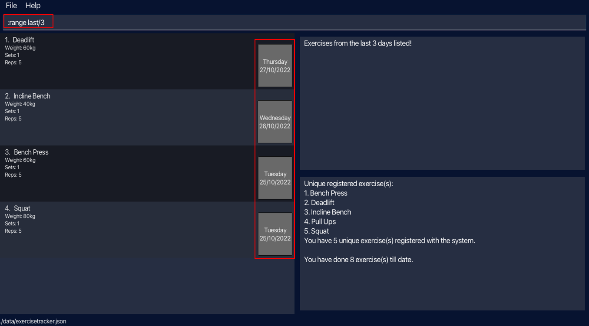

Gim is a **desktop app for managing gym exercises, optimized for use via a Command Line Interface (CLI)** while still having the benefits of a Graphical User Interface (GUI). Gim commands are inspired by those of Vim. If you are an avid Vim user and can type fast, Gim can help you manage your exercise routines with greater efficiency than traditional GUI apps.

### Table of Contents
#### Getting Started
#### Features
* Adding an exercise **:a**
* Deleting an exercise **:d**
* Listing all exercises **:ls**
* Sorting all exercises **:sort**
* Viewing all exercises within a time period **:range**
* Viewing help **:help**
* Exiting the program **:wq**
#### Command Summary
#### Glossary of Terminologies

--------------------------------------------------------------------------------------------------------------------

## Quick start

1. Ensure you have Java `11` or above installed in your Computer.

2. Download the latest `gim.jar` from [here](https://github.com/AY2223S1-CS2103T-T15-4/tp/releases).

3. Copy the file to the folder you want to use as the _home folder_ for your Gim.

4. Double-click the file to start the app. The GUI similar to the below should appear in a few seconds. Note how the app contains some sample data. 
    

5. Type the command in the command box and press Enter to execute it. e.g. typing **`help`** and pressing Enter will open the help window. 

6. Refer to the [Features](#features) below for details of each command.

--------------------------------------------------------------------------------------------------------------------

## Features

### Viewing help : `:help`

Access the help menu, containing the information about the commands.

Format: `:help`

### Adding an exercise: `:a`

Adds an exercise that we have done for the day.

Format: `:a n/<exercise name> w/<weight(kg)> s/<sets> r/<reps>`

##### Parameter constraints:
* The weight **must be a positive decimal number**
  * Examples: 1, 1.5, 2, ...
* The sets **must be a positive integer, up to 3 digits, with no leading zeros**
  * Examples: 1, 2, 3, 10, 100...
* The reps **must be a positive integer, up to 3 digits, with no leading zeros**
  * Examples: 1, 2, 3, 10, 100...

##### Examples:
* `:a n/Squat w/30 s/3 r/5` Adds a squat exercise of weight 30kg for 3 sets of 5 reps

### Deleting an exercise : `:d`

Deletes a particular exercise from our list. The index refers to the index number shown in the displayed exercise list.

Format: `:d <index>`

##### Parameter constraints:
* The index must be a positive integer 1, 2, 3, ...

##### Examples:
* `:d 3` Deletes an exercise at index 3 of the list

### Listing all exercises : `:ls`

Shows a list of all exercises.

Format: `:ls`

### Sorting all exercises : `:sort`

Sorts the list of exercises according to their date of completion, with the latest exercise completed displayed at the top of the list.

Format: `:sort`

### Viewing all exercises within a time period : `:range`

Shows a list of all exercises within a date range, in sorted order.
The order is based on latest to oldest date, then by alphabetical order of exercise name.

Format (1) : `:range d/<start date> e/<end date>`

Example: `:range d/25/10/2022 e/26/10/2022` shows the exercises done between October 20, 2022 
and October 25, 2022 (both inclusive)

Format (2) : `:range last/<number of days>`

Example: `:range last/3` shows the exercises done today and the last 3 days

### Exiting the program : `:wq`

Exits the program.

Format: `:wq`

--------------------------------------------------------------------------------------------------------------------

## FAQ

**Q**: Coming soon...
 
**A**:

--------------------------------------------------------------------------------------------------------------------

## Command Summary

| Action              | Format                                           | Examples                         |
|---------------------|--------------------------------------------------|----------------------------------|
| **Add exercise**    | :a n/<exercise> w/<weight(kg)> s/<sets> r/<reps> | :a n/Squat w/60 s/5 r/5          |
| **Delete exercise** | :d <index>                                       | :d 3                             |
| **List exercises**  | :ls                                              | :ls                              |
| **Sort exercises**  | :sort                                            | :sort                            |
| **View range (1)**  | :range d/<start_date> e/<end_date>               | :range d/10/10/2022 e/15/10/2022 |
| **View range (2)**  | :range last/<number_of_days>                     | :range last/3                    |
| **Help menu**       | :help                                            | :help                            |
| **Exit program**    | :wq                                              | :wq                              |
--------------------------------------------------------------------------------------------------------------------

## Glossary of Terminologies
* **Vim**: A Unix text editor, known for being lightweight, fast and efficient. It can be controlled entirely with the keyboard with no need for menus or a mouse.
* **Exercise** : Physical activity done in a regular gym that is structured and repetitive, usually involving
some weights.
* **Reps** : Number of times you perform a specific exercise
* **Sets** : Number of cycles of reps that you complete
* **Weight**: Total weight (include barbell if applicable, exclude body weight)

