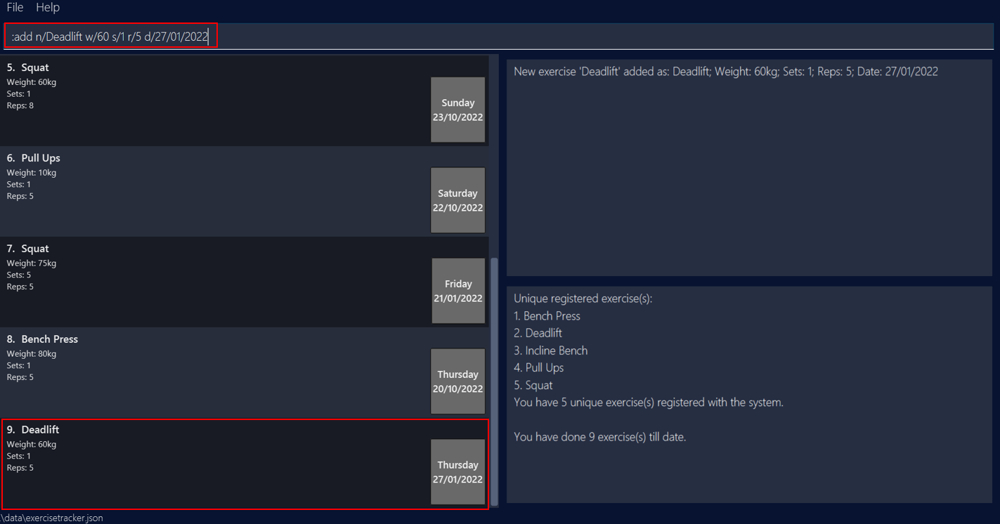
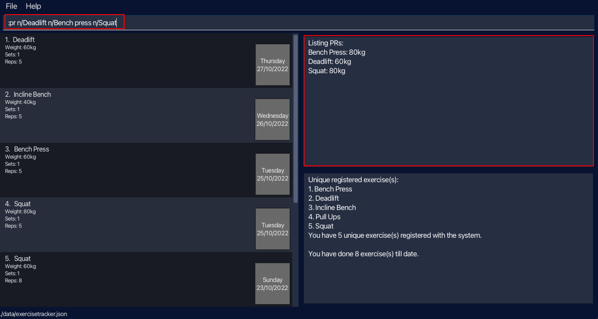
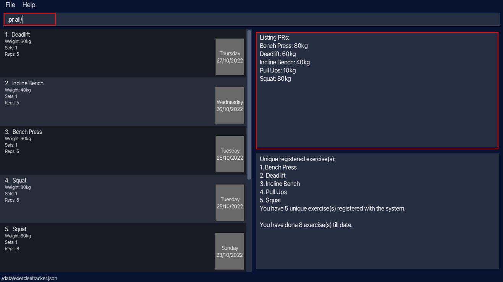

  

* Table of Contents
{:toc}
--------------------------------------------------------------------------------------------------------------------

## 1. Introduction

### 1.1. What is Gim?
Gim is a desktop app for **managing gym exercises**. Gim allows you to **keep track of your progress** and **craft personalised workout plans**. Gim commands are inspired by those of [Vim](#9-glossary-of-terminologies). Gim is optimised for use via a Command Line Interface (CLI) while still having the benefits of a Graphical User Interface (GUI).

### 1.2. Who is this guide for?
Are you a gym-goer looking to use Gim to track your exercises? This user guide will get you started in no time and help you navigate through Gim's features. For a quick start guide, head over to [Getting Started](#3-getting-started).

--------------------------------------------------------------------------------------------------------------------

## 2. How to use this guide?
Gim uses a Command Line Interface (CLI), which may be new to some users. If you are a new user, we strongly recommend you to look through the user guide from start to end to fully understand how to use Gim. However, you may also choose to skip to the relevant sections described below:
* Refer to our <a href="#top">Table of Contents</a> to easily navigate between sections of the User Guide.
* Refer to our [Getting Started](#3-getting-started) guide to learn how to setup Gim.
* Refer to our [GUI Orientation](#4-gui-orientation) to better orientate yourself around the GUI.
* Refer to our [Commands](#5-commands) section to learn in detail the different features and commands available in Gim.
* Refer to our [Tips and Tricks](#6-tips-and-tricks) for some tips and tricks specific to Gim.
* Refer to our [FAQ](#7-faq) to read common queries that new users may have.
* Refer to our [Command Summary](#8-command-summary) to have a quick overview of the different commands and their respective formats.
* Refer to our [Glossary of Terminologies](#9-glossary-of-terminologies) to learn key terms that are used in this User Guide.

### 2.1 Useful Notations
While exploring Gim's features with this user guide, do take note of these symbols used in the user guide and what they represent.

|        Symbol        | Meaning               |
|:--------------------:|-----------------------|
| :information_source: | Important information |
|    :exclamation:     | Warning or Caution    |
|        :bulb:        | Tips                  |

--------------------------------------------------------------------------------------------------------------------

## 3. Getting Started

1. Ensure you have Java `11` or above installed in your Computer.

2. Download the latest `gim.jar` [here](https://github.com/AY2223S1-CS2103T-T15-4/tp/releases).

3. Copy the file to the folder you want to use as the _home folder_ for your Gim.

4. Double-click the file to start the app. The GUI similar to the one shown below should appear in a few seconds. Note how the app contains some sample data. 
    

5. Type the command in the command box and press Enter to execute it. e.g. typing **`:help`** and pressing Enter will open the help window. 

6. Refer to the [Commands Section](#5-commands) below for details of each command.

--------------------------------------------------------------------------------------------------------------------

## 4. GUI Orientation

### 4.1. Command Box

The `Command Box` is where you can input your commands.

### 4.2. Exercise List

The `Exercise List` displays exercise entries. When the application is first launched, the `Exercise List` displays all exercise entries in the system, arranged by the order in which they were added. Whenever you issue commands that may truncate/reorder the `Exercise List`, they will **only act upon the entries that are currently displayed in the `Exercise List`**.

### 4.3. Result Display

The `Result Display Window` displays feedback after executing a command. This includes feedback for both correctly and incorrectly entered commands.

### 4.4. Recognised Exercise Name List

The `Recognised Exercise Name List Window` provides you a list of all unique exercise names that are currently registered in the system.
  This list updates in real time and allows you to keep track of the exercises you have input in the past. As such, you are able to keep track of what you named your exercises; you would also be able to quickly identify any misspellings in the name of your inputted exercises.

* The `Recognised Exercises Count` displays the number of unique exercises registered in the system.
* The `System Exercise Entries Count` displays the total number of exercise entries in the system.
 

**Adding and Deleting from the Exercise Name List**

The `Recognised Exercise Name List Window` is generated based on the exercise entries in the system. Hence, the Recognised Exercise Name List is automatically updated whenever you add or delete an entry from the system.

:exclamation: **Caution:** 
Exercise names are recognised as equal if, upon removing white spaces and setting the names to lowercase, the names are the same.  
i.e. "Bench Press", "BENCH PRESS", "BenchPress" will be logged as the same exercise for your convenience in adding.  
However, the first time you add an exercise with an unrecognised name, the Recognised Exercise Name List will save the form you have input. Choose wisely!

--------------------------------------------------------------------------------------------------------------------

## 5. Commands

**:information_source: Notes about the command format:** 

* Words in `UPPER_CASE` are the parameters to be supplied by you. 
  e.g. in `n/NAME w/WEIGHT`, `NAME` and `WEIGHT` are parameters which can be used as `n/Squat w/100`.

* Items in square brackets are optional. 
  e.g `n/NAME [d/DATE]` can be used as `n/Deadlift d/27-10-22` or as `n/Deadlift`.

* Items with `…` after them can be used multiple times including zero times. 
  e.g. `[n/NAME]…` can be used as ` ` (i.e. 0 times), `n/Squat` (i.e. 1 time), `n/Squat n/Deadlift` (i.e. 2 times) etc.

* Parameters can be in any order. 
  e.g. if the command specifies `n/NAME w/WEIGHT`, `w/WEIGHT n/NAME` is also acceptable.

* If a parameter is expected only once in the command but you specified it multiple times, only the last occurrence of the parameter will be taken. 
  e.g. if you specify `n/Squat n/Deadlift`, only `n/Deadlift` will be taken.

* Redundant inputs for commands that do not take in additional parameters (such as `:list`, `:sort`, `:help` `:wq`) will be ignored. 
  e.g. if the command specifies `:help 123`, it will be interpreted as `help`.

### 5.1. Adding an exercise: `:add`

Adds an exercise that we have done for the day. If an exercise (identified by their names) is added for the first time, it is automatically registered as a new unique exercise.

Format: `:add n/NAME w/WEIGHT s/SETS r/REPS [d/DATE]`

Parameter constraints:
* The name **must only contain alphanumeric** (alphabets & numbers) **characters and spaces**.
  * Examples: Squat, Bench press, Deadlift...
* The weight **must be a positive decimal number, up to 3 digits for the whole number and up to 2 digits for the decimal place**.
  * Examples: 0, 0.55, 35, 100.1, 200.00...
* The sets **must be a positive integer, up to 3 digits, with no leading zeroes**.
  * Examples: 1, 2, 3, 10, 100...
* The reps **must be a positive integer, up to 3 digits, with no leading zeroes**.
  * Examples: 1, 2, 3, 10, 100...
* The date **must be a valid date**.
  * Accepted formats:
    * DAY/MONTH/YEAR
    * YEAR/MONTH/DAY
    * DAY-MONTH-YEAR
    * YEAR-MONTH-DAY
    * DAY MONTH YEAR
    * YEAR MONTH DAY
  * DAY: 1 or 2 valid digits allowed
  * MONTH: 1 or 2 valid digits allowed
  * YEAR: 4 valid digits allowed
  * Examples: 27/10/2022, 27-10-2022... 
  * `d/DATE` field is left optional, will store exercise with current date if no date field is found

Examples:
* `:add n/Squat w/30 s/3 r/5` Adds a squat exercise of weight 30kg for 3 sets of 5 reps for today's date.
* `:add n/Deadlift w/60 s/1 r/1 d/27/01/2022` Adds a deadlift exercise of weight 60kg for 1 set of 1 rep for 27th January 2022.

### 5.2. Deleting an exercise : `:del`

Deletes a particular exercise from our list. The index refers to the index number shown in the displayed exercise list. If the deleted exercise was the last exercise with the same name, then the exercise is automatically un-registered from the list of unique exercises.

Format: `:del INDEX`

Parameter constraints:
* The index **must be a positive integer** 1, 2, 3, ...

Example:
* `:del 9` Deletes an exercise at index 9 of the list.

### 5.3. Listing all exercises : `:list`

Shows a list of all exercises.

Format: `:list`

Example:
* `:list` Shows the list of exercises you have completed.

### 5.4. Filtering exercises by their name(s) : `:filter`

Filters exercises, in the current [Exercise List](#42-exercise-list), with names containing any of the given keywords.

Format: `:filter KEYWORD [KEYWORD]...`

**:information_source: Notes about filter:** 

* Only the exercise name is searched.
* The keyword is case-insensitive. e.g bench will match Bench.
* The order of the keywords does not matter. e.g. Deadlift Squat will match Squat Deadlift.
* Only full words will be matched e.g. Squat will not match Squats.
* Exercises matching at least one keyword will be returned e.g. `:filter Bench press` will return Bench press and Leg press.

Example:
* `:filter Deadlift Squat` Shows the list of Deadlift and Squat exercises.

### 5.5. Clearing all exercises : `:clear`

Clears the saved exercises and resets the data in the system.

Format: `:clear confirm/`

:exclamation: **Caution:**  
Redundant inputs (before and after the `confirm/` flag) will be ignored.   e.g. if the command specifies `:clear abc confirm/ 123`, it will be interpreted as `:clear confirm/`.

Example:
* `:clear confirm/` Clears all saved exercises, resetting the data in the system.

### 5.6. Sorting exercises : `:sort`

Sorts the exercises, in the current [Exercise List](#42-exercise-list), according to their date of completion, with the latest exercise completed displayed at the top of the list.

Format: `:sort`

Example:
* `:sort` Shows the sorted list of exercises.

### 5.7. Viewing all exercises within a time period : `:range`

Shows all exercises, among exercises in the current [Exercise List](#42-exercise-list), within the specified date range; the latest exercise completed is displayed at the top of the list.

**:information_source: There are 2 formats supported for this command.** 

Format (1) : `:range start/START_DATE end/END_DATE`

Parameter constraints:
* Start date should be before end date. Otherwise, no exercises will be displayed.

Example:
* `:range start/25/10/2022 end/26/10/2022` Shows the exercises done between October 25, 2022 and October 26, 2022 (both inclusive).

Format (2) : `:range last/NUMBER_OF_DAYS`

Parameter constraints:
* Number of days **can only take non-negative integer values**, up to 5 digits.

Example:
* `:range last/3` Shows the exercises done today and the last 3 days.

### 5.8. Listing Personal Records (PR): `:pr`

Finds the [Personal Record](#9-glossary-of-terminologies) of certain exercises in the exercise tracker.

**:information_source: There are 2 formats supported for this command.** 

Format (1): `:pr n/NAME [n/NAME]...`

Parameter constraints:
* Name **must only contain alphanumeric** (alphabets & numbers) **characters and spaces**
  * Examples: Squat, Bench press, Deadlift...

Examples:
* `:pr n/Squat` Lists the personal record for the 'Squat' exercise (if any).
* `:pr n/Deadlift n/Bench press n/Squat` Lists the personal records for the 'Deadlift', 'Bench press' and 'Squat' exercises (if any).

Format (2): `:pr all/`

:exclamation: **Caution:**  
Redundant inputs (before and after the `all/` flag) will be ignored.   e.g. if the command specifies `:pr abc all/ 123`, it will be interpreted as `:pr all/`.

Example:
* `:pr all/` Lists the personal records for all uniquely registered exercises in the exercise tracker.

### 5.9. Generating a sample workout based on Personal Records: `:gen`

Generates a sample workout suggestion based on existing personal records of the exercises, according to the difficulty level specified. Exercises are indicated either by their index numbers shown in the displayed exercise list or their exercise names.

**:information_source: There are 2 formats supported for this command.** 

Format (1): `:gen INDEX [, INDEX]... level/DIFFICULTY_LEVEL`

Parameter constraints:
* The index **must be a positive integer** 1, 2, 3, ...
* The difficulty level must be supported; currently supported are: easy, medium, hard.

Example:
* `:gen 1, 2 level/easy` Generates a sample workout for exercises at index 1 and 2 of the list, Deadlift and Incline Bench.

Note that only one sample workout is generated for each unique exercise name. For example, `:gen 4, 5 level/easy` will generate one sample workout for squat, as both index 4 and 5 in the displayed list are Squat exercises.

 

Format (2): `:gen n/NAME [n/NAME]... level/DIFFICULTY_LEVEL`

Parameter constraints:
* Name **must only contain alphanumeric** (alphabets & numbers) **characters and spaces**.
* The difficulty level must be one that is supported; currently supported are: {easy, medium, hard}.

:exclamation: **Caution:**  
Redundant inputs (before the first `n/` flag) will be ignored.   e.g. if the command specifies `:gen 1,2,3 n/Squat level/easy`, it will be interpreted as `:gen n/Squat level/easy`.

Example:
* `:gen n/Squat n/Deadlift level/easy` Generates a sample workout for exercises Squat and Deadlift.

Note that only one sample workout is generated for each unique exercise name. For example, `:gen n/Squat n/Squat level/easy` will generate one sample workout for squat.

### 5.10. Viewing help : `:help`

Access the help menu, containing a brief summary of the commands supported. The help menu also provides a link to the user guide.

Format: `:help`

### 5.11. Exiting the program : `:wq`

Exits the program.

Format: `:wq`

**:information_source: Gim data is saved in the hard disk automatically after any command that changes the data. There is no need to save manually.** 

--------------------------------------------------------------------------------------------------------------------

## 6. Tips and Tricks

Tip 1: Gim's `range` and `filter` commands operate on the current exercise list, hence you can use the commands successively to narrow the lists down to what you want to find. For instance, you can keep track of your exercise progression over a period of time through the use of `:filter NAME` followed by a `range last/NUMBER_OF_DAYS`.

Example: If you  want to view your squat progression over the past week, you should input these three commands successively:
* `:list` Current exercise list now shows all exercises.
* `:filter Squat` Current exercise list now shows 'Squat' exercises.
* `:range last/7`  Current exercise list now shows 'Squat' exercises in the past 7 days.

Tip 2: Advanced users are welcome to update data directly by editing the data file in
 
`[JAR file location]/data/exercisetracker.json`

:exclamation: **Caution:**
If your changes to the data file makes its format invalid, Gim will discard all data and start with an empty data file at the next run.

--------------------------------------------------------------------------------------------------------------------

## 7. FAQ

**Q**: When should I use the `:list` command?
 
**A**: The `:list` command resets the display of the exercise list, displaying all the exercise entries in the system (in the order the entries were input in the system). This can be used after commands, such as `:filter` or `:range` are used to change the display list.

**Q**: Can I change the name of my uniquely registered exercise?
 
**A**: To change the way it is represented, you can find the exercise with the name, delete the entries and re-enter the exercises with your new name of choice.

**:information_source: The way you format the exercise name when you first add it will be the way it is displayed in the system. After that, all exercises added that have the <a href="#names">same name</a> will be categorised under the same exercise.** 

**Q**: Can I edit an exercise?
 
**A**: You can do so by deleting the entry and adding a new entry.

**Q**: Why is `:filter`, `:range` or `:sort` not showing the "correct" list even though I have input valid parameters?
 
**A**: The three commands works on the exercises in the current [Exercise List](#42-exercise-list). If your current Exercise List has been altered by list-changing commands such as `:range` or `:filter`, the commands will act on the current Exercise List rather than the full list comprising all exercises in the system. 

  
If you would like to operate on the full list instead, try executing the command `:list` to display the full list before running the commands again.

--------------------------------------------------------------------------------------------------------------------

## 8. Command Summary

| Action                          | Format                                         | Examples                                  |
|---------------------------------|------------------------------------------------|-------------------------------------------|
| **Add exercise**                | :add n/NAME w/WEIGHT s/SETS r/REPS [d/DATE]    | :add n/Deadlift w/60 s/1 r/1 d/27/10/2022 |
| **Delete exercise**             | :del INDEX                                     | :del 3                                    |
| **List all exercises**          | :list                                          | :list                                     |
| **Filter exercise(s)**          | :filter KEYWORD [KEYWORD]...                   | :filter Deadlift Squat                    |
| **Clear all exercises**         | :clear confirm/                                | :clear confirm/                           |
| **Sort exercises**              | :sort                                          | :sort                                     |
| **View range (1)**              | :range start/START_DATE end/END_DATE           | :range start/25/10/2022 end/26/10/2022    |
| **View range (2)**              | :range last/NUMBER_OF_DAYS                     | :range last/3                             |
| **List Personal Record(s) (1)** | :pr n/NAME [n/NAME]...                         | :pr n/Deadlift n/Squat                    |
| **List Personal Record(s) (2)** | :pr all/                                       | :pr all/                                  |
| **Generate workout (1)**        | :gen INDEX [, INDEX]... level/DIFFICULTY_LEVEL | :gen 1, 2 level/easy                      |
| **Generate workout (2)**        | :gen n/NAME [n/NAME]... level/DIFFICULTY_LEVEL | :gen n/Deadlift level/easy                |
| **Help menu**                   | :help                                          | :help                                     |
| **Exit program**                | :wq                                            | :wq                                       |

--------------------------------------------------------------------------------------------------------------------

## 9. Glossary of Terminologies
* **Vim**: A Unix text editor, known for being lightweight, fast and efficient. It can be controlled entirely with the keyboard with no need for menus or a mouse.
* **Parameters**: Inputs for commands that you come up with.
* **Exercise** : Physical activity done in a regular gym that is structured and repetitive, usually involving some weights.
* **Reps** : Number of times you perform a specific exercise.
* **Sets** : Number of cycles of reps that you complete.
* **Weight**: Total weight (include barbell if applicable, exclude body weight).
* **Personal Record (PR)**: Heaviest weight recorded in the exercise tracker for a specific exercise.

<a href="#top">Back To Top</a>
