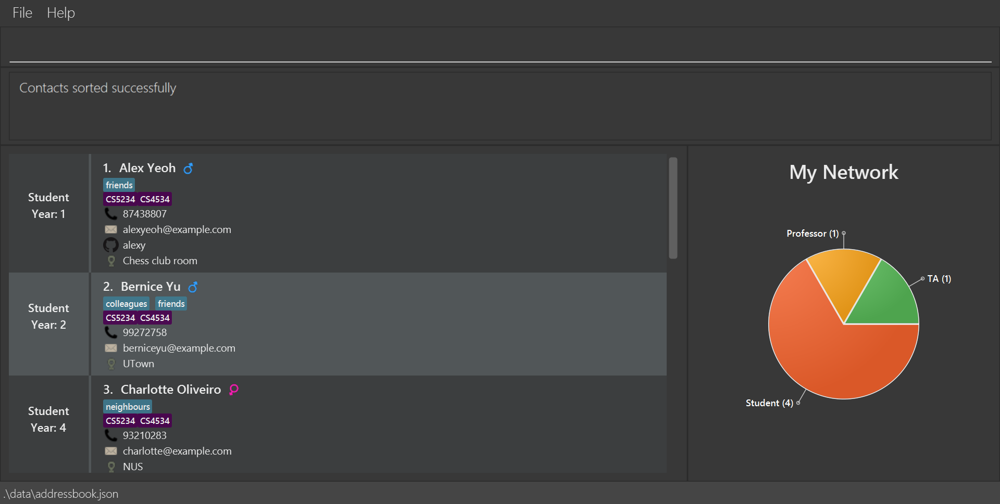
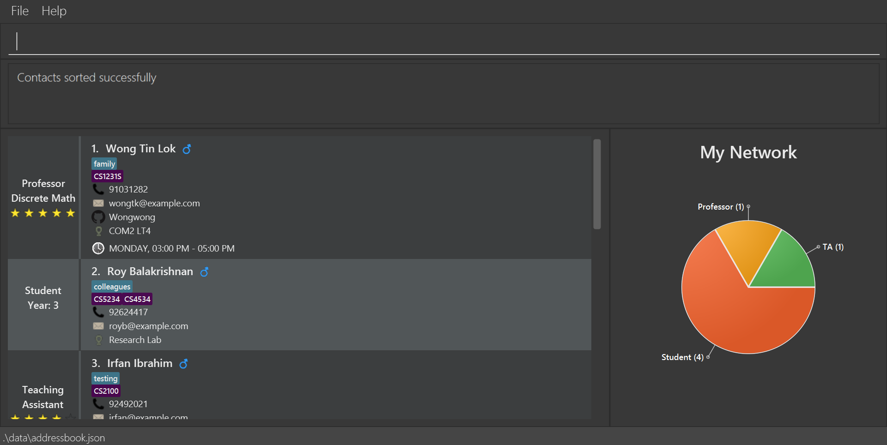
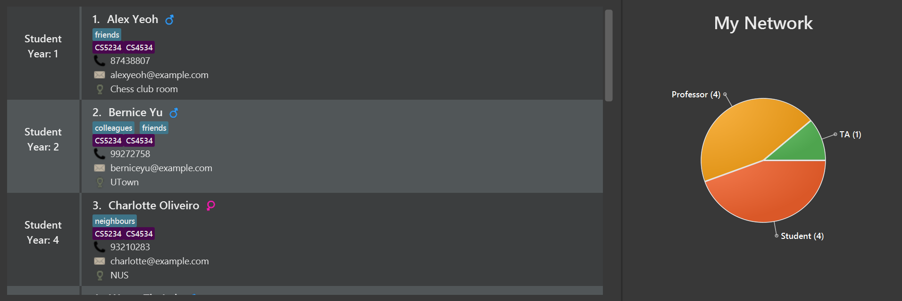

SOConnect is a **desktop application for NUS SOC students to keep track of their University social circle** which includes peers, Teaching Assistants and Professors.
Since it is designed for people with some computing background, it is **optimized for use via a Command Line Interface (CLI)**
but it also has a Graphical User Interface (GUI) for simpler and quicker task.

* Table of Contents
{:toc}

# 1. About the User Guide

This section will explain the parameters and the format of commands.

## 1.1 Parameters

| Prefix | Parameter       | Meaning                                                                                                        |
|--------|-----------------|----------------------------------------------------------------------------------------------------------------|
| n/     | NAME            | Name of person                                                                                                 |
| p/     | PHONE           | Phone number of person                                                                                         |
| g/     | GENDER          | Gender of person (STRICTLY F or M)                                                                             |
| git/   | GITHUB_USERNAME | GitHub Username of person                                                                                      |
| e/     | EMAIL           | Email address of person                                                                                        |
| m/     | MODULE_CODE     | Module Code that person is participating in                                                                    |
| t/     | TAG             | Tag person (i.e tag as friend)                                                                                 |
| r/     | RATING          | Rate Professor/Teaching Assistant (on a scale of 0 to 5)                                                       |
| y/     | YEAR            | Year of Undergraduate Study (from 1 - 4)                                                                       |
| l/     | LOCATION        | Location of Professor/Teaching Assistant/Student in NUS. If not provided, default value is `NUS`.              |
| s/     | SPECIALISATION  | Professor's Specialisation                                                                                     |
| o/     | OFFICE_HOURS    | Professor's office hours for consultation  Refer to section [3](#3-features) for the format of OFFICE_HOURS |
| typ/   | TYPE            | Type of Contacts. (STRICTLY prof or stu or ta)                                                                 |
|    | INDEX           | Index of item in the recent displayed item list                                                                |
|        | FILENAME        | Name that you wish to name the export file or Name of file you wish to import from                             |

--------------------------------------------------------------------------------------------------------------------

# 2. Quick Start

1. Ensure you have Java `11` or above installed in your Computer.

1. Download the latest `SoConnect.jar` from [here](https://github.com/AY2223S1-CS2103T-W08-3/tp/releases).

  1. **Double-click** the file to start the app or  using **CLI** and type `java -jar SoConnect.jar`. The GUI similar to the below should appear in a few seconds. Below is an UI mockup.
     

1. Refer to the [Features](#3-features) below for details of each command.

--------------------------------------------------------------------------------------------------------------------

# 3. Features

:information_source: **Notes About Command Features:**

* All prefixes must be preceded by a space. 
  e.g <code> t/</code>, <code> g/</code>

* All commands are **lowercase-sensitive**. 
  e.g. `Find` will **not** be recognised as a valid syntax.

* Words in `UPPER_CASE` are the parameters to be **supplied by you** and must be in **English Characters**. 
  e.g. in `student e/EMAIL`, `EMAIL` is a parameter which can be used as `student e/e123@u.nus.edu` to create a student with email e123@u.nus.edu

* Items in **square brackets are optional**. 
  e.g `student n/NAME [t/TAG]` can be used as `student n/John` or as `student n/John t/friend`.

* Although `LOCATION` is an optional field, it comes with the default value of NUS.

* `INDEX` **must be a positive integer** e.g. 1, 2, 3... 
  e.g. the `INDEX` in `delete INDEX` and `edit INDEX` must be a positive integer that is present in the
  corresponding lists e.g. `delete 1` `edit 2`.

* `OFFICE_HOURS` **must be in the format** `DAY-TIME-DURATION`. 
  `DAY` can only take integer values of 1 to 5. Where 1 corresponds to Monday, 2 corresponds to Tuesday...  
  `TIME` must be in the 24 hour format e.g `16:30`. 
  `DURATION` must be integer values of 1 to 9. Where the number represents the number of **Hours**. 
  e.g. `3-16:00-3` which corresponds to Wednesday, 04:00PM - 07:00PM.

* Parameters can be in **any order**. The only exception is if one of the parameter is an INDEX, in this case
  , **INDEX must be the second parameter**.  
  e.g. if the command specifies `student n/NAME e/EMAIL`, then `student e/EMAIL n/NAME` is also acceptable.
  e.g. if the command specifies `edit INDEX n/NAME`, then `edit n/NAME INDEX` is not acceptable.

* If a parameter is expected only once in the command, but you specified it multiple times, only
  the last occurrence of the parameter will be taken.  
  e.g. if you specify `n/Alice n/Bob`, only Bob will be taken.

* Extraneous parameters for commands that do not take in parameters (such as help, list, exit, clear-confirm, sort ) will be ignored.
  e.g. if the command specifies help 123, it will be interpreted as help.

## 3.1 Add-Related Commands
The Add-Related commands include `student`, `prof` and `ta`. These are the commands related to adding a new person to the application.

:information_source: **Note:**
You cannot add people with same names, e.g. "Michelle" cannot be a student and a prof at the same time.

### 3.1.1 Adding a new Student Contact: `student`

Adds a new Student contact to your contacts list.

Format: `student n/NAME [y/YEAR] m/MODULE_CODE... p/PHONE e/EMAIL g/GENDER [t/TAG]... [l/LOCATION] [git/GITHUB_USERNAME]`

:information_source: **Note:**
A student can have multiple module codes and tags. But a student must have at least **1** module code.

Examples:
* `student n/John Doe y/1 m/CS4226 m/CS5242 p/98765432 e/JohnD@example.com g/M t/friends t/owesMoney l/UTown Residences git/johnnyd`
* `student n/Betsy Crowe t/friend m/CS2100 g/F e/betsycrowe@example.com p/1234567 t/criminal`

### 3.1.2 Add a new Professor Contact: `prof`

Adds a new Professor contact to your contacts list.

Format: `prof n/NAME m/MODULE_CODE [s/SPECIALISATION] p/PHONE e/EMAIL g/GENDER [t/TAG]... [l/LOCATION] [git/GITHUB_USERNAME] [r/RATING] [o/OFFICE_HOURS]`

:information_source: **Note:**
When adding a Professor, you can enter multiple module codes in the same command, but only the last module code will be taken.

Examples:
* `prof n/Hartin Menz m/CS1101s s/Discrete Math p/98765432 e/HMenz@example.com g/M t/friends l/COM2 LT4 git/hartinmenz r/5 o/2-12:00-2`
* `prof n/Koro Sensei m/CS3230 p/98663357 e/KoroSensei@gmail.com g/M t/wanted git/senseikoro`

### 3.1.3 Add a new TA Contact: `ta`

Adds a new Teaching Assistant contact to your contacts list.

Format: `ta n/NAME m/MODULE_CODE p/PHONE e/EMAIL g/GENDER [t/TAG]... [l/LOCATION] [git/GITHUB_USERNAME] [r/RATING]`

:information_source: **Note:**
Similar to professor, when adding a Teaching Assistant, you can enter multiple module codes in the same command, but only the last module code will be taken.

Examples:
* `ta n/Alice Doe m/CS2100 p/98765432 e/AliceD@example.com g/F t/friends t/owesMoney l/COM1-0203 git/alicyD r/5`
* `ta n/Pablo Escobar m/CS2040 p/99982344 e/Pablo@hotmail.com g/M t/entrepreneur git/pabbyescobar`

--------------------------------------------------------------------------------------------------------------------

## 3.2 Editing-Related Commands
### 3.2.1 Delete person/s: `delete`

Deletes one or more contacts from the contacts list.

Format: `delete INDEX1 INDEX2...`

* Deletes the person(s) at the specified `INDEX`.
* Multiple contacts can be deleted at once by entering multiple indexes.
* The indexes **must be a positive integer** 1, 2, 3...
* The order of the indexes does not matter as long as they are valid i.e. they are not out of bounds.

Example:
* `delete 1 2 3`

### 3.2.2 Edit contacts: `edit`
Edits an existing person in contact list.

#### 3.2.2.1 Edit Student's contact

Format: `edit INDEX [n/NAME] [y/YEAR] [m/MODULE_CODE]... [p/PHONE] [e/EMAIL] [g/GENDER] [t/TAG]... [l/LOCATION] [git/GITHUB_USERNAME]`

#### 3.2.2.2 Edit Teaching Assistant's contact

Format: `edit INDEX [n/NAME] [m/MODULE_CODE] [p/PHONE] [e/EMAIL] [g/GENDER] [t/TAG]... [l/LOCATION] [git/GITHUB_USERNAME] [r/RATING]`

#### 3.2.2.3 Edit Professor's contact

Format: `edit INDEX [n/NAME] [m/MODULE_CODE] [s/SPECIALISATION] [p/PHONE] [e/EMAIL] [g/GENDER] [t/TAG]... [l/LOCATION] [git/GITHUB_USERNAME] [r/RATING] [o/OFFICE_HOURS]`

* Edits the person at the specified INDEX. The index refers to the index number shown in the displayed person list. The index must be a positive integer 1, 2, 3, …​
* At least one of the optional fields must be provided.
* Existing values will be updated to the input values.
* When editing tags, the existing tags of the person will be removed i.e adding of tags is not cumulative.
* When editing a Student's module codes, the existing module codes of the student will be removed i.e adding of module codes is not cumulative.
* You can remove all the person’s tags by typing t/ without specifying any tags after it.
* Similar to tags you can remove Person's GitHub Username, Teaching Assistant's and Professor's Rating, Professor's Office Hour, Professor's Specialisation by typing `git/`, `r/`, `o/` or `s/` without any inputs respectively.

:information_source: **Note:**
An error will be thrown if you attempt to edit a field that does not exist for the contact. E.g editing year field of a professor contact will throw an error as professor does not have a year field.

Examples:
Assuming you have a contact list where the first, second and third contact is a Student,Teaching Assistant and Professor respectively.
* `edit 1 p/91234567 e/johndoe@example.com` -> Edits the phone number and email address of the 1st contact which is-a Student to be 91234567 and johndoe@example.com respectively.
* `edit 2 r/3 t/` -> Edits the rating to 3 and clears tags of the 2nd contact which is-a Teaching Assistant.
* `edit 3 s/Discrete Math` -> Edits the Specialisation of the 3rd contact which is-a Professor.

--------------------------------------------------------------------------------------------------------------------

## 3.3 Searching-Related Commands
### 3.3.1 Locate contact: `find`

Finds all contacts based on the fields provided.

A list of keywords can be entered under each field

Format: `find [n/NAME] [m/MODULE_CODE] [s/SPECIALISATION] [p/PHONE] [e/EMAIL] [g/GENDER] [g/GITHUB_USERNAME] [y/YEAR] [t/TAG] [l/LOCATION] [r/RATING] [o/OFFICE_HOUR]`

* Find can be used with any number of fields as long at least one field is provided.
* The search is case-insensitive. e.g. `bob` will match `Bob`
* Keywords for all fields (except specialisation) are separated by spaces. e.g. `find n/bob alex joe`
* For fields `NAME` and `LOCATION`, only one of the keywords need to fully match. e.g. `find n/alex bob` can return contacts `Alex Hunter` and `Bob Jones`.
* Keywords for specialisation must be a full match and are separated by `,`. e.g. `find s/discrete math, networks` will return contacts with specialisation `Discrete Math` OR `Networks`, but NOT `Discrete`.
* The order of the keywords for any field does not matter. e.g. `find n/Hans Bo` will match `find n/Bo Hans`
* For all fields, only full keywords will be matched e.g. `Bob` will not match `Bobby`
* Find command performs `AND` search between fields but `OR` search for keywords within fields. e.g. `find n/alex bob t/friends` can return `Alex James`, `Bob Hunt` IF both contacts have the tag `friends`.
* `OFFICE_HOUR` input must be in the same format as office hour input. e.g. To find office hour `MONDAY, 03:00 PM - 05:00 PM` enter `find o/1-15:00-2`.

Examples:
* `find m/CS2103T t/friends goodCoder` -> Returns contacts who take module `CS2103T` AND (have the tags `friends` OR `goodCoder`).
* `find n/wong leong m/CS1231S l/COM3` -> Returns all contacts whose names have (`wong` OR `leong`) in them, AND take the module `CS1231S`, AND have the location `COM3`.
* `find o/1-15:00-2 2-12:00-2` -> Returns all contacts with office time `MONDAY, 03:00 PM - 05:00 PM` OR `TUESDAY, 12:00 PM - 02:00 PM`.

#### `ALL` search for `module` and `tag` fields

Finds all contacts who have ALL the module codes provided or ALL the tags provided.

Format: `find [m/all/LIST OF MODULES] [t/all/LIST OF TAGS]`

* Other fields can still be provided with this search mode, and they will still be OR search (but module/ tag will be ALL).
* This is not case-sensitive.
* `OR` search is still supported for modules and tags (omit the `all/`).

Examples
*  `find n/wong m/all/CS2100 CS2103T CS2109S` -> Returns all contacts who have `wong` in their name AND (take the modules: `CS2100` AND `CS2103T` and `CS2109S`).
*  `find l/NUS t/all/friends owesMoney smart` -> Returns all contacts who have the location `NUS` AND (have the tags: `friends` AND `owesMoney` AND `smart`).

#### Type search

Find contacts by type: `Student` `Professor` `Teaching Assistant`

Format: `find typ/TYPE`

Only the following are accepted for `TYPE`:
* `stu` for Student
* `prof` for Professor
* `ta` for Teaching Assistant
* All are case-insensitive
* More than one type can be provided

Examples:
* `find typ/stu ta` -> Returns contacts who are students OR teaching assistants.
* * `find typ/stu prof` -> Returns contacts who are students OR professors.

### 3.3.2 List contact: `list`

Displays all contacts stored in application.

:bulb: **Tip:**
After executing find command, only the contacts that matches your input will be displayed. This list command would make the application display all of your stored contacts again.

Format: `list`

Example Command: `list`

### 3.3.3 Sort contact

Sort the contact list in either ascending `A-Z` or descending `Z-A` order by name or module code.

#### 3.3.3.1 Sort by name

Sort the contact list by name in either ascending `A-Z` or descending `Z-A` order.

Format: `sort A-Z n/`

Example Command: `sort A-Z n/`

Before executing the above command: 

After executing the command: 

:information_source: **Note:**
Contacts are sorted by name in `A-Z` order.

Format: `sort Z-A n/`

Example Command: `sort Z-A n/`

After executing the command: 

:information_source: **Note:**
Contacts are sorted by name in `Z-A` order.

#### 3.3.3.2 Sort by moduleCode

Sort the contact list by moduleCode in either ascending `A-Z` or descending `Z-A` order.

Format: `sort Z-A m/`

Example Command: `sort Z-A m/`

After executing the above command: 

:information_source: **Note:**
Module Codes sorted in order of CS1231S>CS2100>CS2103T>CS5000, lower level modules will appear higher.

Format: `sort A-Z m/`

Example Command: `sort A-Z m/`

After executing the above command: 

:information_source: **Note:**
Module Codes sorted in order of CS1231S>CS2100>CS2103T>CS5000, higher level modules will appear higher.

--------------------------------------------------------------------------------------------------------------------

## 3.4 GitHub Command: `github`

Opens the GitHub profile page associated with the specified person in the contact list, through user's default browser.

Format: `github INDEX`
* Opens the GitHub profile page associated with the person at the specified `INDEX'
* The index refers to the index number shown in the displayed person list.
* The index **must be a positive integer** 1, 2, 3, …
* If the GitHub username is not a registered username on GitHub, this command will open the GitHub 404 page

Examples:
* `github 1`
* `github 3`

:information_source: **Note:**
If there is no GitHub username associated with the person at the specified `INDEX', an error will be thrown.

:information_source: **Note:**

--------------------------------------------------------------------------------------------------------------------

## 3.5 Pie Chart Feature

The contact list will be displayed as a pie chart. The pie chart is located to the right of the contact list.

This pie chart shows how many of each type of contact you have, and updates itself whenever the list changes. You can use this to have a quick overview of your social network.

--------------------------------------------------------------------------------------------------------------------

## 3.6 Fast Template Command

Returns a template with all the fields of a Person on the CLI so that users do not have to remember and enter prefixes themselves, and can easily add a new Person to the address book.

Format: `tt PERSON`
* PERSON can be `prof`, `student`, or `ta`.

Examples:
* `tt prof` -> the template `prof n/ m/ s/ p/ e/ g/ t/ l/ git/ r/ o/` will be on the CLI.
* `tt student` -> the template `student n/ m/ p/ e/ g/ t/ l/ git/ y/` will be on the CLI.
* `tt ta` -> the template `ta n/ m/ p/ e/ g/ t/ l/ git/ r/` will be on the CLI.

--------------------------------------------------------------------------------------------------------------------

## 3.7 Sharing-Related Commands

Allow users to share the current state of their contact list.

### 3.7.1 Export Contact as CSV: `export`

User can export the current state of his/ her contact list into a CSV file.

Format: `export FILENAME`

:information_source: **Note:**
FILENAME cannot contain any of `$%&` symbols.

Examples:
* `export test`
* `export myContacts`

Upon successfully exporting, users will see the CSV file:

Also the directory where the exported file is located at will be displayed:

### 3.7.2 Import address book in CSV format into address book: `import`

User can import a CSV file generated by Export Contact to ease sharing of contact information.

Format: `import FILENAME.csv`

:information_source: Note:
FILENAME cannot contain any of $%& symbols.

Examples:
* `import testing.csv`
* `import myContacts.csv`

Step by Step Guide:
1. User create an import directory in the same directory as the SoConnect.jar
   
2. User adds the desired import file into the import directory
   
3. Enter into the CLI import sampleimportdata.csv

Before import:

After import:

--------------------------------------------------------------------------------------------------------------------

## 3.8 Clear all contacts: `clear-confirm`

Allows users to clear all contacts within the application using a single command.

Format: `clear-confirm`

Example Command: `clear-confirm`

--------------------------------------------------------------------------------------------------------------------

## FAQ

**Q**: How do I transfer my data to another Computer? 
**A**: Install SoConnect in the other computer and overwrite the empty data file it creates with the file that contains the data in your previous SoConnect home folder. Or you could export your contacts as csv and import it back into the other computer using the import and export command explained in section [3.7](#37-sharing-related-commands)

--------------------------------------------------------------------------------------------------------------------

## Command summary

| Action                                  | Format, Examples                                                                                                                                                                                                                                                                                                                                                                                                                                                                                                                                                                                                                                                                                                                                                                                                                                |
|-----------------------------------------|-------------------------------------------------------------------------------------------------------------------------------------------------------------------------------------------------------------------------------------------------------------------------------------------------------------------------------------------------------------------------------------------------------------------------------------------------------------------------------------------------------------------------------------------------------------------------------------------------------------------------------------------------------------------------------------------------------------------------------------------------------------------------------------------------------------------------------------------------|
| **Add a Person**                        | Adding a Student: `student n/NAME [y/YEAR] m/MODULE_CODE... p/PHONE e/EMAIL g/GENDER [t/TAG]... [l/LOCATION] [git/GITHUB_USERNAME]` e.g.`student n/James Ho m/CS1231 p/12345678 e/jamesho@example.com g/M t/bestfriend t/colleague l/UTown Residences git/jamesho y/2`   Adding prof: `prof n/NAME m/MODULE_CODE [s/SPECIALISATION] p/PHONE e/EMAIL g/GENDER [t/TAG]... [l/LOCATION] [git/GITHUB_USERNAME] [r/RATING] [o/OFFICE_HOURS]`   e.g. `prof n/Wong Tin Lok m/CS1231S s/Discrete Math p/98765432 e/WongTK@example.com g/M t/greatVoice git/WongExample l/COM2 LT4 r/5 o/2-12:00-2`    Adding TA: `ta n/NAME m/MODULE_CODE p/PHONE e/EMAIL g/GENDER [t/TAG]... [l/LOCATION] [git/GITHUB_USERNAME] [r/RATING]`   e.g. `ta n/Danny m/CS2103T p/67598442 e/Danny@example.com g/M t/Korean l/COM2-0204 git/DannyTA r/5` |
| **Clear**                               | `clear-confirm`                                                                                                                                                                                                                                                                                                                                                                                                                                                                                                                                                                                                                                                                                                                                                                                                                                 |
| **Delete**                              | `delete INDEX`  e.g. `delete 3`                                                                                                                                                                                                                                                                                                                                                                                                                                                                                                                                                                                                                                                                                                                                                                                                              |
| **Opens Contact's GitHub Profile Page** | `github Index`   e.g. `github 2`                                                                                                                                                                                                                                                                                                                                                                                                                                                                                                                                                                                                                                                                                                                                                                                                             |
| **Edit**                                | `edit INDEX PREFIX [MORE_PREFIX]`   `edit 1 n/John`                                                                                                                                                                                                                                                                                                                                                                                                                                                                                                                                                                                                                                                                                                                                                                                          |
| **Find**                                | `find [n/NAME] [m/MODULE_CODE] [s/SPECIALISATION] [p/PHONE] [e/EMAIL] [g/GENDER] [g/GITHUB_USERNAME] [y/YEAR] [t/TAG] [l/LOCATION] [r/RATING] [o/OFFICE_HOUR] [typ/TYPE]`  e.g. `find James Jake`                                                                                                                                                                                                                                                                                                                                                                                                                                                                                                                                                                                                                                            |
| **List**                                | `list`                                                                                                                                                                                                                                                                                                                                                                                                                                                                                                                                                                                                                                                                                                                                                                                                                                          |
| **Help**                                | `help`                                                                                                                                                                                                                                                                                                                                                                                                                                                                                                                                                                                                                                                                                                                                                                                                                                          |
| **Generation of Person's Template**     | `tt PERSON` where PERSON is `prof / student / ta`   e.g. `tt prof`, `tt ta`, `tt student`                                                                                                                                                                                                                                                                                                                                                                                                                                                                                                                                                                                                                                                                                                                                                    |
| **Export**                              | `export FILENAME`   e.g. `export contacts`                                                                                                                                                                                                                                                                                                                                                                                                                                                                                                                                                                                                                                                                                                                                                                                                   |
| **Import**                              | `import FILENAME.csv`   e.g. `import contacts.csv`                                                                                                                                                                                                                                                                                                                                                                                                                                                                                                                                                                                                                                                                                                                                                                                           |
