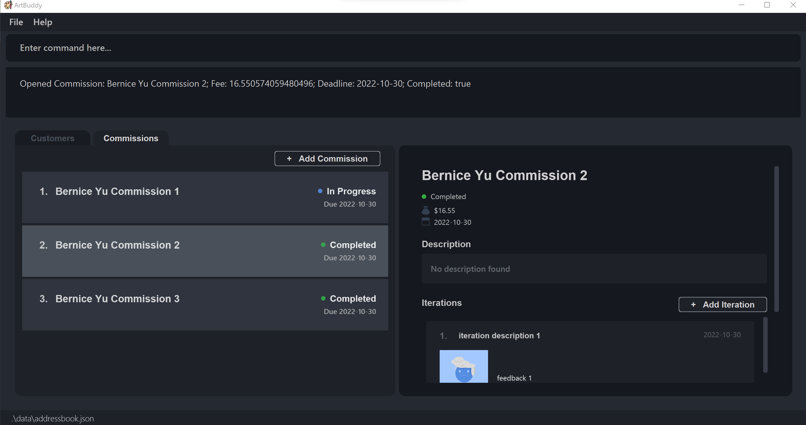

Made for commission-based artists, ArtBuddy (AB) is the easiest way to organise your customers and commissions.
Powerful features and intuitive design, all packaged into one desktop app. With optimised support for
use via a Command Line Interface (CLI) while still offering the benefits of a Graphical User Interface (GUI),
ArtBuddy can help you manage your small business fast.

* Table of Contents
{:toc}

--------------------------------------------------------------------------------------------------------------------
## Introduction

Ever forget a deadline? Or lost track of your customers? Many commission-based artists struggle to organise
their business. With so many things to keep track of, you might have found yourself wondering if there were a
better way to manage all of these.

That's why we built ArtBuddy, a commission-based artist's best buddy, just for you. Developed with your
needs in mind, ArtBuddy can help you manage all your customers and commissions in one place. That's
not all. With integrated support for tracking the progress of your commissions through iterations,
and generation of statistics, ArtBuddy is also here to help you grow as an artist.

So, focus on your art and leave the rest to ArtBuddy.

Eager to get started? You can refer to our [Quick Start](#Quick start) section to set ArtBuddy up, or
you can jump to our [Features](#features) section to learn more about the features ArtBuddy offers.

## Quick start

1. Ensure you have Java `11` or above installed in your Computer.

2. Download the latest `artbuddy.jar` from [here](https://github.com/AY2223S1-CS2103T-W11-3/tp/releases).

3. Copy the file to the folder you want to use as the _home folder_ for your ArtBuddy.

4. Double-click the file to start the app. The GUI should display a list of customers. This view will be referred to as Customer View.   
5. The following commands are available in Customer View:

   * **`addcus`**`n/John Doe e/johnd@example.com a/John t/animal cartoons t/vip` :  Creates a new customer named John Doe.
   * **`delcus`**`4` :  Deletes the 4th customer displayed on the list.
   * **`opencus`**`2` : Opens the 2nd customer (Simon) on the list and brings you to the Commission View for Simon.

6. In the Commission View, the list of all commissions from the opened customer (Simon) is displayed.   
7. The following commands are available in Commission View:
    * **`addcom`**` n/Tokyo Ghoul Fan art f/50 d/2022-10-10` : Creates a new commission titled Tokyo Ghoul Fan art under Simon.
    * **`delcom`**`5` : Deletes the 5th commission from Simon on the list.
    * **`opencom`**`1` : Opens the 1st commission titled Digital half-body portrait and brings you to the Commission Details View.
8. In the Commission Details View, the title, description, image thumbnails and deadline of the opened commission (Digital half-body portrait) is displayed. 
9. The following commands are available in Commission Details View:
   * **`additer`**`/Users/Joseph/CSP/half-body-portrait.png` : Attaches the image at the specified file path to the opened commission.
   * **`openimg`** : Expands the attached image for the commission for better view
10. Refer to the [Features](#features) below for details of each command.

--------------------------------------------------------------------------------------------------------------------

## Features

**:information_source: Notes about the command format:** 

* Words in `UPPER_CASE` are the parameters to be supplied by the user. 
  e.g. in `add n/NAME`, `NAME` is a parameter which can be used as `add n/John Doe`.

* Items in square brackets are optional. 
  e.g `n/NAME [t/TAG]` can be used as `n/John Doe t/friend` or as `n/John Doe`.

* Items with `…`​ after them can be used multiple times including zero times. 
  e.g. `[t/TAG]…​` can be used as ` ` (i.e. 0 times), `t/friend`, `t/friend t/family` etc.

* Parameters can be in any order. 
  e.g. if the command specifies `n/NAME p/PHONE_NUMBER`, `p/PHONE_NUMBER n/NAME` is also acceptable.

* If a parameter is expected only once in the command but you specified it multiple times, only the last occurrence of the parameter will be taken. 
  e.g. if you specify `p/12341234 p/56785678`, only `p/56785678` will be taken.

* Extraneous parameters for commands that do not take in parameters (such as `help`, `list`, `exit` and `clear`) will be ignored. 
  e.g. if the command specifies `help 123`, it will be interpreted as `help`.

### Viewing help : `help`

Shows a message explaning how to access the help page.

Format: `help`

### Adding a customer: `addcus`

Adds a customer to ArtBuddy.

Format: `addcus n/NAME p/PHONE_NUMBER e/EMAIL [a/ADDRESS] [t/TAG]…​`

:bulb: **Tip:**
A customer can have any number of tags (including 0)

Examples:
* `addcus n/John Doe p/98765432 e/johnd@example.com a/John street, block 123, #01-01 t/animal cartoons t/vip`
Creates the customer entry for John Doe with his details including multiple tags.
* `addcus n/Betsy Crowe e/betsycrowe@example.com p/12345867`
Creates the customer entry for Betsy Crowe with her email and phone number.

### Viewing a customer: `opencus` [coming soon]

Opens a customer and shows customer details and switches tab to commissions to show commissions made by the customer.

Format: `opencus INDEX`

* Views the customer at `INDEX`.
* The index refers to the index number shown in the displayed customer list.
* The index **must be a positive integer** 1, 2, 3, …​

Examples:
* `opencus 2`
  Shows details about the customer, and switches tab to commissions

### Editing a customer

Edits the details of the customer identified by the index number used in the displayed customer list.

Format: `editcus INDEX [n/NAME] [p/PHONE] [e/EMAIL] [a/ADDRESS] [t/TAG]...`

Examples:
* `editcus 1 p/91234567 e/johndoe@example.com` Edits the first customer's phone number and email.

### Sorting the customer list

Sorts the displayed customer list by one of the following options:

Prefix: 
- `n` (name)
- `d` (latest commission date)
- `c` (commission count)
- `r` (revenue)
- `a` (active commissions count)

Suffix: `+` (increasing) or `-` (decreasing)

Format: `sortcus PREFIX/SUFFIX`

Examples:
* `sortcus n/+` Sorts the customer list from A to Z.

### Adding a commission: `addcom`

Adds a commission to the currently opened customer.

Format: `addcom n/TITLE f/FEE d/DEADLINE [t/TAG]…​`

Examples:
* `addcom n/Rimuru f/40 d/2022-11-01 t/traditional t/chibi` creates the commission entry titled "Rimuru" with the given fee, due date and tags.
* `addcom n/Tokyo Ghoul Kaneki f/50 d/2022-10-15` creates a commission entry titled with the given fee and due date.

### Deleting a customer : `delcus` [coming soon]

Deletes the customer from the ArtBuddy.

Format: `delcus INDEX`

* Deletes the customer at the specified `INDEX`.
* The index refers to the index number shown in the displayed customer list.
* The index **must be a positive integer** 1, 2, 3, …​

Examples:
* `delcus 2`
  Deletes the 2nd customer in the ArtBuddy and all commissions made by the customer.

### Viewing a commission: `opencom`

Opens a commission and shows its relevant details and image.

Format: `opencom INDEX`

* This index is one-indexed, based on the customer’s commission list.

Example:
* `opencom 14`

After running an opencom command e.g `opencom 7`, you should be switched to the commissions tab to view commission details.

### Viewing all commissions: `allcom`

Displays all commissions across all customers in ArtBuddy.

Format: `allcom`

After running `allcom`, you should be switched to the commissions tab to view all commissions.
To view the commissions for a specific customer, return to the customer list ([`opencus`](#opencus)) and select the customer from the list ([`opencus INDEX`](#opencus)).

### Editing a commission: `editcom`

Edits a commission.

Format: `editcom INDEX [n/TITLE] [f/FEE] [d/DEADLINE] [s/COMPLETION STATUS] [p/DESCRIPTION] [t/TAG]`

Example:
* `editcom 1 n/Tokyo Ghoul Kaneki f/50 d/2022-10-10 s/False p/Unfamiliar, I will need to do up a reference board first. t/digital t/neon`
   Edits the first commission to have the above fields.
* `editcom 2 s/True` Edits the second commission to be completed.

### Deleting a commission: `delcom`

Deletes a commission and images related to the commission.

Format: `delcom INDEX`

* This index is one-indexed, based on the customer’s commission list.

Example:
* `delcom 14`

### Adding iteration to a commission: `additer`
Just like the other add commands, adding iterations can be done either via the command-line, or
the graphical interface.

**Adding by the Command-Line Interface**

Format: `additer n/DESCRIPTION d/DATE p/FILEPATH f/FEEDBACK`

* The file path specified should be an absolute path from your root directory.
* The command requires a commission to be selected.
* The image name will assume the filename specified in the command.
* Currently, only image file types .png, .jpg, .bmp and .gif are supported
* In addition, you can currently only upload one image per commission. Trying to add an image to a commission with an
  existing image will not be allowed. Your existing image will not be overridden, but the new image will not be added to
  your commission. To replace a commission image, first delete the image before adding a new image.

<strong>What is a filepath and my root directory?</strong>

**:information_source: What is a filepath and my root directory?** 
Just like how we use addresses to tell specify locations when talking to people, computers
do the same! Each file in your computer has a unique address that can be used to identify the
exact location in your computer where the file is stored.

The address of each file in your computer can be viewed simply as "directions", guiding your
computer to get to the file. Think about how you would tell someone how to open a specific file
in your computer. You would probably say something along the lines of: "Go to the Downloads folder,
where you'll find an  Image folder. Click into the Images folder and open the file Draft1.png".

Well to computers, filepaths are just like these guiding instructions that help them locate
a specific file! And your 'root directory' is simply a 'base point' that stores all your files in
your computer. For most users using a Windows or Mac computer, this root directory is simply
a folder named `/`.

So what a file path `/Users/John/Downloads/Draft 1.png` really means is just a way of telling
the computer, "Hey, from my root directory, you'll find a folder called Users, and in there a
folder called John. Open that up and you'll find another folder called Downloads.
Open the Downloads folder and you'll see the file I want called `Draft 1.png`".

To easily copy a filepath of a file:
* On Windows, in your File Explorer, hold shift down while you right-click on the file you want.
Select the option `Copy as Path` and the filepath of your file will be copied!
* On Mac, in your Finder, click on the file you want to select it and press the
`Option`, `Command`, `C` keys simultaneously. The filepath of your file is now copied!

**Adding by Graphical Interface**

Adding an iteration can also be done via the graphical interface by clicking on
the `Add Iteration` button inside the Commission you wish to add the iteration to.

A new window will then pop up, where you will be prompted to fill in the details of
the new iteration. An image can be added to the iteration by selecting a file in
your file manager by clicking on the `Add Image` button, or by dragging and dropping
an image to the grey image drop area.

**:information_source: Notes about images in ArtBuddy:** 

ArtBuddy creates a copy of each file you upload. This means that you can edit, delete, or
move your original copy of the file without affecting the uploaded image on ArtBuddy.

Example: `additer /Users/John/Downloads/Draft 1.png`

### Deleting iteration from commission: `deliter`
Deletes an iteration from a commission.

Format: `deliter [INDEX]`
* The command requires a commission to be selected.
* As each commission currently has only one image, the command will simply delete the image tied to the current commission, if it exists.
* You may want to note that your local copy of the image will not be deleted.

### Exiting the program : `exit`

Exits the program.

Format: `exit`

### Saving the data

ArtBuddy data are saved in the hard disk automatically after any command that changes the data. There is no need to save manually.

### Editing the data file

ArtBuddy data are saved as a JSON file `[JAR file location]/data/artbuddy.json`. Advanced users are welcome to update data directly by editing that data file.

:exclamation: **Caution:**
If your changes to the data file makes its format invalid, ArtBuddy will discard all data and start with an empty data file at the next run.

### Listing all customers `[coming in v2.0]`

_Details coming soon ..._

### Locating customer by name `[coming in v2.0]`

_Details coming soon ..._

### Clearing all customers `[coming in v2.0]`

_Details coming soon ..._

### Clearing all commissions `[coming in v2.0]`

_Details coming soon ..._

--------------------------------------------------------------------------------------------------------------------

## FAQ

**Q**: How do I transfer my data to another Computer? 
**A**: Install the app in the other computer and overwrite the empty data file it creates with the file that contains the data of your previous ArtBuddy home folder.

--------------------------------------------------------------------------------------------------------------------

## Command summary

Action | Format, Examples
--------|------------------
**Add customer** | `addcus n/NAME p/PHONE_NUMBER e/EMAIL [a/ADDRESS] [t/TAG]…​`    e.g., `addcus n/John Doe p/98765432 e/johnd@example.com a/John street, block 123, #01-01 t/animal cartoons`
**Open customer** | `opencus INDEX`  e.g., `opencus 14`
**Delete customer** | `delcus INDEX`  e.g., `delcus 10`
**Sort customer**| `sortcus PREFIX/SUFFIX`  e.g., `sortcus n/+`
**Add commission** | `addcom n/TITLE f/FEE d/DEADLINE [t/TAG]`  e.g., `addcom n/Rimuru f/40 d/2022-11-01 t/traditional t/chibi`
**Open Commission** | `opencom INDEX`  e.g., `opencom 14`
**View all Commissions** | `allcom`
**Delete Commission** | `delcom INDEX`  e.g., `delcom 14`
**Add Iteration** | `additer FILEPATH`  e.g., `additer /Users/John/Downloads/Bread.jpeg`
**Delete Iteration**| `deliter INDEX`  e.g., `deliter 1`
**Exit** | `exit`
**Help** | `help`
