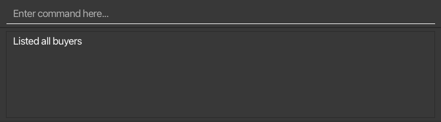

Cobb is a **Contact and Property Management System** that aims to help property agents manage their customer
base and properties, as well as match and gain actionable insights from stored data. 

As property agents, you can make use of Cobb's flexible **filtering and sorting** systems to understand key demographics of your customer base. 
Leverage on Cobb's **finding** system to quickly locate buyers that you want to retrieve information about. 
Finally, make use of Cobb's **matching** systems to match-make buyers and properties or vice-versa, boosting sales potential.

The only tools you need to make use of the full suite of capabilities Cobb has to offer are your hands and a keyboard.

This **user guide** aims to provide you with an in-depth overview of how to set up, use, and debug Cobb. 
Take a look at the [Command Summary](#command-summary) section for a quick overview of the different commands along with how to use them, 
or dive into the [Quick Start](#quick-start) section to get started. 

:exclamation: **Note:**
Be sure to check out the [Key Definitions](#key-definitions) section of the guide if you are confused
by any of the terms used!

--------------------------------------------------------------------------------------------------------------------

## Table of Contents

* Table of Contents
{:toc}

--------------------------------------------------------------------------------------------------------------------

## Quick start
[Back to top](#table-of-contents)

1. Ensure you have Java `11` or above installed in your Computer. This [link](https://docs.oracle.com/en/java/javase/11/install/overview-jdk-installation.html#GUID-8677A77F-231A-40F7-98B9-1FD0B48C346A)
   (external link to Oracle) provides a step-by-step installation guide for Java, if needed.

2. Download the latest `cobb.jar` from our [release page](https://github.com/AY2223S1-CS2103T-F12-1/tp/releases). 
   After clicking into the release page, scroll down slightly until you reach the **Assets** section of the page. This section should look like this: 
   
   
   Simply click on `cobb.jar`, and Cobb should begin downloading automatically on your computer!
   
3. Copy the `cobb.jar` file to the folder you want to use as the _main folder_ for Cobb. All data will be created and stored
   within this folder.

4. Double-click the file to start the app. A window similar to the image below should appear in a few seconds. The application should already contain some sample data, as shown below. 
   

Congratulations! Cobb is now set up and ready to work on your system.

If you encounter any bugs during the setup process, please check out the [FAQ](#faq) section of this guide, which hopefully
contains some information that can help you diagnose your issue.
 

:exclamation: **Caution (for advanced users):**
On first launch, Cobb will create a few files that have the extension `.json` in its *home directory*. These files are used
by Cobb to store its data. **Edit these at your own risk**, as Cobb will start with an empty database if it detects any
error in the formatting of the data in these files.

 

--------------------------------------------------------------------------------------------------------------------

## Key definitions
[Back to top](#table-of-contents)

This section aims to define some terms that pop up throughout the user guide. These terms are used often, so do take note of them 
before continuing!

### Command-specific terms
1. **Command**: An instruction that you can type into the [command input box](#1-command-input-and-output-boxes) to do
something in Cobb. Refer to [Features](#features) for the list of commands.
2. **Syntax**: Denotes what you should include in your command. Most commands require specific flags and inputs to work.
3. **Flag**: Comes before (and indicates) an input to a command. For example, in the command `filterbuyers -pr NORMAL`, `-pr` is the flag and `NORMAL` is the input.

### Buyer-specific terms
1. **Price Range**: The price range of properties that a buyer would consider buying. That is, the buyer would consider
   any property whose price falls within this range.
2. **Characteristics**: The characteristics of properties that a buyer desires. For example, a buyer that has characteristics
   `bright; sunny` is ideally looking for a property that is `bright` and `sunny`.
3. **Priority**: The priority that you assign to the buyer. Can be `LOW`, `NORMAL` or `HIGH`.
4. **Time of Creation**: The time at which you added the buyer to the database with the [Add Buyer Command](#adding-a-buyer-to-the-database-addbuyer).

### Property-specific terms
1. **Characteristics**: The characteristics associated with a property. For example, a property that has characteristics
   `windy; roomy` is both `windy` and `roomy`.
2. **Owner Name**: The name of the owner of the property.
3. **Owner Phone**: The phone number of the owner of the property.
4. **Time of Creation**: The time at which you added the property to the database with the [Add Property Command](#adding-a-property-to-the-database-addprop).

--------------------------------------------------------------------------------------------------------------------

## Interface Layout
[Back to top](#table-of-contents)

When you launch Cobb, Cobb will appear on your screen as a window. Let's take a look at the 4 different components
that make up this window.

### 1. Command Input and Output Boxes
These boxes are located at the top section of the window.  
  
The **command input box** is located where the placeholder text `Enter command here...` is. 
Clicking on it will allow you to type commands for Cobb to execute. 

The **command output box** is located directly beneath the **command input box**. Upon execution of any command, Cobb will 
display some information regarding the command, regardless of whether the command is successfully or not successfully executed.
In the image above, it is displaying the message "Listed all buyers", the message shown after successfully executing
the [List Buyers Command](#list-buyers-in-database-listbuyers).

:exclamation: **Note:**
If a command is not successfully executed, the text within the command input box will turn red.

After clicking on the **command input box**, you can use the up and down arrow keys to navigate the commands you have entered before.
A command is considered as entered after you press the Enter key and if it is successfully executed.
* The **up arrow** brings back a previously entered command into the command input box.
* The **down arrow** does the reverse of the up arrow, bringing back a more recently entered command.
These help you type many similar commands quickly as you can simply edit a previously entered command instead of having to type the
whole command out again.

Here are some commands you can test to start with.

* **`listbuyers`** : Lists all buyers in the database.

* **`addbuyer -n Tim Cook -ph 91234567 -e cook@apple.com -r 1000000-2500000 -a 10 lorong street avenue -c bright; sunny`** : 
Adds a buyer named "Tim Cook" with a specified phone number, email and address to the database.
This buyer has a specified price range, and desired characteristics for the property he wants to buy.

* **`deletebuyer 1`** : Deletes a buyer at index 1 of the [buyer list](#2-buyer-list) from the database.

* Press the **up arrow** key once after clicking on the command input box. This brings back **`deletebuyer 1`** into the command input box. 
  You can edit this to a similar command such as `deletebuyer 2` before pressing the Enter key.

* **`help`** : Displays a help window.

* **`exit`** : Exits the application.

You can refer to the [Features](#features) below for the details of each command.

### 2. Buyer List
You can find the buyer list located at the left section of the window.  
  
The buyer list displays information regarding buyers who are currently stored in Cobb's database. 

Note that it might not be showing *all* the buyers in the database all the time (check out the [FAQ](#faq) for more information).

You can also filter and modify the buyer list using the commands given in the [Features](#features) section below.

### 3. Property List
You can find the property list located at the right section of the window.  
  
The property list displays information regarding properties that are currently stored in Cobb's database. 

Note that it might not be showing *all* the properties in the database all the time (check out the [FAQ](#faq) for more information).

You can also filter and modify the property list using the commands given in the [Features](#features) section below.

### 4. Help Window
This will appear as a separate window.

The __help window__ displays a link to Cobb's User Guide, which is the online version of this document. :)

It appears when you execute the [Help Command](#viewing-help-help).

--------------------------------------------------------------------------------------------------------------------

## Features
[Back to top](#table-of-contents)

Cobb's features are mostly in the form of commands you can input into the [command input box](#1-command-input-and-output-boxes). We will now go into the details about each feature of Cobb.
If you just want a quick summary of all the feature Cobb has, do take a look at the [command summary](#command-summary) section.

**:information_source: Notes about the command syntax:** 

* The first word in the command text specifies which command you are using. For example, `help` specifies that you 
are using the `help` command, while `editbuyer 1 -n Jane Doe` specifies that you are using the `editbuyer` command.

* To specify inputs to the command, type the corresponding input's flag followed by a space, and then the value of your input. 
  e.g. `-n John Doe` will store the input value `John Doe` for the name flag, as indicated by `-n`. More details about the flags for each command will be given in each section below. 

* Inputs not contained in any brackets must be passed into the command. 
  e.g. `-n NAME` means that a `-n NAME` input must be specified.

* Inputs contained in square brackets `[]` are optional. 
  e.g. `[-c CHARACTERISTICS]` means that the `-c CHARACTERISTICS` input is optional.

* Inputs that contain angled braces `<>` can only take any one of the values specified within the braces. 
  e.g. `-pr PRIORITY<HIGH, NORMAL, LOW>` means that the `PRIORITY` input can only take values `HIGH`, `NORMAL` or `LOW`.

* Inputs can be in any order. 
  e.g. if the command specifies `[-n NAME] [-ph PHONE]`, `[-ph PHONE] [-n NAME]` is also acceptable.

* For commands immediately followed by an `INDEX`, `INDEX` refers to the index of the entry on the 
  [Buyer List](#2-buyer-list) or [Property List](#3-property-list).
  * Note that if an entry is not currently displayed on the list (check out the [FAQ](#faq) for the reason that this happens), 
   then the command cannot be executed on it,
    e.g. `deletebuyer 7` if the buyer list is only 5 entries long.

* If commands are missing specific inputs required for it to execute, an error message will be displayed that contains 
  information about the syntax of the command and its required inputs.

### Add Commands
#### Adding a buyer to the database: `addbuyer`

Adds a buyer to your database with relevant buyer information. 
Syntax: `addbuyer -n NAME -ph PHONE -e EMAIL -a ADDRESS [-r PRICE RANGE] [-c CHARACTERISTICS] [-pr PRIORITY<HIGH, NORMAL, LOW>]`

The `-n` flag indicates the buyer's name. 
The `-ph` flag indicates the buyer’s phone number. 
The `-e` flag indicates the buyer’s email. 
The `-a` flag indicates the buyer’s home address. 
The `-r` flag indicates the price range of properties that the buyer is willing to accept. A price range must take the form `abc` - `xyz`, where `abc` and `xyz` are numbers.  
The `-c` flag indicates the characteristics that the buyer is looking for in a property, each characteristic should be separated by `;`. 
The `-pr` flag indicates the priority of the buyer.

:bulb: **Tip:**
The price range, characteristics and priority fields are optional. 
Only the price range and characteristics fields can be set as "Not Specified" by simply omitting their flags (i.e. `-c` or `-r`), or 
by entering the flag with an empty input following it e.g. `-c  `. 
The priority field will default to "Normal" if the priority flag is not used. *It cannot take in an empty input if the flag is used*.

:bulb: **Note:**
To ensure that your database remains neat, Cobb will warn you when you try to add duplicate buyers that have the same phone number or email.

Examples: 
`addbuyer -n Tim -ph 87321237 -e tim@gmail.com -a S648234 -pr HIGH`: Adds a buyer named Tim who has high priority. 
`addbuyer -n Jane -ph 89991237 -e jane@gmail.com -a S123456 -r 200000-500000 -c bright; 5-room`: Adds a buyer named Jane who is looking for a "5-room" property that is "bright" and costs between $200000 - $500000.

#### Adding a property to the database: `addprop`

Adds a property to the database along with relevant information. 
Syntax: `addprop -n NAME -p PRICE -a ADDRESS -d DESCRIPTION -o OWNER NAME -ph OWNER PHONE [-c CHARACTERISTICS]`

The `-n` flag indicates the property's name. 
The `-p` flag indicates the property’s price. 
The `-a` flag indicates the property’s address. 
The `-d` flag indicates the property’s description. 
The `-o` flag indicates the name of the property owner. 
The `-ph` flag indicates the phone number of the property owner. 
The `-c` flag indicates the characteristics associated with the property, each characteristic separated by `;`. 

:bulb: **Tip:**
The characteristics field is optional and can be set as "Not Specified" by simply not including the `-c` flag, or 
by entering the flag with an empty input following it e.g. `-c  `.

:bulb: **Note:**
Similar to adding a duplicate buyer, Cobb will warn you when you try to add duplicate properties that have the same address.

Example:  
`addprop -n Peak Residences -a 333 Thompson Road -p 1000000 -d Long property description -o Bob -ph 91234567 -c Toa Payoh; Bright`: 
Adds a property called "Peak Residences" owned by Bob with a phone number of 91234567. It has the characteristics "Toa Payoh" and "Bright".

### Delete Commands
#### Deleting a buyer from the database: `deletebuyer`

Deletes the buyer at the specified index in the [Buyer List](#2-buyer-list). 
Syntax: `deletebuyer INDEX`

Example: 
`deletebuyer 5`: Deletes the fifth buyer currently visible in the buyer list.

#### Deleting a property from the database: `deleteprop`

Deletes the property at the specified index in the [Property List](#3-property-list). 
Syntax: `deleteprop INDEX`

Example: 
`deleteprop 5`: Deletes the fifth property currently visible in the property list.

### Edit Commands
#### Edit a buyer entry in the database: `editbuyer`

Edits a buyer’s details with new information, by specifying the relevant inputs to edit. 
Syntax: `editbuyer INDEX [-n NAME] [-ph PHONE] [-e EMAIL] [-a ADDRESS] [-r PRICE RANGE] [-c CHARACTERISTICS] [-pr PRIORITY<HIGH, NORMAL, LOW>]`

The `INDEX` indicates the buyer in the [Buyer List](#2-buyer-list) to be edited. 
The `-n` flag indicates the buyer's new name. 
The `-ph` flag indicates the buyer's new phone number. 
The `-e` flag indicates the buyer's new email. 
The `-a` flag indicates the buyer's new home address. 
The `-r` flag indicates the new price range of properties that the buyer can accept. 
The `-c` flag indicates the new characteristics that the buyer is looking for in a property. 
The `-pr` flag indicates the new priority of the buyer.

:bulb: **Tip:**
Notice how all the flags are optional, and you can choose to edit any number of them at once. 
Only the price range and characteristics fields can be reset by entering their flags with an empty input following it e.g. `-c  `. 

Examples: 
`editbuyer 3 -n John Doe -e johndoe@yahoo.com -r 40000-50000 -pr HIGH`: Edits buyer at index 3 to have a new name "John Doe", new email "johndoe@yahoo.com", new acceptable price range of $40000 - $500000, and a high priority. 
`editbuyer 1 -c bright; sunny`: Edits buyer at index 1 to have new desired characteristics of "bright" and "sunny".

#### Edit a property entry in database: `editprop`

Edits a property’s details with new information in specified categories. 
Syntax: `editprop INDEX [-n NAME] [-p PRICE] [-a ADDRESS] [-d DESCRIPTION] [-o OWNER NAME] [-ph OWNER PHONE] [-c CHARACTERISTICS]`

The `INDEX` indicates the property in the [Property List](#3-property-list) to be edited. 
The `-n` flag indicates the property's new name. 
The `-p` flag indicates the property’s new price. 
The `-a` flag indicates the property’s new address. 
The `-d` flag indicates the property’s new description. 
The `-o` flag indicates the property's owner's new name. 
The `-ph` flag indicates the property's owner's new phone number. 
The `-c` flag indicates the property's new characteristics. 

:bulb: **Tip:**
Only the characteristics fields can be edited to "Not Specified" by entering its flag and an empty input following it e.g. `-c  `.

Example: 
`editprop 3 -n Hill Residence -a Block 225 -p 750000`: Edits property at index 3 of the list to have a new name Hill Residence, a new address Block 225, and new price of $750000.

### List Commands

:exclamation: **Note:**
These commands can be used to view all buyers and properties again, after a [Filter Command](#filter-commands), 
[Find Command](#find-commands), or [Match Command](#match-commands) is executed. You can check out the [FAQ](#faq) for more information on this.

#### List buyers in database: `listbuyers`

Updates the [Buyer List](#2-buyer-list) to show all buyers in your database, that is, removes all filters you have applied. 
Syntax: `listbuyers`

#### List properties in database: `listprops`

Updates the [Property List](#3-property-list) to show all properties in your database, that is, removes all filters you have applied. 
Syntax: `listprops`
 
   
### Find Commands

:exclamation: **Note:**
Using these commands cause the [Buyer List](#2-buyer-list) and [Property List](#3-property-list) to only show a portion of 
buyers and properties in the database. Please use the [List Commands](#list-commands) if you want to show all buyers and properties again.

Also, no flags are used for these commands and so the search phrase is to be supplied directly.

#### Find buyer entry in database: `findbuyers`

Searches through your database and displays all buyers whose names contain the given phrase (case-insensitive). 
Syntax: `findbuyers PHRASE`

Examples: 
`findbuyers John`: Looks for all buyers that have “John” in their name. 
`findbuyers John T`: Looks for all buyers that have the phrase "John T" in their name.

#### Find property entry in database: `findprops`

Searches through your database and displays all properties whose names contain the given phrase (case-insensitive). 
Syntax: `findprops PHRASE`

Examples: 
`findprops Peak`: Looks for all properties that have “Peak” in their name. 
`findprops Peak Residence Hut`: Looks for all properties that have the phrase "Peak Residence Hut" in their name.

### Filter Commands

:exclamation: **Note:**
Using commands might cause the [Buyer List](#2-buyer-list) and [Property List](#3-property-list) to only show a portion of 
buyers and properties in the database. Please use the [List Commands](#list-commands) if you want to show all buyers and properties again.

#### Filter buyers in database (multiple conditions): `filterbuyers`

Filters buyers in your database according to multiple given conditions, and updates the [Buyer List](#2-buyer-list).

Syntax: `filterbuyers [-p PRICE] [-c CHARACTERISTICS] [-pr PRIORITY<HIGH, NORMAL, LOW>] [-fuzzy]`

The `-p` flag filters buyers with a price range containing the specified price. 
The `-c` flag filters buyers that have **ALL** the specified `;`-separated characteristics. 
The `-pr` flag filters buyers according to the specified priority level. 
The `-fuzzy` flag indicates that fuzzy filtering will be applied:
- filtered buyers will only need to satisfy **one** of the conditions supplied (if there are more than one)
- the `-c` flag will filter buyers that have **at least one** of the specified `;`-separated characteristics rather than all

:bulb: **Tip:**
By default, if multiple conditions are provided, the filter command will filter buyers who match ALL the conditions, unless the `fuzzy` flag is provided. 

The `-c` flag will take in `;`-separated characteristics. This means that if you supply the following input: `filterbuyers -c bright; sunny -fuzzy`,
Cobb will match buyers that have either `bright` or `sunny` in their characteristics, that is, these two characteristics
are taken as individual characteristics.

Examples: 
`filterbuyers -p 500000 -c bright; sunny -pr HIGH`: Filters all buyers that have a price range containing $500000 *AND* desired characteristics of bright *AND* sunny *AND* a `HIGH` priority. 
`filterbuyers -p 500000 -c bright; sunny -pr HIGH -fuzzy`: Filters all buyers that have a price range containing $500000 *OR* desired characteristics of bright *OR* sunny *OR* a `HIGH` priority.

#### Filter property in database (multiple conditions): `filterprops`

Filters properties in your database according to multiple given conditions, and updates the [Property List](#3-property-list).
Syntax: `filterprops [-r PRICE RANGE] [-c CHARACTERISTICS] [-o OWNER NAME] [-fuzzy]`

The `-r` flag filters properties with a price within the specified price range. 
The `-c` flag filters properties that have **ALL** the specified ";"-separated characteristics. 
The `-o` flag filters properties that have the specified owner. 
The `-fuzzy` flag indicates that fuzzy filtering will be applied:
- filtered properties will only need to satisfy **one** of the conditions supplied (if there are more than one)
- the `-c` flag will filter properties that have **at least one** of the specified `;`-separated characteristics rather than all.

:bulb: **Tip:**
Please see the tips above for more information regarding the `-c` and `-fuzzy` flags.

Examples: 
`filterprops -r 500000-1000000 -c bright; sunny -o GARY`: Filters all properties that have a price in the range $500000 - $1000000 *AND* have characteristics of bright *AND* sunny *AND* is owned by Gary. 
`filterprops -r 500000-1000000 -c bright; sunny -o GARY -fuzzy`: Filters all properties that have a price in the range $500000 - $1000000 *OR* have characteristics of bright *OR* sunny *OR* is owned by Gary.

### Sort Commands

:bulb: **Note:**
Note that you can only specify **one input** for these commands, as Cobb can only sort by **one** particular condition.

#### Sort buyers in database: `sortbuyers`

Sorts buyers in your database according to a single given condition, and updates the [Buyer List](#2-buyer-list).
Syntax: `sortbuyers [-n NAME<ASC/DESC>] [-r PRICE RANGE<ASC/DESC>] [-pr PRIORITY<ASC/DESC>] [-t TIME OF CREATION<ASC/DESC>]`

The `-n` flag indicates to sort buyers by name in ascending or descending order. 
The `-r` flag indicates to sort buyers by price range in ascending order (by lower bound) or descending order (by upper bound). 
The `-pr` flag indicates to sort buyers by priority level in ascending or descending order. 
The `-t` flag indicates to sort buyers by time of creation in ascending or descending order. 

Examples: 
`sortbuyers -pr DESC`: Sorts buyers from `HIGH` priority level to `LOW` priority level. 
`sortbuyers -r ASC`: Sorts buyers according to the lower price bound in ascending order. 
`sortbuyers -t ASC`: Sorts buyers according to the time of entry from least recent to most recent.

#### Sort properties in database: `sortprops`

Sorts properties in your database according to a single given condition, and updates the [Property List](#3-property-list).

Syntax: `sortprops [-n NAME<ASC/DESC>] [-p PRICE<ASC/DESC>] [-t TIME OF CREATION<ASC/DESC>]`

The `-n` flag indicates to sort properties by name in ascending or descending order. 
The `-p` flag indicates to sort properties by price in ascending or descending order. 
The `-t` flag indicates to sort properties by time of creation in ascending or descending order.

Examples: 
`sortprops -p DESC`: Sorts properties from highest to lowest price. 
`sortprops -t ASC`: Sorts properties by time of entry from least recent to most recent.

### Match Commands

:exclamation: **Note:**
These commands might cause the [Buyer List](#2-buyer-list) and [Property List](#3-property-list) to only show a portion of 
buyers and properties in the database. You can use the [List Commands](#list-commands) to show all buyers and properties again.

#### Match specified buyer to properties: `matchbuyer`

Intelligently matches a buyer in your database to all properties that are suitable for the buyer.
These properties must be within the buyer's price range and satisfy at least one of the buyer's characteristics to be considered suitable.

:exclamation: **Note:**
Any properties with price lower than the lower bound of the buyer's price range will be ignored since the match command looks for the most suitable properties for the buyer, instead of all properties that the buyer can afford.

Syntax: `matchbuyer INDEX [-strict]`

The `INDEX` indicates the buyer in the [Buyer List](#2-buyer-list) to be matched. 
The `-strict` flag indicates to reduce the matches to only properties that match *all* of the buyer's characteristics. 

Examples: 
`matchbuyer 5 -strict`: Matches buyer 5 to existing properties in the database based on price range and *all* desired characteristics.

#### Match specified property to buyers: `matchprop`

Intelligently matches a property in your database to all buyers who might be interested in that property.
The property's price must be within the buyer's price range and the buyer should desire at least one of the property's characteristics.

:exclamation: **Note:**
Any buyers with price range higher than the property's price will be ignored since the match command looks for the most suitable buyers for the property, instead of all buyers that can afford the property.

Syntax: `matchprop INDEX [-strict]`

The `INDEX` indicates the property in the [Property List](#3-property-list) to be matched. 
The `-strict` flag indicates to reduce the matches to only buyers that desire *all* the property's characteristics. 

Examples: 
`matchprop 5`: Matches property 5 to existing buyers in the database based on price and *at least one* characteristic.

### Clearing the program: `clear`

Clears Cobb (deletes all entries in your Buyer List and Property List).

Syntax: `clear`

### Exiting the program: `exit`

Exits Cobb (closes the program).

Syntax: `exit`

### Viewing help: `help`

Displays a window containing a link for you to access Cobb's User Guide for further help.

Syntax: `help`

### Saving the data

Cobb's data is saved for you automatically after any command that changes the data. There is no need to save manually.

### Editing the data file

Cobb's data is saved as 2 separate JSON files `[JAR file location]/data/buyerbook.json` and `[JAR file location]/data/propertybook.json`. If you are an advanced user, you are welcome to update data directly by editing these data files.

:exclamation: **Caution:**
If your changes to a data file make its format invalid, Cobb will discard all data and start with a sample data file on the next run.

--------------------------------------------------------------------------------------------------------------------

## FAQ
[Back to top](#table-of-contents)

**Q**: Why am I not seeing some properties and buyers in my property and buyer lists? 
**A**: You might be looking at a filtered portion of the lists. This is because you previously executed a 
[Filter Command](#filter-commands) or a [Find Command](#find-commands) or a [Match Command](#match-commands). To view all buyers and properties again, 
use the [List Commands](#list-commands).

**Q**: How do I transfer my data to another computer? 
**A**: Install the app in the other computer and overwrite the empty data files it creates with the files that contain your original data (found in Cobb's original data folder).
Alternatively, copy and paste the data file with the *same name* from your old computer.

**Q**: Help! I can't seem to get a command to work... 
**A**: Please refer to the [features](#features) section of our guide for command information and syntax. Make sure that you have supplied all necessary inputs for the command and specified the flags in a correct manner!

**Q**: How do I run the app if double-clicking the jar file does nothing?  
**A**: If you are experiencing this problem, there is a high likelihood that Java has not been installed correctly on your computer.
Please take a look at the [quick start](#quick-start) section of the guide for more setup information! For the more technically inclined, try running this command in the jar file's home directory: `java -jar cobb.jar` 
If the problem persists, please report the bug to us.

**Q**: I deleted my data file! Is there any way to recover the data that I lost? 
**A**: Try looking in your computer's trash bin on macOS or recycle bin on Windows for the files that were deleted. If the files can't be found, then we apologise, but there is currently
no way for you to retrieve lost data. :(

**Q**: How do I uninstall Cobb?  
**A**: We are sad to see you go :( Cobb is not installed onto your hard drive, so you only need to delete the folder that contains `cobb.jar` (that is, the *home folder* of Cobb).

**Q**: I don't understand some terms used in the guide... 
**A**: Please check out the [key definitions](#key-definitions) portion of the guide and see if the term that you are confused about is documented there!

--------------------------------------------------------------------------------------------------------------------

## Command Summary
[Back to top](#table-of-contents)

| Action                                                                            | Format, Examples                                                                                                                                                                                                                                    |
|-----------------------------------------------------------------------------------|-----------------------------------------------------------------------------------------------------------------------------------------------------------------------------------------------------------------------------------------------------|
| [Add buyer](#adding-a-buyer-to-the-database-addbuyer)                             | `addbuyer -n NAME -ph PHONE -e EMAIL -a address [-r PRICE RANGE] [-c CHARACTERISTICS] [-pr PRIORITY<HIGH, NORMAL, LOW>]`   e.g. `addbuyer -n Tim -ph 87321237 -e tim@gmail.com -a S648234 -pr HIGH`                                              |
| [Add property](#adding-a-property-to-the-database-addprop)                        | `addprop -n NAME -p PRICE -a ADDRESS -d DESCRIPTION -o OWNER NAME -ph OWNER PHONE [-c CHARACTERISTICS]`   e.g.`addprop -n Peak Residences -a 333 Thompson Road -p 1000000 -d long property description -o Bob -ph 91234567 -c Toa Payoh; Bright` |
| [Delete buyer](#deleting-a-buyer-from-the-database-deletebuyer)                   | `deletebuyer INDEX`   e.g. `deletebuyer 5`                                                                                                                                                                                                       |
| [Delete property](#deleting-a-property-from-the-database-deleteprop)              | `deleteprop INDEX`   e.g. `deleteprop 5`                                                                                                                                                                                                         |
| [Edit buyer](#edit-a-buyer-entry-in-the-database-editbuyer)                       | `editbuyer INDEX [-n NAME] [-ph PHONE] [-e EMAIL] [-a ADDRESS] [-r PRICE RANGE] [-c CHARACTERISTICS] [-pr PRIORITY<HIGH, NORMAL, LOW>]`  e.g. `editbuyer 3 -n John Doe -e johndoe@yahoo.com -r 40000-50000 -pr HIGH`                             |
| [Edit property](#edit-a-property-entry-in-database-editprop)                      | `editprop INDEX [-n NAME] [-p PRICE] [-a ADDRESS] [-d DESCRIPTION] [-c CHARACTERISTICS] [-o OWNER NAME] [-ph OWNER PHONE]`  e.g. `editprop 3 -n Hill Residence -a Block 225 -ph 82000100`                                                        |
| [List buyers](#list-buyers-in-database-listbuyers)                                | `listbuyers`                                                                                                                                                                                                                                        |
| [List properties](#list-properties-in-database-listprops)                         | `listprops`                                                                                                                                                                                                                                         |
| [Find buyers](#find-buyer-entry-in-database-findbuyers)                           | `findbuyers PHRASE`   e.g. `findbuyers John`                                                                                                                                                                                                     |
| [Find properties](#find-property-entry-in-database-findprops)                     | `findprops PHRASE`   e.g. `findprops Heng Mui Keng`                                                                                                                                                                                              |
| [Filter buyers](#filter-buyers-in-database-multiple-conditions-filterbuyers)      | `filterbuyers [-p PRICE] [-c CHARACTERISTICS] [-pr PRIORITY<HIGH, NORMAL, LOW>] [-fuzzy]`   e.g. `filterbuyers -p 500000 -c bright; sunny -pr HIGH -fuzzy`                                                                                       |
| [Filter properties](#filter-property-in-database-multiple-conditions-filterprops) | `filterprops [-r PRICE RANGE] [-c CHARACTERISTICS] [-o OWNER NAME] [-fuzzy]`   e.g. `filterprops -r 500000-1000000 -c bright; sunny -o GARY -fuzzy`                                                                                              |
| [Sort buyers](#sort-buyers-in-database-sortbuyers)                                | `sortbuyers [-n NAME<ASC/DESC>] [-r PRICE RANGE<ASC/DESC>] [-pr PRIORITY<ASC/DESC>] [-t TIME OF CREATION<ASC/DESC>]`   e.g. `sortbuyers -pr DESC`                                                                                                |
| [Sort properties](#sort-properties-in-database-sortprops)                         | `sortprops [-n NAME<ASC/DESC>] [-p PRICE<ASC/DESC>] [-t TIME OF CREATION<ASC/DESC>]`   e.g. `sortprops -p DESC`                                                                                                                                  |
| [Match buyer](#match-specified-buyer-to-properties-matchbuyer)                    | `matchbuyer INDEX [-strict]`   e.g. `matchbuyer 1 -strict`                                                                                                                                                                                       |
| [Match property](#match-specified-property-to-buyers-matchprop)                   | `matchprop INDEX [-strict]`   e.g. `matchprop 1`                                                                                                                                                                                                 |
| [Clear](#clearing-the-program-clear)                                              | `clear`                                                                                                                                                                                                                                             |
| [Exit Cobb](#exiting-the-program-exit)                                            | `exit`                                                                                                                                                                                                                                              |
| [Get help](#viewing-help-help)                                                    | `help`                                                                                                                                                                                                                                              |
   
