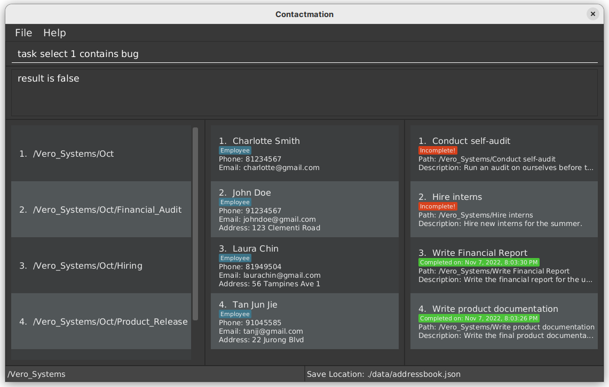

## **Table of contents**

1. [Introduction](#introduction)
2. [About](#about)
   1. [Purpose of guide](#purpose)
   2. [How to navigate the user guide](#user-guide-navigation)
   3. [Contactmation window guide](#contactmation-window-guide)
   4. [Prerequisites](#prerequisites)
3. [Quick start](#quick-start)
4. [Before you begin](#before-you-begin)
   1. [Standardised format style](#standardised-format-style)
   2. [Constraints on placeholder words](#constraints-on-placeholder-words)
   3. [Making groups within groups](#making-groups-within-groups)
5. [Features](#features)
   1. [Basic features](#basic-features)
       1. [General commands](#1-general-commands)
          1. [Clear command](#clear-command-clear)
          2. [Exit command](#exits-the-program-exit)
          3. [Add a field](#add-a-new-field-field-add)
          4. [Edit a field](#edit-a-field-field-edit)
          5. [Delete a field](#delete-a-field-field-delete)
          6. [Rename a group, person or task](#rename-the-name-of-items-on-the-screen)
          7. [Find command](#find-command-find)
       2. [Team/Group commands](#2-teamgroup-commands)
          1. [Create a team](#create-a-team-team-new)
          2. [Delete a team](#delete-a-team-team-delete)
          3. [Navigate to a team](#navigate-to-a-team-cg)
          4. [Add new contact to team](#add-new-contacts-within-a-team)
          5. [Remove contact from team](#removing-contacts-from-team-team-remove)
          6. [Creating or deleting a subteam](#creating-and-deleting-a-subteam)
          7. [Find a team](#finding-a-team-find)
       3. [Contact commands](#3-contact-commands)
          1. [Create a contact](#create-a-contact)
          2. [Delete a contact](#delete-a-contact)
          3. [List all contacts in team](#listing-all-contacts-in-current-team)
          4. [Find a contact](#find-command-find)
       4. [Task commands](#4-task-commands)
          1. [Adding a task](#adding-a-task-to-a-team-task-add)
          2. [Deleting a task](#deleting-a-task-from-team-task-delete)
          3. [Mark task](#mark-a-task-task-mark)
          4. [Unmark task](#unmark-a-task-task-unmark)
   2. [Advanced features](#advanced-features)
       1. [Chaining](#advanced-features-overview-chaining)
       2. [Feature constraints](#advanced-feature-constraints)
       3. [Select command](#select-command)
       4. [Contains command](#contains-command)
       5. [Execute command](#execute-command)
       6. [Replace command](#replace-command)
       7. [Foreach command](#foreach-command)
       8. [If else command](#if--else-command)
       9. [Aliasing](#aliasing)
       10. [Custom command / macro](#custom-command--macro)
6. [FAQ](#faq)
7. [Future plans](#future-plans)
8. [Glossary](#glossary)
9. [Commands summary](#command-summary)
   1. [General commands](#general-commands-summary)
   2. [Contact commands](#contact-commands-summary)
   3. [Group commands](#group-commands-summary)
   4. [Task commands](#task-commands-summary)
   5. [Advanced commands](#advanced-commands-summary)

---

## **Introduction**

> **What is Contactmation?**

Contactmation is a powerful **desktop-based project and task management solution** that **helps you efficiently and
effectively manage many projects at once** through the [Command Line Interface (CLI)](#glossary).

Contactmation will be able to help you save all your project member details, keep track of
each project, and delegate tasks to each project.

> **Who is Contactmation for?**

Contactmation is for **project managers and supervisors** who want to maintain an organised view of their
projects and streamline the management of their projects.

---

## **About**

### Purpose

This guide will elaborate on all the features available in Contactmation that will help make your experience of using 
Contactmation pain-free.

Examples with real-world applications are present to give you a clearer idea of how the features 
can be utilised.

### User Guide Navigation

This guide is broken into different sections that will aid you in better understanding our application.

Refer to:
- The [contactmation window guide](#contactmation-window-guide) for a guide on the application window.
- The [basic feature](#basic-features) section to get started on using the application.
- The [advanced feature](#advanced-features) section for powerful tools that will help make your experience of
using Contactmation much more streamlined and customisable.
- The [glossary](#glossary) for explanations to the different terms used throughout this guide.
- The [command summary](#command-summary) for a quick overview on how to use all our features.

For a more detailed view of all the features present, please visit the [table of contents](#table-of-contents).

### Contactmation Window Guide

The following figure shows how our application would appear on your screen upon opening Contactmation.
Each part of our application will be labelled as such:

We will be referring to these terminologies throughout the user guide.

### **Prerequisites**

Before you start up Contactmation on your computer, 

- Ensure that `Java version 11` or above is installed on your device. Do refer to the [FAQ](#faq) if you need help with 
checking whether `Java 11` is installed on your computer, or if you need help with installing `Java 11`.

- The current version of Contactmation can only be used in a desktop, but should work on all operating systems (such as 
Windows, macOS and Linux etc.) as long as `Java 11` is installed.

--- 

## **Quick start**

1. Ensure that the [prerequisites](#prerequisites) are met before installing Contactmation.

2. Download the latest version of `contactmation.jar` from
   [here](https://github.com/AY2223S1-CS2103T-T11-1/tp/releases). The file `contactmation.jar`
   can be found under the `Assets` for each version of Contactmation.

3. Save `contactmation.jar` into a Desktop folder on your computer. This folder will now be the home folder
   for Contactmation. Do look at the [FAQ](#faq) section for errors related to opening files used in Contactmation.

4. Double-click on `contactmation.jar` to start up the application. You will be greeted with the current window
   if everything goes well:

5. You may begin by referring to the [before you begin](#before-you-begin) section to get
   started.

6. You may then move on to the [basic features](#basic-features) section to get started on using
   Contactmation. For additional, more powerful commands, refer to our [advanced features](#advanced-features),
   especially if you are comfortable with the CLI or have prior programming experience.

:bulb: **Tip**: If you wish to clear all default entries and begin with on a fresh slate, use the [clear](#clear-command-clear) command.

---

## **Before you begin**

Before you begin, you will need to know how to interact with Contactmation.

You may only interact with Contactmation by typing [commands](#glossary) into the 
[command box](#contactmation-window-guide). Upon hitting the `Enter` key, you will be able to execute the command
currently residing in the command box.

> How do I clear the sample data in my newly downloaded version of Contactmation?

Simply type in the word `clear` into the command box and press the `Enter` key on your desktop. All the sample
data will be wiped. Do note that this action is **irreversible**.

> How do I properly write these commands? 
 
We will go through the standardised formats for each [basic](#basic-features) and [advanced](#advanced-features) 
feature in their respective sections.

> How do I read the standardised formats for each feature?

These formats may look cryptic at first glance. Do visit the [Standardised Format Style](#standardised-format-style)
section to better understand how to read the formats. 

### Standardised Format Style

This section aims to help you better understand the different terminologies used in the format section of each
feature description.

| Format                    | Explanation                                                                                                                                                                                                |
|---------------------------|------------------------------------------------------------------------------------------------------------------------------------------------------------------------------------------------------------|
| **Square brackets** ([ ]) | Anything that is within the square brackets are entirely **optional**. You may skip anything wrapped in the square bracket and move on to the next [word](#glossary) in the [command sequence](#glossary). |
| **Angled brackets** (< >) | Anything within angled brackets are placeholder words. These words will be replaced by other words for the command to run. The replacing words will be specified in the format section for each feature.   |
| **Ellipses** (`...`)      | The word which these ellipses are attached to can be repeated multiple times in a single command.                                                                                                          |

#### Combining the format styles

The **innermost** format in a word has the **highest** priority, while the **outermost** format in a word
has a **lower** priority than any format within it. However, since an outer format is considered after the inner format,
the outer format has a **stronger connotation** to it.

Here is an additional example to solidify your understanding of how these formats make sense when combined. 

If the command format in the format section of a feature has `[t/tags...]`, that means that the **ellipses**
will have a higher priority than the **square brackets**. This means that `t/tags` can be repeated multiple
times, but `t/tags` can be entirely optional as well. Therefore, it is possible to **skip** `t/tags` altogether, or have
1 or more `t/tags` in the command sequence.

Other keywords utilised in the guide are defined in the [glossary](#glossary).

### Constraints on placeholder words

This section will help you understand what placeholder words in the format section for each command can be 
replaced by. Placeholder words are words which are wrapped around angled brackets (`<>`) in the format section. 
Do refer to the [standardised format style](#standardised-format-style) section for more information to
understand the format styles for each command.

- The `NAME` of the contact or task must be [alphanumeric](#glossary) and can contain white spaces.

- The `TEAM NAME` must be alphanumeric.

- The `PHONE_NUMBER` is divided into 3 sections, namely the country code, area code and phone
  number in that order. Both the country and area code can have **1-4 digits**, and the phone number can
  be **3 digits or more**. All 3 sections must be separated by a white space. The `PHONE_NUMBER` may also
  begin with a (`+`) symbol. The country and area codes are entirely **optional**.

- The `EMAIL` of the contact must have an `@` symbol. We will refer to anything before the `@`
  symbol as `PART 1` and anything after the symbol to be `PART 2`.

    - `PART 1`: Can only contain alphanumeric characters and special characters such as (`+\_.-`).
      You may only start or end `PART 1` with alphanumeric characters.

    - `PART 2`: Must have at least one period (`.`). We will refer to text separated by periods as
      domain labels.
        - `PART 2` must end with a domain label at least **2 characters long**.
        - Each domain label must start and end with alphanumeric characters.
        - Each domain label can only consist of alphanumeric characters and hyphens.

- The `ADDRESS` of a contact can take any values, but it should not be blank.

- The `TAG` must be alphanumeric.

- The `INDEX` must be a positive whole number which cannot exceed the number of groups, contacts or tasks currently displayed in the
  application window.

- The `KEYWORD` and `MORE_KEYWORDS` must be alphanumeric.

- The `TITLE` is [alphanumeric](#glossary) and can contain hyphens and underscores. 

- The `DESCRIPTION` has no restrictions.

- The `ITEM` can only be replaced with either `task`, `person` or `team`.

### Making groups within groups

This section aims to help you understand the concept of creating groups under other groups.

> What is "making groups within groups"?
 
Here is a scenario. Let us say you are a boss of a company called **Just_Incorporated**, and you would like to track
the different departments in your company. Therefore, the departments in the company
(e.g. `Marketing` and `Research_And_Development` department) could act as groups within Contactmation.

However, let us also say that you are closely monitoring a particular group in the `Research_And_Development`
department, and let us call this group is `Vero_Ltd`. Then this group, `Vero_Ltd`, would
fall under the **`Research_And_Development`** group in Contactmation.

Here is how the grouping for this scenario would look like in theory:

This will be how the grouping looks like in Contactmation:

Note that `Vero_Ltd` is listed in group 3 as `/Research_And_Development/Vero_Ltd`.
This means that `Vero_Ltd` is within the group `Research_And_Development`, and this is shown with
the name of the group `Vero_Ltd` appearing after `Research_And_Development` followed by a slash (`/`)
separating the two names.

Now that you understand what it means to have a group inside another group, you might want
to view specific information about a certain group and ignore other group information.

> How do I restrict what I see on the display to only a specific group?

Let us say you are only interested in seeing everything related to the `Research_And_Development` department 
and nothing else. In this case, you might want to restrict what you see on the Contactmation display 
to only view information within `Research_And_Development`.

When you do this, all the other information in other groups (e.g. `Marketing`) will no longer
appear on your Contactmation display. Do not worry, all the other information is not lost. Information
about other groups are simply hidden from your view so that you can focus on `Research_And_Development`.

To "zoom into" a specific group, you can use the [cg](#navigate-to-a-team) command.

**:information_source: How to type the commands properly:** 

For more information on how to type the command, please visit the sections on
[standardised format styling](#standardised-format-style) and [placeholder constraints](#constraints-on-placeholder-words)
that is used to type all commands.

:bulb: **Tip**: The [cg](#navigate-to-a-team) command is also used to view all your other groups again. To do this, just type `cg ..` or `cg /` into the command box.

Following the above example, `cg 2` needs to be typed into the command box for you to view
`Research_And_Development`, since the `Research_And_Development` department is listed as group 2 in the 
Contactmation display.

The following screen should appear upon pressing `Enter`:

We can see that the `Marketing` and `Research_And_Development` departments can no longer be seen.
We are not able to see the `Marketing` department because now, we are focusing solely on the
`Research_And_Development` department. 

> What happened to the `Research_And_Development` department?

At the bottom left-hand corner of the [application window](#contactmation-window-guide), we can see
the current group we are in. 

Therefore, what we are seeing now is **any groups, contacts or tasks that exist within `Research_And_Development`
only**. Since `Vero_Ltd` is under the `Research_And_Development` group, it still can be seen on the display. 

> How do I create a group within another group?

Let's assume you want to create another group, `Kong_Pte_Ltd`, under the `Vero_Ltd` group.
So, you will have to use the `cg` command to first "zoom in" to `Vero_Ltd` and restrict what you are seeing
on the display. So we will need to type `cg 1` in the [command box](#contactmation-window-guide) and execute the 
statement.

Now, you are within the `Vero_Ltd` group. You may now create a subgroup within `Vero_Ltd` by executing the 
[team new](#create-a-team) command. In this case, you can type `team new Kong_Pte_Ltd` to create `Kong_Pte_Ltd`
within `Vero_Ltd`:

The `Kong_Pte_Ltd` group is now created within `Vero_Ltd`!

---

## **Features**

With Contactmation, you can not only use the [**basic features**](#basic-features) to manage your group project, but also use 
[**advanced features**](#advanced-features) to customise and streamline your experience in Contactmation.

However, if you are a new user of Contactmation, we recommend sticking
to just the basic features. The basic features are more than enough to provide for all your needs
with respect to group, contact and task management, whereas the advanced features only help with
increasing the efficiency of using the application on large numbers of groups, contacts and tasks.

Do visit the [standardised format style](#standardised-format-style) and the 
[format constraint](#constraints-on-placeholder-words) sections before writing commands
in Contactmation.

## Basic features

Now that you have finished setting up Contactmation, let’s start performing basic [commands](#glossary) with Contactmation.
As Contactmation aims to help you manage your contacts, project groups and tasks, we will start off by performing
a range of basic commands varying from adding a person to manipulating tasks and groups.

The basic features are categorised as the following:
1. [General Commands](#1-general-commands)
2. [Team/Group Commands](#2-teamgroup-commands)
3. [Contact Commands](#3-contact-commands)
4. [Task Commands](#4-task-commands)

## 1. General commands

These commands can be applied to any group, contact or task. 

### Clear command: `clear`

This command clears all group, contact and task entries from the application. You can write this command if you are,
for example, leaving a company and deciding to wipe all data related to the company.

:exclamation: **Caution: This action is irreversible! Please make sure that you really want to 
delete all your information before doing so.**

**Format:** `clear`

### Exits the program: `exit`

When this command is executed, the program will **save** all the groups, contacts
and tasks present in Contactmation and **closes** the application.

**Format:** `exit`

### Add a new field: `field add`

This command is for you to add additional information to a group, task, or person. This extra information
will appear as text below the name of the group, task or person, as shown below:

Here, we can see that additional information that "`Funding`" is "`On hold`" in the group `Research_and_development`.

A field can provide additional information to the [item](#constraints-on-placeholder-words) when it is needed.

**Format:**
- `field add u/<INDEX> <FIELD NAME> <DESCRIPTION>` to add a new field to the person at the current `INDEX`.

- `field add g/<INDEX> <FIELD NAME> <DESCRIPTION>` to add a new field to the group at the current `INDEX`.

- `field add t/<INDEX> <FIELD NAME> <DESCRIPTION>` to add a new field to the task at the current `INDEX`.

For example, let us say we have a task `Do paperwork`, and we want to add additional information to it. We can
call the command `field add t/1 Priority High` to add a field with the `NAME` as `Priority` and
the `DESCRIPTION` as `High` to the task with `INDEX` 1.

### Edit a field: `field edit`

This command will attempt to edit an **existing** field that belongs to a group, task or person. It replaces the
description of an existing field name to a new description.

Do visit the [glossary](#glossary) for more details on what a field is.

However, if the field name does not exist, then the field should be added first through the `field add` command
explained above. Field names are case-sensitive.

**Format**:

- `field edit u/<INDEX> <FIELD NAME> <NEW DESCRIPTION>` to edit the field named `FIELD NAME` to the person at 
   the current `INDEX`.

- `field edit g/<INDEX> <FIELD NAME> <NEW DESCRIPTION>` to edit the field named `FIELD NAME` to the group at
   the current `INDEX`.

- `field edit t/<INDEX> <FIELD NAME> <NEW DESCRIPTION>` to edit the field named `FIELD NAME` to the task at
   the current `INDEX`.

Here is an example. Let us say that we have a group, `Research_and_development`, that has
its "`Funding`" field to be "`On hold`".

Let us now change "`On hold`" to "`No longer on hold`", using the command `field edit g/2 Funding No longer on hold`.

The field is now successfully updated!

### Delete a field: `field delete`

The command will attempt to delete a field that belongs to a group, task or person.
A field can provide additional information to the [item](#constraints-on-placeholder-words) when it is needed.

**Format:**
- `field delete u/<INDEX> <FIELD NAME>` to delete a field from the person at the current `INDEX`.

- `field delete g/<INDEX> <FIELD NAME>` to delete a field from the group at the current `INDEX`.

- `field delete t/<INDEX> <FIELD NAME>` to delete a field from the task at the current `INDEX`.

Continuing from the example in [add a new field](#add-a-new-field-field-add), let us now
delete the `Priority High` field. To do this, we have to write `field delete t/1 Priority`
to delete the `Priority` field in the first task listed on the Contactmation display.

As we can see, the `Priority High` field is now deleted from the `Do paperwork` task.

### Rename the name of items on the screen

If you want to rename any [item](#constraints-on-placeholder-words) in the app, this `rename` command is for you.

**:information_source: Note:** 

In the following sections, `<new name>` here refers to the **new name that you
want the group, contact or task to be renamed to**.

**Format:**
- `rename g/<INDEX> <new name>` to rename the group at the listed `INDEX`.

- `rename u/<INDEX> <new name>` to rename the contact at the listed `INDEX`.

- `rename t/<INDEX> <new name>` to rename the task at the listed `INDEX`.

- `<ITEM> select <INDEX> rename <new name>`

**Example:**
- `rename g/1 Marketing`
  - this will rename the first **group** in your list to `Marketing`.

- `person select 1 rename Jimmy`
  - this will rename the first **user** in your list to `Jimmy`.

### Find command: `find`

Searches for a contact, group or task that matches the given `KEYWORD`. Searches may also include `MORE_KEYWORDS`
to further expand the search for a contact, subgroup or task within the [current team](#contactmation-window-guide).

**Format:** `<ITEM> find <KEYWORD> [<MORE_KEYWORDS>]`

**Examples:**

- `person find John Doe`
  - This means that we will find all persons in the current team with the current 

- `task find task1 task2`

## 2. Team/Group commands

Contactmation allows you to group your contacts into teams. This section will showcase the different commands that
can be used on groups.

Team-related commands in Contactmation begin with the `team` keyword.

### Create a team: `team new`

This command helps you create a new group/team name in the current team. 

**:information_source: Note:** 

For more information on creating teams within teams, check [this](#making-groups-within-groups)
section on what it really means to create teams within teams.

**Format**: `team new <TEAM NAME>`

The above command creates a new team with a specified team name. Do refer to the 
[constraints on placeholder words](#constraints-on-placeholder-words) section for more information on what
you can type in `TEAM NAME`.

**Examples**:

- `team new Vongola_X`

- `team new vero-employees`

As seen in the example above, we are able to add team `vero-employees` to our 
[group list](#contactmation-window-guide).

### Delete a team: `team delete`

To delete a team from Contactmation, you can use the `team delete` command followed by the team number seen in
the current display of the team list.

**Format**: `team delete <INDEX>`

**Examples**:

- `team delete 1`
    - The above command deletes team number 1 in the [team list](#contactmation-window-guide).
    
> What happens to all the people and tasks in that current team when I delete the team?

All `persons` and `tasks` will be transferred to the [root group](#glossary).

### Navigate to a team: `cg`

To perform commands specific to a team, you will have to navigate first to that specific team. You can use the `cg`
command to navigate to a specified team.

:bulb: **Tip**: Please take a look at [making groups within groups](#making-groups-within-groups) 
for a tutorial on team navigation before executing this command.

**Formats**:

- `cg <INDEX>`

- `cg ..` moves you out of the group and into the parent group. To better understand this, let us have the following
example:

Here, we can see that we are in the group `/Research_and_development/Vero_ltd`.
However, when we use the `cg ..` command, we are able to move to the `/Research_and_development` group.

When we are in the `/Research_and_development` group, we can see that there is a group in the [group list](#contactmation-window-guide).
That is the group we were in at first, before we used the `cg ..` command! 

- `cg /` moves you to the [root group](#glossary) in Contactmation. 
From the root group, you are able to **see all the groups currently existing in Contactmation**.

Following the previous examples in for the `cg` command, we see the `/Research_and_development` group,
`/Research_and_development/Vero_ltd` and an additional group, `/Marketing`, all at once!

**Examples**:

- `cg 3`
    - The above command allows you to navigate to team number 3 in your current [team list](#contactmation-window-guide).
    - Before:
      
    - After:
      
- `cg ..`
- `cg /`

**:information_source: Note for experienced programmers:** 

If you are familiar with UNIX-based operating systems such as Linux or familiar with using terminal, the navigation
command (`cg`) in Contactmation follows a similar syntax to the change directory command (`cd`).

### Add new contacts within a team

Once you have [navigated to a team](#navigate-to-a-team-cg), you can add a new contact within that team, which is done through the same command
as [adding a contact](#create-a-contact) to Contactmation.

### Removing contacts from team: `team remove`

Removes the contact from the current group by their currently specified `INDEX` as shown in
the application window.

There is an important distinction between a `team remove` and a `team delete`. In `team remove`,
the `INDEX` refers to a person, whereas in `team delete`, we are deleting a team altogether
from Contactmation.

**:information_source: Note:** 

This command simply **removes a person from the team you are currently in**. But this does not
mean that the person is deleted from Contactmation! The person is simply shifted to the
[root group](#glossary).

**Format:** `team remove <INDEX>`

**Example:**

- `team remove 3`
    - This command removes contact number 3 in the specified team, and transfers the contact to 
    the [root group](#glossary).
    
### Creating and Deleting a subteam

Contactmation allows the creation and deletion of a subteam within a team using the same command as
[creating a team](#create-a-team-team-new) and [deleting a team](#delete-a-team-team-delete).

### Finding a team: `find`

Contactmation allows for searching of teams with the [find command](#find-command-find).

## 3. Contact commands

Contact commands are used to manage people within Contactmation. The following commands are used to create,
modify and delete people within Contactmation. This section will showcase the different commands that
can be used on people.

Contact-related commands precede with the `person` keyword.

### Create a contact

Let us start off by adding a person to Contactmation. To add a contact, you can use the command `person new`, 
followed by the name of the person. You can also choose to provide the phone number, email and address 
to each person, or add a tag to identify each person.

**Format**: `person new n/<NAME> [p/<PHONE>] [e/<EMAIL>] [a/<ADDRESS>] [t/<TAG>]...`

**Examples**:

- `person new n/John Mays`
- `person new n/Hilbert Stewart p/+91 368 91829383 e/hilbertstewart@gmail.com a/68 Hudson Street t/friend`

### Delete a contact

You can use the `person delete` command to delete a contact from the list of persons in the current scope.

**Format**: `person delete <INDEX>`

**Example**:

- `person delete 1`

### Assign a user to a group: `assign`

If you want to place an existing `person` into a `group`, you can use this command.

**:information_source: Note:** 

This command only works if the `person` is not part of the `group` yet.

**Format:**
- `assign u/<INDEX> g/<INDEX>`

**Example:**

If you want to add the first person in your [person list](#contactmation-window-guide) into the second group on
your [group list](#contactmation-window-guide), your command will be `assign u/1 g/2`.

### Listing all contacts in current team

Contactmation supports the `list` command that displays all of your contacts within the [current group](#contactmation-window-guide) 
into your [person list](#contactmation-window-guide).

**Format**: `list`

---

## 4. Task commands

After adding your **contacts**, and allocating them into **teams**, you can give them **tasks**!
This section will showcase the different commands that can be used on tasks.

Task-related commands precede with the `task` keyword.

**:information_source: Notes about tasks:** 

Tasks can only be added if you are within a team. To check whether you are in a team, look at your
[current team](#contactmation-window-guide) and ensure it is not the [root group](#glossary), which
is when the current team is (`/`).

### Adding a task to a team: `task add`

Adds a new task to an existing group scope. This group **cannot be the root group**.

**Format:** `task add t/<TITLE> d/<DESCRIPTION>`

**Example:**

- `task add t/Complete all CS2103T homework d/Give description here`

### Deleting a task from team: `task delete`

Deletes an existing task from a group by their `INDEX` within the current [scope](#glossary).

Format: `task delete <INDEX>`

Example:

- `task delete 1`
  - This command deletes the first task in the task list.

### Mark a task: `task mark`

Marks a task as complete, with the current time as the completed time of the task.

Format: `task mark <INDEX>`

Example:

- `task mark 1`
    - This command marks the first task in the task list.

### Unmark a task: `task unmark`

Unmarks a task. The task will return to be `Incomplete`.

Format: `task unmark <INDEX>`

Example:

- `task unmark 1`
    - This command unmarks the first task in the task list.

## **Advanced features**

Now, there might be many things that you wish to do with managing your tasks and groups. However, it feels really,
really tedious to perform multiple functions one after the other.
Are you a power user? Are you good with logic? Well this section is for you! Supercharge your user experience by
adding and customizing your own commands and features!

Firstly, let’s understand what these commands are and how these commands work in Contactmation.

### Advanced features overview: Chaining

Most of the commands in Contactmation can take in an input and give an output. This is similar to how your functions
work in programming and mathematics.

For instance, take the command `ops`. This command can take in a value, perform some operators on it and returns
the value. Another command is the command `float`. This command allows you to create a floating point value and return
it.

Many commands in Contactmation have this functionality, and you can in turn **chain multiple commands together to
perform complicated tasks** that suits your needs.

So, how do we chain multiple commands together? We can use the `|` and `;` and the `seq` command to do so. The way
this commands work is extremely similar to how `|` and `;` works on a UNIX operating system. You can chain multiple
commands together like such:

- `seq <command 1> [| command 3]...`
- `seq <command 1> [; command 3]...`

Whenever a pipe symbol (`|`) is encountered, the output of the previous commands is then passed to the next command.

Whenever (`;`) is used, the output of the previous commands are not passed on.

All commands that produce an output supports the use of `|` to “pipe” their output to the subsequent commands.

#### Advanced feature constraints

While these advanced features can make your Contactmation experience a lot smoother, it is also subject to certain
limitations. These are the following constraints for each keyword in the format section of each advanced feature
command:

- The `MACRO WORD` is alphanumeric but hyphens and underscores are allowed. It must also begin with a letter.
- `INPUT` is a string of any length.

Here are some commands that will aid you in gaining better control over Contactmation:

### Select command

This command allows you to select a specific group, contact or task by their `INDEX`. While this command does nothing
by itself, it is useful as a precursor to chaining other commands after it.

**Format:** `<ITEM> select <INDEX> <COMMAND> [...]`

**Example:**

- `task select 3 mark`

### Contains command

You can use the `contains` command which takes in an item and checks if it contains a certain attribute. If it does,
then the attribute description will be shown in the result display if there is no further piping.

**Format:** `<ITEM> contains <ATTRIBUTE>`

**Example:**

- `task select 1 contains bug`

Here, we see that there are no `bug` attribute in the task `New Burger Recipes`.

### Execute command

This command allows for the running of a `command` on a piped string.

**Format:** `<INPUT> | e`

**Example:**

- `Who lives in a pineapple under the sea | e`

### Replace command

This command replaces a piece of text with another piece of text.

**Format:** `r <TEXT TO REPLACE> <TEXT TO BE REPLACED>`

**Example:**

- `r tetss te%ssts`

### Foreach command

Iterations can increase our workflow efficiency several fold, and through the `foreach` command, we can now cycle
through all entries of an item type in the current scope and apply a command to them. This can be especially powerful
when combined with piping to do complex executions with a single command!

**Format:** `<ITEM> foreach <COMMAND>`

**Example:**

- `task foreach mark`

### If / else command

This command behaves exactly like if else statements in programming languages. If the `CRITERIA` specified is met,
then the command sequence will execute `COMMAND IF`, else it will execute `COMMAND ELSE` instead. The command
ensures that the application cannot run `COMMAND IF` and `COMMAND ELSE` in the same command sequence.

>**Note:** If else commands cannot be nested in other if else commands directly.

**Format:** `if [[CRITERIA]] ;; [[COMMAND IF]] ;; [[COMMAND ELSE]]`

**Example:**

- `task select 1 if [[contains bug]] ;; [[mark]] ;; [[task delete]]`

### Aliasing

Aliasing is very useful to have in case you do not agree with the default naming scheme in Contactmation! Here’s
how it works:

**Format:** `alias <NEW COMMAND NAME> <COMMAND>`

**Example:**

- `alias group team`

After running `alias group team`, you are now able to use the command `group` as if it was a `team`!

### Custom command / Macro

Do you ever feel tired from typing the same commands over and over again? Do you find yourself highlighting your
commands and copying and pasting them? Macros are available in our application to solve this problem of yours.

All you have to do is assign the command sequence to a single word, or multiple words separated by hyphens and
underscores only. After that, when the word is typed into the command box, the command sequence it is used to
represent will run!

**Format:** `macro <MACRO WORD> <COMMAND SEQUENCE>`

**Example:**

- `macro markeverytask task foreach mark`

This will produce the following output:

When `markeverytask` is typed into the command box, all tasks become marked!

### Piecing multiple commands together

Here’s another example. You have just completed fixed a bunch of bugs you would like to mark off all tasks that
was bugged as complete.

Well, you know that you defined your custom field’s type as `bug` and you can see that task 1, 2 and 3 are bug
related tasks with the `Severity` labelled as a custom field in the bugs.

Well, you could of course just do `mark` commands 3 times and mark all the tasks, but what if there are a few
hundred of those pesky bug tasks that you and your team fixed?

Luckily for you, Contactmation supports the automation of commands!

Here is an example of a command sequence to search through all tasks and mark all tasks which have bug severity
ratings:

`task foreach if [[contains bug]] ;; [[mark]]`

Using just 1 command sequence, you are able to do the work that many normal commands would similarly achieve and
mark hundreds of tasks in a matter of seconds!

## **FAQ**

> How do I check whether `Java 11` is installed on my computer?

This depends on the type of computer you are using.

#### If you are using a Windows device:

1. Click the search icon in the task bar on your desktop.

2. Search for `Command Prompt` and open the application.
3. Type in `java -version` in the `Command Prompt` application. You should see something similar to this:

4. When you press the `Enter` key on your computer, you should be greeted with something similar to this:

5. The `Java` version in this example is listed as `java version 11.0.10`.

#### If you are using a Macbook:

1. Open the terminal by clicking on `Launchpad` and searching for `terminal` in the search bar.

2. Follow steps 3 onwards from [here](#if-you-are-using-a-windows-device).

#### If you are using a Linux machine:

Due to the wide variety of Linux distributions out there, you will need to search online
on how you can check for `Java 11` for your respective distribution.

Generally, the process in checking for your `Java` version on your Linux distribution is to:

1. Open the terminal.

2. Type `java -version` and see if there is an output. If there is no output, then `Java` is not installed. If there is an output, then check if the version for `Java` is correct. Refer to part 3-5 of the Windows section of this question for more information.

Here are some helpful [guides](https://phoenixnap.com/kb/check-java-version-linux) 
for popular Linux distributions such as Ubuntu.

> How can I install `Java 11`?

Follow the guide for installing `Java 11` [here](https://www.javatpoint.com/javafx-how-to-install-java).

> Why does my group name start with a `/`?

You might encounter this when adding a group to Contactmation:

This is because the `Marketing` group is under the [root group](#glossary), which is named by 
default with a slash (`/`). Therefore, when a group name is `/Marketing`, it means that the `Marketing`
group is a subgroup of the root group.

> How do I save my preferred window size when viewing Contactmation?

You can do this by exiting using the [exit](#exits-the-program-exit) command.

> How do I check whether I have access rights to Contactmation on my computer?

Contactmation must be stored in a location that does not have administrative rights to function properly,
such as `C:/` program files.

You can simply save Contactmation into your `D:/` drive instead of your `C:/` drive, or store Contactmation
on your Desktop.

To check the location of Contactmation, do the following steps:

1. Right-click on Contactmation.

2. Click on `Properties`.

3. You should see the following pop-up:

4. Here, we can see that under `Location`, we have `C:/` and `Desktop`. This means
that the location Contactmation does not need administrative rights to access. Therefore,
there should be no problem in starting and running Contactmation.

> Why is there an error in my result display stating: `Unable to save your information!`?

This is due to an error in saving your Contactmation details in a separate file.
To combat this, use the following steps:

1. Check if you need administrative rights to access the home folder where Contactmation is stored.

2. Your home folder should look something like this at first.

3. There are several files of note, which consists of the `data` folder, `config` file and `preferences`
file. If the `data` folder is not present, then the following steps can be ignored for the
`data` folder. If the `data` folder is present, then you should also find an `addressbook` file
within the `data` folder. The following steps are for `config`, `preferences` and the `addressbook` file.

4. Right-click on the file, and select `Properties`. You will be greeted a pop-up similar to this:

5. Under `Attributes` in the `General` section, ensure that `Read-only` is **not ticked**.

6. Click `Apply` and `OK` to save your changes.

7. Repeat steps 4 to 6 with the `config`, `preferences` and the `addressbook` file.

> Will this application also apply to a general, non-professional user?

This depends on what you will be using Contactmation for. It still can be used simply as an application
for simply saving and organizing contacts.

## **Future plans**

Our future plans for Contactmation includes:

- The ability to delegate tasks to individuals.
- Contacting any person through the application simply by clicking their email, phone number
  etc.
- Releasing a version of Contactmation on the mobile platform.
- The ability to synchronize data between multiple copies of Contactmation on your mobile and desktop.
- A pop-up window that shows the detailed form of descriptions to the user.
- A for loop command to iterate through and count groups, contacts or tasks by their attribute.

## **Glossary**

| Vocabulary                   | Description                                                                                                                |
|------------------------------|----------------------------------------------------------------------------------------------------------------------------|
| CLI / Command Line Interface | You can only interact with the application through text, which is typed in the [command box](#contactmation-window-guide). |
| Command / Command sequence   | What you would write in the command box to interact with the application.                                                  |
| Contact                      | A contact with contact information.                                                                                        |
| Alphanumeric                 | The text can contain capitalised and non-capitalised alphabets and numbers only.                                           |
| Field                        | A way to represent additional information for a group, person or task.                                            |
| Team                         | A container that contains people that work on a similar project.                                                           |
| Index                        | The numerical placing of a group, contact or task in the current application display.                                      |
| Item                         | An item can refer to a group, contact or task.                                                                             |
| Pipe                         | The output of the previous section of commands will be used as input for the next set of commands.                         |
| Root group                   | Refers to the application being able to view all groups in the display.                                                    |
| Task                         | Assigned to people or groups.                                                                                              |
| Word                         | Text in a command sequence that is separated from other words by a white space.                                            |

## **Command summary**

### General commands summary

| Command                                                       | Format                                                                        |
| ------------------------------------------------------------- | ----------------------------------------------------------------------------- |
| Clear all [items](#glossary) from Contactmation               | `clear`                                                                         |
| Exit Contactmation                                            | `exit`                                                                          |
| Add additional information to an item                         | `field add u/<INDEX> <FIELD NAME> <DESCRIPTION>` or `field add g/<INDEX> <FIELD NAME> <DESCRIPTION>` or `field add t/<INDEX> <FIELD NAME> <DESCRIPTION>` |
| Edit some additional information in an item                   | `field edit u/<INDEX> <FIELD NAME> <NEW DESCRIPTION>` or `field edit g/<INDEX> <FIELD NAME> <NEW DESCRIPTION>` or `field edit t/<INDEX> <FIELD NAME> <NEW DESCRIPTION>` |
| Delete some additional information in an item                 | `field delete u/<INDEX> <FIELD NAME>` or `field delete g/<INDEX> <FIELD NAME>` or `field delete t/<INDEX> <FIELD NAME>`                                                                         |
| Rename the name of items on the screen                        | `rename u/<INDEX> <new name>` or `rename g/<INDEX> <new name>` or `rename t/<INDEX> <new name>` or  `<ITEM> select <INDEX> rename <new name>`|
| Find a person, group or task                                  | `<ITEM> find <KEYWORD> [<MORE_KEYWORDS>]` |

### Group commands summary

| Command                            | Format                                                     |
|------------------------------------|------------------------------------------------------------|
| Adding new team                    | `team new <NAME>`                                          |
| Delete team                        | `team delete <INDEX>` or `team select <INDEX> team delete` |
| Changing teams                     | `cg <INDEX>` or `cg ..` or `cg /`                          |
| Removing contact from current team | `team remove <Contact INDEX>`                              |
| Finding a team                     | `team find <KEYWORD> [<MORE_KEYWORDS>]`                    |

### Contact commands summary

| Command                               | Format                                                                          |
|---------------------------------------|---------------------------------------------------------------------------------|
| Adding new contact to current context | `person new n/<NAME> [p/<PHONE_NUMBER>] [e/<EMAIL>] [a/<ADDRESS>] [t/<TAG>...]` |
| Delete contact                        | `person delete <INDEX>` or `person select <INDEX> person delete`                |
| Finding/filtering contacts            | `person find <keywords>`                                                        |
| Assigning a user to an existing group | `assign u/<INDEX> g/<INDEX>`                                                    |

### Task commands summary

| Command                            | Format                                                                   |
|------------------------------------|--------------------------------------------------------------------------|
| Adding new task to current context | `task new t/<title> d/<description>`                                     |
| Delete a task                      | `task delete <INDEX>` or `task select <INDEX> task delete`               |
| Marking a task as complete         | `task mark <INDEX>` or `mark <INDEX>` or task select <INDEX> mark`       |
| Marking a task as incomplete       | `task unmark <INDEX>` or `unmark <INDEX>` or task select <INDEX> unmark` |
| Finding/filtering tasks            | `task find <keywords>`                                                   |

### Advanced commands summary

| Command                  | Format                                                  |
|--------------------------|---------------------------------------------------------|
| Aliasing                 | `alias <NEW COMMAND NAME> <COMMAND>`                    |
| Saving macros            | `macro <NEW COMMAND NAME> <COMMANDS TO CHAIN>`          |
| Deleting Custom Commands | `rmMacro <COMMAND NAME>`                                |
| Chaining/seq             | `seq <command 1> [\                                     | command 3]... OR seq <command 1> [; command 3]...` |
| Contains                 | `<ITEM> contains <ATTRIBUTE>`                           |
| Execute                  | `<INPUT> \                                              | e`                                                          |
| Foreach                  | `<ITEM> foreach <COMMAND>`                              |
| If else                  | `if [[CRITERIA]] ;; [[COMMAND IF]] ;; [[COMMAND ELSE]]` |
| Macro                    | `macro <MACRO WORD> <COMMAND SEQUENCE>`                 |
| Replace                  | `r <TEXT TO REPLACE> <TEXT TO BE REPLACED>`             |
| Select                   | `<ITEM> select <INDEX> <COMMAND> [...]`                 |
| Create/convert int       | `int <integer>`                                         |
| Create/convert float     | `float <float>`                                         |
| Create/convert String    | `str <String>`                                          |
| Print                    | `<...> \                                                | print`                                                        |

[Back to top](#table-of-contents)
