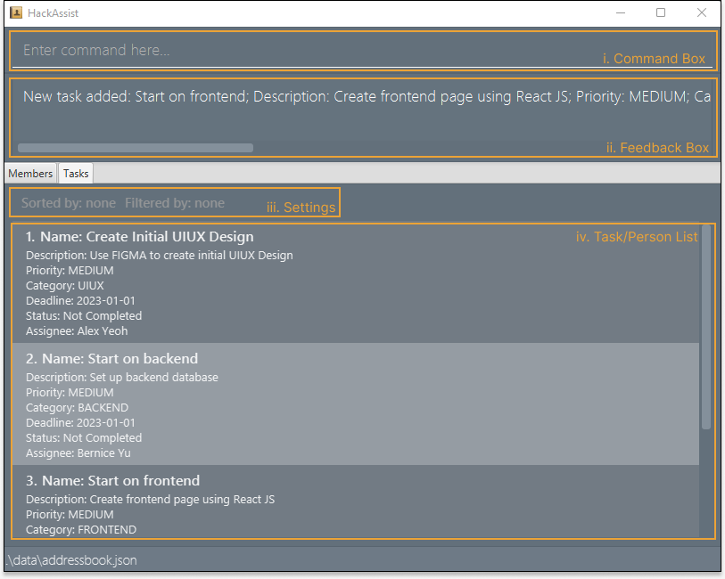

HackAssist is a desktop app for helping hackathon team leaders manage project tasks more easily.

It is optimized for use via a **Command Line Interface** (CLI) while still having the benefits of a **Graphical User Interface** (GUI). If you can type fast, HackAssist can get your task management done faster than traditional GUI apps.

* Table of Contents
{:toc}

--------------------------------------------------------------------------------------------------------------------

## Quick start

1. Ensure you have Java `11` or above installed in your Computer.

2. Download the latest `HackAssist.jar` from [here](https://github.com/AY2223S1-CS2103T-F12-2/tp/releases).

3. Copy the file to the folder you want to use as the _home folder_ for your HackAssist.

4. Double-click the file to start the app. The GUI similar to the below should appear in a few seconds. Note how the app contains some sample data. 
   

5. Click on the `Tasks` tab to switch to the task list view.

6. Type the command in the command box and press Enter to execute it. e.g. typing **`help`** and pressing Enter will open the help window. 
   Some example commands you can try:

   * **`listTasks`** : Lists all tasks in the task list.

   * **`addTask`**`n/Create profile page d/User profile pr/medium c/frontend dl/2023-01-01` : Adds task `Create profile page` to the task list.

   * **`deleteTask`**`1` : Deletes the first task from the task list.

   * **`help`** : Displays help text.

   * **`exit`** : Exits the app.

1. Refer to the [Features](#features) below for details of each command.

--------------------------------------------------------------------------------------------------------------------
## Command summary

| Action               | Format, Examples                                                                                                                                                                                                               |
|----------------------|--------------------------------------------------------------------------------------------------------------------------------------------------------------------------------------------------------------------------------|
| **Add**              | `add n/NAME p/PHONE_NUMBER e/EMAIL a/ADDRESS [t/TAG]…​`   e.g., `add n/James Ho p/22224444 e/jamesho@example.com a/123, Clementi Rd, 1234665 t/friend t/colleague`                                                          |
| **Delete**           | `delete INDEX`  e.g., `delete 3`                                                                                                                                                                                            |
| **Edit**             | `edit INDEX [n/NAME] [p/PHONE_NUMBER] [e/EMAIL] [a/ADDRESS] [t/TAG]…​`   e.g.,`edit 2 n/James Lee e/jameslee@example.com`                                                                                                   |
| **Find**             | `find KEYWORD [MORE_KEYWORDS]`   e.g., `find James Jake`                                                                                                                                                                    |
| **List People**      | `list`                                                                                                                                                                                                                         |
| **Clear**            | `clear`                                                                                                                                                                                                                        |
| **Help**             | `help`                                                                                                                                                                                                                         |
| **Add Task**         | `addTask n/TASK_NAME d/TASK_DESCRIPTION pr/PRIORITY c/TASK_CATEGORY dl/DEADLINE pe/EMAIL OF PERSON ASSIGNED`   e.g., `addTask n/Fix toggle d/Fix dark mode button pr/low c/frontend dl/2022-12-12 pe/charlotte@example.com` |
| **Edit Task**        | `editTask INDEX [n/TASK_NAME] [d/TASK_DESCRIPTION] [pr/PRIORITY] [c/TASK_CATEGORY] [dl/DEADLINE] [pe/EMAIL of person assigned] [do/ISDONE]`   e.g., `editTask 2 c/frontend pe/charlotte@example.com`                        |
| **Delete Task**      | `deleteTask TASK_NUMBER`   e.g., `deleteTask 1`                                                                                                                                                                             |
| **List Tasks**       | `listTasks`                                                                                                                                                                                                                    |
| **Filter Task**      | `filter [c/TASK_CATEGORY] [dl/DEADLINE]`   e.g., `filter c/backend dl/2022-12-12`                                                                                                                                           |
| **Sort by Deadline** | `sortByDeadline [o/ORDER]`   e.g., `sortByDeadline o/asc`                                                                                                                                                                   |
| **Sort by Priority** | `sortByPriority [o/ORDER]`   e.g., `sortByPriority o/desc`                                                                                                                                                                  |

--------------------------------------------------------------------------------------------------------------------

## Features

This section provides information on how you can use HackAssist commands for people management and tasks management. 

You can click [General](#General) to learn about general commands, [People Management](#People Management) to learn about commands specific to People Management, or [Task Management](#Task Management) to learn about commands specific to Task Management.

Before you learn any commands, please read the following notes about HackAssist command format.

**:information_source: Notes about the command format:** 

* Words in `UPPER_CASE` are the parameters to be supplied by the user. 
  e.g. in `add n/NAME`, `NAME` is a parameter which can be used as `add n/John Doe`.

* Items in square brackets are optional. 
  e.g `n/NAME [t/TAG]` can be used as `n/John Doe t/friend` or as `n/John Doe`.

* Items with `…`​ after them can be used multiple times including zero times. 
  e.g. `[t/TAG]…​` can be used as ` ` (i.e. 0 times), `t/friend`, `t/friend t/family` etc.

* Parameters can be in any order. 
  e.g. if the command specifies `n/NAME p/PHONE_NUMBER`, `p/PHONE_NUMBER n/NAME` is also acceptable.

* If a parameter is expected only once in the command but you specified it multiple times, only the last occurrence of the parameter will be taken. 
  e.g. if you specify `p/12341234 p/56785678`, only `p/56785678` will be taken.

* Extraneous parameters for commands that do not take in parameters (such as `help`, `list`, `exit` and `clear`) will be ignored. 
  e.g. if the command specifies `help 123`, it will be interpreted as `help`.

### General

#### Viewing help: `help`

Shows a message explaining how to access the help page.

Format: `help`

#### Clearing all entries: `clear`

Clears all contacts from the address book.

Format: `clear`

#### Exiting the program: `exit`

Exits the program.

Format: `exit`

#### Saving the data

HackAssist data are saved in the hard disk automatically after any command that changes the data. There is no need to save manually.

#### Editing the data file

HackAssist data are saved as a JSON file `[JAR file location]/data/HackAssist.json`. Advanced users are welcome to update data directly by editing that data file.

:exclamation: **Caution:**
If your changes to the data file makes its format invalid, HackAssist will discard all data and start with an empty data file at the next run.

### People Management

#### Adding a person: `add`

Adds a person to the address book.

Format: `add n/NAME p/PHONE_NUMBER e/EMAIL a/ADDRESS [t/TAG]…​`

:bulb: Tip:
A person can have any number of tags (including 0)

Examples:
* `add n/John Doe p/98765432 e/johnd@example.com a/John street, block 123, #01-01`
* `add n/Betsy Crowe t/friend e/betsycrowe@example.com a/Newgate Prison p/1234567 t/criminal`

#### Deleting a person: `delete`

Deletes the specified person from the address book.

Format: `delete INDEX`

* Deletes the person at the specified INDEX.
* The index refers to the index number shown in the displayed person list.
* The index must be a positive integer 1, 2, 3, …​

Examples:
* `list` followed by `delete 2` deletes the 2nd person in the address book.
* `find Betsy` followed by `delete 1` deletes the 1st person in the results of the find command, which should be Betsy.

#### Editing a person: `edit`

Edits an existing person in the address book.

Format: `edit INDEX [n/NAME] [p/PHONE] [e/EMAIL] [a/ADDRESS] [t/TAG]…​`

* Edits the person at the specified INDEX. The index refers to the index number shown in the displayed person list. The index must be a positive integer 1, 2, 3, …​
* At least one of the optional fields must be provided.
* Existing values will be updated to the input values.
* When editing tags, the existing tags of the person will be removed i.e. adding of tags is not cumulative.
* You can remove all the person’s tags by typing `t/` without
    specifying any tags after it.

Examples:
*  `edit 1 p/91234567 e/johndoe@example.com` edits the phone number and email address of the 1st person to be 91234567 and johndoe@example.com respectively.
*  `edit 2 n/Betsy Crower t/` edits the name of the 2nd person to be Betsy Crower and clears all existing tags.

#### Locating persons by name: `find`

Finds persons whose names contain any of the given keywords.

Format: `find KEYWORD [MORE_KEYWORDS]`

* The search is case-insensitive. e.g. hans will match Hans
* The order of the keywords does not matter. e.g. Hans Bo will match Bo Hans
* Only the name is searched.
* Only full words will be matched e.g. Han will not match Hans
* Persons matching at least one keyword will be returned (i.e. OR search).
  e.g. Hans Bo will return Hans Gruber, Bo Yang

Examples:
* `find John` returns john and John Doe
* `find alex david` returns Alex Yeoh, David Li  

#### Listing all persons: `list`

Shows a list of all persons in the address book.

Format: `list`

### Tasks Management

#### Adding a task: `addTask`

Adds a task to the task list.
* You cannot add a task same as one that currently exists in the taskList (this would result in duplicates)

Format: `addTask n/TASK_NAME d/TASK_DESCRIPTION pr/PRIORITY c/TASK_CATEGORY dl/DEADLINE [pe/EMAIL OF PERSON ASSIGNED]`

Refer to the [Task Parameters](#task-parameters) section for more details.

Examples:

* `addTask n/Fix toggle d/Fix dark mode button pr/low c/frontend dl/2022-12-12 pe/charlotte@example.com` adds task `Fix toggle` to the task list
* `addTask n/Fix routing d/Handle routing for POST req pr/high c/backend dl/2022-11-11 pe/john@example.com` adds task `Fix routing` to the task list

#### Deleting a task: `deleteTask`

Deletes a task from the task list.

Format: `deleteTask TASK_NUMBER`
* Deletes the task at the specified `TASK_NUMBER`.
* The task number refers to the task number shown in the displayed task list.
* The task number **must be a positive integer** 1, 2, 3, …​

Examples:
* `deleteTask 1` deletes the first task from the displayed task list

#### Editing a Task: `editTask`

Edits the parameter(s) of an existing task in the task list.

Format: `editTask INDEX [n/TASK_NAME] [d/TASK_DESCRIPTION] [pr/PRIORITY] [c/TASK_CATEGORY] [dl/DEADLINE] [pe/EMAIL_OF_PERSON_ASSIGNED] [do/ISDONE]`

* Edits the task at the specified index. The index refers to the index number shown in the displayed task list. The index must be a positive integer 1, 2, 3, …​ and less than or equal to the number of task in the task list.
* At least one of the optional fields must be provided.
* Existing values will be updated to the input values.
* To un-assign a member from a task, write `none` in the person email field `pe/` i.e. `pe/none`.
* To mark a task's status as `completed` (or `not completed`) write `t` (or `f`) in the status field `do` e.g. `do/t`

Examples:
* `editTask 1 n/Create UI pr/high` edits the name and priority of the 1st task in the displayed task list to be `Create UI` and `HIGH` respectively.
* `editTask 2 c/frontend pe/charlotte@example.com` edits the category of the 2nd task in the displayed task list to be `frontend` and assigns the task to a new member `Charlotte`.
* `editTask 3 pe/none` un-assigns a member from the 3rd task in the displayed task list.
* `editTask 4 do/t` marks the 4th task in the displayed task list as completed.

Refer to the [Task Parameters](#task-parameters) section for more details about task parameters.

#### Viewing all tasks: `listTasks`

Lists all existing tasks from the task list.
Used after calling [filter](#filtering-a-task--filter) to remove existing filters and list all existing tasks.

Format: `listTasks`

#### Filtering a Task: `filter`

Filters the task list based on either **TASK_CATEGORY** or **TASK_DEADLINE** or **BOTH**.

Format: `filter [c/TASK_CATEGORY] [dl/DEADLINE]`

* Filters the task based on the user input.
* At least one of the optional fields must be provided.
* Filtered tasks will be displayed in the task list.
* To list all tasks, call the `listTasks` command.

Examples:
*  `filter c/backend` displays only tasks that have backend as **TASK_CATEGORY**
*  `filter dl/2022-12-12` displays only tasks that have **DEADLINE** before or equal to 2022-12-12
*  `filter c/backend dl/2022-12-12` displays only tasks that have backend as **TASK_CATEGORY** and **DEADLINE** before or equal to 2022-12-12

#### Sorting the task list by deadline: `sortByDeadline`

Sorts the task list by task deadline.

Format: `sortByDeadline [o/ORDER]`

* Order can be `asc` for ascending (earliest first) or `desc` for descending (latest first).
* If order is not specified, it will default to ascending order.

Examples:
* `sortByDeadline` sorts tasks by deadline in ascending order.
* `sortByDeadline o/desc` sorts tasks by deadline in descending order.

#### Sorting the task list by priority: `sortByPriority`

Sorts the task list by task priority.

Format: `sortByPriority [o/ORDER]`

* Order can be `asc` for ascending (LOW to HIGH) or `desc` for descending (HIGH to LOW).
* If order is not specified, it will default to descending order.

Examples:
* `sortByPriority` sorts tasks by priority in descending order.
* `sortByPriority o/asc` sorts tasks by priority in ascending order.

## FAQ

**Q**: How do I transfer my data to another Computer? 
**A**: Install the app in the other computer and overwrite the empty data file it creates with the file that contains the data of your previous AddressBook home folder.

--------------------------------------------------------------------------------------------------------------------
## Task parameters

| Parameter               | Format                                                                                                                                                 |
|-------------------------|--------------------------------------------------------------------------------------------------------------------------------------------------------|
| n/NAME                  | Should contain only alphanumeric characters and spaces                                                                                                 |
| d/DESCRIPTION           | Should contain only alphanumeric characters and spaces                                                                                                 |
| pr/PRIORITY             | Should be either  `high`, `medium`, or `low` (case-insensitive)                                                                                        |
| c/CATEGORY              | Should be one of the following (case-insensitive):  - `database` - `frontend` - `backend` - `uiux` - `presentation` - `others` |
| dl/DEADLINE             | Should be in the format `YYYY-MM-DD` and after the current date                                                                                        |
| pe/PERSON EMAIL ADDRESS | Should be the email address of an existing member (case-insensitive). For the `editTask` command, it can also be empty, e.g. `pe/`.                    |
| do/ISDONE               | *For `editTask` command only.* Should be either `true` or `false` (case-insensitive)                                                                   |

