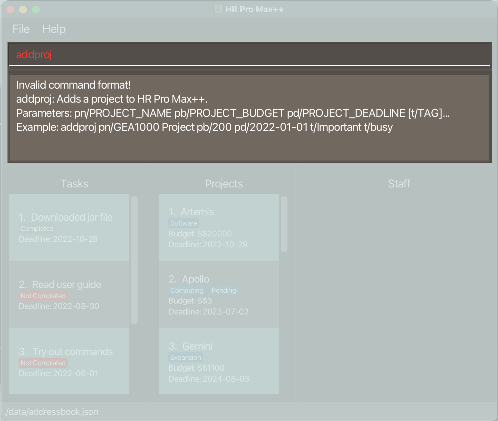

#Introduction
HR Pro Max++ is a **desktop app for team leads in SMEs to manage projects and staff members under them. It is optimized for use via a Command Line Interface** (CLI) while still having the benefits of a Graphical User Interface (GUI).
If you can type fast, HR Pro Max++ can get your project management tasks done faster than traditional GUI apps.

--------------------------------------------------------------------------------------------------------------------
## Table of Contents
- [Introduction](#introduction)
    - [Table of Contents](#table-of-contents)
    - [Quick start](#quick-start)
    - [Features](#features)
        - [Help](#help--help)
        - [Project Commands](#project-commands)
          - [Adding a Project](#adding-a-project-add)
          - [Deleting a Project](#deleting-a-project--delete)
          - [Listing all Projects](#listing-all-projects--list)
          - [Locating Project by name](#locating-project-by-name-find)
          - [Sorting the Project List](#sorting-the-project-list--sort)
          - [Editing a Project](#editing-a-project--edit)
        - [Staff Commands](#staff-commands)
          - [Adding a Staff Member to Project](#adding-a-staff-member-to-project--addstaff)
          - [Deleting a Staff Member from Project](#deleting-a-staff-member-from-project--delstaff)
          - [View the Staff list within a Project](#view-the-staff-list-within-a-project-view)
          - [Editing a Staff Member within a Project](#editing-a-staff-member-within-a-project--editstaff)
          - [Finding a Staff Member within a Project](#finding-a-staff-member-within-a-project--findstaff)
        - [Task Commands](#task-commands)
          - [Adding a Task](#adding-a-task--addtask)
          - [Deleting a Task](#deleting-a-task--deltask)
          - [Finding a Task](#finding-a-task--findtask)
          - [Sorting the Task list](#sorting-the-task-list--sorttask)
          - [Filtering the Task list](#filtering-the-task-list--filtertask)
          - [Marking a Task as Done](#marking-a-task-as-done--mark)
          - [Marking a Task as Undone](#marking-a-task-as-done--unmark)
        - [Exiting the Program](#exiting-the-program--exit)
        - [Clearing all data](#clearing-all-data--clear)
        - [Saving the data](#saving-the-data)
    - [User interface](#user-interface)
    - [FAQ](#faq)
    - [Command Summary](#command-summary)
    - [Prefix Summary](#prefix-summary)

--------------------------------------------------------------------------------------------------------------------
## Quick start

1. Ensure you have Java `11` or above installed in your Computer.

1. Download the latest `HR_Pro_Max++.jar` from [here](https://github.com/AY2223S1-CS2103T-T09-3/tp/releases).

1. Copy the file to the folder you want to use as the _home folder_ for your project management application.

1. Double-click the file to start the app. The GUI similar to the below should appear in a few seconds. Note how the app contains some sample data. 
   

1. Type the command in the command box and press Enter to execute it. e.g. typing **`help`** and pressing Enter will open the help window. 
   Some example commands you can try:

   * **`list`** : Lists all projects.

   * **`add`**`pn/Duke pb/ 20 pd/ 2022-09-27` : Adds a project named Duke` to HR Pro Max++.

   * **`delete`**`3` : Deletes the 3rd project shown in the current list.

   * **`clear`** : Deletes all projects currently saved on HR Pro Max++.

   * **`exit`** : Exits the app.

1. Refer to the [Features](#features) below for details of each command.

--------------------------------------------------------------------------------------------------------------------

## Features

**:information_source: Notes about the command format:** 

* Words in `UPPER_CASE` are the parameters to be supplied by the user. 
  e.g. in `add pn/PROJECT_NAME`, `PROJECT_NAME` is a parameter which can be used as `add pn/CS2103T`.

* Items in square brackets are optional. 
  e.g `pn/PROJECT_NAME [t/TAG]` can be used as `pn/2101 t/fun` or as `pn/2101`.

* Items with `…`​ after them can be used multiple times including zero times. 
  e.g. `[t/TAG]…​` can be used as ` ` (i.e. 0 times), `t/fun`, `t/fun t/expensive` etc.

* Parameters can be in any order. 
  e.g. if the command specifies `pn/PROJECT_NAME pb/PROJECT_BUDGET`, `pb/PROJECT_BUDGET pn/PROJECT_NAME` is also acceptable.

* If a parameter is expected only once in the command but you specified it multiple times, only the last occurrence of the parameter will be taken. 
  e.g. if you specify `sp/12341234 sp/56785678`, only `sp/56785678` will be taken.

* Extraneous parameters for commands that do not take in parameters (such as `help`, `list`, `exit` and `clear`) will be ignored. 
  e.g. if the command specifies `help 123`, it will be interpreted as `help`.

--------------------------------------------------------------------------------------------------------------------
### Help : `help`

Shows a message explaining how to access the help page.

Format: `help`

--------------------------------------------------------------------------------------------------------------------
## Project Commands
### Adding a Project: `add`

Adds a project to Project list.

Format: `add pn/PROJECT_NAME pb/PROJECT_BUDGET pd/PROJECT_DEADLINE [t/TAG]…​`

:bulb: **Tip:**
A project can have any number of tags (including 0)

Examples:
* `add pn/2103T_TP pb/100000 pd/2022-01-01`
* `add pn/CS2100 t/Tiring pb/1000 pd/2022-01-01 t/Funtime`

--------------------------------------------------------------------------------------------------------------------
### Deleting a Project : `delete`

Deletes the specified Project from Project list.

Format: `delete INDEX`

* Deletes the project at the specified `INDEX`.
* The index refers to the index number shown in the displayed Project list.
* The index **must be a positive integer** 1, 2, 3, …​

Examples:
* `list` followed by `delete 2` deletes the 2nd project in Project list.
* `find 2103T_TP` followed by `delete 1` deletes the 1st project in the results of the `find` command.

--------------------------------------------------------------------------------------------------------------------
### Listing all projects : `list`

Show all the Projects in the Projects list.

Format: `list`

--------------------------------------------------------------------------------------------------------------------
### Locating Project by Name: `find`

Finds all projects whose names contain any of the specified keywords (case-insensitive) and displays them as a list with index numbers.

Format: `find KEYWORD [MORE_KEYWORDS]`

* The search is case-insensitive. e.g `hans` will match `Hans`
* Only full words will be matched e.g. `Han` will not match `Hans`

Examples:
* `find CS2103` returns `CS2103` and `CS2103 TP`

--------------------------------------------------------------------------------------------------------------------
### Sorting the Project list : `sort`

Sorts the Project list according to deadline.

Format: `sort`

--------------------------------------------------------------------------------------------------------------------
### Editing a Project : `edit`

Edits an existing Project in the Project list.

Format: `edit INDEX [pn/PROJECT_NAME] [pb/PROJECT_BUDGET] [pd/PROJECT_DEADLINES] [t/TAG]…​`

* Edits the person at the specified `INDEX`. The index refers to the index number shown in the displayed person list. The index **must be a positive integer** 1, 2, 3, …​
* At least one of the optional fields must be provided.
* Existing values will be updated to the input values.
* When editing tags, the existing tags of the person will be removed i.e adding of tags is not cumulative.
* You can remove all the person’s tags by typing `t/` without
  specifying any tags after it.

Examples:
* `edit 1 pb/5000` Edits the project budget of the 1st project to be `5000`.
* `edit 2 pn/CS2103 t/` Edits the name of the 2nd person to be `CS2103` and clears all existing tags.

--------------------------------------------------------------------------------------------------------------------
## Staff Commands
### Adding a Staff member to Project : `addstaff`

Adds a staff member info to Project in project list.

Format: `addstaff pn/PROJECT_NAME sn/STAFF_NAME sl/LEAVE_STATUS sd/STAFF_DEPARTMENT st/STAFF_TITLE sc/CONTACT_NUMBER [t/TAGS]`

* All fields for staff member are required, except `TAGS`
* To see the updates to the staff list, use the `view` command.  

Examples:
* `addStaff pn/DUKE sn/John Doe sp/98765432 sl/true sd/Accounting st/Accountant` Adds staff member named `John Doe` to the project DUKE.
* `addStaff pn/ROOFUS sn/Betsy Crowe sp/1234567 st/Admin Staff sd/Admin sl/false` Adds staff member named `Betsy Crown` to the project ROOFUS.

--------------------------------------------------------------------------------------------------------------------
### Deleting a Staff member from Project : `delstaff`

Deletes a staff member and all its info inside a project in the project list.

Format: `delstaff pn/PROJECT_NAME sn/STAFF_NAME`

Examples:

* `delstaff pn/2103 sn/John` Delete staff member named `John` from project `2103`.
* `delstaff pn/DUKE sn/Betty` Delete staff member named `Betty` from project `DUKE`.

--------------------------------------------------------------------------------------------------------------------
### View the Staff list within a project: `view`

Views the staff list of a specified project in Project list.

Format: `view INDEX`

* View the staff list of the project at the specified `INDEX`.
* The index refers to the index number shown in the displayed Project list.
* The index **must be a positive integer** 1, 2, 3, …​

Examples:
* `list` followed by `view 2` displays the staff list of the 2nd project in Project list on the bottom right.
* `find 2103T_TP` followed by `view 1` display the staff list of the 1st project from the result of the `find` command.

--------------------------------------------------------------------------------------------------------------------
### Editing a Staff member within a Project : `editstaff`

Edits the staff details of a staff of a specified project in Project list.

Format: `editstaff INDEX pn/PROJECT_NAME [sn/STAFF_NAME sl/LEAVE_STATUS sd/STAFF_DEPARTMENT st/STAFF_TITLE sc/CONTACT_NUMBER
t\TAGS]`

* All fields for staff members in the `[]` are optional. 
* Index **must be a positive integer** 1, 2, 3, ...

Examples:
* `editstaff 1 pn/CS2103T sn/John Doe` edits the staff name of the first staff in the staff list of `CS2103T` to `John Doe`
--------------------------------------------------------------------------------------------------------------------
### Finding a Staff member within a Project : `findstaff`

Finds the current active staff list for a staff name

Format: `findstaff NAME`

* `NAME` must not be an empty string. 
*  For `findstaff` to work as expected, the current active staff list must be non-empty.

Examples:
* `findstaff Jon` returns a filtered view of the staff list such that all staffs with name `Jon` are listed.
* `findstaff Adrian Lam` returns a filtered view of the staff list such that all staffs with name `Adrian Lam` are listed. 
Staffs whose name contains `Adrian` or `Lam` only aren't listed. 
* You can always use `view INDEX` to list all the staff in the staff list after you are done with finding a particular staff.

--------------------------------------------------------------------------------------------------------------------
## Task Commands
### Adding a Task : `addtask`

Adds a Task to the Task list. 

Format: `addtask tdesc/TASK_DESCRIPTION td/TASK_DEADLINE`

* Both task fields `TASK_DESCRIPTION` and `TASK_DEADLINE` must be present.
* `TASK_DEADLINE` follows the **YYYY-MM-DD** format. 

Examples:
* `addtask tdesc/Finish Homework td/2022-10-27` creates a Task with the description `Finish Homework` and deadline set to
`2022-10-27`

--------------------------------------------------------------------------------------------------------------------
### Deleting a Task : `deltask`

Deletes a Task at the specified index from the Task list. 

Format: `deltask INDEX`

* `INDEX` is a positive integer from 1, 2, ... 

Examples:
* `deltask 1` deletes the Task at index 1 of the Task list.
* If the Task list has only 4 elements, `deltask 5` would return an error message of
`The task index provided is invalid`.

--------------------------------------------------------------------------------------------------------------------
### Finding a Task : `findtask`

Finds a specified Task in Task list.

Format: `findtask TASK_DESCRIPTION`

* The search is case-insensitive. e.g `hans` will match `Hans`
* Only full words will be matched e.g. `Han` will not match `Hans`
* The search returns the task if word in task description matches search term e.g. `CS2103T` matches `CS2103T Project`

Examples:
* `findtask CS2103` returns `CS2103` and `Todo CS2103`

--------------------------------------------------------------------------------------------------------------------
### Sorting the Task list : `sorttask`

Sort tasks in task list by deadline. Earlier deadlines will be placed first.

Format: `sorttask`

--------------------------------------------------------------------------------------------------------------------
### Filtering the Task list : `filtertask`

Show Tasks in Task List that are not done at the top of list.

Format: `filtertask`

--------------------------------------------------------------------------------------------------------------------
### Marking a Task as done : `marktask`

Marks a Task in Task list as done.

Format: `marktask INDEX`

* Marks the task at the specified `INDEX`.
* The index refers to the index number shown in the displayed Task list.
* The index **must be a positive integer** 1, 2, 3, …

Examples:
* `marktask 1` Marks the first task as done.

--------------------------------------------------------------------------------------------------------------------
### Marking a Task as Undone : `unmarktask`

Marks a Task in Task list as not done.

Format: `unmarktask INDEX`

* Marks the task at the specified `INDEX` as not done.
* The index refers to the index number shown in the displayed Task list.
* The index **must be a positive integer** 1, 2, 3, …

Examples:
* `unmarktask 2` Marks the second task as not done.

--------------------------------------------------------------------------------------------------------------------
### Exiting the program : `exit`

Exits the program.

Format: `exit`

--------------------------------------------------------------------------------------------------------------------
### Clearing all Data : `clear`

Clears all data from HR Pro Max++.

Format: `clear`

--------------------------------------------------------------------------------------------------------------------
### Saving the data
Project data is saved in the hard disk automatically after any command that changes the data. 
There is no need to save manually.

--------------------------------------------------------------------------------------------------------------------
## User Interface
The user interface is divided into 3 main parts: the command box, the result display and the List panel.
### Command Box
The command box is where you can type in your commands. You can press the `Enter` key to execute the command.

### Result Display
The result display is where the output of your commands will be shown. 
For example, entering an incorrect add command like shown below will cause an error message to be displayed in the result display.

### List Panel
Clicking on a `Task`, `Project`, or `Staff` card will cause the respective box to be highlighted in green. 
All `Task` and `Project` cards will be displayed in the `List Panel`.
By default, the `Staff` list is empty when first starting the program.
To see how to view the `Staff` list of other projects, you can check [this](#view-the-staff-list-within-a-project-view) segment of the user guide.

--------------------------------------------------------------------------------------------------------------------
## FAQ

**Q**: How do I transfer my data to another Computer? 
**A**: Install the app in the other computer and overwrite the empty data file it creates with the file that contains the data of your previous AddressBook home folder.

--------------------------------------------------------------------------------------------------------------------
## Command summary

| Action              | Format, Examples                                                                                                           |
|---------------------|----------------------------------------------------------------------------------------------------------------------------|
| **Add project**     | `add pn/PROJECT_NAME  [t/TAG]…​`   e.g., `add pn/DUKE pd/2022-10-25 pb/10000 t/funz`                                    |
| **Add staff**       | `addstaff pn/PROJECT_NAME sn/STAFF_NAME…​`   e.g., `addstaff pn/DUKE sn/DEXTER sl/true sd/HR st/HR manager sp/98019345` |
| **Delete staff**    | `delstaff pn/PROJECT_NAME sn/STAFF_NAME`   e.g., `delstaff pn/DUKE sn/DEXTER`                                           |
| **Clear**           | `clear`                                                                                                                    |
| **Delete**          | `delete INDEX`  e.g., `delete 3`                                                                                        |
| **Edit**            | `edit INDEX [pn/PROJECT_NAME] [pd/PROJECT_DEADLINE]…​`  e.g.,`edit 2 pn/ROOFUS pb/1350000`                              |
| **Find**            | `find pn/PROJECT_NAME`  e.g., `find DUKE`                                                                               |
| **List**            | `list`                                                                                                                     |
| **View staff list** | `view INDEX`   e.g., `view 1`                                                                                           |
| **Help**            | `help`                                                                                                                     |

## Prefix Summary
Prefixes that start with `s` are for project staff member details.
Prefixes without the prefix `s` are meant for project details.

| Prefix     | Meaning            | Format/ Examples       |
|------------|--------------------|------------------------|
| **pb/**    | Project budget     | pb/PROJECT_BUDGET      |
| **pd/**    | Project deadline   | pd/PROJECT_DEADLINE    |
| **pn/**    | Project name       | pn/PROJECT_NAME        |
| **sc/**    | Staff Contact      | sc/STAFF_CONTACT       |
| **sd/**    | Staff department   | sd/STAFF_DEPARTMENT    |
| **sl/**    | Staff leave status | si/LEAVE_STATUS        |
| **sn/**    | Staff name         | sn/STAFF_NAME          |
| **st/**    | Staff title        | st/STAFF_TITLE         |
| **td/**    | Task deadline      | td/TASK_DEADLINE       |
| **tdesc/** | Task description   | tdesc/TASK_DESCRIPTION |
| **tm/**    | Task mark          | tm/TASK_MARK           |

