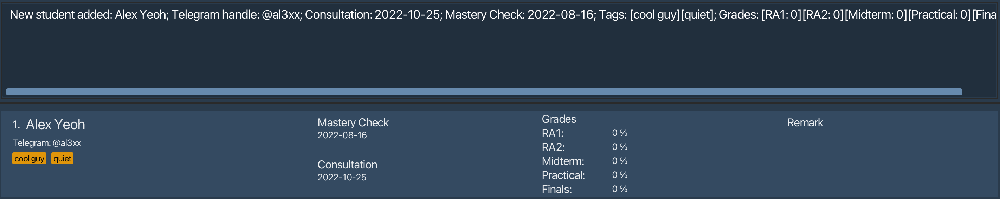
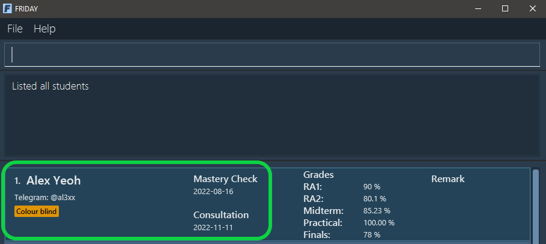
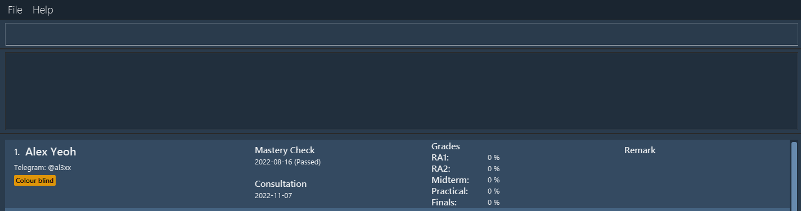

* Table of Contents
  {:toc}

## Introduction

Welcome to the User Guide of **FRIDAY**!

As a [CS1101S teaching assistant](#glossary), do you find yourself scrambling between your notes, students' contacts, 
and calendar to consolidate and manage of all your students' information? Do you spend hours consolidating your students'
work and keeping track of their progress to ensure that they have completed their tasks on time and are coping well in 
the module?

Worry no more! Our application, **FRIDAY**, will reduce the hassle of managing your students and save you valuable time
and effort by alleviating your workload. You can spend more time focusing on your own studies, improving your 
teaching methods, and provide a better learning experience for your students!

**FRIDAY** is an intuitive and easy-to-use application that helps CS1101S teaching assistants consolidate
their students' information - such as contact details, grades, consultation dates, and assignments - into a single 
application.

The application is optimised for use via a [Command Line Interface (CLI)](#glossary), while having the benefits of a 
[Graphical User Interface (GUI)](#glossary). This means that you can operate the application by typing and inputting 
commands into a Command Box. If you are fast at typing, **FRIDAY** can get your student management tasks done faster 
than other GUI applications. As a GUI application, it also allows users to interact with the application through 
interactive graphical icons such as buttons.

If you are interested to try, jump to [Quick Start](#quick-start) to learn how to start using **FRIDAY**!

--------------------------------------------------------------------------------------------------------------------
## Quick start

This section guides you along the process of downloading and opening FRIDAY.

1. Ensure you have Java 11 or above installed in your computer.

2. Download the latest JAR file `friday.jar` from [here](https://github.com/AY2223S1-CS2103T-W15-4/tp/releases).

3. Copy the file to the folder you want to use as the *home folder* for your FRIDAY.

4. Double-click the file to start the app. The GUI similar to the one below should appear in a few seconds. Note how the app contains some sample data. 
   

5. Type the command in the command box and press Enter to execute it. e.g. typing **`help`** and pressing Enter will open the help window. 
   Some example commands you can try:
    * **`add n/Alex Yeoh t/al3xx c/2022-10-25`** : Adds a student named `Alex Yeoh` to FRIDAY.

    * **`list`** : Lists all students.

    * **`delete 2`** : Deletes the 2nd student shown in the current list.

    * **`clear`** : Deletes all students.

    * **`exit`** : Exits FRIDAY.

6. Refer to the [Features](#features) below for details of each command.

[Table of Contents](#table-of-contents)

--------------------------------------------------------------------------------------------------------------------
## A guide to using FRIDAY's CLI

**:information_source: Notes about the command format:** 

* Words in `UPPER_CASE` are the parameters to be supplied by the user. 

  e.g. in `add n/NAME`, `NAME` is a parameter which can be used as `add n/John Doe`.

* Items in square brackets are optional. 

  e.g. `n/NAME [t/TELEGRAM_HANDLE]` can be used as `n/John Doe t/johndoe` or as `n/John Doe`.

* Items with `…`​ after them can be used multiple times including zero times. 

  e.g. `[tag/TAG]…​` can be used as ` ` (i.e. 0 times), `tag/fast learner`, `tag/fast learner tag/good at recursion` etc.

* Parameters can be in any order. 

  e.g. if the command specifies `n/NAME t/TELEGRAM_HANDLE`, `t/TELEGRAM_HANDLE n/NAME` is also acceptable.

* If a parameter is expected only once in the command, but you specified it multiple times, only the last occurrence of the parameter will be taken. Note that this does not apply to the `INDEX` parameter in commands that have it, namely the `delete`, `edit`, `remark`, `grade`, `mark` and `unmark` commands, as they expect exactly one `INDEX` parameter. 

  e.g. if you specify `t/johndoe t/johndoe123`, only `t/johndoe123` will be taken.

* Extraneous parameters for commands that do not take in parameters (such as `help`, `list`, `exit` and `clear`) will be ignored. 

  e.g. if the command specifies `help 123`, it will be interpreted as `help`.

* `INDEX` is used in commands to refer to a specific student by their index number on the currently displayed list,
  so it ` **must be a positive integer** 1, 2, 3, …​

[Table of Contents](#table-of-contents)

## Features

This section contains all the information and details of each feature of **FRIDAY**. These features are split into 5 sections depending on their purpose and function:
1. [Student management](#Student management)
2. [Organizing students](#Organizing students)
3. [Grading students](#Grading students)
4. [Miscellaneous features](#Miscellaneous features)
5. [Features for advanced users](#Features for advanced users)

## Student management

These features allow you to add and delete students, and edit their details.

Before you dive into using the features, you may want to have a look at the common parameters used.
The table below shows a list of command parameters that will be used.

<table>
<tr><th>Parameter Name</th><th>Description</th><th>Example</th></tr>
<tr><td><pre>NAME</pre></td><td>The name of the student.    It must be an alphanumeric word.</td><td>E.g. Typing <code>John Doe</code> would represent the name of the student saved in the list.</td></tr>
<tr><td><pre>TELEGRAM_HANDLE</pre></td><td>The Telegram handle of the student.     The Telegram handle can only contain alphanumeric characters and underscores.     It must also be between 5 and 32 characters long.</td><td><code>johndoe_123</code></td></tr>
<tr><td><pre>CONSULTATION_DATE</pre></td><td>The consultation date of the student.     It must be a valid date in the <code> YYYY-MM-DD </code> format, where the year is between 1900 and 2999.</td><td>E.g. <code>2022-09-27</code> would represent the student's consultation date of 27 September 2022.</td></tr>
<tr><td><pre>MASTERY_CHECK_DATE</pre></td><td>The Mastery Check date of the student.     It must be a valid date in the <code> YYYY-MM-DD </code> format, where the year is between 1900 and 2999.</td><td>E.g. <code>2022-08-30</code> would represent the student's Mastery Check date of 30 August 2022.</td></tr>
<tr><td><pre>TAG</pre></td><td>The tag you want to attach to the student. </td><td>E.g. Typing <code>cool guy</code> would mean that "cool guy" is an additional information associated with the student.</td></tr>
<tr><td><pre>REMARK</pre></td><td>The remark you want to add for the student. </td><td>E.g. Typing <code>Needs more help</code> would mean that "Needs more help" is an additional information associated with the student.</td></tr>
<tr><td><pre>INDEX</pre></td><td>The index of the student in the displayed list.     It must be a valid and positive index number.</td><td>E.g. Typing <code>2</code> would mean the student at the second position in the displayed list.</td></tr>
</table>

### Adding a student: `add`

Adds a student to FRIDAY, with the given name, Telegram handle, consultation date, Mastery Check date, and tags.

Format: `add n/NAME [t/TELEGRAM_HANDLE] [c/CONSULTATION_DATE] [m/MASTERY_CHECK_DATE] [tag/TAG]...`

* The student details and their associated prefixes are:
    * Name - `n`
    * Telegram Handle - `t`
    * Consultation date - `c`
    * Mastery Check date - `m`
    * Tags - `tag`

**:information_source: Note:**  
* All student names and Telegram handles in FRIDAY must be unique.
* Names and Telegram handles are case-insensitive.

**:bulb: Tip:**  
* A student can have any number of tags (including 0).

Example: `add n/Alex Yeoh t/al3xx c/2022-10-25 m/2022-08-16 tag/cool guy tag/quiet`

Outcome: a student named Alex Yeoh is added.

### Deleting a student: `delete`

You may need to delete students from your list in certain cases, such as when they decide to drop the module. The `delete` function allows you to do this and deletes the student at the given index from FRIDAY.

Format: `delete INDEX`

**:information_source: Note:**  
* The index of the student must be specified and there should be exactly one INDEX parameter.

### Editing a student: `edit`

You may not have all your students' details at the start, or you may have typed in the wrong details for a specific student. You can use the `edit` feature to add in or edit a student's details after getting this information. This feature is also useful for adding Mastery Check and Consultation dates you have scheduled with your students.

Format: `edit INDEX [n/NAME] [t/TELEGRAM_HANDLE] [c/CONSULTATION] [m/MASTERY_CHECK] [tag/TAG]...`

**:information_source: Note:**  
* The index of the student must be specified and there should be exactly one INDEX parameter.
* You can choose which field to edit for the student. Name, Telegram handle, consultation, Mastery Check, and tag(s) are
optional fields, but there should be at least one field specified for the `edit` command to be valid. 

**:bulb: Tip:**  
* A student can have any number of tags (including 0).

Example: `edit 1 n/Alex Yap t/AlexYap tag/Experienced coder tag/Intern m/2022-11-06 c/2022-10-10`

Initial: A student with name "Alex Yeoh", with the following details: Telegram handle as "@al3xx", Mastery Check date
on 2022-08-16, consultation date on 2022-11-11, and a tag "Colour blind".

Outcome: Student's name changed to "Alex Yap", along with the following changed details: Telegram handle as "@AlexYap",
Mastery Check date as 2022-11-06, consultation date as 2022-10-10, and tags as "Experienced coder" and "Intern".

### Editing a remark for a student: `remark`

You may have noted something interesting about a student, which you wish to save as a remark in your list. The `remark` feature allows you to add this remark to the specified student.

Format: `remark INDEX [r/REMARK]`

**:information_source: Note:**  
* The index of the student must be specified and there should be exactly one INDEX parameter.

**:bulb: Tip:**  
* The remark is optional. If you do not include the remark (i.e. input `remark INDEX` as your command), FRIDAY will 
remove any existing remark for the specified student. 

Example: `remark 1 r/Aspiring to be a CS1101S TA for next year`

Outcome: The student at the 1st index (Alex Yap) will have the remark "Aspiring to be a CS1101S TA for next year".

[Table of Contents](#table-of-contents)

## Organizing students

These features allow you to organize your list of students to suit your needs.

### Command Parameters
Before you dive into using the features, you may want to have a look at the parameters used.
The table below shows a list of command parameters that will be used.

<table>
<tr><th>Parameter Name</th><th>Description</th><th>Example</th></tr>
<tr><td><pre>CRITERIA</pre></td><td>The criteria the displayed student list is sorted by.</td><td>E.g. Typing <code>n</code> would mean the displayed student list is sorted by students' names.</td></tr>
<tr><td><pre>ORDER</pre></td><td>The order the displayed student list is sorted in.</td><td>E.g. Typing <code>a</code> would mean the displayed student list is sorted in ascending order.</td></tr>
<tr><td><pre>KEYWORDS</pre></td><td>The keywords to search with to find students' information. </td><td>E.g. Typing <code>cool guy</code> would represent finding students with the information "cool guy" associated with them.</td></tr>
</table>

### Sorting students: `sort`

Sorts all students in FRIDAY with the given criteria, in ascending or descending order. This will come in useful by allowing you to see which students have Mastery Checks closest to the current date by sorting the list according to the students' Mastery Check dates, as shown in the example below.

Format: `sort CRITERIA/ORDER`

* `CRITERIA` can be
    * `n` (name)
    * `t` (Telegram handle)
    * `c` (consultation)
    * `m` (Mastery Check)
    * `ra1` (Reading Assessment 1)
    * `ra2` (Reading Assessment 2)
    * `pa` (Practical Assessment)
    * `mt` (Midterm Test)
    * `ft` (Final Examination)
* `ORDER` can be
    * `a` (ascending)
    * `d` (descending)

How criteria are sorted:
* Names and Telegram handles - alphabetical order
* Consultations and Mastery Checks - chronological order
* Grades - numerical order

**:information_source: Note:** 
* If the `find` command was run before `sort`, using `sort` will undo the result of `find` and all students will be sorted.
* Students with missing information will be sorted first in descending order, e.g. students with no Telegram handles
  will be shown before students with Telegram handles.

Example: Enter `sort m/a` with an unsorted list of students.

Outcome: Students are sorted by Mastery Check date, from earliest to latest.

### Finding individual student details: `find`

You can search for keywords using the `find` command and FRIDAY will show you the students whose details match these keywords.

Format: `find KEYWORDS`

**:bulb: Tip:**  
* Use student name/telegram handle/consultation/mastery check date/remark to search up a particular student.
* Multiple keywords can be entered and each keyword is separated by a space.
* When searching for exam grade, use the format `find [exam_name:EXAM_SCORE]`.

Example: Enter `find alex`

Outcome: The only student in the list whose details match the keyword "alex" is shown.

### Viewing all students: `list`

Lists all students in FRIDAY. This command helps you to reset the sorting and finding done by the `sort` and `find` commands respectively.

Format: `list`

[Table of Contents](#table-of-contents)

## Grading students

These features allow you to record your students grades.

### Command Parameters
Before you dive into using the features, you may want to have a look at the parameters used.
The table below shows a list of command parameters that will be used.

<table>
<tr><th>Parameter Name</th><th>Description</th><th>Example</th></tr>
<tr><td><pre>RA1_SCORE</pre></td><td>The student's score for the first Reading Assessment.    The following applies to all `SCORE` parameters:   They must be numerical (up to two decimal places), and represent percentages. </td><td>E.g. <code> 70 </code> </td></tr>
<tr><td><pre>RA2_SCORE</pre></td><td>The student's score for the second Reading Assessment. </td><td>E.g. <code> 89 </code> </td></tr>
<tr><td><pre>PRACTICAL_SCORE</pre></td><td>The student's score for the Practical Assessment. </td><td>E.g. <code> 68.50 </code> </td></tr>
<tr><td><pre>MIDTERM_SCORE</pre></td><td>The student's score for the Midterm Test. </td><td>E.g. <code> 100 </code> </td></tr>
<tr><td><pre>FINALS_SCORE</pre></td><td>The student's score for the Final Examination. </td><td>E.g. <code> 95.5 </code> </td></tr>
<tr><td><pre>INDEX</pre></td><td>The index of the student in the displayed list. </td><td> E.g. Typing <code>2</code> would mean the student at the second position in the displayed list.</td></tr>
</table>

### Recording grades for a student: `grade`

The `grade` command allows you to record the grades obtained for the assessments and examinations by a specified student.

Format: `grade INDEX [ra1/RA1_SCORE] [ra2/RA2_SCORE] [pa/PRACTICAL_SCORE] [mt/MIDTERM_SCORE] [ft/FINALS_SCORE]`

* The examinations and their associated prefixes are:
  * Reading Assessment 1 - `ra1`
  * Reading Assessment 2 - `ra2`
  * Practical Assessment - `pa`
  * Midterm Test - `mt`
  * Final Test `ft`

**:information_source: Note:**  
* The index of the student must be specified and there should be exactly one `INDEX` parameter.

**:bulb: Tip:**  
* The scores are optional, but there should be at least one score specified for `grade` command to be valid.

Example: Enter `grade 1 ra1/90 ra2/80.1 pa/100.00 mt/85.23 ft/78`.

Outcome: The student at the 1st index (Alex Yap) will have their grades updated.

### Marking a student's Mastery Check as passed: `mark`

After a student has passed their Mastery Check, you can use the `mark` command to mark their Mastery Check as passed. This will update the list of students with the status of the specified student's Mastery Check.

The Mastery Check of a student can only be marked as passed if:
1. It has not already been marked as passed.
2. The student has a scheduled Mastery Check date (i.e. the student's Mastery Check field is not empty).
3. The scheduled date of the Mastery Check is not beyond the current date.

Format: `mark INDEX`

**:information_source: Note:**  
* The index of the student must be specified and there should be exactly one `INDEX` parameter.

Example: Enter `mark 1`.

Outcome: The Mastery Check of the first student in the list has been marked as passed.

As you can see, a "(passed)" status is added to student 1's Mastery Check after the `mark` command is run.

### Unmarking a student's Mastery Check: `unmark`

Unmarks the Mastery Check of a specified student and removes its "(passed)" status. This will come in handy if you accidentally mark the Mastery Check of a student as passed, even though that is not the case.

The Mastery Check of a student can only be unmarked if:
1. It has already been marked as passed.
2. The student has a scheduled Mastery Check date (i.e. the student's Mastery Check field is not empty)

Format: `unmark INDEX`

**:information_source: Note:**  
* The index of the student must be specified and there should be exactly one `INDEX` parameter.

Example before entering `unmark 1` (Assuming student 1's Mastery Check has previously been marked as passed):

Example after entering `unmark 1`:

As you can see, the "(passed)" status has been removed from student 1's Mastery Check after the `unmark` command is run.

## Features for advanced users

These features help you personalize your FRIDAY experience and improve your productivity when using FRIDAY.

### Command Parameters
Before you dive into using the features, you may want to have a look at the parameters used.
The table below shows a list of command parameters that will be used.

<table>
<tr><th>Parameter Name</th><th>Description</th><th>Example</th></tr>
<tr><td><pre>ALIAS</pre></td><td>An alias that you can set for a command. </td><td>E.g. <code> a </code> </td></tr>
<tr><td><pre>COMMAND_KEYWORD</pre></td><td> The command keyword of the original command. </td><td>E.g. <code> add </code> </td></tr>
</table>

### Adding aliases: `alias`

Adds an alias for a command into FRIDAY, which you can use in place of the default command keywords. 
This allows you to be more efficient in using FRIDAY.

Format: `alias a/ALIAS k/COMMAND_KEYWORD`

* `COMMAND_KEYWORD` must be a default command keyword (e.g. `add` in Adding students)
* `ALIAS` must not be a default command keyword and contain exactly one word

Example:
* `alias a/ls k/list` adds an alias `ls` for the viewing all students command `list`. 
Now, typing `ls` into the command box will execute the `list` command.
* `alias a/a k/add` adds an alias `a` for the adding a student command `add`. 
Now, typing `a n/John Doe` will add a student named John Doe into FRIDAY.

### Deleting aliases: `unalias`

Deletes an existing alias, which is no longer needed, in FRIDAY.

Format: `unalias a/ALIAS`

Example:
* `unalias a/ls` will delete the alias `ls` if it exists in FRIDAY.

### Viewing aliases: `aliaslist`

Views all aliases in FRIDAY, so that you know what aliases you have created and the commands they are for.

Format: `aliaslist`

## Miscellaneous features

Overview: Other features that aid you in using FRIDAY.

### Getting User Guide link: `guide`

If you ever need to refer to our User Guide while using FRIDAY, use this command to obtain the link to FRIDAY's User Guide.

Format: `guide`

### Getting help: `help`

Shows a summary of commands along with their command word used in FRIDAY. This allows you to have an easily accessible summary when using FRIDAY. 
It also includes a link to this User Guide if needed.

Format: `help`

### Clearing all existing data: `clear`

On your first launch of FRIDAY, a sample list of students is displayed. The `clear` command allows you to clear this and any other existing data in FRIDAY, resulting in an empty Student list.

Format: `clear`

### Exiting FRIDAY : `exit`

Exits FRIDAY. See you again soon!

Format: `exit`

### Saving the data

FRIDAY's data is saved in the hard disk automatically after any command that changes the data. There is no need for you to save manually.

### Editing the data file

FRIDAY's student and alias data is saved as a JSON file at `[JAR file location]/data/friday.json`. 
Advanced users are welcome to update data directly by editing the data file.

:exclamation: **Caution:**
If your changes to the data file makes its format invalid, FRIDAY will ignore all data and start with an empty file in the next run. 

[Table of Contents](#table-of-contents)

--------------------------------------------------------------------------------------------------------------------

## FAQ

Some Frequently Asked Questions:

**Q**: How do I transfer my data to another computer? 
**A**: Install FRIDAY in the other computer and overwrite the empty data file it creates with the file that contains the data of your previous FRIDAY home folder.

**Q**: I accidentally made the data file invalid and now my old data does not show in FRIDAY. How do I fix this? 
**A**: To retrieve the old data, revert all invalid changes in the data file **before running any commands** in FRIDAY.

**Q**: Which computers can run this software? 
**A**: All computers can run this software as it not limited by hardware. However on the software side Windows computers  
       minimally must be of version 7. All versions above Windows 7 should be compatible. All MacOS versions above Version 10.10 (Yosemite) will be compatible with FRIDAY.

**Q**: What if I am not good at typing. Is FRIDAY for me? 
**A**: Yes Friday is still for you. Why you may ask? The commands are still very short and even if you are a slow typist,
       you will be saving time as compared to pen and paper or an Excel sheet.  
       Furthermore, FRIDAY is more aesthetically pleasing and has all the necessary features easily accessible at your fingertips.

**Q**: What are the additional features coming to FRIDAY? 
**A**: FRIDAY is always expanding to serve you better. In the near future you can expect to see:

1. Shared databases
2. Larger storage limits
3. Cloud compatibility
4. Easy import and export of data
5. Undoing previous actions

[Table of Contents](#table-of-contents)

--------------------------------------------------------------------------------------------------------------------

## Command Summary

| Action                                       | Format                                                                                                   |
|----------------------------------------------|----------------------------------------------------------------------------------------------------------|
| **Add a student**                            | `add n/NAME [t/TELEGRAM_HANDLE] [c/CONSULTATION_DATE] [m/MASTERY_CHECK_DATE] [tag/TAG]...`               |
| **Delete a student**                         | `delete INDEX`                                                                                           |
| **Edit a student's details**                 | `edit INDEX [n/NAME] [t/TELEGRAM_HANDLE] [c/CONSULTATION] [m/MASTERY_CHECK] [tag/TAG]...`                |
| **Add remarks for a student**                | `remark INDEX [r/REMARK]`                                                                                |
| **Record the grades for a student**          | `grade INDEX [ra1/RA1_SCORE] [ra2/RA2_SCORE] [pa/PRACTICAL_SCORE] [mt/MIDTERM_SCORE] [ft/FINALS_SCORE]` |
| **Find a student's details**                 | `find KEYWORDS`                                                                                          |
| **Mark a student's Mastery Check as passed** | `mark INDEX`                                                                                             |
| **Unmark a student's Mastery Check**         | `unmark INDEX`                                                                                           |
| **View all students**                        | `list`                                                                                                   |
| **Sort students**                            | `sort CRITERIA/ORDER`                                                                                    |
| **Add Alias**                                | `alias a/ALIAS k/COMMAND_KEYWORD`                                                                        |
| **Delete Alias**                             | `unalias a/ALIAS`                                                                                        |
| **View all alias**                           | `aliaslist`                                                                                              |
| **Get a link to the User Guide**             | `guide`                                                                                                  |
| **Getting Help**                             | `help`                                                                                                   |
| **Exiting FRIDAY**                           | `exit`                                                                                                   |

[Table of Contents](#table-of-contents)
---------------------------------------------------------------------------------------------------------------------

## Glossary
1. **CS1101S:** CS1101S Programming Methodology is a Computer Science module in National Univeristy of Singapore (NUS), School of Computing. This module introduces the concepts of programming and computational problem-solving, and is the first and foremost introductory module to computing, hence it is usually taken by first year Computer Science undergraduate students.

2. **Teaching Assistant:** Teaching assistants (TA) are people who help and support teachers or lecturers to provide and coordinate effective classroom instruction. For CS1101S, teaching assistants are undergraduate students who have completed the module. The role of a CS1101S TA involves planning, preparing and delivering weekly tutorial sessions, marking assignments and monitoring their students' progress and engagement levels.

3. **CLI:** CLI stands for command line interface. It is a system wherein the user enters textual one line inputs into an input box and the computer responds with a textual or graphical output.

4. **GUI:** GUI stands for graphical user interface. It is the opposite of CLI wherein the user interacts with icons and items on the screen to communicate with the computer. Outputs are also displayed in graphical form.

5. **Java:** Java is a programming language introduced in the 90's. It is used to create many applications that you use today. Including this one.

6. **JAR:** The file format of FRIDAY.

7. **Command:** The text that you enter in the input box is a command.

8. **Parameter:** The text that follows the first word of your input in the input box.

9. **Prefix:** A word or letter used in commands to specify the field you are adding, editing or sorting by.

10. **RA1:** Reading assessment 1 is a minor assessment in the CS1101S module that tests the content of the first half of the CS1101S module.

11. **RA2:** Reading assessment 2 is a minor assessment in the CS1101S module that tests the content of the second half of the CS1101S module.

12. **Midterm:** Midterm examination is a major assessment that occurs halfway through the CS1101S module.

13. **Practical:** Practical examination is a major non-paper assessment that occurs at the end of the CS1101S module.

14. **Final:** Final examination is a major paper assessment that occurs at the end of the CS1101S module.

15. **Mastery Check:** A pass/fail assessment on students to assess their understanding of the concepts taught. There are 2 Mastery checks per semester.

16. **Alias:** A nickname or an alternate name that you can set for a command.

[Table of Contents](#table-of-contents)
