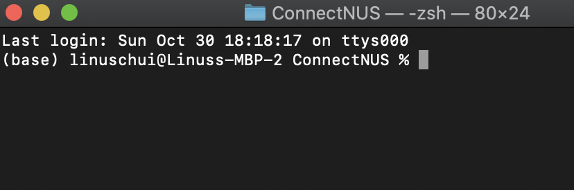
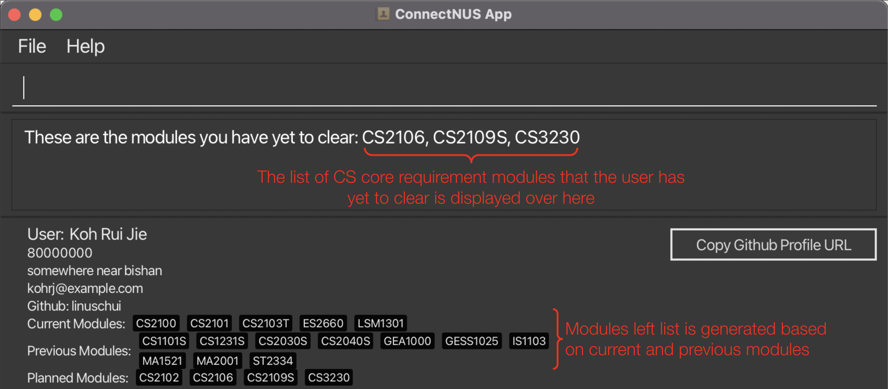
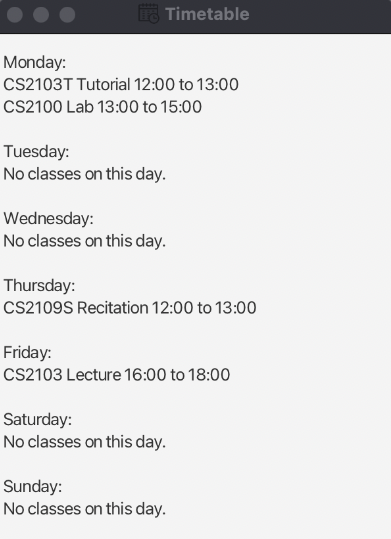

## Table of Contents
- [ConnectNUS User Guide](#connectnus-user-guide)
- [Navigating the User Guide](#navigating-the-user-guide)
- [Quick Start](#quick-start)
- [Glossary](#glossary)
- [Features](#features)
  - [Notes about the command format](#notes-about-the-command-format)
  - [Viewing help](#viewing-help)
  - [User profile features](#user-features)
    - [Adding user](#adding-user)
    - [Editing user](#editing-user)
    - [Deleting user](#deleting-user)
  - [Contact list features](#contact-list-features)
    - [Adding contacts](#adding-contacts)
    - [Listing contacts](#listing-contacts)
    - [Finding contacts](#finding-contacts)
    - [Editing contacts](#editing-contacts)
    - [Deleting contacts](#deleting-contacts)
    - [Clearing all contacts](#clearing-all-contacts)
  - [Module features](#module-features)
    - [Editing user's modules](#edit-users-modules)
    - [Editing contact's modules](#edit-contacts-modules)
    - [Checking modules left](#checking-modules-left)
    - [Refreshing to Next Semester](#refreshing-to-next-semester)
  - [Timetable features](#timetable-features)
    - [Adding lessons](#adding-lessons)
    - [Listing lessons / Viewing timetable](#listing-lessons--viewing-timetable)
    - [Deleting lessons](#deleting-lessons)
  - [Filtering features](#filtering-features)
    - [Filtering Tags](#filtering-tags)
    - [Filtering Current Modules](#filtering-current-modules)
    - [Filtering Planned Modules](#filtering-planned-modules)
    - [Filtering Previous Modules](#filtering-previous-modules)
  - [Data features](#data-features)
    - [Saving the data](#saving-the-data)
    - [Editing the data file](#editing-the-data-file)
  - [Other features](#other-features)
    - [Undo / Redo](#undo--redo)
    - [Copying GitHub URL](#copying-github-url)
    - [Exiting the program](#exiting-the-program)
- [Command Summary](#command-summary)

---

# ConnectNUS User Guide

ConnectNUS is **designed for NUS Computer Science students** by providing a centralised platform for them to keep track
of their and their friends' modules and timetables. With features such as adding previous, current and
future modules, as well as timetables, ConnectNUS provides you with the convenience of viewing your friends' schedules
and eliminates the hassle of having to search through multiple group and private chats to know when your friends will
be free to meet up to do group projects. You can also use the module filters to help you find friends who have previously
taken, currently taking or interested in taking the specified module.

ConnectNUS is **optimised for use via a Command Line Interface** (CLI) while still having the benefits of a
**Graphical User Interface** (GUI). For Computer Science students who are generally fast typers, ConnectNUS is an
excellent platform for you to get your CS related tasks management done quickly, so you can spend less time searching 
through chats, and spend more time making meaningful connections and engaging in productive work.

The goal of this User Guide is to empower you, as NUS Computer Science students, with the knowledge to **maximise the full 
potential** of ConnectNUS and capitalise on the features ConnectNUS offers for you to make your CS experience
**better than better**.

Before you start using ConnectNUS, you are recommended to read the [Navigating the User Guide](#navigating-the-user-guide),
[Glossary](#glossary), [Quick Start](#quick-start) as well as [Notes about the command format](#notes-about-the-command-format) 
sections, which will provide the necessary information to allow you to familiarise yourself with the structure of this 
User Guide and help you navigate it with ease.

If this is your first time using the ConnectNUS application, you are advised to read through the **entire** User Guide **in the sequence
provided**. 

Whenever you are in doubt, forget the command formats for any feature, need help troubleshooting
or you simply want to maximise your use of this application, do remember to revisit this User Guide.

## Navigating the User Guide

For each of the [Features](#features) in this User Guide, you will be provided with
1. An overview of the feature to introduce its purpose and function.
2. The command format to use the particular feature.
3. Sample commands for you to try out the feature.
4. Explanations on valid command parameters.
5. Some include screenshots of the expected behaviour of the sample command to help you understand how the command works.

The Features in the User Guide are grouped according to their functions :
- [User profile features](#user-features) 
- [Contact list features](#contact-list-features)
- [Module features](#module-features)
- [Timetable features](#timetable-features)
- [Filtering features](#filtering-features)
- [Other features](#other-features)

You can jump to the specific section of the user guide which you require using the Table of Contents on the first page
of the User Guide. This enables you to learn about all the related information you need to know regarding the respective
features. You may click on [Scroll back to top](#table-of-contents), which can be found at the end of every section, to 
gain quick access to the Table of Contents, enabling you to redirect yourself to another section if necessary without 
having to manually scroll through the User Guide.

If this is your first time using a Command Line Interface, you are recommended to go through the entire user guide according
to the sequence laid out in the user guide, as well as trying out the sample commands provided in each feature to gain 
a better understanding of how a Command Line Interface works.

Once you are proficient with the various command types, you may refer to the section [Command Summary](#command-summary), 
which will provide you with a quick glance summary of all the command formats of all features provided by ConnectNUS.

As recommended in the introduction, we would like to direct you to read the [Glossary](#glossary) section next.

[Scroll back to top](#table-of-contents)

## Glossary

The glossary illustrated in the table below will help you understand the terminologies used in this 
User Guide.

<table>
  <tr>
    <th><strong>Terminology</strong></th>
    <th><strong>Meaning / Purpose</strong></th>
  </tr>
  <tr>
    <td><strong>Command Line Interface (CLI)</strong></td>
    <td>
      A text-based interface that is used to operate software (such as ConnectNUS) and operating systems. CLI
      allows a user to perform tasks by entering commands.  
      Users enter the specific command, press “Enter”, and then wait for a response. 
      After receiving the command, the CLI processes it accordingly and shows the output/result on the screen.
    </td>
  </tr>
  <tr>
    <td><strong>Graphical User Interface (GUI)</strong></td>
    <td>
      A system of interactive visual components for computer software. A GUI displays objects that convey information, 
      and represent actions that can be taken by the user. The objects change color, size, or visibility when the user 
      interacts with them.
    </td>
  </tr>
  <tr>
    <td><strong>Index</strong></td>
    <td>
      An identifier which is the number corresponding to order of which your contacts are listed out, and used in 
      conjunction with the commands to specify the contact with the given index. Each contact is identified with a 
      unique index.
    </td>
  </tr>
  <tr>
    <td><strong>💡Tip</strong></td>
    <td>
      To provide you with suggestions on how to use the commands as well as address potential confusions when using
      these commands, so you will be able to better understand how the commands work.
    </td>
  </tr>
  <tr>
    <td><strong>❗Caution</strong></td>
    <td>
      To inform you of some unintended consequences that may occur when you use the commands, so you will be  
      able to use them appropriately.
    </td>
  </tr>
</table>

As recommended in the introduction, we would like to direct you to read the [Quick Start](#quick-start) section next.

[Scroll back to top](#table-of-contents)

## Quick Start

Step 1: Ensure you have Java 11 or above installed on your computer. You can refer to
[this](https://www3.ntu.edu.sg/home/ehchua/programming/howto/jdk_howto.html#zz-2) guide to help you install and configure
an appropriate version of Java. You can open a command window and run the `java -version` command to ensure you are using
Java 11 (or above).

  

Step 2: Download the latest ConnectNUS.jar from [here](https://github.com/AY2223S1-CS2103T-T14-4/tp/releases/tag/v1.3).

  

Step 3: Copy the file to a new empty folder you want to use as the home folder for ConnectNUS. A JSON file will be created in
the folder to store your data upon saving the jar file.

  

Step 4: In terminal (Mac) or command prompt (Windows), navigate to the folder's path. For Mac users, you can do it by right-clicking on the folder
and click on `New Terminal at Folder` as illustrated below.

    
  

Step 5: Launch the jar file using the `java -jar ConnectNUS.jar` command in the terminal. Do not double-click
on the jar file in the folder. This to ensure the jar file is using the correct Java version verified in Step 1.

  

Step 6: The GUI similar to the below should appear in a few seconds. Do note that the app contains some sample data.

  

Step 7: Refer to the [Features](#features) section below to for more details on how to use ConnectNUS.

As recommended in the introduction, we would like to direct you to read the [Notes about the command format](#notes-about-the-command-format) section next.

[Scroll back to top](#table-of-contents)

## Features

These are features implemented within ConnectNUS.

These features are split into the following purposes:
- [Help](#viewing-help)
- [User profile features](#user-features)
- [Contact list features](#contact-list-features)
- [Module features](#module-features)
- [Timetable features](#timetable-features)
- [Filtering features](#filtering-features)
- [Data features](#data-features)
- [Other features](#other-features)

You may refer to each individual section for more information on the purpose and function of these features.

Each feature can be run using a command, and the commands follow the following format:

## Notes about the command format

* Words in `UPPER_CASE` are the parameters to be **supplied by you**. \
  e.g. in `add n/NAME`, `NAME` is a parameter which can be used as `add n/John Doe`.
* Items in square brackets are **optional**. \
  e.g. `n/NAME [t/TAG]` can be used as `n/John Doe t/friend` or as `n/John Doe`.
* Items with `…`​ after them can be used **multiple times including zero times**. \
  e.g. `[t/TAG]…​` can be used as ` ` (i.e. 0 times), `t/friend`, `t/friend t/family` etc.
* Parameters can be **in any order**. \
  e.g. if the command specifies `n/NAME p/PHONE_NUMBER`, `p/PHONE_NUMBER n/NAME` is also acceptable.
* If a parameter is expected only once in the command, but you specified it multiple times, **only the last occurrence of the parameter will be taken**. \
  e.g. if you specify `p/12341234 p/56785678`, only `p/56785678` will be taken.
* Extraneous parameters for commands that do not take in parameters (such as `help`, `list`, `exit` and `clear`) will be ignored. \
  e.g. if the command specifies `help 123`, it will be interpreted as `help`.

[Scroll back to top](#table-of-contents)

## Viewing help

Shows a message explaining how to access the help page. 
You can click on the button to copy the URL and paste it in a web browser to be directed back to this
User Guide should you require assistance in the future.

Format: `help`

:bulb: **Tip:** Ensure that you have a stable Internet connection to access the User Guide online.

[Scroll back to top](#table-of-contents)

## User features

These are features that allow you to manage your profile in ConnectNUS, to keep track of your own details.

You may:
- [Add user](#adding-user)
- [Edit user](#editing-user)
- [Delete user](#deleting-user)

### Adding user

Add your own user profile into the contact list.

Format: `user n/NAME p/PHONE_NUMBER e/EMAIL a/ADDRESS [g/GITHUB_USERNAME] [curr/CURRENT_MODULE]… [prev/PREVIOUS_MODULE]… [plan/PLANNED_MODULE]…`

* Adds your own user profile with specified details into your contact list.
* There can only be one user, adding another user profile while there is one already stored will result in an error message.
* Current user profile has to be deleted before a new one is added.
* You are able to specify the modules you are taking currently, have taken in the past, and are planning to take in the future.
* Each of these module codes should be registered modules in NUS.

Examples:

* `user n/Silas p/98765432 e/silastay@gmail.com a/Kent Ridge Drive g/SilasTSL curr/CS2100 prev/CS1101S plan/CS2109`adds your own user profile to your contact list with all the details specified.

[Scroll back to top](#table-of-contents)

### Editing user

Edit the current user profile.

Format: `edit user [n/NAME] [p/PHONE_NUMBER] [e/EMAIL] [a/ADDRESS] [g/GITHUB_USERNAME]`

* Edits the user profile with specified details.
* You need to edit at least one field
* You may edit multiple fields at once

:bulb: **Tip:** You cannot edit modules with this command, you must do so with the module commands.

Examples:

* `edit user p/92323232 a/Kent Ridge Crescent`edits your own user profile with all the details specified.

[Scroll back to top](#table-of-contents)

### Deleting user

Deletes the current user profile from the contacts list.

Format: `delete user`

* Deletes the current user profile stored in the contact list.

[Scroll back to top](#table-of-contents)

## Contact list features

These are features that allow you to manage the list of persons in ConnectNUS, so you can keep track of the details you need.

You may:
- [Add contacts](#adding-contacts)
- [List contacts](#listing-contacts)
- [Find contacts](#finding-contacts)
- [Edit contacts](#editing-contacts)
- [Delete contacts](#deleting-contacts)
- [Clear all contacts](#clearing-all-contacts)

### Adding contacts

Add a contact to your contact list.

Format: `add n/NAME p/PHONE_NUMBER e/EMAIL a/ADDRESS [g/GITHUB_USERNAME] [t/TAG]… [curr/CURRENT_MODULE]… [prev/PREVIOUS_MODULE]… [plan/PLANNED_MODULE]…`

* Adds contact with specified details into your contact list.
* You can add as many tags to a contact as you want, you may also choose to not add any tags.
* You are able to specify the modules the contact is taking currently, taken in the past, and is planning to take in the future.
* Each of these module codes should be registered modules in NUS.

Examples:

* `add n/Ruijie p/91234567 e/kohrj@gmail.com a/Kent Ridge Avenue g/rjkoh t/Classmate curr/CS2100 prev/CS1101S plan/CS2109`adds module contact Ruijie to your contact list with all the details specified.

[Scroll back to top](#table-of-contents)

### Listing contacts

Shows a list of all persons in your contact list, so you can view all your contacts.

Format: `list`

* The list of contacts is numbered based on the order that the contacts are added

[Scroll back to top](#table-of-contents)

### Finding contacts

Finds persons whose names contain any of the given keywords, for easy viewing of those you are looking for.

Format: `find KEYWORD [MORE_KEYWORDS]…`

* The search is case-insensitive. e.g. `hans` will match `Hans`
* The order of the keywords does not matter. e.g. `Hans Bo` will match `Bo Hans`
* Only the name is searched.
* Only full words will be matched e.g. `Han` will not match `Hans`
* Persons matching at least one keyword will be returned (i.e. OR search). e.g. `Hans Bo` will return `Hans Gruber`, `Bo Yang`

Examples:

* `find John` returns john and John Doe
* `find alex david` returns `Alex Yeoh`, `David Li`

[Scroll back to top](#table-of-contents)

### Editing contacts

Edit a specified contact from your contact list.

Format: `edit INDEX [n/NAME] [p/PHONE_NUMBER] [e/EMAIL] [a/ADDRESS] [g/GITHUB_USERNAME] [t/TAG]…`

* Edits the contact at the specified `INDEX` with specified details.
* The index refers to the index number shown in the displayed contact list.
* The index **must be a positive integer** 1, 2, 3, …​
* You need to edit at least one field
* You may edit multiple fields at once
* You can add as many tags to a contact as you want, you may also choose to not add any tags

:bulb: **Tip:** You cannot edit modules with this command, you must do so with the module commands.

Examples:

* `edit 2 n/Laura Lee e/laura@nus.sg t/Hall`edits the second contact in the list of all contacts with all the details specified.

[Scroll back to top](#table-of-contents)

### Deleting contacts

Deletes a specified contact from your contact list.

Format: `delete INDEX`

* Deletes the contact at the specified `INDEX`.
* The index refers to the index number shown in the displayed contact list.
* The index **must be a positive integer** 1, 2, 3, …​

Examples:

* `list `followed by  `delete 1` deletes the first contact in the list of all contacts the user has added.

[Scroll back to top](#table-of-contents)

### Clearing all contacts

Deletes all contacts from your contact list with one command, so you can an empty contact list to start with.

Format: `clear`

* Every contact in the address book including their information is cleared.
* User profile does not get deleted.

[Scroll back to top](#table-of-contents)

## Module features

These are features that allow you to manage the current, previous and planned modules that you or your contacts have.
These features allow you to easily manage your academic progress and find people to collaborate with for modules.

You may:
- [Edit user's modules](#edit-users-modules)
- [Edit contact's modules](#edit-contacts-modules)
- [Check modules left](#checking-modules-left)
- [Refresh to next semester](#refreshing-to-next-semester)

### Edit user's modules

Directly edit your own module list by adding or deleting modules from the list, so you can keep track of your module plan.

Format: `module user [curr/CURRENT_MODULE]… [prev/PREVIOUS_MODULE]… [plan/PLANNED_MODULE]… [rm/MODULE_TO_REMOVE]…`

* You need to edit at least one list
* You may edit multiple lists at once
* Add a module with module code [module code] to the list of mods.
* You are able to specify the modules you are taking currently, taken in the past, and is planning to take in the future.
* The module code refers to the module code of the module the user is planning to take (E.g. CS2103T)
* The module code should be a registered module in NUS.
* Using `rm/MODULE_TO_REMOVE` feature will remove the module from all 3 module lists.

Examples:

* `module user curr/CS2100 prev/CS1231S plan/CS2106 rm/ST2334` adds the first 3 modules into your respective lists and removes ST2334 from all module lists

[Scroll back to top](#table-of-contents)

### Edit contact's modules

Directly edit your contact's module list by adding or deleting modules from their list, so you can keep track of
your friend's module plans and easily find contacts to collaborate with.

Format: `module INDEX [curr/CURRENT_MODULE]… [prev/PREVIOUS_MODULE]… [plan/PLANNED_MODULE]… [rm/MODULE_TO_REMOVE]…`

* Edits the module list of the contact at the specified `INDEX`.
* The index refers to the index number shown in the displayed contact list.
* The index **must be a positive integer** 1, 2, 3, …​
* You need to edit at least one list
* You may edit multiple lists at once
* Add a module with module code [module code] to the list of mods.
* You are able to specify the modules you are taking currently, taken in the past, and is planning to take in the future.
* The module code refers to the module code of the module the user is planning to take (E.g. CS2103T)
* The module code should be a registered module in NUS.
* Using `rm/MODULE_TO_REMOVE` feature will remove the module from all 3 module lists.

Examples:

* `module 1 curr/CS2101 prev/CS2030S plan/CS2102 rm/GEA1000` adds the first 3 modules into the first contact's respective lists and removes GEA1000 from all module lists

[Scroll back to top](#table-of-contents)

### Checking Modules Left

Check which modules you need to clear in order to fulfill core requirements or focus area requirements, to quickly see
the remaining modules you have yet to clear.

Format: `modsleft INDEX`

* Compares your Current Modules and Previous Modules list with the list of modules required to clear requirements and outputs the remaining modules needed to clear it.
* The index refers to the index number shown in the displayed focus area list.
* The index **must be a positive integer between 1 and 11**
* This feature is currently compatible with CS students who enrolled in AY21/22, additional compatability with students from other AYs and other majors will be added in future versions.

The index reference list is as shown:

1. CS Core Requirements
2. Algorithms & Theory
3. Artificial Intelligence
4. Computer Graphics and Games
5. Computer Security
6. Database Systems
7. Multimedia Information Retrieval
8. Networking and Distributed Systems
9. Parallel Computing
10. Programming Languages
11. Software Engineering

Examples:

* `modsleft 1` outputs the list of remaining CS Core Requirement modules that you have yet to clear.

[Scroll back to top](#table-of-contents)

### Refreshing to Next Semester

Moves all the current modules in the current module lists of both the user and all persons in the user's contact list into 
their previous modules list when a next semester command is given. This enables user's to update their ConnectNUS app 
at the start of the new semester by clearing all modules from the current module lists of the user and their contacts, 
such that they are able to add new current modules that they and their contacts will be taking in the upcoming semester to their app.

Format: `nextsem`

Example:

* `nextsem` moves all current modules into the previous modules list of the user and all contacts and removes all modules in the current modules list.

[Scroll back to top](#table-of-contents)

## Timetable features

These features allow you to manage and view both yours and your contacts' lessons for the week, to easily plan and deconflict your schedules.

You may:
- [Add lessons](#adding-lessons)
- [View timetable](#listing-lessons--viewing-timetable)
- [Delete lessons](#deleting-lessons)

### Adding lessons

Add lessons to the user profile or contacts.

Format for user: `lesson user l/TYPE m/MODULE_CODE day/DAY_NUMBER start/START_TIME end/END_TIME`

Format for contact: `lesson INDEX l/TYPE m/MODULE_CODE day/DAY_NUMBER start/START_TIME end/END_TIME`

* Adds the lesson to the user or specified `INDEX`.
  * The index refers to the index number shown in the displayed contact list.
  * The index **must be a positive integer** 1, 2, 3, …​
* `TYPE` is the type of lesson
  * `tut` for Tutorial, `lec` for Lecture, `rec` for Recitation and `lab` for Lab.
* Day is a **positive integer between 1 and 7**, where 1 is for Monday and 7 is for Sunday.
* Start and End time in HH:mm format.
* Start time must be before End time, and overlapping lessons are not allowed.

Examples:

`lesson user l/tut m/CS2103T d/1 start/12:00 end/13:00`

`lesson 2 l/lec m/CS2101 d/5 start/09:00 end/11:00`

[Scroll back to top](#table-of-contents)

### Listing lessons / Viewing timetable

Shows the list of lessons in a separate window, sorted by day and time.

- To view your own timetable, use the format for user.
- To view your contacts' timetable, use the format for contact.

Format for user: `timetable user`

Format for contact: `timetable INDEX`

A window similar to this will be shown:

* Shows the timetable of the user or specified `INDEX`.
  * The index refers to the index number shown in the displayed contact list.
  * The index **must be a positive integer** 1, 2, 3, …​
* Must have at least one lesson added for the week.
* Lessons will be sorted by start timing.

:bulb: **Tip:** If you have added a new lesson while the timetable window is open, you can run the timetable
command again to view the updated timetable!

Examples:

`timetable user`

`timetable 1`

[Scroll back to top](#table-of-contents)

### Deleting lessons

Deletes a lesson from the user or a contact.

Format for user: `remove user l/TYPE m/MODULE_CODE day/DAY_NUMBER start/START_TIME end/END_TIME`

Format for contact: `remove INDEX l/TYPE m/MODULE_CODE day/DAY_NUMBER start/START_TIME end/END_TIME`

* Deletes the lesson from the user or specified `INDEX`.
  * The index refers to the index number shown in the displayed contact list.
  * The index **must be a positive integer** 1, 2, 3, …​
* `TYPE` is the type of lesson
  * `tut` for Tutorial, `lec` for Lecture, `rec` for Recitation and `lab` for Lab.
* Day is a **positive integer between 1 and 7**, where 1 is for Monday and 7 is for Sunday.
* Start and End time in HH:mm format.
* All fields must match lesson previously added.

Examples:

`remove user l/lec m/CS2109S d/5 start/10:00 end/12:00`

`remove 1 l/rec m/CS2100 d/2 start/16:00 end/18:00`

`remove user l/lab m/CS2040S d/3 start/12:00 end/14:00`

`remove 8 l/tut m/CS2103T d/4 start/14:00 end/15:00`

[Scroll back to top](#table-of-contents)

## Filtering features

These features allow you to only see the list of people adhering to the criteria set, so that you can view only those persons
relevant.

You may filter by:
- [Tag](#filtering-tags)
- [Current Module](#filtering-current-modules)
- [Previous Module](#filtering-previous-modules)
- [Planned Module](#filtering-planned-modules)

### Filtering Tags

Filters the tags of contacts to return a list of persons with any of the tags specified by you, so you can only view
persons that are of a certain group specified by the tag.

Format: `filtertag TAG_NAME [TAG_NAME]…`

* Filters the contact list for person's with any of the specified `TAG_NAME`.
* You may input more than 1 tag.

Examples:

* `filtertag friends` lists all contacts with a friends tag.

`filtertag friends family` lists all contacts with either a friends or family tag.

[Scroll back to top](#table-of-contents)

### Filtering Current Modules

Filters the current modules lists of all contacts to return a list of persons with any of the current modules specified by you,
so you can easily find groupmates or people to collaborate with.

Format: `filtercurrmod CURRENT_MODULE [CURRENT_MODULE]…`

* Filters the contact list for person's with any of the specified `CURRENT_MODULE`.
* You may input more than 1 module.

Examples:

`filtercurrmod CS1000` lists all contacts with module code CS1000 in their current modules list.

[Scroll back to top](#table-of-contents)

### Filtering Previous Modules

Filters the previous modules lists of contacts to return a list of persons with any of the previous modules specified,
so you can easily find and consult people who have finish the module.

Format: `filterprevmod PREVIOUS_MODULE [PREVIOUS_MODULE]…`

* Filters the contact list for persons with any of the specified `PREVIOUS_MODULE`.
* You may input more than 1 module.

Examples:

`filterprevmod CS2000` lists all contacts with module code CS2000 in their previous modules list.

[Scroll back to top](#table-of-contents)

### Filtering Planned Modules

Filters the planned modules lists of contacts to return a list of persons with any of the planned modules specified, so you can
arrange to take lessons together during module bidding.

Format: `filterplanmod PLANNED_MODULE [PLANNED_MODULE]…`

* Filters the contact list for persons with any of the specified `PLANNED_MODULE`.
* You may input more than 1 module.

Examples:

`filterplanmod CS23333` lists all contacts with module code CS3333 in their planned modules list.

[Scroll back to top](#table-of-contents)

## Data features

These features allow you to directly manipulate the data stored by ConnectNUS, so you can quickly view and edit yours or a person's
data on the file, which will be reflected in ConnectNUS GUI.

You may:
- [Save data](#saving-the-data)
- [Edit data](#editing-the-data-file)

### Saving the data

ConnectNUS data is saved in the hard disk automatically after any command that changes the data. There is no need to save manually.

[Scroll back to top](#table-of-contents)

### Editing the data file

ConnectNUS data is saved as a JSON file `[JAR file location]/data/ConnectNUS.json`. Advanced users are welcome to update data directly by editing that data file,
so you can quickly manipulate the data based on areas you wish to edit.

❗**Caution:** If your changes to the data file makes its format invalid, ConnectNUS will discard all data and start with an empty data file at the next run.

[Scroll back to top](#table-of-contents)

## Other features

These are additional features implemented to improve the functionality of the application.

You may:
- [Undo / Redo](#undo--redo)
- [Copy GitHub URL](#copying-github-url)
- [Exit](#exiting-the-program)

### Undo / Redo

Undo / Redo your latest action, in case an error has been made.

Format: `undo` `redo`

Examples:

* `add n/Ruijie p/91234567 e/kohrj@gmail.com a/Kent Ridge Avenue g/rjkoh t/Classmate curr/CS2100 prev/CS1101S plan/CS2109`adds module contact Ruijie to your contact list with all the details specified.

* `undo` undoes the latest action of adding "Ruijie" as a contact.

* `redo` redoes the latest undo action of undoing "Ruijie" as a contact.

[Scroll back to top](#table-of-contents)

### Copying GitHub URL

The copy GitHub Profile URL button copies the user or contact's GitHub profile URL into your clipboard which you can then paste into your browser, so you can view their profile.

[Scroll back to top](#table-of-contents)

### Exiting the program

Exits the program.

Format: `exit`

[Scroll back to top](#table-of-contents)

## Command summary

<table>
  <tr>
    <th><strong>Action</strong></th>
    <th><strong>Format, Examples</strong></th>
  </tr>

  <tr>
    <td><strong>Adding User</strong></td>
    <td>
      <code>user n/NAME p/PHONE_NUMBER e/EMAIL a/ADDRESS [g/GITHUB_USERNAME] [curr/CURRENT_MODULE]… [prev/PREVIOUS_MODULE]… [plan/PLANNED_MODULE]…</code>
       
       
      <code>Eg. user n/Silas p/98765432 e/silastay@gmail.com a/Kent Ridge Drive g/SilasTSL curr/CS2100 prev/CS1101S plan/CS2109</code>
    </td>
  </tr>

  <tr>
    <td><strong>Editing User</strong>
    </td>
    <td>
      <code>edit user [n/NAME] [p/PHONE_NUMBER] [e/EMAIL] [a/ADDRESS] [g/GITHUB_USERNAME]</code>
       
       
      <code>Eg. edit user p/92323232 a/Kent Ridge Crescent</code>
    </td>
  </tr>

  <tr>
    <td><strong>Delete User</strong>
    </td>
    <td>
      <code>delete user</code>
    </td>
  </tr>

  <tr>
    <td><strong>Adding Contact</strong>
    </td>
    <td>
      <code>add n/NAME p/PHONE_NUMBER e/EMAIL a/ADDRESS [g/GITHUB_USERNAME] [t/TAG]… [curr/CURRENT_MODULE]… [prev/PREVIOUS_MODULE]… [plan/PLANNED_MODULE]…</code>
       
       
      <code>Eg. add n/Ruijie p/91234567 e/kohrj@gmail.com a/Kent Ridge Avenue g/rjkoh t/Classmate curr/CS2100 prev/CS1101S plan/CS2109</code>
    </td>
  </tr>

  <tr>
    <td><strong>Listing contacts</strong>
    </td>
    <td><code>list</code></td>
  </tr>

  <tr>
    <td><strong>Finding contacts</strong>
    </td>
    <td>
      <code>find KEYWORD [MORE_KEYWORDS]…</code>
       
       
      <code>Eg. find John</code>
       
      <code>Eg. find John alex</code>
    </td>
  </tr>

  <tr>
    <td><strong>Editing Contact</strong>
    </td>
    <td>
      <code>edit INDEX [n/NAME] [p/PHONE_NUMBER] [e/EMAIL] [a/ADDRESS] [g/GITHUB_USERNAME] [t/TAG]…</code>
       
       
      <code>Eg. edit 2 n/Laura Lee e/laura@nus.sg t/Hall</code>
    </td>
  </tr>

  <tr>
    <td><strong>Delete Contact</strong>
    </td>
    <td>
      <code>delete INDEX</code>
       
       
      <code>Eg. delete 2</code>
    </td>
  </tr>

  <tr>
    <td><strong>Clear all contacts</strong>
    </td>
    <td><code>clear</code></td>
  </tr>

  <tr>
    <td><strong>Editing User's Modules</strong>
    </td>
    <td>
      <code>module user [curr/CURRENT_MODULE]… [prev/PREVIOUS_MODULE]… [plan/PLANNED_MODULE]… [rm/MODULE_TO_REMOVE]…</code>
       
       
      <code>Eg. module user curr/CS2100 prev/CS1231S plan/CS2106 rm/ST2334</code>
    </td>
  </tr>

  <tr>
    <td><strong>Editing Contact's Modules</strong>
    </td>
    <td>
      <code>module INDEX [curr/CURRENT_MODULE]… [prev/PREVIOUS_MODULE]… [plan/PLANNED_MODULE]… [rm/MODULE_TO_REMOVE]…</code>
       
       
      <code>Eg. module 1 curr/CS2101 prev/CS2030S plan/CS2102 rm/GEA1000</code>
    </td>
  </tr>

  <tr>
    <td><strong>Checking Modules Left</strong>
    </td>
    <td>
      <code>modsleft INDEX</code>
       
       
      <code>Eg. modsleft 3</code>
    </td>
  </tr>

  <tr>
    <td><strong>Next Semester</strong>
    </td>
    <td>
    <code>nextsem</code>
    </td>
  </tr>

  <tr>
    <td><strong>Adding Lesson</strong>
    </td>
    <td>
      <code>lesson user l/TYPE m/MODULE_CODE day/DAY_NUMBER start/START_TIME end/END_TIME</code>
       
       
      <code>Eg. lesson user l/tut m/CS2103T d/1 start/12:00 end/13:00</code>
       
       
      <code>lesson INDEX l/TYPE m/MODULE_CODE day/DAY_NUMBER start/START_TIME end/END_TIME</code>
       
       
      <code>Eg. lesson 1 l/tut m/CS2103T d/1 start/12:00 end/13:00</code>
    </td>
  </tr>

  <tr>
    <td><strong>Viewing Lessons / Timetable</strong>
    </td>
    <td>
      <code>timetable user</code>
       
       
      <code>timetable INDEX</code>
       
       
      <code>Eg. timetable 2</code>
    </td>
  </tr>

  <tr>
    <td><strong>Deleting lesson</strong>
    </td>
    <td>
      <code>remove user l/TYPE m/MODULE_CODE day/DAY_NUMBER start/START_TIME end/END_TIME</code>
       
       
      <code>Eg. remove user l/tut m/CS2103T d/1 start/12:00 end/13:00</code>
       
       
      <code>remove INDEX l/TYPE m/MODULE_CODE day/DAY_NUMBER start/START_TIME end/END_TIME</code>
       
       
      <code>Eg. remove 1 l/tut m/CS2103T d/1 start/12:00 end/13:00</code>
    </td>
  </tr>

  <tr>
    <td><strong>Filter Tags</strong>
    </td>
    <td>
      <code>filtertag TAG_NAME [TAG_NAME]…</code>
       
       
      <code>Eg. filtertag friends family</code>
    </td>
  </tr>

  <tr>
    <td><strong>Filter Current Modules</strong>
    </td>
    <td>
      <code>filtercurrmod CURRENT_MODULE [CURRENT_MODULE]…</code>
       
       
      <code>Eg. filtercurrmod CS2103T</code>
       
       
      <code>Eg. filtercurrmod CS2103T CS2100</code>
    </td>
  </tr>

  <tr>
    <td><strong>Filter Previous Modules</strong>
    </td>
    <td>
      <code>filterprevmod PREVIOUS_MODULE [PREVIOUS_MODULE]…</code>
       
       
      <code>Eg. filterprevmod CS2103T</code>
       
       
      <code>Eg. filterprevmod CS2103T CS2100</code>
    </td>
  </tr>

  <tr>
    <td><strong>Filter Planned Modules</strong>
    </td>
    <td>
      <code>filterplanmod PLANNED_MODULE [PLANNED_MODULE]…</code>
       
       
      <code>Eg. filterplanmod CS2109S</code>
       
       
      <code>Eg. filterplanmod CS2109S CS3230</code>
    </td>
  </tr>

  <tr>
    <td><strong>Undo / Redo</strong>
    </td>
    <td>
      <code>undo</code>
      <code>redo</code>
    </td>
  </tr>

  <tr>
    <td><strong>Viewing help</strong>
    </td>
    <td>
      <code>help</code>
    </td>
  </tr>

  <tr>
    <td><strong>Exiting the program</strong>
    </td>
    <td>
      <code>exit</code>
    </td>
  </tr>

</table>

[Scroll back to top](#table-of-contents)
