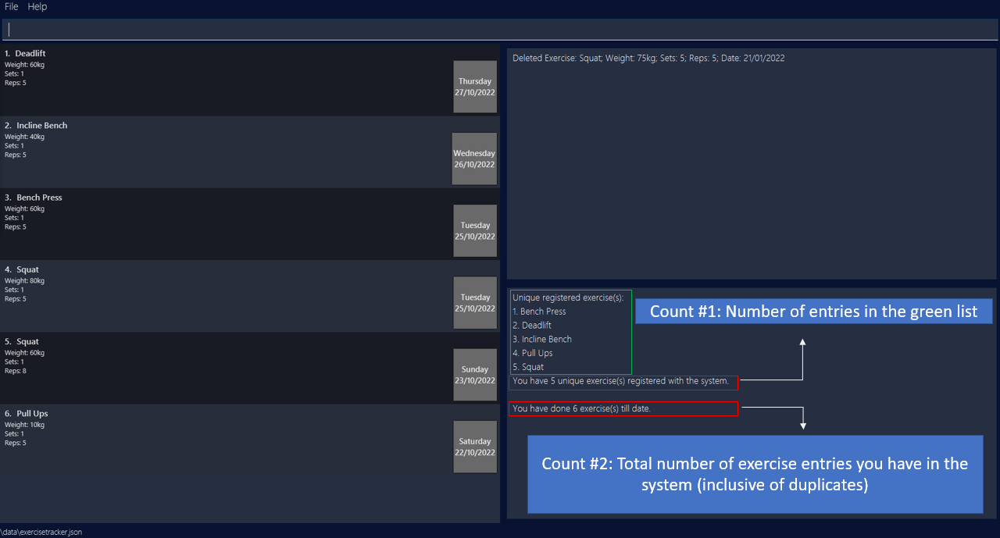
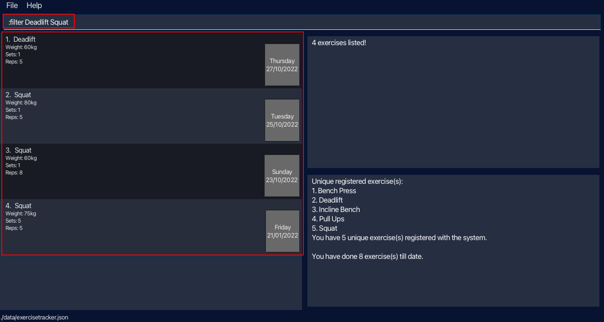
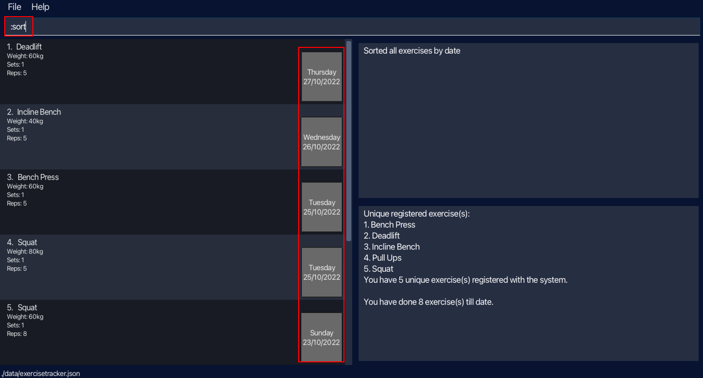
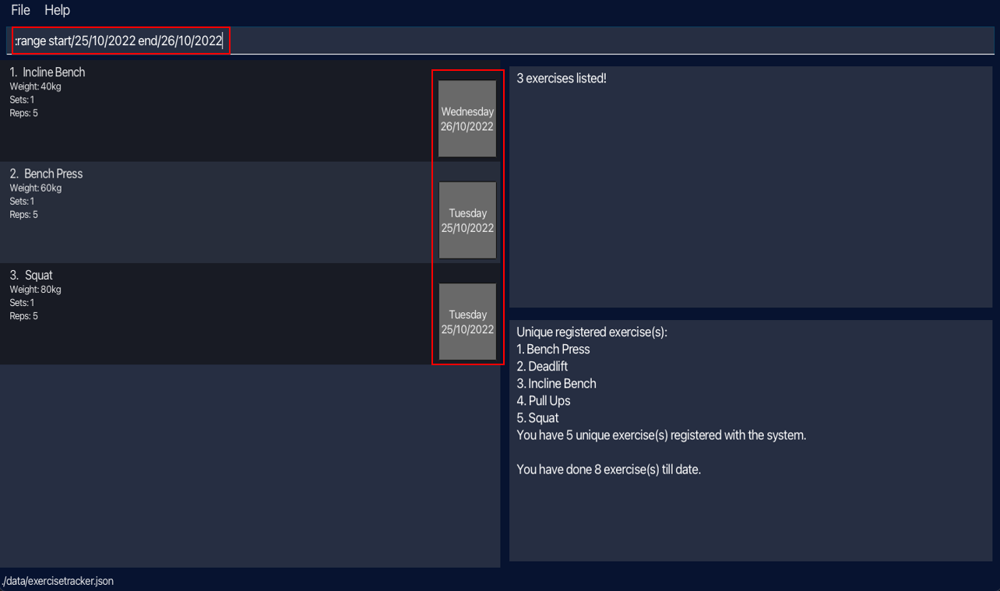
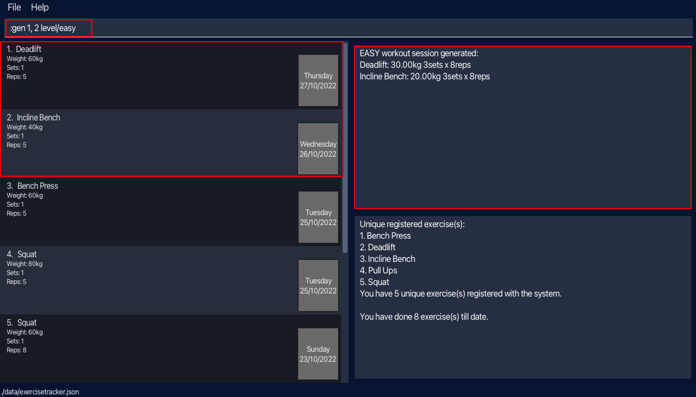
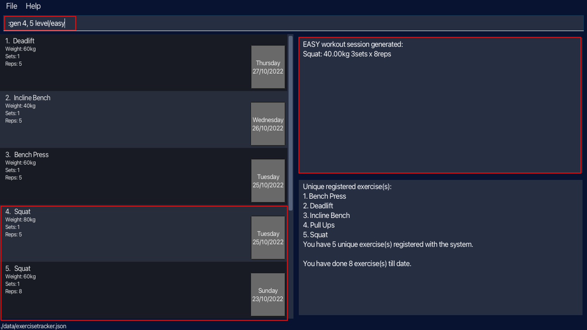
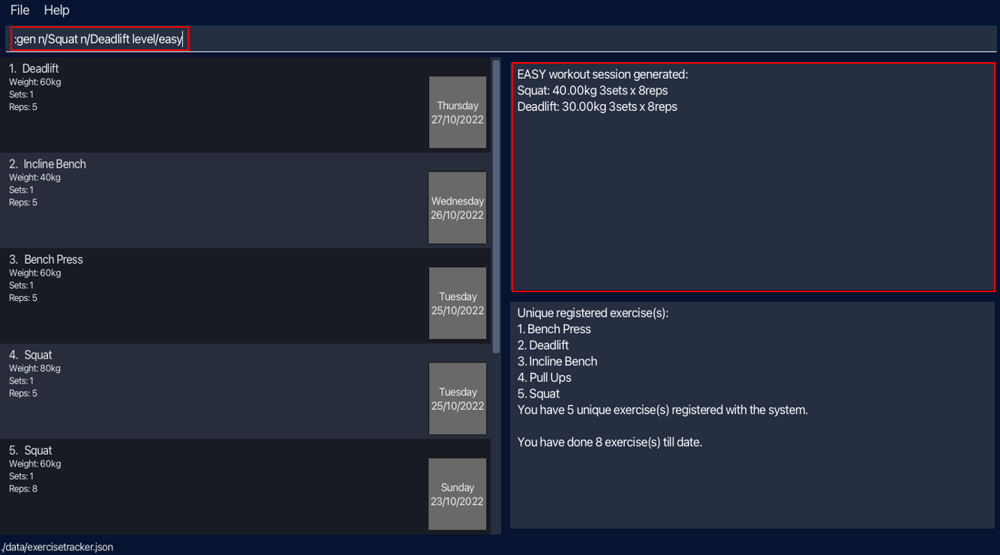
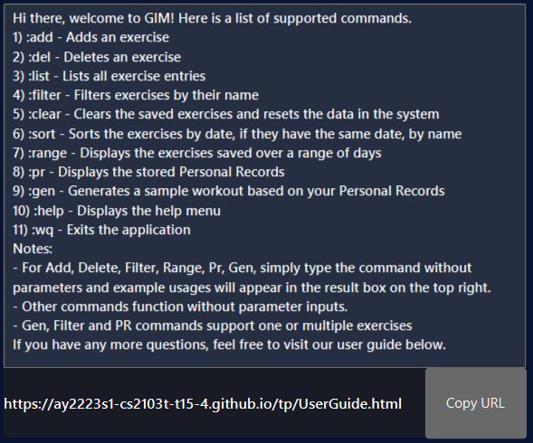

Gim is a **desktop app for managing and tracking gym exercises, optimized for use via a Command Line Interface (CLI)** while still having the benefits of a Graphical User Interface (GUI). Gim commands are inspired by those of Vim. If you are an avid Vim user and can type fast, Gim can help you keep track of your workouts and personal records for each exercise. Gim can also help you to craft a workout based on your personal records.

### Table of Contents
#### [Getting Started](#quick-start)
#### [Orientating the GUI](#gui-orientation)
* Command Box
* Exercise List 
* Result Display 
* Recognised Exercise Names List

#### [Features](#commands)
* Adding an exercise **:add**
* Deleting an exercise **:del**
* Listing all exercises **:list**
* Filtering exercises by their name(s) **:filter**
* Clearing the saved exercises and resets the data in the system **:clear**
* Sorting exercises **:sort**
* Viewing all exercises within a time period **:range**
* Displaying the stored Personal Records **:pr**
* Generating a sample workout based on Personal Records **:gen**
* Displaying the help menu **:help**
* Exiting the application **:wq**

#### [Command Summary](#summary-of-commands)
#### [Glossary](#glossary-of-terminologies)

--------------------------------------------------------------------------------------------------------------------

## Quick start

1. Ensure you have Java `11` or above installed in your Computer.

2. Download the latest `gim.jar` from [here](https://github.com/AY2223S1-CS2103T-T15-4/tp/releases).

3. Copy the file to the folder you want to use as the _home folder_ for your Gim.

4. Double-click the file to start the app. The GUI similar to the one shown below should appear in a few seconds. Note how the app contains some sample data. 
    

5. Type the command in the command box and press Enter to execute it. e.g. typing **`:help`** and pressing Enter will open the help window. 

6. Refer to the [Commands Section](#commands) below for details of each command.

--------------------------------------------------------------------------------------------------------------------

## GUI Orientation 

### Command Box

The `Command Box` is where users can input their commands.

### Exercise List

The `Exercise List Window` displays the latest input exercise (by the user) at the top of the list by default. All exercises
added will be displayed in the list. The list may change or reorder depending on the command issued by the user.

### Result Display 

The `Result Display Window` displays feedback after executing a command. It gives feedback to the user on the command executed.

### Recognised Exercise Name List

The `Recognised Exercise Name List Window` provides you a list of all unique exercise names that are currently registered 
in the system. 
  This list updates in real time and allows you to quickly keep track of the exercises you have input in the 
past. Hence, even if the exercise list is populated, the `Recognised Exercise Name List Window` helps you keep track of
what you named your exercises. It also helps you to identify any wrong spellings in the name 
of the exercises you have input.

* The `Recognised Exercises Count` provides the number of unique exercises registered in the system. 
* The `System Exercise Entries Count` provides the total number of exercise entries in the system. 
 

#### Adding and Deleting from the Exercise Name List

The `Recognised Exercise Name List Window` is generated based on the exercise entries in the system. Hence, the Recognised 
Exercise Name List is automatically updated whenever an entry is added to or deleted from the system.

:exclamation: **Caution:** 
Exercise names are recognised as equal if, upon removing white spaces and setting the names to lowercase, the names are the same.   
I.E. "Bench Press", "BENCH PRESS", "BenchPress" will be logged as the same exercise for your convenience in adding.  
However, the first time you add an exercise with an unrecognised name, the Recognised Exercise Name List will save the form 
you have input. Choose wisely!

--------------------------------------------------------------------------------------------------------------------

## Commands

**:information_source: Notes about the command format:** 

* Words in `UPPER_CASE` are the parameters to be supplied by the user. 
  e.g. in `n/NAME w/WEIGHT`, `NAME` and `WEIGHT` are parameters which can be used as `n/Squat w/100`.

* Items in square brackets are optional. 
  e.g `n/NAME [d/DATE]` can be used as `n/Deadlift d/27-10-22` or as `n/Deadlift`.

* Items with `…` after them can be used multiple times including zero times. 
  e.g. `[n/NAME]…` can be used as ` ` (i.e. 0 times), `n/Squat` (i.e. 1 time), `n/Squat n/Deadlift` (i.e. 2 times) etc.

* Parameters can be in any order. 
  e.g. if the command specifies `n/NAME w/WEIGHT`, `w/WEIGHT n/NAME` is also acceptable.

* If a parameter is expected only once in the command but you specified it multiple times, only the last occurrence of the parameter will be taken. 
  e.g. if you specify `n/Squat n/Deadlift`, only `n/Deadlift` will be taken.

* Extraneous parameters for commands that do not take in parameters (such as `:list`, `:sort`, `:help` `:wq`) will be ignored. 
  e.g. if the command specifies `:help 123`, it will be interpreted as `help`.

### Adding an exercise: `:add`

Adds an exercise that we have done for the day. If an exercise (identified by their names) is added for the first time, it is automatically registered as a new unique exercise. 

Format: `:add n/NAME w/WEIGHT s/SETS r/REPS [d/DATE]`

##### Parameter constraints:
* The name **must only contain alphanumeric** (alphabets & numbers) **characters and spaces**.
  * Examples: Squat, Bench press, Deadlift...
* The weight **must be a positive decimal number, up to 3 digits for the whole number and up to 2 digits for the decimal place**.
  * Examples: 0, 0.55, 35, 100.1, 200.00...
* The sets **must be a positive integer, up to 3 digits, with no leading zeroes**.
  * Examples: 1, 2, 3, 10, 100...
* The reps **must be a positive integer, up to 3 digits, with no leading zeroes**.
  * Examples: 1, 2, 3, 10, 100...
* The date **must be a valid date**.
  * Accepted formats: 
    * DAY/MONTH/YEAR 
    * YEAR/MONTH/DAY 
    * DAY-MONTH-YEAR 
    * YEAR-MONTH-DAY 
    * DAY MONTH YEAR 
    * YEAR MONTH DAY
  * DAY: 1 or 2 valid digits allowed 
  * MONTH: 1 or 2 valid digits allowed 
  * YEAR: 2 or 4 valid digits allowed
  * Examples: 27/10/2022, 27-10-2022, 27/10/22... 
  * `d/DATE` field is left optional, will store exercise with current date if no date field is found

##### Examples:
* `:add n/Squat w/30 s/3 r/5` Adds a squat exercise of weight 30kg for 3 sets of 5 reps for today's date.
* `:add n/Deadlift w/60 s/1 r/1 d/27-01-22` Adds a deadlift exercise of weight 60kg for 1 set of 1 rep for 27th January 2022.
* 

### Deleting an exercise : `:del`

Deletes a particular exercise from our list. The index refers to the index number shown in the displayed exercise list. If the deleted exercise was the last exercise with the same name, then the exercise is automatically un-registered from the list of unique exercises.

Format: `:del INDEX`

##### Parameter constraints:
* The index must be a positive integer 1, 2, 3, ...

##### Example:
* `:del 9` Deletes an exercise at index 9 of the list

### Listing all exercises : `:list`

Shows a list of all exercises.

Format: `:list`

##### Example:
`:list` Shows the list of exercises user has completed

### Filtering exercises by their name(s) : `:filter`

Filters exercises in the displayed list with names containing any of the given keywords.

Format: `:filter KEYWORD [KEYWORD]...`

* Only the exercise name is searched.
* The keyword is case-insensitive. e.g bench will match Bench.
* The order of the keywords does not matter. e.g. Deadlift Squat will match Squat Deadlift.
* Only full words will be matched e.g. Squat will not match Squats.
* Exercises matching at least one keyword will be returned e.g. `:filter Bench press` will return Bench press and Leg press.

##### Example:
* `:filter Deadlift Squat` Shows the list of Deadlift and Squat exercises.

### Clearing all exercises : `:clear`

Clears the saved exercises and resets the data in the system.

Format: `:clear confirm/`

:exclamation: **Caution:**  
Extraneous parameters (before and after the `confirm/` flag) will be ignored.   e.g. if the command specifies `:clear abc confirm/ 123`, it will be interpreted as `:clear confirm/`.

##### Example:
* `:clear confirm/` Confirms the clearing of all saved exercises, resetting the data in the system.

### Sorting exercises : `:sort`

Sorts the list of exercises displayed in the Exercise List Window according to their date of completion, with the latest exercise completed displayed at the top of the list.

Format: `:sort`

##### Example:
* `:sort` Shows the sorted list of exercises.

### Viewing all exercises within a time period : `:range`

Shows a list of all exercises sorted within a date range; the entry with the most recent date will be displayed at the top of the list.

**:information_source: There are 2 formats supported for this command.** 

Format (1) : `:range start/START_DATE end/END_DATE`

##### Example:
`:range start/25/10/2022 end/26/10/2022` Shows the exercises done between October 25, 2022 and October 26, 2022 (both inclusive).

Format (2) : `:range last/NUMBER_OF_DAYS`

##### Parameter constraints:
* Number of days can only take positive integer values, up to 6 digits

##### Example:
`:range last/3` Shows the exercises done today and the last 3 days.

### Listing Personal Records (PR): `:pr`

Finds the Personal Record of certain exercises in the exercise tracker.

**:information_source: There are 2 formats supported for this command.** 

Format (1): `:pr n/NAME [n/NAME]...`

##### Parameter constraints:
* Name **must only contain alphanumeric** (alphabets & numbers) **characters and spaces**
  * Examples: Squat, Bench press, Deadlift...

##### Examples:
* `:pr n/Squat` Lists the personal record for the 'Squat' exercise (if any).
* `:pr n/Deadlift n/Bench press n/Squat` Lists the personal records for the 'Deadlift', 'Bench press' and 'Squat' exercises (if any).

Format (2): `:pr all/`

:exclamation: **Caution:**  
Extraneous parameters (before and after the `all/` flag) will be ignored.   e.g. if the command specifies `:pr abc all/ 123`, it will be interpreted as `:pr all/`.

##### Example:
* `:pr all/` Lists the personal records for all uniquely registered exercises in the exercise tracker.

### Generating a sample workout based on Personal Records: `:gen`

Generates a sample workout suggestion based on existing personal records of the exercises, according to the difficulty level specified. Exercises are indicated either by their index numbers shown in the displayed exercise list or their exercise names.

**:information_source: There are 2 formats supported for this command.** 

Format (1): `:gen INDEX [, INDEX]... level/DIFFICULTY_LEVEL`

##### Parameter constraints:
* The index must be a positive integer 1, 2, 3, ...
* The difficulty level must be one that is supported; currently supported are: {easy, medium, hard}.

##### Examples:
`:gen 1, 2 level/easy` Generates a sample workout for exercises at index 1 and 2 of the list, Deadlift and Incline Bench.

Note that only one sample workout is generated for each unique exercise name. For example, `:gen 4, 5 level/easy` will generate one sample workout for squat, as both index 4 and 5 in the displayed list are Squat exercises.

 

Format (2): `:gen n/NAME [n/NAME]... level/DIFFICULTY_LEVEL`

##### Parameter constraints:
* Name **must only contain alphanumeric** (alphabets & numbers) **characters and spaces**.
* The difficulty level must be one that is supported; currently supported are: {easy, medium, hard}.

:exclamation: **Caution:**  
Extraneous parameters (before the first `n/` flag) will be ignored.   e.g. if the command specifies `:gen 1,2,3 n/Squat level/easy`, it will be interpreted as `:gen n/Squat level/easy`.

##### Examples:
`:gen n/Squat n/Deadlift level/easy` Generates a sample workout for exercises Squat and Deadlift.

Note that only one sample workout is generated for each unique exercise name. For example, `:gen n/Squat n/Squat level/easy` will generate one sample workout for squat.

### Viewing help : `:help`

Access the help menu, containing a brief summary of the commands supported. The help menu also provides a link to the user guide.

Format: `:help`

### Exiting the program : `:wq`

Exits the program.

Format: `:wq`

--------------------------------------------------------------------------------------------------------------------

## FAQ

**Q**: When should I use the `:list` command? 
 
**A**: The `:list` command resets the display of the exercise list, displaying all the exercise entries in the system (in the order the entries were input in the system). This can be used after commands, such as `:find` or `:range` are used to change the display list.

**Q**: Can I change the name of my uniquely registered exercise?
 
**A**: To change the way it is represented, you can find the exercise with the name, delete the entries and re-enter the exercises with your new name of choice. 

**:information_source: The way you format the exercise name when you first add it will be the way it is displayed in the system. After that, all exercises added that have the [same name](#adding-and-deleting-from-the-exercise-name-list) will be categorised under the same exercise.** 

**Q**: Can I edit an exercise?
 
**A**: You can do so by deleting the entry and adding a new entry. 

**Q**: Why is my `:filter` not showing any list even though I have input a valid exercise name?
 
**A**: `:filter` works on the displayed list shown in the Exercise List Window so if your displayed list is empty, a valid `:filter` command will still display an empty list. Try executing the command `:list` to get the full displayed list before running `:filter` again.

--------------------------------------------------------------------------------------------------------------------

## Summary of Commands

| Action                          | Format                                         | Examples                                |
|---------------------------------|------------------------------------------------|-----------------------------------------|
| **Add exercise**                | :add n/NAME w/WEIGHT s/SETS r/REPS [d/DATE]    | :add n/Deadlift w/60 s/1 r/1 d/27-10-22 |
| **Delete exercise**             | :del INDEX                                     | :del 3                                  |
| **List all exercises**          | :list                                          | :list                                   |
| **Filter exercise(s)**          | :filter KEYWORD [KEYWORD]...                   | :filter Deadlift Squat                  |
| **Clear all exercises**         | :clear confirm/                                | :clear confirm/                         |
| **Sort exercises**              | :sort                                          | :sort                                   |
| **View range (1)**              | :range start/START_DATE end/END_DATE           | :range start/25/10/2022 end/26/10/2022  |
| **View range (2)**              | :range last/NUMBER_OF_DAYS                     | :range last/3                           |
| **List Personal Record(s) (1)** | :pr n/NAME [n/NAME]...                         | :pr n/Deadlift n/Squat                  |
| **List Personal Record(s) (2)** | :pr all/                                       | :pr all/                                |
| **Generate workout (1)**        | :gen INDEX [, INDEX]... level/DIFFICULTY_LEVEL | :gen 1, 2 level/easy                    |
| **Generate workout (2)**        | :gen n/NAME [n/NAME]... level/DIFFICULTY_LEVEL | :gen n/Deadlift level/easy              |
| **Help menu**                   | :help                                          | :help                                   |
| **Exit program**                | :wq                                            | :wq                                     |

--------------------------------------------------------------------------------------------------------------------

## Glossary of Terminologies
* **Vim**: A Unix text editor, known for being lightweight, fast and efficient. It can be controlled entirely with the keyboard with no need for menus or a mouse.
* **Exercise** : Physical activity done in a regular gym that is structured and repetitive, usually involving
some weights.
* **Reps** : Number of times you perform a specific exercise.
* **Sets** : Number of cycles of reps that you complete.
* **Weight**: Total weight (include barbell if applicable, exclude body weight).
* **Personal Record (PR)**: Heaviest weight recorded in the exercise tracker for a specific exercise.

