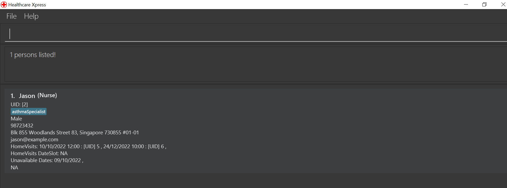

# SoCompiler - User Guide

## Table of Contents

- [Overview](#welcome-to-socompliers-user-guide)
- [Quick Start](#quick-start)
- [Things to note](#things-to-note)
- [Commands](#commands)
    - [General Commands](#For-both-modules-and-contacts)
        - [List](#listing-all-modules-and-contacts--list)
        - [Find](#finding-keywords-in-a-contact-andor-module--find)
        - [Clear](#clearing-all-contacts-and-modules--clear)
        - [Help](#looking-for-help--help)
        - [Exit](#exiting-the-program--exit)
    - [Contacts](#Contacts)
        - [Add](#adding-a-contact-addp)
        - [Edit](#editing-a-contact--editp)
        - [Delete](#deleting-a-contact--deletep)
        - [Find](#finding-a-contact--findp)
    - [Modules](#Modules)
        - [Add](#adding-a-module-addm)
        - [Edit](#editing-a-module--editm)
        - [Delete](#deleting-a-module--deletem)
        - [Find](#finding-a-module--findm)
- [FAQ](#faq)
- [Command Summary](#command-summary)

# Welcome to SOComplier's User Guide

> The sole app that university students will need to streamline their everyday routines.

SoCompiler is a **desktop app for managing contacts and module details, optimized for use via a Command Line
Interface** (CLI) while still having the benefits of a Graphical User Interface (GUI). If you can type fast, SoCompiler
can get your contact and module management tasks done faster than traditional GUI apps.

--------------------------------------------------------------------------------------------------------------------

## Quick start

1. Ensure you have Java `11` or above installed in your Computer.

2. Download the latest `socompiler.jar` from [here](https://github.com/AY2223S1-CS2103T-W12-1/tp/releases).

3. Copy the file to the folder you want to use as the _home folder_ for your SoCompiler.

4. Double-click the file to start the app. The GUI similar to the below should appear in a few seconds. Note how the app
   contains some sample data. 

   

5. Type the command in the command box and press Enter to execute it.

6. Refer to the [Command Summary](#command-summary) below for details of each command.

--------------------------------------------------------------------------------------------------------------------

## Things to note

**:information_source: Notes about the command format:** 

* Words in `UPPER_CASE` are the parameters to be supplied by the user. 
  e.g. for add `n/NAME`, NAME is the user parameter and can be replaced with John Doe

* Items in square brackets are optional. 
  e.g. `n/NAME [/t TAG]` can be used as `c/John Doe t/friend` or as `c/John Doe`.

* Parameters after the identifier c/ and m/ can be in any order. e.g. `add c n/NAME p/NUMBER e/EMAIL` is similar
  to `addp n/NAME e/EMAIL p/NUMBER`.

* If a parameter is expected only once in the command but is specified multiple times, only the last occurrence of the
  parameter will be taken. 
  e.g. if you specify `p/12341234 p/56785678`, only `p/56785678` will be taken.

--------------------------------------------------------------------------------------------------------------------

# Commands

## For both modules and contacts

### Listing all modules and contacts : `list`

Shows a list of all the modules and contacts in the list.

Format: `list`

### Finding keywords in a contact and/or module : `find`

Finds modules and contacts whose fields contain any of the given keywords.

Format: `find KEYWORD [ANOTHER_KEYWORD]…​`

* The search is case-insensitive; e.g. `cs2030s` will match `CS2030S`, or `Cs2030s`.
* The order of the keywords does not matter; e.g. `Bob McGhee` will match `McGhee Bob`.
* Any field associated with the contact or module can be found using this command.
* Only full words will be matched; e.g. `Cs2030` will not match `Cs2030S`.
* Full words are characterized by having an empty space before and after the word; eg. Searching `Friday 10am` will only
  match `Friday` and not `Friday,`
* Modules or contacts matching at least one keyword will be returned (i.e. `OR` search); e.g. `mcghee broad` will
  return `Bob McGhee` and `Seaward Broad`.

Examples:

* `find CS2030S` returns `cs2030s`
* `find bob jessica` returns `Bob McGhee` and `Jessica Lim`

### Clearing all contacts and modules : `clear`

Clears all entries from both the contact and module list.

Format: `clear`

### Looking for help : `help`

Opens a window which provides a link to the user guide.

Format: `help`

### Exiting the program : `exit`

Exits the program.

Format: `exit`

### Saving the data

SoCompiler data are saved in the hard disk automatically after any command that changes the data. There is no need to
save manually.

--------------------------------------------------------------------------------------------------------------------

## Contacts

### Adding a contact: `addp`

Adds a contact to the contact list.

Format: `addp n/NAME [p/PHONE_NUMBER] [e/EMAIL] [tg/TELEGRAM] [m/MODULE_CODE] [t/TAG]…​`

 **Tip:**
A contact can have any number of tags (including 0)

* A`Tag`can only accept alphanumerical characters with **no spaces**, i.e.`t/Labmate`is valid, while`t/Lab Mate`is not.

Examples:

* `addp n/John Doe p/98765432 e/johnd@example.com tg/@johndoe m/CS2040S t/Labmate t/Friend`
* `addp t/Family p/95647581 e/jessie@example.com tg/@jessica n/Jessica Lim`
* `addp n/BobMcGhee`

### Editing a contact : `editp`

Edits an existing contact in the contact list.

Format: `editp INDEX [n/NAME] [p/PHONE] [e/EMAIL] [tg/TELEGRAM] [m/MODULE_CODE] [t/TAG]…​`

* Edits the contact at the specified `INDEX`. The index refers to the index number shown in the displayed contact list.
  The index **must be a positive integer** 1, 2, 3, …​
* At least one of the optional fields must be provided.
* Existing values will be updated to the input values.
* When editing tags, the existing tags of the contact will be removed i.e adding of tags is not cumulative.
* You can remove all the contact’s tags by typing `t/` without specifying any tags after it.

Examples:

* `editp 1 p/91234567 e/johndoe@example.com` Edits the phone number and email address of the 1st contact to
  be `91234567`
  and `johndoe@example.com` respectively.
* `editp 2 n/Betsy Crower t/` Edits the name of the 2nd contact to be `Betsy Crower` and clears all existing tags.

### Deleting a contact : `deletep`

Deletes the specified contact from the contact list.

Format: `deletep CONTACT_INDEX`

* Deletes the contact at the specified `CONTACT_INDEX`.
* The contact index refers to the index number shown in the displayed contact list.
* The index **must be a positive integer** 1, 2, 3, …​

Examples:

* `findp Betsy` followed by `deletep 1` deletes the 1st contact in the results of the `findp` command.
* `list` followed by `deletep 5` deletes the 5th contact in the address book.

### Finding a contact : `findp`

Find contacts whose fields contain any of the given keywords.

Format: `findp KEYWORD [ANOTHER_KEYWORD]…​`

* The search is case-insensitive; e.g. `alex` will match `Alex`, or `ALEX`.
* The order of the keywords does not matter; e.g. `Bob McGhee` will match `McGhee Bob`.
* Any field associated with the contact can be found using this command.
* Only full words will be matched; e.g. `Cs2030` will not match `Cs2030S`.
* Full words are characterized by having an empty space before and after the word; eg. Searching `Friday 10am` will only
  match `Friday` and not `Friday,`
* Contacts matching at least one keyword will be returned (i.e. `OR` search); e.g. `mcghee broad` will
  return `Bob McGhee` and `Seaward Broad`.

Examples:

* `findp bob jessica` returns `Bob McGhee` and `Jessica Lim`

--------------------------------------------------------------------------------------------------------------------

## Modules

### Adding a module: `addm`

Adds a contact to the module list.

Format: `addm m/MODULE_CODE [l/LECTURE_DETAILS] [t/TUTORIAL_DETAILS] [lz/LECTURE_ZOOM_LINK] [tz/TUTORIAL_ZOOM_LINK] [a/ASSIGNMENT_DETAILS]…​`

 **Tip:** A module can have any number of assignments (including 0)

* The `AssignmentDetails` can take in alphanumerical characters **along with spaces**.

Examples:

* `addm m/CS2103T l/I3-AUDI Friday 16:00 - 18:00 lz/https://nus-sg.zoom.us/CS2103T_lecture t/COM1 B1-103 Wednesday 12:00 - 13:00 tz/https://nus-sg.zoom.us/CS2103T_tutorial a/Independent Project a/Team Project`
* `addm l/Every Monday t/Every Tuesday m/CS1231S`
* `addm m/CS2030S`

### Editing a module : `editm`

Edits an existing module in the module list.

Format: `editm INDEX [m/MODULE_CODE] [l/LECTURE_DETAILS] [t/TUTORIAL_DETAILS] [lz/LECTURE_ZOOM_LINK] [tz/TUTORIAL_ZOOM_LINK] [a/ASSIGNMENT_DETAILS]…​`

* Edits the module at the specified `INDEX`. The index refers to the index number shown in the displayed module list.
  The index **must be a positive integer** 1, 2, 3, …​
* At least one of the optional fields must be provided.
* Existing values will be updated to the input values.
* When editing assignment details, the existing assignment details of the module will be removed
  i.e adding of assignment details are not cumulative.
* You can remove all the module’s assignment details by typing `a/` without specifying any assignment details after it.

Examples:

* `editm 1 l/Every Friday a/Functional Expressionism` Edits the lecture details and assignment details of the 1st module
  to be `Every Friday`
  and `Functional Expressionism` respectively.
* `editm 2 m/MA1521 a/` Edits the module code of the 2nd module to be `MA1521` and clears all existing assignment
  details.

### Deleting a module : `deletem`

Deletes the specified module from the module list.

Format: `deletem MODULE_INDEX`

* Deletes the contact at the specified `MODULE_INDEX`.
* The module index refers to the index number shown in the displayed module list.
* The index **must be a positive integer** 1, 2, 3, …​

Examples:

* `list` followed by `deletem 2` deletes the 2nd module in the address book.
* `find CS2030S` followed by `deletem 1` deletes the 1st module in the results of the `find` command.

### Finding a module : `findm`

Find modules whose fields contain any of the given keywords.

Format: `findm KEYWORD [ANOTHER_KEYWORD]…​`

* The search is case-insensitive; e.g. `cs2030s` will match `CS2030S`, or `Cs2030s`.
* The order of the keywords does not matter; e.g. `cs2100 cs2109s` will match `cs2109s cs2100`.
* Any field associated with the module can be found using this command.
* Only full words will be matched; e.g. `Cs2030` will not match `Cs2030S`.
* Full words are characterized by having an empty space before and after the word; eg. Searching `Friday 10am` will only
  match `Friday` and not `Friday,`
* Modules matching at least one keyword will be returned (i.e. `OR` search); e.g. `cs2109s cs2100` will return `CS2109s`
  and `CS2100`.

Examples:

* `findm CS2030S` returns `cs2030s`

--------------------------------------------------------------------------------------------------------------------

## FAQ

**Q**: How do I transfer my data to another Computer? 
**A**: Install the app in the other computer and overwrite the empty data file it creates with the file that contains
the data of your previous SoCompiler home folder.

**Q**: What if my module has no zoom links? What if I don't have the contact number of my Teaching Assistant? 
**A**: When adding a Module, all fields except `MODULE_CODE` are optional. When adding a contact, all fields except
`NAME` are optional. These fields can be updated later with the
[editp](#editing-a-contact--editp) or [editm](#editing-a-module--editm) commands.

--------------------------------------------------------------------------------------------------------------------

## Command summary

| Action                                                    | Module/Contact | Format                                                                                                                                         |
|-----------------------------------------------------------|----------------|------------------------------------------------------------------------------------------------------------------------------------------------|
| [Add](#adding-a-module-addm)                              | Module         | `addm m/MODULE_CODE [l/LECTURE_DETAILS] [t/TUTORIAL_DETAILS] [lz/LECTURE_ZOOM_LINK] [tz/TUTORIAL_ZOOM_LINK] [a/ASSIGNMENT_DETAILS]…​`          |
| [Add](#adding-a-contact-addp)                             | Contact        | `addp n/NAME [p/PHONE_NUMBER] [e/EMAIL] [m/MODULE_CODE] [t/TAG]…​`                                                                             |
| [Edit](#editing-a-module--editm)                          | Module         | `editm INDEX [m/MODULE_CODE] [l/LECTURE_DETAILS] [t/TUTORIAL_DETAILS] [lz/LECTURE_ZOOM_LINK] [tz/TUTORIAL_ZOOM_LINK] [a/ASSIGNMENT_DETAILS]…​` |
| [Edit](#editing-a-contact--editp)                         | Contact        | `editp INDEX [n/NAME] [p/PHONE] [e/EMAIL] [m/MODULE_CODE] [t/TAG]…​`                                                                           |
| [Delete](#deleting-a-module--deletem)                     | Module         | `deletem MODULE_INDEX`                                                                                                                         |
| [Delete](#deleting-a-contact--deletep)                    | Contact        | `deletep CONTACT_INDEX`                                                                                                                        |                                                                                                                                           |
| [Find](#finding-a-module--findm)                          | Module         | `findm KEYWORD [ANOTHER_KEYWORD]…​`                                                                                                            |                                   |
| [Find](#finding-a-contact--findp)                         | Contact        | `findp KEYWORD [ANOTHER_KEYWORD]…​`                                                                                                            |                          |
| [Clear](#clearing-all-contacts-and-modules--clear)        | Both           | `clear`                                                                                                                                        |
| [List](#listing-all-modules-and-contacts--list)           | Both           | `list`                                                                                                                                         |
| [Find](#finding-keywords-in-a-contact-andor-module--find) | Both           | `find KEYWORD [MORE_KEYWORDS]`                                                                                                                 |
| [Exit](#looking-for-help--help)                           | General        | `exit`                                                                                                                                         |
| [Help](#exiting-the-program--exit)                        | General        | `help`                                                                                                                                         |
