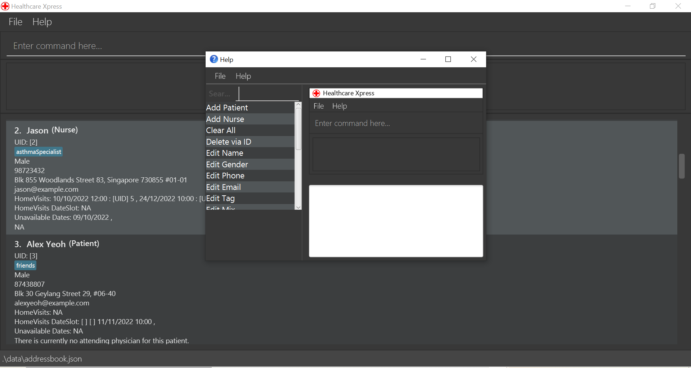
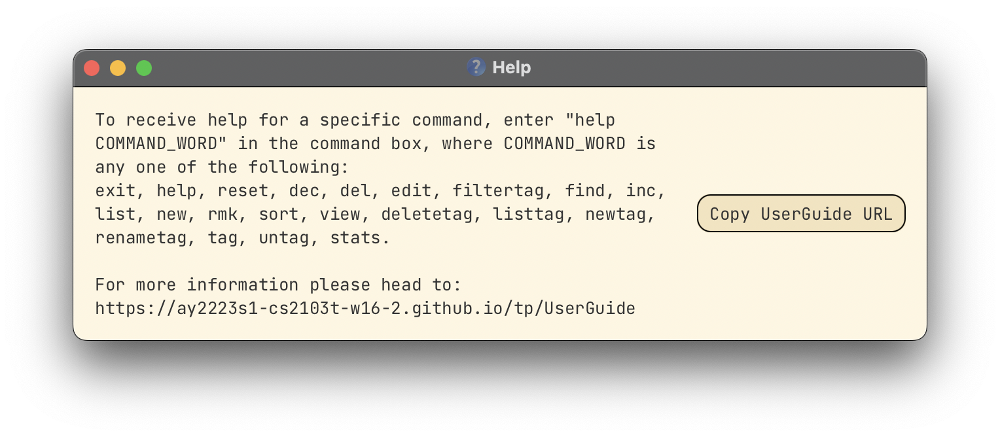
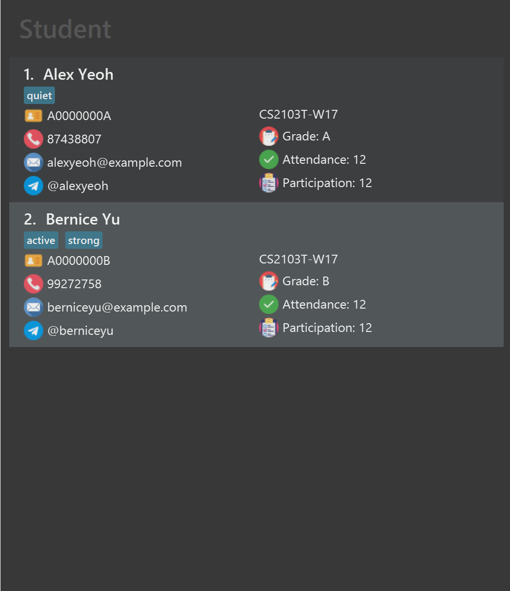

# Hello!

Welcome to the <watson>Watson</watson> user guide!
Watson is a helpful **desktop application** that helps school teachers
track the data of their students. It can handle student particulars, sort students, handle grades and more!

### Can I use Watson?
Watson is a desktop application that supports Apple, Windows and Linux [operating systems](#glossary).
As long as you have a computer, you can run Watson!

### Using This Guide
This guide covers all of Watson's features and how to use them.
If you are unsure of how to use a feature or find help about a problem you might be
facing, you can refer to this guide.

---
# Table of Contents

* [Quick Start](#quick-start)
* [How to navigate Watson](#watson-the-basics)
  - [The Login Page](#the-login-page)
  - [The Main Page](#the-main-page)
    - [The Menu Bar](#the-menu-bar)
    - [The Command Box](#the-command-box)
    - [The Student Card](#the-student-card)
* [A Brief Guide to Commands](#a-brief-guide-to-commands)
  - [The Command Structure](#the-command-structure)
  - [Important Notes](#important-notes)
* [Handling Student Particulars](#handling-student-particulars)
  - [Adding a Student](#adding-a-student)
  - [Editing a Student](#editing-a-student)
  - [Deleting a Student](#deleting-a-student)
  - [Adding remarks to a Student](#adding-a-remark-to-a-student)
* [Handling Grades](#handling-grades)
  - [Grading your Students](#grading-your-students)
  - [Predicting a Student's grade](#predicting-a-students-grade)
* [Utility Features](#utility-features)
  - [Sorting Students](#sorting-students)
  - [Finding a Student](#finding-a-student)
  - [Viewing all Students](#viewing-all-students)
  - [Clearing the list of Students](#clearing-the-list-of-students)
  - [Getting help](#getting-help)
* Advanced Features
* Frequently Asked Questions
* [Glossary](#glossary)

---
# Quick Start

1) Ensure you have Java `11` or above installed in your Computer
   (Not sure how? Check out [this](https://www.java.com/en/download/help/version_manual.html) guide).
2) Download the latest version of Watson from [here](https://github.com/AY2223S1-CS2103T-T08-1/tp/releases).
The file you want is called `Watson.jar`.
3) Locate the downloaded file. Often, this would be your computer's `Downloads` folder.
4) On your computer's Desktop, create a new folder called `Watson`, then drag and drop `Watson.jar`
from your `Downloads` folder into the `Watson` folder.
5) Double-click on `Watson.jar` to start the application.

# Watson: The Basics

---

## The Login Page

When you open Watson, you will be greeted with the login page, which looks like this:

The login page is where you can log into Watson. To log in, type your login details into their respective boxes,
then click the "Login" button below.

:exclamation: Notice that for testing purposes, the login details are written in red below the Login button.
To log in, simply type "admin" in both username and password boxes, then click the "Login" button below.

---

## The Main Page

After logging in, you will be greeted with the main page, which looks like this:

This looks quite complicated! But don't worry, we'll go through each part of the main page one by one.

You can use the following table to navigate through the components in the main page:

* [The Menu Bar](#the-menu-bar)
  - [The File tab](#the-file-tab)
  - [The Help tab](#the-help-tab)
* [The Command Box](#the-command-box)
* [The Student card](#the-student-card)

---

### The Menu Bar

The menu bar is circled in red above

The menu bar is located at the top of the main page. It contains the following options:

#### The File tab

Clicking on the File tab will open a dropdown menu with the "Exit" option.
Clicking on the "Exit" option will close the application.

#### The Help tab

Clicking on the Help tab will open a dropdown menu with the "Help" option.
Clicking on the "Help" option will open a help window that looks like this:

The "Copy URL" button will copy the link to the user guide, which can be pasted in your
browser to open the online user guide.

:bulb: You can also open the help window by pressing the "F1" key on your keyboard!

---

### The Command Box

The command box (circled in red above) is where you can type in commands to Watson.
After you type in your desired command, press the "Enter" key on your keyboard to tell Watson to perform
the action.

:bulb: Commands are special sequences of words that Watson can understand.
They are used to perform actions with Watson.

---

### The Student card

Each student is represented by a card that looks like the image above.
From top to bottom, the card contains the following details:

#### Name (Alex Yeoh)

The name of the student. Notice that there is a "1." before the name;
this represents the student's _index_. You will use this number in certain commands
such as [`edit`]() and [`delete`]().

#### Tags ("Student Council")

A student can have one, multiple or no tags.
Tags are a good way to represent special roles a student might have (in this case, Alex is a member of the Student Council).

#### Phone Number (87438807)

The phone number of the student.

#### Address (Blk 30 Geylang Street 29, #06-40)

The address of the student.

#### Email (alexyeoh@example.com)

The email address of the student.

#### Class (1.2)

The class of the student.
Watson supports many formats for classes, such as "1.2", "1A" and more.

#### Attendance (1/1)

The attendance of the student. This is represented in the form "number/number",
where the first number represents the number of classes the student has attended,
while the second number represents the total number of classes that have taken
place.

#### Subjects (English, Math)

The subjects that the student is taking. Each subject is represented in its own line,
and contains information about the student's grades for that subject.
"ENGLISH: [ Grade = 62.1 ]" means that the student has obtained 62.1% of the maximum grade possible
for English so far.

For example, if the student has taken 1 test that has a weightage of 30% of the subject's
entire grade, and scored 100% for that test, then the number shown in the application would
be 30% of 100%, or 30%.

#### Remarks (Good at Math)

Remarks are a good way to keep track of a student's strengths and weaknesses.
A student can have multiple remarks.

---

## A Brief Guide to Commands

### The Command Structure

Commands are the main way you can interact with Watson.
You can type commands into the [command box](#the-command-box) to tell Watson to perform actions.

Commands are made of a _command word_ and _arguments_.
The command word is the first word you type into the command box, and it tells Watson what action to perform.

For example, if you type `add` into the command box, Watson will know that you want to add a student.

The arguments are the rest of the words you type into the command box, and are usually made up of
different _parameters_.

Think of the command structure as ordering a sandwich.
The command word is the type of bread you want, while the parameters are the ingredients you want.

Let's break down an example command:

`add n/John Doe p/98765432`

add

The command word. This tells Watson that you want to add a student.

n/John Doe

The name parameter. This tells Watson that the name of the student is "John Doe".

p/98765432

The phone number parameter. This tells Watson that the phone number of the student is "98765432".

### Important Notes

Commands have some special features that you should be aware of!

#### Words in `UPPER_CASE` are the inputs to be supplied by the user.

For example, in `add n/NAME`, you will give your own value for `NAME`. An example would be `add n/John Doe`.

#### Items in square brackets are optional.

For example, `TAG` in `n/NAME [t/TAG]` can be excluded.
You can match the format with either `n/John Doe t/friend` or `n/John Doe`.

#### Items with `…` after them can be used any number of times, including zero times.

For example, `[t/TAG]…` can be ignored (used 0 times), `t/friend` (used 1 time), `t/friend t/family` (used 2 times) etc.

#### Parameters can be in any order.

For example, if the command specifies `n/NAME p/PHONE_NUMBER`, `p/PHONE_NUMBER n/NAME` is also acceptable.

#### Repeated parameters will be ignored.

Only the last occurrence of the repeated parameter will be taken.

For example, if you specify `n/Alice n/Bob`, only `n/Bob` will be taken by Watson.

---

# Handling Student Particulars

Watson's main capabilities are to keep track of students' particulars, such as their name, phone number, email address, etc.
With Watson, you can move away from cumbersome pen-and-paper systems and keep track
of your student's data far more easily.

Watson currently supports four features regarding student particulars:

* [Adding a student](#adding-a-student)
* [Editing a student](#editing-a-student)
* [Deleting a student](#deleting-a-student)
* [Adding a remark to a student](#adding-a-remark-to-a-student)

---

## Adding a student

You can add a student to Watson by using the `add` command.

<strong class="red-text">Command Word:</strong> `add`

<strong class="orange-text">Compulsory Parameters:</strong> `n/NAME`, `p/PHONE`, `e/EMAIL`, `a/ADDRESS`,
`c/CLASS`

<strong class="green-text">Optional Parameters:</strong> `[rem/REMARK]…`, `[t/TAG]…`

### Parameter Information

* None of the parameters can be blank.
* `NAME` should only contain alphanumeric characters and spaces.
* `PHONE` should only contain numbers, and it should be at least 3 digits long.
* `EMAIL` should be a valid email address.
* `CLASS` should only contain numbers, letters and the decimal point.

### Examples

`add n/John Doe p/98765432 e/john@gmail.com a/2 Sengkang Avenue c/1A t/Student Council`

`add n/Amy Lee a/Changi Airport p/87878787 e/amy@outlook.com c/1.4 rem/Good at Math`

### Step-By-Step

---
 

Troubleshooting

Problem: I typed in the command, but Watson says that the command is invalid!

Solution: Check your command format! You can refer to the [command structure](#the-command-structure) for more information.

Problem: I typed in the command, but Watson says that the student already exists?

Solution: Ensure that the student that you want to add does not share the same _name_,
_phone number_ or _email address_ as another student in the application.

---

## Editing a student

You can edit a student's particulars by using the `edit` command.
The `edit` command supports the editing of the following particulars:

* Name
* Phone number
* Email address
* Address
* Class
* Remarks
* Tags

Multiple fields can be edited with a single `edit` command.

<strong class="red-text">Command Word:</strong> `edit`

<strong class="orange-text">Compulsory Parameters:</strong> `INDEX`, **AT LEAST ONE of the Optional Parameters**

<strong class="green-text">Optional Parameters:</strong> `[n/NAME]`, `[p/PHONE]`,
`[e/EMAIL]`, `[a/ADDRESS]`, `[c/CLASS`, `[rem/REMARK]…`, `[t/TAG]…`

### Parameter Information

* None of the parameters can be blank.
* `INDEX` is the number of the student that you want to edit.
This number is shown next to the student's name.
* `NAME` should only contain alphanumeric characters and spaces.
* `PHONE` should only contain numbers, and it should be at least 3 digits long.
* `EMAIL` should be a valid email address.
* `CLASS` should only contain numbers, letters and the decimal point.

### Examples

`edit 1 n/John Doe p/98765432`

`edit 2 t/Financial Assistance`

### Step-By-Step

---
 

:exclamation: Using the `[rem/REMARK]` and/or `[t/TAG]` parameters will OVERWRITE any
other remarks and/or tags that the student has!

Troubleshooting

Problem: I typed in the command, but Watson says that the student index provided is invalid!

Solution: The number specified by the `INDEX` parameter does not have a corresponding student!
Ensure that you have typed in the correct number of the student that you want to edit.

---

## Deleting a student

You may delete the entry for a particular student with the `delete` command.
Note that this action is irreversible!

<strong class="red-text">Command Word:</strong> `delete`

<strong class="orange-text">Compulsory Parameters:</strong> `INDEX`

### Parameter Information

* `INDEX` is the number of the student that you want to delete.
This number is shown next to the student's name.

### Examples

`delete 1`

### Step-By-Step

 

Troubleshooting

Problem: I typed in the command, but Watson says that the student index provided is invalid!

Solution: The number specified by the `INDEX` parameter does not have a corresponding student!
Ensure that you have typed in the correct number of the student that you want to edit.

---

## Adding a remark to a student

You can add a remark to a student with the `remark` command.

<strong class="red-text">Command Word:</strong> `remark`

<strong class="orange-text">Compulsory Parameters:</strong> `INDEX`, `rem/REMARK`

### Parameter Information

* None of the parameters can be blank.
* `INDEX` is the number of the student that you want to add a remark to.
This number is shown next to the student's name.
* `REMARK` is the remark that you want to add to the student.

### Examples

`remark 1 rem/Good at Math`

`remark 2 rem/Enjoys playing football`

### Step-By-Step

---
 

Troubleshooting

Problem: I typed in the command, but Watson says that the student index provided is invalid!

Solution: The number specified by the `INDEX` parameter does not have a corresponding student!
Ensure that you have typed in the correct number of the student that you want to edit.

---

# Handling Grades

Watson allows you to keep track of your students' grades in a simple and intuitive manner.
Watson also features a novel prediction system that allows you to predict a student's grade
for a future assessment.

Watson currently supports two features regarding student grades:

* [Grading your students](#adding-a-student)
* [Editing a student](#editing-a-student)

## Grading your Students

Watson's grading system allows you to grade all your students at once for any assessment.

<strong class="red-text">Command Word:</strong> `grade`

<strong class="orange-text">Compulsory Parameters:</strong> `subject_`, `assessmentName_`,
`assessmentTotalScore_`, `assessmentWeightage_`, `assessmentDifficulty`

### Parameter Information

* This command has a special parameter format, using underscores `("_")` instead of prefixes `("n/")`.
* There should be <strong>no spaces</strong> between parameters.
* The parameters have to be in the <strong>exact order</strong> as shown above.
* `subject_` is the subject that the assessment belongs to. It must be in **CAPITAL LETTERS**. If no students take the subject,
an error message will be shown.
* `assessmentName_` is the name of the assessment. This name should be unique for the subject,
and can only consist of alphabets and numbers. Spaces are **NOT** allowed.
* `assessmentTotalScore_` is the total score of the assessment. This should be a positive whole number (no decimals!).
* `assessmentWeightage_` is the weightage of the assessment. This should be a decimal number between 0 and 1 (e.g. 0.5).
This is the percentage of the total grade that this assessment contributes to; so 0.5 would
represent 50%.
* `assessmentDifficulty` is the difficulty of the assessment. This should be a decimal number between 0 and 5 (e.g. 3.5).
The difficulty of the assessment should be a rough estimate (according to you!) of how difficult the assessment is.

### Examples

`grade MATH_Quiz1_10_0.5_3.5`

`grade ENGLISH_FYE_100_0.5_4.5`

### Step-By-Step Example

Let's use `grade ENGLISH_FYE_100_0.5_4.5` and see how the grading process works!

1) Type in the command `grade` followed by the parameters.
You should see the following screen:

Observe that there is a text box at the bottom of the window, next to which is a button labelled `Enter`.

2) Type in the grade that the student obtained for the assessment.
The window will now show the details of the next student to be marked.
Continue typing in marks until the window closes.

3) Once the window closes, you will observe that the grades of the students marked
will be updated.

 

On the left: before grading, on the right: after grading

---
 

Troubleshooting

Problem: I typed in the command, but Watson says that the student index provided is invalid!

Solution: The number specified by the `INDEX` parameter does not have a corresponding student!
Ensure that you have typed in the correct number of the student that you want to edit.

---

## Predicting a Student's grade

Watson's prediction system allows you to predict a student's grade for a future assessment.
Watson follows the following steps to predict a student's grade:

1) Calculate the percentage of classes attended by the student. Let's call this the student's **learning rating**.

For each of the student's previous assessments, perform the following procedure:

1.1. Take the difficulty of the assessment, then apply the following formula:

1/(difficulty x learning rating)

Let's call this number the **difficulty bonus**.

1.2. Add the **difficulty bonus** to the student's grade for the assessment.
We call this their **normalized score**.
2) Take the average of the student's **normalized scores** for all their previous assessments,
then add the difficulty of the assessment to predict. This is the final prediction!

<strong class="red-text">Command Word:</strong> `predict`

<strong class="orange-text">Compulsory Parameters:</strong> `n/NAME`, `s/SUBJECT`, `diff/DIFFICULTY`,

### Parameter Information

* None of the parameters can be blank.
* The `n/NAME` parameter should match **EXACTLY** to the student to be predicted.
* The student should be studying the subject to be predicted.
* The `diff/DIFFICULTY` parameter should be a decimal number between 0 and 5 (e.g. 3.5).

### Examples

`predict n/Alex Yeoh s/ENGLISH diff/4.0`

`predict n/Bernice Yu s/MATH diff/3.5`

### Step-By-Step Example

Let's use `predict n/Alex Yeoh s/ENGLISH diff/4.0` and see how the prediction process works!

1) Type in the command `predict` followed by the parameters, then press `Enter`.
2) You should see the following screen:

This prediction means that Alex is likely to get about 62 percent for their next English assessment.

---
 

Troubleshooting

Problem: I typed in the command, but Watson says that the student can't be found!

Solution: Make sure that you've typed in the student's name correctly. The name is case-sensitive!

---

# Utility Features

Watson has a few utility features that can make handling your students easier, including:

* Sorting Students
* Finding a Student
* Viewing all Students
* Clearing the list of Students

## Sorting Students

Watson's sorting system allows you to sort your students based of their grades for a given subject.

<strong class="red-text">Command Word:</strong> `sort`

<strong class="orange-text">Compulsory Parameters:</strong> `asc` OR `desc`, `s/SUBJECT`

### Parameter Information

* The `asc` parameter sorts the students in ascending order, while the `desc` parameter sorts the students in descending order.
* The `s/SUBJECT` parameter should be the subject to be sorted by.

### Examples

`sort asc s/ENGLISH`

`sort desc s/MATH`

### Step-By-Step Example

Let's use `sort asc s/ENGLISH` and see how the sorting process works!

1) Type in the command `sort asc s/ENGLISH`, then press `Enter`. Note that `ENGLISH` does
not need to be capitalized.
2) You should see the following screen:

On the left: before sorting, on the right: after sorting

---
 

Troubleshooting

Problem: I typed in the command, but Watson says that the student can't be found!

Solution: Make sure that you've typed in the student's name correctly. The name is case-sensitive!

---

## Finding a Student

Watson's find system allows you to find a student based on their name, class or a subject.

<strong class="red-text">Command Word:</strong> `find`

<strong class="orange-text">Compulsory Parameters:</strong> AT LEAST ONE OF `n/NAME` OR `c/CLASS` OR `s/SUBJECT`

### Parameter Information

* You may put use multiple parameters to search for a student, but NOT zero.
* The parameters work independently; for example, if you search for the name `Alex Yeoh` and the class `4A`,
ALL students with the name `Alex Yeoh` AND the class `4A` will be displayed.

### Examples

`find n/Alex Yeoh`

`find n/Alex c/4A`

`find n/Alex s/ENGLISH`

### Step-By-Step Example

We will use the command `find n/Alex c/2.1` to search for students.

1) Type in the command `find n/Alex c/2.1`, then press `Enter`.
2) You should observe that two students have been found: Alex Yeoh (whose name matches the search term "Alex"),
and Bernice Yu (who is in class 2.1).
3) To get back to the main list, type `list` in the command box, then press `Enter`.

---
 

Troubleshooting

Problem: I typed in the command, but Watson says that the command has an invalid format!

Solution: Make sure that you've not left any parameters blank! Blank parameters will
cause Watson to show an error.

---

## Viewing all Students

You can easily navigate back to the full student list with the `list` command.

<strong class="red-text">Command Word:</strong> `list`

### Examples

`list`

---

## Clearing the list of Students

You can clear the list of students with the `clear` command.
Note that this is irreversible!

<strong class="red-text">Command Word:</strong> `clear`

### Examples

`clear`

---

## Getting Help

If you need help, you can type `help` in the command box, then press `Enter`.
A pop-up window will appear with a link that you can copy and paste into your browser.
The link will bring you to this guide!

<strong class="red-text">Command Word:</strong> `help`

### Examples

`help`

---

## Glossary

* **Operating System**: The software that runs on your computer.
