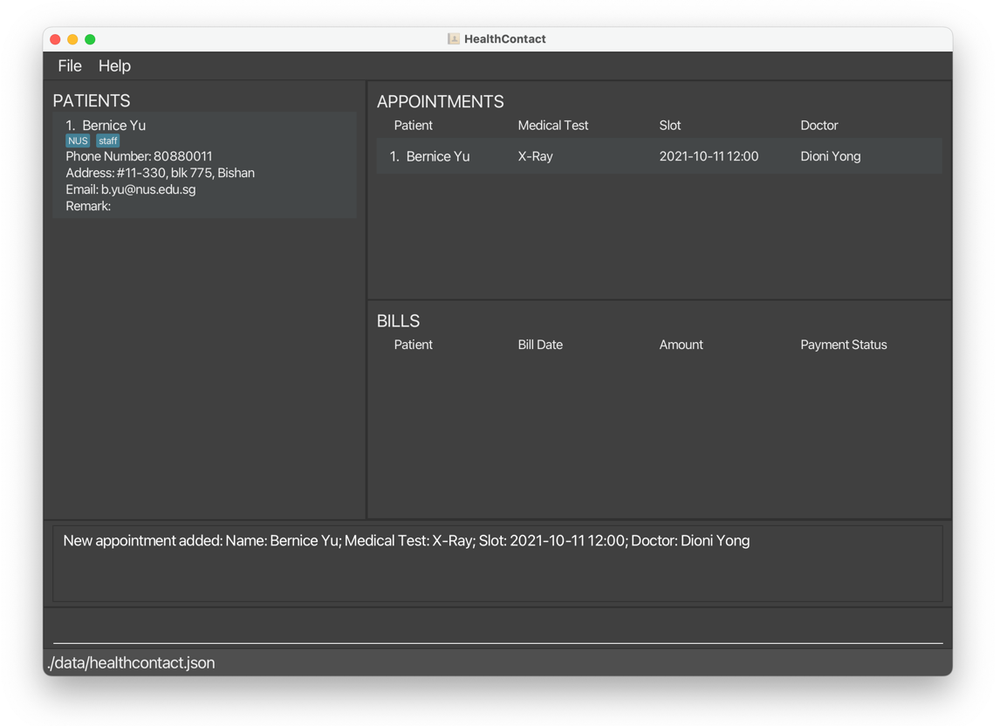
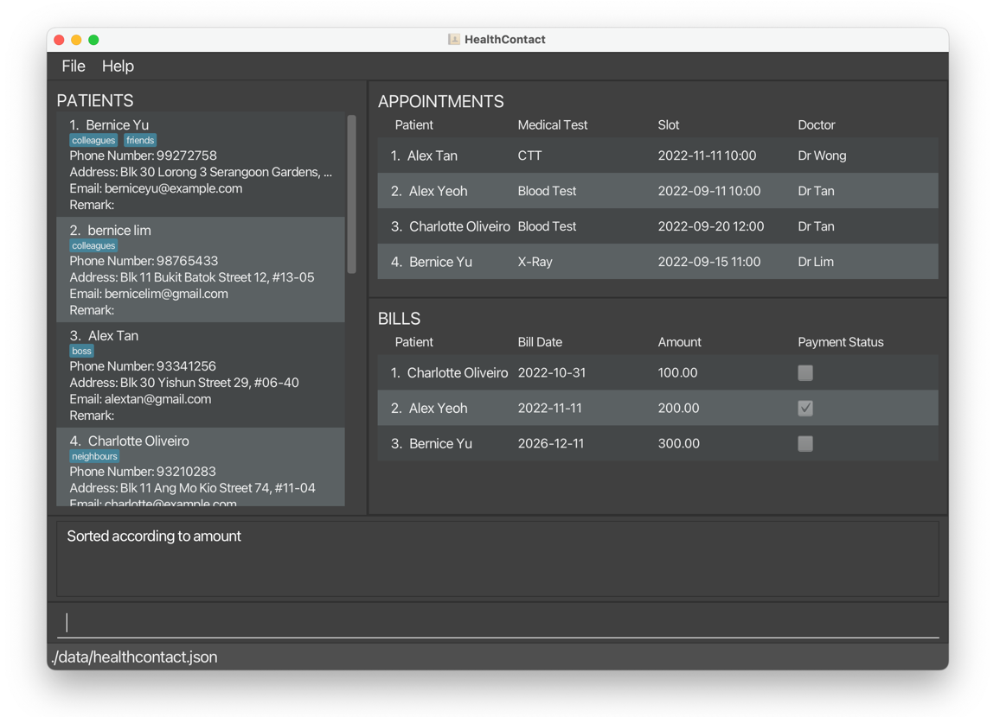

# HealthContact User Guide

HealthContact is a software for the receptionist of a family clinic
who arranges telemedicine services between doctors and patients.
It helps to keep track of patient data, patient appointments and
patient bills for the family clinic.

---

## Features
* [Add a patient (addpatient, ap)](#111-add-a-patient-addpatient-ap)
* [Add an appointment of a patient (addappointment, aa)](#112-add-an-appointment-of-a-patient-addappointment-aa)
* [Add a bill of an appointment (addbill, ab)](#113-add-a-bill-of-an-appointment-addbill-ab)
* [Edit a patient (editpatient, ea)](#121-edit-a-patient-editpatient-ep)
* [Edit an appointment of a patient (editappointment, ea)](#122-edit-an-appointment-of-a-patient-editappointment-ea)
* [Edit a bill of an appointment (editbill, eb)](#123-edit-a-bill-of-an-appointment-editbill-eb)
* [Find patient(s) (findpatient, fp)](#131-find-patients-findpatient-fp)
* [Find appointment(s) (findappointment, fa)](#132-find-appointments-findappointment-fa)
* [Find bill(s) (findbill, fb)](#133-find-bills-findbill-fb)
* [Sort patients (sortpatient, sop)](#141-sort-patients-sortpatient-sop)
* [Sort appointments (sortappointment, soa)](#142-sort-appointments-sortappointment-soa)
* [Sort bills (sortbill, sob)](#143-sort-bills-sortbill-sob)
* [Select a patient (selectpatient, slp)](#151-select-a-patient-selectpatient-slp)
* [Select an appointment (selectappointment, sla)](#152-select-an-appointment-selectappointment-sla)
* [Set bill as paid (setpaid, sp)](#161-set-bill-as-paid-setpaid-sp)
* [Set bill as unpaid (setunpaid, sup)](#162-set-bill-as-unpaid-setunpaid-sup)
* [List (list, ls)](#17-list-list-ls)
* [Delete a patient (deletepatient, dp)](#181-delete-a-patient-deletepatient-dp)
* [Delete a patient's appointment (deleteappointment, da)](#182-delete-an-appointment-of-a-patient-deleteappointment-da)
* [Delete the bill of an appointment (deletebill, db)](#183-delete-a-bill-of-an-appointment-deletebill-db)
* [Undo (undo)](#19-undo-undo)
* [Redo (redo)](#110-redo-redo)
* [Clear (clear)](#111-clear-clear)
* [Exit the program (exit)](#112-exit-exit)
* [Help (help)](#113-help-help)
* [Save the data](#114-save-the-data)
* [Edit the data file](#115-edit-the-data-file)

---
# Quick Start
1. Ensure you have Java 11 or above installed in your Computer.

2. Download the latest HealthContact.jar from [here](https://github.com/AY2223S1-CS2103T-W08-1/tp/releases).

3. Copy the file to the folder you want to use as the home folder for your HealthContact application.

4. Double-click the file to start the app. The Graphical User Interface(GUI) similar to the one below should appear in a few seconds. Note how the app contains some sample data.


5. Type the command in the command box and press Enter to execute it. e.g. typing help and pressing Enter will open the help window.

6. Refer to the __Features__ below for details of each command.


# 1. Features

## 1.1 Add

### 1.1.1 Add a patient `addpatient`, `ap`

Adds a patient to HealthContact with input information including name, phone number,
email address, home address, remarks and tags.

#### Command word

`addpatient`, `ap`

#### Format

`Command word <prefix><input> ...`

* Name must be different from existing patient and name is case-insensitive.

* Remark and tags are optional.

* A patient can be added with multiple tags.

* The patient list, appointment list and bill list will show all data after adding.

#### Parameter List

|     | Prefix  | Meaning       | Input Constraint                                                                                       |
|-----|---------|---------------|--------------------------------------------------------------------------------------------------------|
| `*` | `n/`    | Name          | 1. Non-empty alphanumeric characters and spaces<br/> 2. Must be different from existing patient's name |
| `*` | `p/`    | Phone number  | Numbers with at least 3 digits                                                                         |
| `*` | `e/`    | Email address | `local-part@domain`                                                                                    |
| `*` | `a/`    | Home address  | Non-empty characters                                                                                   |
|     | `r/`    | Remark        | Any characters                                                                                         |
| `+` | `t/`    | Tag           | One alphanumeric word                                                                                  |

Notes on symbols in first column:

`*`  Must have (If they are duplicate prefixes, only the last one will be taken into account)

`+`  Can have multiple

#### Example:

* `ap n/Bernice Yu a/#11-330, blk 775, Bishan e/b.yu@nus.edu.sg p/80880011 t/NUS t/staff` adds the patient.


### 1.1.2 Add an appointment of a patient `addappointment`, `aa`

Adds an appointment to HealthContact with input information including patient name, medical test,
slot, and doctor.

#### Command word

`addappointment`, `aa`

#### Format

`Command word <prefix><input> ...`

* Patient name input must strictly match the name of an existing patient, even the casing.

* Slot must be in the format `yyyy-MM-dd HH:mm`, eg. `2022-11-12 13:00`.

* The input of four parameters must be different with the combination in other appointments.

* Doctor and medical test are case-sensitive.

* The input of four parameters must be different with the combination in other appointments, taking into consideration that doctor and medical test are case-sensitive, while patient name is case-insensitive.

* The patient list, appointment list and bill list will show all data after adding.

* The onus is on the user to check and ensure the following before adding an appointment:
  * The appointment times for different patients with the same doctor do not clash with one another.
  * The same patient/doctor does not have multiple appointments with times that clash with one another.

#### Parameter List

|     | Prefix | Meaning      | Input Constraint                                                                        |
|-----|--------|--------------|-----------------------------------------------------------------------------------------|
| `*` | `n/`   | Name         | 1. Non-empty alphanumeric characters and spaces<br/> 2. must be existing patient's name |
| `*` | `s/`   | Slot         | Valid date and time in format `yyyy-MM-dd HH:mm`                                        |
| `*` | `d/`   | Doctor name  | Non-empty alphanumeric characters and spaces                                            |
| `*` | `t/`   | Medical test | Non-empty characters                                                                    |

Notes on symbols in first column:

`*`  Must have (If they are duplicate prefixes, only the last one will be taken into account)

`+`  Can have multiple

#### Examples:

* `aa n/Bernice Yu s/2021-10-11 12:00 d/Dioni Yong t/X-Ray` adds the appointment.



* `aa n/Bernice Yu s/2022-01-23 09:00 d/Dioni Yong t/CT` adds another appointment for `Bernice Yu`.


### 1.1.3 Add a bill of an appointment `addbill`, `ab`

Adds a bill attached to an appointment with input information including amount and bill date.

#### Command word

`addbill`, `ab`

#### Format

`Command word <index of appointment> <prefix><input> ...`

* An amount must be positive number with at most 2 decimal places.

* One appointment can be attached to no more than one bill.

* A bill date must be in the format `yyyy-MM-dd`, eg. `2022-11-12`.

* The patient list, appointment list and bill list will show all data after adding.

#### Parameter List

|      | Prefix  | Meaning              | Input Constraint                                                                                                 |
|------|---------|----------------------|------------------------------------------------------------------------------------------------------------------|
| `**` | NA      | Index of appointment | 1. Positive integer <br/> 2. Appears in the appointment list<br/>3. The indicated appointment does not have bill |
| `*`  | `a/`    | Amount               | Positive number with at most 2 decimal place                                                                     |
| `*`  | `d/`    | Bill Date            | Valid date in format `yyyy-MM-dd`                                                                          |

Notes on symbols in first column:

`**` Must be directly after command word

`*`  Must have (If they are duplicate prefixes, only the last one will be taken into account)

#### Example:

* `ab 1 a/1200.00 d/2021-11-11` adds a bill to the first appointment in the displayed list.


## 1.2 Edit

### 1.2.1 Edit a patient `editpatient`, `ep`

Edits a patient's information, such as name, phone number, address, email, remarks, and tags.

#### Command word:
`editpatient`, `ep`

#### Format:
`Command word <index of patient> <prefix><input> ...`

* Edits the patient at the specified index. The index of patient refers to the index number shown in the displayed patient list.
  The index **must be a positive integer** 1, 2, 3, …​
* <input> refers to the new value of the field to be edited.
* User input should be different from the previous information that the patient has.
* At least one of the optional fields must be provided.
* Existing values will be updated to the input values.
* When editing tags, the existing tags of the person will be removed i.e adding of tags is not cumulative.
* You can remove all the patient’s tags by typing `t/` without
  specifying any tags after it.
* The prefixes that can be used to edit patients can be found below in the parameter list.

#### Parameter List

|     | Prefix  | Meaning       | Input Constraint                                                                                       |
|-----|---------|---------------|--------------------------------------------------------------------------------------------------------|
| `*` | `n/`    | Name          | 1. Non-empty alphanumeric characters and spaces<br/> 2. Must be different from existing patient's name |
| `*` | `p/`    | Phone number  | Numbers with at least 3 digits                                                                         |
| `*` | `e/`    | Email address | `local-part@domain`                                                                                    |
| `*` | `a/`    | Home address  | Non-empty characters                                                                                   |
|     | `r/`    | Remark        | Any characters                                                                                         |
| `+` | `t/`    | Tag           | One alphanumeric word                                                                                  |

#### Examples:
* `editpatient 1 p/91234567 e/johndoe@example.com` edits the phone number and email address of the first patient on the displayed list to be
   `91234567` and `johndoe@example.com` respectively.


* `editpatient 2 n/Betsy Crower t/` edits the name of the second patient on the displayed list to be `Betsy Crower` and clears all existing tags.


### 1.2.2 Edit an appointment of a patient `editappointment`, `ea`

Edits an appointment of a patient, such as name, medical test, slot, and doctor.

#### Command word:
`editappointment`, `ea`
#### Format:
`Command word <index of appointment> <prefix><input> ...`

* Edits the appointment at the specified index. The index of appointment refers to the index number shown in the displayed appointment list.
* The index **must be a positive integer** 1, 2, 3, …​
* The <input> refers to the new value of the field to be edited.
* User input should be different from the previous information that the appointment has.
* At least one of the optional fields must be provided.
* Existing values will be updated to the input values.
* The prefixes that can be used to edit patients can be found below in the parameter list.

#### Parameter List

|     | Prefix | Meaning      | Input Constraint                                                                        |
|-----|--------|--------------|-----------------------------------------------------------------------------------------|
| `*` | `n/`   | Name         | 1. Non-empty alphanumeric characters and spaces<br/> 2. must be existing patient's name |
| `*` | `s/`   | Slot         | Valid date and time in format `yyyy-MM-dd HH:mm`                                        |
| `*` | `d/`   | Doctor name  | Non-empty alphanumeric characters and spaces                                            |
| `*` | `t/`   | Medical test | Non-empty characters                                                                    |

#### Examples:
* `editappointment 1 n/zanw t/CT Scan s/2021-03-01 10:00 d/Tan` edits the name, medical test, slot,
   and doctor of the first appointment to be `zanw`, `CT Scan`, `2021-03-01 10:00`, and `Tan` respectively.


### 1.2.3 Edit a bill of an appointment `editbill`, `eb`

Edits the bill of an appointment.

#### Command word:
`editbill`, `eb`

#### Format: 

`Command word <index of bill> <prefix><input> ...`

* Edits the bill at the specified index. The index of bill refers to the index number shown in the displayed bill list.
  The index **must be a positive integer** 1, 2, 3, …​
* User input should be different from the previous information that the bill has.
* At least one of the optional fields must be provided.
* Existing values will be updated to the input values.

#### Examples:
* `editbill 1 a/100` edits the amount of the first bill to be `100`.


* `editbill 1 d/2020-10-10` edits the bill date of the first bill to be `2020-10-10`.


## 1.3 Find

### 1.3.1 Find patient(s) `findpatient`, `fp`

Filters patients by one or more fields using their prefixes, and their corresponding inputs (numbers, letters,
special characters).

#### Command word:
`findpatient`, `fp`

#### Format:
```Command word <prefix><input> ...``` <br>

* The command words are ``findpatient`` or ``fp``.
* The prefixes are n/ for Name, p/ for Phone, e/ for Email, a/ for Address, r/ for Remark, t/ for Tag.
* The filter is case-insensitive. e.g. han will match Han
* The user can filter using full words or partial words. e.g. han will match Hannah
* The user can filter using a combination of inputs for a field, according to the constraints of the field.
  e.g. e/@gmail.com
* The user can filter using one field or multiple fields at once. e.g. n/John p/91234567
* If there are no prefixes keyed in, an error message will be shown with the correct command format.
* If the input after a prefix is empty/invalid, an error message with the constraint of the field will be shown.

#### Examples:
* ```findpatient n/ale``` returns `Alex Yeoh` and `alex tan`.


* ```fp t/friends t/colleagues n/bernice``` returns only `Bernice Yu` with the tags `friends` and `colleagues`.


### 1.3.2 Find appointment(s) `findappointment`, `fa`

Filters appointments by one or more fields using their prefixes, and their corresponding inputs (numbers, letters,
special characters).

#### Command word:
`findappointment`, `fa`

#### Format:
```Command word <prefix><input> ...```

* The command words are `findappointment` or `fa`.
* The prefixes are n/ for Name, s/ for Slot, d/ for Doctor, t/ for Medical Test.
* The filter is case-insensitive. e.g. han will match Han
* The user can filter using full words or partial words. e.g. han will match Hannah
* The user can filter using a combination of inputs for a field, according to the constraints of the field.
  e.g. s/x-ray
* The user can filter using one field or multiple fields at once, but each field can only be used once in a single command.
* If there are no prefixes keyed in, an error message will be shown with the correct command format.
* If the input after a prefix is empty/invalid, an error message with the constraint of the field will be shown.

#### Examples:
* ```findappointment t/x-ray``` returns `Bernice Yu` with `X-ray` appointment.


* ```fa d/Dr Tan n/Alex``` returns only `Alex Yeoh`'s appointment with `Dr Tan`.


### 1.3.3 Find bill(s) `findbill`, `fb`

Filters bills by one or more fields using their prefixes, and their corresponding inputs (numbers, letters,
special characters).

#### Command word:
`findbill`, `fb`

#### Format:
```Command word <prefix><input> ...```

* The command words are `findbill` or `fb`.
* The prefixes are n/ for Name, p/ for Payment Status, d/ for Date and a/ for Amount.
* The filter is case-insensitive. e.g. han will match Han
* The user Can filter using full words or partial words. e.g. han will match Hannah
* The user can filter using a combination of character(s) for a field, according to the constraints of the field.
  e.g. a/23.45
* The user can filter using one field or multiple fields at once, but each field can only be used once in a single command.
* If there are no prefixes keyed in, an error message will be shown with the correct command format.
* If the input after a prefix is empty/invalid, an error message with the constraint of the field will be shown.

#### Examples:
`findbill n/Ber p/unpaid` returns `Bernice Yu`'s unpaid bill.


## 1.4 Sort

### 1.4.1 Sort patients `sortpatient`, `sop`

Sorts patients by a single field.

#### Command word:
`sortpatient`, `sop`

#### Format:

```Command word c/<input> o/<input>```
* The command word is `sortpatient`.
* The prefixes are `c/` for Criteria and `o/` for Order.
* The criteria can be Name of patient (`name`), Phone number of patient (`phone`), Email address of patient (`email`), Address of patient (`address`).
* The order can be Ascending (`asc`) or Descending (`desc`).
* If there are no prefixes keyed in, an error message will be shown with the correct command format.
* If the input after a prefix is empty/invalid, an error message with the constraint of the field will be shown.

#### Examples:

* ```sortpatient c/name o/asc``` returns patients sorted by name in ascending order.


* ```sortpatient c/phone o/desc``` returns patients sorted by phone number in descending order.


### 1.4.2 Sort appointments `sortappointment`, `soa`

Sorts appointments by a single field.

#### Command word:
`sortappointment`, `soa`

#### Format:
```Command word c/<input> o/<input> ...```


* The command word is `sortappointment`.
* The prefixes are `c/` for Criteria and `o/` for Order.
* The criteria can be Name of patient (`name`), Medical Test of appointment (`test`), Slot of appointment (`slot`) and Doctor of appointment (`doctor`).
* The order can be Ascending (`asc`) or Descending (`desc`).
* If there are no prefixes keyed in, an error message will be shown with the correct command format.
* If the input after a prefix is empty/invalid, an error message with the constraint of the field will be shown.

#### Examples:

* ```sortappointment c/test o/asc``` returns appointments sorted by medical test in ascending order.


* ```sortappointment c/doctor o/desc``` returns appointments sorted by doctor in descending order.


### 1.4.3 Sort bills `sortbill`, `sob`

Sorts bills by a single field.

#### Command word:
`sortbill`, `sob`

#### Format:
```Command word c/<input> o/<input> ...```


* The command word is `sortbill`.
* The prefixes are `c/` for Criteria and `o/` for Order.
* The criteria can be Name of patient (`name`), Amount (`amount`), Bill date (`date`), Payment status (`status`).
* The order can be Ascending (`asc`) or Descending (`desc`).
* If there are no prefixes keyed in, an error message will be shown with the correct command format.
* If the input after a prefix is empty/invalid, an error message with the constraint of the field will be shown.
* If the criteria is payment status, Ascending will show bills which are paid first and Descending will show bills which are unpaid first.


#### Examples:

* ```sortbill c/amount o/asc``` returns bills sorted by amount in ascending order.



* ```sortbill c/status o/desc``` returns bills sorted by payment status in descending order.


## 1.5 Select

Select is a type of command that quickly shows the related information of an item, simulating a mouse click on the item.

### 1.5.1 Select a patient `selectpatient`, `slp`

Selects a patient by index in the patient list. Filter the appointment list and bill list
so that these two lists shows the appointments and bills for the selected patient only.

#### Command word

`selectpatient`, `slp`

#### Format

`Command word <index of patient>`

#### Parameter List

|      | Prefix  | Meaning          | Input Constraint                                           |
|------|---------|------------------|------------------------------------------------------------|
| `**` | NA      | Index of patient | 1. Positive integer <br/> 2. Appears in the patient list   |

Notes on symbols in first column:

`**` Must be directly after command word

#### Example:

* `slp 1` shows the appointments and bills for the first patient on the patient list.


### 1.5.2 Select an appointment `selectappointment`, `sla`

Selects an appointment by index in the appointment list. Filter the bill list
so that bill list shows the bill for the selected appointment only.

#### Command word

`selectappointment`, `sla`

#### Format

`Command word <index of appointment>`

#### Parameter List

|      | Prefix  | Meaning              | Input Constraint                                             |
|------|---------|----------------------|--------------------------------------------------------------|
| `**` | NA      | Index of appointment | 1. Positive integer <br/> 2. Appears in the appointment list |

Notes on symbols in first column:

`**` Must be directly after command word

#### Example:

* `sla 1` shows the bill for the first appointment on the appointment list.


## 1.6 Set Bill Payment Status

### 1.6.1 Set Bill As Paid `setpaid`, `sp`

Sets the payment status of a bill to "paid".

#### Command word:
`setpaid`, `sp`

#### Format:
```Command word <index of bill>```

* The command words are `setpaid` or `sp`.
* The index refers to the index number of the bill shown in the displayed bill list.
* The index must be a valid positive integer 1, 2, 3, …​

#### Example:
* ```setpaid 1``` sets the first bill on the displayed bill list as paid, in this case, `Bernice Yu`'s bill.

Before:


After:


### 1.6.2 Set Bill As Unpaid `setunpaid`, `sup`

Sets the payment status of a bill to "unpaid".

#### Command word:
`setunpaid`, `sup`

#### Format:
```Command word <index of bill>```

* The command words are `setunpaid` or `sup`.
* The index refers to the index number of the bill shown in the displayed bill list.
* The index must be a valid positive integer 1, 2, 3, …​

#### Example:

* ```setunpaid 1``` sets the first bill in the displayed bill list as unpaid, in this case, `Bernice Yu`'s bill.

Before:


After:


## 1.7 List `list`, `ls`

Removes all conditions previously applied to the list and shows all patients, appointments and bills.

#### Command word:
`list`, `ls`

#### Format
```Command word```

#### Example:

* `list` shows all patients, appointments and bills.


## 1.8 Delete

### 1.8.1 Delete a patient `deletepatient`, `dp`

Deletes a patient by the index number of the patient in the list.

#### Command word:
`deletepatient`, `dp`

#### Format:
```Command word <index of patient>```

* The command words are `deletepatient` or `dp`.
* The patient to be deleted is identified by using the index in the displayed list.
* Deleting a patient deletes their related appointments and bills.
* If there is no index keyed in or the command word is followed by non-numeric characters, an error message will be
  shown with the correct command format.
* If the index provided is negative or greater than the number of patients in the list, an error message will be shown
  saying the index is invalid.

#### Examples:

* `deletepatient 1` deletes patient `Bernice Yu` and all of her related appointments and bills.

Before:


After:


### 1.8.2 Delete a patient's appointment `deleteappointment`, `da`

Deletes an appointment by the index number of the appointment in the list.

#### Command word:
`deleteappointment`, `da`

#### Format:
```Command word <index of appointment>```

* The command words are `deleteappointment` or `da`.
* The appointment to be deleted is identified by using the index in the displayed list.
* Deleting an appointment deletes its related bill.
* If there is no index keyed in or the command word is followed by non-numeric characters, an error message will be
  shown with the correct command format.
* If the index provided is negative or greater than the number of patients in the list, an error message will be shown
  saying the index is invalid.

#### Examples:

* `deleteappointment 3` deletes `Charlotte Oliveiro`'s appointment and the bill tagged to it.

Before:


After:


### 1.8.3 Delete the bill of an appointment `deletebill`, `db`

Deletes a bill by the index number of the bill in the list.

#### Command word:
`deletebill`, `db`

#### Format:
```Command word <index of bill>```

* The command words are `deletebill` or `db`.
* The bill to be deleted is identified by using the index in the displayed list.
* If there is no index keyed in or the command word is followed by non-numeric characters, an error message will be
  shown with the correct command format.
* If the index provided is negative or greater than the number of patients in the list, an error message will be shown
  saying the index is invalid.
* The appointment should be deleted only once the bill for the appointment is paid.

#### Examples:

* `deletebill 3` deletes `Bernice Yu`'s bill for her `X-Ray` appointment.

Before:


After:


## 1.9 Undo `undo`

Reverses the most recent command.

#### Format:
```undo```

* The command word is `undo`.
* The command can be used multiple times to undo multiple commands.
* If there are no commands to undo, an error message will be shown.
* Only commands that change the state of HealthContact can be undone. (Commands such as list, find, select cannot be undone)

#### Examples:

Original data:


* `deletepatient 1` deletes all information of `Bernice Yu`.


* `undo` brings back all the information of `Bernice Yu`.


## 1.10 Redo `redo`

Reverses the most recent undo command.

#### Format:

```redo```

* The command word is `redo`.
* The command can be used multiple times to redo multiple commands.
* If there are no commands to redo, an error message will be shown.


#### Examples:

Original Data


* `deletepatient 1` deletes all information of `Bernice Yu`.


* `undo` brings back all information of `Bernice Yu`.


* `redo` deletes all information of `Bernice Yu` again.


## 1.11 Clear `clear`

Deletes all patients, appointments and bills from HealthContact.

* If the user accidentally clears all data, the user can restore the data by using the `undo` command. If the user closes the application before undoing `clear`, the data will be gone permanently.

#### Format

`clear`

#### Example

* `clear` deletes all the data in HealthContact.


## 1.12 Exit `exit`

Quits HealthContact.

#### Format

`exit`

#### Example

* Executing `exit`, the program closes.

## 1.13 Help `help`

Opens the Help Window.

#### Format

`help`

#### Example

* `help` opens the help window.


## 1.14 Save the data

HealthContact data are saved in the hard disk automatically after any command that changes the data. There is no need to save manually.

## 1.15 Edit the data file

HealthContact data are saved as a JSON file `[JAR file location]/data/healthcontact.json`. Advanced users are welcome to update data directly by editing that data file.
* If the changes to the data file makes its format invalid, HealthContact will discard all data and start with an empty data file at the next run.

# 2. Frequently Asked Questions
1. Q: How do I find out which appointment a bill is for?
- Use the FindAppointmentCommand to find all appointments for a patient using the patient name on the bill. Then, use the SelectAppointmentCommand to see which appointment is the bill for.

2. Q: What do I do if I cannot open the application by double-clicking on it?
- Try opening the application by running the command `java -jar HealthContact.jar` in the command prompt.

3. Q: What do I do if the data on the application panels are too long and are partially hidden by "..."?
- Use select commands to view the details or expand the application window.
