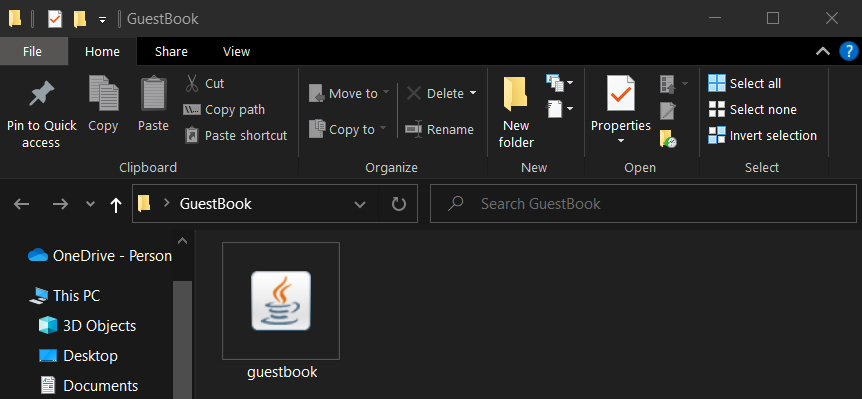

## Introduction

GuestBook is a **desktop app for managing guests in a hotel,
optimized for use via a Command Line Interface** (CLI)
while still having the benefits of a Graphical User Interface (GUI).
If you are a hotel manager who can type fast, GuestBook can get your
guest management tasks done **faster** than traditional GUI apps.

You can use GuestBook to track guests and their details including _name_, _email address_, _phone number_, 
_room number_, _dates of stay_, _number of guests_, _bill_, _request_, and whether their _room has been cleaned_. 
By allowing you to _add_, _edit_, _delete_, and _filter_ guests, GuestBook can fulfill all your hotel management needs.

This user guide provides in-depth descriptions of all the available features in GuestBook and how to use them.

--------------------------------------------------------------------------------------------------------------------

## **Table of Contents**
* Table of Contents
{:toc}

--------------------------------------------------------------------------------------------------------------------
## How to use the User Guide
* For a quick and easy way to **get started** with GuestBook, you can visit the [Quick Start](#quick-start) section.
* To **understand the terms** we use in GuestBook, you can visit the [Glossary](#glossary) section.
* To see the **amazing features** that GuestBook provides and how to use them, you can visit the [Features](#features) section.
* Having **issues**? You can check out the [FAQ](#faq) section to see find solutions to your issues.
* Have a **question** for us? Feel free to [contact us](#contact-us), and we will do our best to assist you.

[Return to Table of Contents](#table-of-contents)

--------------------------------------------------------------------------------------------------------------------

## Components of the UI

### Locations of the components

### Use of the components

| Component                              | Use                                                                  |
|----------------------------------------|----------------------------------------------------------------------|
| **Command Box**                        | This is where you **enter commands**.                                |
| **Result Display**                     | This is where the detailed **results** of the command will be shown. |
| **Guest Card**                         | This is where all **guest information** of a guest will be shown.    |
| **Status Bar**                         | This shows the location of your **save file**.                       |
|              | This is the **phone number** of the guest.                           |
|              | This is the **email address** of the guest.                          |
|                | This is the **room** the guest is staying in.                        |
|      | These are the **dates of stay** of the guest.                        |
|     | This is the total **number of guests** in the guest's room.          |
|  | This shows whether the guest's **room has been cleaned**.            |
|                | This is the current **bill** of the guest.                           |
|          | This shows any **requests** made by the guest.                       |

[Return to Table of Contents](#table-of-contents)

--------------------------------------------------------------------------------------------------------------------

## Quick start

1. Ensure you have `Java 11` or above installed in your Computer.

2. Download the latest `guestbook.jar` from [here](https://github.com/AY2223S1-CS2103T-W16-1/tp/releases).    
      

3. Copy the file to the folder you want to use as the **home folder** for your GuestBook.    
      

4. Double-click on `guestbook.jar` to start the app. The GUI, similar to the image below, should pop up in a few seconds. 
Note that the app contains **sample data**.  
      

5. Type the command in the command box and press _Enter_ to execute it. E.g., typing **`help`** and pressing _Enter_ will open the help window. 

6. To kickstart your journey, you can add a guest, `John Doe`, to GuestBook using the **`add`** command.
   * **`add`** `n/John Doe p/98765432 e/johnd@example.com rm/05-73 dr/13/09/22 - 15/09/22 ng/3 rq/Extra towels`: Adds a guest named `John Doe` to GuestBook.

7. To find `John Doe`, you can use the **`find`** command, and search through any of `John Doe`'s `fields`, such as his _name_ or _room_. The command below can help you find guests that match the keywords you entered.
   * **`find`** `John Doe` : Finds all the guests who have at least one field containing `John` or `Doe` (_case-insensitive_).

8. To make changes to `John Doe`, you can use the **`edit`** command. This changes the guest's fields based on the new values you provide. The other values will remain unchanged.  
For example, if `John Doe` is the second guest in the list, and you want to change his room number to `05-55`, you can do this.
    * **`edit`** `2` `rm/05-55`n: Changes the `Room` of `John Doe` to `05-55` in GuestBook.

9. After executing a **`find`** command, you might realise that some of your guests are no longer visible, as they are not in the current list. 
To see a list of all your guests, you can use the **`list`** command.
     * **`list`**: List all the guests in GuestBook.

10. In the event that a guest orders room service, you can add charges to the guest's bill using the **`bill`** command. 
For example, you can charge the third guest `30.35` by running the command below.
    * **`bill`** `3` `b/+30.35`: Adds `30.35` to the bill of the third guest.

11. When a guest checks out of your hotel, you can remove the guest using the **`delete`** command.
    * **`delete`** `3` : Deletes the third guest shown in the current list.

12. To clear your GuestBook of all entries, you can use the **`clear`** command. 
**WARNING:** This action is **irreversible**. Use with caution.
    * **`clear`** : Deletes all guests.

14. Finally, to quit GuestBook, you can run the **`exit`** command.
    * **`exit`** : Exits the app.

15. For more details, you can refer to the [Features](#features) below for the exact specifications of each command. Thank you and we hope you enjoy using GuestBook!

[Return to Table of Contents](#table-of-contents)

--------------------------------------------------------------------------------------------------------------------

## Glossary

| Term             | Definition                                                                                                                                          |
|------------------|-----------------------------------------------------------------------------------------------------------------------------------------------------|
| **Alphanumeric** | Refers to characters that are numbers 0-9 and alphabets A-Z, both uppercase and lowercase.                                                          |
| **dd/MM/yy**     | Refers to the date format, where dd stands for 2 digit days, 2 digit months and the last 2 digits for the year and they must be separated by a "/". |
| **CLI**          | Stands for Command Line Interface, it refers to a text-based interface used to execute opertaions of the system.                                    |
| **Guest**        | A guest staying at the hotel.                                                                                                                       |
| **GUI**          | Stands for Graphical User Interface, it refers to an interface that allows users to interact with the system through friendly visuals.              |
| **Hard disk**    | A data storage device used to store and retrieve data.                                                                                              |
| **Index**        | The number that corresponds to the position of the Guest in the list. The index **must be a positive integer** like 1, 2 or 3.                      |
| **Java**         | A programming language used to run GuestBook.                                                                                                       |
| **JSON file**    | Stands for JavaScript Object Notation. It refers to a file format to store data.                                                                    |

[Return to Table of Contents](#table-of-contents)

--------------------------------------------------------------------------------------------------------------------

## Features

**:information_source: Notes about the command format:** 

* Words in `UPPER_CASE` are the **parameters** to be supplied by you, the user. 
  E.g., In `add n/NAME`, `NAME` is a parameter which can be used as `add n/John Doe`.

* Items in square brackets are **optional**. 
  E.g., `n/NAME [rq/REQUEST]` can be used as `n/John Doe rq/Extra towels` or as `n/John Doe`.

* Parameters can be in **any order**. 
  E.g., If the command specifies `n/NAME p/PHONE`, `p/PHONE n/NAME` is also acceptable.

* If a parameter is expected only once but is specified multiple times in the command, only the **last occurrence** of the parameter will be considered. 
  E.g., If you specify `p/12341234 p/56785678`, only `p/56785678` will be taken.

* Extraneous parameters for commands that do not take in parameters (such as `help`, `list`, `exit` and `clear`) will be **ignored**. 
  E.g., If the command specifies `help 123`, it will be interpreted as `help`.

### Viewing help: `help`

This command shows a message explaining how to access the **help page**, which is this user guide you are reading.

**Format**: `help`

### Adding a guest: `add`

This command adds a guest to GuestBook.

This command is typically used to **check a guest in** to your hotel with their personal and room details.

**Format**: `add n/NAME p/PHONE e/EMAIL rm/ROOM dr/DATE_RANGE ng/NUMBER_OF_GUESTS [rq/REQUEST]`

**Constraints of parameters**:

&nbsp;&nbsp;&nbsp;Unless stated otherwise, all fields should not be left blank.
* `NAME` should only contain alphanumeric characters and spaces.
* `PHONE` should only contain numbers, and it should be at least 3 digits and at most 15 digits long.
* `EMAIL` should only contain alphanumeric characters and '@' character. The local segment (before "@") should be at most 64 characters long, and the domain segment (after "@") should be at most 255 characters long.
* `ROOM` should only contain alphanumeric characters and a hyphen. A hyphen can only be added if it is in between 2 alphanumeric characters.
* `DATE_RANGE` should follow the format dd/MM/yy - dd/MM/yy.
* `NUMBER_OF_GUESTS` should only contain numbers, and it should be at least 1 and at most 4.
* `REQUEST` is an optional field, and it should be at most 500 characters long.

**Examples**:
* `add n/John Doe p/98765432 e/johnd@example.com rm/05-73 dr/19/05/22 - 24/05/22 ng/3`
* `add n/Betsy Crowe p/82297553 e/betsycrowe@example.com rm/Aloha5 dr/10/01/12 - 11/01/12 ng/1 rq/Extra towels`

### Listing all guests: `list`

This command displays a list of all guests in GuestBook.

**Format**: `list`

### Editing a guest: `edit`

This command edits an existing guest in GuestBook.

The guest specified at the `INDEX` is the guest you wish to edit. The existing values will be **updated** to the new values
you provide. The values that you **did not specify** to edit will remain **unchanged**.

**Format**: `edit INDEX [n/NAME] [p/PHONE] [e/EMAIL] [rm/ROOM] [dr/DATE_RANGE] [ng/NUMBER_OF_GUESTS] [rc/IS_ROOM_CLEAN] [rq/REQUEST]`

**Constraints of parameters**:
* Identical to the constraints of the `add` feature from above.
* `IS_ROOM_CLEAN` should only contain `yes`, `no`, `y` or `n` (_case-insensitive_).

**Examples**:
*  `edit 1 p/91234567 e/johndoe@example.com` Edits the phone number and email address of the first guest to `91234567` and `johndoe@example.com` respectively.
*  `edit 2 n/Betsy Crower` Edits the name of the second guest to `Betsy Crower`.

### Billing a guest: `bill`

This command updates the bill of a guest in GuestBook. Note that the bill here refers to the **total additional charges incurred**
by the guest during their stay at your hotel and should not include the cost of the room booking.

This command updates the bill of the guest at the specified `INDEX`. 
Depending on the sign (`+` or `-`) of your input, the existing bill value will be **increased** 
or **decreased** respectively by the value you provide.

**Format**: `bill INDEX b/BILL`

**Constraints of parameters**:
* `BILL` should only contain numbers, and can have up to 2 decimal places.

**Examples**:
* `bill 1 b/+99.99` or `bill 1 b/99.99` Adds 99.99 to the bill of the first guest.
* `bill 2 b/-10` Subtracts 10 from the bill of the second guest.

**Common mistakes**:
* Missing out the `b/` prefix in the bill command.
* Editing the bill using the edit command instead of the bill command.

### Locating guests: `find`

This command locates guests whose details contain any of the given keywords. 
This allows you to search through all guests' fields.

This command is typically used when searching for a guest of a **specific characteristic**.
For example, the command `find no` will display all 
the rooms that have room clean statuses set to `no`.

**Format**: `find KEYWORD [MORE_KEYWORDS]`

**Constraints of parameters**:
* The search is **case-insensitive**. E.g., `hans` will match `Hans`
* The order of the keywords does not matter. E.g., `Hans Bo` will match `Bo Hans`
* **Only full words** will be matched E.g., `Han` will not match `Hans`
* Guests matching **at least one** keyword will be returned (i.e. `OR` search).
  E.g., `Hans Bo` will return `Hans Gruber`, `Bo Yang`

**Examples**:
* `find John` returns `john` and `John Doe`
* `find alex 99272758 03-68` returns `Alex Yeoh`, `Bernice Yu`, `Charlotte Oliveiro` (refer to the image below for the details of the guests) 
 

  

**Common mistakes**:
* Searching for guests using incomplete keywords e.g. `170` will **not** match `170.00`.

### Deleting a guest: `delete`

This command deletes the specified guest _(with index in different scenario)_ from GuestBook. 

This command is typically used when a guest has checked out of the hotel. Do note that the `delete` command 
is **IRREVERSIBLE**. Once deleted, the specific guest's data cannot be retrieved. Please use this 
command with caution.

**Format**: `delete INDEX`

* Deletes the guest at the specified `INDEX`.

**Examples**:
* `list` followed by `delete 2` deletes the 2nd guest in GuestBook.

* `find Betsy` followed by `delete 1` deletes the 1st guest in the results of the `find` command.

### Marking all rooms as unclean: `markRoomsUnclean`

This command functions to mark the room clean statuses of all guests as `no`.

This command is typically used at the end or the start of the day when the hotel manager wishes to 
update all the room clean statuses to `no` efficiently. This clean slate would allow the hotel 
managers to keep track of the rooms that are cleaned or uncleaned for the day.

**Format**: `markRoomsUnclean`

**Common mistakes**: 
* Missing out the `s`: `markRoomUnclean`.
* Capitalising the `m`: `MarkRoomsUnclean`.

### Clearing all entries: `clear`

This command clears **all entries** from GuestBook. 

This command is typically used as a **hard reset** of all guest data in GuestBook. Do note that this command 
is **IRREVERSIBLE**. Once cleared, all the guest data cannot be retrieved. Please use this command 
with utmost caution.

**Format**: `clear`

### Exiting the program: `exit`

This command exits the program.

**Format**: `exit`

### Saving the data

GuestBook data is saved in the hard disk **automatically** after any command that changes the data. There is no need to save manually.

### Editing the data file

GuestBook data is saved as a _JSON file_ `[JAR file location]/data/guestbook.json`. 
Advanced users may change data directly by editing this data file.

:exclamation: **Caution:**
If your changes to the data file makes its format invalid, GuestBook will discard all data and start with an empty data file at the next run.

[Return to Table of Contents](#table-of-contents)

--------------------------------------------------------------------------------------------------------------------

## FAQ

Listed here are some frequently asked questions. Should you require any other assistance, feel free to [contact us](#contact-us).

**Q**: How do I transfer my data to another Computer? 
**A**: Install the app in the other computer and **overwrite the empty data file** it creates with the file that contains the data of your previous GuestBook home folder.

**Q**: Will my data be automatically saved? 
**A**: **Yes**, GuestBook automatically saves your data after every command entered.

**Q**: Where is my data saved? 
**A**: Go to where you have downloaded your `guestbook.jar` file, there a `/data` folder will be created and the data will be saved under `guestbook.json`.

**Q**: Can I rename my saved data file? 
**A**: **No**, GuestBook currently only supports the use of `guestbook.json` as the name of the saved data file.

**Q**: Why are there no guests in my GuestBook? 
**A**: If you didn't enter the `clear` command, it is likely that your `guestbook.json` file is **corrupted**, causing GuestBook to reset it to prevent any malicious files from being used.

[Return to Table of Contents](#table-of-contents)

--------------------------------------------------------------------------------------------------------------------

## Command summary

| Action                 | Format, Examples                                                                                                                                                                               |
|------------------------|------------------------------------------------------------------------------------------------------------------------------------------------------------------------------------------------|
| **Add**                | `add n/NAME p/PHONE e/EMAIL rm/ROOM dr/DATE_RANGE ng/NUMBER_OF_GUESTS [rq/REQUEST]`   e.g., `add n/John Doe p/98765432 e/johnd@example.com rm/05-73 dr/19/05/20 - 24/05/22 ng/3`            |
| **Bill**               | `bill INDEX b/BILL`  e.g., `bill 2 b/99.99`                                                                                                                                                 |
| **Clear**              | `clear`                                                                                                                                                                                        |
| **Delete**             | `delete INDEX`  e.g., `delete 3`                                                                                                                                                            |
| **Edit**               | `edit INDEX [n/NAME] [p/PHONE] [e/EMAIL] [rm/ROOM] [dr/DATE_RANGE] [ng/NUMBER_OF_GUESTS] [rc/IS_ROOM_CLEAN] [rq/REQUEST]`  e.g.,`edit 2 e/jameslee@example.com dr/13/09/22 - 15/09/22 ng/4` |
| **Exit**               | `exit`                                                                                                                                                                                         |
| **Find**               | `find KEYWORD [MORE_KEYWORDS]`  e.g., `find James Jake`                                                                                                                                     |
| **Help**               | `help`                                                                                                                                                                                         |
| **List**               | `list`                                                                                                                                                                                         |
| **Mark Rooms Unclean** | `markRoomsUnclean`                                                                                                                                                                             |                                                                                                                                                                                      |

[Return to Table of Contents](#table-of-contents)

--------------------------------------------------------------------------------------------------------------------

## Contact Us
For enquiries or feedback, feel free to let us know at [guestbook.enquiries@gmail.com](mailto:guestbook.enquiries@gmail.com).

[Return to Table of Contents](#table-of-contents)

