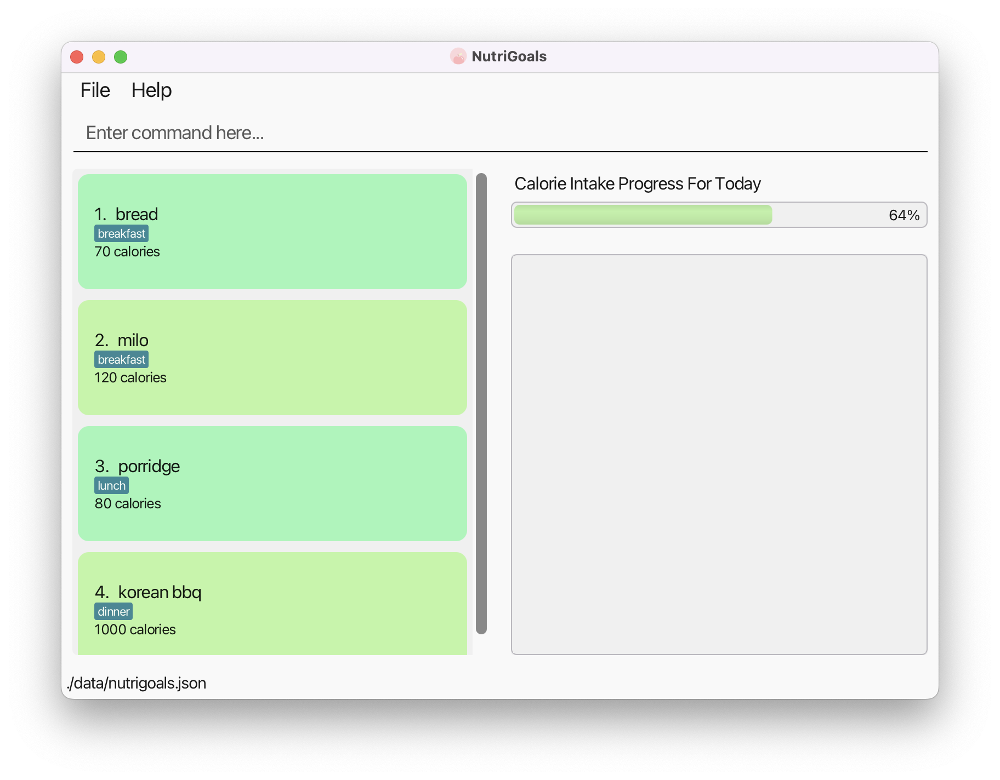
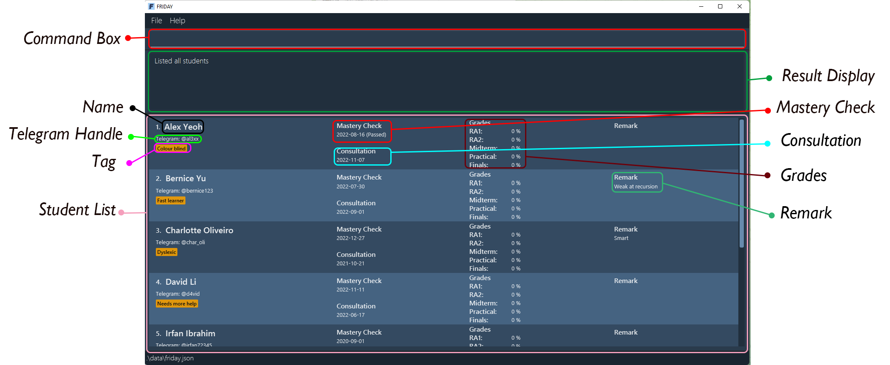

NutriGoals is a desktop app for **NUS students who wish to improve their current lifestyle and adopt a healthier one**.
With NutriGoals, you can **keep track of your diet and calorie consumption**. Studies have shown the benefits of keeping 
track of your daily food consumption – the more consistent you are, the more likely you are to achieve the various 
fitness goals that you have set for yourself! However, without the right tools, tracking what you have consumed is 
tedious and disorganised. With NutriGoals, you can keep track of your consumption quickly and easily, without 
worrying about organising your data.
* Table of Contents
{:toc}

--------------------------------------------------------------------------------------------------------------------

## About the user guide

### Navigating the user guide

* If you are a **new user**, the [Quick start](#quick-start) section provides instructions for you on how to get started.

* Once you have set up NutriGoals, you can check out the [Screen layout](#screen-layout) section to get familiar with the different components of NutriGoals. 
To learn the basics of using NutriGoals, head over to the [Features](#features) section.

* If you are an **experienced user**, you can refer to the [Command summary](#command-summary) section for an overview of NutriGoals' commands.

* If you have any queries about using NutriGoals, you can check out the [FAQ](#faq) section. 

### Reading the user guide

#### Icons

This section will run you through the icons used in this guide.

| Icon                 | Meaning                                                          |
|----------------------|------------------------------------------------------------------|
| :information_source: | Extra information that you may find useful.                      |
| :exclamation:        | Information you should be aware of to avoid running into errors. |
| :fast_forward:       | Information about future updates to a feature.                   |

#### Input parameters

This section provides a summary of the parameters used when inputting commands into the application.

| Prefix | Parameter      | Meaning                                             | Input                                                                        |
|--------|----------------|-----------------------------------------------------|------------------------------------------------------------------------------|
| `n/`   | `FOOD_NAME`    | Name of the food item                               | Alphanumeric value with 1 to 27 characters (inclusive)                       |
| `c/`   | `CALORIE`      | Number of calories                                  | Integer from 0 to 2147483647 (inclusive)                                     |
| `t/`   | `MEAL_TYPE`    | Meal that the food item belongs to                  | `breakfast`, `lunch` or `dinner` (not case sensitive)                        |
| `g/`   | `GENDER`       | Your gender                                         | `M` or `F` (not case sensitive)                                              |
| `w/`   | `WEIGHT`       | Your weight in kg                                   | Integer from 10 to 199 (inclusive)                                           |
| `h/`   | `HEIGHT`       | Your height in cm                                   | Integer from 100 to 219 (inclusive)                                          |
| `i/`   | `IDEAL_WEIGHT` | Your ideal weight in kg                             | Integer from 10 to 199 (inclusive)                                           |
| `a/`   | `AGE`          | Your age in years                                   | Integer from 1 to 99 (inclusive)                                             |
|        | `INDEX`        | Index of the food item in the list displayed        | Integer from 1 to the number of food items in the list displayed (inclusive) |
|        | `DATE`         | Date that the food items were added into NutriGoals | Valid date and in the format `yyyy-MM-dd`                                    |
|        | `LOCATION`     | Location in NUS                                     | `COM2`, `S13`, `S17`, `CLB`, `UHC`, `LT1`, `LT9`, `AS6` (not case sensitive) |

## Quick start

1. Ensure you have Java `11` or above installed in your Computer.

:information_source: **How to check if you have Java 11 installed:** 

* In your search bar, search for 'command prompt' and run it.
* In the command prompt, type 'java -version' (without the quotation marks).
* If installed, the version number will be displayed.
* If not installed, or if the version number is wrong, you can download the correct version from [here](https://www.oracle.com/sg/java/technologies/downloads/#java11-windows).

2. Download the latest `nutrigoals.jar` from [here](https://github.com/AY2223S1-CS2103T-T17-2/tp/releases).

3. Copy the file to the folder you want to use as the _home folder_ for NutriGoals.

4. Double-click the file to start the app. A screen similar to the one below should appear in a few seconds. 
Note how the app contains some sample data.

5. Type the command in the command box and press **Enter** to execute it. For example, typing `help` and pressing **Enter** will open 
the help window.

6. Refer to the [Features](#features) below for detailed descriptions of each command.

:information_source: **Note:** 

* For new users, the app will contain sample data for these 3 days: 15 September 2022, 23 October 2022 and the current day. 
* For example, you can try entering `list 2022-09-15` to view the sample food items on 15 September 2022. 
* To delete food items from all days, enter `clear`.

:exclamation: **Warning:** 

Upon launching the application, some files responsible for the storage of your data will be created in the same folder 
as `nutrigoals.jar`. If you are a new user, you are advised not to edit these files. If the changes you made to the data
file invalidates its format, NutriGoals will discard all your data and start with an empty data file.

--------------------------------------------------------------------------------------------------------------------

## Screen layout

:information_source: **About Food List:** 

* Food items displayed in Food List are sorted according to meal type, in the order: breakfast, lunch, dinner.
* Upon launching the application, Food List will display food items recorded on the current day.

:information_source: **About Progress Bar:** 

* Progress Bar changes based on the total calorie intake for the current day as compared to the target calorie intake.
* To check the total calorie intake for the current day and the target calorie intake, refer to the `review` command [here](#viewing-a-summary-of-the-calorie-intake-progress-review).
* The Progress Bar percentage can go beyond 100%, but note that if the target calorie intake is set to 0, the 
percentage will be fixed at 100%.
* To set the target calorie intake, refer to the `target` command [here](#setting-a-target-calorie-intake-target).

--------------------------------------------------------------------------------------------------------------------

## Features

**:information_source: Notes about the command format:** 

* Texts in `UPPER_CASE` in this guide should be replaced with user inputs.
  * E.g. for the function `add n/FOOD_NAME c/CALORIE t/MEAL_TYPE`, you may input `add n/sushi c/300 t/dinner`, where the
  parameters `FOOD_NAME`, `CALORIE` and `MEAL_TYPE` replaced by`sushi`,  `300` and `dinner` respectively.
* Parameters in square brackets are optional.
* The parameters can be in any order.
  * E.g. `add n/bubble tea c/200 t/dinner` is the same as `add c/200 n/bubble tea t/dinner`.
* Integer values are values between 1 and 2147483647 (inclusive).
* Commands that require an `INDEX` will only accept positive integer values as the `INDEX`.
  * E.g. `edit 2147483648` is an invalid command regardless of the inputs provided.
* Extraneous parameters for commands that do not take in parameters (such as `help`, `exit` and `clear`) will be ignored.
  * E.g. `help 123` will be interpreted as `help`.

### Viewing help : `help`

Shows a message explaining how to access the help page and information on the usage of commands.

Format: `help`

### Adding the calorie content of a food item : `add`

Adds a food item with its calorie content.

Format: `add n/FOOD_NAME c/CALORIE t/MEAL_TYPE`

* Adds a food item into the food list for the current day, together with its calorie content and meal type.
* Each field can only be specified once.
* `MEAL_TYPE` can only take on one of three values: breakfast, lunch or dinner.
* `CALORIE` can only take in a non-negative integer that is less than 2147483648
* `FOOD_NAME` should only contain alphanumeric characters and spaces, and should not be blank. Names should also not 
exceed 27 characters.

Example:

* `add n/bread c/100 t/breakfast` adds bread into the food list, and tags it as a breakfast item with 100 calories.
* `add n/bubble tea c/300 t/lunch` adds bubble tea into the food list, and tags it as a lunch item with 300 calories.
* `add n/hotpot c/500 t/dinner` adds hotpot into the food list, and tags it as a dinner item with 500 calories.

**:information_source: About the parameters:** 

`MEAL_TYPE` is **not** case-sensitive.

* E.g. `add n/hotpot c/500 t/dinner` is the same as `add n/hotpot c/500 t/dInNeR`.

**:information_source: Adding food items:** 

A food item will **not** be added into the food list if the resulting total calorie intake for the day exceeds 2147483647 calories.

### Deleting a food item : `delete`

Removes a food item from the displayed list of foods.

Format: `delete INDEX`

* Deletes a food item at the specified index.
* The index refers to the index shown in the displayed food lists.
* The index **must be a positive** integer.

Example:

* `delete 1` deletes the first item in the food list.
* `list 2022-10-23` followed by `delete 1` deletes the first food item recorded on 23 October 2022. Refer to the `list` command [here](#listing-all-foods-for-a-day-list) for more information.

### Editing a food item : `edit`

Edits a food item from the displayed list of foods.

Format: `edit INDEX [n/FOOD_NAME] [c/CALORIES] [t/MEAL_TYPE]`

* Edits a food item in the list displayed at the specified index.
* The index refers to the index shown in the displayed food lists.
* The index **must be a positive** integer.
* At least one of the optional fields must be provided.
* `MEAL_TYPE` can only take on three values: breakfast, lunch or dinner.
* `CALORIE` can only take in a non-negative integer that is less than 2147483648
* `FOOD_NAME` should only contain alphanumeric characters and spaces, and should not be blank. Names should also not
  exceed 27 characters.

Example:

* `edit 2 n/rice c/300 t/dinner` edits the 2nd food item for dinner to rice with 300 calories.
* `edit 2 n/noodles` edits the name of 2nd food item to noodles.
* `edit 2 c/100 n/bread` edits the name and calorie content of the first item to bread and 100 respectively.
* `list 2022-10-10` followed by `edit 1 n/sushi` edits the name of the first food item recorded on 2022-10-10 to sushi. Refer to the `list` command [here](#listing-all-foods-for-a-day-list) for more information.

**:information_source: About the parameters:** 

`MEAL_TYPE` is **not** case-sensitive.

* E.g. `edit 2 t/dinner` is the same as `edit 2 t/dInNeR`.

**:information_source: About editing food items:** 

A food item will **not** be edited if the resulting total calorie intake for the day exceeds 2147483647 calories.

### Listing all foods for a day: `list`

Shows a list of all food items and their calories for the specified day (if any).

Format: `list [DATE]`

* Shows the food list for the current day if no `DATE` is supplied.
* `DATE` must be in the format `yyyy-MM-dd` if supplied.

Example:

* `list` shows a list of all food items and their calories for the current day.
* `list 2022-10-23` shows a list of all food items and their calories recorded on 23 October 2022.

**:information_source: Note:** 

`DATE` **must be a valid date** for the command to be executed. Note that the year `0000` is considered invalid.

* E.g. `list 2022-02-31` is an invalid command.
* E.g. `list 0000-01-01` is an invalid command. 

### Finding the calorie content of a food item: `find`

Finds the calorie content of a commonly-found food item.

Format: `find FOOD_NAME`

* By default, only the calorie contents of certain food items are included. Refer to the list of food items in the [FAQ](#faq).
* If the user has entered a specific food item before, the `find` command will return the average caloric content of 
that food item. _(This includes entries on previous days, **on top of** the current day's entries.)_

Example:

* `find chicken rice` finds and displays the calorie content of chicken rice.

:information_source: **Note:** 

`FOOD_NAME` is **not** case-sensitive.

* E.g. `find rice` is the same as `find rIcE`.

### Setting a target calorie intake: `target`

Sets a target calorie intake for the current day.

Format: `target CALORIE`

* `CALORIE` can only take on integer values in between 0 and 2147483647 inclusively.
* The initial target calorie intake is set at 2000 calories.

Example:

* `target 2500` sets a target calorie intake of 2500 calories for the current day and displays the list of foods for the current day.

### Viewing a summary of the calorie intake progress: `review`

Shows the total calories consumed, the calorie target and the deficient/excess amount of calories for the current day. The list of foods for the current day will also be displayed.

Format: `review`

Example after entering `review`:

### Setting up a user profile: `setup`

Sets up a user profile.

Format: `setup g/GENDER w/WEIGHT h/HEIGHT i/IDEAL_WEIGHT a/AGE`

* Sets up the user profile using the information provided by the user.
* `GENDER` can only take 2 values: M or F (case-insensitive).
* `WEIGHT` and `IDEAL_WEIGHT` can only take on integer values between 10 and 199 (in kg).
* `HEIGHT` can only take on integer values between 100 and 219 (in cm).
* `AGE` can only take on integer values between 1 and 99 (in years).

Example:

* `setup g/f w/50 h/165 i/48 a/20` sets up a user profile for a 20-year-old female who is 50kg and 165cm, 
who has an ideal weight of 48kg.
* `setup g/m w/70 h/175 i/70 a/20` sets up a user profile for a 20-year-old male who is 70kg and 175cm,
who has an ideal weight of 70kg.

### Viewing the user's profile: `profile`

Displays the user's information stored after [setup](#setting-up-a-user-profile-setup).

Format: `profile`

Example after entering `profile`:

* The user's details are listed on the right.

:exclamation: **Warning:** 

This feature is only available provided you have [setup](#setting-up-a-user-profile-setup) a profile beforehand.

### Suggesting a daily calorie intake: `suggest`

Suggests an estimated daily calorie intake to allow the user to attain his/her ideal weight.

Format: `suggest`

Example after entering `suggest`:

* `setup g/m w/82 h/178 i/75 a/22` followed by `suggest` results in the screen below, with the suggested amount of calories.

:exclamation: **Warning:** 

This feature is only available provided you have [setup](#setting-up-a-user-profile-setup) a profile beforehand.

### Locating the nearest gym in NUS: `locate`

Locates and ranks the nearest gyms to user's location in NUS.

Format: `locate LOCATION`

Parameters: COM2, S13, S17, CLB, UHC, LT1, LT9, AS6

Example:

* `locate S17` returns a list of gyms sorted from nearest to furthest from S17.

:fast_forward: **Future update:** 
More locations in NUS will be added.

### Suggesting a healthy-lifestyle tip: `tip`

Suggests a random tip to help the user adopt a healthier lifestyle.

Format: `tip`

### Clearing all food items: `clear`

Clears all food items on all days from NutriGoals.

Format: `clear`

### Exiting the program: `exit`

Exits the program.

Format: `exit`

--------------------------------------------------------------------------------------------------------------------

## FAQ

**Q**: I do not have Java `11` installed in my Computer. How do I install it? 
**A**: To download Java `11`, visit this [website](https://www.oracle.com/java/technologies/downloads/#java11) and download the 
appropriate file for your computer's system (such as macOS and Windows).

**Q**: How do I save my data in NutriGoals? 
**A**: NutriGoals saves data automatically after every command that changes the data. There is no need to save manually.

**Q**: Where is my NutriGoals data stored? 
**A**: When you use the application, a folder named `Data` will be created in the same folder as `nutrigoals.jar`. Your 
data is stored in the file named `nutrigoals.json`, which is located in the `Data` folder.

**Q**: How do I transfer my data to another Computer? 
**A**: Install the app in the other computer and replace the empty data file created with your original NutriGoals data file from its home folder.

**Q**: Does NutriGoals need an internet connection to work? 
**A**: No, NutriGoals can still work normally without an internet connection.

**Q**: What are the default food items for the [find](#finding-the-calorie-content-of-a-food-item-find) feature? 
**A**: The food items are: 
* ban mian
* bubble tea
* chicken rice
* fried rice
* laksa
* nasi lemak
* potato chips
* rice
* wanton noodles
* white bread

:fast_forward: **Future update:** 
More default food items will be added.

--------------------------------------------------------------------------------------------------------------------

## Command summary

| Action      | Format                                                  | Example                          |
|-------------|---------------------------------------------------------|----------------------------------|
| **Help**    | `help`                                                  | `help`                           |
| **Add**     | `add n/FOOD_NAME c/CALORIE t/MEAL_TYPE`                 | `add n/donut c/1000 t/breakfast` |
| **Delete**  | `delete INDEX`                                          | `delete 1`                       |
| **Edit**    | `edit INDEX [n/FOOD_NAME] [c/CALORIES] [t/MEAL_TYPE]`   | `edit 2 n/rice c/300 t/dinner`   |
| **Find**    | `find FOOD_NAME`                                        | `find chicken rice`              |
| **Target**  | `target`                                                | `target 2000`                    |
| **Review**  | `review`                                                | `review`                         |
| **List**    | `list [DATE]`                                           | `list`                           |
| **Setup**   | `setup g/GENDER w/WEIGHT h/HEIGHT i/IDEAL_WEIGHT a/AGE` | `setup g/m w/70 h/175 i/70 a/20` |
| **Locate**  | `locate LOCATION`                                       | `locate CLB`                     |
| **Profile** | `profile`                                               | `profile`                        |
| **Suggest** | `suggest`                                               | `suggest`                        |
| **Tip**     | `tip`                                                   | `tip`                            |
| **Clear**   | `clear`                                                 | `clear`                          |
| **Exit**    | `exit`                                                  | `exit`                           |

--------------------------------------------------------------------------------------------------------------------

## Glossary

| Term                                       | Definition                                                                                                                                                                                                                    |
|--------------------------------------------|-------------------------------------------------------------------------------------------------------------------------------------------------------------------------------------------------------------------------------|
| **Calories**                               | Unit of measurement for the amount of energy contained in a food item.                                                                                                                                                        |
| **Daily Recommended   Calorie Intake** | The amount of calories recommended by experts for an individual to consume daily   (According to Health Promotion Board Singapore, adult males should consume 2200 calories, adult females should consume 1800 calories). |
| **Deficit**                                | The negative difference between the calories consumed in a day and the recommended daily intake. These calories are _not_ consumed to facilitate weight loss and fat burn.                                                    |
| **Surplus**                                | The positive difference between the calories consumed in a day and the recommended daily intake. These calories are consumed to facilitate weight gain and muscle growth.                                                     |

