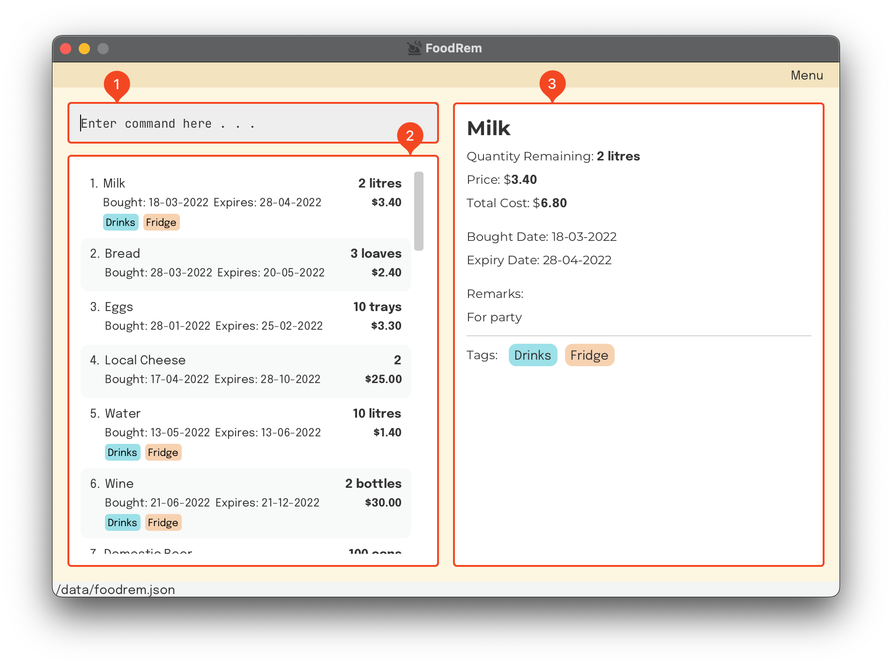

## About OmniHealth

OmniHealth is a **Patient Management System** tailored to private clinicians to manage patients' details, records and upcoming appointments.
As a private clinician, you can manage and monitor your patient database all in one location. 
Utilise OmniHealth's **sorting and filtering system** to help you easily manage and find your patients' details and records of past visits.
Also, OmniHealth's **appointment tracker** allows you to tag upcoming appointments for each patient.

Get rid of your cabinets of patient files today, and leverage upon OmniHealth's **Patient Management System** 
to help you organise your patient database more efficiently! Just a few strokes on your keyboard,
you'll be able to interact with OmniHealth and enter a world of effective patient management! 💊✨

This User Guide aims to help your business integrate smoothly with OmniHealth, guiding you along with in-depth documentation.
It shows you how to start using OmniHealth, essential OmniHealth features, Frequently Asked Questions (FAQ) and a neat command summary
for easy reference. So, let's [get started](#installation)!

## Table of Contents

- [Installation](#installation)
- [How to Use OmniHealth](#how-to-use-omnihealth)
  - [Layout](#layout)
  - [Navigation](#navigation)
    - [Patient/Record List](#patient-list)
    - [Filtered/Unfiltered List](#filteredunfiltered-list)
  - [Command Format](#command-format)
  - [Key Definitions](#key-definitions)
    - [Patient](#patient)
    - [Record](#record)
- [Features](#features)
  - [Patient Commands](#patient-commands)
    - [Listing all patients](#listing-all-patients-list): `list`
    - [Adding a patient](#adding-a-patient-add): `add`
    - [Deleting a patient](#deleting-a-patient-delete): `delete`
    - [Editing a patient](#editing-a-patient-edit): `edit`
    - [Finding patients by name](#finding-patients-by-name-find): `find`
    - [Clearing all patient entries](#clearing-all-patient-entries--clear): `clear`
  - [Appointment Commands](#appointment-commands)
    - [Adding an appointment](#adding-an-appointment--appt): `appt`
    - [Clearing an appointment](#clearing-an-appointment-apptcl): `apptcl`
  - [Record Commands](#record-commands)
    - [Listing all records of a patient](#listing-all-records-of-a-patient-rlist): `rlist`
    - [Adding a record](#adding-a-record-radd): `radd`
    - [Deleting a record](#deleting-a-record-rdelete): `rdelete`
    - [Editing a record](#editing-a-record-redit): `redit`
    - [Finding records by keyword](#finding-records-by-keyword-rfind): `rfind`
    - [Clearing all patient records](#clearing-all-patient-records--rclear): `rclear`
  - [General Commands](#general-commands)
    - [Viewing help](#viewing-help-help): `help`
    - [Displaying the full list](#displaying-the-full-list-showall): `showall`
    - [Exiting the program](#exiting-the-program-exit): `exit`
- [FAQ](#faq)
- [Command Summary](#command-summary)

--------------------------------------------------------------------------------------------------------------------
## Installation

1. Ensure you have Java `11` or above installed in your Computer.

2. Download the latest `OmniHealth.jar` from [our GitHub page](https://github.com/AY2223S1-CS2103T-T14-3/tp/releases).

3. Copy the file to an empty folder you want to use as the _home folder_ for OmniHealth.

4. Double-click the file to start the app.

5. Congratulations, you now have OmniHealth installed!

6. Head over to the next section to learn [how to use OmniHealth](#how-to-use-omnihealth).

--------------------------------------------------------------------------------------------------------------------
## How to Use OmniHealth
This section covers all you need to know to start using OmniHealth. 
We will go through the essentials to better understand OmniHealth's [layout](#layout), [navigation](#navigation) and [command format](#command-format).

### Layout
When you launch OmniHealth, you will see OmniHealth's Graphical User Interface (GUI) on your screen. 
Don't be overwhelmed, here's a rundown of the different sections of OmniHealth:

**OmniHealth's GUI:**

{: .shadow}

### Navigation
Managing your patient database is made easy with OmniHealth and navigating it is easier!
This section covers the 2 viewing modes: **Patient list view** and **record list view** as well as how to **exit a search**.

#### Patient/Record List
Navigating in between patients and their records is done easily with 2 commands:
[`rlist`](#listing-all-records-of-a-patient-rlist) and [`list`](#listing-all-patients-list)

**Patient List View (Default):**

{: .shadow}

Navigating into each patient's records is done through the [`rlist`](#listing-all-records-of-a-patient-rlist) command.

Example: `rlist 1` will enter the **record list view** of `Alex Yeoh`

**Record List View:**

{: .shadow}

To return to the patient list view, simply type [`list`](#listing-all-patients-list).

#### Filtered/Unfiltered List
OmniHealth's sorting and filtering system allows you to search for specific patients and records in each respective list views.
Navigating in between the filtered and unfiltered view is done easily with 1 command: [`showall`](#displaying-the-full-list-showall)

**:information_source: [`showall`](#displaying-the-full-list-showall) command is applicable to both patient list view and record list view** 

**:information_source: More information:** 
* To find patients by name: [`find`](#finding-patients-by-name-find)
* To find records by keyword: [`keyword`](#finding-records-by-keyword-rfind)

### Command Format
Before we introduce more of OmniHealth's commands throughout this User Guide, let's first
go through the general command format.

Here is an example command [`radd`](#adding-a-record-radd):

{: .shadow}

1. **Command Word**: Determines what action you want OmniHealth to execute.
2. **User Input Fields**: Parameters which you input **valid data** with.
3. **Flags**: Allows OmniHealth to know which user field you wish to input.

Here are some general guidelines for you to better understand the command format for all our [features](#features).

| User Input Rules    | Description                                                                                   | Example                                                                     |
|---------------------|-----------------------------------------------------------------------------------------------|-----------------------------------------------------------------------------|
| `UPPER_CASE`        | Input fields to be supplied by you.                                                           | `n/NAME` requires an input.                                                 |
| `[SQUARE_BRACKETS]` | Optional input fields that can be omitted.                                                    | `[t/TAG]` can be left blank.                                                |
| `...`               | Input fields that can be used multiple times including zero times.                            | `[t/TAG]...` can be `t/GlutenAllergy`, `t/DustAllergy t/PollenAllergy` etc. |
| Any Order           | Input fields can be in any order.                                                             | `n/NAME p/PHONE_NUMBER` and `p/PHONE_NUMBER n/NAME` are acceptable.         |
| Last Input          | If an input field is only expected once, only the last of multiple inputs will be considered. | `p/12341234 p/56785678` will be interpreted as `p/56785678`.                |                  
| Extraneous Fields   | For commands that do not take in input fields, unnecessary input will be ignored.             | `help 123` will be interpreted as `help`.                                   |

### Key Definitions
#### Patient
| Input Fields | Flag | Description |
|--------------|------|-------------|

#### Record
| Input Fields | Flag | Description |
|--------------|------|-------------|

## Features
### General Commands
#### Viewing help: `help`

Shows a message explaining how to access the help page.

Format: `help`

#### Displaying the full list: `showall`

Clears search parameters of a find or rfind command to undo the search.

* If the patient list is displayed, the unfiltered patient list will be shown instead.
* If the record list is displayed, the unfiltered record list will be shown instead.

Format: `showall`

#### Exiting the program: `exit`

Exits the program.

Format: `exit`

### Patient Commands
> Commands relating to the patient list, such as adding and deleting patients
#### Listing all patients: `list`

Returns to the patient list from the record list screen.

* The record list screen must be shown for this command to be valid.

Format: `list`

#### Adding a patient: `add`

Adds a patient to the patient record database.

Format: `add n/NAME b/BIRTHDATE p/PHONE_NUMBER e/EMAIL a/ADDRESS [t/TAG]…​`

* The command can only be called when the patient addressbook is displayed (after using `list`).
* Patient's name entered in is case-insensitive.
* Name should only contain alphanumeric characters (eg. s/o is not a valid input).
* Birthdate **cannot be after the current date**.
* Duplicate patients are not allowed.
    * Patients are considered duplicate when they have the same `NAME` and `ADDRESS`.

:information_source: **Note:**
Birthdate must be given in DD-MM-YYYY format!

:bulb: **Tip:**
A patient can have any number of tags (including 0)

Examples:
* `add n/John Doe b/08-08-1988 p/98765432 e/johnd@example.com a/John street, block 123, #01-01`
* `add n/Betsy Crowe b/16-06-1996 e/betsycrowe@example.com a/Ang Mo Kio Ave 5, block 13, #02-033 p/1234567 t/PollenAllergy`

#### Deleting a patient: `delete`

Deletes the specified patient from the patient database.

Format: `delete INDEX`

* The command can only be called when the patient addressbook is displayed (after using `list`).
* Deletes the patient at the specified `INDEX`.
* The index refers to the index number shown in the displayed patient records list.
* The index must be a positive integer 1, 2, 3, …​

Examples:
* `list` followed by `delete 2` deletes the 2nd patient in the address book.
* `find Betsy` followed by `delete 1` deletes the 1st patient in the results of the find command.

#### Editing a patient: `edit`

Edits an existing patient in the address book.

Format: `edit INDEX [n/NAME] [b/BIRTHDATE] [p/PHONE] [e/EMAIL] [a/ADDRESS] [t/TAG]…​`

* The command can only be called when the patient addressbook is displayed (after using `list`).
* Edits the person at the specified `INDEX`. The index refers to the index number shown in the displayed person list. The index **must be a positive integer** 1, 2, 3, …​
* At least one of the optional fields must be provided
    * if the same field is specified more than once, only the latest instance of the field is used.
    * eg. edit 1 n/Johnny n/Becky -> Person's name is edited to Becky.
* Existing values will be overridden by the input values.
  * eg. when editing tags, the existing tags of the patient will be removed i.e adding of tags is not cumulative.

:bulb: **Tip:**
You can remove all the patient’s tags by typing `t/` without
  specifying any tags after it.

Examples:
*  `edit 1 p/91234567 e/johndoe@example.com` Edits the phone number and email address of the 1st patient to be `91234567` and `johndoe@example.com` respectively.
*  `edit 2 n/Betsy Crower t/` Edits the name of the 2nd patient to be `Betsy Crower` and clears all existing tags.

#### Finding patients by name: `find`

Finds patients whose names contain any of the given keywords.

Format: `find KEYWORD [MORE_KEYWORDS]`

* The command can only be called when the patient addressbook is displayed (after using `list`).
* The search is case-insensitive. e.g `hans` will match `Hans`
* The order of the keywords does not matter. e.g. `Hans Bo` will match `Bo Hans`
* Only the name is searched.
* Only full words will be matched e.g. `Han` will not match `Hans`
* Persons matching at least one keyword will be returned (i.e. `OR` search).
  e.g. `Hans Bo` will return `Hans Gruber`, `Bo Yang`

Examples:
* `find John` returns `john` and `John Doe`
* `find alex david` returns `Alex Yeoh`, `David Li` 

#### Clearing all patient entries: `clear`

Clears all patients from Omnihealth.

* The command can only be called when the patient addressbook is displayed (after using `list`).

Format: `clear`

### Appointment Commands
> Commands for adding and clearing appointments
#### Adding an appointment: `appt`

Adds an appointment for a specified patient. This command is only valid in the patient list view.

Format: `appt INDEX d/APPOINTMENT_DATE_TIME`

* The command can only be called when the patient addressbook is displayed (after using `list`).
* Adds a new appointment for the patient under the specified `INDEX`, with the given date.
* The index refers to the index number shown in the displayed patient list.
* The index **must be a positive integer** 1, 2, 3, …​
* The appointment date **cannot be before the current date**.
* If a pre-existing appointment is present, it will be overridden by the new appointment.
* Appointments that have passed will not be removed automatically, and require either a new appointment to override 
or the `apptcl` command in the next section below to be used. Further development of the appointment feature will be released in 
future iterations!

:information_source: **Note:**
Appointment date & time must be given in DD-MM-YYYY HHmm format!

Examples:
* `appt 1 d/11-09-2024 1200` adds an appointment for the patient with index 1, with a date and time of 11/09/2024, 1200.
* `appt 2 d/15-11-2025 1400` adds an appointment for the patient with index 2, with a date and time of 15/11/2024, 1400.

#### Clearing an appointment: `apptcl`

Clears the appointment for a specified patient. This command is only valid in the patient list view.

Format: `apptcl INDEX`

* The command can only be called when the patient list is displayed (after using `list`).
* Clears any appointment under the patient with the specified `INDEX`.
* The index refers to the index number shown in the displayed patient list.
* The index **must be a positive integer** 1, 2, 3, …​
* The command will return the patient list to its original state, before any filters were applied to the list.

Examples:
* `apptcl 1` clears the appointment (if any) of the patient with index 1.

### Record Commands
> Commands relating to the record list of a patient, such as adding or deleting a record
#### Adding a record: `radd`

Adds a new record to a given patient.

Format: `radd d/RECORD_DATE_TIME r/RECORD_DETAILS [m/MEDICATION]…` 

* The command can only be called when a patient's record list is displayed (after using `rlist PATIENT_INDEX`).
* Adds a new record to the patient with given `RECORD_DATE_TIME`, `RECORD_DETAILS` and `MEDICATION` information.
  * `RECORD_DETAILS` field cannot be empty.
* The record date & time **cannot be in the future**.
  

:information_source: **Note:**
Date & time must be given in DD-MM-YYYY HHmm format!

Examples:
* `radd d/11-09-2001 1200 r/Patient tested negative for COVID-19 m/Paracetamol 500mg m/Dextromethorphan`
* `radd d/28-02-2020 2030 r/Patient experienced vomiting`

#### Deleting a record: `rdelete`

Deletes the specified record from the currently viewed patient’s records.

Format: `rdelete RECORD_INDEX`

* The command can only be called when a patient's record list is displayed (after using `rlist PATIENT_INDEX`).
* Deletes the record of the currently viewed patient at the specified `RECORD_INDEX`.
* The record index must be a positive integer 1, 2, 3, …​

Examples:
* `rlist 1` then `rdelete 2` deletes the 2nd record from the 1st patient’s listed records.

#### Listing all records of a patient: `rlist`

Shows a list of all records for the specified patient.

Format: `rlist PATIENT_INDEX`

* The command can only be called when the patient list is displayed (after using `list`).
* Lists all records of the patient at the specified `PATIENT_INDEX`.
* The index refers to the index number shown in the displayed patient list.
* The index **must be a positive integer** 1, 2, 3, …​

Examples:
* `rlist 1` displays all records of the 1st patient in the displayed patient list.
* `find Betsy` followed by `rlist 1` displays all records of the 1st patient in the results of the find command.

#### Editing a record: `redit`

Edits an existing record in the record list.

Format: `redit INDEX [d/RECORD_DATE_TIME] [r/RECORD_DETAILS] [m/MEDICATION]…​`

* The command can only be called when a patient's record list is displayed (after using `rlist PATIENT_INDEX`).
* Edits the record at the specified `INDEX`. The index refers to the index number shown in the displayed record list. The index **must be a positive integer** 1, 2, 3, …​
* At least one of the optional fields must be provided.
  * if the same field is specified more than once, only the latest instance of the field is used.
  * eg. redit 1 r/Cold r/Flu -> Record's data is edited to Flu.
* Existing values will be updated to the input values.
* When editing medication, the existing medication in the record will be removed i.e adding of tags is not cumulative.
* You can remove all the specific record’s medications by typing `t/` without
  specifying any tags after it.

:bulb: **Tip:**
Record date must be given in DD-MM-YYYY HHmm format!

Examples:
*  `redit 1 d/12-12-2012 1200` Edits the date of the 1st record to be `12-12-2012 1200`.
*  `redit 2 r/Fever m/` Edits the data of the 2nd record to be `Fever` and clears all existing medication.

#### Finding records by keyword: `rfind`

> Finds all records that match the search constraint provided

Format: `rfind [d/DATE] [r/DATA] [m/MEDICATION]`

* The command can only be called when a patient's record list is displayed (after using `rlist PATIENT_INDEX`).
* The search is case-insensitive. e.g `h1n1` will match `H1N1`
* The order of the keywords does not matter. e.g. `r/Has SARS` will match `SARS Has` stored in record data
* Only full words will be matched e.g. `Covid` will not match `Covid-19`.
* The order that the fields are specified does not matter. eg. `r/SARS m/Panadol` is equivalent to `m/Panadol r/SARS`
* PREFIXES specify the field of a record that the keywords will be matched to.
  * If the specified field of a record contains at least one matching keyword, the record is returned.
  * e.g. `m/Paracetamol Benzonatate` will return records with medications of `Benzonatate Benzonatate`, `Paracetamol Paracetamol`.
* Specifying more PREFIXES increases the constraint of the search.
  * If all fields of a record that is specified by the PREFIX contains at least one matching keyword each, the record is returned.
  * e.g. `r/Covid-19 m/cold` will only return records that contains both `Covid-19` in record data and `cold` in record medication.

Examples:
* `rfind r/Covid-19` returns a record with `Covid-19` and `Contracted covid-19` stored in its record data field.
* `rfind r/cold d/10-2022` returns a record that matches both `cold` in the record data field, and has a date within Oct 2022.

#### Clearing all patient records : `rclear`

Clears all records of a specific patient from Omnihealth.

* The command can only be called when a patient's record list is displayed (after using `rlist PATIENT_INDEX`).

Format: `rclear`

### Saving & Loading

#### Saving the data

Patient's data are saved in the hard disk automatically after any command that changes the data. There is no need to save manually.

#### Editing the data file

OmniHealth's data are saved as a JSON file `[JAR file location]/data/patientlist.json`. Advanced users are welcome to update data directly by editing that data file.

:exclamation: **Caution:**
If your changes to the data file makes its format invalid, OmniHealth will discard all data and start with an empty data file at the next run.

#### Archiving data files `[coming in v2.0]`

_Details coming soon ..._

--------------------------------------------------------------------------------------------------------------------

## FAQ

**Q**: How do I transfer my data to another Computer? 
**A**: Install the app in the other computer and overwrite the empty data file it creates with the file that contains the data of your previous OmniHealth home folder.

--------------------------------------------------------------------------------------------------------------------

## Command summary

| Action                   | Format, Examples                                                                                                                                                                        |
|--------------------------|-----------------------------------------------------------------------------------------------------------------------------------------------------------------------------------------|
| **Help**                 | `help`                                                                                                                                                                                  |
| **Show Unfiltered List** | `showall`                                                                                                                                                                               |
| **Exit Program**         | `exit`                                                                                                                                                                                  |
| **Add Patient**          | `add n/NAME b/BIRTHDATE p/PHONE_NUMBER e/EMAIL a/ADDRESS [t/TAG]…​`   e.g., `add n/James Ho b/12-12-2000 p/22224444 e/jamesho@example.com a/123, Clementi Rd, 1234665 t/DustAllergy` |
| **Delete Patient**       | `delete INDEX`  e.g., `delete 3`                                                                                                                                                     |
| **List Patients**        | `list`                                                                                                                                                                                  |
| **Edit Patient**         | `edit INDEX [n/NAME] [b/BIRTHDATE] [p/PHONE_NUMBER] [e/EMAIL] [a/ADDRESS] [t/TAG]…​`  e.g.,`edit 2 n/James Lee e/jameslee@example.com`                                               |
| **Find Patients**        | `find KEYWORD [MORE_KEYWORDS]`  e.g., `find James Jake`                                                                                                                              |
| **Clear Patients**       | `clear`                                                                                                                                                                                 |
| **Add Appointment**      | `appt INDEX d/APPOINTMENT_DATE_TIME`   e.g., `appt 1 d/01-01-2023 1230`                                                                                                              |
| **Clear Appointment**    | `apptcl INDEX`                                                                                                                                                                          |
| **Add Record**           | `radd d/RECORD_DATE_TIME r/RECORD_DETAILS [m/MEDICATION]`   e.g., `e.g., radd 1 d/2022-09-11 r/Patient tested negative for COVID-19`                                                 |
| **Delete Record**        | `rdelete INDEX`                                                                                                                                                                         |
| **List Records**         | `rlist INDEX`                                                                                                                                                                           |
| **Edit Record**          | `redit INDEX [d/RECORD_DATE_TIME] [r/RECORD_DETAILS] [m/MEDICATION]…​`  e.g.,`redit 2 d/12-12-2012 1200 r/Fever m/Paracetamol`                                                       |
| **Find Record**          | `rfind [d/RECORD_DATE] [r/RECORD_DETAILS] [m/MEDICATION] `  e.g., `rfind d/10-2022 r/Covid-19 m/Panadol`                                                                             |
| **Clear Records**        | `rclear`                                                                                                                                                                                |
                                                                                                                                                    |
                                                                 

