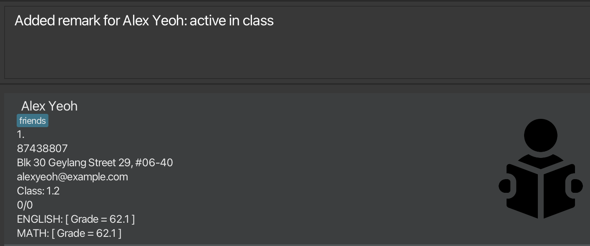

Welcome to the **Watson** user guide! This guide covers all of Watson's features and how to use them.
Throughout this guide, you may see some words in _italics_.
These terms can be found in the [Glossary](#glossary).

Watson is a **desktop app for teachers that helps with a multitude of tasks,
such as handling student particulars, sorting students with different filters,
and more.** It adopts a _Command Line Interface_ (CLI)
while still having the benefits of a _Graphical User Interface_ (GUI).
If you can type fast, Watson can retrieve and handle the data of students
faster than other GUI-based applications.

## Table of Contents

* [Glossary](#glossary)
* [Quick Start](#quick-start)
* [Commands](#commands) `(Version 1.3)`
    * Listing all students: [`list`](#listing-all-students--list)
    * Adding a students: [`add`](#adding-a-student-add)
    * Editing a students: [`edit`](#editing-a-student--edit)
    * Deleting a student: [`delete`](#deleting-a-student--delete)
    * Searching for students: [`find`](#searching-for-students-with-a-specified-criteria-find)
    * Entering student grades: [`grade`](#entering-students-grades--grade)
    * Sorting by grade: [`sort`](#sorting-students-by-grade-sort)
    * Predicting a student's grade: [`predict`](#predicting-a-students-grade--predict)
    * Adding remarks: [`remark`](#add-remark-to-a-student-remark)
* [FAQ](#faq)
* [Command Summary](#command-summary)

--------------------------------------------------------------------------------------------------------------------

## Glossary

* **CLI** : Command Line Interface
* **GUI** : Graphical User Interface
* **Main Window** : The main window of the application that shows the list of students.
* **Home Folder** : The folder where Watson will store student data.
* **Command Box** : The text box where you can enter commands.

## Quick start

1. Ensure you have Java `11` or above installed in your Computer
(Not sure how? Check out [this](https://www.java.com/en/download/help/version_manual.html) guide).

2. Download the latest `watson.jar` from [here](https://github.com/AY2223S1-CS2103T-T08-1/tp/releases/tag/v1.3.release).

3. Copy the file to the folder you want to use as the _home folder_ for Watson.

4. Double-click the file to start the app. A GUI similar to the one shown below should appear in a few seconds. 
Note that the login details are in *red*. 
   
5. After logging in, you will encounter the GUI shown below.
The _command box_ is circled in *red*.
This is where you can input commands!
   
5. Type a command into the command box and press Enter to run it. e.g. typing **`help`** and pressing Enter will open the help window. 
   Some example commands you can try:

    * **`list`** : Lists all students in Watson.

    * **`add`**`n/John Doe p/98765432 a/John street, #01-01` : Adds a student named `John Doe` to Watson, with `p`hone number 98765432 and `a`ddress "John Street, #01-01".

    * **`delete`**`1` : Deletes the student with `INDEX number 1` from Watson.

6. Refer to the [Commands](#commands) section below for details of each command.

--------------------------------------------------------------------------------------------------------------------

## Commands

**Notes about the command format** 

* Words in `UPPER_CASE` are the inputs to be supplied by the user. 
  e.g. in `add n/NAME`, `NAME` is a user-defined input. An example would be `add n/John Doe`.

* Items in square brackets are optional. 
  e.g `TAG` in `n/NAME [t/TAG]` can be excluded. The command can be run as `n/John Doe t/friend` or as `n/John Doe`.

* Items with `…` after them can be used multiple times including zero times. 
  e.g. `[t/TAG]…` can be used as ` ` (i.e. 0 times), `t/friend`, `t/friend t/family` etc.

* Parameters can be in any order. 
  e.g. if the command specifies `n/NAME p/PHONE_NUMBER`, `p/PHONE_NUMBER n/NAME` is also acceptable.

* If a parameter is expected only once in the command, but you specified it multiple times, only the last occurrence of the parameter will be taken. 
  e.g. if you specify `p/12341234 p/56785678`, only `p/56785678` will be taken.

* Extra parameters for commands that do not take in parameters (such as `help`, `list`, `exit` and `clear`) will be ignored. 
  e.g. if the command specifies `help 123`, it will be interpreted as `help`.

### Viewing help : `help`

Shows a message explaining how to access the help page.

Format: `help`

### Adding a student: `add`

Adds a student to Watson.

Format: `add n/NAME ind/INDEX_NUMBER p/PHONE_NUMBER e/EMAIL a/ADDRESS c/STUDENT_CLASS [t/TAGS]…​`

* Adds a student’s details to Watson. The student must not already exist in Watson.
* Additional information can be added through the [`edit`](#editing-a-student--edit) feature.
* Note that you can enter command parameters in any order!

:bulb: **Tip:**
A student can have any number of tags (including 0)

:exclamation: **Note:**
Students with the same name and ONE other field e.g., phone number or address are considered duplicates

Examples:
* `add n/John Doe ind/1 p/98765432 e/jonny@gmail.com a/John street, block 123, #01-01 c/1.1`
* `add n/Amy Lim ind/2 a/Bugis Crescent p/12345678 t/Enjoys ice cream c/4B e/email@gmail.com`

### Listing all students : `list`

Shows a list of all students in Watson.

Format: `list`

### Editing a student : `edit`

Edits an existing student in Watson.

Format: `edit INDEX [n/NAME] [p/PHONE] [e/EMAIL] [a/ADDRESS] [c/CLASS] [rem/REMARK] [t/TAG]…​`  

* Edits the student at the specified `INDEX`. The index refers to the index of the student after using the find/list feature.
* At least one of the optional fields must be provided.
* Existing values will be updated to the input values.
* When editing tags, the existing tags of the student will be removed i.e adding of tags is not cumulative.
* You can remove all the student’s tags by typing `t/` without
  specifying any tags after it.

Examples:
* `edit 1 p/91234567 e/johndoe@example.com` Edits the phone number and email address of the 1st student displayed after
using the list/find feature to be `91234567` and `johndoe@example.com` respectively.
* `edit 2 n/Betsy Crower t/` Edits the name of the 2nd student to be `Betsy Crower` and clears all existing tags.
* `edit 4 n/Charlie Crackshot c/1B` Edits the name of the 4th student to be `Charlie Crackshot` and class to be `1B`.

### Searching for students with a specified criteria: `find`

Finds all students matching the specified criteria and the specified keywords.

Format: `find [n/NAMES] [c/CLASS] [s/SUBJECT]`

* At least one of the optional fields must be provided.
* The search is case-insensitive. e.g. `hans` will match `Hans`
* The order of the keywords does not matter. e.g. `Hans Bo` will match `Bo Hans`
* Only name, class and subject can be searched.
* Only full words will be matched e.g. `Han` will not match `Hans`
* Students matching at least one keyword will be returned (i.e. OR search). e.g. `Hans Bo` will return `Hans Gruber`, `Bo Yang`

:exclamation: **Note:**
Each parameter specified is independent of the previous. e.g. `find n/tommy c/2A` will return students with name `Tommy` or in class `2A` but NOT items with both.

Examples:
* `find n/John` returns `john` and `John Doe`
* `find n/alice bob charlie c/1A s/English` returns students with names `alice`, `bob`, `charlie` or class `1A` or taking the subject `English`.
* `find n/alex david` returns `Alex Yeoh`, `David Li` 
  

### Sorting students by grade: `sort`

Sort all student by grade in ascending or descending order.

Format: `sort asc` or `sort desc`

* The search is case-insensitive. e.g. `sort ASC` will return the same result as `sort asc`
* The returned list is sorted by grade which refers to the total percentage the student scored in all the subjects.

Examples:
* `sort DESC` returns list of students whose grades are in descending order

### Add remark to a student: `remark`

Adds a remark to a student by index.

Format: `remark INDEX REMARK`

* Note that only one remark can be added to one student at a time.

Examples:
* `remark 1 she is active in class` adds the remark `she is active in class` to the student with index 1 in the list
 

### Deleting a student : `delete`

Deletes the specified student from Watson.

Format: `delete INDEX`

* Deletes the student at the specified index.
* The index refers to the index of the student after using the find/list feature.
* The index **must be a positive integer**: 1, 2, 3, …​

Examples:
* `delete 1`
* `delete 5`

### Entering student's grades : `grade`

Opens up a GUI window for the user to enter student's assignment results.

Format: `grade SUBJECT_ASSIGNMENT_TOTALSCORE_WEIGHTAGE_DIFFICULTY`

* The Subject refers to subject of the assignment, and is **case-insensitive**.
* The Assignment refers to the name of the assignment, eg - CA1.
* The Total score refers to the maximum achievable score in the assignment
* The weightage refers to the weightage of the assignment, written in decimal form. For example, if the assignment is worth 40% of the total grade, write 0.4
* The difficulty of an assignment is an arbitrary number out of 5 to denote how difficult the assignment is

Examples:
* `grade MATH_CA1_100_0.5_1.0`
* `grade ENGLISH_CA1_40_0.2_4.5`

Example use

1. Type in "grade MATH_CA1_100_0.5_1.0" into the input box as shown:

   

2. A GUI will appear on the screen for you to start entering the grades of your students

   
3. Enter the score achieved by the student and click on `Enter` button.
4. After entering the score, the system will automatically prompt you to enter the score for the next student.
5. Continue entering the score until the system detects that all of the scores have been entered.

### Predicting a student's grade : `predict`

Watson has rudimentary data analysis and prediction abilities.
It can predict a student's grade for a particular subject based on
the student's past grades for that subject.

Currently, Watson uses the following formula to predict a student's grade:

(**average** of all normalized scores for previous assessments) + (**difficulty penalty**)

The normalized score for any particular assessment is calculated as follows:
1. Calculate the student's score for the assessment, divided by the total score for the assessment.
2. Calculate the percentage of classes attended by the student. Let's call this the student's **learning rating**.
3. Calculate the **difficulty bonus** for the assessment with the following formula:
    * 1/((**difficulty rating**) x **learning rating**)
4. The result is the sum of step 1 and step 3.

#### What is difficulty rating?

**Difficulty rating** is a number between 1 and 5, which is assigned by the user when entering the grades for the assessment.

Format: `predict n/NAME s/SUBJECT diff/DIFFICULTY`

* The name refers to the name of the student. **This name must be identical to the entry in the database!**
* The subject refers to the subject of the assignment to predict. **This must be capitalized!**
* The student should be taking the subject.

Examples:
* `predict n/Alice Pauline s/ENGLISH diff/4.0`
* `predict n/George Best s/ENGLISH diff/3.0`

### Clearing all entries : `clear`

Clears all entries from the database.

Format: `clear`

### Exiting the program : `exit`

Exits the program.

Format: `exit`

### Saving the data

Watson's data is saved in the hard disk automatically after any command that changes the data. There is no need to save manually.

### Editing the data file

Watson's data is saved as a JSON file `[JAR file location]/data/addressbook.json`. Advanced users are welcome to update data directly by editing that data file.

:exclamation: **Caution:**
If your changes to the data file makes its format invalid, Watson will discard all data and start with an empty data file at the next run.

### Archiving data files `[coming in v2.0]`

_Details coming soon ..._

--------------------------------------------------------------------------------------------------------------------

## FAQ

**Q**: How do I transfer my data to another Computer? 
**A**: Install the app in the other computer and overwrite the empty data file it creates with the file that contains the data of your previous Watson home folder.

--------------------------------------------------------------------------------------------------------------------

## Command summary

| Action     | Format, Examples                                                                                                                              |
|------------|-----------------------------------------------------------------------------------------------------------------------------------------------|
| **Add**    | `add n/NAME p/PHONE_NUMBER e/EMAIL a/ADDRESS [t/TAG]…​`   e.g.,`add n/John Doe ind/1 p/98765432 a/John street, block 123, #01-01 c/1.5`   |
| **Clear**  | `clear`                                                                                                                                       |
| **Delete** | `delete INDEX`   e.g., `delete 1`                                                                                                         |
| **Edit**   | `edit INDEX [n/NAME] [p/PHONE_NUMBER] [e/EMAIL] [a/ADDRESS] [t/TAG]…​`   e.g.,`edit 2 n/James Lee e/jameslee@example.com`                 |
| **Find**   | `find n/NAMES (OPTIONAL) c/CLASS (OPTIONAL) s/SUBJECT (OPTIONAL)`   e.g.,`find n/alice bob charlie c/1A s/English`, `find s/English Math` |
| **Sort**   | `sort asc` or `sort desc`                                                                                                                     |
| **Remark** | `remark INDEX [REMARK]` e.g. `remark 1 she is active in class`                                                                                |
| **List**   | `list`                                                                                                                                        |
| **Help**   | `help`                                                                                                                                        |

