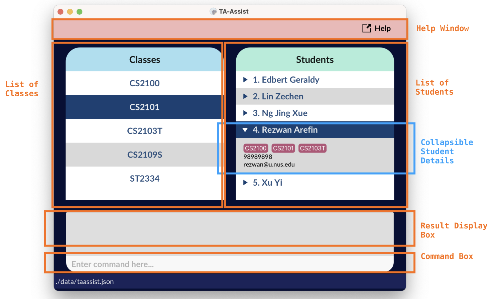
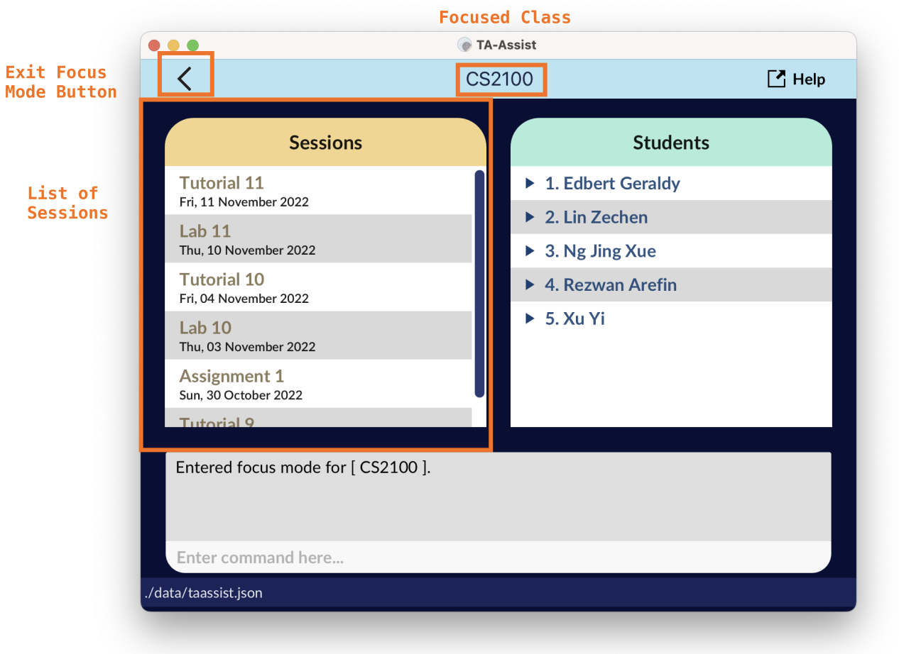

**TA-Assist** is a desktop app for Teaching Assistants (TA) to keep track of students’ particulars and allocate marks 
for attendance and assignments. It is optimized for use via a Command Line Interface (CLI) while having the benefits of 
a Graphical User Interface (GUI).

This user guide provides a brief documentation on how you can install the application and describes how each feature 
should be used. Start by looking at the [quick start](#quick-start) guide to get you started.

* Table of Contents
{:toc}

## Quick Start
1. Ensure you have **Java `11`** or above installed in your computer.
2. Download the latest `taassist.jar` from [here](https://github.com/AY2223S1-CS2103T-T12-1/tp/releases/tag/v1.3).
3. **Copy** the file to the folder you want to use as the _home folder_ for your TA-Assist.
4. **Double-click** the file to start the app. The GUI similar to the one below should appear in a few seconds. Note how the
   app contains sample data.



--------------------------------------------------------------------------------------------------------------------

## Features

:information_source: Before diving into the features, the examples in this guide are formatted with the following conventions:
* Words in `UPPER_CASE` are the parameters to be supplied by you.
  * e.g. in `add n/NAME`, `NAME` is a parameter which can be used as `add n/John Doe`.
* Items in square brackets are optional.
  * e.g `n/NAME [c/CLASS_NAME]` can be used as `n/John Doe c/CS1231S` or as `n/John Doe`.
* Items with `...` after them can be used multiple times.
  * e.g. `[c/CLASS_NAME...]` can be used as ` ` (i.e. 0 times since it is also optional), `c/CS1101S`, `c/CS2030 c/ST2334` etc.
* Parameters, excluding index parameters, can be in any order.
  * e.g. if you specify `n/NAME p/PHONE_NUMBER`, `p/PHONE_NUMBER n/NAME` is also acceptable.
  * e.g. while `assign INDEX c/CLASS_NAME` is acceptable, `assign c/CLASS_NAME INDEX` is not acceptable.
* If a parameter is expected only once in a command but you specified it multiple times, the parser takes only the last occurrence of the parameter.
  * e.g. if you specify `p/12341234 p/56785678`, only `p/56785678` will be taken.
* Extraneous parameters for commands that do not take in parameters (such as `help`, `list`, `exit` and `clear`) are ignored by the parser.
  * e.g. if you specify `help 123`, the parser interprets it as `help`.
* Extraneous parameters for commands that do not expect such parameters may be parsed incorrectly.
  * e.g. if you specify `addc c/CS1231S n/CS2030S`, the parser interprets it as adding a class named "CS1231S n/CS2030S", which is not a valid class name. Hence, TA-Assist throws an error.
* All parameters and their constraints have been provided in [the Appendix](#parameters-and-constraints) for your reference.

### Modes
In TA-Assist, you can switch into a mode called the **focus** mode, which lets you run tasks that are specific to (module) class. Therefore,
[some commands](#features-available-in-focus-mode) can only be executed when you are in focus mode. Commands that you can run in the default (unfocused) mode can also
be run in focus mode. On the other hand, commands that are available only in focus mode cannot be executed in the default (unfocused) mode.

Let's first begin with the commands available in the default mode.

| Command    | Format                                                             |
| ---------- |--------------------------------------------------------------------|
| `help`     | `help`                                                             |
| `add`      | `add n/NAME [p/PHONE_NUMBER][e/EMAIL][a/ADDRESS][c/CLASS_NAME...]` |
| `edit`     | `edit INDEX [n/NAME][p/PHONE_NUMBER][e/EMAIL][a/ADDRESS]`          |
| `delete`   | `delete INDEX`                                                     |
| `find`     | `find KEYWORD...`                                                  |
| `list`     | `list`                                                             |
| `addc`     | `addc c/CLASS_NAME...`                                             |
| `deletec`  | `deletec c/CLASS_NAME...`                                          |
| `assign`   | `assign INDEX... c/CLASS_NAME`                                     |
| `unassign` | `unassign INDEX... c/CLASS_NAME`                                   |
| `listc`    | `listc`                                                            |
| `exit`     | `exit`                                                             |
| `focus`    | `focus c/CLASS_NAME`                                               |
| `clear`    | `clear`                                                            |

### View help : `help`



The above message emerges when the redirection fails.

Format: `help`

### Add a student: `add`



Format: `add n/NAME [p/PHONE_NUMBER] [e/EMAIL] [a/ADDRESS] [c/CLASS_NAME...]`
* Adds a student named `NAME` into TA-Assist.

Examples:
* `add n/John Doe p/98765432 e/johnd@example.com a/John street, block 123, #01-01 c/CS2103T`
* `add n/Betsy Crowe a/Betsy street p/62353535 c/CS1231S c/CS1101S`

### Edit a student: `edit`



Format: `edit INDEX [n/NAME] [p/PHONE_NUMBER] [e/EMAIL] [a/ADDRESS]`
* Edits student data at the specified `INDEX`.
* Only specified fields are modified.

Examples:
* `edit 2 n/John Doe` changes the 2nd student’s name to **John Doe**.
* `edit 4 e/john.doe@example.com a/38 College Avenue East, 138601` changes the 4th student’s:
  * E-mail to **john.doe@example.com**
  * Address to **38 College Avenue East, 138601**

### Delete a student: `delete`



Format: `delete INDEX`
* Deletes the student at the specified `INDEX`.

Examples:
* `list` followed by `delete 2` deletes the 2nd student in the student list.
* `find Betsy` followed by `delete 1` deletes the 1st student in the results of the `find` command.
* `focus c/CS2103T` followed by`delete 3` deletes the 3rd student in the CS2103T class.

### Locate student by name: `find`



Format: `find KEYWORD...
* The search is **case-insensitive**, i.e. `Joh` matches with `john` and `JOHN`.
* The search is performed on the current displayed student list.
* To clear the current search, use the `list` command.

Examples:
* `find bert` finds students with **bert** in their name (case-insensitive), i.e. **Edbert Geraldy**, **Bert Hendrick**, **Gerard Albert**, etc.
* `find ben chris` finds students with either **ben** or a **chris** in their name, i.e. **chris ben**, **wonders ChRIs**, **bEn ten**, etc.
* `find alex david` returns `Alex Yeoh`, `David Li` 

  



### List all students: `list`



Format: `list`
* The displayed list of students contains all the students in TA-Assist.



### Add classes: `addc`



Format: `addc c/CLASS_NAME...`
* Add classes with specified names. 
* The class names are **case-insensitive**.
  * e.g. If a class with a name **CS1101S** already exists, `addc c/cs1101s` does not add a
  new class `cs1101s`.
* If there are duplicate class names, the class name is taken to be the last valid class parameter `c/`.
  * e.g. If a class with a name **CS1101S** does not exist, `addc c/CS1101S c/cs1101s` adds one class with the name
  **cs1101s**.

Examples:
* `addc c/CS2103T c/CS2100` adds the classes named **CS2103T** and **CS2100**.

### Delete classes: `deletec`



Format: `deletec c/CLASS_NAME...`
* Deletes the classes with the specified names.
* The class names are **case-insensitive**.

Examples:
* `deletec c/CS2103T c/CS2100` deletes the classes named **CS2103T** and **CS2100**.

### Assign students to class: `assign`



Format: `assign INDEX... c/CLASS_NAME`
* Assigns students specified by the given indices to an existing `CLASS_NAME` class.
* The class name is **case-insensitive**.

Example:
* `list` followed by `assign 1 3 5 6 c/CS1231S` assigns the **1st**, **3rd**, **5th** and **6th** student in the displayed student list to the **CS1231S** class.

### Unassign students from class: `unassign`



Format: `unassign INDEX... c/CLASS_NAME`
* Unassigns students specified by the given indices from an existing `CLASS_NAME` class.
* The class name is **case-insensitive**.

Example:
* `list` followed by `unassign 1 3 5 6 c/CS1231S` unassigns the **1st**, **3rd**, **5th** and **6th** student in the displayed student list from the **CS1231S** class.

### List classes: `listc`



Format: `listc`

### Exit the program: `exit`



Format: `exit`

### Enter focus mode: `focus`



Format: `focus c/CLASS_NAME`
* Enters focus mode for the class named `CLASS_NAME`.
* The class name is **case-insensitive**.
* If successful, the GUI changes to one that is similar to the one below:

Example:
* `focus c/CS1231S` enters focus mode for the **CS1231S** class, allowing you to manage data relating to **CS1231S**.

### Clear all existing data: `clear`



Format: `clear`
* Clears all existing data in TA-Assist.

## Features Available in Focus Mode

The following commands are only available in [**focus mode**](#modes).

| Command   | Format                                        |
|-----------|-----------------------------------------------|
| `list`    | `list`                                        |
| `adds`    | `adds s/SESSION_NAME... [d/DATE]`             |
| `deletes` | `deletes s/SESSION_NAME...`                   |
| `grade`   | `grade INDEX... s/SESSION_NAME g/GRADE_VALUE` |
| `scores`  | `scores s/SESSION_NAME`                       |
| `view`    | `view INDEX`                                  |
| `export`  | `export`                                      |
| `unfocus` | `unfocus`                                     |

### List all students in the class: `list`



Format: `list`
* The list of students only shows the students that were assigned to the currently focused class.



### Create session: `adds`





Format: `adds s/SESSION_NAME... [d/DATE]`
* Creates new sessions with names `SESSION_NAME` on the same `DATE`. If the `DATE` field is empty, the current date is used instead.
* `DATE` field should follow the format `YYYY-MM-DD`.
* The session names are **case-insensitive**.
  * e.g. If a session **Lab 1** already exists, `adds s/lab 1` does not create a new session **lab 1**. 
* If there are session names, the session name is taken to be the last valid session parameter `s/`.
  * e.g. If a session with a name **LAB1** does not exist, `adds s/LAB1 s/lab1` adds one session with the name
    **lab1**.

Example:
- `adds s/Lab1 s/Tutorial1 d/2022-08-11` creates sessions `Lab1` and `Tutorial1` on 11 August 2022.

### Delete sessions: `deletes`



Format: `deletes s/SESSION_NAME...`
* Deletes the sessions with the specified names.
* The session names are **case-insensitive**.

Examples:
* `deletes s/Lab1 s/Assignment3` deletes the session named **Lab1** and **Assignment3**.

### Grade session: `grade`



Format: `grade INDEX... s/SESSION_NAME g/GRADE_VALUE`
* Grades the students specified by the given indices on the session `SESSION_NAME` with a grade of `GRADE_VALUE`.
* `GRADE_VALUE` must be a number (decimal points are allowed).
* The session name is **case-insensitive**.

Example:
* `grade 1 2 s/Lab 1 g/93` gives the students at index 1 and 2 a grade of **93** for the session **Lab 1**.

### Show students' grades for a session: `scores`



Format: `scores s/SESSION_NAME`
* Shows the grades of all students for the session `SESSION_NAME`.
* The session name is **case-insensitive**.

Example:

* `scores s/tutorial 1` shows the grades of all students for the session **tutorial 1**, as shown below.
      

  

  In the above example,
  * **Bernice Yu** has been allocated a score of **10.0** for **tutorial 1**.
  * **tutorial 1** for **Alex Yeoh**, **Charlotte Oliveiro** and **Irfan Ibrahim** have not been graded, hence their cells have been marked red.

### View session grades of student: `view`



Format: `view INDEX`
* Views the grade of the student at index `INDEX` for the currently focused class.

Example:
* `grade 2 s/Lab 1 g/93` then `view 2` returns `1. Lab 1: 93`, which is the grade of the student at index 2 for the session **Lab 1**.

### Export class data: `export`





Format: `export`

- The exported class data includes:
  * Student names of the class.
  * All session names of the class.
  * The grades of the students corresponding to each session.
- An example generated csv file when opened in Microsoft Excel:

  - First column shows all the student names.
  - Subsequent columns show the grade for a student for a session (e.g. **David Li** scores **0** for **Tutorial 1**).

### Exit focus mode: `unfocus`



Format: `unfocus`
* Alternatively, you can exit focus mode by clicking on the button shown [here](#enter-focus-mode-focus).

## Frequently Asked Questions (FAQ)

**Q**: How do I install Java?

**A**: You may refer to [Oracle's JDK Installation Guide](https://docs.oracle.com/en/java/javase/11/install/overview-jdk-installation.html#GUID-8677A77F-231A-40F7-98B9-1FD0B48C346A).

**Q**: I double-clicked the JAR file but was unable to start the app. What do I do?

**A**: Open your preferred terminal and navigate to the directory the JAR file is located in. Then type in `java -jar TaAssist.jar` to run the application.

**Q**: How do I transfer my data to another Computer?

**A**: Install the app in the other computer and overwrite the empty data file it creates with the file that contains the data of your previous TA-Assist home folder.

## Appendix

### Parameters and Constraints

For all parameters, the following constraints are applied:
* As Ta-Assist uses prefixes such as `p/` and `c/` to identify the start of a new parameter, all parameters have the implicit constraint that they must not contain prefixes
  of another parameter if that other parameter is being used in a command. 
  * e.g. We can not add a student with the address `Commongrove n/123A` as the `n/123A` prefix will be parsed by Ta-Assist as the Student's name.

The following is the list of all parameters used in TA-Assist along with its constraints:

* `INDEX` 
  * Indices must be a positive integer
  * Indices must be within the indices shown in the displayed list
* `KEYWORD` 
  * Search keywords can not contain spaces
* `n/NAME` 
  * Student names must not be empty 
  * Student names must only contain alphanumeric characters and spaces
* `p/PHONE_NUMBER`
  * Phone numbers must only contain numbers
  * Phone numbers must be at least 3 digits long
* `e/EMAIL`
  * E-mails must be of the format `local-part@domain`, i.e. `johndoe+work@s.mail.com`
  * `local-part` must only contain alphanumeric characters and these special characters, excluding the parentheses, (`+_.-`)
  * `domain` is made up of domain labels, seperated by period
    * Each `domain` must end with a domain label of at least 2 characters long
    * Each domain label must start and end with alphanumeric characters
    * Each domain label must consists of only alphanumeric characters, seperated only by hyphens, if any.
* `a/ADDRESS`
  * Addresses must not be empty
* `c/CLASS_NAME`
  * Class names must be alphanumeric
  * Class names must not exceed 25 characters
* `s/SESSION_NAME`
  * Session names must not be empty
  * Session names must only contain alphanumeric characters, underscores, and spaces
* `d/DATE`
  * Dates must be of the format `YYYY-MM-DD`, i.e. 25th May 2022 must be written as `2022-05-25`
  * Dates must be a valid date, i.e. `2001-02-29` is not a valid date