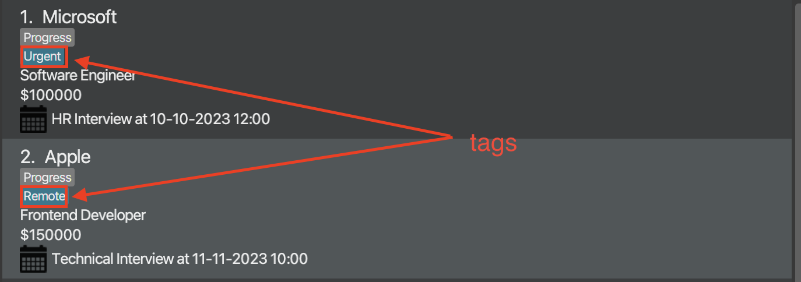

# Welcome to InTrack!

Tired of tracking your internship applications on your calendar or Microsoft Excel?

Looking for a more efficient way to track your countless internship applications and deadlines?

Well, look no further!

**InTrack** might just be the solution for you! Introducing your one-stop internship tracker which will let you
easily track all your internship applications! With **InTrack**, no more worrying about whether you've missed
any important deadlines or forgetting what you've applied for.

So what are you waiting for? This user guide contains step-by-step instructions on how you can install and use
**InTrack**, which will be your companion throughout your internship search!

--------------------------------------------------------------------------------------------------------------------

# Table of Contents

- [Introduction](#introduction---what-is-intrack)
- [How To Use This Guide](#how-to-use-this-guide)
- [Quick Start](#quick-start)
- [GUI Summary](#gui-summary)
- [Features](#features)
  - [General Features](#general-features)
    - [Viewing help: `help`](#viewing-help-help)
    - [Viewing statistics of internship applications: `stats`](#viewing-statistics-of-internship-applications-stats)
    - [Exiting the program: `exit`](#exiting-the-program-exit)
    - [Saving the data](#saving-the-data)
  - [Internship Application Management](#internship-application-management)
    - [Adding an internship application: `add`](#adding-an-internship-application-add)
    - [Deleting an internship application: `delete`](#deleting-an-internship-application-delete)
    - [Updating status of an internship application: `status`](#updating-status-of-an-internship-application--status)
    - [Adding a tag to an internship application: `addtag`](#adding-a-tag-to-an-internship-application--addtag)
    - [Deleting a tag from an internship application: `deltag`](#deleting-a-tag-from-an-internship-application--deltag)
    - [Selecting an internship application: `select`](#selecting-an-internship-application--select)
    - [Editing an internship application: `edit`](#editing-an-internship-application--edit)
    - [Adding a task to a selected internship application: `addtask`](#adding-a-task-to-a-selected-internship-application--addtask)
    - [Deleting a task from a selected internship application: `deltask`](#deleting-a-task-from-a-selected-internship-application--deltask)
    - [Adding a remark to an internship application: `remark`](#adding-a-remark-to-an-internship-application--remark)
    - [Sending an email to a company: `mail`](#sending-an-email-to-a-company--mail)
  - [List Management](#list-management)
    - [Listing all internship applications: `list`](#listing-all-internship-applications--list)
    - [Clearing all internship applications: `clear`](#clearing-all-internship-applications--clear)
    - [Finding internship applications by company name: `findc`](#finding-internship-applications-by-company-name--findc)
    - [Finding internship applications by position: `findp`](#finding-internship-applications-by-position--findp)
    - [Finding internship applications by tags: `findt`](#finding-internship-applications-by-tags--findt)
    - [Filtering internship applications by status: `filter`](#filtering-internship-applications-by-status--filter)
    - [Sorting internship applications: `sort`](#sorting-internship-applications-sort)
- [FAQ](#faq)
- [Command Summary](#command-summary)
  - [General Features](#general-features)
  - [Internship Application Management](#internship-application-management)
  - [List Management](#list-management)
- [Glossary](#glossary)

--------------------------------------------------------------------------------------------------------------------

# Introduction - What Is InTrack?

**InTrack** is a desktop application built for Computer Science students to manage their different internship applications.

**InTrack** allows users to:

* seamlessly search for and update their various internship applications, as well as
* keep track of the relevant timings and deadlines,

all through a simple and easy-to-use platform!

**InTrack** is optimized for use via a Command Line Interface (CLI) while still having the benefits of a Graphical User
Interface (GUI). If you're a Computer Science student who can type fast, InTrack can help you manage your
internship applications more efficiently and effectively than traditional GUI apps.

--------------------------------------------------------------------------------------------------------------------

# How to use this guide

First time using **InTrack**? Not to worry, this user guide will help you to learn the basics of **InTrack** so that you
can land your dream internship sooner.

Now to get started, we have prepared a [Quick Start](#quick-start) section in this user guide to guarantee that you'll
have no problem setting up **InTrack**.

Moreover, familiarize yourself with the GUI, by heading over to the [GUI Summary](#gui-summary) where you will get a 
quick breakdown on the GUI.

Searching for information about a specific feature instead? You might find it helpful to navigate to the relevant sections via
the [Table of Contents](#table-of-contents) for more detailed explanations of individual features.

Alternatively, consider looking at the [Command Summary](#command-summary) for a brief outline of all the commands.

At any point of the user guide, if you're unsure of the technical jargon used, fret not! Head over to our
[Glossary](#glossary) to find out what they mean. Or if you have a question, check out our [FAQ](#faq) in case your
question already has a quick answer!

If you still can't find what you're looking for, feel free to contact us at our [Github](https://github.com/AY2223S1-CS2103T-T11-2/tp)!

Before we start, the following table explains certain symbols and syntax you may run into in our guide:

| Symbol/Syntax                                  | Meaning                                                                                                                                         |
|------------------------------------------------|-------------------------------------------------------------------------------------------------------------------------------------------------|
| :warning: **Caution**                          | Very important information that you must know before using a command                                                                            |
| :information_source: **Notes**                 | Important information that you should pay attention to                                                                                          |
| :bulb: **Tip**                                 | Helpful information that you might want to know                                                                                                 |
| `Highlighted text block`                       | Commands or parameters relevant to the application                                                                                              |
| [Hyperlinks](#how-to-use-this-guide)           | When clicked, you will be led to a designated section within this document or an external link                                                  |

--------------------------------------------------------------------------------------------------------------------

# Quick start

1. Ensure you have Java 11 or above [installed in your Computer](#faq).

2. Download the latest `InTrack.jar` from [here](https://github.com/AY2223S1-CS2103T-T11-2/tp/releases).

3. Copy the file to the folder you want to use as the _home folder_ for **InTrack**.

4. Launch the app by double-clicking the file or by using the command `java -jar InTrack.jar` in your terminal. The GUI
   similar to the below should appear in a few seconds. Note how the app contains some sample data. 

   

5. Type the command in the command box and press Enter to execute it. E.g. typing **`help`** and pressing Enter will
   open the help window. 
   Some example commands you can try:

   * **`help`** : Opens the help window, which contains a link to this User Guide, as well as a summary of all the
   commands **InTrack** provides.

   * **`list`** : Lists all internship applications.

     * **`add c/Microsoft p/Software Engineer s/5000 e/hr@microsoft.com w/https://careers.microsoft.com t/Urgent`** :
       Adds an internship application for `Software Engineer` at `Microsoft` to **InTrack**. The salary is `$5000`, the 
     company's email address is `hr@microsoft.com`, and the application website is at `https://careers.microsoft.com`.

   * **`delete 1`** : Deletes the first internship application displayed in **InTrack**.

   * **`exit`** : Exits **InTrack**.

6. Refer to the [Features](#features) below for details of each command.

--------------------------------------------------------------------------------------------------------------------

# GUI Summary

The following is an annotated breakdown of **InTrack**'s GUI:

1. Command window: User inputs commands here.
2. Display window: Relevant messages from the system are displayed here. These can include success messages, error messages, and 
the resulting statistics from when the `stats` command is entered.
3. Internship panel: The list of internship applications in **InTrack** is displayed here. By default, this panel displays 
the complete list of internships, but this may change when some list management commands such as `filter` or `sort` 
are entered.
4. Individual internship window: By default, this is left blank. When the `select` command is used, the various fields 
of the selected internship will be shown here.

--------------------------------------------------------------------------------------------------------------------

# Features

**:information_source: Notes about the command format:** 

* Words in `UPPER_CASE` are the parameters to be supplied by the user. 
  E.g. in `add p/POSITION`, `POSITION` is a parameter which can be replaced by `Software Engineer` to give the command
`add p/Software Engineer`.

* Items in square brackets are optional. 
  E.g `w/WEBSITE [t/TAG]` can be used as `w/https://careers.microsoft.com t/Urgent` or as `w/https://careers.microsoft.com`.

* Items with `…` after them can be used multiple times including zero times. 
  E.g. `[t/TAG]…​` can be used as `t/Urgent`, `t/Urgent t/Remote` etc., or can not appear in the command at all 
(i.e. used 0 times).

* If a parameter is expected only once in the command, but is specified multiple times, only the last occurrence of
  the parameter will be taken. 
  E.g. if the user enters `c/Microsoft c/Apple`, it will be interpreted as `c/Apple`.

* Extraneous parameters for commands that do not take in parameters (such as `help` and `list`) will be ignored. 
  E.g. if the command specifies `help 123`, it will be interpreted as `help`.

## General Features

### Viewing help: `help`

If you're a little stuck, entering this command opens a help window with a link to this user guide, as well as a summary
of all the commands **InTrack** provides.

Format: `help`

[Back to Table of Contents](#table-of-contents)

### Viewing statistics of internship applications: `stats`

This command displays the statistical breakdown of your currently displayed list of internship applications. The proportions of 
offered, in-progress and rejected applications will be shown.

This command is dependent on the current list of internship applications listed, hence if the `find` commands 
([`findc`](#finding-internship-applications-by-company-name--findc), [`findp`](#finding-internship-applications-by-position--findp), 
[`findt`](#finding-internship-applications-by-tags--findt)) or the [`filter`](#filtering-internship-applications-by-status--filter) 
command is used to modify the currently displayed list, entering the `stats` command will show the statistics of the list 
currently being displayed.

Format: `stats`

[Back to Table of Contents](#table-of-contents)

### Exiting the program: `exit`

If you're done and would like to close **InTrack**, you can do so by entering the `exit` command.

Format: `exit`

[Back to Table of Contents](#table-of-contents)

### Saving the data

**InTrack** data is saved in the hard disk automatically after any command that changes the data so there is no need for
you to save manually.

[Back to Table of Contents](#table-of-contents)

## Internship Application Management

### Adding an internship application: `add`

This command adds a new internship application to **InTrack** with the parameters you have entered. When you add a new 
internship application, you must specify the company and position name, the relevant email, website and salary. Adding 
relevant tags to the entry is optional.

Format: `add c/COMPANY p/POSITION e/EMAIL w/WEBSITE s/SALARY [t/TAG]…`

| Parameter  | Representation                               | Constraints                                                                   |
|------------|----------------------------------------------|-------------------------------------------------------------------------------|
| `COMPANY`  | Company that is offering the internship      | Must contain only alphanumeric characters and spaces, and should not be blank |
| `POSITION` | Position of the internship                   | Must not be blank                                                             |
| `EMAIL`    | Email of the hiring team                     | Must be of the format `local-part@domain`                                     |
| `WEBSITE`  | Website containing details of the internship | Must be a valid URL                                                           |
| `SALARY `  | Salary of the position                       | Must contain only numbers                                                     |
| `TAG`      | Tag(s) of the internship application         | Must be one word per tag and contain only alphanumeric characters             |

:bulb: **Tip:** An internship can have any number of tags (including 0), and you can add multiple tags at once.

**:information_source: Note about duplicates:** 

An internship application can only be added if it does not currently exist in **InTrack**. Each internship application is
uniquely identified by its `COMPANY` and `POSITION` together with no regards to case-sensitivity. This means that an 
entry is only considered a duplicate if it has both the same company name **and** position as another entry. 

Example: If an internship application with the parameters `c/Microsoft p/Software Engineer` already exists in **InTrack**,
a new one with `c/MICROSOFT p/Software Engineer` will be treated as a duplicate and will not be added.

However, attempting to add a new internship application where `c/Microsoft p/Backend Developer` and every other field is 
the same is possible, as the position being applied for is now different, hence setting it apart from `c/Microsoft p/Software 
Engineer`.

**:information_source: Note regarding status:** 

By default, an added internship will have the status of in-progress. To update this, you can make use of the
[`status` command](#updating-status-of-an-internship-application--status).

Examples of usage:

* `add c/Microsoft p/Software Engineer e/hr@microsoft.com w/https://careers.microsoft.com s/5000 t/Urgent`

* `add c/Apple p/Frontend Developer e/hr@apple.com w/https://www.apple.com/careers s/5000`

Expected outcome:

* Internship application with the given information is added to **InTrack** and appears at the bottom of the displayed 
internship list.

[Back to Table of Contents](#table-of-contents)

### Deleting an internship application: `delete`

If you have withdrawn from an internship application or simply just want to remove an entry, you can delete the 
internship application at the specified `INDEX` from **InTrack**.

Format: `delete INDEX`

| Parameter | Representation                                                                 | Constraints                                                                                    |
|-----------|--------------------------------------------------------------------------------|------------------------------------------------------------------------------------------------|
| `INDEX`   | The index of the target internship application as shown in the internship list | Must be a positive unsigned integer and must not exceed the size of the current displayed list |

Example of usage:

* `delete 1`

Expected outcome:

* The first internship application in **InTrack** is deleted.

Before deleting the internship application for `Software Engineer` at `Microsoft` at `INDEX` 1:

After deleting the internship application for `Software Engineer` at `Microsoft` previously at `INDEX` 1:

[Back to Table of Contents](#table-of-contents)

### Updating status of an internship application : `status`

By default, internship applications added to **InTrack** are listed as in-progress. If you'd like to update the status 
of your internship application, the `status` command helps you to change the status of the entry at the specified `INDEX` 
with 1 of 3 possible statuses: 
`o` for `Offered`, `p` for `Progress` or `r` for `Rejected`.

Format: `status INDEX STATUS`

| Parameter | Representation                                 | Constraints                                                                                    |
|-----------|------------------------------------------------|------------------------------------------------------------------------------------------------|
| `INDEX`   | The index of the target internship application | Must be a positive unsigned integer and must not exceed the size of the current displayed list |
| `STATUS`  | The new status of the internship application   | Must be either `o`, `p`, `r` or their capitalised forms                                        |

Example of usage:

* `status 1 o`

Expected outcome:

* The status of the first internship application in **InTrack** is updated to `Offered`.

Before updating the status of the internship application at `INDEX` 1 to `Offered`:

After updating the status of the internship application at `INDEX` 1 to `Offered`:

[Back to Table of Contents](#table-of-contents)

### Adding a tag to an internship application : `addtag`

Tags are quick one word notes you can attach to an entry. They can be used to categorise your applications, or you can 
use them to simply store one word information that can be seen in a glance.

`addtag` adds one or more tags to the internship application at the specified `INDEX` in **InTrack**.

Format: `addtag INDEX TAG [MORE_TAGS]...`

| Parameter | Representation                                    | Constraints                                                                                    |
|-----------|---------------------------------------------------|------------------------------------------------------------------------------------------------|
| `INDEX`   | The index of the target internship application    | Must be a positive unsigned integer and must not exceed the size of the current displayed list |
| `TAG`     | The tag to be added to the internship application | Must be one word per tag and contain only alphanumeric characters                              |

**:information_source: Note about `addtag`:** 

`TAG` is case-sensitive, so `urgent` and `Urgent` are considered as separate tags. If a tag already exists in an
internship application, duplicates of it will not be added.

If multiple tags are specified in an `addtag` command, duplicate tags will not be added while non-duplicate ones
will be added as per normal.

Example of usage:

* `addtag 1 Urgent`

Expected outcome:

* The `Urgent` tag will appear on the first internship application in **InTrack**.

How tags appear in InTrack:

[Back to Table of Contents](#table-of-contents)

### Deleting a tag from an internship application : `deltag`

Your tags may change over time, hence `deltag` gives you the option of deleting one or more existing tags from the 
internship application at the specified `INDEX` in **InTrack**.

Format: `deltag INDEX TAG [MORE_TAGS]...`

| Parameter | Representation                                        | Constraints                                                                                    |
|-----------|-------------------------------------------------------|------------------------------------------------------------------------------------------------|
| `INDEX`   | The index of the target internship application        | Must be a positive unsigned integer and must not exceed the size of the current displayed list |
| `TAG`     | The tag to be deleted from the internship application | Must be one word per tag and contain only alphanumeric characters                              |

**:information_source: Note about `deltag`:** 

A reminder that tags are case-sensitive, hence deleting the `Urgent` tag will not delete an `urgent` tag.

Example of usage:

* `deltag 1 Urgent`

Expected outcome:

* The `Urgent` tag, if it exists, will be removed from the first internship application in **InTrack**.

[Back to Table of Contents](#table-of-contents)

### Selecting an internship application : `select`

Displaying all the information about all the internship applications would make the app too cluttered, hence while you 
can view important details about an internship in the list panel view, sometimes you may need to see the full details of 
an entry.

You can use the `select` command to select and view the complete details of the internship application at the specified 
index of the internship application list.

**:information_source: Note about `select`:** 

An internship application entry must be selected via the `select` command before the `edit`, `addtask`, `deltask`,
`mail` and `remark` commands can be used. This ensures that the user can see the entire internship application 
before executing these commands, which might rely on fields not visible from the list view.

Don't worry about memorising which commands need the `select` command and which do not, the descriptions in this guide 
for commands that require the `select` command beforehand have reminders to `select` first!

Format: `select INDEX`

| Parameter | Representation                                        | Constraints                                                                                    |
|-----------|-------------------------------------------------------|------------------------------------------------------------------------------------------------|
| `INDEX`   | The index of the target internship application        | Must be a positive unsigned integer and must not exceed the size of the current displayed list |

Example of usage:

* `select 1`

Expected outcome:

* The first internship application in **InTrack** is selected and its details are shown on the right panel.

Before selecting the internship application at `INDEX` 1:

After selecting the internship application at `INDEX` 1:

[Back to Table of Contents](#table-of-contents)

### Editing an internship application : `edit`

Accidentally made a typo? Or something in your internship application has changed? Worry not, the `edit` command helps 
you to edit the details of the currently selected internship application.

**:information_source: Before using `edit`:** 

Before an internship application can be edited, it must first be selected via the
[`select` command](#selecting-an-internship-application--select).

Format: `edit [c/NEW_COMPANY] [p/NEW_POSITION] [e/NEW_EMAIL] [w/NEW_WEBSITE] [s/NEW_SALARY] [t/NEW_TAG]...`

| Parameter      | Representation                               | Constraints                                                                   |
|----------------|----------------------------------------------|-------------------------------------------------------------------------------|
| `NEW_COMPANY`  | Company that is offering the internship      | Must contain only alphanumeric characters and spaces, and should not be blank |
| `NEW_POSITION` | Position of the internship                   | Must not be blank                                                             |
| `NEW_EMAIL`    | Email of the hiring team                     | Must be of the format `local-part@domain`                                     |
| `NEW_WEBSITE`  | Website containing details of the internship | Must be a valid URL                                                           |
| `NEW_SALARY`   | Salary of the position                       | Must contain only numbers                                                     |
| `NEW_TAG`      | Tag(s) of the internship application         | Must be one word per tag and contain only alphanumeric characters             |

**:information_source: Note about `edit`:** 

At least one of the optional fields must be provided.

The status and remark field of an internship application can only be edited via the
[`status` command](#updating-status-of-an-internship-application--status)
and [`remark` command](#adding-a-remark-to-an-internship-application--remark) respectively.

Examples of usage:

* `select 1`, followed by `edit c/Meta p/Data Analyst e/hr@meta.com w/https://meta.com/jobs t/URGENT s/1000`

Expected outcome:

* Edits the fields of the first entry in the list to match that of the user's input. The company name changes to
  Meta, the position changes to Data Analyst, the email changes to hr@meta.com, the website changes to
  https://meta.com/jobs, the tags are changed to just `URGENT` and the salary changes to $1000.

Examples of usage:

* `select 2`, followed by `edit p/SWE`

Expected outcome:

* Edits the position field of the second entry in the list to become SWE. All other details of the entry remain unchanged.

[Back to Table of Contents](#table-of-contents)

### Adding a task to a selected internship application : `addtask`

Entries in **InTrack** can have tasks, which help you keep track of relevant deadlines, such as interviews or assessments.  
You can use `addtask` to add such a task to the currently selected internship application.

**:information_source: Before using `addtask`:** 

Before a task can be added to an internship application, the internship application must first be selected via the
[`select` command](#selecting-an-internship-application--select).

This is because the complete task list is only shown in a selected internship. Otherwise, the internship list panel 
only displays the most upcoming task as per today's date and time.

Format: `addtask TASK_NAME /at TASK_TIME`

| Parameter   | Representation                      | Constraints                                                                    |
|-------------|-------------------------------------|--------------------------------------------------------------------------------|
| `TASK_NAME` | Name of the task to be added        | Can take any values, but must not be blank                                     |
| `TASK_TIME` | The time that the task is due or at | Must be in the format `dd-MM-yyyy HH:mm`, where time follows the 24-hour clock |

Example of usage:

* `select 1` followed by `addtask Technical Interview /at 12-01-2023 15:00`

Expected outcome:

* The first internship application in the list is updated with the new task added to its task list.

Before adding a new task for `Technical Interview` at `12-01-2023 15:00` to the selected internship application:

After adding a new task for `Technical Interview` at `12-01-2023 15:00` to the selected internship application:

[Back to Table of Contents](#table-of-contents)

### Deleting a task from a selected internship application : `deltask`

Interview changed or cancelled? No problem. The `deltask` command lets you delete the task at the specified `TASK_INDEX` 
in the task list of the currently selected internship application.

**:information_source: Before using `deltask`:** 

Before a task can be deleted from an internship application, the internship must first be selected via the
[`select` command](#selecting-an-internship-application--select).

Format: `deltask TASK_INDEX`

| Parameter    | Significance                 | Constraints                                                                                         |
|--------------|------------------------------|-----------------------------------------------------------------------------------------------------|
| `TASK_INDEX` | The index of the target task | Must be a positive unsigned integer and must not exceed the size of the current displayed task list |

Examples of usage:

* `deltask 1`

Expected outcome:

* The first task of the selected internship application is deleted.

Before deleting the task at `TASK_INDEX` 1 in the selected internship application:

After deleting the task previously at `TASK_INDEX` 1 in the selected internship application:

[Back to Table of Contents](#table-of-contents)

### Adding a remark to an internship application : `remark`

Remarks, like tags, are notes that you can attach to an internship application entry. Unlike tags, remarks can be a lot 
longer, and you can use it to store relevant information. You can add a `remark` to the selected internship application 
via the `remark` command.

**:information_source: Before using `remark`:** 

Before a remark can be added to an application or edited, the internship must first be selected via the
[`select` command](#selecting-an-internship-application--select).

Remarks can only be seen when an internship application has been selected.

Format: `remark r/[REMARK]`

:bulb: **Tip:** You can delete the existing remark by leaving the `REMARK` field empty.

Example of usage:

* `remark r/Revise graphs`

Expected outcome:

* The input remark `Revise graphs` will be added to the remark section of the selected internship application.

Example of usage:

* `remark r/`

Expected outcome:

* The remark section of the selected internship application panel will be cleared.

[Back to Table of Contents](#table-of-contents)

### Sending an email to a company : `mail`

Need to contact the HR representative for a specific company? You can do this quickly via the `mail` command, which 
launches the default mail app on your computer and prepares to email the selected company. The recipient is set to the 
email address registered to the selected internship in **InTrack**.

**:information_source: Before using `mail`:** 

Before this command can be used on an internship application, the internship application must first be selected via the
[`select` command](#selecting-an-internship-application--select).

This is to ensure you email the right person, as the company's email address can only be seen when the internship 
application has been selected.

Format: `mail`

* `mail` does not check if the email address is valid/correct and is your responsibility, aka the responsibility of the user.
* `mail` invokes the native desktop application of the default mail app.

[Back to Table of Contents](#table-of-contents)

## List Management

### Listing all internship applications : `list`

If you want to view the entire list of internship applications, use the `list` command. It shows a list 
of all the internship applications in **InTrack**. By default, the app displays the entire list of internship applications 
unless you've modified it temporarily by using a `filter` or one of the `find` commands. If so, you may need to use 
this command to return to the complete list of entries.

Format: `list`

[Back to Table of Contents](#table-of-contents)

### Clearing all internship applications : `clear`

`clear` deletes all the internship applications in **InTrack**. You may wish to use this to remove all the sample data 
when you're ready to start entering your own applications into **InTrack**, or if you're starting a new internship cycle 
and want to purge all the old information.

:warning: `clear` CANNOT BE REVERSED OR UNDONE! Be sure that you wish to remove all existing data before entering the
command.

Format: `clear`

[Back to Table of Contents](#table-of-contents)

### Finding internship applications by company name : `findc`

Too many internship applications and can't track a specific one down? You can find internship applications via company 
name with the help of the `findc` command.

Format: `findc KEYWORD [MORE_KEYWORDS]...`

* The search is case-insensitive. E.g. `google` will match `Google`.
* The order of keywords does not matter. E.g. `Bytedance Tiktok` will match `Tiktok Bytedance`.
* Only full words will be matched. E.g. `Goog` will not match `Google`.
* Internship applications with company name matching at least one keyword will be returned. E.g. `findc google tech`
will match `Google` and `Gov tech`.

Example of usage:
* `findc Google`

Expected outcome:
* All internships containing `Google` in the name field (case-insensitive) will be filtered and displayed.

Before using `findc` with the keywords `Microsoft Alphabet`:

After using `findc` with the keywords `Microsoft Alphabet`:

[Back to Table of Contents](#table-of-contents)

### Finding internship applications by position : `findp`

Want to look at all the applications you've submitted for a certain position? `findp` finds internship applications 
with position names containing any of the given keywords.

Format: `findp KEYWORD [MORE_KEYWORDS]...`

* The search is case-insensitive. E.g. `developer` will match `Developer`.
* The order of keywords does not matter. E.g. `Developer Frontend` will match `Frontend Developer`.
* Only full words will be matched. E.g. `Develop` will not match `Developer`.
* Internship applications with position name matching at least one keyword will be returned. E.g. `findp analyst
junior` will match `Data analyst` and `Junior SWE`.

Example of usage:
* `findp Frontend`

Expected outcome:
* All internships containing `Frontend` in the position field (case-insensitive) will be filtered and displayed.

[Back to Table of Contents](#table-of-contents)

### Finding internship applications by tags : `findt`

If you used tags to categorise your entries, `findt` helps to find internship applications according to their tags.

Format: `findt KEYWORD [MORE_KEYWORDS]...`

* The search is case-sensitive. E.g. `urgent` will not match `Urgent`.
* The order of keywords does not matter. E.g. `Urgent Remote` will match `Remote Urgent`.
* Only full words will be matched. E.g. `Remote` will not match `Remotely`.
* Internship applications with tags matching at least one keyword will be returned. E.g. `findt urgent remote` will
match tags `urgent` and `remote`.

Example of usage:
* `findt urgent`

Expected outcome:
* All internships with the `urgent` tag (case-insensitive) will be filtered and displayed.

[Back to Table of Contents](#table-of-contents)

### Filtering internship applications by status : `filter`

Want to see who you're still waiting on and who's given you an offer? `filter` filters all internship applications 
based on their status, using `p` for "Progress", `r` for "Rejected" and `o` for "Offered".

Format: `filter STATUS`, where `STATUS` must be either `p`, `o` or `r` or their capitalised counterparts

Example of usage:
* `filter o`

Expected outcome:
* All internship applications that have status "Offered" will be filtered and displayed.

Before filtering by "Offered" status:

After filtering by "Offered" status:

[Back to Table of Contents](#table-of-contents)

### Sorting internship applications: `sort`

By default, the list of internship applications is ordered by when they've been added, with the latest entries at the 
bottom. `sort` allows you to change this by sorting the current list of internship applications via their `SORT_TYPE` 
which is either `time` or `salary`, in either ascending `a` or descending `d` `SORT_ORDER`.

Format: `sort SORT_TYPE SORT_ORDER`

**:information_source: Note about `SORT`:** 
For sorting by the time of their tasks, internships are sorted with the current date and time taken into consideration.

Internships are sorted by their earliest **upcoming tasks as per the current date and time**, thus tasks whose dates 
are before the current date are **not taken into account** when sorting is conducted.

This means that internships without any upcoming tasks (i.e. internships without any tasks or with all tasks that are past the current date), will not
be sorted in any particular order and will be kept at the bottom of the list of internships instead no matter what SORT_ORDER is given.

| Parameter    | Representation                                   | Constraints                                                                                    |
|--------------|--------------------------------------------------|------------------------------------------------------------------------------------------------|
| `SORT_TYPE`  | The attribute that the internships are sorted by | Is case-insensitive and can only take `time` and `salary` as input fields, and cannot be blank |
| `SORT_ORDER` | The order that the internships are sorted in     | Is case-insensitive and can only take `a` and `d` as input fields, and cannot be blank         |

Example of usage:

* `sort time a`

Expected outcome:

* The list of internships are sorted in an ascending manner, where the internship with the task with the closest upcoming date 
as per the current date and time is at the top.

Example of usage:

* `sort salary a`

Expected outcome:

* The list of internships are sorted in an ascending manner, with the internship with the lowest salary at the top.

Before sorting by upcoming task time in ascending order:

After sorting by upcoming task time in ascending order:

[Back to Table of Contents](#table-of-contents)

--------------------------------------------------------------------------------------------------------------------

# FAQ

**Q**: How do I transfer my data to another computer? 
**A**: Install the app in the other computer and overwrite the empty data file it creates with the file that contains
the data of your previous **InTrack** home folder.

**Q**: How do I check if I have the correct version of Java installed? 
**A**: You can check the version of Java installed in your computer by opening the Command Prompt and typing `java --version`.
If you have Java 11 installed, the correct version of Java is installed and you can start using **InTrack**.

**Q**: What is a positive unsigned integer? 
**A**: A positive unsigned integer is a whole number that ranges from 1 to 4294967295 inclusive.

[Back to Table of Contents](#table-of-contents)

--------------------------------------------------------------------------------------------------------------------

# Command summary

## General Features

| Action              | Format  |
|---------------------|---------|
| **View help**       | `help`  |
| **View statistics** | `stats` |
| **Exit InTrack**    | `exit`  |

## Internship Application Management

| Action                                      | Format, Examples                                                                                                                                                                                                                                    |
|---------------------------------------------|-----------------------------------------------------------------------------------------------------------------------------------------------------------------------------------------------------------------------------------------------------|
| **Add internship application**              | `add c/COMPANY p/POSITION e/EMAIL w/WEBSITE s/SALARY [t/TAG]… `   e.g. `add c/Microsoft p/Software Engineer e/hr@microsoft.com w/https://careers.microsoft.com s/5000 t/Urgent`                                                                 |
| **Delete internship application**           | `delete INDEX`   e.g. `delete 1`                                                                                                                                                                                                                |
| **Update status of internship application** | `status INDEX STATUS`  e.g. `status 1 o`                                                                                                                                                                                                        |
| **Add tag to internship application**       | `addtag INDEX TAG [MORE_TAGS]...`  e.g. `addtag 1 Urgent`                                                                                                                                                                                       |
| **Delete tag from internship application**  | `deltag INDEX TAG [MORE_TAGS]...`  e.g. `deltag 1 Urgent`                                                                                                                                                                                       |
| **Select internship application**           | `select INDEX`   e.g. `select 1`                                                                                                                                                                                                                |
| **Edit internship application**             | `edit [c/NEW_COMPANY] [p/NEW_POSITION] [e/NEW_EMAIL] [w/NEW_WEBSITE] [s/NEW_SALARY] [t/NEW_TAG]...`   Note: An internship application must be selected first and at least one of the optional fields must be provided.   e.g. `edit s/1200` |
| **Add task to internship application**      | `addtask TASK_NAME /at TASK_TIME `   Note: An internship application must be selected first.   e.g. `addtask Technical Interview /at 28-10-2022 17:00`                                                                                      |
| **Delete task from internship application** | `deltask TASK_INDEX`   Note: An internship application must be selected first.   e.g. `deltask 1`                                                                                                                                           |
| **Add remark to internship application**    | `remark r/[REMARK]`   Note: An internship application must be selected first.   e.g. `remark r/Revise graphs`                                                                                                                               |
| **Send email to internship application**    | `mail`   Note: An internship application must be selected first.                                                                                                                                                                                |

## List Management

| Action                               | Format, Examples                                              |
|--------------------------------------|---------------------------------------------------------------|
| **List all internship applications** | `list`                                                        |
| **Clear all entries**                | `clear`                                                       |
| **Find by company**                  | `findc KEYWORD [MORE_KEYWORDS]...`  e.g. `findc Google`   |
| **Find by position**                 | `findp KEYWORD [MORE_KEYWORDS]...`  e.g. `findp Frontend` |
| **Find by tag**                      | `findt KEYWORD [MORE_KEYWORDS]...`  e.g. `findt Urgent`   |
| **Filter by status**                 | `filter STATUS`   e.g. `filter o`                         |
| **Sort by time or salary**           | `sort SORT_TYPE SORT_ORDER`  e.g. `sort time a`           |

[Back to Table of Contents](#table-of-contents)

--------------------------------------------------------------------------------------------------------------------

# Glossary

| Term                                  |   Definition                                                                                        |
|---------------------------------------|-----------------------------------------------------------------------------------------------------|
| **Command**                           | A command is an executable instruction which the application can run                                |
| **Parameter**                         | A parameter is an input that you can use in a command to execute instructions with specific details |
| **Task**                              | A task is any deliverables that you have to do for a specific internship application                |
| **Remark**                            | A remark is any note that you want to add to a specific internship application                      |
| **Java**                              | Java is a programming language that **InTrack** used for development                                |
| **Index**                             | An index is the position of an item in a numbered list                                              |
| **JAR File**                          | An executable file that stores the files necessary to run **InTrack**, which can be run by double-clicking it |
| **CLI (Command Line Interface)**      | A CLI is a text-based user interface (UI) which connects the user to the program                    |
| **GUI (Graphical User Interface)**    | A GUI is user interface that allows users to interact with the program with interactive visual components (e.g. icons, buttons, etc) |

[Back to Table of Contents](#table-of-contents)
