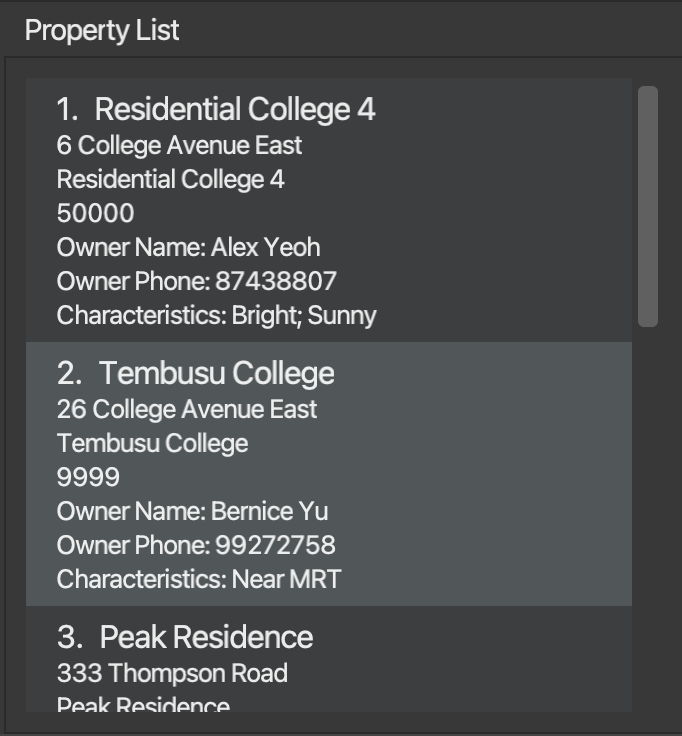

Cobb is a **Contact and Property Management System** that aims to help property agents and brokers manage their customer
base and properties, as well as match and gain actionable insights from stored data. As property agents, you can make use
of Cobb's flexible **filtering and sorting** systems to understand key demographics of your customer base. Cobb's **tagging** system
allows you to organise entries in your database into defined categories. Finally, make use of Cobb's **matching** systems
to match-make buyers and properties or vice-versa, boosting sales potential.

The only tools you need to make use of the full suite of capabilities Cobb has to offer are your hands and a keyboard.

This **user guide** aims to provide an in-depth overview of how to set up, use, and debug Cobb. Take a look at the [command summary](#command-summary)
section for a quick overview of the different commands along with how to use them, or dive into the [quick start](#quick-start)
section to get started. 

:exclamation: **Note:**
Be sure to check out the [key definitions](#key-definitions) section of the guide if you are confused
by any of the terms used!

* Table of Contents
{:toc}

--------------------------------------------------------------------------------------------------------------------

## Quick start

1. Ensure you have Java `11` or above installed in your Computer. This [link](https://docs.oracle.com/en/java/javase/11/install/overview-jdk-installation.html#GUID-8677A77F-231A-40F7-98B9-1FD0B48C346A)
   (external link to Oracle) provides a step-by-step installation guide for Java, if needed.

2. Download the latest `cobb.jar` from our [release page](https://github.com/AY2223S1-CS2103T-F12-1/tp/releases).

3. Copy the file to the folder you want to use as the _home folder_ for Cobb. All data will be created and stored
   within this directory.

4. Double-click the file to start the app. A window similar to the below should appear in a few seconds. Note how the application contains some sample data. 
   

Congratulations! Cobb is now set up and ready to work on your system.

If you encounter any bugs during the setup process, do check out the [FAQ](#faq) section of this guide, which hopefully
contains some information that can help you diagnose your issue.

:exclamation: **Caution:**
On first launch, Cobb will create a few files that have the extension `.json` in its *home directory*. These files are used
by Cobb to store its data. **Edit these at your own risk**, as Cobb will start with an empty database if it detects any
error in the formatting of the data in these files.

## Key definitions

This section aims to define some terms that pop up throughout the user guide. These terms are used often, so it would be 
good to take note of them before continuing.

### Command-specific terms
1. **Command**: A piece of instruction that a user types into the command input box to instruct Cobb's behaviour.
   Commands have many variations, and can serve many purposes.
2. **Syntax**: The manner in which is a command is to be typed. Can be thought of as the "format" of the command.
3. **Parameter**: An input to a command. Can be thought of as a piece of information a user provides that determines the
   behaviour of a specific command.
4. **Command string**: The text that forms the command.
5. **Flag**: A marker that signifies the start of a parameter to a command. For Cobb, in the command `findbuyer -k Tim`, 
   `-k` is the flag, and `Tim` is the parameter.
6. **Fuzzy**: A flag that signifies loose filtering, that is, given a set of filter requirements, any user that matches at least one
   the given requirements will be returned.
7. **Strict**: A flag that signifies tight filtering, that is, given a set of filter requirements, any user matching all of the
   given requirements will be returned.
8. **Ascending**: Related to order; from low to high or minimum to maximum.
9. **Descending**: Related to order; from high to low or maximum to minimum. 

### Person-specific terms
1. **Name**: The name of the person.
2. **Phone**: The phone number of the person.
3. **Email**: The email of the person.
4. **Address**: The address of the person.
5. **Price Range**: The price range of properties that a person might consider buying. That is, any property whose price
   falls within this range will be considered by the buyer.
6. **Characteristics**: The characteristics of a property that a person desires. For example, a person that has characteristics
   `bright; sunny` is ideally looking for a property that is also `bright` and `sunny`.
7. **Priority**: The priority of the person. Can be `LOW`, `NORMAL` or `HIGH`.

### Property-specific terms
1. **Name**: The name of the property.
2. **Price**: The price of the property.
3. **Address**: The address of the property.
4. **Description**: A short description of the property.
5. **Characteristics**: The characteristics associated with a property. For example, a property that has characteristics
   `windy; roomy` is both `windy` and `roomy`.
6. **Owner**: The name of the owner of the property.
7. **Phone**: The phone number of the owner of the property.

## Interface Layout

When you launch Cobb, Cobb will appear on your screen as a window containing our user-friendly [Graphical User Interface](https://en.wikipedia.org/wiki/Graphical_user_interface) (GUI). 
Let's take a look at the 4 different components that make up Cobb's GUI.

### 1. Command Input and Output Boxes
You can find them located at the top section of Cobb's GUI.
 
The __command input box__ is located where the placeholder text `Enter command here...` is. 
Clicking on it will allow you to input commands for Cobb to execute. Here are some commands you can test to start with.

* **`listbuyers`** : Lists all buyers in the database, that is, clears any buyer filters currently in place.

* **`addbuyer -n Tim Cook -ph 91234567 -r 1000000-2500000 -a 10 lorong street avenue -c bright; sunny`**: Adds a buyer named "Tim Cook" with phone number "91234567" to the database.
 This buyer has a specified price range, and desired characteristics for the property he wants to buy.

* **`deletebuyer 1`** : Deletes a buyer at index 1 of the current list from the database.

* **`help`** : Displays some help text.

* **`exit`** : Exits the app.

Refer to the [Features](#features) below for details of each command.

The __command output box__ is located directly beneath the _command input box_. Upon execution of any command,
Cobb will display some information regarding the command, regardless of whether the command was successfully or 
unsuccessfully executed.

:exclamation: **Note:**
If a command was not successfully executed, the text within the command input box will turn red.

### 2. Buyer List
You can find the buyer list located at the left section of Cobb's GUI.
 
The __Buyer List__ displays information regarding buyers who are currently stored in Cobb's database.

The buyer list can be filtered and modified using commands given in the [features](#features) section of the guide.

### 3. Property List
You can find the property list located at the right section of Cobb's GUI.
 
The __Property List__ displays information regarding properties that are currently stored in Cobb's database.

The property list can be filtered and modified using commands given in the [features](#features) section of the guide.

### 4. Help Window
This will appear as a separate window, and is not part of the main GUI.

The __help window__ displays a link to Cobb's User Guide, which is this document :)

It appears when you execute the `help` command.

--------------------------------------------------------------------------------------------------------------------

## Features

**:information_source: Notes about the command format:** 

* The first word in the command string specifies which command you are invoking. For example, `help` specifies that you are invoking the `help` command, while `addbuyer -n John Doe` specifies that you are using the `addbuyer` command.

* To specify additional inputs to the command, type the input's flag followed by a space, and then its value. 
  e.g `-n John Doe` will define the input `NAME` to store the value `John Doe`.

* Inputs not contained in any brackets must be passed into the command. 
  e.g. `-n NAME` means that a `-n NAME` input must be specified.

* Inputs contained in square brackets `[]` are optional. 
  e.g. `[-c CHARACTERISTICS]` means that the `-c CHARACTERISTICS` input is optional.

* Inputs that contain angled braces `<>` can only take one of the values within the braces. 
  e.g. `-pr PRIORITY<HIGH, NORMAL, LOW>` means that the `PRIORITY` input can only take values `HIGH`, `NORMAL` or `LOW`.

* Inputs can be in any order. 
  e.g. if the command specifies `[-n NAME] [-ph PHONE NUMBER]`, `[-ph PHONE NUMBER] [-n NAME]` is also acceptable.

* For commands immediately followed by an `INDEX`, it is the index of the entry on the currently visible list that you want to execute the command on.
  Note that if an entry is not currently displayed on the list, then the command cannot be executed on it.
  e.g. `deletebuyer 7`.

* If commands are missing specific parameters required for it to execute, an error message will be displayed that contains 
  information about the syntax of the command and its required parameters.

### Add Commands
#### Adding a buyer to the database: `addbuyer`

Adds a buyer to the database with relevant buyer information. 
Syntax: `addbuyer -n NAME -ph PHONE -e EMAIL -a address [-r PRICE RANGE] [-c CHARACTERISTICS] [-pr PRIORITY<HIGH, NORMAL, LOW>]`

The `-n` flag indicates the buyer's name. 
The `-ph` flag indicates the buyer’s phone number. 
The `-e` flag indicates the buyer’s email. 
The `-a` flag indicates the buyer’s home address. 
The `-r` flag indicates the price range of properties that the buyer can accept, denoted using `-`. 
The `-c` flag indicates the characteristics that the buyer is looking for in a property, separated by `;`. 
The `-pr` flag indicates the priority of the buyer.

:bulb: **Tip:**
The price range, characteristics and priority fields are optional. 
Only the price range and characteristics fields can be reset to "Not Specified" by entering an empty flag e.g. "-c  ".
The priority field will default to "Normal" if the flag is not used.

:bulb: **Note:**
You cannot add duplicate buyers that have the same phone number or email.

Examples: 
`addbuyer -n Tim -ph 87321237 -e tim@gmail.com -a S648234 -pr HIGH`: Adds a buyer named Tim who has high priority. 
`addbuyer -n Jane -ph 89991237 -e jane@gmail.com -a S123456 -r 200000-500000 -c bright; 5-room`: Adds a buyer named Jane who is looking for a "5-room" property that is "bright" and costs between $200000 - $500000.

#### Adding a property to the database: `addprop`

Adds a property to the database along with relevant information. 
Syntax: `addprop -n NAME -p PRICE -a ADDRESS -d DESCRIPTION -o OWNER NAME -ph PHONE [-c CHARACTERISTICS]`

The `-n` flag indicates the property's name. 
The `-p` flag indicates the property’s price. 
The `-a` flag indicates the property’s address. 
The `-d` flag indicates the property’s description. 
The `-o` flag indicates the name of the property owner. 
The `-ph` flag indicates the phone number of the property owner. 
The `-c` flag indicates the characteristics associated with the property. 

:bulb: **Tip:**
The characteristics field is optional and can be reset to "Not Specified" by entering an empty flag.
e.g. `-c  `.

:bulb: **Note:**
You cannot add duplicate properties that have the same address.

Examples:  
`addprop -n Peak Residences -a 333 Thompson Road -p 1000000 -d long property description -o Bob -ph 91234567 -c Toa Payoh; Bright`: Adds a property called "Peak Residences" owned by Bob with a phone number of 91234567.
It is in "Toa Payoh" and "Bright".

### Delete Commands

:exclamation: **Note:**
Note that this command has a slightly different syntax from the usual commands, as a number representing the index of the item that you would like to delete
has to be specified immediately after the command word, instead of using flags.

#### Deleting buyers from the database: `deletebuyer`

Deletes the buyer at the specified index in the list from the database. 
Syntax: `deletebuyer INDEX`

Examples: 
`deletebuyer 5`: Deletes the fifth buyer currently visible on the buyer list.

#### Deleting properties from the database: `deleteprop`

Deletes the property at the specified index in the list from the database. 
Syntax: `deleteprop INDEX`

Examples: 
`deleteprop 5`: Deletes the fifth property currently visible on the property list.

### Edit Commands
#### Edit a buyer entry in the database: `editbuyer`

Edits a buyer’s details with specified information in specified categories. 
Syntax: `editbuyer INDEX [-n NAME] [-ph PHONE] [-e EMAIL] [-a ADDRESS] [-r PRICE RANGE] [-c CHARACTERISTICS] [-pr PRIORITY<HIGH, NORMAL, LOW>]`

The `INDEX` indicates the buyer in the list we are choosing to edit.
The `-n` flag indicates the buyer's new name. 
The `-ph` flag indicates the buyer's new phone number. 
The `-e` flag indicates the buyer's new email. 
The `-a` flag indicates the buyer's new home address. 
The `-r` flag indicates the new price range of properties that the buyer can accept, denoted using `-`. 
The `-c` flag indicates the characteristics that the buyer is looking for in a property, separated by `;`. 
The `-pr` flag indicates the new priority of the buyer.

:bulb: **Tip:**
Only the price range and characteristics fields can be edited to "Not Specified" by entering an empty flag.
e.g. `-c  `.

Examples: 
`editbuyer 3 -n John Doe -e johndoe@yahoo.com -r 40000-50000 -pr HIGH`: Edits buyer at index 3 to have a new name "John Doe", new email "johndoe@yahoo.com", new acceptable price range of $40000 - $500000, and a high priority. 
`editbuyer 1 -c bright; sunny`: Edits buyer at index 1 to have new desired characteristics of "bright" and "sunny".

#### Edit a property entry in database: `editprop`

Edits a property’s details with specified information in specified categories. 
Syntax: `editprop INDEX [-n NAME] [-p PRICE] [-a ADDRESS] [-d DESCRIPTION] [-c CHARACTERISTICS] [-owner OWNERNAME] [-ph PHONE]`

The `INDEX` indicates the property in the list we are choosing to edit.
The `-n` flag indicates the property's new name. 
The `-p` flag indicates the property’s new price. 
The `-a` flag indicates the property’s new address. 
The `-d` flag indicates the property’s new description. 
The `-c` flag indicates the property's new characteristics. 
The `-o` flag indicates the property's owner's new name. 
The `-ph` flag indicates the property's owner's new phone number. 

:bulb: **Tip:**
Only the characteristics fields can be edited to "Not Specified" by entering an empty flag.
e.g. `-c  `.

Examples: 
`editprop 3 -n Hill Residence -a Block 225 -ph 750000`: Edits property at index 3 of the list to have a new name Hill Residence, a new address Block 225 and price 750000.

### List Commands
#### List buyers in database: `listbuyers`

Lists all buyers in the database in the visible list, that is, removes all filters. 
Syntax: `listbuyers`

#### List properties in database: `listprops`

Lists all properties in the database in the visible list, that is, removes all filters. 
Syntax: `listprops`

### Find Commands

:bulb: **Note:**
No flags are used for these commands and the search word is to be supplied directly.

#### Find buyer entry in database: `findbuyers`

Searches through the database and displays all buyers whose names contain the given word (case-insensitive). 
Syntax: `findbuyers WORD`

Examples: 
`findbuyers John`: Looks for all buyers that have “John” in their name. 
`findbuyers John Alice Bob`: Looks for all buyers that have "John Alice Bob" in their name.

#### Find property entry in database: `findprops`

Searches through the database and displays all properties whose names contain the given word (case-insensitive). 
Syntax: `findprops WORD`

Examples: 
`findprops Peak`: Looks for all properties that have “Peak” in their name. 
`findprops Peak Residence Hut`: Looks for all properties that have "Peak Residence Hut" in their name.

### Filter Commands
#### Filter buyers in database (multiple conditions): `filterbuyers`

Filters buyers in the database according to multiple given conditions.

Syntax: `filterbuyers [-p PRICE] [-c CHARACTERISTICS] [-pr PRIORITY<HIGH, NORMAL, LOW>] [-fuzzy]`

The `-p` flag filters buyers with a price range containing the specified price. 
The `-c` flag filters buyers that have all the specified `;`-separated characteristics. 
The `-pr` flag filters buyers according to the specified priority level. 
The `-fuzzy` flag indicates that fuzzy filtering will be applied
- filtered buyers will only need to satisfy one of the conditions supplied (if there are more than one)
- the `-c` flag will filter buyers that have at least one of the specified `;`-separated characteristics rather than all

:bulb: **Tip:**
By default, if multiple conditions are provided, the filter command will filter buyers who match ALL the conditions, unless the `fuzzy` flag is provided.

The `-c` flag will take in `;`-separated characteristics. This means that if we supply the following input: `filterbuyers -c bright; sunny -fuzzy`,
Cobb will match buyers that have either `bright` or `sunny` in their characteristics, that is, these two characteristics
are taken as individual characteristics.

Examples: 
`filterbuyers -p 500000 -c bright; sunny -pr HIGH`: Filters all buyers that have a price range containing $500000 *AND* desired characteristics of bright *AND* sunny *AND* a `HIGH` priority. 
`filterbuyers -p 500000 -c bright; sunny -pr HIGH -fuzzy`: Filters all buyers that have a price range containing $500000 *OR* desired characteristics of bright *OR* sunny *OR* a `HIGH` priority.

#### Filter property in database (multiple conditions): `filterprops`

Filters properties in the database according to multiple given conditions. 
Syntax: `filterprops [-r PRICE RANGE] [-c CHARACTERISTICS] [-o OWNER NAME] [-fuzzy]`

The `-r` flag filters properties with a price within the specified price range. 
The `-c` flag filters properties that have all the specified ";"-separated characteristics. 
The `-o` flag filters properties that have the specified owner. 
The `-fuzzy` flag indicates that fuzzy filtering will be applied
- filtered properties will only need to satisfy one of the conditions supplied (if there are more than one)
- the `-c` flag will filter properties that have at least one of the specified `;`-separated characteristics rather than all.

:bulb: **Tip:**
See above for more information regarding the `-c` and `-fuzzy` flags.

Examples: 
`filterprops -r 500000-1000000 -c bright; sunny -owner GARY`: Filters all properties that have a price in the range $500000 - $1000000 *AND* have characteristics of bright *AND* sunny *AND* is owned by Gary. 
`filterprops -r 500000-1000000 -c bright; sunny -owner GARY -fuzzy`: Filters all properties that have a price in the range $500000 - $1000000 *OR* have characteristics of bright *OR* sunny *OR* is owned by Gary.

### Sort Commands
#### Sort buyers in database: `sortbuyers`

Sorts buyers in the database according to a single given condition. 
Syntax: `sortbuyers [-n NAME<ASC/DESC>] [-r PRICE RANGE<ASC/DESC>] [-pr PRICE<ASC/DESC>] [-t ENTRY TIME<ASC/DESC>]`

The `-n` flag indicates to sort buyers by name in ascending or descending order. 
The `-r` flag indicates to sort buyers by price range in ascending (by lower bound) or descending order (by upper bound). 
The `-pr` flag indicates to sort buyers by priority level in ascending or descending order. 
The `-t` flag indicates to sort buyers by entry time in ascending or descending order. 

Examples: 
`sortbuyers -pr DESC`: Sorts buyers from `HIGH` priority level to `LOW` priority level. 
`sortbuyers -r ASC`: Sorts buyers according to the lower price bound in ascending order. 
`sortbuyers -t ASC`: Sorts buyers according to the time of entry from least recent to most recent.

#### Sort properties in database: `sortprops`

Sorts properties in the database according to a single given condition.

Syntax: `sortprops [-n NAME<ASC/DESC>] [-p PRICE<ASC/DESC>] [-t ENTRY TIME<ASC/DESC>]`

The `-n` flag indicates to sort properties by name in ascending or descending order. 
The `-p` flag indicates to sort properties by price in ascending or descending order. 
The `-t` flag indicates to sort properties by entry time in ascending or descending order.

Examples: 
`sortprops -p DESC`: Sorts properties from highest to lowest price. 
`sortprops -t ASC`: Sorts properties by time of entry from least recent to most recent.

### Match Commands
#### Match specified buyer to properties: `matchbuyer`

Intelligently matches a buyer in the database to all properties that they might be interested in.
These properties must be within the buyer's price range and satisfy at least one of the buyer's characteristics.

Syntax: `matchbuyer INDEX [-strict]`

The `INDEX` indicates which buyer in the list we are choosing to match. 
The `-strict` flag indicates to reduce the matches to only properties that match *all* the buyer's characteristics. 

Examples: 
`matchbuyer 5 -strict`: Matches buyer 5 to existing properties in the database based on price range and all desired characteristics.

#### Match specified property to buyers: `matchprop`

Intelligently matches a property in the database to all buyers who might be interested in that property.
These buyers must be able to accept the property's price and desire at least one of the property's characteristics.

Syntax: `matchprop INDEX [-strict]`

The `INDEX` indicates which property in the list we are choosing to match. 
The `-strict` flag indicates to reduce the matches to only buyers that desire *all* the property's characteristics. 

Examples: 
`matchprop 5`: Matches property 5 to existing buyers in the database based on price and at least one characteristic.

### Exiting the program: `exit`

Exits Cobb (closes the program).

Format: `exit`

### Viewing help: `help`

Displays a window containing a link for you to access Cobb's User Guide for further help.

Syntax: `help`

### Saving the data

Cobb's data is saved in the hard disk automatically after any command that changes the data. There is no need to save manually.

### Editing the data file

Cobb's data is saved as 2 separate JSON files `[JAR file location]/data/buyerbook.json` and `[JAR file location]/data/propertybook.json`. Advanced users are welcome to update data directly by editing these data files.

:exclamation: **Caution:**
If your changes to the data file makes its format invalid, Cobb will discard all data and start with a sample data file at the next run.

--------------------------------------------------------------------------------------------------------------------

## FAQ

**Q**: How do I transfer my data to another computer? 
**A**: Install the app in the other computer and overwrite the empty data file it creates with the file that contains the data of your previous Cobb home folder.
Alternatively, copy and paste the data file with the *same name* from your old computer.

**Q**: Help! I can't seem to get a command to work... 
**A**: Refer to the [features](#features) section of our guide for command information and syntax. Make sure that you have supplied all necessary parameters for the command and specified parameter flags in a correct manner.

**Q**: How do I run the app if double-clicking the jar file does nothing?  
**A**: Take a look at the [quick start](#quick-start) section of the guide for setup information. For the more technically inclined, try running this command in the jar file's home directory: `java -jar cobb.jar` 
If the problem persists, please report the bug to us.

**Q**: I deleted my data file! Is there any way to recover the data that I lost? 
**A**: Unfortunately, there is no way for you to recover your data after you have deleted it. However, we are working on a way to make data persist in the future, so stay tuned!

**Q**: How do I uninstall Cobb?  
**A**: We are sad to see you go :( Cobb is not installed onto your hard drive, so you only need to delete the `cobb.jar` file as well as any associated data files.

**Q**: I don't understand some terms used in the guide... 
**A**: Do check out the [key definitions](#key-definitions) portion of the guide and see if the term that you are confused about is documented there!

--------------------------------------------------------------------------------------------------------------------

## Command Summary

| Action                | Format, Examples                                                                                                                                                                                                                              |
|-----------------------|-----------------------------------------------------------------------------------------------------------------------------------------------------------------------------------------------------------------------------------------------|
| **Add buyer**         | `addbuyer -n NAME -ph PHONE -e EMAIL -a address [-r PRICE RANGE] [-c CHARACTERISTICS] [-pr PRIORITY<HIGH, NORMAL, LOW>]`   e.g. `addbuyer -n Tim -ph 87321237 -e tim@gmail.com -a S648234 -pr HIGH`                                        |
| **Add property**      | `addprop -n NAME -p PRICE -a ADDRESS -d DESCRIPTION -o OWNER NAME -ph PHONE [-c CHARACTERISTICS]`   e.g.`addprop -n Peak Residences -a 333 Thompson Road -p 1000000 -d long property description -o Bob -ph 91234567 -c Toa Payoh; Bright` |
| **Delete buyer**      | `deletebuyer INDEX`   e.g. `deletebuyer 5`                                                                                                                                                                                                 |
| **Delete property**   | `deleteprop INDEX`   e.g. `deleteprop 5`                                                                                                                                                                                                   |
| **Edit buyer**        | `editbuyer INDEX [-n NAME] [-ph PHONE] [-e EMAIL] [-a ADDRESS] [-r PRICE RANGE] [-c CHARACTERISTICS] [-pr PRIORITY<HIGH, NORMAL, LOW>]`  e.g.,`editbuyer 3 -n John Doe -e johndoe@yahoo.com -r 40000-50000 -pr HIGH`                       |
| **Edit property**     | `editprop INDEX [-n NAME] [-p PRICE] [-a ADDRESS] [-d DESCRIPTION] [-c CHARACTERISTICS] [-owner OWNERNAME] [-ph PHONE]`  e.g., `editprop 3 -n Hill Residence -a Block 225 -ph 750000`                                                      |
| **List buyers**       | `listbuyers`                                                                                                                                                                                                                                  |
| **List properties**   | `listprops`                                                                                                                                                                                                                                   |
| **Find buyers**       | `findbuyers WORD`   e.g. `findbuyers John`                                                                                                                                                                                                 |
| **Find properties**   | `findprops WORD`   e.g. `findprops Heng Mui Keng`                                                                                                                                                                                          |
| **Filter buyers**     | `filterbuyers [-p PRICE] [-c CHARACTERISTICS] [-pr PRIORITY<HIGH, NORMAL, LOW>] [-fuzzy]`   e.g. `filterbuyers -p 500000 -c bright; sunny -pr HIGH -fuzzy`                                                                                 |
| **Filter properties** | `filterprops [-r PRICE RANGE] [-c CHARACTERISTICS] [-o OWNER NAME] [-fuzzy]`   e.g. `filterprops -r 500000-1000000 -c bright; sunny -owner GARY -fuzzy`                                                                                    |
| **Sort buyers**       | `sortbuyers [-n NAME<ASC/DESC>] [-r PRICE RANGE<ASC/DESC>] [-pr PRICE<ASC/DESC>] [-t ENTRY TIME<ASC/DESC>]`   e.g. `sortbuyers -pr DESC`                                                                                                   |
| **Sort properties**   | `sortprops [-n NAME<ASC/DESC>] [-p PRICE<ASC/DESC>] [-t ENTRY TIME<ASC/DESC>]`   e.g. `sortprops -p DESC`                                                                                                                                  |
| **Match buyers**      | `matchbuyer INDEX [-strict]`   e.g. `matchbuyer 1 -strict`                                                                                                                                                                                 |
| **Match properties**  | `matchprop INDEX [-strict]`   e.g. `matchprop 1`                                                                                                                                                                                           |
| **Exit Cobb**         | `exit`                                                                                                                                                                                                                                        |
| **Get help**          | `help`                                                                                                                                                                                                                                        |
