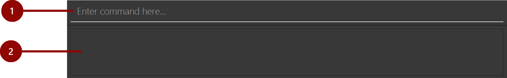
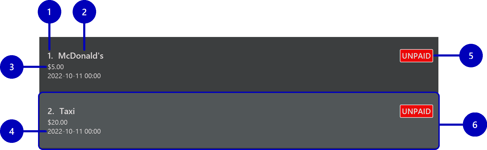
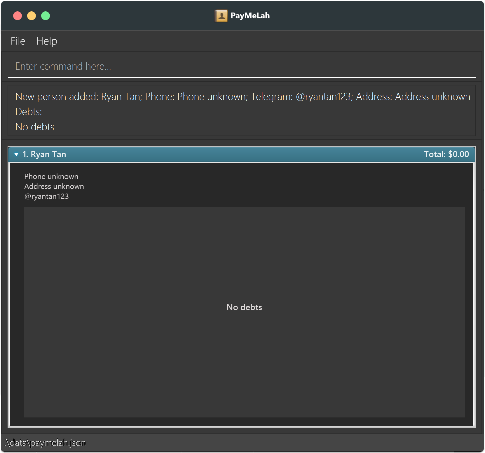
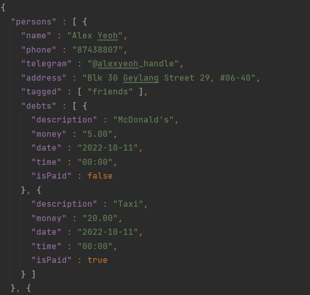

Welcome to the PayMeLah user guide!

Are you a NUS student who stays on campus and enjoys organising or participating in group buys? Do you struggle with **remembering** who is involved in each group order, **calculating** how to split the bill and **tracking** which of your friends are still yet to pay you back?

PayMeLah is a desktop app for solving all these problems and more! PayMeLah can **keep track of** and **manage the debts** your friends owe you. It can even **do simple calculations** for you, such as adding GST or splitting debts amongst your friends. What’s more, it is optimised for you to do everything **from just your keyboard**! This way, you can seamlessly switch between managing your debts and acing your assignments without even needing your mouse. Save time on the nitty-gritties of organising group buys so that you can be more productive! :+1:

### Using this guide
If you are a new user looking to get started with PayMeLah, this user guide can help you with [the installation process](#tutorial-installing-paymelah), guide you through [adding your first debt to PayMeLah](#tutorial-adding-your-first-debt), and familiarise you with how to use all of [PayMeLah’s features](#features).

For a full overview of everything this guide has to offer, do make use of the [Table of Contents](#table-of-contents)!

Additionally, for our advanced users, we have a special section just for you! Click [here](#advanced-features) if you want to learn tricks such as [keyboard shortcuts](#keyboard-shortcuts) or [direct data file management](#features-for-data-management) that can further improve your efficiency when using PayMeLah.

Finally, here are some of the symbols and text formatting to look out for as you make use of this guide:

:bulb: **Tips:** Blue boxes contain additional information that may be useful for enhancing your PayMeLah experience.

:exclamation: **Warnings:** Yellow boxes contain important warnings.

|          Text Formatting           | Meaning                                            |
|:----------------------------------:|----------------------------------------------------|
| [Hyperlink to Glossary](#glossary) | Clickable hyperlink to navigate to another section |
|           `command text`           | Text relevant to PayMeLah user commands            |
|          <kbd>Ctrl</kbd>           | A keyboard key                                     |

--------------------------------------------------------------------------------------------------------------------

## Table of Contents

* Table of Contents
{:toc}

--------------------------------------------------------------------------------------------------------------------

## Quick start
### Tutorial: Installing PayMeLah

Getting started with PayMeLah is easy! Here is a tutorial on how to get PayMeLah up and running in just **4 simple steps**.

1. Firstly, to run the PayMeLah application, you will need to have *Java 11* or above [installed](https://www.baeldung.com/java-check-is-installed) on your computer ([Mac](https://www.geeksforgeeks.org/how-to-install-java-on-macos/), [Windows](https://phoenixnap.com/kb/install-java-windows)).

2. Next, you will need to prepare an [**empty folder**](https://www.wikihow.com/Make-a-New-Folder-on-a-Computer) to download PayMeLah to.

3. Now, you will need to visit [**this link**](https://github.com/AY2223S1-CS2103T-W13-3/tp/releases) to click and download the latest version of *PayMeLah.jar*. Make sure to download it to the folder you created in step 2!  
     
     

4. Finally, you are ready to use PayMeLah. Simply double-click the *PayMeLah.jar* in the folder you created to start the app. After a few seconds, you should see PayMeLah appear. Notice how we have some sample persons and debts present for you to experiment with our [features](#features).   

  

Now, you must be curious as to how to navigate and use PayMeLah. Let’s continue to learn how to [navigate the application](#tutorial-navigating-the-application) before familiarising yourselves with the [features](#features) you can use in PayMeLah.

[Return to Table of Contents](#table-of-contents)

--------------------------------------------------------------------------------------------------------------------

### Tutorial: Navigating the application

* PayMeLah uses a [Command Line Interface (CLI)](#glossary-command-line-interface-cli) - which means that you perform actions by entering [commands](#glossary-command) for PayMeLah to carry out. If you want to find out more on how to make use of commands, you can jump ahead to the [command format section](#about-the-command-format).
* Once a command has been successfully carried out, PayMeLah will display the results accordingly.
* Refer to the diagrams in the following pages to find out about the different components of PayMeLah that are responsible for receiving commands, displaying results, and more!

Each section is made of several components which will be explained in the following pages.

#### Command Line Section

This is the section where you can **enter [commands](#glossary-command)** for PayMeLah, and where the **messages from PayMeLah are displayed**.

| Number | Component Name | Details                                                                                                                                               |
|:------:|----------------|-------------------------------------------------------------------------------------------------------------------------------------------------------|
|   1.   | Command box    | The box where you enter commands for PayMeLah to carry out.                                                                                           |
|   2.   | Message box    | The box where a success message will be displayed when PayMeLah carries out a command successfully, or an error message when PayMeLah fails to do so. |

#### Person List Section

This is the section showing the **list of persons** added to PayMeLah. **Click a person's name** to display their _person card_: a box containing their **person details** as well as their **list of debts**.

| Number | Component Name  | Details                                                    |
|:------:|-----------------|------------------------------------------------------------|
|   1.   | Person Index    | The index of the person in the person list.                |
|   2.   | Name            | The person’s name.                                         |
|   3.   | Phone Number    | The person’s phone number.                                 |
|   4.   | Telegram Handle | The person’s Telegram handle.                              |
|   5.   | Tags            | The tags attached to the person.                           |
|   6.   | Address         | The person’s address.                                      |
|   7.   | Person Card     | A box containing the person's details and their debt list. |
|   8.   | Total Debt      | The total amount of money owed by the person.              |

#### Debt List Section

This is the section showing **details about each [debt](#glossary-debt) of a person**.

| Number | Component Name | Details                                     |
|:------:|----------------|---------------------------------------------|
|   1.   | Debt Index     | The index of the debt in the debt list.     |
|   2.   | Description    | The debt’s description.                     |
|   3.   | Money          | The amount of money owed for the debt.      |
|   4.   | Date/Time      | The date and time of the debt.              |
|   5.   | Payment Status | The debt’s payment status (paid or unpaid). |
|   6.   | Debt Card      | A box containing the debt's details.        |

:exclamation: **Caution:**
If your provided inputs are too long, PayMeLah may not be able to fully display them and cut them off! While this is rare, do try to avoid entering unnecessarily long inputs to PayMeLah (e.g. save a person's nickname rather than their full name).

[Return to Table of Contents](#table-of-contents)

--------------------------------------------------------------------------------------------------------------------

### Tutorial: Adding your first debt

Once you have familiarised yourself with PayMeLah’s [user interface](#tutorial-navigating-the-application), it is time to officially start using PayMeLah! The following section provides a step-by-step guide that walks you through the process of **adding a debt** to PayMeLah in **3 simple steps**. You can choose to follow the sample [commands](#glossary-command) word-for-word, or if you are feeling adventurous, you can try replacing the sample [inputs](#glossary-input) with your own inputs instead.

The guide begins on the following page!

1. If you are a first time user, your PayMeLah may still be filled with the sample data that came with the [installation process](#tutorial-installing-paymelah). You can **remove all the sample data** with a single [`clear` command](#clearing-all-entries-clear), which you can do by simply entering `clear`. Don’t worry about losing this data - they are unlikely to be useful to you! Soon, your PayMeLah will be filled with the information you actually want instead. 

    You should see that the [person list](#person-list-section) is now empty.

   

2. You can now **add your first person** to PayMeLah with the [`add` command](#adding-a-person-add). The example we will use in this section is `add n/Ryan Tan tele/ryantan123`. Entering this command will add a person named `Ryan Tan` with `ryantan123` as his Telegram handle into PayMeLah. 

    You should see that the [person card](#person-list-section) for `Ryan Tan` is now visible in the [person list](#person-list-section). You can click on his name to expand his person card, as per the picture below. However, he does not have any [debts](#glossary-debt) associated with him just yet!

   

3. You are now ready to **add a debt** to `Ryan Tan` using the [`adddebt` command](#adding-a-debt-adddebt)! This time, the example we will use is `adddebt 1 d/mcdonalds m/9.80`. Entering this command will add a [debt](#glossary-debt) of `$9.80` with the description `mcdonalds` to the 1st person in the [person list](#person-list-section), who happens to be `Ryan Tan`. 

    You should see that the person card for `Ryan Tan` should now be updated. Congratulations! You have just added your first debt to PayMeLah!

   

Of course, this is not yet the end of your journey with PayMeLah - there are still several other commands you may require while using PayMeLah, including commands such as [`deletedebt`](#deleting-a-debt-deletedebt) and [`find`](#locating-persons-by-inputs-find). You can find out more about these commands in the [features](#features) section below.

[Return to Table of Contents](#table-of-contents)

## Features

### Parts of a command

As you have learnt in the [navigation section](#tutorial-navigating-the-application), PayMeLah uses a [CLI](#glossary-command-line-interface-cli) to fulfill your needs. Let's take a closer look at what a [command](#glossary-command) consists of!

INSERT IMAGE

* **Command Phrase** 
  The first word in the [command](#glossary-command) is the **command phrase** that specifies which command will be carried out by PayMeLah.
  (add reference to pic)

* **Inputs** 
  These are **additional information to be supplied by you**. Check out [input behaviours](#general-input-behaviour) to learn more about how you should type them out! 
  (add reference to pic)

* **Prefixes** 
  To separate inputs that represent different information, you should precede inputs with their respective **[prefixes]((#glossary-prefix))** that end with a `/`.  
  (add reference to pic)

### How to read command formats

In this user guide, we will provide you with the format of each command. All you have to do is to follow the format while replacing the necessary parts with your own inputs! 
This section will guide you on how to interpret the formats given, so that you can be a master at commanding PayMeLah!

* **User Supplied Inputs** 
  Words in diamond brackets `<>` are **inputs to be supplied by you**. 
  e.g. in `add n/<name>`, `<name>` is an input which can be used as `add n/John`.

* **Optional Inputs** 
  Inputs in square brackets `[]` are **optional**. 
  e.g. for `add n/<name> [t/<tag>]…`, the following usages are both acceptable: `add n/Alan Poe t/theatre kid`, `add n/Alan Poe`.
  
* **Repeatable Inputs** 
  Inputs with `…` can be used **multiple times**, but remember to separate each usage with a space character in between. 
  e.g. in `adddebt <person index…>`, `<person index…>` is an input which can be used as `adddebt 1` or as `adddebt 1 2`. 
  e.g. in `add n/<name> [t/<tag>]…`, `[t/<tag>]…` is a pair of prefix and input which can be used as `add n/Alan t/Poet` or as `add n/Alan t/Poet t/Friend`.

:exclamation: **Caution:**
Be very careful with how a command is formatted! If the `…` is found within the diamond brackets `<>` that correspond to an input as in `<person index…>`, then only the input itself is to be repeated. However, if the `…` is found outside the `<>` as in `[t/<tag>]…`, then both the prefix and input must be repeated. Read the 2 examples above carefully to see the difference.

### General input behaviour

Just like words in human languages, inputs for PayMeLah commands follow certain rules. Do keep these in mind so that PayMeLah can understand your commands! 

* **Order of Inputs** 
  Inputs can be in **any order**. 
  e.g. if the command specifies `d/<description> m/<money>`, `m/<money> d/<description>` is also acceptable.

* **Extra Inputs** 
  If an input is expected only once in the command, but you specified it multiple times, **only the last occurrence of the input will be used**. 
  e.g. if the command requires `p/<phone number>` and you specify `p/12341234 p/56785678`, only `p/56785678` will be taken. This is useful for correcting a wrong input without having to use backspace.

* **Ignored Inputs** 
  Any inputs for commands that do not accept inputs will be **ignored**. 
  e.g. entering `help 123` will be equivalent to entering `help`, as it does not accept any inputs.

:exclamation: **Caution:**
Avoid giving irrelevant inputs to commands that do not accept those inputs. For example, `mark` expects a `<person index>` input and a `debt/<debt index…>` input, but not a `t/<tag>` input. Giving such inputs may cause unexpected behaviour in PayMeLah!

#### Input-specific behaviour

* **Inputting Dates** 
  Whenever `<date>` is specified as an input, you should express it in the format `yyyy-mm-dd` where `y` is year, `m` is month and `d` is day. 
  e.g. September 5 2022 should be input as `2022-09-05`.

* **Inputting Time** 
  Whenever `<time>` is specified as an input, you should express it in the format `hh:mm` where `h` is the hour in 24h clock format, and `m` is the minute. 
  e.g. 5:15PM should be input as `17:15` as per 24h clock notation.

* **Inputting Monetary Values** 
  Whenever `<money>` is specified as an input, you should express the amount in dollars and cents. You can also let PayMeLah help you with calculations by ending with `+` to add GST (7%), or `++` to add both Service Charge (10%) and GST (7%) to the amount specified. **All calculated values are automatically rounded up to the nearest cent.** 
  e.g. when you input `2.00++`, PayMeLah will interpret the amount with Service Charge and GST added, i.e. `2.36`.

[Return to Table of Contents](#table-of-contents)

--------------------------------------------------------------------------------------------------------------------

### Features for General Utility

#### Viewing help: `help`

**What it does:** 
This [command](#glossary-command) provides you with a link to our online user guide.

**When to use:** 
When you are unsure of how to perform an action while using PayMeLah, you can use this command to access this user guide!

**Format:** 
`help`

--------------------------------------------------------------------------------------------------------------------

#### Undoing a command: `undo`

**What it does:** 
This [command](#glossary-command) undoes the most recent command that modified PayMeLah's data.

**When to use:** 
When you accidentally enter a wrong command and want to revert the changes made, this is the command to use!

**Format:** 
`undo`

**Additional information:** 
After you undo a command, PayMeLah will automatically display the full [person list](#person-list-section) for you to check whether the correct changes have been reverted. Be careful though, your undo history will be gone when you close the app!

:exclamation: **Caution:**
The undo history of PayMeLah will only save your 10 most recent commands! Make sure to check the [person list](#person-list-section) regularly if you are entering many commands in one session!

#### Clearing all entries: `clear`

**What it does:** 
This [command](#glossary-command) clears all data from PayMeLah.

**When to use:** 
When you want to start afresh with an empty [person list](#person-list-section), this is the command to use!

**Format:** 
`clear`

:bulb: **Tip:**
If you accidentally run this command, don't worry! You can use the `undo` command to easily get your data back.

--------------------------------------------------------------------------------------------------------------------

#### Exiting the program: `exit`

**What it does:** 
This [command](#glossary-command) closes the PayMeLah application.

**When to use:** 
When you want to close PayMeLah using your keyboard (rather than your mouse), this is the command to use!

**Format:** 
`exit`

:bulb: **Tip:**
You can also click the ❌ button at the top of the PayMeLah window. There is no difference, and both methods exit PayMeLah safely.

[Return to Table of Contents](#table-of-contents)

--------------------------------------------------------------------------------------------------------------------

### Features for Managing Persons

#### Adding a person: `add`

**What it does:** 
This [command](#glossary-command) adds a person to PayMeLah.

**When to use:** 
When you want to start tracking [debts](#glossary-debt) owed by a particular person, you can use this command to first add that person (and some of their particulars, like their phone number or Telegram handle) to PayMeLah.
After adding the person to PayMeLah, you can [add debts](#adding-a-debt-adddebt) to them for tracking.

**Format:** 
`add n/<name> [p/<phone number>] [tele/<telegram>] [a/<address>] [t/<tag>]…`

:bulb: **Tip:**
A person can have any number of tags (including 0).

**Additional information:** 
* You can only have 1 person of a certain `name`. This means you *cannot* store 2 `Isaac Lee`s with different phone numbers in PayMeLah.

**Examples:** 
* `add n/John Doe p/98765432 tele/johndoe a/John street, block 123, #01-01` will add a person named `John Doe` with `98765432` as his phone number, `johndoe` as their Telegram handle and `John street, block 123, #01-01` as their address to PayMeLah.
* `add n/Betsy Crowe t/friend a/Newgate Prison t/police` will add a person named `Betsy Crowe` with `Newgate Prison` as their address and both `friend` and `police` as their tags to PayMeLah.

#### Editing a person: `edit`

**What it does:** 
This [command](#glossary-command) edits an existing person in PayMeLah.

**When to use:** 
When a person’s particulars in PayMeLah have changed (e.g. phone number or Telegram handle), you can use this command to update them!

**Format:** 
`edit <[person index](#glossary-person-index)> [n/<name>] [p/<phone number>] [tele/<telegram>] [a/<address>] [t/<tag>]…`

**Additional information:** 
* Edits the person at the specified `<person index>` in the currently displayed [person list](#person-list-section).
* At least one of the [optional fields](#optional-input) must be provided.
* Pre-existing values will be updated to the input values.
* You can remove all the person’s tags by typing `t/` without
  specifying any tags after it.

**Examples:** 
*  `edit 1 p/91234567 tele/johndoe` will edit the phone number and Telegram handle of the 1st person to be `91234567` and `@johndoe` respectively.
*  `edit 2 n/Betsy Crower t/` will edit the name of the 2nd person to be `Betsy Crower` and clear all their existing tags.

#### Deleting a person: `delete`

**What it does:** 
This [command](#glossary-command) deletes the specified person from PayMeLah.

**When to use:** 
When you no longer need to track [debts](#glossary-debt) for a particular person, you can use this command to remove them from PayMeLah.

**Format:** 
`delete <[person index](#glossary-person-index)>`

**Additional information:** 
* Deletes the person at the specified `<person index>` of the currently displayed [person list](#person-list-section).

**Examples:** 
* `list` followed by `delete 2` deletes the 2nd person in the address book.
* `find n/Betsy` followed by `delete 1` deletes the 1st person in the results of the `find` command.

[Return to Table of Contents](#table-of-contents)

--------------------------------------------------------------------------------------------------------------------

### Features for Managing Debts

#### Adding a debt: `adddebt`

**What it does:** 
This [command](#glossary-command) adds a [debt](#glossary-debt) to a person in PayMeLah for you to track. Specifying multiple persons will add a copy of this debt to each person specified.

**When to use:** 
When you want PayMeLah to keep track of a debt for one particular person, or the same debt for multiple persons, this is the command to use!

**Format:** 
`adddebt <[person index](#glossary-person-index)…> d/<description> m/<money> [date/<date>] [time/<time>]`

:bulb: **Tip:**
You can tell PayMeLah to add Service Charge and GST to the amount of money specified by including `++` at the back of the amount. A single `+` will add only GST instead.

:bulb: **Tip:**
You might find it difficult to find the index of a specific person when your list gets long. In this situation, you may want to make use of the [`find` command](#locating-persons-by-inputs-find) or [`finddebt` command](#locating-persons-by-debt-description-finddebt) to shorten the list and make it easier to find and figure out the index of the person that you are looking for.

(Continued on next page!)

**Additional information:** 
* If you specify **neither date nor time**, the date and time will conveniently default to the current date and time.
* If you specify **only the time but not the date**, the date will conveniently default to the current date.
* If you specify **only the date but not the time**, the time will default to midnight.

:exclamation: **Caution:**
Be very careful! The default behaviour is slightly different across the different combinations of whether you provided date and time inputs.

**Example:** 
* `adddebt 3 d/McDonalds m/8.9` will add a debt with the current date and time to the 3rd person in the [person list](#person-list-section). This debt is worth `$8.90` and has the description `McDonalds`.
* `adddebt 1 4 d/chicken rice m/10++ date/2022-10-12 time/13:00` will add debts with `2022-10-12` and `13:00` as the date and time respectively to **both** the 1st person and 4th person. These debts require Service Charge and GST to be added to an initial price of `$10`, and will be recorded with the description `chicken rice`. Note that PayMeLah will automatically calculate the money for both debts and display the amounts as `$11.77`.

#### Splitting a debt: `splitdebt`

**What it does:** 
This [command](#glossary-command) splits a [debt](#glossary-debt) evenly among several persons in PayMeLah for you to track.

**When to use:** 
When you want to divide a group expense equally between multiple persons, you can use this command to let PayMeLah help you with the calculations and keep track of their debts!

**Format:** 
`splitdebt <[person index](#glossary-person-index)…> d/<description> m/<money> [date/<date>] [time/<time>]`

:bulb: **Tip:**
You can split a debt among as many persons as you want. You can even include yourself with the special person index `0`. But you cannot split a debt between just yourself.

:bulb: **Tip:**
You might find it difficult to find the index of a specific person when your list gets long. In this situation, you may want to make use of the [`find` command](#locating-persons-by-inputs-find) or [`finddebt` command](#locating-persons-by-debt-description-finddebt) to shorten the list and make it easier to find and figure out the person index of the person that you are looking for.

:bulb: **Tip:**
Splitting a debt is just like [adding a debt](#adding-a-debt-adddebt) to multiple persons; however, here we divide the money of the debt over the persons who shared it (and round up to the closest cent). Thus, you can similarly tell PayMeLah to add Service Charge and GST to the amount of money specified by including `++` at the back of the amount. A single `+` will add only GST instead.

(Continued on next page!)

**Additional information:** 
* If you specify **neither date nor time**, the date and time will conveniently default to the current date and time.
* If you specify **only the time but not the date**, the date will conveniently default to the current date.
* If you specify **only the date but not the time**, the time will default to midnight.

:exclamation: **Caution:**
Be very careful! The default behaviour is slightly different across the different combinations of whether you provided date and time inputs.

**Examples:** 
* `splitdebt 1 2 d/Pizza m/33.99` will add debts with the current date and time to the 1st and 2nd person in the [person list](#person-list-section). This debt has the description `Pizza`and is worth `$33.99` in total before being divided by 2, over the 1st person and the 2nd person. Note that PayMeLah will automatically calculate the money for both debts and display the amounts as `$17.00`.
* `splitdebt 0 2 5 d/KFC chicken bucket m/30+ date/2022-10-12` will add debts with `2022-10-12` and with the default `00:00` as the date and time respectively to **both** the 2nd person and 5th person. These debts will be recorded with the description `KFC chicken bucket` and require GST to be added to an initial total price of `$30` before dividing the costs by 3, over yourself, the 2nd person and the 5th person. Note that PayMeLah will automatically calculate the money for both debts and display the amounts as `$10.70`.

#### Deleting a debt: `deletedebt`

**What it does:** 
This [command](#glossary-command) deletes the specified [debts](#glossary-debt) from a person in PayMeLah. Specifying multiple debts will delete those debts from the person specified.

**When to use:** 
When you no longer need to track some particular debt(s) owed by a person, you can use this command to remove them from PayMeLah!
You can also [mark a debt as paid without deleting it](#marking-debts-as-paid-mark) if you still wish to keep track of it.

**Format:** 
`deletedebt <[person index](#glossary-person-index)> debt/<debt index…>`

**Example:** 
* `deletedebt 2 debt/2 3` will delete the 2nd and 3rd debt, regardless of paid or unpaid, of the 2nd person in the current displayed [person list](#person-list-section).

--------------------------------------------------------------------------------------------------------------------

#### Clearing debts: `cleardebts`

**What it does:** 
This [command](#glossary-command) clears all of a person's [debts](#glossary-debt) from PayMeLah.

**When to use:** 
When you no longer need to keep track of any debts of a person, you can use this command to clear their [debt list](#debt-list-section)! If you want to stop keeping track of only some of a person's debts, you can [delete specific debts](#deleting-a-debt-deletedebt).

**Format:** 
`cleardebts <[person index](#glossary-person-index)>`

:bulb: **Tip:**
You might find it difficult to find the index of a specific person when your list gets long. In this situation, you may want to make use of the [`find` command](#locating-persons-by-inputs-find) or [`finddebt` command](#locating-persons-by-debt-description-finddebt) to shorten the list and make it easier to find and figure out the person index of the person that you are looking for.

**Example:** 
* `cleardebts 3` will delete all the debts, regardless of paid or unpaid, from the 3rd person in the current displayed [person list](#person-list-section).

#### Marking debts as paid: `mark`

**What it does:** 
This [command](#glossary-command) marks the [debts](#glossary-debt) specified from a person in PayMeLah as paid. Specifying multiple debts will mark all those debts as paid.

**When to use:** 
When you want to indicate that a particular debt has been paid, but still keep a record of it in PayMeLah, this is the command to use!

**Format:** 
`mark <[person index](#glossary-person-index)> debt/<[debt index](#glossary-debt-index)…>`

**Example:** 
* `mark 2 debt/2 3` will mark the 2nd and 3rd debt of the 2nd person in the current displayed [person list](#person-list-section) as paid.

--------------------------------------------------------------------------------------------------------------------

#### Marking debts as unpaid: `unmark`

**What it does:** 
This [command](#glossary-command) marks the [debts](#glossary-debt) specified from a person in PayMeLah as unpaid. Specifying multiple debts will mark all those debts as unpaid.

**When to use:** 
When you realise that a debt you had previously [marked as paid](#marking-debts-as-paid-mark) is actually not paid yet, you can use this command to indicate that it is still unpaid.

**Format:** 
`unmark <[person index](#glossary-person-index)> debt/<[debt index](#glossary-debt-index)…>`

**Example:** 
* `unmark 2 debt/2 3` will mark the 2nd and 3rd debt of the 2nd person in the current displayed [person list](#person-list-section) as unpaid.

#### Getting the statement: `statement`

**What it does:** 
This [command](#glossary-command) gets a statement of the total value of [debts](#glossary-debt) you are owed by everyone in the displayed [person list](#person-list-section).

**When to use:** 
When you want to quickly find out the total amount of money you are owed, you can use this command to let PayMeLah do the calculations for you!

**Format:** 
`statement`

**Additional information:** 
The statement will only sum up the debts that are marked as unpaid from the list that is currently displayed. This means that if you have shortened the list using the [`find` command](#locating-persons-by-inputs-find) or [`finddebt` command](#locating-persons-by-debt-description-finddebt), the statement will only sum up the debts that are marked as unpaid from the shortened list.

**Example:** 
`statement` displays "You are owed $583.90 in total." when there are 2 persons in the displayed [person list](#person-list-section), who owe you $100 and $483.90 respectively.

[Return to Table of Contents](#table-of-contents)

--------------------------------------------------------------------------------------------------------------------

### Features for Searching

#### Locating persons by inputs: `find`

**What it does:** 
This [command](#glossary-command) finds and displays persons who match all the given search conditions.

**When to use:** 
When you are looking for specific person(s) in PayMeLah, you can use this command to filter the displayed [person list](#person-list-section)!

**Format:** 
`find [n/<name>] [p/<phone number>] [tele/<telegram>] [a/<address>] [t/<tag>]…
[d/<description>] [m/<money>] [above/<money>] [below/<money>]
[date/<date>] [before/<date>] [after/<date>] [time/<time>]`

The following table is a summary of all the [inputs](#glossary-input) this command can accept as search conditions:

| Input              | Description                                                                                                 | Examples                                                                                                                  |
|--------------------|-------------------------------------------------------------------------------------------------------------|---------------------------------------------------------------------------------------------------------------------------|
| `n/<name>`         | Looks for persons who have names containing `<name>`                                                        | `find n/rob` will find persons named `Robin Jones` and `Grobert Smith`                                                    |
| `p/<phone number>` | Looks for persons who have the phone number `<phone number>`                                                | `find p/91234567` will find persons with the phone number `91234567`                                                      |
| `tele/<telegram>`  | Looks for persons by the Telegram handle `<telegram>`                                                       | Either `find tele/juliaw` or `find tele/@juliaw` will find persons with the Telegram handle `@juliaw`                     |
| `a/<address>`      | Looks for persons who have addresses containing `<address>`                                                 | `find a/main` will find persons living at `123 Main St` or `456 Main Ave`                                                 |
| `t/<tag>`          | Looks for persons who have the tag `<tag>`                                                                  | `find t/buddy t/roommate` will find persons with _both_ the `buddy` and `roommate` tags                                   |
| `d/<description>`  | Looks for persons who owe money for a [debt](#glossary-debt) described by `<description>`                   | `find d/McDonald's` will find persons who owe money for `McDonald's`                                                      |
| `m/<money>`        | Looks for persons who owe money for a [debt](#glossary-debt) with the monetary value `<money>`              | `find m/10` will find persons with a debt in their [debt list](#debt-list-section) worth exactly `$10.00`                 |
| `above/<money>`    | Looks for persons who owe money for a [debt](#glossary-debt) above or equal to the monetary value `<money>` | `find above/11` will find persons with a debt in their [debt list](#debt-list-section) worth above or equal to `$11.00`   |
| `below/<money>`    | Looks for persons who owe money for a [debt](#glossary-debt) below or equal to the monetary value `<money>` | `find below/9` will find persons with a debt in their [debt list](#debt-list-section) worth below or equal to `$9.00`     |
| `date/<date>`      | Looks for persons who owe money for a [debt](#glossary-debt) on the given `<date>`                          | `find d/2022-10-31` will find persons with a debt in their [debt list](#debt-list-section) on `2022-10-31`                |
| `before/<date>`    | Looks for persons who owe money for a [debt](#glossary-debt) before or on the given `<date>`                | `find before/2022-10-30` will find persons with a debt in their [debt list](#debt-list-section) on or before `2022-10-30` |
| `after/<date>`     | Looks for persons who owe money for a [debt](#glossary-debt) after or on the given `<date>`                 | `find after/2022-10-31` will find persons with a debt in their [debt list](#debt-list-section) on or after `2022-10-31`   |
| `time/<time>`      | Looks for persons who owe money for a [debt](#glossary-debt) at the given `<time>`                          | `find time/11:00` will find persons with a debt in their [debt list](#debt-list-section) at `11:00`                       |

**Additional information:** 
* The ordering of the search condition inputs in the command does not matter.
* At least one input must be provided, `find` cannot work with no inputs.

##### Combining inputs to `find`

When you provide multiple search condition inputs to `find`, only persons matching all conditions will be shown to you.

Additionally, do note that when multiple search conditions filter for persons by a [debt](#glossary-debt) in their [debt list](#debt-list-section), PayMeLah will show you persons with at least one debt that matches all the inputs.

Examples:
* `find n/hans p/81234567` will match `Hansel` or `Hans Gruber` if his phone number is `81234567`.
* `find d/burger n/hans` will match `Hansel` if he owes money for `burger`.
* `find d/burger m/10` will match anyone who owes `$10.00` for `burger`.
* `find above/10 below/20 d/fries` will match anyone who owes between `$10.00` and `$20.00` inclusive for `fries`.
* `find before/2022-11-30 after/2022-11-01 time/11:00` will match anyone who owes money for something at `11:00` during the month of November 2022.
* `find tele/janesmith above/10 below/20 before/2022-11-30 after/2022-11-01` will match anyone with the Telegram handle `@janesmith` who owes between `$10.00` and `$20.00` inclusive for something during the month of November 2022.

#### Locating persons by debt description: `finddebt`

**What it does:** 
This [command](#glossary-command) finds and displays persons who owe any [debts](#glossary-debt) that match any of the given keywords.

**When to use:** 
When you do not remember the exact description of a debt you want to look for (e.g. was it `KFC meal` or just `kfc`?), this is the command to use!

**Format:** 
`finddebt <keyword…>`

**Additional information:** 
* The ordering of the search keywords does not matter. e.g. the keywords `Sharing Meal` will match `Meal Sharing`.
* Only the descriptions of the debts are searched for the keywords.
* Only full words will be matched e.g. `Burger` will not match `Burgers`.
* Persons with debts matching at least one keyword will be displayed.
  e.g. `burger meal` will display persons associated with debts that have descriptions `Chicken Burger` or `Meal Sharing`.

**Examples:** 
* `finddebt Burger` displays persons associated with debts that have descriptions `burger` or `Chicken Burger`.
* `finddebt burger meal` displays persons associated with debts that have descriptions `Chicken Burger` or `Meal Sharing`. 

#### Listing all persons: `list`

**What it does:** 
This [command](#glossary-command) displays the full [person list](#person-list-section) in PayMeLah.

**When to use:** 
When you have previously filtered the displayed [person list](#person-list-section) (using commands such as `[find](#locating-persons-by-inputs-find)` and `[finddebt](#locating-persons-by-debt-description)`) and want to view the full list again, this is the command to use!

**Format:** 
`list`

--------------------------------------------------------------------------------------------------------------------

#### Listing debtors: `listdebtors`

**What it does:** 
This [command](#glossary-command) shows a list of all persons that owe you more than or equal to a certain amount of money in PayMeLah. If no amount is provided, a list of persons who owe any amount of [debt](#glossary-debt) is displayed.

**When to use:** 
When you want to quickly find out who owes you significant amounts of money, this is the command to use!

**Format:** 
`listdebtors [m/<money>]`

**Example:** 
`listdebtors m/10` displays the list of persons that owe more than $10.00.

#### Sorting list of persons: `sort`

**What it does:** 
This [command](#glossary-command) sorts and displays the [person list](#person-list-section) using the given criterion and order.

**When to use:** 
When you want to organise your data in PayMeLah, you can use this command to arrange the [person list](#person-list-section) in an order you like!

**Format:** 
`sort <criterion prefix><order>`

**Additional information:** 
You can use the following criterion prefixes to sort by the respective criterion:
* `n/` - Name of person
* `m/` - Total amount of money owed by person
* `date/` - Time since date of the oldest debt owed by person

Do note that you can only sort by exactly one criterion at a time.

Use the following symbols after the criteria prefix to indicate the order of sorting:
* `+` - Ascending order
* `-` - Descending order

:bulb: **Tip:**
When you sort by "Time since oldest debt", all persons who do not owe any debts will be placed at the end of the list, regardless of whether ascending or descending order is specified.

**Example:** 
`sort n/+` sorts and displays the [person list](#person-list-section) in ascending alphabetical order of their names.

[Return to Table of Contents](#table-of-contents)

--------------------------------------------------------------------------------------------------------------------

## Advanced Features

Rest assured that the information in this section is **optional**!

This following section is meant for advanced users of PayMeLah who are already comfortable with the basic features and are looking to further increase their efficiency in using PayMeLah. If you are a new user still getting used to PayMeLah, don't worry about reading this section yet. You can always come back to this section in the future after gaining more experience!

### Keyboard shortcuts

Although you can use the mouse to help navigate PayMeLah, it can be faster if you do not have to lift your hand from your keyboard at all. This is where keyboard shortcuts will come in handy for **speeding up your navigation** of the application.

The table on the next page lists every keyboard shortcut currently available in PayMeLah!

|                Keyboard Key                 | Function                                                                                                                                                                                                                                                                                                                                                                                                                                                                   |
|:-------------------------------------------:|----------------------------------------------------------------------------------------------------------------------------------------------------------------------------------------------------------------------------------------------------------------------------------------------------------------------------------------------------------------------------------------------------------------------------------------------------------------------------|
|               <kbd>Tab</kbd>                | **Scrolling down the [person list](#person-list-section):**  When you are in the command box, press <kbd>Tab</kbd> twice to navigate to the person list. Once you are in the person list, you can use <kbd>Tab</kbd> to continue moving down the list. Pressing <kbd>Tab</kbd> again after reaching the end of the list will return you to the command box.                                                                                                             |
|      <kbd>Shift</kbd> + <kbd>Tab</kbd>      | **Scrolling up the [person list](#person-list-section):**  Same as <kbd>Tab</kbd> but moves up in the opposite direction instead.                                                                                                                                                                                                                                                                                                                                       |
|              <kbd>Space</kbd>               | **Navigating a [person card](#person-list-section):**  When you are in the [person list](#person-list-section), use <kbd>Space</kbd> to expand or close the person card you are currently on. After opening the person card, pressing <kbd>Tab</kbd> followed by <kbd>Space</kbd> will navigate you to the person’s [debt list](#debt-list-section). Once you are done viewing the person's debt list, you can press <kbd>Tab</kbd> again to return to the person list. |
|  <kbd>PageUp</kbd> and <kbd>PageDown</kbd>  | **Moving to another [person card](#person-list-section):**  When you are in the [person list](#person-list-section), use <kbd>PageUp</kbd> and <kbd>PageDown</kbd> to move up or down the list while simultaneously opening each person card as you move. When you are in a person's [debt list](#debt-list-section), use <kbd>PageUp</kbd> and <kbd>PageDown</kbd> to move up or down the debt list.                                                                   |
| <kbd>UpArrow</kbd> and <kbd>DownArrow</kbd> | **Moving to another [person card](#person-list-section):**  Similar to <kbd>PageUp</kbd> and <kbd>PageDown</kbd>, but they do not simultaneously open each person card you move through.                                                                                                                                                                                                                                                                                |
|               <kbd>Home</kbd>               | **Jumping to the top of the [person list](#person-list-section):**  When you are in the [person list](#person-list-section), press the <kbd>Home</kbd> key to jump to the first person in the person list. When you are in a person's [debt list](#debt-list-section), press the <kbd>Home</kbd> key to jump to the first debt in the debt list.                                                                                                                        |
|               <kbd>End</kbd>                | **Jumping to the bottom of the [person list](#person-list-section):**  When you are in the [person list](#person-list-section), press the <kbd>End</kbd> key to jump to the last person in the person list. When you are in a person's [debt list](#debt-list-section), press the <kbd>End</kbd> key to jump to the last debt in the debt list.                                                                                                                         |

[Return to Table of Contents](#table-of-contents)

--------------------------------------------------------------------------------------------------------------------

### Features for Data Management

#### Saving your data

Your computer automatically saves PayMeLah data after any [command](#glossary-command) that changes it. There is no need to save manually! Within the folder you saved your PayMeLah, you might have noticed that there is a _data_ folder. As the name suggests, your PayMeLah data is saved in a _paymelah.json_ file within that folder.

:bulb: **What is a JSON file?** 
A [JSON file](https://fileinfo.com/extension/json) is a common type of file used by many applications to store data in a format easily readable and editable by advanced users.

#### Editing your data file

You can actually update the data in PayMeLah without even launching the application! To **save time**, advanced users are welcome to update data by directly editing _paymelah.json_.

Here is a quick tutorial on editing the data file:

1. Double-click on the _paymelah.json_ file to open it. 
   You should see some text similar to the following (don't worry if the words in your file appear to be in a different colour, it does not matter): 
   

2. You can now edit the data by changing any of the green words you see here in our example image! Do ensure that your replacement words are surrounded by double-inverted commas (`" "`), as per the image above.

:exclamation: **Warning:** 
Make sure your edits still follow the [requirements of each input](#input-specific-behaviour)! For example, if you edit the date, it should still be in the `yyyy-mm-dd` format. 

If the data file fails to follow the required format, PayMeLah will **discard all data** and start with an empty data file the next time you launch it. This is **irreversible**! As such, please edit the data file directly only if you are very confident in what you are doing.

[Return to Table of Contents](#table-of-contents)

--------------------------------------------------------------------------------------------------------------------

## FAQ

**Q1**: Do I **need to save** my data manually? 
**A**: Nope! You don't have to worry about saving your data manually at all! PayMeLah automatically saves your data for you. If you are interested to learn more, you can head to the [saving your data](#saving-your-data) section.

--------------------------------------------------------------------------------------------------------------------

**Q2**: How do I **transfer my data** to PayMeLah on another computer? 
**A**: Here is a simple 4-step guide to transfer your data!

1. Find your current data file. By default, it should be a `paymelah.json` file found in your `data` folder. See more under [saving your data](#saving-your-data).

1. [Install PayMeLah](#tutorial-installing-paymelah) on your new computer!

1. Launch PayMeLah on your new computer, then exit the application.

1. You should now see a `data` folder within the folder that you saved PayMeLah. Enter the `data` folder and replace the `paymelah.json` file in your new computer with your `paymelah.json` file from your old computer.

The next time you launch PayMeLah on your new computer, your data should be updated to reflect the data in your old computer!

**Q3**: I **can't find something** that I know I have added to PayMeLah. Where did it go? 
**A**: If you are trying to locate a person, try using the [`find` command](#locating-persons-by-inputs-find)! When searching for names, the `find` command displays partial matches, so it will find `Bobby` even if you search for `bob`. 
If you are trying to locate a debt without knowing its full description, consider using the [`finddebt` command](#locating-persons-by-debt-description-finddebt) instead. 

:bulb: **Other Tips:**  
1. You can try [combining inputs](#combining-inputs-to-find) to refine your search, but sometimes, you cannot find something because you may have misremembered a detail like the date, or keyed it into PayMeLah wrongly by accident. In this situation, you may want to consider not making your search too specific, or using `before/` and `after/` inputs to search around a date instead of on that specific date.  
2. As a last resort, the [`list` command](#listing-all-persons-list) will list every person in PayMeLah. You can then [sort the list](#sorting-list-of-persons-sort) to make it easier to manually check through the list. If you still cannot find the person or debt you are looking for in the full [person list](#person-list-section) displayed by `list`, then unfortunately it means the item you are looking for is not in PayMeLah.

--------------------------------------------------------------------------------------------------------------------

**Q4**: PayMeLah is **not letting me use the command** I want! What can I do? 
**A**: Oh no! Calm down - let's troubleshoot together. First, head to the [Command Summary](#command-summary) section to make sure you are using the command in the correct format. You can also click on the links there to read more about the specifics of each command. If PayMeLah continues to misbehave, do drop us an email at [paymelah.app@gmail.com](mailto:paymelah.app@gmail.com), and we will do our best to help you as soon as possible!

--------------------------------------------------------------------------------------------------------------------

**Q5**: Why **can't PayMeLah do _this_?** 
**A**: We are so sorry that PayMeLah does not support this feature at the moment :( However, PayMeLah is a constant work in progress and we hope to deliver the features that you are looking for in the near future! In the meantime, feel free to drop us feedback at [paymelah.app@gmail.com](mailto:paymelah.app@gmail.com) so that we can better understand and serve your needs :)

[Return to Table of Contents](#table-of-contents)

--------------------------------------------------------------------------------------------------------------------

## Glossary

| Term                                                                                 | Description                                                                                                                                                                                  |
|--------------------------------------------------------------------------------------|----------------------------------------------------------------------------------------------------------------------------------------------------------------------------------------------|
| _Command_                                         | An instruction for PayMeLah to execute. All commands start with a [_command phrase_](#glossary-command-phrase) followed by any [_inputs_](#glossary-input) the command may require.          |
| _Command Line Interface (CLI)_ | The method by which you instruct PayMeLah to perform tasks, which is by entering [_commands_](#glossary-command) into the [_command box_](#command-line-section).                            |
| _Command phrase_                           | The name of the instruction for PayMeLah to execute. For example, [`list`](#listing-all-persons-list) is the _command phrase_ to show the list of persons added to PayMeLah.                 |
| _Debt_                                               | A transaction event (e.g. group purchase, shared Grab food order) where someone owes you money. By default, it is marked as unpaid until you [mark it as paid](#marking-debts-as-paid-mark). |
| _Debt index_                                   | The number that appears next to each [_debt_’s](#glossary-debt) description in a person’s [_debt list_](#debt-list-section).                                                                 |
| _Enter[ing]_ a command                 | Type the [_command_](#glossary-command) into the [_command box_](#command-line-section), and press the <kbd>Enter</kbd> key.                                                                 |
| _Index_                                             | The number that appears next to each person’s name or each [_debt_’s](#glossary-debt) description.                                                                                           |
| _Input_                                             | Additional information supplied by you that is used to run a [_command_](#glossary-command).                                                                                                 |
| _Keyboard shortcut_                     | A key or sequence of keys which you may press to perform actions without your mouse.                                                                                                         |
| _Person index_                               | The number that appears next to each person’s name in the current displayed [_person list_](#person-list-section).                                                                           |
| _Prefix_                                           | A short piece of text indicating what type of information follows. For example, `n/` is the prefix that indicates that what follows is a name.                                               |

[Return to Table of Contents](#table-of-contents)

--------------------------------------------------------------------------------------------------------------------

## Command Summary

### Summary for general utility

| *Actions for*   [**General Utility**](#features-for-general-utility) | Format, Examples |
|-------------------------------------------------------------------------|------------------|
| [**Help**](#viewing-help-help)                                          | `help`           |
| [**Undo**](#undoing-a-command-undo)                                     | `undo`           |
| [**Clear**](#clearing-all-entries-clear)                                | `clear`          |
| [**Exit**](#exiting-the-program-exit)                                   | `exit`           |

[Return to Table of Contents](#table-of-contents)

--------------------------------------------------------------------------------------------------------------------

### Summary for managing persons

| *Actions for*   [**Managing Persons**](#features-for-managing-persons) | Format, Examples                                                                                                                                                            |
|---------------------------------------------------------------------------|-----------------------------------------------------------------------------------------------------------------------------------------------------------------------------|
| [**Add person**](#adding-a-person-add)                                    | `add n/<name> p/<phone number> tele/<telegram> a/<address> [t/<tag>]…`   e.g. `add n/James Ho p/22224444 tele/James_H0 a/123, Clementi Rd, 1234665 t/friend t/colleague` |
| [**Edit person**](#editing-a-person-edit)                                 | `edit <person index> [n/<name>] [p/<phone number>] [tele/<telegram>] [a/<address>] [t/<tag>]…`  e.g.`edit 2 n/James Lee tele/James_L33`                                  |
| [**Delete person**](#deleting-a-person-delete)                            | `delete <person index>`  e.g. `delete 3`                                                                                                                                 |

[Return to Table of Contents](#table-of-contents)

--------------------------------------------------------------------------------------------------------------------

### Summary for managing debts

| *Actions for*   [**Managing Debts**](#features-for-managing-debts) | Format, Examples                                                                                                                                       |
|-----------------------------------------------------------------------|--------------------------------------------------------------------------------------------------------------------------------------------------------|
| [**Add debt**](#adding-a-debt-adddebt)                                | `adddebt <person index…> d/<description> m/<money>`   e.g. `adddebt 3 d/Chicken Rice m/4`                                                           |
| [**Split debt**](#splitting-a-debt-splitdebt)                         | `splitdebt <person index…> d/<description> m/<money> [date/<date>] [time/<time>]`   e.g. `splitdebt 1 2 d/Pizza m/33.99 date/2022-10-12 time/13:00` |
| [**Delete debt**](#deleting-a-debt-deletedebt)                        | `deletedebt <person index> debt/<debt index…>`   e.g. `deletedebt 2 debt/2 3`                                                                       |
| [**Clear debts**](#clearing-debts-cleardebts)                         | `cleardebts <person index>`   e.g. `cleardebts 3`                                                                                                   |
| [**Mark debts**](#marking-debts-as-paid-mark)                         | `mark <person index> debt/<debt index…>`   e.g. `mark 2 debt/2 3`                                                                                   |
| [**Unmark debts**](#marking-debts-as-unpaid-unmark)                   | `unmark <person index> debt/<debt index…>`   e.g. `unmark 2 debt/2 3`                                                                               |
| [**Get statement**](#getting-the-statement-statement)                 | `statement`                                                                                                                                            |

[Return to Table of Contents](#table-of-contents)

--------------------------------------------------------------------------------------------------------------------

### Summary for searching

| *Actions for*   [**Searching**](#features-for-searching)      | Format, Examples                                                                                                                                                                                                                                       |
|------------------------------------------------------------------|--------------------------------------------------------------------------------------------------------------------------------------------------------------------------------------------------------------------------------------------------------|
| [**Find person**](#locating-persons-by-inputs-find)              | `find [n/<name>] [p/<phone number>] [tele/<telegram>] [a/<address>] [t/<tag>]… [d/<description>]… [m/<money>]…`  `[above/<money>] [below/<money>] [date/<date>]… [before/<date>] [after/<date>] [time/<time>]…`  e.g. `find d/burger above/10.0` |
| [**Find debts**](#locating-persons-by-debt-description-finddebt) | `finddebt <keyword>…`  e.g. `finddebt burger bowling`                                                                                                                                                                                               |
| [**List persons**](#listing-all-persons-list)                    | `list`                                                                                                                                                                                                                                                 |
| [**List debtors**](#listing-all-debtors-listdebtors)             | `listdebtors [m/<money>]`  e.g. `listdebtors m/10`                                                                                                                                                                                                  |
| [**Sort**](#sorting-list-of-persons-sort)                        | `sort <criterion prefix><order>`  e.g. `sort n/+`, `sort m/-`, `sort date/+`                                                                                                                                                                        |

[Return to Table of Contents](#table-of-contents)

--------------------------------------------------------------------------------------------------------------------
