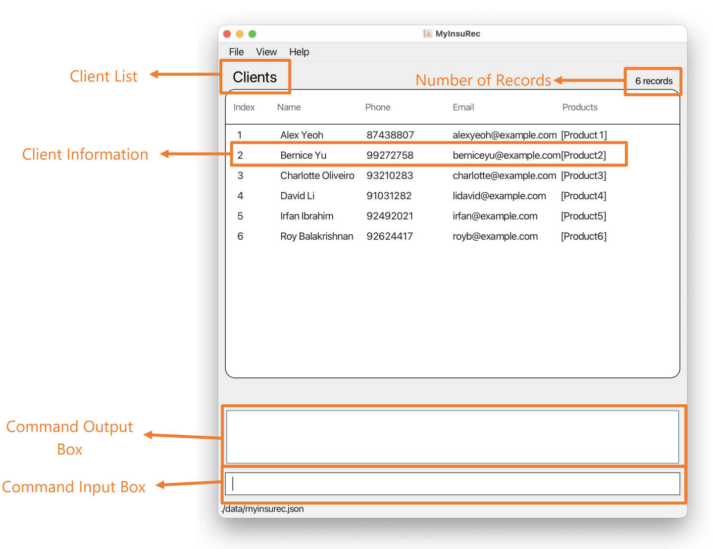
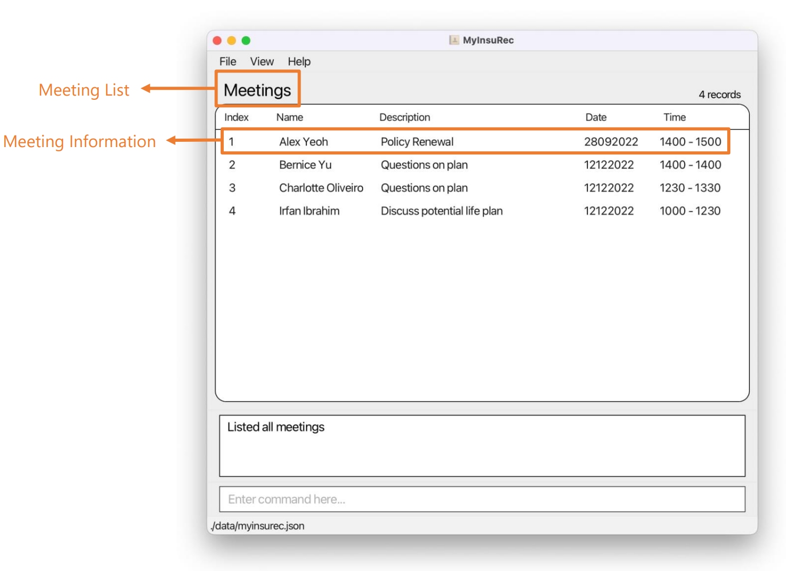
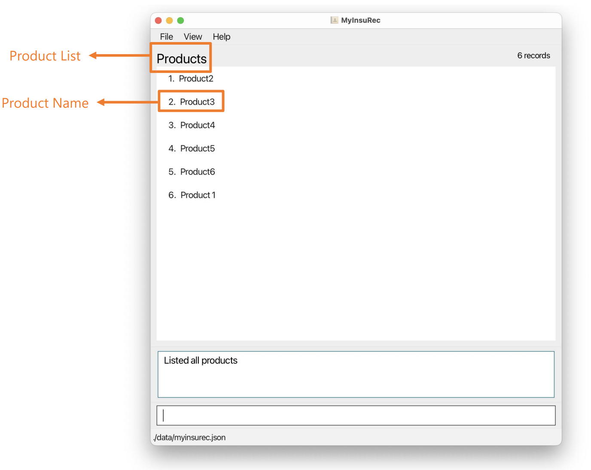
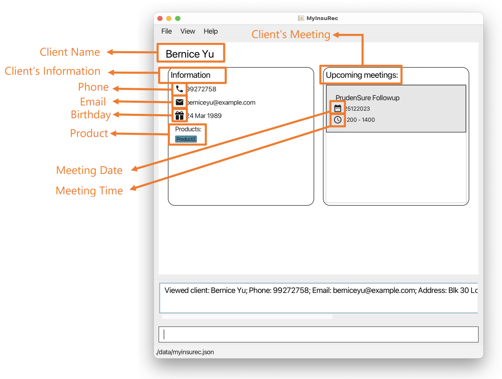
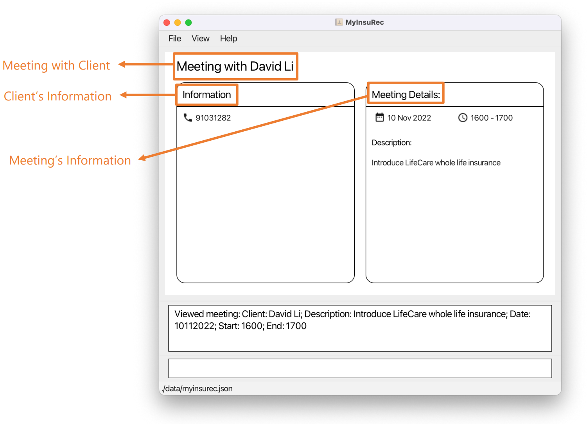
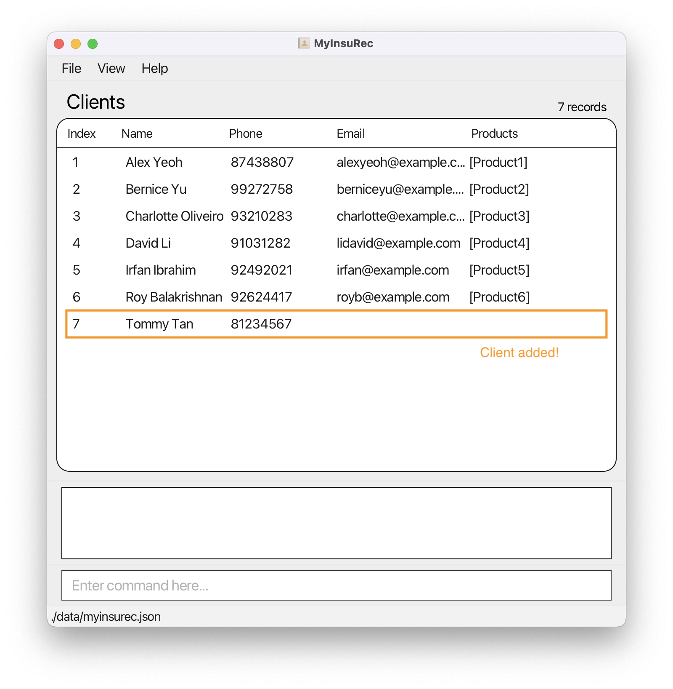
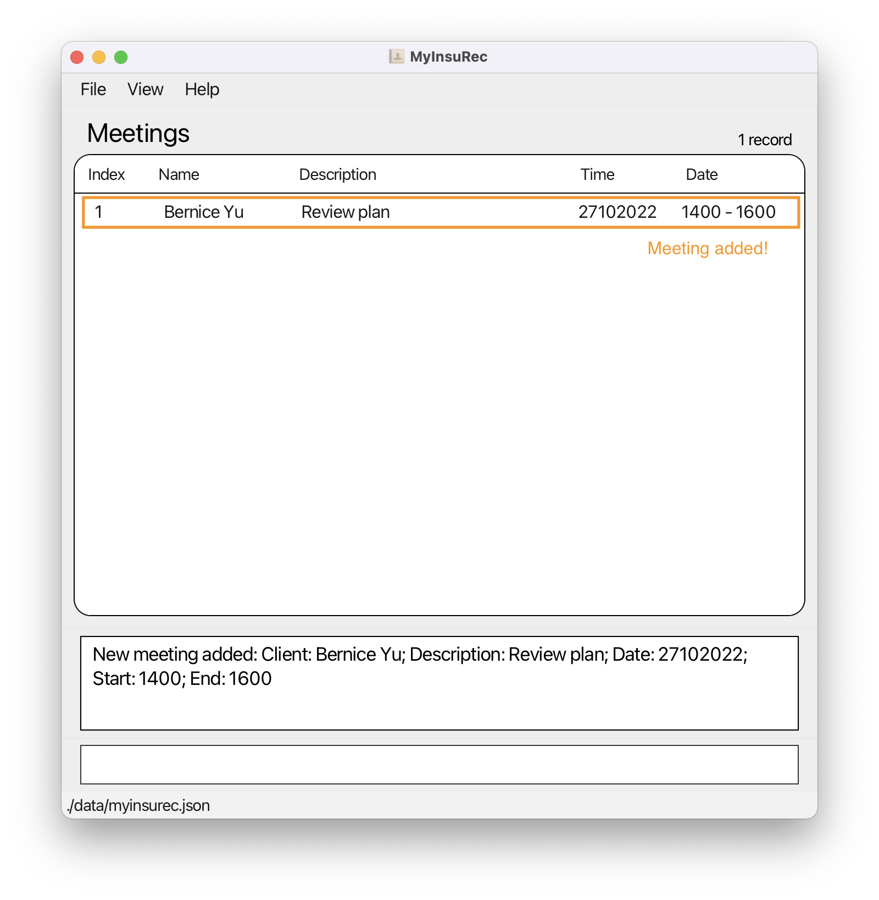

* Table of Contents:
{:toc}

--------------------------------------------------------------------------------------------------------------------

## 1. Introduction

*MyInsuRec* is **the desktop app for financial advisors**. If you are a financial advisor looking for an app to better manage your clients, meetings and products details, then look no further! *MyInsuRec* can boost your productivity with features to quickly look up client and meetings details. Beyond that, *MyInsuRec* also has features to help you improve your relationships with clients.

*MyInsuRec* is optimized for use via a Command Line Interface (CLI) while still having the benefits of a Graphical User Interface (GUI). If you can type fast, *MyInsuRec* can get your client, meeting and product management tasks done faster than traditional GUI apps!

*MyInsuRec* is available for the Windows, macOS and Linux operating systems. To get started, simply head over to the [installation guide](#5-installation-guide). This user guide can also serve as a reference for experienced users, with a convenient [command summary](#9-command-summary).

--------------------------------------------------------------------------------------------------------------------

## 2. How to use this User Guide

Welcome to _MyInsuRec_ User Guide!

Thank you for choosing to use _MyInsuRec_.

This guide smooths the learning curve and helps you learn how to use _MyInsuRec_ effectively.

Before we go on further, look out for these symbols in the User Guide as they provide some important messages you might want to know!

| Symbol               | Meaning                                                                 |
|----------------------|-------------------------------------------------------------------------|
| `command`            | Indicates some command or parameter that can be entered into MyInsuRec. |
| :information_source: | Additional information.                                                 |
| :exclamation:        | Crucial information needed for proper use of MyInsuRec.                 |
| :bulb:               | Tips and tricks.                                                        |

**:information_source: Note:**
If you have **not installed** _MyInsuRec_, you can follow the [installation guide](#5-installation-guide) here!

After you have installed _MyInsuRec_, you can
1. Familiarize yourself with our [terminologies](#3-terminologies) that are used throughout this User Guide.
2. Get to know the [layout of the interface](#4-user-interface) you will be interacting with.
3. Follow this [step-by-step tutorial](#6-quick-start) to learn the basic features of _MyInsuRec_.
4. Check out other advanced features under [features](#7-features) once you got the hang of the basic features.
5. Refer to our [glossary](#11-glossary) when you come across a unfamiliar term used.

**:information_source: Note:**
For **experienced users**, you can look at the [Command Summary](#9-command-summary) for a summarized table of all the commands available.

In the event where you encounter any trouble or issues, refer to our [FAQ section](#8-faq) or feel free to [contact us](#12-contact-us).

We hope that this guide is helpful in smoothing out the learning curve for you!

[Return to the top](#)

--------------------------------------------------------------------------------------------------------------------

## 3. Terminologies

The following subsections explains some terminology and main features of *MyInsuRec*:

### 3.1 Clients

At the heart of *MyInsuRec* is the ability to help you organize and keep track of clients.

You can do client-specific tasks such as:

* **add** a client and their details into *MyInsuRec*.
* **view** a client and their details, such as any upcoming meetings and purchased products.
* **update** a client's details.
* **delete** a client from *MyInsuRec*.

Beyond individual clients, you can also:

* **display** a summarized list of all clients with their important details such as contact number, products bought.
* **filter and display** a summarized list of clients with upcoming birthdays to help boost your customer relations.
* **filter and display** a summarized list of clients who purchased a specific product.

### 3.2 Meetings

*MyInsuRec* eases a financial advisor's mental load by helping them keep track of any upcoming meetings with clients. You can do meeting-specific tasks such as:

* **add** a meeting to a client in *MyInsuRec*.
* **view** a meeting in greater details.
* **update** a meeting's details.
* **delete** a meeting from a client in *MyInsuRec*.

Beyond individual meetings, you can also:

* **display** a summarized list of all meetings with their important details such as meeting date and time.
* **filter and display** a summarized list of upcoming meetings to help facilitate your follow-ups with your clients.

### 3.3 Products

*MyInsuRec* also includes the ability for you to define your products and helps track products your clients have purchased.

You can do product-specific tasks such as:

* **add** a product to *MyInsuRec*.
* **delete** a product from *MyInsuRec*.

Beyond individual products, you can also:

* **display** a summarized list of all products.

[Return to the top](#)

--------------------------------------------------------------------------------------------------------------------

## 4. User Interface

### 4.1 Client List

This is the view after executing the `listClient` command.

### 4.2 Meeting List

This is the view after executing the `listMeeting` command.

### 4.3 Product List

This is the view after executing the `listProduct` command.

### 4.4 Detailed Client List

This is the view after executing the `viewClient` command.

### 4.5 Detailed Meeting View

This is the view after executing the `viewMeeing` command.

[Return to the top](#)

--------------------------------------------------------------------------------------------------------------------

## 5. Installation Guide

### 5.1 System Requirements

Here is everything you need to install and set up *MyInsuRec*. For the best possible experience, we recommend that you use *MyInsuRec* on the following supported operating systems:

* Windows
* macOS
* Linux

You will also require Java 11 or above to run *MyInsuRec*. If you don't already have Java 11 or above on your system, head over to [Oracle's Java download page](https://www.oracle.com/java/technologies/downloads/). To tell if you already have the correct version of Java installed on your system, refer to [10.1 Checking your system's Java version](#10-troubleshooting).

### 5.2 Installation Instructions

To install *MyInsuRec*, simply follow the steps below:

1. Ensure that your system meets the [system requirements](#51-system-requirements).

2. Download the latest **MyInsuRec.jar** from [here](https://github.com/AY2223S1-CS2103T-W16-4/tp/releases).

3. Copy the file to the folder you want to use as the _home folder_ for your MyInsuRec.

4. Double-click the file to start the app. The GUI similar to the below should appear in a few seconds.
   

Ta-da! *MyInsuRec* is now installed on your system.

[Return to the top](#)

--------------------------------------------------------------------------------------------------------------------

## 6. Quick Start

### 6.1 Basic features

Are you new to *MyInsuRec*? This section is the place to start!

Here, we will be guiding you on the basic features of *MyInsuRec* and helping you get familiarized with it.

* When we first launch *MyInsuRec*, *MyInsuRec* will have already been preloaded with some sample data. We will be using this sample data to get familiar with *MyInsuRec*!

* Type in `addClient n/Tommy Tan p/81234567` to add a client named 'Tommy Tan' who has a contact number '81234567'. We will see the list of clients update to include this newly added client, with his phone number! The image below shows *MyInsuRec* after adding Tommy.

**:information_source: Note:**
Both client name and their phone number are **needed** to add the client into *MyInsuRec*.

* Tommy has also given us his email address, his address, as well as his birthday. As such, we would like to update Tommy's record. To do that, we first need to get Tommy's index from the list of clients, which is 7. Type in `editClient i/7 e/tommytan21@gmail.com a/167 Canning Road bd/25081982` and hit enter. Tommy's record in the list of clients will update with the newly inputted details. The image below shows *MyInsuRec* after updating Tommy with the additional details.

* We can also directly add these optional fields (email, address, etc.) when we are adding the client for the first time! So, `addClient n/Tammy Lim p/90127654 e/tammylim@hotmail.com b/09091973` also adds in the client's email and birthday directly.

**:bulb: Tips and tricks:**
See [addClient](#711-adding-a-client-addclient) for more variety of optional fields!

* Now we would like to add in an upcoming meeting with our client 'Bernice Yu' (index 2 in our sample data). We can do that by doing `addMeeting i/2 d/27102022 st/1400 et/1600 dn/Review Product 2` (You can replace `d/27102022` with today's date in the DDMMYYYY format)! When we hit enter, *MyInsuRec* will show us the list of meetings, including the one we just added. The image below shows the list of meetings after adding the meeting with Bernice.

* We would like to get Bernice's contact number and message about her upcoming meeting! We can call `viewMeeting i/1` to help us. This brings up a more detailed view of the meeting, with information such as description of the meeting and Bernice's contact number. The image below shows *MyInsuRec* after using the `viewMeeting` command.

* Now, to go back to the list of clients, simply type in `listClient`. This brings us back to the list of clients. The image below shows the current state of *MyInsuRec* after following all the previous steps.

* Suppose your company introduced a new product 'MyInsureCare' that you are interested to sell, and would like to add it into *MyInsuRec*! We can do so via `addProduct pd/MyInsureCare`. This adds a product 'MyInsureCare' and also brings us to the list of products, including the newly added one. The image below shows *MyInsuRec* after adding the product.

**:bulb: Tips and tricks:**
You can use `listClient`, `listMeeting` and `listProduct` to traverse between the different lists accordingly.

* Now, we want to add a client named who has already purchased 'MyInsureCare'. To do that, we can once again type in `addClient n/Ng Jun Yi p/81230987 pd/MyInsureCare` to add a client and indicate that he has bought 'MyInsureCare'. The image below shows *MyInsuRec* after adding the client with the product.

**:exclamation: Caution:**
Only products added already via `addProduct` can be used! This is to help ensure the cleanliness of *MyInsuRec*. So, add your product via `addProduct` before using it to add a client with that product! See [addProduct](#731-adding-a-product-addproduct).

* Unfortunately 'Alex Yeoh' is no longer our client, and so we want to delete him from our records. To do that, type in `delClient i/1`. The image below shows *MyInsuRec* after deleting the client.

And there we have it! We have just gone through the basic bookkeeping features of *MyInsuRec*. Beyond that, we also have more advanced features such as getting a quick glance of all your upcoming meetings, filtering clients by products. To find out and learn more about these features, head to the [Features section](#7-features) where all the commands and their details can be found.

To get started with a clean state of *MyInsuRec*, type in the command `clear`. This removes all the sample data from *MyInsuRec*, so don't panic if you see that all your data are wiped off!

Welcome to your new and organized life, and happy (financial) advising!

[Return to the top](#)

--------------------------------------------------------------------------------------------------------------------

## 7. Features

This section guides you on how to use features available in *MyInsuRec*. We will lay out the command and parameters needed to use the feature, and show some examples as well as its expected behaviour. We also include some tips and tricks (yay!) on how you can better use the feature and *MyInsuRec*.

**Do take some time to read the following note** to better understand how you can use this section!

**:information_source: Notes about the command format:** 

* Words in `UPPER_CASE` are the parameters to be supplied by you. 
  e.g. in `addClient n/NAME p/PHONE_NUMBER`, `NAME` and `PHONE_NUMBER` are parameters which can be used as `addClient n/John Tan p/12345678`.

* Items in square brackets are optional, while those not in square brackets are compulsory. 
  e.g. `addClient n/NAME p/PHONE_NUMBER [a/ADDRESS] [e/EMAIL] [b/BIRTHDAY] [pd/PRODUCT]` can be used as  
  * `addClient n/John Tan p/12345678`
  * `addClient n/John p/12345678 e/John@abc.com b/12122000`

* This symbol `||` indicates that only one of the optional parameters can be used.  
  **Using more than one optional parameter is strictly not allowed.**  
  e.g. `listClient [pd/PRODUCT || b/BIRTHDAY]` can be used as
  * `listClient pd/Product1`
  * `listClient b/week`

* Parameters can be in any order. 
  e.g. if the command specifies `n/NAME p/PHONE_NUMBER`, `p/PHONE_NUMBER n/NAME` is also acceptable.

* Suppose you entered the same command multiple times, only the last command will be executed.
  e.g. if you specify `viewMeeting i/2viewMeeting i/2viewMeeting i/3`, only `viewMeeting i/3` will be taken.

* If a parameter is expected only once in the command, but you specified it multiple times, only the last occurrence of the parameter will be taken. 
  e.g. if you specify `d/28092022 d/30092022`, only `d/30092022` will be taken.

* Extraneous parameters for commands that do not take in parameters (such as `exit` and `help`) will be ignored. 
  e.g. if the command specifies `exit 123`, it will be interpreted as `exit`.

* Extraneous or incorrect parameters for commands that take in parameters (such as `editClient` and `editMeeting`) will be considered as part of the preceding valid parameter in the command. 
  e.g. if the command is used as `editClient i/1 n/Smith et/1230` where `et/` is the only invalid parameter, the input by preceding valid parameter `n/` will be read as `Smith et/1230`. The input is invalid because it is not alphanumeric.

### 7.1 Client commands

This subsection covers all client-related commands.

#### 7.1.1 Add client: `addClient`

Add a new client to _MyInsuRec_.

Format: `addClient n/NAME p/PHONE_NUMBER [a/ADDRESS] [e/EMAIL] [b/BIRTHDAY] [pd/PRODUCT]`

* A client **must** have a `NAME` and a `PHONE_NUMBER`.
* `EMAIL`, `BIRTHDAY`, `ADDRESS` and `PRODUCT` are optional.
* If a `NAME` already exist in _MyInsuRec_, adding the same `NAME` will result in an error!

Use case:
1. You have just found a potential client! You can use this command to add their particulars into _MyInsuRec_ to help remember their contact information and other details.

**:exclamation: Caution:**
In order to use `pd/PRODUCT` as a parameter, you must have already added that product into MyInsuRec via `addProduct`.
See [addProduct](#731-adding-a-product-addproduct).

Examples:
* Add a client named John Tan and his phone number
  * `addClient n/John Tan p/12345678`
* Same as above, but with his birthday this time
  * `addClient n/John Tan p/12345678 b/12122000`
* Same as above, but with even more details
  * `addClient n/John Tan p/12345678 e/johntan@insurec.com a/123 ABC ROAD, #11-01 pd/Product1`

#### 7.1.2 List clients: `listClient`

Shows the list of clients in MyInsuRec.

A valid filter can also be applied to show a selected list of clients.

Format: `listClient [pd/PRODUCT || b/BIRTHDAY]`

* A valid filter can be clients who have bought the product `PRODUCT` or clients whose birthday is in range `BIRTHDAY`.
* `BIRTHDAY` is specified by keywords. The possible keywords are:
  * `tomorrow` for a list of clients whose birthday is tomorrow;
  * `week` for a list of clients whose birthday is in the next week;
  * `month` for a list of clients whose birthday from the start of the respective month to the end of the respective month..

Use case:
1. You want to find out all your clients with upcoming birthdays so that you can prepare ahead and ensure that every client gets some birthday well wishes!
2. You want to identify the number of clients who purchased a particular product for analytics reasons.

Examples:
* List all clients
  * `listClient`
* List all clients who purchased Product1
  * `listClient pd/Product1`
* List all clients with their birthdays in the next week
  * `listClient b/week`

**:exclamation: Caution:** Both filters cannot exist simultaneously.
A user can only apply one filter at each time. For example, `listClient pd/Product1 b/week` is strictly not allowed.

#### 7.1.3 View client: `viewClient`

View details associated with a client, such as the client's name and phone number.

Format: `viewClient i/INDEX`

* Display information about the client at the specific `INDEX`.
* The `INDEX` refers to the index number shown by executing [`listClient`](#712-list-clients-listclient) command.
* The `INDEX` **must be a positive integer** 1, 2, 3, …​

Use case:
1. View more specific details related to the client such as address and birthday which are not shown in the list of clients. This will help you foster a stronger relationship with your clients because you can wish them happy birthday!

Examples:
* View client with an `INDEX` of 1
  * `viewClient i/1`

#### 7.1.4 Delete client: `delClient`

Delete the specified client from _MyInsuRec_.

Format: `delClient i/INDEX`

* Delete the client at the specified `INDEX`.
* `INDEX` refers to the index number shown by executing [`listClient`](#712-list-clients-listclient) command.
* `INDEX` **must be a positive integer** 1, 2, 3, …​
* If `INDEX` is a non-positive integer or not shown in `listClient`, an error will be shown!

Use case:
1. Suppose your client no longer requires your services and would like you to remove their personal information. You can use this command to remove their details from _MyInsuRec_.

Examples:
* Delete the client with an `INDEX` of 2
  * `delClient i/2`
* Delete the client with an `INDEX` of 6
  * `delClient i/6`

#### 7.1.5 Edit client: `editClient`

Edit details of the specified client.

Format: `editClient i/INDEX [n/NAME] [p/PHONE_NUMBER] [a/ADDRESS] [e/EMAIL] [b/BIRTHDAY] [pd/PRODUCT]`

* Edit the client at the specified `INDEX`.
* `INDEX` refers to the index number shown by executing [`listClient`](#712-list-clients-listclient) command.
* `INDEX` **must be a positive integer** 1, 2, 3, …​
* At least one optional detail must be modified.
* Maintain value of details not edited by the command.

Use case:
1. A client changed his address! Update the client details instead of having to removing the old record and creating a new record.

Examples:

Suppose MyInsuRec contains only one client 'John Tan' having phone number '0123456789':
* Change the name of this client to 'John Smith'
  * `editClient i/1 n/John Smith`
* Add email 'johntan@insurec.com'
  * `editClient i/1 e/johntan@insurec.com`

### 7.2 Meeting commands

This subsection covers all meeting-related commands.

#### 7.2.1 Add meeting: `addMeeting`

Add a new meeting to MyInsuRec.

Format: `addMeeting i/INDEX d/DATE st/START_TIME et/END_TIME dn/DESCRIPTION`

* A meeting contains the `INDEX` of the client in the clients list, the `DATE` and `TIME` for the meeting, and the `DESCRIPTION` of the meeting.
* `INDEX` refers to the number of the client you are meeting with,
as shown by executing the [`listClient`](#712-list-clients-listclient) command.
* `DATE` should be given in the format DDMMYYYY. For example, 01022022 represents
1 February 2022.
* `START_TIME` and `END_TIME` should be give in the format HHMM. For example,
1234 represents the 12:34PM.

Use case:
1. You have just scheduled a meeting with a client! You can use this command to add the details of the meeting into _MyInsuRec_ to help remember the meeting details.

Examples:

Suppose MyInsuRec contains only one client 'Alex':
* Add a meeting with Alex on 28-Sep-2022 from 2PM to 3PM
  * `addMeeting i/1 d/28092022 st/1400 et/1500 dn/Alex's Policy Renewal`

**:bulb: Tips and tricks:**
MyInsuRec can help you detect conflicting meeting times! For example, attempting to add a meeting from 1330 to 1430 when you already have one scheduled for 1300 to 1400 will display an error message.

#### 7.2.2 List meetings: `listMeeting`

Shows the list of meetings in MyInsuRec.

A valid filter can also be applied to show a selected list of meetings.

Format: `listMeeting [d/DATE]`

* A valid filter can be upcoming meetings happening in range `DATE`.
* `DATE` is specified by keywords. The possible keywords are:
  * `tomorrow` for a list of meetings happening tomorrow;
  * `week` for a list of meetings happening in the next week;
  * `month` for a list of meetings happening from the start of the respective month to the end of the respective month.

Use case:
1. Get an overview of all your upcoming meetings. This is especially useful for if you have a busy and packed schedule, and want to ease your mental load of having to recall all of your upcoming meetings!
2. Organize all your meetings in a single place, so you don't have to worry about missing a meeting ever again.

**:bulb: Tips and tricks:**
This command is used to get the index of a meeting. In order to perform commands related to a particular meeting such as `editMeeting`, you will have to first get its index by running `listMeeting`. So, expect to use this command a lot!

Examples:
* List all meetings
    * `listMeeting`
* List meetings happening in the next week
    * `listMeeting d/week`

#### 7.2.3 View meeting: `viewMeeting`

View details associated with a meeting, such as the meeting's date and time.

Format: `viewMeeting i/INDEX`

* Display information about the meeting at the specific `INDEX` and details of the client whom you are meeting.
* The `INDEX` refers to the index number shown by executing [`listMeeting`](#722-list-meetings-listmeeting) command.
* The `INDEX` **must be a positive integer** 1, 2, 3, …

Use Case:
1. Get an overview of the meeting and the client you are meeting with. This helps you become more prepared for the meeting and you will not have to remember every single small detail of the meeting!

Examples:
* View meeting with an `INDEX` of 1
  * `viewMeeting i/1`

#### 7.2.4 Delete meeting: `delMeeting`

Delete a meeting from _MyInsuRec_.

Format: `delMeeting i/INDEX`

* Delete the meeting at the specified `INDEX`.
* `INDEX` refers to the index number shown by executing [`listMeeting`](#722-list-meetings-listmeeting) command.
* `INDEX` **must be a positive integer** 1, 2, 3, …
* If `INDEX` is a non-positive integer or not shown in `listMeeting`, an error will be shown!

Use case:
1. Remove a cancelled meeting.
2. Clean up any meetings that already happened. This helps to reduce clutter in _MyInsuRec_.

Examples:
* Delete meeting with an `INDEX` of 2
  * `delMeeting i/2`

#### 7.2.5 Edit meeting: `editMeeting`

Edit details of the specified meeting.

Format: `editMeeting i/INDEX [d/DATE] [st/START TIME] [et/END TIME] [dn/DESCRIPTION]`

* Edit information about the meeting at the specific `INDEX`.
* `INDEX` refers to the index number shown by executing [`listMeeting`](#722-list-meetings-listmeeting) command.
* `INDEX` **must be a positive integer** 1, 2, 3, …
* If `INDEX` is a non-positive integer or not shown in `listMeeting`, an error will be shown!
* At least one optional detail must be modified.
* Details that are not edited will be kept as is.

Use case:
1. A meeting got pushed back! Update the meeting details instead of having to remove the old record and create a new record.

Examples:
* Edit the description of the meeting with an `INDEX` of 1.
  * `editMeeting i/1 dn/Follow up team meeting`

### 7.3 Product commands

This subsection covers all product-related commands.

#### 7.3.1 Add product: `addProduct`

Add a new product to MyInsuRec.

Format: `addProduct pd/PRODUCT`

* Add a product having name `PRODUCT`.
* A product must have a product name which is `PRODUCT`.
* A product name can only be **alphanumeric** and contain spaces. Other symbols are strictly not allowed.

Use Case:

1. You can define your own insurance products that you sell and tag them to clients who have bought the product. Now, you will not have to worry about forgetting which product the client bought!

Examples:
* Add product with product name of 'Product1'
  * `addProduct pd/Product1`

#### 7.3.2 List products: `listProduct`

Show the list of products in MyInsuRec.

Format: `listProduct`

Use case:
1. Get an overview of all the products you are offering!
2. This feature is used to get the index of a product, which is needed for most product-related commands.

Examples:
* List all products
  * `listProduct`

#### 7.3.3 Delete product: `delProduct`

Delete a product from *MyInsuRec*.
This command removes this product from all the clients as well.

Format: `delProduct i/INDEX`

* Delete the product at the specified `INDEX`.
* `INDEX` refers to the index number shown by executing [`listProduct`](#732-list-products-listproduct) command.
* `INDEX` **must be a positive integer** 1, 2, 3, …
* If `INDEX` is a non-positive integer or not shown in `listProduct`, an error will be shown!

Use case:
1. If you no longer offer this product and no clients have purchased it before, you can remove it from *MyInsuRec* and prevent it from cluttering up *MyInsuRec*!

**:information_source: Note:**
This command is usually preceded by `listProduct`. This is because the product's index number `INDEX` is required to use this command, and `listProduct` shows a list of all the products with their index numbers.

**:exclamation: Caution:**
This feature should only be used if there is a need to delete a product, which is unlikely in most scenarios! Use with caution as this not only removes the product from MyInsuRec's product list, it also **removes the product from any association with your clients**.

Examples:
* Delete product with an `INDEX` of 2
    * `delProduct i/2`

### 7.4 General commands

#### 7.4.1 View help: `help`

Show a message explaining how to access the help page.

Format: `help`

#### 7.4.2 Exit MyInsuRec: `exit`

Exit the program.

Format: `exit`

#### 7.4.3 Clear *MyInsuRec*: `clear`

Clear all data in *MyInsuRec*.

Format: `clear`

Use Case:
1. *MyInsuRec* comes with default data to help you get started with using the application. But, you  may want to clear this data in order to add your own clients and meetings instead. So, this commands allows you to clear default data shipped with *MyInsuRec*.
2. Restarting the app from an empty version.

:exclamation: **Caution:**
This is a one-shot way of removing all data stored in *MyInsuRec*.
Only clear when you are sure you do not need the data anymore, or else make a [backup](#553-creating-and-using-data-file-backups).

### 7.5 Others

#### 7.5.1 Save the data

MyInsuRec data are saved in the hard disk automatically after any command that changes the data. There is no need to save manually.

#### 7.5.2 Edit the data file

MyInsuRec data are saved as a JSON file **[JAR file location]/data/myinsurec.json**. Advanced users are welcome to update data directly by editing that data file.

**:exclamation: Caution:**
If your changes to the data file makes its format invalid, MyInsuRec will discard all data and start with an empty data file at the next run.

#### 7.5.3 Change the color scheme

MyInsuRec comes with light and dark color schemes. To change between the two, simply click on the View menu button and select the desired mode!

[Return to the top](#)

--------------------------------------------------------------------------------------------------------------------

## 8. FAQ

**Q**: How do I transfer my data to another Computer? 
**A**: Install the app, then overwrite the **myinsurec.json** file created by the app with the version of the file from the previous computer. The **myinsurec.json** is located in **[JAR file location]/data/myinsurec.json**.

**Q**: Where is my data file located? 
**A**: The data file is located at `[JAR file location]/data/myinsurec.json`.

**Q**: I accidentally closed the app, will my data still be there? 
**A**: Yes, your data is saved automatically after every action.

**Q**: My computer does not recognise the file type jar. How do I open the app? 
**A**: Check if your computer already has Java 11 or above installed from [8.1 Checking your system's Java version](#101-checking-your-systems-java-version). If not, follow the instructions to install Java.

**Q**: Why can't I add a product to my client? 
**A**: First check that the product has been created use the [`listProduct`](#732-list-products-listproduct) command.
Create the product suing the [`addProduct`](#731-add-product-addproduct) command if it is not there.
Add the product to the client using the [`editClient`](#715-edit-client-editclient)  or [`addClient`](#711-add-client-addclient) command.

[Return to the top](#)

--------------------------------------------------------------------------------------------------------------------

## 9. Command summary

| Action                                               | Format                                                                                         | Examples                                                                                                                                         |
|------------------------------------------------------|------------------------------------------------------------------------------------------------|--------------------------------------------------------------------------------------------------------------------------------------------------|
| [**Add client**](#711-add-client-addclient)          | `addClient n/NAME p/PHONE_NUMBER [a/ADDRESS] [e/EMAIL] [b/BIRTHDAY] [pd/PRODUCT]`              | • `addClient n/John Tan p/12345678`   • `addClient n/John Tan p/12345678 a/123 ABC ROAD, #11-01 e/johntan@insurec.com b/12122000 pd/Product1` |
| [**List clients**](#712-list-clients-listclient)     | <code>listClient [pd/PRODUCT &#124;&#124; b/BIRTHDAY]</code>                                   | • `listClient`   • `listClient pd/Product1`   • `listClient b/tomorrow`   • `listClient b/week`   • `listClient b/month`             |
| [**View client**](#713-view-client-viewclient)       | `viewClient i/INDEX`                                                                           | • `viewClient i/1`                                                                                                                               |
| [**Delete client**](#714-delete-client-delclient)    | `delClient i/INDEX`                                                                            | • `delClient i/1`                                                                                                                                |
| [**Edit client**](#715-edit-client-editclient)       | `editClient i/INDEX [n/NAME] [p/PHONE_NUMBER] [a/ADDRESS] [e/EMAIL] [b/BIRTHDAY] [pd/PRODUCT]` | • `editClient i/1 n/John Smith`                                                                                                                  |
| [**Add meeting**](#721-add-meeting-addmeeting)       | `addMeeting i/INDEX d/DATE t/TIME dn/DESCRIPTION`                                              | • `addMeeting i/1 d/28092022 t/1400 dn/Team meeting`                                                                                             |
| [**List meetings**](#722-list-meetings-listmeeting)  | `listMeeting [d/DATE]`                                                                         | • `listMeeting`   • `listMeeting d/tomorrow`   • `listMeeting d/week`    • `listMeeting d/month`                                        |
| [**View meeting**](#723-view-meeting-viewmeeting)    | `viewMeeting i/INDEX`                                                                          | • `viewMeeting i/1`                                                                                                                              |
| [**Delete meeting**](#724-delete-meeting-delmeeting) | `delMeeting i/INDEX`                                                                           | • `delMeeting i/1`                                                                                                                               |
| [**Edit meeting**](#725-edit-meeting-editmeeting)    | `editMeeting i/INDEX [d/DATE] [st/START TIME] [et/END TIME] [dn/DESCRIPTION]`                  | • `i/1 dn/Follow up team meeting`                                                                                                                |
| [**Add product**](#731-add-product-addproduct)       | `addProduct pd/PRODUCT`                                                                        | • `addProduct pd/Product1`                                                                                                                       |
| [**List products**](#732-list-products-listproduct)  | `listProduct`                                                                                  | • `listProduct`                                                                                                                                  |
| [**Delete product**](#733-delete-product-delproduct) | `delProduct i/INDEX`                                                                           | • `delProduct i/1`                                                                                                                               |
| [**Help**](#741-view-help-help)                      | `help`                                                                                         | `help`                                                                                                                                           |
| [**Exit**](#742-exit-myinsurec-exit)                 | `exit`                                                                                         | `exit`                                                                                                                                           |
| [**Clear**](#743-clear-myinsurec-clear)              | `clear`                                                                                        | `clear`                                                                                                                                          |

[Return to the top](#)

--------------------------------------------------------------------------------------------------------------------

## 10. Troubleshooting

This section covers technical issues you may run into while using *MyInsuRec*.

### 10.1 Checking your system's Java version

To check that your system has the correct Java version (Java 11 and above) to run *MyInsuRec*, you can follow the steps below:

1. Open your terminal.
   * Windows
     * Use **Win** + **S** to open search.
     * Type in 'Terminal' to search for it and click on it to launch.
   * macOS
     * Use **Cmd** + **Space** to open Spotlight search.
     * Type in 'Terminal' to search for it and click on it to launch.
   * Linux
     * Use **Ctrl** + **Alt** + **T** to open the Terminal.
2. In your terminal, type in **java --version** and click enter.
3. The following image shows an example what will show up in macOS, but you can expect a similar result in Windows.

4. The number in the red highlight rectangle tells you the Java version installed. For example, the Java version installed on the example system is Java 11.0.16, which is sufficient to run *MyInsuRec* as it is greater than Java 11.

5. If you do not see a similar result in the terminal after Step 3, or have an earlier version of Java, head over to [Oracle's Java download page](https://www.oracle.com/java/technologies/downloads/) to install Java.

[Return to the top](#)

--------------------------------------------------------------------------------------------------------------------

## 10. Acknowledgements

This project is based on the [AB3 project template](https://github.com/se-edu/addressbook-level3) by [se-education.org](https://se-education.org/).

We thank the CS2103T and CS2101 teaching team and all our classmates for supporting us in this project!

## 11. Glossary

### Quick Reference

- [CLI](#cli)
- [GUI](#gui)
- [INDEX](#index)
- [JSON file](#json-file)
- [JAR file](#jar-file)
- [Java 11](#java-11)
- [Parameter](#parameter)

### *C*

##### CLI

Command Line Interface, user interface that accepts input as lines of text.

### *G*

##### GUI

Graphical User Interface, user interface that accepts input in means other than text, such as mouse clicks.

### *I*

##### INDEX

Number indicating the position of a client, meeting, or product in their respective lists.

In all commands `INDEX` **must be a positive integer** 1, 2, 3, …​`

In [`editClient`](#715-edit-client-editclient), [`delClient`](#714-delete-client-delclient), and [`viewClient`](#713-view-client-viewclient) commands, `INDEX` refers to the  number shown by executing [`listClient`](#712-list-clients-listclient) command.

e.g. David Li has position of 4 in the shown [client list](#712-list-clients-listclient)

In [`viewMeeting`](#723-view-meeting-viewmeeting), [`delMeeting`](#724-delete-meeting-delmeeting), and [`editMeeting`](#725-edit-meeting-editmeeting) commands, `INDEX` refers to the number shown by executing [`listMeeting`](#722-list-meetings-listmeeting) command.

e.g. The meeting shown has position of 1 in [meeting list](#722-list-meetings-listmeeting)

In [`delProduct`](#733-delete-product-delproduct) command, `INDEX` refers to the number shown by executing [`listProduct`](#732-list-products-listproduct) command.

e.g. Product6 has position of 5 in the shown [product list](#732-list-products-listproduct):

### *J*

##### JSON file

A file that stores data that has been structured according to the JSON data format. Refer to this article by [W3Schools](https://www.w3schools.com/js/js_json_intro.asp) for more information.

##### JAR file

A file having the extension .jar which is usually used to share applications written in Java.
*MyInsuRec* can be downloaded and executed as a JAR file.

##### Java 11

Java 11 is a release version of Java which is required to run *MyInsuRec*.

### *P*

##### Parameter

Value that should be provided to a command for it to execute.
e.g. the `delClient` command requires the [`INDEX`](#index) value identifying a client in order to delete that client.

[Return to the top](#)

--------------------------------------------------------------------------------------------------------------------

## 12. Contact Us

Our team is committed to delivering a high-quality product, so we'd love to hear from you if you have any feedback or enquiries!

Please feel free to contact us at [myinsurec@gmail.com](mailto:myinsurec@gmail.com).

[Return to the top](#)
