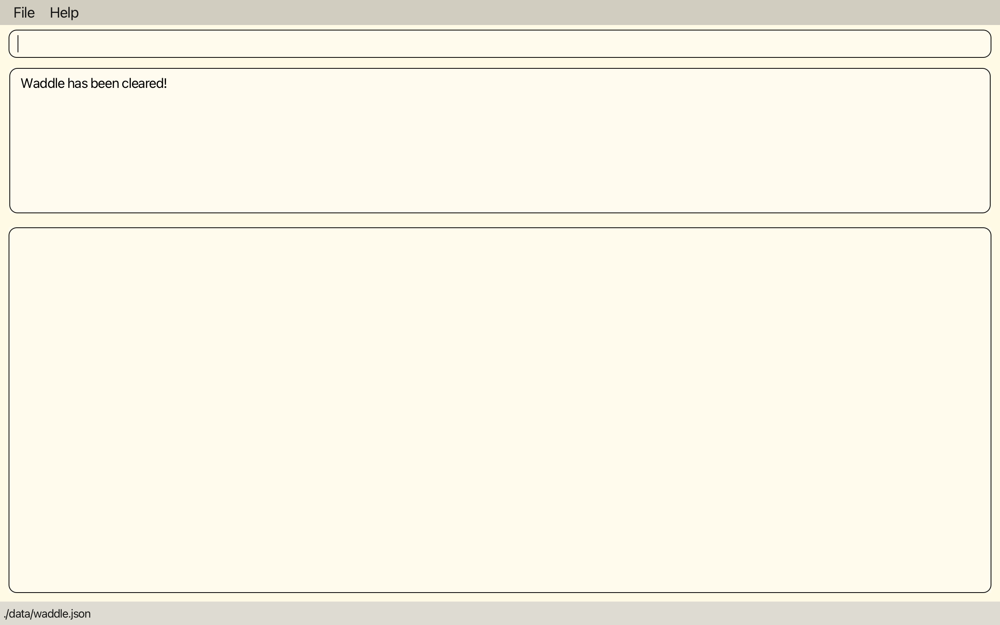
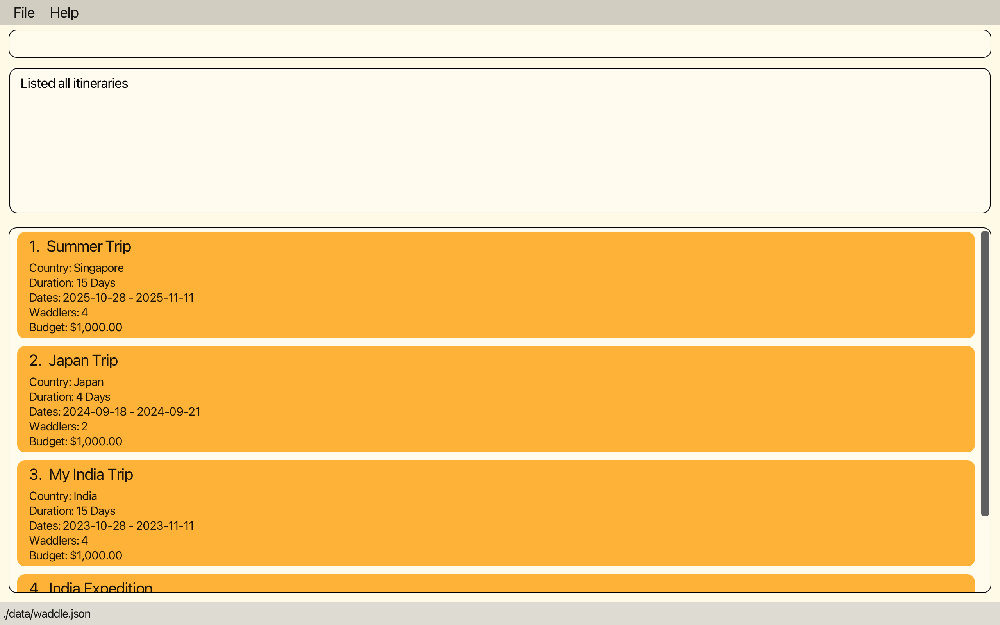
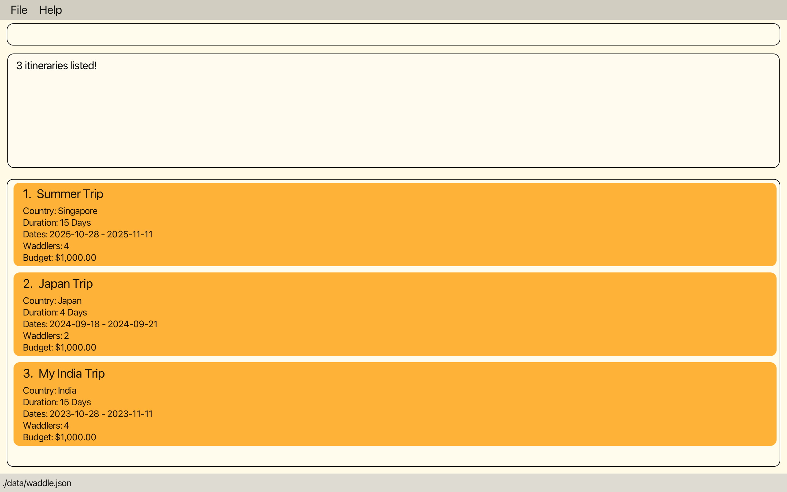

# Waddle User Guide 🦆
Waddle is a **simple, no-frills travel planning application** aligned with your travel itinerary planning needs.
Whether you are a seasoned traveler or a beginner at planning your own itinerary, Waddle provides you with a structured, focused and intuitive way to plan your trips.

With Waddle, you can plan your travel itinerary in **3 simple steps**:
1. Create a trip itinerary
2. Add activities to your itinerary wishlist
3. Make a schedule for your trip

**It's that simple**.

If you wish to learn more about Waddle and its features, then this comprehensive user guide is for you!
For tips on how to navigate our user guide, check out our [User Guide Tips](#user-guide-tips) section.
For instructions on how to set up Waddle, visit our [Quick start](#quick-start) section.
For basic information on how to make the best of Waddle, check out our [Tutorial for beginners](#tutorial-for-beginners).

--------------------------------------------------------------------------------------------------------------------

## Table of Contents
1. [**User Guide Tips**](#user-guide-tips)
2. [**Quick start**](#quick-start)
3. [**Tutorial for beginners**](#tutorial-for-beginners)
4. [**Features**](#features)
   1. [**Universal commands**](#universal-commands)
      1. [`help` Viewing help](#viewing-help--help)
      2. [`exit` Exiting Waddle](#exiting-waddle--exit)
   2. [**The home page**](#the-home-page)
   3. [**Commands on the home page**](#commands-on-the-home-page)
      1. [`add` Creating a new itinerary](#creating-a-new-itinerary--add)
      2. [`list` Listing all itineraries](#listing-all-itineraries--list)
      3. [`find` Locating itineraries by description](#locating-itineraries-by-description--find)
      4. [`edit` Editing the details of an itinerary](#editing-the-details-of-an-itinerary--edit)
      5. [`delete` Deleting an itinerary](#deleting-an-itinerary--delete)
      6. [`clear` Clearing itineraries](#clearing-itineraries--clear)
      7. [`select` Selecting an itinerary](#selecting-an-itinerary--select)
   4. [**The activity planning page**](#the-activity-planning-page)
   5. [**Commands on the activity planning page**](#commands-on-the-activity-planning-page)
      1. [`add` Adding an activity](#adding-an-activity--add)
      2. [`edit` Editing the details of an activity](#editing-the-details-of-an-activity--edit)
      3. [`delete` Deleting an activity](#deleting-an-activity--delete)
      4. [`free` Viewing vacant timeslots](#viewing-vacant-timeslots--free)
      5. [`plan` Scheduling an activity](#scheduling-an-activity--plan)
      6. [`unplan` Unscheduling an activity](#unscheduling-an-activity--unplan)
      7. [`copy` Copying to clipboard](#copying-to-clipboard--copy)
      8. [`pdf` Exporting as PDF file](#exporting-as-pdf-file--pdf)
      9. [`home` Returning to home page](#returning-to-home-page--home)
   6. [**Advanced**](#advanced)
      1. [Saving the data](#saving-the-data)
      2. [Editing the data file](#editing-the-data-file)
5. [**FAQ**](#faq)
6. [**Command summary**](#command-summary)
   1. [**Home page commands**](#home-page-commands)
   2. [**Activity-planning page commands**](#activity-planning-page-commands)
7. [**Glossary**](#glossary)

--------------------------------------------------------------------------------------------------------------------

## User Guide Tips

### Finding what you need

1. [Quick start](#quick-start) will help you set up Waddle
2. [Tutorial for Beginners](#tutorial-for-beginners) walks you through our graphical interface and also guides you on planning your very first itinerary on Waddle
3. [Features](#features) helps you understand how our features can be used in your planning
4. [FAQ](#faq) answers some of the most common questions we have gotten from our users. If you have questions for us, this section might just be the one you need!
5. [Command Summary](#command-summary) provides a summarised list of our features' commands for your easy reference
6. [Glossary](#glossary) explains some of the terms we used. If you do not understand a term in this guide, this section might be of help!
7. You can use the buttons at the bottom right of each page to return to the [Table of Contents](#table-of-contents)

### Understanding the symbols and syntax

| Symbol/Syntax        | Meaning                                                                                                           |
|----------------------|-------------------------------------------------------------------------------------------------------------------|
| `command`            | When a word or phrase is highlighted with this markup, it simply means that it is related to a command or keyword |                              
| :exclamation:        | The exclamation indicates a warning and contains information that is important                                    |
| :bulb:               | When you see this, you can expect some tips from us!                                                              |
| :information_source: | Wee will use this icon to provide you with information you should take note of                                    |

--------------------------------------------------------------------------------------------------------------------

## Quick Start

To begin planning your travels with Waddle, simply set it up as follows:

1. Ensure you have Java `11` or above installed in your Computer. If you do not, you may install it [here](https://www.oracle.com/java/technologies/downloads).

2. Download the latest `waddle.jar` from [here](https://github.com/AY2223S1-CS2103T-W11-4/tp/releases/).

3. Copy the file to the folder you want to use as the _home folder_ for Waddle.

4. Double-click the file to start the app. This will bring you to the Waddle [home page](#the-home-page). A graphical user interface (GUI) similar to the below should appear in a few seconds.
   Note how the app contains some sample data. 
   

And you're ready to waddle! To execute any command, type it command in the command box and press Enter. e.g. typing **`help`** and pressing Enter will open the help window. For more information on how to begin waddling, carry on to the [Tutorial for beginners](#tutorial-for-beginners).

Alternatively, you may wish to dive straight to the full list of commands and their details provided in the [Features](#features) section below.

--------------------------------------------------------------------------------------------------------------------

## Tutorial for Beginners

If you are a beginner to Waddle, this tutorial will walk you through creating and planning your very first Waddle itinerary.

This is the [home page](#the-home-page), which you will encounter when you open Waddle. 
It displays all your current itineraries. 
The various sections of the interface have been labeled in blue for your reference.
If this is your first time launching Waddle, you will see the following page with two sample itineraries:   

If you wish to, you can [clear](#clearing-itineraries--clear) the sample itineraries by typing `clear` into the command box and pressing Enter.
You will then see the below message:   

Now you can add your first itinerary. To do so, use the [`add` command](#creating-a-new-itinerary--add) with the relevant itinerary details.
Try executing the command `add d/Summer Trip sd/2023-06-01 du/5`. 
It will add an itinerary named Summer Trip, starting from 1 June 2023 with a duration of 5 days.
You should now see the message below and your itinerary added on the home page as follows:   

**:information_source: Notes:** 

* You can replace the `add` command inputs with the relevant details of your itinerary.
* You can include optional details such as the country, number of people, and budget.
  - e.g. Enter `add d/Summer Trip c/Japan sd/2023-06-01 du/5 p/4 b/2000` instead to specify the country as Japan, number of people as 4, and your budget as $2000. 
* For additional information, refer to the [`add` command](#creating-a-new-itinerary--add)  in the [Features](#features) section under home page commands.

Select the itinerary which you have just created by typing in `select` along with the index of the itinerary on the list, then press Enter.
For example, if "Summer Trip" is shown as the first itinerary on the list, enter `select 1`.
You will now see the planning page for the itinerary as follows:  

You can return to the main page anytime you wish by executing `home`.

**:information_source: Note about commands:** 

* Note that the commands for the main page are different from those for an itinerary planning page.
  Some commands only apply to one type of page while some are universally applicable (i.e. they can be executed on any page).
* To find out more about which commands apply to your current page, visit the user guide's [Features](#features) section.

To add an activity to your Wishlist, use the [`add` command](#adding-an-activity--add).
Try adding a new activity by typing in `add d/Visit Meiji Shrine du/120` to the command box and press Enter.
This will add a new activity with the description of "Visit Meiji Shrine" and a duration of 120 minutes.
You should now see the activity being displayed in the Wishlist.  

**:information_source: Notes:** 

* You can replace the `add` command inputs with the relevant details of your activities.
* You can include optional details such as the priority and cost.
  - e.g. Enter `add d/Visit Meiji Shrine du/120 p/5 c/20` instead to specify the priority as 5 and the cost as $20.
* For additional information, refer to the [`add` command](#adding-an-activity--add) explanation in the [Features](#features) section under itinerary planning page commands.

Try adding a few more activities! You should see the activities listed in the Wishlist.

To schedule an item from your Wishlist on a specific day in your itinerary, use the [`plan` command](#scheduling-an-activity--plan).
For example, type `plan 1 d/1 st/10:00` into the command box and Enter.
Waddle will schedule the first item on your Wishlist for Day 1 of your itinerary starting at 10am.
You should see the item being moved from the Wishlist section to the Day 1 item list, as follows:  

**:information_source: Notes:** 
   
* For additional information, refer to the [`plan` command](#scheduling-an-activity--plan) explanation in the [Features](#features) section under itinerary planning page commands.

Note that the index of the activity is now shown as 1.1, meaning it is the first activity on Day 1.

Now you can try scheduling all the activities in your Wishlist!

Once you are satisfied with your schedule, you can export your schedule as a PDF document using the [`pdf` command](#exporting-as-pdf-file--pdf).
Type `pdf` into the command box and Enter.
You should now see the below:    

Navigate to your computer's Documents folder, where you should see a folder named Waddle. 
Open up the folder to see a PDF document with the same name as your exported itinerary.
You can open the PDF document to view your itinerary schedule.

You can easily send your itinerary details to others using the [`copy` command](#copying-to-clipboard--copy).
Type `copy` into the command box and Enter. 
This will copy your itinerary to your clipboard, and you can now paste it in another location such as a messaging or email application.
You should also see the below displayed in Waddle:    

 
Congratulations! You have now created and planned your very first travel itinerary using Waddle.
We hope this tutorial has helped you kickstart your journey!
You can expand your Waddle knowledge further by reading the other sections of this User Guide, starting with the [Features](#features) that are available to you.

--------------------------------------------------------------------------------------------------------------------

## Features

**:information_source: Notes about the command format:** 

* Words in `UPPER_CASE` are the parameters to be supplied by the user. 
  - e.g. in `add d/DESCRIPTION ...`, `DESCRIPTION` is a parameter which can be used as `add d/My Japan Trip`.
   
* Items in square brackets are optional. 
  - e.g. `d/DESCRIPTION [c/COUNTRY] sd/START_DATE du/DURATION` can be used as `d/My Japan Trip c/Japan sd/2023-04-01 du/14` or as `d/My Japan Trip sd/2023-04-01 du/14`.

* Parameters can be in any order. 
  - e.g. if the command specifies `c/COUNTRY d/DESCRIPTION`, `d/DESCRIPTION c/COUNTRY` is also acceptable.

* If a parameter is expected only once in the command, but you specified it multiple times, only the **last occurrence** of the parameter will be taken. 
  - e.g. if you specify `d/Eat Ramen d/Aquarium`, only `d/Aquarium` will be taken.

* Extraneous parameters for commands that do not take in parameters (such as `help`, `list`, `exit` and `clear`) will be ignored. 
  - e.g. if the command specifies `help 123`, it will be interpreted as `help`.

### Universal commands

Most commands in Waddle can only be used on the [main page](#the-home-page) or the [activity planning page](#the-activity-planning-page). However, the commands in this section may be used on either page at any time.

### Viewing help : `help`

Brings up the help message, which contains a link to this guide.

Format: `help`

### Exiting Waddle : `exit`

Exits the Waddle program.

Format: `exit`

### The home page

The home page, or home page, of Waddle displays the list of itineraries you have created and stored in the app.

[Commands exclusive to the home page](#commands-on-the-home-page) can help you:
* [add](#creating-a-new-itinerary--add) new itineraries
* [list](#listing-all-itineraries--list) or [find](#locating-itineraries-by-description--find) existing itineraries
* [edit](#editing-the-details-of-an-itinerary--edit) or [delete](#deleting-an-itinerary--delete) existing itineraries
* [clear](#clearing-itineraries--clear) all existing itineraries

Using the [`select` command](#selecting-an-itinerary--select)  will bring you to the [planning page](#the-activity-planning-page) of the selected itinerary.

### Commands on the home page

### Creating a new itinerary : `add`

Adds an itinerary to Waddle.

Format: `add d/DESCRIPTION sd/START_DATE du/DURATION [c/COUNTRY] [p/NUMBER_OF_WADDLERS] [b/BUDGET]`

* Adds a new itinerary named `DESCRIPTION` to the itinerary list. It cannot be blank and must only contain
alphanumeric characters, spaces and these following special characters: `()&!':.,-`.
* `START_DATE` is the date of the first day in the itinerary. It must be given in the format `yyyy-mm-dd` and is a valid future date.
* `DURATION` will determine the number of days in the itinerary, and must be between 1 and 365 days.
  - e.g. `sd/2022-12-10 du/3` would mean that the trip is from 10 Dec 2022 to 12 Dec 2022.
* `BUDGET` is the budget for the itinerary in dollars, or dollars and cents, and must be between 0 and 1,000,000.
  - e.g. `b/1000` is $1,000.
  - e.g. `b/1000.50` is $1,000.50.
  

**:information_source: Notes:** 

* You cannot add an itinerary with the same description as an existing itinerary.
* Waddle only accepts english letters and spaces for `COUNTRY`, special characters like `'`, `&`, `!` are not allowed. 
  - Example of invalid input: `c/Côte d'Ivoire`, `c/中国`
* The budget input should only contain numbers and one decimal point. 
  - Example of invalid input: `b/1,000,000`
* If more than 2 decimal places are provided for the budget, Waddle rounds it up to 2 decimal places. 
  - e.g. `b/1000.505` will be reflected as $1,000.51.

Examples:
* `add d/Summer Trip c/Singapore sd/2025-10-28 du/15 p/4 b/1000`

### Listing all itineraries : `list`

Shows a list of all itineraries in Waddle.

Format: `list`

### Locating itineraries by description : `find`

Finds itineraries with names containing any of the given keywords.

Format: `find KEYWORD [MORE_KEYWORDS]`

* The search is case-insensitive. e.g. `india` will match `India`
* The order of the keywords does not matter. e.g. `Trip Japan My` will match `My Japan Trip`
* The search is based on itinerary descriptions only.
* Only full words will be matched e.g. `Jap` will not match `Japan`
* Itineraries matching at least one of the provided keywords will be returned (i.e. `OR` search).
  - e.g. `find Japan Trip` will return `My Germany Trip`, since there is a match for the keyword  `Trip`.
* Use the [`list`](#listing-all-itineraries--list) command to see all itineraries again.

Examples:
* `find India` returns `My India Trip` and `India Expedition`
* `find India Trip` returns `My Japan Trip`, `My India Trip`, `India Expedition`
* `find trip` returns the following result:   
  

### Editing the details of an itinerary : `edit`

Edits an existing itinerary in Waddle.

Format: `edit INDEX [d/DESCRIPTION] [c/COUNTRY] [sd/START_DATE] [du/DURATION] [p/NUMBER_OF_WADDLERS] [b/BUDGET]`

* Edits the itinerary at the specified `INDEX`. The index refers to the index number shown in the displayed itinerary list. The index **must be a positive integer** 1, 2, 3, …​
* At least one of the optional fields must be provided.
* Existing values will be updated to the input values.

**:information_source: Notes:**  

* If you are editing the budget, please ensure that it is sufficient to cover the cost of all the planned activities. An error would be shown otherwise. 
* If you reduce the duration of an itinerary, days will be removed from the back, and any activities that were scheduled on a removed day would be returned to the wishlist. 

Examples:
* `edit 1 du/15 sd/2023-11-03` Edits the duration and start date of the first itinerary to be `15` and `2023-11-03` respectively.
* `edit 2 c/India` Edits the country of the second itinerary to be `India`.

Running `edit 1 du/15 sd/2023-11-03`

### Deleting an itinerary : `delete`

Deletes the specified itinerary from Waddle.

Format: `delete INDEX`

* Deletes the itinerary at the specified `INDEX`. The index refers to the index number shown in the displayed list of itineraries.
* The index **must be a positive integer** 1, 2, 3, …​

Examples:
* `list` followed by `delete 2` deletes the 2nd itinerary in Waddle.
* `find Japan` followed by `delete 1` deletes the 1st itinerary in the results of the `find` command.

Running `delete 2`

### Clearing itineraries : `clear`

Deletes all itineraries in Waddle.

Format: `clear`

### Selecting an itinerary : `select`

Enters the [activity planning page](#the-activity-planning-page) for the selected itinerary.

Format: `select INDEX`

* Selects the itinerary at the specified `INDEX`. The index refers to the index number shown in the displayed list of itineraries.
* The index **must be a positive integer** 1, 2, 3, ...​

Examples:
* `select 1`

### The activity-planning page

Once you have created your itinerary, you can now start adding and planning the activities that you want to complete in
your time there! The activity-planning page of an itinerary displays the list of activities that you have added to your
itinerary. Activities on the wishlist that you have not given a start time and date yet will appear at the very top,
in order of _priority_ (as indicated by the number of stars). Activities that you have scheduled will instead appear in
the list of days below the wishlist, sorted by _start time_.

The index of scheduled activities are in the format `DAY.ACTIVITY_NUMBER`. Some examples:
* The _first_ activity of the _first_ day will have index `1.1`
* The _fifth_ activity of the _third_ day will have index `3.5`
* The _second_ activity of the wishlist will have index `2`

Here's an example of how your activity-planning page might look like:

[Commands exclusive to the activity-planning page](#commands-on-the-activity-planning-page) can help you:
* [Add](#adding-an-activity--add) new activities
* [Edit](#editing-the-details-of-an-activity--edit) or [Delete](#deleting-an-activity--delete) existing activities
* [View](#viewing-vacant-timeslots--free) the vacant time slots on your itinerary
* [Schedule](#scheduling-an-activity--plan) or [Unschedule](#unscheduling-an-activity--unplan) activities
* [Copy](#copying-to-clipboard--copy) your itinerary to your clipboard.
* [Export](#exporting-as-pdf-file--pdf) your itinerary as a pdf file

Using the [`home` command](#returning-to-home-page--home)  will bring you to the [home page](#the-home-page) of the selected itinerary.

### Commands on the activity-planning page

### Adding an activity : `add`

Adds an activity to your wishlist (without a scheduled day and time).

Format: `add d/DESCRIPTION du/DURATION [p/PRIORITY] [c/COST] `

* `DESCRIPTION` cannot be blank and must only contain alphanumeric characters, spaces and these following special characters: `()&!':.,-`.
* `DURATION` is the time taken for the activity in _minutes_. The duration must be more than 0 minutes and shorter than 1440 minutes (1 day).
    - e.g. `du/100` is 100 minutes (or 1 hour and 40 minutes).

* `PRIORITY` is used to rank the importance of an activity. It must be a number from 1 to 5, with 1 being the highest priority.

* `COST` is the cost of the activity in dollars, or dollars and cents, and must be between 0 and 1,000,000.
  - e.g. `c/100.20` is $100.20.

* You cannot add activities with the same description as an existing activity in the activity list.

**:information_source: Note:** 
* If no `PRIORITY` or `COST` is provided, Waddle assigns them a default value as follows:
  * The default `PRIORITY` is 1. 
  * The default `COST` is $0. 
* The cost input should only contain numbers and one decimal point. 
  - Examples of invalid input: `c/1,000,000`
* If more than 2 decimal places are provided for the cost, Waddle rounds it up to 2 decimal places. 
  - e.g. `b/1000.505` will be reflected as $1,000.51.

Examples:
* `add d/Go to the Louvre p/2 du/1`
* `add d/Skiing du/14 c/100`

Running `add d/Go to the Louvre p/2 du/1`

### Editing the details of an activity : `edit`

Edits an existing activity in your activity list.

Format: `edit INDEX [d/DESCRIPTION] [p/PRIORITY] [c/COST] [du/DURATION]`

* Edits the activity at the specified `INDEX`. The index refers to the index number displayed in either the wishlist, or the scheduled activity in the list of days.
* The index of a scheduled activity refers to the index number displayed in the list of days, the format being `DAY_NUMBER`.`ACTIVITY_INDEX`.
* At least one of the optional fields must be provided.
* Existing values will be updated to the input values.

**:information_source: Note:**  

* If you are editing the cost, please ensure that the new cost stays within the budget of the itinerary. An error would be shown otherwise. 

Examples:
* `edit 1 d/Go skiing` would edit the description of the 1st activity in the unscheduled activity list to be `Go skiing`.
* `edit 2.2 p/3 c/100` would edit the priority and cost of the 2nd activity in the Day 2 list to be `3` and `100` respectively.

Running `edit 1 d/Go skiing`

### Deleting an activity : `delete`

Deletes an existing activity in your activity list.

Format: `delete INDEX`

* Deletes the activity at the specified `INDEX`. The index refers to the index number displayed in either the unscheduled activity list, or the scheduled activity in the list of days.

Examples:
* `delete 1` would delete the 1st activity in the unscheduled activity list.
* `delete 2.1` would delete the 1st activity in the Day 2 activity list.

Running `delete 1`

### Viewing vacant timeslots : `free`

Displays the vacant timeslots available for you to schedule activities.

Format: `free`

### Scheduling an activity : `plan`

Schedules an activity from your wishlist.

Format: `plan INDEX d/DAY_NUMBER st/START_TIME`

* Schedules the activity at the specified `INDEX`. The index refers to the index number displayed in the wishlist.
* When an activity is scheduled, the cost of the activity is automatically deducted from the budget of the itinerary.
* `DAY_NUMBER` must be an integer from 1 to the duration (in days) of the trip.
* `START_TIME` should be given in the format `hh:mm`, or `hh:mm:ss` where `hh` is the hour in 24-hour format, `mm` is the minute, and `ss` is the seconds.
* The end time of the activity is automatically calculated by adding the `DURATION` of the activity to the `START_TIME`.
* You can only add an activity if there is no clash in timing between the start and end time of the new activity, and the start and end time of any existing scheduled activity.

**:information_source: Note:** 

* When scheduling an activity, please ensure that the activity stays within the budget of the itinerary. An error would be shown otherwise. 

Examples:
* `plan 2 d/3 st/12:00` would add the 2nd activity in the wishlist to Day 3, starting at 12pm.
* `plan 1 d/1 st/14:50:10` would add the 1st activity in the wishlist to Day 1, starting at 14:50pm, 10 seconds in.

Running `plan 1 d/1 st/11:00`

### Unscheduling an activity : `unplan`

Takes an activity from the list of days and puts it back into the wishlist.

Format: `unplan INDEX`

* Unschedules the activity at the specified `INDEX` as displayed on the day lists.
* When an activity is unscheduled, its cost is automatically added back to the budget of the itinerary.

Examples:
* `unplan 2.1` would unschedule the 1st activity in the Day 2 activity list.
* `unplan 4.5` would unschedule the 5th activity in the Day 4 activity list.

Running `unplan 1.1`

### Copying to clipboard : `copy`

Copies your itinerary in a text format onto your device's clipboard so that you can paste it anywhere.

Format: `copy`

Here's an example of how the copied text would look like:  

**:information_source: Note:**  

* The generated text includes all days within the itinerary, even if there are no activities planned for the day.
* The generated text does not include the activities in the wishlist. For activities to be reflected in the generated text, they must be planned. 

### Exporting as PDF file : `pdf`

Exports your itinerary as a PDF file. The file can be found under the "Waddle" folder in your "Documents" folder.

[//]: # (TODO: include screenshots of where to find it for windows and mac, maybe linux but idk how)

Format: `pdf`

Here's an example of how the generated PDF would look like:  

**:information_source: Note:**  

* The generated PDF file does not contain the activities in your wishlist. For these activities to be reflected in the generated PDF file, you must plan them. 
* PDF can only display up to 35 characters for itinerary description and 50 characters for activity description.

### Returning to home page : `home`

Returns you to the [home page](#the-home-page).

Format: `home`

### Advanced
This section contains miscellaneous additional information about Waddle's user data.

### Saving the data

Waddle data is saved in your hard disk automatically upon any change in the data. There is no need for you to save manually.

### Editing the data file

Waddle data is saved as a JSON file `[JAR file location]/data/waddle.json`. If you know how JSON works, you are welcome to update data directly by editing that data file.

:exclamation: <b>Caution:</b>
If your changes to the data file makes its format invalid, Waddle will discard all data and start with an empty data file at the next run. Please perform a backup before manually editing data.

--------------------------------------------------------------------------------------------------------------------

## FAQ

**Q**: How do I transfer my data to another computer? 
**A**: Install the app in the other computer and overwrite the empty data file it creates with the file that contains the data of your previous Waddle home folder.

--------------------------------------------------------------------------------------------------------------------

## Command summary

### Home page commands

| Action                                                           | Format, Examples                                                                                                                                                  |
|------------------------------------------------------------------|-------------------------------------------------------------------------------------------------------------------------------------------------------------------|
| [**Help**](#viewing-help--help)                                  | `help`                                                                                                                                                            |
| [**Add Itinerary**](#creating-a-new-itinerary--add)              | `add d/DESCRIPTION sd/START DATE du/DURATION [c/COUNTRY] [p/NUMBER OF WADDLERS] [b/BUDGET]`  e.g., `add d/Germanyyyy sd/2025-05-10 du/14 c/Germany p/4 b/7500` |
| [**List Itineraries**](#listing-all-itineraries--list)           | `list`                                                                                                                                                            |
| [**Find Itinerary**](#locating-itineraries-by-description--find) | `find KEYWORD [MORE_KEYWORDS]`  e.g., `find India Trip`                                                                                                        |
| [**Edit Itinerary**](#editing-the-details-of-an-itinerary--edit) | `edit INDEX [n/NAME] [c/COUNTRY] [du/DURATION] [s/START DATE] [p/NUMBER OF WADDLERS] [b/BUDGET]`  e.g.,`edit 1 du/15 sd/2025-04-10`                            |
| [**Delete Itinerary**](#deleting-an-itinerary--delete)           | `delete INDEX`  e.g., `delete 3`                                                                                                                               |
| [**Clear Itineraries**](#clearing-itineraries--clear)            | `clear`                                                                                                                                                           |
| [**Select Itinerary**](#selecting-an-itinerary--select)          | `select INDEX`  e.g., `select 3`                                                                                                                               |
| [**Exit**](#exiting-waddle--exit)                                | `exit`                                                                                                                                                            |

### Activity-planning page commands

| Action                                                         | Format, Examples                                                                                         |
|----------------------------------------------------------------|----------------------------------------------------------------------------------------------------------|
| [**Help**](#viewing-help--help)                                | `help`                                                                                                   |  
| [**Add Activity**](#adding-an-activity--add)                   | `add d/DESCRIPTION [p/PRIORITY] [c/COST] [du/DURATION]`  e.g.,`add d/Visit Taj Mahal p/5 c/40 du/180` |
| [**Edit Activity**](#editing-the-details-of-an-activity--edit) | `edit INDEX [d/DESCRIPTION] [p/PRIORITY] [c/COST] [du/DURATION]`  e.g., `edit 4.1 c/50`               |
| [**Delete Activity**](#deleting-an-activity--delete)           | `delete INDEX`  e.g., `delete 3`                                                                      |
| [**View Vacant Timeslots**](#viewing-vacant-timeslots--free)   | `free`                                                                                                   |
| [**Schedule Activity**](#scheduling-an-activity--plan)         | `plan INDEX d/DAY NUMBER st/START TIME`  e.g., `plan 1 d/4 st/12:00`                                  |
| [**Unschedule Activity**](#unscheduling-an-activity--unplan)   | `unplan INDEX`  e.g., `unplan 3.2`                                                                    |
| [**Copy to clipboard**](#copying-to-clipboard--copy)           | `copy`                                                                                                   |
| [**Export to PDF**](#exporting-as-pdf-file--pdf)               | `pdf`                                                                                                    |
| [**Return to Home Page**](#returning-to-home-page--home)       | `home`                                                                                                   |
| [**Exit**](#exiting-waddle--exit)                              | `exit`                                                                                                   |

--------------------------------------------------------------------------------------------------------------------

## Glossary

| Term                               | Meaning                                                                                                                                                    |
|------------------------------------|------------------------------------------------------------------------------------------------------------------------------------------------------------|
| **Command Line Interface (CLI)**   | A command line interface is a text-based user interface that allows users to input commands in the form of text                                            |
| **Graphical User Interface (GUI)** | A graphical user interface is a graphics-based user interface that allows users to interact with visual elements like buttons and lists                    |
| **Parameter**                      | The details that you have to provide waddle which differs for each command. For example, the `plan` command requires the `day` and `start time` parameters |
| **Prefix**                         | The characters that precede the parameters you enter. For example, `n/` for the name parameter                                                             |
