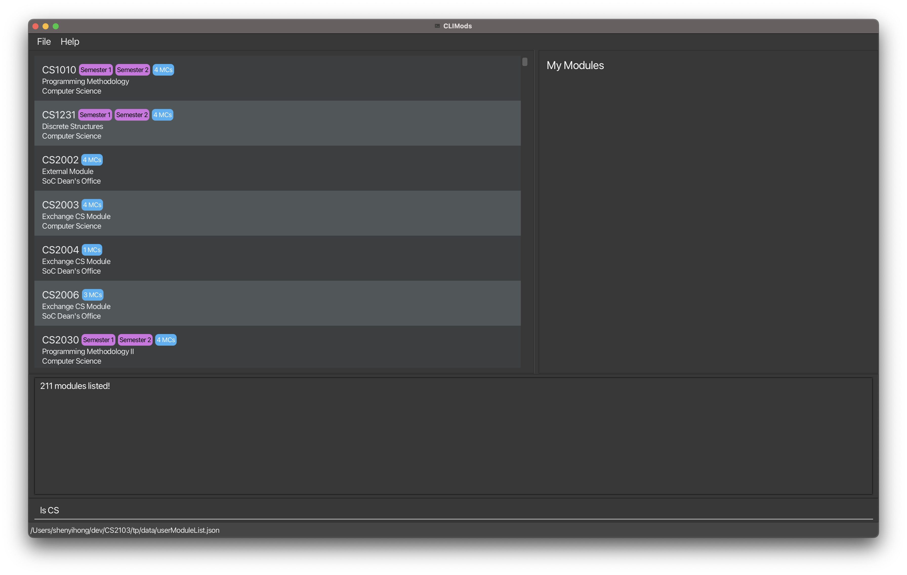
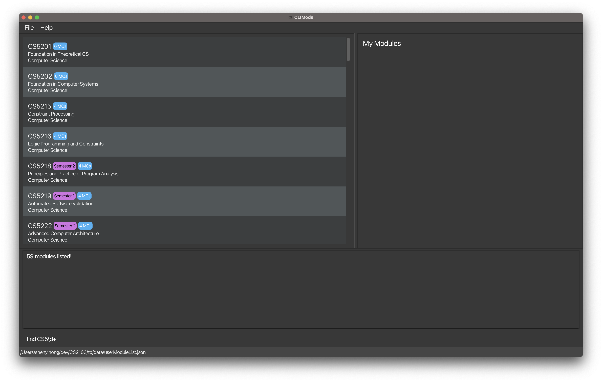
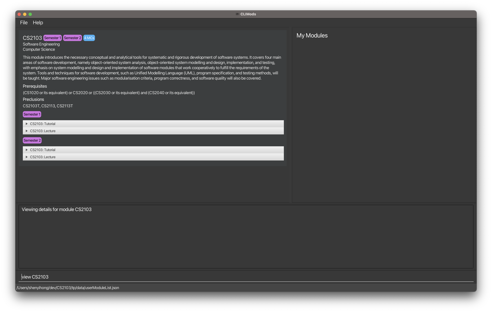
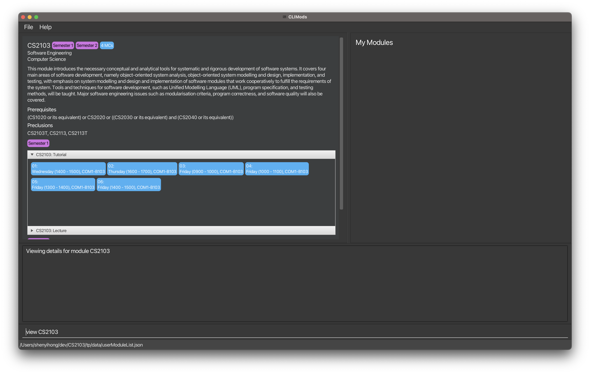
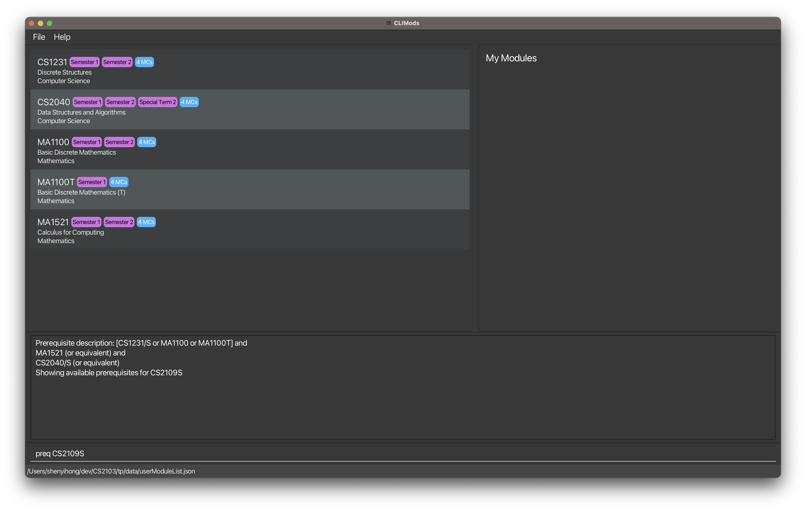
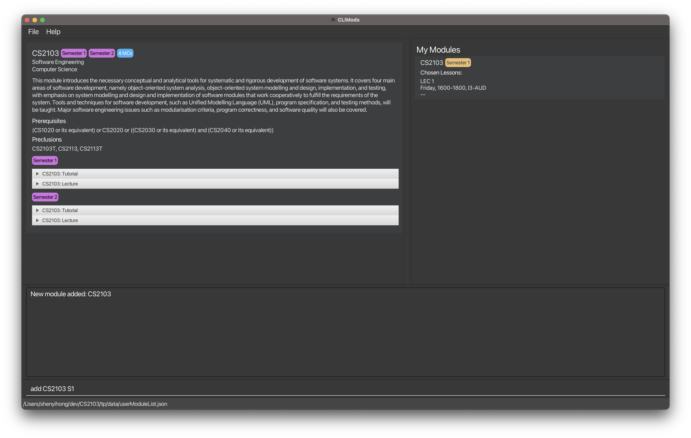

`CLIMods` is a native desktop application for NUS students to explore, manage and plan academic
modules that they are interested in taking. It is primarily optimised for the use via a Command Line
Interface (CLI) while still providing the benefits of a Graphical User Interface (GUI). Power users
of the command line/terminal will be able to plan and manage their modules much faster than doing it
on [nusmods.com](https://www.nusmods.com).

Developed with love by: 
Linus, Cheng Yi, Yi Hong, Huzaifa, Hong Jin

* Table of Contents 
{:toc}

--------------------------------------------------------------------------------------------------------------------

## Quick start

1. Ensure you have Java `11` or above installed in your Computer.

2. Download the latest `climods.jar`
   from [here](https://github.com/AY2223S1-CS2103-F14-1/tp/releases).

3. Copy the file to the folder you want to use as the _home folder_ for your `CLIMods`.

4. Double-click the file to start the app. The GUI similar to the below should appear in a few
   seconds. 
   

5. Type the command in the command box and press Enter to execute it. e.g. typing **`help`** and
   pressing Enter will open the help window.

6. Refer to the [Features](#features) below for details of each command.

--------------------------------------------------------------------------------------------------------------------

## Features syntax

**:information_source: Notes about the command format:** 

* Words in `lowercase` are commands.
* Words in `UPPPERCASE` are compulsory arguments.
* Words in `[square brackets]` are optional arguments.
* Words in `<triangle brackets>` are keyboard strokes.

## Features

### User Manual: `help`

Format: `help`

Provides the user manual for all supported commands.

### Listing modules: `ls`

Format: `ls [FACULTY-PREFIX]`

Optional Arguments:

- `FACULTY-PREFIX`
    - e.g. `CS`, `CEG`

Shows the entire list of modules offered by NUS with the option to also filter it by faculty (via
module prefix e.g. CS, CEG).

### Searching for modules: `find`

Format: `find KEYWORD`

Required Arguments:

- `KEYWORD`
    - Any keyword to search against the list of modules
    - A keyword must be a regex expression
        - e.g. `^CS20\d0$` or `CS2103`
        - Refer to the FAQ section to learn more about regex!

Search for a (list of) module in the entire list of modules offered by NUS.

Regex is difficult, and is intended to be used by more experienced users. This function works fine even without using regex in the query!

> Click [here](https://regex101.com/) to check that your regex statement is compatible with Java 8

### View module details: `view`

Format: `view MODULE-CODE`

Required Arguments:

- `MODULE-CODE`
    - e.g. `CS2103`

View full details (e.g. description, module credits and lesson slots) of a module via its module code.

### Listing module prerequisite: `preq`

Format: `preq MODULE-CODE`

Required Arguments:

- `MODULE-CODE`
    - e.g. `CS2103`

Show the list of modules that are the given module's prerequisites.

Preclusions to prerequisite mods will not be shown due to a limitation with the NUSMods API. (E.g. Only CS1010 will be shown for `preq cs2040`)

### Add modules to user list: `add`

Format: `add MODULE-CODE SEMESTER-CODE`

Required Arguments:

- `MODULE-CODE`
    - e.g. `CS2103`
  
- `SEMESTER-CODE`
    - `s1`, Semester 1
    - `s2`, Semester 2
    - `st1`, Special Term 1
    - `st2`, Special Term 2

Add a module to the user's own list of modules.

Your added module will display your lesson timings!

### Delete a module from user list: `rm`

Format: `rm MODULE-CODE`

Required Arguments:

- `MODULE-CODE`
    - e.g. `CS2103`

Delete a module to the user's own list of modules.

### Pick module lessons: `pick`

Format: `pick MODULE-CODE LESSON-TYPE LESSON-ID`

Required Arguments:

- `MODULE-CODE`
    - e.g. `CS2103`

- `LESSON-TYPE`
    - `TUT`: Tutorial
    - `LAB`: Lab
    - `REC`: Recitations
    - `SEC`: Sectional Teaching
    - `LEC`: Lecture
    - `OTHERS`: Others
  > More lesson types coming soon 😃

- `LESSON-ID`
    - e.g. `08J`
  > Tip: Use the `view` command to look at the available lessons!

Pick lesson (e.g tutorial, lab) slots from the available choices for modules that have been selected by the user.

Your list of modules will display your lesson timings!

### Exiting the program: `exit`

Format: `exit`

Exits the program

### Previous/Next command: `<Up>/<Down>`

Using the `<Up>` and `<Down>` arrow keys, users can traverse through the command history.

Traverse/Scroll **up**: `<Up>`

Traverse/Scroll **down**: `<Down>`

> Do note that the implementation of the command history will not keep track of consecutive 
> duplicate commands. This is to prevent clutter in the command history. Therefore, a command
> sequence like `ls CS` followed by another `ls CS` will only have one record in the command history.

--------------------------------------------------------------------------------------------------------------------

## Command summary

| Action   | Format, Examples                                                       |
|----------|------------------------------------------------------------------------|
| **help** | `help`  e.g. `help`                                                 |
| **ls**   | `ls [FACULTY-PREFIX]`  e.g. `ls`, `ls CS`                           |
| **find** | `find KEYWORD`  e.g. `find compilers`                               |
| **view** | `view MODULE-CODE`  e.g. `view CS2103`                              |
| **preq** | `preq MODULE-CODE`  e.g. `preq CS2103`                              |
| **add**  | `add MODULE-CODE`  e.g. `add CS2103 s1`                             |
| **rm**   | `rm MODULE-CODE`  e.g. `rm CS2103`                                  |
| **pick** | `pick MODULE-CODE LESSON-TYPE LESSON-ID`  e.g. `pick CS2103 TUT 06` |
| **exit** | `exit`                                                                 |

## FAQs
1. What is a `regex` expression?

Ans: It stands for `regular expression` and is a sequence of characters that specifies a search pattern in text.
To learn more about regex, you can refer to [this tutorial](https://regexone.com).

2. Why can't I visit external links?

Ans: You are likely coming from our application via the `help` command.  It is intended for the user
to only view our website (including the user guide) via the command.  If you wish to visit any external links,
you can copy the link and paste it into your favourite browser!

3. Can I update the json file?

Ans: No! Do not edit the json files on your own! Instead, you should use the command line interface provided by
CLIMods. We do not take any responsibility for any unexpected behaviour if you insist on editing the json files.

If the file is corrupted, please manually delete the file from the directory. 
Automatic deletion of files is not a feature due to security concerns (e.g. malicious hackers can set the file preference to local files that are not json compatible. Enabling auto-deletion of corrupted files will enable hackers to delete these files.)

4. Why is the application not displaying any modules?

Ans: CLIMods requires internet access because we fetch module data from NUSMods API.  Please ensure that you have
internet access before launching CLIMods.
