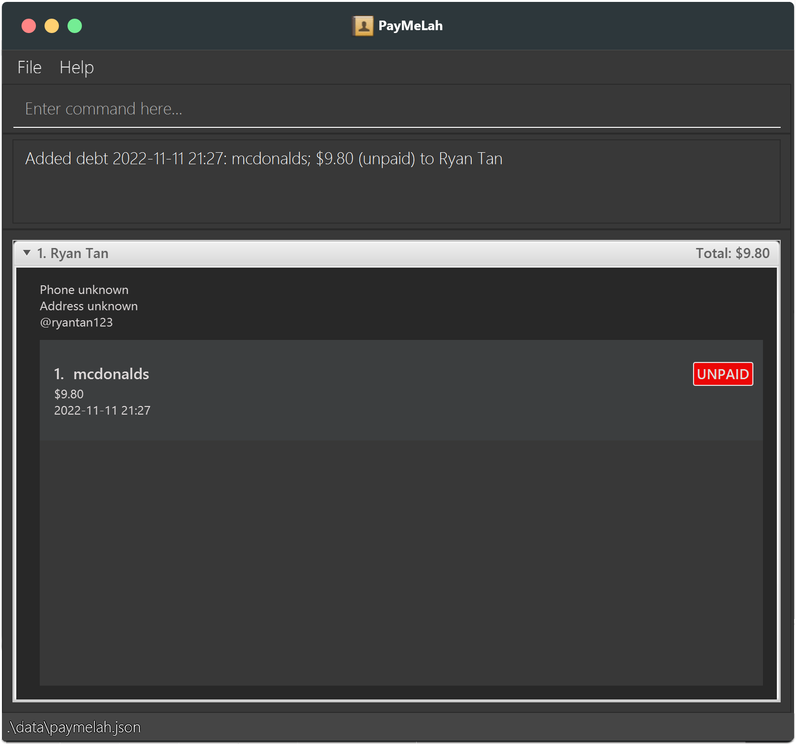

Welcome to the PayMeLah user guide!

Are you a student who enjoys participating in group buys? Or perhaps do you just need some way to remember how much money your friends owe you? PayMeLah is a desktop app for **keeping track of** and **managing the debts** your friends owe you. It can also help **do simple calculations** for you, such as including GST or splitting debts amongst your friends. What’s more, it is optimised for you to do everything from just your keyboard!

### Using this guide
If you are a new user looking to get started with PayMeLah, this user guide can help you with [the installation process](#quick-start), guide you through [adding your first debt to PayMeLah](#adding-your-first-debt), and familiarise you with how to use all of [PayMeLah’s features](#features).

If you are already familiar with the basic features of PayMeLah, this guide can also provide you with tips and tricks to get the most out of PayMeLah!

Here are some of the symbols and text formatting to look out for as you make use of this guide:

| Symbol | Meaning |
| :----: | ------- |
| :information_source: | Essential Information for All Users |
| :bulb: | Tips for Intermediate Users |
| :star: | Tips for Advanced Users |
| :exclamation: | Warning |

|          Text Formatting           | Meaning |
|:----------------------------------:| ------- |
| [Hyperlink to Glossary](#glossary) | Clickable hyperlink to navigate to another section |
|               `Text`               | Text relevant to PayMeLah user commands |
|          <kbd>Ctrl</kbd>           | A keyboard key |

--------------------------------------------------------------------------------------------------------------------

## Table of Contents

* Table of Contents
{:toc}

--------------------------------------------------------------------------------------------------------------------

## Quick start
### Installing PayMeLah

1. To run the PayMeLah application, you will need to have *Java 11* or above [installed](https://www.baeldung.com/java-check-is-installed) in your Computer ([Mac](https://www.geeksforgeeks.org/how-to-install-java-on-macos/), [Windows](https://phoenixnap.com/kb/install-java-windows)).

1. Next, you will need to prepare an [empty folder](https://www.wikihow.com/Make-a-New-Folder-on-a-Computer) to download PayMeLah to.

1. Now, you will need to visit [this link](https://github.com/AY2223S1-CS2103T-W13-3/tp/releases) to click and download the latest version of *paymelah.jar*. Make sure to download it to the folder you created in step 2!  
     
     

1. Finally, you are ready to use PayMeLah. Simply double-click the *paymelah.jar* in the folder you created to start the app. After a few seconds, you should see PayMeLah appear. Notice how we have some sample persons and debts present for you to experiment with our [features](#features).   
     

1. Now, let’s continue to learn how to [navigate the application](#navigating-the-application-interface) before familiarising ourselves with the [features](#features) you can use in PayMeLah.

[Return to Table of Contents](#table-of-contents)

--------------------------------------------------------------------------------------------------------------------

### Navigating the application interface

* PayMeLah uses a Command Line Interface (CLI) - which means that you perform actions by entering commands for PayMeLah to carry out.
* Once a command has been successfully carried out, PayMeLah will display the results accordingly.
* Refer to the diagram below to find out about the different components of PayMeLah that are responsible for receiving commands, displaying results, and more.

| Number | Component Name | Details                                                                                                                                               |
|:------:|----------------|-------------------------------------------------------------------------------------------------------------------------------------------------------|
|   1.   | Command Box    | The box where you enter commands for PayMeLah to carry out.                                                                                           | 
|   2.   | Message Box    | The box where a success message will be displayed when PayMeLah carries out a command successfully, or an error message when PayMeLah fails to do so. |
|   3.   | Person Card    | The card containing personal details.                                                                                                                 | 
|   4.   | Debt List      | The box containing the list of debts owed by a person.                                                                                                | 
|   5.   | Person List    | The box containing the full list of person cards. Only one person card can be viewed at a time.                                                       |

  

| Number | Component Name  | Details                                       |
|:------:|-----------------|-----------------------------------------------|
|   1.   | Person Index    | The index of the person in the person list.   | 
|   2.   | Name            | The person’s name.                            |
|   3.   | Phone Number    | The person’s phone number.                    | 
|   4.   | Telegram Handle | The person’s Telegram handle.                 | 
|   5.   | Tags            | The tags attached to the person.              | 
|   6.   | Address         | The person’s address.                         | 
|   7.   | Total Debt      | The total amount of money owed by the person. | 

  

| Number | Component Name | Details                                     |
|:------:|----------------|---------------------------------------------|
|   1.   | Debt Index     | The index of the debt in the debt list.     | 
|   2.   | Description    | The debt’s description.                     |
|   3.   | Money          | The amount of money owed for the debt.      |
|   4.   | Date/Time      | The date and time of the debt.              |
|   5.   | Payment Status | The debt’s payment status (paid or unpaid). |

  

**:star: Advanced keyboard shortcuts:**
Although you can make use of the mouse to perform some functions in PayMeLah, you may also use various keyboard shortcuts to do so.

|                Keyboard Key                 | Function                                                                                                                                                                                                                                                                                                                                              |
|:-------------------------------------------:|-------------------------------------------------------------------------------------------------------------------------------------------------------------------------------------------------------------------------------------------------------------------------------------------------------------------------------------------------------|
|               <kbd>Tab</kbd>                | When you are in the command box, press <kbd>Tab</kbd> twice to navigate to the person list. When you are in the person list, use <kbd>Tab</kbd> to move down the list. At the end of the person list, press <kbd>Tab</kbd> once to return to the command box.                                                                                         |
|      <kbd>Shift</kbd> + <kbd>Tab</kbd>      | Same as <kbd>Tab</kbd> but moves up instead.                                                                                                                                                                                                                                                                                                          |
|              <kbd>Space</kbd>               | When you are in the person list, use <kbd>Space</kbd> to expand or close the person card you are currently on. After expanding the person card, press <kbd>Tab</kbd> followed by <kbd>Space</kbd> to navigate to the person’s debt list. Once you are done viewing the person's debt list, press <kbd>Tab</kbd> again to navigate to the person list. |
|  <kbd>PageUp</kbd> and <kbd>PageDown</kbd>  | When you are in the person list, use <kbd>PageUp</kbd> and <kbd>PageDown</kbd> to move up or down the list, automatically expanding each person card as you move. When you are in a person's debt list, use <kbd>PageUp</kbd> and <kbd>PageDown</kbd> to move up or down the debt list.                                                               |
| <kbd>UpArrow</kbd> and <kbd>DownArrow</kbd> | Similar to <kbd>PageUp</kbd> and <kbd>PageDown</kbd>, but without expanding the person cards.                                                                                                                                                                                                                                                         |
|               <kbd>Home</kbd>               | When you are in the person list, press the <kbd>Home</kbd> key to jump to the first person in the list. When you are in a person's debt list, press the <kbd>Home</kbd> key to jump to the first debt in the list.                                                                                                                                    |
|               <kbd>End</kbd>                | When you are in the person list, press the <kbd>End</kbd> key to jump to the last person in the list. When you are in a person's debt list, press the <kbd>End</kbd> key to jump to the last debt in the list.                                                                                                                                        |

[Return to Table of Contents](#table-of-contents)

--------------------------------------------------------------------------------------------------------------------

### Adding your first debt

Once you have familiarised yourself with PayMeLah’s [user interface](#navigating-the-application), it is time to officially start using PayMeLah! The following section provides a step-by-step guide that walks you through the process of adding a debt to PayMeLah. You can choose to follow the sample commands word-for-word, or if you are feeling adventurous, you can try replacing the sample inputs with your own inputs instead.

**:star: Using the keyboard instead of the mouse**

As this section is meant for new users, it will not cover how to navigate the application using keyboard shortcuts to avoid overloading new users with information. However, PayMeLah is still ultimately designed to be the fastest for users who prefer keyboard shortcuts - If this describes you, do refer to the section on [advanced keyboard shortcuts](#advanced-keyboard-shortcuts) to learn more.

1. If you are a first time user, your PayMeLah may still be filled with the sample data that came with the [installation process](#installing-paymelah). You can remove all the sample data with a single [`clear` command](#clearing-debts-clear), which you can do by simply entering `clear`. Don’t worry about losing this data - they are unlikely to be useful to you! Soon, your PayMeLah
   will be filled with the information you actually want instead.

1. You should see that the person list is now empty.
   

1. You can now add your first person to PayMeLah with the [`add` command](#adding-a-person-add). The example we will use in this section is `add n/Ryan Tan tele/ryantan123`. Entering this command will add a person named `Ryan Tan` with `ryantan123` as his Telegram handle into PayMeLah.

1. You should see that the person card for `Ryan Tan` is now visible in the person list. You can click on his name to expand his person card, as per the picture below. However, he does not have any debts associated with him just yet!
   

1. You are now ready to add a debt to `Ryan Tan` using the [`adddebt` command](#adding-a-debt-adddebt)! This time, the example we will use is `adddebt 1 d/mcdonalds m/9.80`. Entering this command will add a debt of `$9.80` with the description `mcdonalds` to the 1st person in the person list, who happens to be `Ryan Tan`.

1. The person card for `Ryan Tan` should now be updated. Congratulations! You have just added your first debt to PayMeLah!
   

Of course, this is not yet the end of your journey with PayMeLah - there are still several other commands you may require while using PayMeLah, including commands such as `deletedebt` and `find`. You can find out more about these commands in the [features](#features) section below.

[Return to Table of Contents](#table-of-contents)

--------------------------------------------------------------------------------------------------------------------

## Features

**:information_source: Notes about the command format:** 

* The first word in the command is the command phrase that specifies which command will be carried out by PayMeLah.
  e.g. in `add n/<name>`, `add` is the command phrase for PayMeLah to add a person.

* Words in diamond brackets `<>` are inputs to be supplied by you. 
  e.g. in `add n/<name>`, `<name>` is an input which can be used as `add n/John`.

* To separate inputs that represent different information, you should precede ambiguous inputs with their paired prefixes that end with `/`.  
  e.g. in `add n/<name> [t/<tag>]…`, `n/` and `t/` are prefixes preceding the inputs `<name>` and `<tag>` respectively.

* Items in square brackets `[]` are optional. 
  e.g. for `add n/<name> [t/<tag>]…`, the following usages are both acceptable: `add n/Alan Poe t/theatre kid`, `add n/Alan Poe`.

* Command fields with `…` can be used multiple times, but remember to separate each usage with a whitespace in between. 
  e.g. in `adddebt <person index…>`, `<person index…>` is an input which can be used as `adddebt 1` or as `adddebt 1 2`. 
  e.g. in `add n/<name> [t/<tag>]…`, `[t/<tag>]…` is a pair of prefix and input which can be used as `add n/Alan t/Poet` or as `add n/Alan t/Poet t/Friend`.

:exclamation: **Caution:**
Be very careful with how a command is formatted! If the `…` is found within the diamond brackets `<>` that correspond to an input as in `<person index…>`, then only the input itself is to be repeated. However if the `…` is found outside the `<>` as in `[t/<tag>]…`, then both the prefix and input must be repeated.

* Inputs can be in any order. 
  e.g. if the command specifies `d/<description> m/<money>`, `m/<money> d/<description>` is also acceptable.

* If an input is expected only once in the command, but you specified it multiple times, only the last occurrence of the input will be taken. 
  e.g. if the command requires `p/<phone number>` and you specify `p/12341234 p/56785678`, only `p/56785678` will be taken. This is useful for correcting a wrong input without having to use backspace.

* Extraneous inputs for commands that do not take in inputs (such as `help`, `list`, `exit` and `clear`)
  will be ignored. 
  e.g. if the command specifies `help 123`, it will be interpreted as `help`.

#### Input-specific behavior

* Whenever `<date>` is specified as an input, you should input it in the format `yyyy-mm-dd` where `y` is year, `m` is month and `d` is day. 
  e.g. September 5 2022 should be input as `2022-09-05`.

* Whenever `<time>` is specified as an input, you should input it in the format `hh:mm` where `h` is the hour in 24h clock format, and `m` is the minute. 
  e.g. 5:15PM should be input as `17:15` as per 24h clock notation.

* Whenever `<money>` is specified as an input, you should input the amount in dollars and cents. You can also let PayMeLah help you with calculations by ending with '+' to add GST, or '++' to add both Service Charge and GST to the amount specified. **All calculated values are automatically rounded up to the nearest cent.** 
  e.g. when you input `2.00++`, PayMeLah will store a debt with a money amount that has Service Charge and GST added, i.e. `2.36`.

[Return to Table of Contents](#table-of-contents)

--------------------------------------------------------------------------------------------------------------------

### Viewing help : `help`

Using `help` will provide you with a link to our online user guide. 
If you get lost while using PayMeLah, this is the one command to remember!

Format: `help`

**:star: Advanced Tip:**
Pressing <kbd> F1 </kbd> will also open up the help message.

### Adding a person: `add`

Adds a person to PayMeLah.  
This command will let you add the people who owe you money (and some of their information, like their phone number or Telegram handle) to PayMeLah.

Format: `add n/<name> [p/<phone number>] [tele/<telegram>] [a/<address>] [t/<tag>]…`

:bulb: **Tip:**
A person can have any number of tags (including 0).

Examples:
* `add n/John Doe p/98765432 tele/johndoe a/John street, block 123, #01-01` will add a person named `John Doe` with `98765432` as his phone number, `johndoe` as their Telegram handle and `John street, block 123, #01-01` as their address to PayMeLah.
* `add n/Betsy Crowe t/friend a/Newgate Prison t/criminal` will add a person named `Betsy Crowe` with `Newgate Prison` as their address and both `friend` and `criminal` as their tags to PayMeLah.

### Adding a debt: `adddebt`

Adds a debt to a person in PayMeLah for you to track. Specifying multiple people will add a copy of this debt to each person specified. 
This command will help you add debts to the people in PayMeLah, so that the app can help you to remember all the debts you are owed instead.

Format: `adddebt <person index…> d/<description> m/<money> [date/<date>] [time/<time>]`

:bulb: **Tip:**
You can tell PayMeLah to add Service Charge and GST to the amount of money specified by including `++` at the back of the amount. A single `+` will add only GST instead.

:bulb: **Tip:**
You might find it difficult to find the index of a specific person when your list gets long. In this situation, you may want to make use of the [`find` command](#locating-persons-by-fields-find) or [`finddebt` command](#locating-persons-by-debt-description-finddebt) to shorten the list and make it easier to find and figure out the index of the person that you are looking for.

* If you specify **neither date nor time**, the date and time will conveniently default to the current date and time.
* If you specify **only the time but not the date**, the date will conveniently default to the current date.
* If you specify **only the date but not the time**, the time will default to midnight.

:exclamation: **Caution:**
Be very careful! The default behaviour is slightly different across the different combinations of whether you provided date and time inputs.

* One person **cannot** have 2 debts with the same description, money, date and time. However, they **can** have 2 debts with 3 out of 4 of description, money, date and time being the same.

Example:
* `adddebt 3 d/McDonalds m/8.9` will add a debt with the current date and time to the 3rd person in the person list. This debt is worth `$8.90` and has the description`McDonalds`
* `adddebt 1 4 d/chicken rice m/10++ date/2022-10-12 time/13:00` will add debts with `2022-10-12` and `13:00` as the date and time respectively to **both** the 1st person and 4th person. These debts require Service Charge and GST to be added to an initial price of `$10`, and will be recorded with the description `chicken rice`. Note that PayMeLah will automatically calculate the money for both debts and display the amounts as `$11.77`.

### Splitting a debt: `splitdebt`

Splits a debt among several people in PayMeLah for you to track.    
This command will help you with the Maths of dividing shared costs equally among people in PayMeLah. Sharing is made easy as PayMeLah does the Maths for you!

Format: `splitdebt <person index…> d/<description> m/<money> [date/<date>] [time/<time>]`

:bulb: **Tip:**
You can split a debt among as many people as you want. You can even include yourself with index '0'. But you cannot split a debt between just yourself.

:bulb: **Tip:**
You might find it difficult to find the index of a specific person when your list gets long. In this situation, you may want to make use of the [`find` command](#locating-persons-by-fields-find) or [`finddebt` command](#locating-persons-by-debt-description-finddebt) to shorten the list and make it easier to find and figure out the index of the person that you are looking for.

:bulb: **Tip:**
Splitting a debt is just like [adding a debt](#adding-a-debt-adddebt) to multiple people; however, here we divide the money of the debt over the people who shared it (and round up to the closest cent). Thus, similarly, You can tell PayMeLah to add Service Charge and GST to the amount of money specified by including '++' at the back of the amount. A single '+' will add only GST instead.

* If you specify **neither date nor time**, the date and time will conveniently default to the current date and time.
* If you specify **only the time but not the date**, the date will conveniently default to the current date.
* If you specify **only the date but not the time**, the time will default to midnight.

:exclamation: **Caution:**
Be very careful! The default behaviour is slightly different across the different combinations of whether you provided date and time inputs.

* One person **cannot** have 2 debts with the same description, money, date and time. However, they **can** have 2 debts with 3 out of 4 of these items being the same.

Examples:
* `splitdebt 1 2 d/Pizza m/33.99` will add debts with the current date and time to the 1st and 2nd person in the person list. This debt has the description `Pizza`and is worth `$33.99` in total before being divided by 2, over the 1st person and the 2nd person. Note that PayMeLah will automatically calculate the money for both debts and display the amounts as `$17.00`.
* `splitdebt 0 2 5 d/KFC chicken bucket m/30+ date/2022-10-12` will add debts with `2022-10-12` and with the default `00:00` as the date and time respectively to **both** the 2nd person and 5th person. These debts will be recorded with the description `KFC chicken bucket` and require GST to be added to an initial total price of `$30` before dividing the costs by 3, over yourself, the 2nd person and the 5th person. Note that PayMeLah will automatically calculate the money for both debts and display the amounts as `$10.70`.

### Clearing debts: `cleardebts`

Clears all of a debtor's debts from PayMeLah.  
You can use this command to delete all of a person’s debts and your relationship can start afresh!

Format: `cleardebts <person index>`

:bulb: **Tip:**
You might find it difficult to find the index of a specific person when your list gets long. In this situation, you may want to make use of the [`find` command](#locating-persons-by-fields-find) or [`finddebt` command](#locating-persons-by-debt-description-finddebt) to shorten the list and make it easier to find and figure out the index of the person that you are looking for.

Example:
* `cleardebts 3` will delete all the debts, paid or unpaid, from the 3rd person in the current person list.

### Marking debts as paid: `mark`

Marks the debts specified from a person in PayMeLah as paid. Specifying multiple debts will mark all those debts as paid.  
This command will help you keep track of which debts have been paid and which debts have not been paid.

Format: `mark <person index> debt/<debt index…>`

Example:
* `mark 2 debt/2 3`

### Marking debts as unpaid: `unmark`

Marks the debts specified from a person in PayMeLah as unpaid. Specifying multiple debts will mark all those debts as unpaid.  
This command will help you undo any mistake you made when marking a debt as paid.

Format: `unmark <person index> debt/<debt index…>`

Example:
* `unmark 2 debt/2 3`

### Deleting debts: `deletedebt`

Deletes the specified debts from a person in PayMeLah. Specifying multiple debts will delete those debts from the person specified.  
This command will help you fully remove debts from people in PayMeLah, so that their current debts can be better organised.

Format: `deletedebt <person index> debt/<debt index…>`

:bulb: **Tip:**
You might find it difficult to find the index of a specific person when your list gets long. In this situation, you may want to make use of the [`find` command](#locating-persons-by-fields-find) or [`finddebt` command](#locating-persons-by-debt-description-finddebt) to shorten the list and make it easier to find and figure out the index of the person that you are looking for.

Example:
* `deletedebt 2 debt/2 3` will delete the 2nd and third debts displayed in the debt list of the 2nd person in the person list displayed.

### Getting the statement: `statement`

Gets a statement of the total sum of debts you are owed from everyone in the displayed person list.  
This command will save you the time and effort of manually summing up debts in PayMeLah.

Format: `statement`

**:information_source: Note:**

The statement will only sum up the debts that are not marked as paid from the list that is currently displayed. This means that if you have shortened the list using the [`find` command](#locating-persons-by-fields-find) or [`finddebt` command](#locating-persons-by-debt-description-finddebt), the statement will only sum up the debts that are not marked as paid from the shortened list.

Example: `statement` returns `You are owed $583.90 in total.`

### Listing all persons: `list`

Shows a list of all persons in PayMeLah. 
You can use this command to return to displaying the full list of people you have added to PayMeLah.

Format: `list`

### Listing all debtors: `listdebtors`

Shows a list of all persons that owe you more than or equal to a certain amount of money in PayMeLah. If no amount is provided, a list of persons who owe any amount of debt is displayed.

Format: `listdebtors [m/<money>]`

Example: `listdebtors m/10` displays the list of persons that owe more than $10.00.

### Sorting list of persons: `sort`

Sorts and displays the list of persons using the given criteria and order. The criteria that you can sort by are name, amount owed, and time since oldest debt. Use the `+` symbol to indicate ascending order, and the `-` symbol for descending order.

:bulb: **Tip:**
When you sort by time since oldest debt, all persons who do not owe any debt will be placed at the end of the list, regardless of whether ascending or descending order is specified.

Format: `sort [n/<order>] OR [m/<order>] OR [date/<order>]`

Example: `sort n/+` sorts and displays the list of persons in ascending alphabetical order of their names.

### Editing a person: `edit`

Edits an existing person in PayMeLah. 
You can use this command to edit information about people you have already added in PayMeLah, in case some of their particulars such as their phone number or Telegram handle have changed.

Format: `edit <index> [n/<name>] [p/<phone number>] [tele/<telegram>] [a/<address>] [t/<tag>]…`

* Edits the person at the specified `<index>`. The index refers to the index number shown in the displayed person list. The index **must be a positive integer** 1, 2, 3, …
* At least one of the optional fields must be provided.
* Existing values will be updated to the input values.
* When editing tags, the existing tags of the person will be removed i.e. adding of tags is not cumulative.
* You can remove all the person’s tags by typing `t/` without
    specifying any tags after it.
* Cannot be used to modify a person's debts

Examples:
*  `edit 1 p/91234567 tele/johndoe` will edit the phone number and Telegram handle of the 1st person to be `91234567` and `@johndoe` respectively.
*  `edit 2 n/Betsy Crower t/` will edit the name of the 2nd person to be `Betsy Crower` and clear all their existing tags.

### Locating persons by fields: `find`

Finds persons who match all the given conditions.

Format: `find [n/<name>] [p/<phone number>] [tele/<telegram>] [a/<address>] [t/<tag>…]
[d/<description>…] [m/<money>…] [above/<money>] [below/<money>]
[date/<date>…] [before/<date>] [after/<date>] [time/<time>…]`

* Name and Address are case-insensitive partial matches. All other fields are exact matches.
* The above and below fields look for people with a debt that lies in the specified monetary range.
* The before and after fields look for people with a debt that lies within the specified date range.
* The order of the conditions does not matter.
  e.g. `d/burger n/hans` will match `Hansel` if he owes money for a burger.
* Only persons matching all conditions will be returned (i.e. `AND` search).
  e.g. `d/burger d/fries n/hans` will return `Hans Gruber` only if he owes money for a burger and fries,
  but not `Hansel`  if he only owes money for a burger and not for fries.

Examples:
* `find n/John` returns `john` and `John Doe`
* `find d/burger n/hans` returns `Hansel` if he owes money for a burger
* `find d/burger d/fries n/hans` returns `Hans Gruber` if he owes money for both a burger and fries,
  but not `Hansel`  if he only owes money for a burger and not for fries.

### Locating persons by debt description: `finddebt`

Finds persons who are associated with any debts that match any of the given keywords.

Format: `finddebt <keyword>…`

* The search is case-insensitive. e.g `burger` will match `Burger`
* The order of the keywords does not matter. e.g. `Sharing Meal` will match `Meal Sharing`
* Only the name is searched.
* Only full words will be matched e.g. `Burger` will not match `Burgers`
* Persons with debts matching at least one keyword will be returned (i.e. `OR` search).
  e.g. `burger meal` will return people associated with debts that have descriptions `Chicken Burger` or `Meal Sharing`

Examples:
* `finddebt Burger` returns people associated with debts that have descriptions `burger` or `Chicken Burger`
* `finddebt burger meal` returns people associated with debts that have descriptions `Chicken Burger` or `Meal Sharing` 

### Deleting a person: `delete`

Deletes the specified person from PayMeLah. 
You can use this to remove people you no longer need to track debts for from PayMeLah.

Format: `delete <index>`

* Deletes the person at the specified `<index>`.
* The index refers to the index number shown in the displayed person list.
* The index **must be a positive integer** 1, 2, 3, …

Examples:
* `list` followed by `delete 2` deletes the 2nd person in the address book.
* `find Betsy` followed by `delete 1` deletes the 1st person in the results of the `find` command.

### Clearing all entries: `clear`

Clears all entries from PayMeLah. 
You can use this command to delete all info from PayMeLah and start afresh!

Format: `clear`

:bulb: **Tip:**
This is the command to use when you want to start using PayMeLah for real and delete all the sample data that exist when you first use PayMeLah!

### Undoing a command: `undo`

This is the command to use when you made a mistake, and want to undo previous command(s) that modified PayMeLah's data. 
Be careful though, your undo history will be gone when you close the app!

Format: `undo`

:bulb: **Tip:**
This command will only undo commands that directly modified PayMeLah's data contents (e.g., `adddebt`, `delete`, `sort`). It does not undo commands that only change the display (e.g., `listdebtors`, `find`). To view all the persons in PayMeLah, use the `list` command instead.

:exclamation: **Caution:**
The undo history of PayMeLah will only save your 10 most recent commands that modified its data! Make sure to check the list of persons regularly if you are making many changes in one session!

### Exiting the program : `exit`

Exits the program.

Format: `exit`

:bulb: **Tip:**
You can also just press the 'X' button in the upper right corner. There is no difference, and both methods help safely exit PayMeLah :)

### Saving the data

PayMeLah data are saved in the hard disk automatically after any command that changes the data. There is no need to save manually.

### Editing the data file

PayMeLah data are saved as a JSON file `[JAR file location]/data/paymelah.json`. Advanced users are welcome to update data directly by editing that data file.

:exclamation: **Caution:**
If your changes to the data file makes its format invalid, PayMeLah will discard all data and start with an empty data file at the next run.

--------------------------------------------------------------------------------------------------------------------

## FAQ

**Q**: How do I transfer my data to another Computer? 
**A**: Install the app in the other computer and overwrite the empty data file it creates with the file that contains the data of your previous AddressBook home folder.

--------------------------------------------------------------------------------------------------------------------

## Glossary

* _Command_: An instruction for PayMeLah to execute. All commands start with a _command phrase_ and any inputs the command may require.
* _Command box_: A box in which you can enter _commands_. See [Navigating the application interface](#navigating-the-application-interface) to learn more.
* _Command Line Interface (CLI)_: The method by which you instruct PayMeLah to perform tasks, which is by entering _commands_ into the _command box_.
* _Command phrase_: The name of the instruction for PayMeLah to execute. For example, `list` is the command phrase to show the list of people added to PayMeLah.
* _Debt_: A transaction event (e.g. group purchase, shared Grab food order) where someone owes you money.
* _Debt card_: A card containing the details of a specific _debt_ that has been added to PayMeLah. See [Navigating the application interface](#navigating-the-application-interface) to learn more.
* _Debt index_: The number that appears next to each _debt_’s description in a person’s _debt list_.
* _Debt list_: A box containing a list of _debts_ owed by a person added to PayMeLah. See [Navigating the application interface](#navigating-the-application-interface) to learn more.
* _Debtor_: A person who owes you money.
* _Enter[ing]_ a command: Type the _command_ into the _command box_, and press the <kbd>Enter</kbd> key.
* _Index_: The number that appears next to each person’s name or each _debt_’s description.
* _Input_: Additional information supplied by you that is used to run a _command_.
* _Keyboard shortcut_: A key or sequence of keys which you may press to perform actions without your mouse.
* _Message box_: A box in which PayMeLah will inform you about the results of your _commands_. See [Navigating the application interface](#navigating-the-application-interface) to learn more.
* _Person card_: A card containing the details and _debts_ of someone that has been added to PayMeLah. See [Navigating the application interface](#navigating-the-application-interface) to learn more.
* _Person index_: The number that appears next to each person’s name in the _person list_.
* _Person list_: A box which contains a list of people added to PayMeLah. See [Navigating the application interface](#navigating-the-application-interface) to learn more.
* _Prefix_: A short piece of text indicating what type of information follows. For example, `n/` is the prefix that indicates that what follows is a name.

[Return to Table of Contents](#table-of-contents)

--------------------------------------------------------------------------------------------------------------------

## Command summary

| Action            | Format, Examples                                                                                                                                                                                                                                        |
|-------------------|---------------------------------------------------------------------------------------------------------------------------------------------------------------------------------------------------------------------------------------------------------|
| **Add person**    | `add n/<name> p/<phone number> tele/<telegram> a/<address> [t/<tag>]…`   e.g., `add n/James Ho p/22224444 tele/James_H0 a/123, Clementi Rd, 1234665 t/friend t/colleague`                                                                            |
| **Add debt**      | `adddebt <person index> d/<description> m/<money>`   e.g., `adddebt 3 d/Chicken Rice m/4`                                                                                                                                                            |
| **Split debt**    | `splitdebt <person index…> d/<description> m/<money> [date/<date>] [time/<time>]`   e.g., `splitdebt 1 2 d/Pizza m/33.99 date/2022-10-12 time/13:00`                                                                                                 |
| **Mark debts**    | `mark <person index> debt/<debt index…>`   e.g., `mark 2 debt/2 3`                                                                                                                                                                                   |
| **Unmark debts**  | `unmark <person index> debt/<debt index…>`   e.g., `unmark 2 debt/2 3`                                                                                                                                                                               |
| **Clear debts**   | `cleardebts <person index>`   e.g., `cleardebts 3`                                                                                                                                                                                                   |
| **Delete debts**  | `deletedebt <person index> debt/<debt index…>`   e.g., `deletedebt 2 debt/2 3`                                                                                                                                                                       |
| **Clear**         | `clear`                                                                                                                                                                                                                                                 |
| **Delete**        | `delete <index>`  e.g., `delete 3`                                                                                                                                                                                                                   |
| **Edit**          | `edit <index> [n/<name>] [p/<phone number>] [tele/<telegram>] [a/<address>] [t/<tag>]…`  e.g.,`edit 2 n/James Lee tele/James_L33`                                                                                                                    |
| **Find**          | `find [n/<name>] [p/<phone number>] [tele/<telegram>] [a/<address>] [t/<tag>]… [d/<description>]… [m/<money>]…`  `[above/<money>] [below/<money>] [date/<date>]… [before/<date>] [after/<date>] [time/<time>]…`  e.g., `find d/burger above/10.0` |
| **Find debts**    | `finddebt <keyword>…`  e.g., `finddebt burger bowling`                                                                                                                                                                                               |
| **List**          | `list`                                                                                                                                                                                                                                                  |
| **List debtors**  | `listdebtors [m/<money>]`  e.g., `listdebtors m/10`                                                                                                                                                                                                  |
| **Sort**          | `sort [n/<order>] OR [m/<order>] OR [date/<order>]`  e.g., `sort n/+`                                                                                                                                                                                |
| **Get statement** | `statement`                                                                                                                                                                                                                                             |
| **Help**          | `help`                                                                                                                                                                                                                                                  |
| **Undo**          | `undo`                                                                                                                                                                                                                                                  |

[Return to Table of Contents](#table-of-contents)
