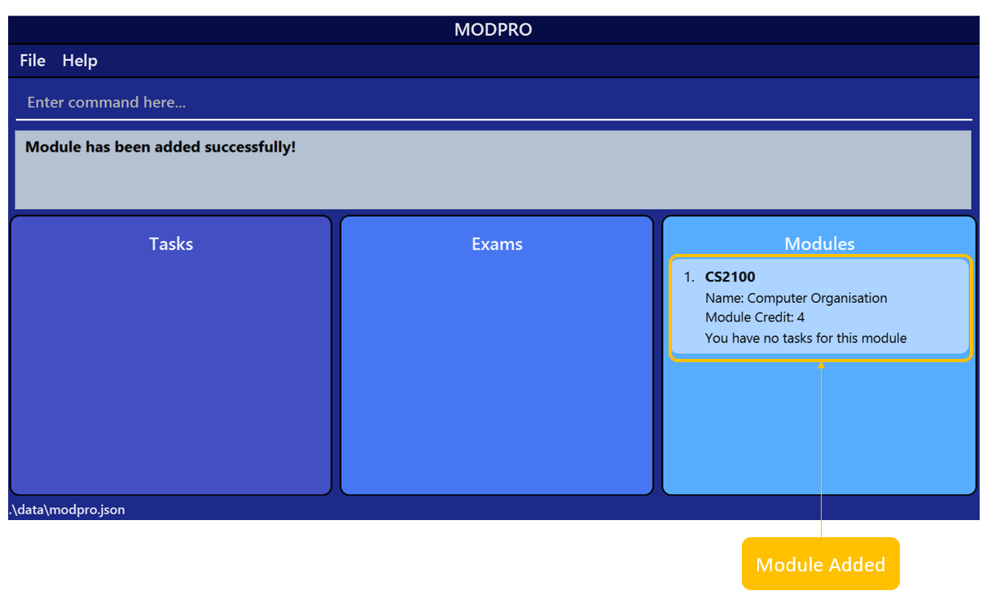
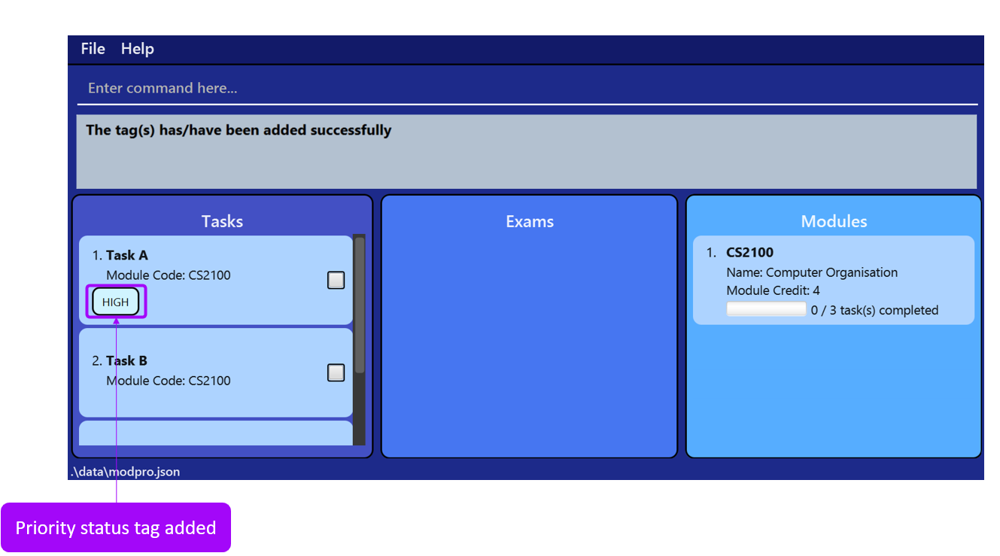

## Introduction

Welcome to the User Guide of MODPRO!

MODPRO is a desktop application which helps NUS students track the progress of their modules.

MODPRO helps you…
* organise your tasks by modules and exams
* track your progress for each module and exam with a progress bar
* easily navigate through your tasks by tagging your tasks, filtering and sorting your task list.

It is highly optimised for students who prefer Command Line Interface (CLI) by allowing those who type fast to key in commands to track their modules. If you struggle to type fast, we also provide a Graphical User interface (GUI) to assist you in using MODPRO.

------------------

### The Graphical User Interface (GUI)

To give you a quick overview of MODPRO, the following image shows you the main components of the GUI.

|  |
|:---------------------:|
|     GUI of MODPRO     |

The table below summarises the function of each component.

| **Component**             | **Function**                                                 |
|---------------------------|--------------------------------------------------------------|
| Menu Bar                  | To view the help window and to exit the application          |
| Command Input             | To key in commands which will be executed                    |
| Feedback Message Display  | To view the feedback given after the execution of a command  |
| Task List                 | To view your tasks                                           |
| Module List               | To view your modules                                         |
| Exam List                 | To view your exams                                           |

### Icons and formatting used in the guide

This guide uses icons and formatting to differentiate between the different types of information so that it is comprehensible. The following table summarises the icons and formatting used, along with their meaning.

| **Icon/Formatting**      | **Meaning**                                                       |
|--------------------------|-------------------------------------------------------------------|
| :information_source:     | Extra Information to take note of when navigating through MODPRO  |
| :exclamation:            | Warnings to take note of when navigating through MODPRO           |
| :bulb:                   | Tips that we provide                                              |
| `WORDS HIGHLIGHTED GREY` | Words that you can type into the Command Input                    |

### Purpose of the guide
This document is to assist you in using MODPRO smoothly and effectively to track your tasks and progress.

* For first-time users, you can proceed to [Quick Start](#quick-start) for a guide on how to set up MODPRO and a short tutorial on the basic commands. Once you are familiar with the interface, you can start exploring our extensive list of features [here](#features)
* For the experienced users, you can learn more about these unique features that can help you manage your tasks better: [adding tags to your tasks](#adding-the-tags-to-a-task), [sorting your list](#sorting-the-task-list), [filtering your list](#filtering-the-task-list), [linking an exam to a task](#linking-an-exam)

--------------------------------------------------------------------------------------------------------------------

## Table of Contents
- [Quick Start](#quick-start)
- [Features](#features)
  - [Modules-Related Features](#modules-related-features)
    - [Adding a module](#adding-a-module)
    - [Listing the modules](#listing-the-modules)
    - [Finding a module](#finding-a-module)
    - [Deleting a module](#deleting-a-module)
    - [Editing a module](#editing-a-module)
  - [Tasks-Related Features](#tasks-related-features)
    - [Adding a task](#adding-a-task)
    - [Deleting a task](#deleting-a-task)
    - [Editing a task](#editing-a-task)
    - [Marking a task](#marking-a-task)
    - [Unmarking a task](#unmarking-a-task)
    - [Listing the tasks](#listing-the-tasks)
    - [Filtering the task list](#filtering-the-task-list)
    - [Finding a task](#finding-a-task)
    - [Sorting the task list](#sorting-the-task-list)
    - [Adding the tags to a task](#adding-the-tags-to-a-task)
    - [Editing the tags of a task](#editing-the-tags-of-a-task)
    - [Deleting the tags of a task](#deleting-the-tags-of-a-task)
    - [Clearing the task list](#clearing-the-task-list)
  - [Exams-Related Features](#exams-related-features)
    - [Adding an exam](#adding-an-exam)
    - [Editing an exam](#editing-an-exam)
    - [Deleting an exam](#deleting-an-exam)
    - [Linking an exam](#linking-an-exam)
    - [Unlinking an exam](#unlinking-an-exam)
    - [Showing the tasks of an exam](#showing-the-tasks-of-an-exam)
  - [Other Features](#other-features)
    - [Clearing all the lists](#clearing-all-the-lists)
    - [Opening the help window](#help)
    - [Exiting the program](#exiting-the-program)
- [General](#general)
  - [Saving data to the data file](#saving-data-to-the-data-file)
  - [Editing the data file](#editing-the-data-file)
- [FAQ](#faq)
- [Summary Of Commands](#summary-of-commands)

--------------------------------------------------------------------------------------------------------------------

## Quick start 

1. Ensure you have Java `11` or above installed in your Computer.

2. Download the latest `modpro.jar` from [here](https://github.com/AY2223S1-CS2103T-F11-2/tp/releases/download/v1.3.1/modpro.jar).

3. Copy the file to the folder you want to use as the _home folder_ for MODPRO.

4. Double-click the file to start the app. The GUI similar to the image below should appear in a few seconds.  
   

5. Type the command in the command box and press Enter to execute it.  
   e.g. typing help and pressing Enter will open the help window.  
   Here are some commands you can try:

   * `m add c/CS2100 m/Computer Organisation mc/4` : Adds the module called Computer Organisation with the module code CS2100 into the module list.
   * `m list` : Lists all modules stored in the module list.
   * `m delete 1` : Deletes the 1st module shown in the displayed module list.
   * `exit` : Exits the app.

6. Refer to the [Features](#features) below for details of each command.

--------------------------------------------------------------------------------------------------------------------

## Features

**:information_source: How to read the command format:** 
  
* Command words are case-insensitive. 
  e.g. `t add` is the same as `T add` for command words

* Prefixes are case-sensitive. 
  e.g. `t add m/CS2030 d/Programming` is not the same as `t add M/CS2030 D/Programming` and the latter command will throw an error message

* Words in UPPER_CASE are the parameters to be supplied by the user. 
  e.g. in `t add m/MODULE`, `MODULE` is a parameter which can be used as `t add m/CS2030`.
  
* Items in square brackets are optional. 
  e.g `t/KEYWORD [SECOND_KEYWORD]` can be used as `t/priority deadline` or as `t/priority`.
  
* Items in square brackets with * are optional, but at least one of them is required. 
  e.g `[m/MODULE]* [d/DESCRIPTION]*` can be used as `m/cs2030` or `m/cs2030 d/assignment` but not ` `(none provided).
  
* Parameters can be in any order. 
  e.g. if the command specifies `m/MODULE d/DESCRIPTION`, `d/DESCRIPTION m/MODULE` is also acceptable.
  
* If a parameter is expected only once in the command and it is specified multiple times, only the last occurrence of the parameter will be taken. 
  e.g. if you specify `m/cs2030 m/cs2040`, only `m/cs2040` will be taken.
  
* Extraneous parameters for commands that do not take in parameters (such as help, exit and clearall) will be ignored. 
  e.g. if the command specifies `help 123`, it will be interpreted as `help`.

## Modules-related Features

### Adding a module
Adds the module into the module list.

Format: `m add c/MODULE_CODE m/MODULE_NAME mc/MODULE_CREDIT`
Parameters:
* `MODULE_CODE` refers to the module code of the module being added.
* `MODULE_NAME` refers to the name of the module.
* `MODULE_CREDIT` refers to the number of module credits that the module has

Restrictions:
* `MODULE_CODE` must be at least 6 characters long , the first two characters of the module code must be an alphabetical character and the rest of the characters should be alphanumeric characters.
* `MODULE_NAME` must not be empty
* `MODULE_CREDIT` must be at least 0 and not more than 45.

:information_source: **Note:** `MODULE_CODE` is case-insensitive.

Examples:

`m add c/cs2100 m/computer organisation mc/4` adds a module with the module code cs2100, the module name computer organisation and the module credit 4

`m add c/cs2105 m/networking mc/3 adds a module` with the module code cs2105, the module name networking and the module credit 3

|  |
|:----------------------------------------------------:|
|          Demonstration of AddModuleCommand           |

### Listing the modules
Lists all modules in stored module list.

Format: `m list`

### Finding a module
Finds modules in the stored module list whose module code matches the `KEYWORD` partially or fully.

Format: `m find KEYWORD`

Parameters:
* `KEYWORD` refers to the keyword inputted by the user.

:information_source: **Note:** `KEYWORD` is case-insensitive.

Examples:

`m find CS` finds modules whose module code contains the `KEYWORD` 'CS' such as 'CS2030S', 'CS2040S'

`m find 30` finds modules whose module code contains the `KEYWORD` '30' such as 'CS2030S'

### Deleting a module
Deletes the specified module according to the index given.

Format: `m del INDEX`

Parameter:
`INDEX` refers to the index number (shown in the displayed module list) of the module to be deleted.

Restrictions:
* `INDEX`
  * `INDEX` should be an integer greater than 0 and less than 2147483648
  * `INDEX` should not be greater than the number of modules in the displayed module list.

Example:

`m del 1` deletes the first module in the module list.

`m del 3` deletes the third module in the module list.

:exclamation: **Warning:** All tasks and exams related to the module will be deleted after the specified module is deleted.

### Editing a module
Edits the specified module by updating the existing values to the input values.

Format: `m edit INDEX [c/MODULE_CODE]* [m/MODULE_NAME]* [mc/MODULE_CREDIT]*`

Parameters:
* `INDEX` refers to the index number (shown in the displayed module list) of the module to be edited.
* `MODULE_CODE` refers to the module code that will replace the existing module code of the module specified.
* `MODULE_NAME` refers to the module name that will replace the existing module name of the module specified.
* `MODULE_CREDIT` refers to the module credit that will replace the existing module credit of the module specified.

:information_source: **Note:** MODULE_CODE is case-insensitive.

  

Restrictions:
* `INDEX`
  * `INDEX` should be an integer greater than 0 and less than 2147483648
  * `INDEX` should not be greater than the number of modules in the displayed module list.
* `MODULE_CODE`
  * `MODULE_CODE` should be at least 6 characters long.
  * The first two characters of `MODULE_CODE` should be alphabetical and the remaining characters should be alphanumeric.
  * `MODULE_CODE` should not be the module code of an existing module in the stored module list.
* `MODULE_NAME` should not be empty.
* `MODULE_CREDIT`
  * `MODULE_CREDIT` should not be empty.
  * `MODULE_CREDIT` should be an integer between 0 and 45 inclusive.
* The input values should not be the same as existing values.
* The edited module should not be the same as any existing module in the stored module list.

:exclamation: **Warning:** If the module code of the module is edited, and the module is related to some tasks or exams, the module of these tasks and exams will be changed to this edited module.

Examples:

`m edit 1 m/Programming Methodology I mc/4` changes the module name of the first module in the module list to 'Programming Methodology I' and the module credit to '4'.

`m edit 2 c/cs2040 m/Data Structures and Algorithms mc/4` changes the module name of the second module in the module list to ‘Data Structures and Algorithms’, the module code to ‘cs2040’ and the module credit to ‘4’.

## Tasks-related Features

### Adding a task
Adds the task into the stored task list.

Format: `t add m/MODULE d/DESCRIPTION`

Parameters:
* `MODULE` refers to the module code of the module which the task belongs to.
* `DESCRIPTION` refers to the task description to be shown.

Restrictions:
* `MODULE`
  * `MODULE` should be at least 6 characters long.
  * The first two characters of `MODULE` should be alphabetical and the remaining characters should be alphanumeric.
  * `MODULE` should be the module code of an existing module in the stored module list.
* `DESCRIPTION` should not be empty.

Example:
`t add m/CS2105 d/Assignment 1` adds a task with the module as 'CS2105' and description as 'Assignment 1' into the stored task list.

|  |
|:------------------------------------------------:|
|         Demonstration of AddTaskCommand          |

### Deleting a task 
Deletes the specified task according to the index given

Format: `t del INDEX`

Parameter:
`INDEX` refers to the index number (shown in the displayed task list) of the task to be deleted.

Restrictions:
* `INDEX`
  * `INDEX` should be an integer greater than 0 and less than 2147483648
  * `INDEX` should not be greater than the number of tasks in the displayed task list.

Examples:

`t del 1` deletes the first task in the task list 

`t del 3` deletes the third task in the task list

:exclamation: **Note:** When the task is deleted, if it has a link to an exam, the task will be unlinked from the exam.

### Editing a task
Edits the specified task, by updating the existing values to the input values.

Format: `t edit INDEX [m/MODULE]* [d/DESCRIPTION]*`

Parameters:
* `INDEX` refers to the index number (shown in the displayed task list) of the task to be edited.
* `MODULE` refers to the module code of the module that will replace the existing module of the task specified.
* `DESCRIPTION` refers to the description that will replace the existing description of the task specified.

:information_source: **Note:** MODULE is case-insensitive.

  

Restrictions:
* `INDEX`
  * `INDEX` should be an integer greater than 0 and less than 2147483648
  * `INDEX` should not be greater than the number of tasks in the displayed task list.
* `MODULE`
  * `MODULE` should be at least 6 characters long. 
  * The first two characters of `MODULE` should be alphabetical and the remaining characters should be alphanumeric.
  * `MODULE` should be the module code of an existing module in the stored module list. 
* `DESCRIPTION` should not be empty.
* The input values should not be the same as existing values. 
* The edited task should not be the same as any existing task in the stored task list.

:exclamation: **Warning:** If a task is linked to an exam, and its module is changed, the task will be unlinked from the exam.

Examples:

`t edit 1 d/Assignment 2` changes the description of the first task in the displayed task list to 'Assignment 2'.

`t edit 2 m/CS2040 d/tutorial 2` changes the module and description of the second task in the displayed task list to 'CS2040' and 'tutorial 2' respectively.

### Marking a task
Indicates the specified task is completed.

Format: `t mark INDEX`

Parameter:
`INDEX` refers to the index number (shown in the displayed task list) of the task to be marked.

Restrictions:
* `INDEX`
  * `INDEX` should be an integer greater than 0 and less than 2147483648
  * `INDEX` should not be greater than the number of tasks in the displayed task list.
* The task specified should not be already marked.
  
Examples:

`t mark 1` indicates the first task in the displayed task list is completed.

`t mark 3` indicates the third task in the displayed task list is completed.

:bulb: **Tip:** You can sort and filter tasks based on their completion status. The percentage of completed tasks are also shown for each exam and module.

|  |
|:---------------------------------------:|
|    Demonstration of MarkTaskCommand     |

### Unmarking a task
Indicates the specified task is not completed.
  
Format: `t unmark INDEX`
  
Parameter:
* `INDEX` refers to the index number (shown in the displayed task list) of the task to be unmarked.

Restrictions:
* `INDEX` 
  * `INDEX` should be an integer greater than 0 and less than 2147483648
  * `INDEX` should not be greater than the number of tasks in the displayed task list.
* The task specified should not be already unmarked.
    
Examples:

`t unmark 1` indicates the first task in the displayed task list is not completed.

`t unmark 3` indicates the third task in the displayed task list is not completed.

### Listing the tasks
Lists all tasks in the stored task list

Format: `t list`

### Filtering the task list
Filters the displayed task list to show only tasks that fulfil the module code, completion status, and/or link status conditions.

Format: `t filter [m/MODULE/]* [c/COMPLETED]* [l/LINKED]*`

Parameters:
* `MODULE` refers to the module code of the module to be filtered out.
* `COMPLETED` should be `y` to filter tasks that are complete or `n` to filter tasks that are incomplete.
* `LINKED` should be `y` to filter tasks that are linked to an exam or `n` to filter tasks that are not linked to any exam.

Restrictions:
* `MODULE`
  * `MODULE` should be at least 6 characters long.
  * The first two characters of `MODULE` should be alphabetical and the remaining characters should be alphanumeric.
  * `MODULE` should be the module code of an existing module in the stored module list.
* `COMPLETED` should be `y` or `n`.
* `LINKED` should be `y` or `n`.

Examples:

`t filter m/cs2030 c/y` filters out all completed tasks that are under the module cs2030.

`t filter l/n` filters out all tasks that are currently not linked to any exam.

|  |
|:--------------------------------------------------------:|
|           Demonstration of FilterTasksCommand            |

### Finding a task
Finds tasks in the stored task list whose task description matches the `KEYWORD` partially or fully.

Format: `t find KEYWORD`

Parameters:
* `KEYWORD` refers to the keyword inputted by the user.

:information_source: **Note:** `KEYWORD` is case-insensitive.

Examples:

`t find work` finds tasks that contain the `KEYWORD` 'work' such as 'homework', 'work to do'

`t find do paper` finds tasks that contain the `KEYWORD` 'do paper', such as 'do paper one', 'do paper two'

|  |
|:-------------------------------------------:|
|      Demonstration of FindTasksCommand      |

### Sorting the task list
Sorts the tasks in the task list based on the criteria specified

Format: `t sort c/CRITERIA`

Parameter:
* `CRITERIA` refers to the criteria that is used for sorting the task list.

Restrictions:
* `CRITERIA` can be either `priority`, `deadline`, `module` or `description`
* When sorting by priority, all tasks marked with priority status `HIGH` will appear at the top of the displayed task list, followed by `MEDIUM`, `LOW` and lastly all tasks with no priority status being at the bottom
* When sorting by deadline, tasks with the earliest deadline will appear at the top of the displayed list and tasks with no deadlines will appear at the bottom of the displayed task list
* When sorting by module, all tasks will be sorted by module code in alphanumeric order
* When sorting by description, all tasks will be sorted by the task description in alphanumeric order

:information_source: **Note:** `CRITERIA` is case-insensitive.

Examples:

`t sort c/priority` sorts all the tasks in the task list by priority status

`t sort c/deadline` sorts all the tasks in the task list by deadline

`t sort c/module` sorts all the tasks in the task list by module code

`t sort c/description` sorts all the tasks in the task list by task description

|  |
|:--------------------------------------------------:|
|          Demonstration of SortTaskCommand          |

### Adding the tags to a task
Tags the priority status and the deadline to complete task 

Format: `t tagadd INDEX [p/PRIORITY_STATUS]* [dl/DEADLINE]*`

Parameters:
* `INDEX` refers to the index number shown on the displayed task list.
* `PRIORITY_STATUS` refers to the priority status which is tagged to the task in the displayed task list
* `DEADLINE` refers to the deadline which is tagged to the task in the displayed task list

Restrictions:
* `INDEX` should not be greater than 0 and less than 2147483648
* `INDEX` should not be greater than the number of tasks in the task list
* `PRIORITY STATUS` must be one of three priorities `HIGH`, `MEDIUM`, `LOW`
* `DEADLINE` must be in the format DD-MM-YYYY
* `DEADLINE` must not be earlier than the current date

:information_source: **Note:** `PRIORITY_STATUS` is case-insensitive.

Examples:

`t tagadd 1 p/HIGH` tags the first task in the displayed task list with the priority status of `HIGH`

`t tagadd 1 dl/31-12-2022` tags the first task in the displayed task list with the deadline of `31-12-2022`

`t tagadd 2 p/low dl/31-12-2022` tags the second task in the displayed task list with a priority status of 
`LOW` and a deadline of `31-12-2022`

|  |
|:----------------------------------------------:|
|         Demonstration of AddTagCommand         |

### Editing the tags of a task
Edits the tags associated with the task

Format: `t tagedit INDEX [p/PRIORITY_STATUS]* [dl/DEADLINE]*`

Parameters:
* `INDEX` refers to the index number shown on the displayed task list.
* `PRIORITY_STATUS` refers to the priority status which is tagged to the task in the displayed task list
* `DEADLINE` refers to the deadline which is tagged to the task in the displayed task list

Restrictions:
* `INDEX` should be greater than 0 and less than 2147483648
* `INDEX` should not be greater than the number of tasks in the task list
* `PRIORITY STATUS` must be one of three priorities `HIGH`, `MEDIUM`, `LOW`
* `DEADLINE` must be in the format DD-MM-YYYY
* `DEADLINE` must not be earlier than the current date
* To edit the `PRIORITY_STATUS` of the task, the task must already have a priority status tagged to it
* The edited `PRIORITY_STATUS` of the task should not be the same as the current priority status of the task
* To edit the `DEADLINE` of the task, the task must already have a deadline tagged to it
* `DEADLINE` should not be the same as the current deadline tagged to the task

:information_source: **Note:** `PRIORITY_STATUS` is case-insensitive.

Examples:

`t tagadd 1 p/HIGH` followed by `t tagedit 1 p/LOW` update priority status of the task
from `HIGH` to `LOW`

`t tagadd 1 dl/31-12-2022` followed by `t tagedit 1 dl/31-11-2022` updates the deadline of the task
from `31-12-2022` to `31-11-2022`

### Deleting the tags of a task
Deletes the tags associated with the task

Format: `t tagdel INDEX t/KEYWORD [SECOND_KEYWORD]`

Parameters:
* `INDEX` refers to the index number shown on the displayed task list.
* `KEYWORD` refers to the first keyword which indicates the type of tag that can be removed.
* `SECOND_KEYWORD` refers to second keyword which indicates the type of tag that can be removed.

Restrictions:
* `INDEX` should be greater than 0 and lesser than 2147483648.
* `INDEX` should not be greater than the size of the displayed task list.
* The list of keywords which can be used for `KEYWORD` and `SECOND_KEYWORD` are `priority` and `deadline`.
* If duplicate keywords are used, the duplicate keyword will be ignored.

:information_source: **Note:** `KEYWORD` and `SECOND_KEYWORD` are case-insensitive.

Examples:

`t tagadd 1 p/HIGH` followed by `t tagdel 1 t/priority` would delete the priority status
of the first task in the displayed task list

`t tagadd 1 dl/24-11-2022` followed by `t tagdel 1 t/deadline` would delete the deadline
of the first task in the displayed task list

`t tagadd 2 p/LOW dl/31-12-2022` followed by `t tagdel 2 t/priority deadline` would delete 
the priority status and deadline of the second task in the displayed task list

### Clearing the task list
Clears all tasks currently in the stored task list.

Format: `t clear`

--------------------------------------------------------------------------------------------------------------------

## Exams-related Features

### Adding an exam
Adds an exam into the stored exam list.

Format: `e add m/MODULE ex/EXAM_DESCRIPTION ed/EXAM_DATE`

Parameters:
* `MODULE` refers to the module code of the module of the exam to be added.
* `EXAM_DESCRIPTION` refers to the description of the exam to be added.
* `EXAM_DATE` refers to the date of the exam to be added.

:information_source: **Note:** `MODULE` is case-insensitive.

Restrictions:
* `MODULE`
  * `MODULE` should be at least 6 characters long.  
  * The first two characters of `MODULE` should be alphabetical and the remaining characters should be alphanumeric. 
  * `MODULE` should be the module code of an existing module in the stored module list.
* `EXAM_DESCRIPTION` should not be empty.
* `EXAM_DATE` should be in the format DD-MM-YYYY and not earlier than the current date
* The exam to be added should not be the same as any existing exam in the stored exam list.

Example:

`e add m/CS2100 ex/midterms ed/20-08-2023` adds the exam with the exam module as 'CS2100',
exam description as 'midterms', exam date as '20-08-2023' into the exam list. 

|  |
|:------------------------------------------:|
|      Demonstration of AddExamCommand       |

### Editing an exam
Edits the specified exam, by updating the existing values to the input values.
   
Format: `e edit INDEX [m/MODULE]* [ex/EXAM_DESCRIPTION]* [ed/EXAM_DATE]*`

Parameters
* `INDEX` refers to the index number (shown in the displayed exam list) of the exam to be edited.
* `MODULE` refers to the module code of the module that will replace the existing module of the exam specified.
* `EXAM_DESCRIPTION` refers to the exam description that will replace the existing exam description of the exam specified.
* `EXAM_DATE` refers to the exam date that will replace the existing exam date of the exam specified.

:information_source: **Note:** `MODULE` is case-insensitive.

Restrictions:
* `INDEX`
   * `INDEX` should be an integer greater than 0 and less than 2147483648 
   * `INDEX` should not be more than the number of exams in the stored exam list.
* `MODULE`
   * `MODULE` should be at least 6 characters long. 
   * The first two characters of `MODULE` should be alphabetical and the remaining characters should be alphanumeric.
   * `MODULE` should be the module code of an existing module in the stored module list.
* `EXAM_DESCRIPTION` should not be empty.
* `EXAM_DATE` should be in the format DD-MM-YYYY and not earlier than the current date 
* The input values should not be the same as existing values. 
* The edited exam should not be the same as any existing exam in the stored exam list.

:exclamation: **Warning:** If the exam is linked to some tasks, and the module of the exam is changed, the tasks will be unlinked from the exam.

Examples:

`e edit 1 ex/finals ed/20-12-2022` changes the exam description of the first exam in the exam list to ‘finals’ and the exam date to ‘20-12-2022’.

`e edit 2 m/CS2030S ex/midterms ed/22-12-2022` changes the exam description of the second exam in the exam list to ‘midterms’, the exam module to ‘CS2030S’ and the exam date as ‘22-12-2022’.

### Deleting an exam
Deletes the specified exam according to the index given based on the displayed exam list.

Format: `e del INDEX`

Parameter:
* `INDEX` refers to the index number shown in the displayed exam list.

Restrictions:
* `INDEX` should be an integer greater than 0 and less than 2147483648.
* `INDEX` should not be more than the number of exams in the displayed exam list.

Example:

`e del 1` deletes the first exam in the exam list.

:information_source:**Note:** All tasks currently linked to the exam will be unlinked after the exam is deleted.

### Linking an exam
Links the task in displayed task list to the exam in the exam list based on the indexes given.

Format `e link e/EXAM_INDEX t/TASK_INDEX`

Parameters:
* EXAM_INDEX refers to the index number shown on the displayed exam list
* TASK_INDEX refers to the index number shown on the displayed task list

Restrictions:
* EXAM_INDEX and TASK_INDEX should be greater than 0 and lesser than 2147483648
* EXAM_INDEX should not be greater than the displayed exam list
* TASK_INDEX should not be greater than the displayed task list

Examples:

`e link e/1 t/1` links the first task in the displayed task list to the first exam in the displayed exam list

`e link e/2 t/3` links the third task in the displayed task list to the second exam in the displayed exam list

|  |
|:--------------------------------------------------:|
|          Demonstration of LinkExamCommand          |

### Unlinking an exam
Unlinks the exam from the task at the specified index on the displayed task list.

Format: `e unlink INDEX`

Parameter:
* `INDEX` refers to the index number shown on the displayed task list of the task to be unlinked.

Restrictions:
* `INDEX` should be an integer greater than 0 and less than 2147483648.
* `INDEX` should not be more than the number of tasks in the displayed task list.

Example:

`e unlink 1` unlinks the first task in the task list from its current exam.

### Showing the tasks of an exam
Shows all tasks linked to the exam according to the specified index from the displayed exam list.

Format: `e showt INDEX`

Parameter:
* `INDEX` refers to the index number of the exam in the displayed exam list.

Restrictions:
* `INDEX` should be an integer greater than 0 and less than 2147483648.
* `INDEX` should not be more than the number of exams in the displayed exam list.

Example:

`e showt 1` shows a list of all tasks linked to the first exam in the exam list.

|  |
|:------------------------------------------------------------:|
|            Demonstration of ListExamTasksCommand             |

## Other Features

### Clearing all the lists
Clears all tasks, exams and modules currently in the respective stored lists.

Format: `clearall`

### Help
Views the help window which displays the list of commands

Format: `help`
* Opens up the help window which shows the list of commands

Example:

`help` opens up the help window to display the list of commands

### Exiting the program
Exits the program

Format: `exit`

--------------------------------------------------------------
## Future Features to be added (Coming Soon!)

* Add the ability to edit the case sensitivity of module code in task, modules and exams
* Add the ability to add exam time and exam venue
* Add more error messages when duplicate prefixes are being used

--------------------------------------------------------------------------
## General 

### Saving data to the data file
* All MODPRO data will be manually saved to the hard disk after the execution of each command.
There is no need to manually save the data.

### Editing the data file
* MODPRO data is saved as a JSON file at `[JAR FILE LOCATION]/data/modpro.json`. Advanced users are allowed
to modify the data at the JSON file

:exclamation: **Warning:**
If changes made to the modpro.json makes the format invalid or invalid data is used, 
MODPRO will discard all data stored and start with an empty data file.

--------------------------------------------------------------------------
## FAQ

1. What is the difference between the stored task list and the displayed task list? 
   * The stored task list is the list containing all the tasks you created, whereas the displayed task list is the one shown on your screen. 
   * The stored task list and displayed task list could be different after the filter or find command

-----------------------------------------------------------------------------------------------------------------------------------------------------

## Summary of Commands

| Command       | Format and Examples                                                                                                              |
|---------------|----------------------------------------------------------------------------------------------------------------------------------|
| **Module**    |                                                                                                                                  |
| **m add**     | **Format**: `m add c/MODULE_CODE m/MODULE_NAME mc/MODULE_CREDIT`  **Example**: `m add c/cs2103t m/software engineering mc/4` |
| **m del**     | **Format**: `m del INDEX`  **Example**: `m del 1`                                                                            |
| **m edit**    | **Format**: `m edit INDEX [c/MODULE_CODE]* [m/MODULE_NAME]* [mc/MODULE_CREDIT]*`  **Example**: `m edit 1 c/cs2040 mc/4`      |
| **m list**    | **Format**: `m list`  **Example**: `m list`                                                                                  |
| **m find**    | **Format**: `m find KEYWORD`  **Example**: `m find cs`                                                                       |
| **Task**      |                                                                                                                                  |
| **t add**     | **Format**: `t add m/MODULE d/DESCRIPTION`  **Example**: `t add m/CS2105 d/Assignment 1`                                     |
| **t del**     | **Format**: `t del INDEX`  **Example**: `t del 1`                                                                            |
| **t edit**    | **Format**: `t edit INDEX [m/MODULE]* [d/DESCRIPTION]*`  **Example**: `t edit 1 d/Assignment 2`                              |
| **t mark**    | **Format**: `t mark INDEX`  **Example**: `t mark 1`                                                                          |
| **t unmark**  | **Format**: `t unmark INDEX`  **Example**: `t unmark 1`                                                                      |
| **t list**    | **Format**: `t list`  **Example**: `t list`                                                                                  |
| **t sort**    | **Format**: `t sort c/CRITERIA`  **Example**: `t sort c/priority`                                                            |
| **t filter**  | **Format**: `t filter [m/MODULE]* [c/COMPLETED]* [l/LINKED]*`  **Example**: `t filter m/cs2030 c/y`                          |
| **t find**    | **Format**: `t find KEYWORD`  **Example**: `t find watch lecture rec`                                                        |
| **t tagadd**  | **Format**: `t tagadd INDEX [p/PRIORITY_STATUS]* [dl/DEADLINE]*`  **Example**: `t tagadd 1 p/high dl/29-12-2022`             |
| **t tagdel**  | **Format**: `t tagdel INDEX t/KEYWORD [SECOND_KEYWORD]`  **Example**:`t tagdel 1 t/priority`                                 |
| **t tagedit** | **Format**: `t tagedit INDEX [p/PRIORITY_STATUS]* [dl/DEADLINE]*`  **Example**: `t tagedit 1 p/medium`                       |
| **t clear**   | **Format**: `t clear`  **Example**: `t clear`                                                                                |
| **Exam**      |                                                                                                                                  |
| **e add**     | **Format**: `e add m/MODULE ex/EXAM_DESCRIPTION ed/EXAM_DATE`  **Example**: `e add m/cs2013t ex/practical ed/29-10-2022`     |
| **e edit**    | **Format**: `e edit INDEX [m/MODULE]* [ex/EXAM_DESCRIPTION]* [ed/EXAM_DATE]*`  **Example**: `e edit 1 m/cs2040`              |
| **e del**     | **Format**: `e del INDEX`  **Example**: `e del 1`                                                                            |
| **e link**    | **Format**: `e link e/EXAM_INDEX t/TASK_INDEX`  **Example**: `e link e/1 t/2`                                                |
| **e unlink**  | **Format**: `e unlink INDEX`  **Example**: `e unlink 1`                                                                      |
| **e showt**   | **Format**: `e showt INDEX`  **Example**: `e showt 1`                                                                        |
| **Others**    |                                                                                                                                  |
| **clearall**  | **Format**: `clearall`  **Example**: `clearall`                                                                              |
| **help**      | **Format**: `help`  **Example**: `help`                                                                                      |
| **exit**      | **Format**: `exit`  **Example**: `exit`                                                                                      |
