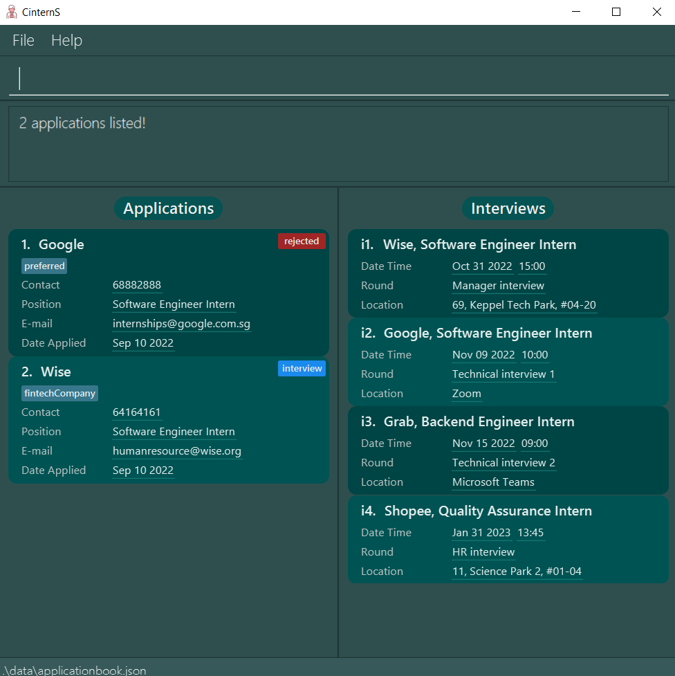

**CinternS** is a **desktop app for managing internship applications, optimised for use via a Command Line Interface** (CLI) while still having the benefits of a Graphical User Interface (GUI). If you can type fast, **CinternS** can get your internship application management tasks done faster than traditional GUI apps. It consists of several useful features which the users are able to execute using commands.

* [Quick Start](#quick-start)
* [Features](#features)
    * [Viewing help: `help`](#viewing-help-help)
    * [Adding an internship application: `add`](#adding-an-internship-application-add)
    * [Listing all internship applications: `list`](#listing-all-internship-applications-list)
    * [Listing all archived internship application: `list-archive`](#listing-all-archived-internship-applications-list-archive)
    * [Deleting an internship application: `delete`](#deleting-an-internship-application-delete)
    * [Finding an internship application: `find`](#finding-an-internship-application-find)
    * [Editing an internship application: `edit`](#editing-an-internship-application-edit)
    * [Sorting the internship applications: `sort`](#sorting-the-internship-applications-sort)
    * [Adding or editing an interview: `interview`](#adding--editing-an-interview-interview)
    * [Removing an interview: `remove-i`](#removing-an-interview-remove-i)
    * [Archiving an internship application: `archive`](#archiving-an-internship-application-archive)
    * [Retrieving an internship application from archives: `retrieve`](#retrieving-an-internship-application-from-archives-retrieve)
    * [Undoing the previous command: `undo`](#undoing-the-previous-command-undo)
    * [Redoing the previously undone command: `redo`](#redoing-the-previously-undone-command-redo)
    * [Viewing a list of upcoming interviews: `remind`](#viewing-a-list-of-upcoming-interviews-remind)
    * [Showing the statistics of applications: `stats`](#showing-the-statistics-of-applications-stats)
    * [Clearing all entries: `clear`](#clearing-all-entries-clear)
    * [Exiting the program: `exit`](#exiting-the-program-exit)
    * [Saving the data](#saving-the-data)
* [FAQ](#faq)
* [Command summary](#command-summary)

--------------------------------------------------------------------------------------------------------------------

## Quick start

1. Ensure you have Java `11` or above installed in your Computer.

2. Download the latest `CinternS.jar` from [here](https://github.com/AY2223S1-CS2103-F14-3/tp/releases).

3. Copy the file to the folder you want to use as the _home folder_ for your **CinternS** app.

4. Double-click the file to start the app. If this does not launch the app, open a command window in the directory containing the `CinternS.jar` file and launch it with the command `java -jar CinternS.jar` instead.   
    The GUI similar to the below should appear in a few seconds. When the app is started for the first time, sample data is included to help you get started. 
   

6. Type commands into the command box and press Enter to execute them. 
   Here are some example commands you can try:
    * **`help`** : Shows a message explaining how to access the help page.
   
    * **`list`** : Displays all the internship applications in the list.
   
    * **`add`**`c/Google ct/60221023 d/2022-01-01 e/google@example.com p/Software Engineer s/pending` : Adds an internship application to **CinternS**. This application was submitted on `2022-01-01` to `Google` for the role of `Software Engineer`. The contact number is `60221023`, the email is `google@example.com` and the status is `pending`.

    * **`delete`**`2` : Deletes the 2nd application shown in the current list.
   
    * **`find`**`google` : Finds the applications that contain keyword **google** in their company name and/or position.
   
    * **`edit`**`1 e/hr@internship.sg` : Edits the email of the 1st application shown in the current list to a new one.

    * **`interview`**`5 ir/Technical interview id/2024-09-16 it/1400 il/11, Kallang Way 2, #08-15, 119546` : Adds an interview to the 5th application in the displayed application list / Edits the existing interview in the 5th displayed application.

    * **`clear`** : Clears all entries from CinternS.

    * **`undo`** : Undoes the previous command.

    * **`exit`** : Exits the app.

7. Refer to the [Features](#features) section below for details of each command.

--------------------------------------------------------------------------------------------------------------------

## Features

**:information_source: Notes about the command format:** 

* Words in `UPPER_CASE` are the parameters to be supplied by the user. 
  e.g. in `add c/COMPANY_NAME`, `COMPANY_NAME` is a parameter which can be used as `add c/Google`.

* Items in square brackets are optional.
  e.g `c/COMPANY_NAME [t/TAG]` can be used as `c/Google t/preferred` or as `c/Google`.

* Items with `...` after them can be used multiple times including zero times.
  e.g. `[t/TAG]...` can be used as ` ` (i.e. 0 times), `t/preferred`, `t/preferred t/techCompany` etc.

* Parameters can be in any order. 
  e.g. if the command specifies `d/DATE_APPLIED p/POSITION`, `p/POSITION d/DATE_APPLIED` is also acceptable.

* If a parameter is expected only once in the command but you specified it multiple times, only the last occurrence of the parameter will be taken.
  e.g. if you specify `ct/12341234 ct/62226222`, only `ct/62226222` will be taken.

* Extraneous parameters for commands that do not take in parameters (such as `list` and `exit`) will be ignored. 
  e.g. if the command specifies `list 123`, it will be interpreted as `list`.

### Viewing help: `help`

Shows a message explaining how to access the help page.

Format: `help`

* Click the `Copy URL` button to copy the User Guide link to your clipboard.
* Click the `Go` button to open the User Guide in your web browser.

### Adding an internship application: `add`

Adds an internship application to the list.

Format: `add c/COMPANY_NAME ct/CONTACT_NUMBER d/DATE_APPLIED e/EMAIL p/POSITION s/STATUS [t/TAG]...`

:bulb: <b>Tip:</b>
 
1. <code>DATE_APPLIED</code> must be specified in the format <em>yyyy-MM-dd</em>. 
2. <code>STATUS</code> must be one of the following: <b>pending</b>, <b>interview</b>, <b>offered</b>, <b>rejected</b>. 
3. Tags must be alphanumeric and cannot contain spaces.

Examples:
* `add c/Google ct/60221023 d/2022-01-01 e/google@example.com p/Software Engineer s/pending t/preferred`
* `add c/Facebook ct/98765432 d/2022-01-02 e/facebook@example.com p/Backend Engineer s/interview`

### Listing all internship applications: `list`

Displays all the internship applications in the list.

Format: `list`

### Listing all archived internship applications: `list-archive`

Displays all the archived internship applications in the list.

Format: `list-archive`

### Deleting an internship application: `delete`

Deletes the specified internship application from the list. If the application has an interview, it will also be deleted from the interview list.

Format: `delete INDEX`

* Deletes the internship application at the specified `INDEX`.
* The index refers to the index number shown in the displayed internship application list.
* The index **must be a positive integer** 1, 2, 3, …​
* The index cannot be greater than the number of applications in the displayed list.

Example:
* `list` followed by `delete 2` deletes the 2nd internship application in the list (and its interview from the interview list).

### Finding an internship application: `find`

Finds applications whose companies or positions contain any of the given keywords.

Format: `find KEYWORD [MORE_KEYWORDS]`

* The search is case-insensitive. e.g `google` will match `Google`.
* The order of the keywords does not matter. e.g. `Tech Micron` will match `Micron Tech`.
* The keywords are only searched for inside the applications' companies and positions.
* Only full words will be matched e.g. `ByteDance` will not match `ByteDances`.
* Applications matching at least one keyword will be returned (i.e. `OR` search). e.g. `Google Shopee` will match `Shopee HQ` and `Google Singapore`.

Example:
* `find Software` returns the `Google` and `Wise` applications since their positions contain the keyword "software".

### Editing an internship application: `edit`

Edits an existing application in CinternS.

Format: `edit INDEX [c/COMPANY] [ct/CONTACT] [e/EMAIL] [p/POSITION] [d/DATE_APPLIED] [s/STATUS] [t/TAG]...`

* Edits the application at the specified `INDEX`. 
* The index refers to the index number shown in the displayed application list. 
* The index **must be a positive integer** 1, 2, 3, …​
* The index cannot be greater than the number of applications in the displayed list.
* At least one of the optional fields must be provided.
* Existing values will be updated to the input values.
* Changes to the company name and the position will also be reflected in the interview list.
* When editing tags, the existing tags of the application will be removed i.e adding of tags is not cumulative.
* You can remove all the application’s tags by typing `t/` without specifying any tags after it.

Examples:
* `edit 1 ct/91234567 e/grab@example.com` edits the contact and email of the 1st application to `91234567` and `grab@example.com` respectively.
* `edit 2 c/Garena t/` edits the company of the 2nd application and the corresponding interview to `Garena` and clears all existing tags.

### Sorting the internship applications: `sort`

Sorts the internship application list according to the specified order.

Format: `sort [o/ORDER] [r/]`

* `ORDER` can be `company`, `position`, `date` (for application date), or `interview` (for interview date).
* Including `r/` causes the sort order to be reversed (to become reverse alphabetical or reverse chronological).
* When sorting by interview dates, any applications with no associated interview will always get sorted to the bottom of the list.
* The sort order persists even after closing and reopening CinternS.

Examples:
* `sort o/company` sorts the application list in alphabetical order of company.
* `sort o/interview r/` sorts the application list in reverse chronological order of interview dates.
* `sort` sorts the application list in chronological order of application dates as the default.

### Adding / Editing an interview: `interview`

Adds an interview to an existing application or edits an existing interview in an application.

Format: `interview INDEX ir/ROUND id/INTERVIEW_DATE it/INTERVIEW_TIME il/LOCATION`

:bulb: <b>Tip:</b> 
1. <code>INTERVIEW_DATE</code> must be specified in the format <em>yyyy-MM-dd</em>. 
2. <code>INTERVIEW_TIME</code> must be specified in the format <em>HHmm</em>. 

* Adds an interview to the application at the specified `INDEX`.
* The index refers to the index number shown in the displayed **application** list.
* The index **must be a positive integer** 1, 2, 3, …​
* The index cannot be greater than the number of applications in the displayed list.
* All fields must be provided.
* Supports edit of the existing interview by overwriting the old interview.

Examples:
* `interview 5 ir/Technical interview id/2024-09-16 it/1400 il/11, Kallang Way 2, #08-15, 119546` adds an interview to the application with displayed index `5`.
* If the application with displayed index `5` has an existing interview, the above command overwrites the previous existing interview.

### Removing an interview: `remove-i`

Removes an interview from an existing application in CinternS.

Format: `remove-i INDEX`

* Removes the interview at the specified `INDEX`.
* The index refers to the index number shown in the displayed **interview** list which has a prefix `i`.
* The index **must be a positive integer** 1, 2, 3, …​
* The index cannot be greater than the number of applications in the displayed list.

Example:

* `remove-i 3` removes the interview in the interview list with display index `i3`.

### Archiving an internship application: `archive`

Archives the specified internship application from the list.

Format: `archive INDEX`

* Archives the internship application at the specified `INDEX`.
* The application specified must be unarchived.
* The index refers to the index number shown in the displayed internship application list.
* The index **must be a positive integer** 1, 2, 3, …​
* The index cannot be greater than the number of applications in the displayed list.

Example:
* `list` followed by `archive 2` archives the 2nd internship application in the list.

### Retrieving an internship application from archives: `retrieve`

Retrieves the specified internship application from the list of archived applications.

Format: `retrieve INDEX`

* Retrieves the internship application at the specified `INDEX`.
* The index refers to the index number shown in the displayed list of archived applications.
* The index **must be a positive integer** 1, 2, 3, …​
* The index cannot be greater than the number of archived applications.
* The `list-archive` command needs to be executed to display the archived applications before using the `retrieve` command.

Example:
* `list-archive` followed by `retrieve 1` retrieves the 1st internship application in the list of archived applications.

### Undoing the previous command: `undo`

Restores the state of CinternS before the change made by the previous command.

Format: `undo`

* There must be a previous state to restore to.
* Commands that do not change the state, e.g. list, find, etc., will not be undone.

Example:
* `delete 1` followed by `undo` makes no change to the application list or the interview list.

### Redoing the previously undone command: `redo`

Restores the state of CinternS before the command `undo`.

Format: `redo`

* There must be a previously undone state to restore to.

Example:
* `delete 1` followed by `undo` then `redo` deletes the first application in the list (and its interview in the interview list).

### Viewing a list of upcoming interviews: `remind`

Shows a list of all upcoming interviews within the next 1 week, sorted by interview date and time.

Format: `remind`

* Archived interviews will not be displayed even if they fall within the next week.
* If there are no upcoming interviews, a blank window will be displayed.
* `remind` can only be used on the main application list page (i.e. not to be used on the list-archive page).
* To refresh the list of upcoming interviews, close the reminder window (if it is currently opened) and input the `remind` command again.

### Showing the statistics of applications: `stats`

Shows the statistics of applications (e.g. number of each application status, interviews, archived applications etc.).

### Clearing all entries: `clear`

Clears all entries from CinternS.

Format: `clear`

### Exiting the program: `exit`

Exits the program.

Format: `exit`

### Saving the data

The data of all the internship applications is saved automatically to the hard disk whenever any changes are made, so no manual saving is necessary.

--------------------------------------------------------------------------------------------------------------------

## FAQ

**Q**: What should I do if the program crashes? 
**A**: Screenshot the error message (if any) and report to us via [email](mailto:seer@comp.nus.edu.sg) or GitHub issue [here](https://github.com/AY2223S1-CS2103-F14-3/tp/issues). 
We will assist you as soon as possible.

**Q**: Is **CinternS** supported on mobile platforms? 
**A**: No. **CinternS** is only available on PC now.

**Q**: Will my data be lost after updating the program? 
**A**: No. All your data will remain the same as long as you keep your data file.

**Q**: How do I transfer my data to another computer? 
**A**: Install the app in the other computer and overwrite the original empty data file with the save file that contains the data of your previous **CinternS** home folder.

--------------------------------------------------------------------------------------------------------------------

## Command summary

| Action          | Format, Examples                                                                                                                                                                                               |
|-----------------|----------------------------------------------------------------------------------------------------------------------------------------------------------------------------------------------------------------|
| **Help**        | `help`                                                                                                                                                                                                         |
| **Add**         | `add c/COMPANY_NAME ct/CONTACT_NUMBER d/DATE_APPLIED e/EMAIL p/POSITION s/STATUS [t/TAG]...`   e.g., `add c/Google ct/60221023 d/2022-01-01 e/google@example.com p/Software Engineer s/pending t/preferred` |
| **List**        | `list`                                                                                                                                                                                                         |
| **ListArchive** | `list-archive`                                                                                                                                                                                                 |
| **Delete**      | `delete INDEX`  e.g., `delete 2`                                                                                                                                                                            |
| **Find**        | `find KEYWORD [MORE_KEYWORDS]`  e.g., `find engineer`                                                                                                                                                       |
| **Edit**        | `edit INDEX [n/COMPANY] [ct/CONTACT] [e/EMAIL] [p/POSITION] [d/DATE_APPLIED] [s/STATUS] [t/TAG]...`  e.g., `edit 2 c/Grab d/2022-10-10`                                                                     |
| **Sort**        | `sort [o/ORDER] [r/]`  e.g., `sort o/date r/`                                                                                                                                                               |
| **Interview**   | `interview INDEX ir/ROUND id/INTERVIEW_DATE it/INTERVIEW_TIME il/LOCATION`  e.g., `interview 5 ir/Technical interview id/2024-09-16 it/1400 il/11, Kallang Way 2, #08-15, 119546`                           |
| **Remove-i**    | `remove-i INDEX`  e.g., `remove-i 3`                                                                                                                                                                       |
| **Archive**     | `archive INDEX`  e.g., `archive 2`                                                                                                                                                                          |
| **Retrieve**    | `retrieve INDEX`  e.g., `retrieve 2`                                                                                                                                                                        |
| **Undo**        | `undo`                                                                                                                                                                                                         |
| **Redo**        | `redo`                                                                                                                                                                                                         |
| **Remind**      | `remind`                                                                                                                                                                                                       |
| **Statistics**  | `stats`                                                                                                                                                                                                        |
| **Clear**       | `clear`                                                                                                                                                                                                        |
| **Exit**        | `exit`                                                                                                                                                                                                         |

--------------------------------------------------------------------------------------------------------------------
