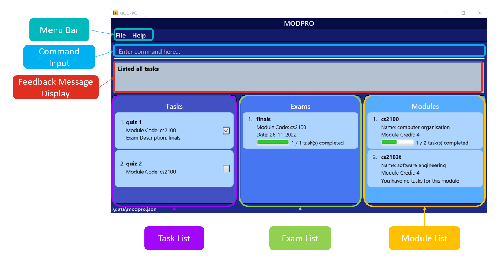

    

Long Time No See (LTNS) is a  **comprehensive desktop app built for financial advisors to manage their clients' financial policies and events**. It is optimized for use via a **[Command Line Interface](#command-line-interface-cli) (CLI)** while still having the benefits of an intuitive and minimalistic **[Graphical User Interface](#graphic-user-interface-gui) (GUI)**. With all the essential tools packed into one app, LTNS will enable you to streamline your financial advising journey immediately!

This document is the official user guide of the Long Time No See (LTNS) app. This guide serves as an introduction to LTNS and a help menu should you have any doubts while using the app.

# Table of Contents
1. [Quickstart](#quick-start)
2. [Features](#features) 
   1. [Common Features](#common-features) 
      1. [Viewing Help](#viewing-help--help)
      2. [Clearing Entries](#clearing-all-entries--clear)
      3. [Exiting the Program](#exiting-the-program--exit)
      4. [Saving Data](#saving-the-data)
      5. [Manually Editing Data File](#editing-the-data-file)
   2. [Client Features](#client-features) 
      1. [Adding a Client](#adding-a-client--addclient)
      2. [Listing all Clients](#listing-all-clients--allclients)
      3. [Editing a Client](#editing-a-client--editclient)
      4. [Searching for a Client](#searching-for-clients--findclient)
      5. [Deleting a Client](#deleting-a-client--deleteclient)
      6. [Sorting all Clients](#sorting-all-clients--sort)
      7. [Pin a Client](#pin-a-client--pin)
   3. [Policy Features](#policy-features) 
      1. [Adding a Policy](#adding-a-policy--addpolicy)
      2. [Switching to Policy View](#switching-to-the-view-of-currently-listed-policies--policies)
      3. [Listing all Policies](#viewing-all-policies-in-the-address-book--allpolicies)
      4. [Deleting a Policy](#deleting-a-policy--deletepolicy)
      5. [Searching for a Policy](#searching-for-a-policy--findpolicy)
      6. [Assigning a Policy to a Client](#assigning-a-policy-to-a-client--assign)
      7. [Listing all Assigned Policies](#listing-out-policies-assigned-to-a-client--listassigned)
      8. [Deleting Assigned Policies from a Client](#deleting-assigned-policies-from-a-client--deleteassigned)
      9. [Tracking your Income](#tracking-your-income---viewincome)
   4. [Event Features](#event-features)
      1. [Adding an Event](#adding-an-event--addevent)
      2. [Listing all Events](#viewing-all-events--allevents)
      3. [Searching for an Event](#searching-for-an-event--findevent)
      4. [Viewing all Events in the next 7 days](#viewing-all-events-in-the-next-7-days--calendar)
3. [Frequently Asked Questions](#faq)
4. [Command Summary](#command-summary)
5. [Glossary](#glossary)

--------------------------------------------------------------------------------------------------------------------

## Quick start
1. Ensure you have Java `11` or above installed on your Computer. (Installation Guides: [Mac User](https://www.geeksforgeeks.org/how-to-install-java-on-macos/), [Windows User](https://phoenixnap.com/kb/install-java-windows))

2. Download the latest `longtimenosee.jar` from [here](https://github.com/AY2223S1-CS2103T-W13-2/tp/releases).

3. Copy the file to the folder you want to use as the _home folder_ for your Long Time No See application.

4. Double-click the file to start the app. The GUI similar to the below should appear in a few seconds. Note how the app contains some sample data. 

5. Type the command in the command box and press Enter to execute it. e.g. typing **`help`** and pressing Enter will open the help window. 
   Some example commands you can try:

   * **`allClients`** : Lists all clients in the Address Book.

   * **`addClient`**`n/John Doe p/98765432 e/johnd@example.com a/John street, block 123, #01-301 b/2000-01-01 i/90000.0 ra/M` : Adds a client named `John Doe` to the Address Book.

   * **`deleteClient`**`3` : Deletes the 3rd client shown in the current list.

   * **`clear`** : Deletes all clients.

   * **`exit`** : Exits the app.

6. Refer to the [Features](#features) below for details of each command.

--------------------------------------------------------------------------------------------------------------------

# Features

**Long Time No See (LTNS)** allows you to track your clients, policies and events.
As such, the features available to you are split into **4** main features:
1. [Common Features](#common-features): Here you can find basic Application features
2. [Client Features](#client-features): Here you can find all features related to keeping track of all your clients 
3. [Policy Features](#policy-features): Here you can find all features related to keeping track of all your policies 
4. [Event Features](#event-features): Here you can find all features related to keeping track of all your important appointments

**:information_source: Notes about the command format:** 

* Words in `UPPER_CASE` are the parameters to be supplied by the user. 
  e.g. in `add n/NAME`, `NAME` is a parameter which can be used as `add n/John Doe`.

* Items in square brackets are optional. 
  e.g `n/NAME [t/TAG]` can be used as `n/John Doe t/friend` or as `n/John Doe`.

* Items with `…` after them can be used multiple times. 
  e.g. `[t/TAG]…​` can be used as `​` (i.e. 0 times). 
  and e.g. `c/cov…​` can be used 1 or more times.

* Parameters can be in any order. 
  e.g. if the command specifies `n/NAME p/PHONE_NUMBER`, `p/PHONE_NUMBER n/NAME` is also acceptable.

* If a parameter is expected only once in the command but you specified it multiple times, only the last occurrence of the parameter will be taken. 
  e.g. if you specify `p/12341234 p/56785678`, only `p/56785678` will be taken.

* Extraneous parameters for commands that do not take in parameters (such as `help`, `exit` and `clear`) will be ignored. 
  e.g. if the command specifies `help 123`, it will be interpreted as `help`. 

:bulb: **Tip:**
Parameters refer to the information you type into the app to be stored. For example, `n/John` where John is the parameter

## Common Features

### Viewing help : `help`

Shows a message explaining how to access the help page.

Format: `help`

### Clearing all entries : `clear`

Clears all data from your application. 

:warning: **Warning:**
This action is irreversible! 

Format: `clear`

### Exiting the program : `exit`

Exits the program.

Format: `exit`

### Saving the data

LTNS application data is saved in the hard disk automatically after any command that changes the data. There is no need to save manually.

### Editing the data file

LTNS application data is saved as a [JSON](#json-file) file `[JAR file location]/data/addressbook.json`. Advanced users are welcome to update data directly by editing that data file.

Below is an example of what your JSON File should look like: 
 

:exclamation: **Caution:**
If your changes to the data file makes its format invalid, AddressBook will discard all data and start with an empty data file at the next run.

## Client Features

### Adding a client : `addClient`

Adds a client to the address book.

Format: `addClient n/NAME p/PHONE_NUMBER e/EMAIL a/ADDRESS [t/TAG]…​ b/BIRTHDAY i/INCOME ra/RISK_APPETITE`

:bulb: **Tip:**
A client can have any number of tags (including 0)

:bulb: **Tip:**
The format for entering a birthday is "YYYY-MM-DD". The dates entered must be valid.

:bulb: **Tip:**
The `Risk Appetite` can be classified as High, Medium or Low. They are represented by characters "H", "M" and
"L" respectively. e.g: "ra/H". All other values will be ignored.

:bulb: **Tip:**
The income added is based on an individual's Yearly income.

An income added is based on the **tax income brackets** set up by [IRAS for Financial Year 2022-2023.](https://www.iras.gov.sg/taxes/individual-income-tax/basics-of-individual-income-tax/tax-residency-and-tax-rates/individual-income-tax-rates)

This information will be displayed in the app

| Income Bracket | Yearly Income range                                 |
|----------------|-----------------------------------------------------|
| First          | Less than or equal to S$30,000                      |
| Second         | More than S$30,000, less than or equal to $40,000   |
| Third          | More than S$40,000, less than or equal to $80,000   |
| Fourth         | More than S$80,000, less than or equal to $120,000  |
| Fifth          | More than S$120,000, less than or equal to $160,000 |
| Sixth          | More than S$160,000, less than or equal to $200,000 |
| Seventh        | More than S$200,000, less than or equal to $240,000 |
| Eight          | More than S$240,000, less than or equal to $280,000 |
| Ninth          | More than S$280,000, less than or equal to $320,000 |
| Tenth          | More than $320,0000                                 |

Examples:
* `addClient n/John Doe p/98765432 e/johnd@example.com a/John street, block 123, #01-01, b/2000-05-05 i/5000.0 ra/L`
* `addClient n/Betsy Crowe t/friend e/betsycrowe@example.com a/Newgate Prison p/1234567 t/criminal b/1920-05-06 i/1000000 ra/H`

### Listing all clients : `allClients`

Shows a list of all clients in the address book.

Format: `allClients`

### Editing a client : `editClient`

Edits an existing client in the address book.

Format: `editClient CLIENT_INDEX [n/NAME] [p/PHONE] [e/EMAIL] [a/ADDRESS] [t/TAG]… [b/BIRTHDAY] [i/INCOME] [ra/RISK_APPETITE] ​`

* Edits the client at the specified `CLIENT_INDEX`. The index refers to the index number shown in the displayed client list. The index **must be a positive integer** 1, 2, 3, …​
* At least one of the optional fields must be provided.
* Existing values will be updated to the input values.
* When editing tags, the existing tags of the client will be removed i.e adding of tags is not cumulative.
* You can remove all the client’s tags by typing `t/` without
    specifying any tags after it. 

Examples:
*  `editClient 1 p/91234567 e/johndoe@example.com` Edits the phone number and email address of the 1st client to be `91234567` and `johndoe@example.com` respectively.
*  `editClient 2 n/Betsy Crower t/` Edits the name of the 2nd client to be `Betsy Crower` and clears all existing tags.
*  `editClient 3 b/2000-01-01` Edits the birthday of the 3rd client to be the 1st January 2000.

### Searching for Clients : `findClient`

Search for clients based on certain [metrics](#metric)

Format: `findClient [n/NAME] [p/PHONE] [e/EMAIL] [a/ADDRESS] [t/TAG]…​ [b/BIRTHDAY] [i/INCOME] [ra/RISK_APPETITE] [ti/POLICY_TITLE] [cov/POLICY_COVERAGE]…​ [cmp/POLICY_COMPANY]`

The following table illustrates the details of each metric and their search range:

| Metric          | CLI Syntax | Usage Details                                                                                                                                                                                                                                                                                                                                                                                                               |
|-----------------|------------|-----------------------------------------------------------------------------------------------------------------------------------------------------------------------------------------------------------------------------------------------------------------------------------------------------------------------------------------------------------------------------------------------------------------------------|
| Name            | n/         | {::nomarkdown}<ul><li>The search is case-insensitive. e.g `hans` will match `Hans`</li><li>The order of the keywords does not matter. e.g. `Hans Bo` will match `Bo Hans`</li><li>Only full words will be matched e.g. `Han` will not match `Hans`</li><li>clients matching at least one keyword will be listed.   e.g. `Hans Bo` will return `Hans Gruber`, `Bo Yang`</li></ul>{:/}                                    |
| Phone           | p/         | {::nomarkdown}<ul><li>At least 3 numbers have to be specified</li><li>All clients whose phone number contains the exact specified numbers will be listed</li></ul>{:/}                                                                                                                                                                                                                                                      |
| Email           | e/         | {::nomarkdown}<ul><li>The search is case-insensitive. e.g `alice@example.com` will match `Alice@example.com`</li><li>Only full emails are valid e.g. `Alice` will not yield a valid search</li></ul>{:/}                                                                                                                                                                                                                    |
| Address         | a/         | {::nomarkdown}<ul><li>The search is case-insensitive. e.g `Bedok` will match `bedok`</li><li>Any length of textual search except for an empty space is valid</li></ul>{:/}                                                                                                                                                                                                                                                  |
| Tag             | t/         | {::nomarkdown}<ul><li>The search is case-insensitive. e.g `friends` will match `Friends`</li><li>Only full words will be matched e.g. `colleagues` will not match `colleague`</li><li>More than one tag can be specified to list all clients that have all the specified tags.   e.g. `friends` and `family` will list all clients with both the `friends` and `family` tag </li></ul>{:/}                              |
| Birthday        | b/         | {::nomarkdown}<ul><li>Only valid date inputs of the YYYY-MM-DD format are allowed. e.g `2020-12-30`</li><li>Only clients whose birthday falls on the specified date will be listed</li></ul>{:/}                                                                                                                                                                                                                            |
| Income          | i/         | {::nomarkdown}<ul><li>Any valid income value can be entered and it will be matched with the corresponding income bracket</li><li>All clients whose income falls under the same income bracket as the specified income will be listed   e.g `15000` will be matched with `12000`</li></ul>{:/}                                                                                                                           |
| Risk Appetite   | ra/        | {::nomarkdown}<ul><li>Only one of the 3 levels, {H, M, L}, is allowed</li><li>All clients whose risk appetite matches the specified risk level will be </li></ul>{:/}                                                                                                                                                                                                                                                       |
| Policy Title    | ti/        | {::nomarkdown}<ul><li>The search is case insensitive. e.g `Health Plan` will match `health plan`</li><li>Any length of alphanumeric input except for an empty space will be valid</li><li>clients who are covered by a policy which contains at least one keyword will be listed</li></ul>{:/}                                                                                                                              |
| Policy Coverag  | cov/       | {::nomarkdown}<ul><li>Only inputs of the valid coverage type options are allowed</li><li>More than one coverage can be specified to list all clients with all of the specified coverage types.   e.g. `HEALTH` and `LIFE` will list all clients with both the `HEALTH` and `LIFE` coverage type </li><li>Clients who are covered by policies which covers all the specified coverage types will be listed</li></ul>{:/} |
| Policy Company  | cmp/       | {::nomarkdown}<ul><li>Only one of the valid company abbreviations is allowed</li><li>Clients who are covered by a policy belonging to the specified company will be listed</li></ul>{:/}                                                                                                                                                                                                                                    |

Examples:

* `findClient n/John` returns `john` and `John Doe`
* `findClient n/alex david` returns `Alex Yeoh`, `David Li`
* `findClient p/8743` returns clients with that contain `8743` in their phone number
* `findClient t/colleagues t/friends` returns clients with both the `colleagues` and `friends` tag
* `findClient n/alex t/friends` returns clients with the name `alex` and tagged with a `friends` tag

### Deleting a client : `deleteClient`

Deletes the specified client from the address book.

Format: `deleteClient CLIENT_INDEX`

* Deletes the client at the specified `CLIENT_INDEX`.
* The index refers to the index number shown in the displayed client list.
* The index **must be a positive integer** 1, 2, 3, …​

Examples:
* `allClients` followed by `deleteClient 2` deletes the 2nd client in the address book.
* `findClient n/Betsy` followed by `deleteClient 1` deletes the 1st Client in the results of the `findClient` command.

### Sorting all Clients : `sort`

This allows you to sort your clients in the address book based on a specified metric.

Format: `sort KEYWORD`

* Sorts the list of clients based on specified keyword
* Keyword must be from client details

Sorting **KEYWORDS** are shown in the table below: 

| KEYWORD          | Function                                                                                                             |
|:-----------------|:---------------------------------------------------------------------------------------------------------------------|
| `default`        | Based on when a client was added, from oldest to newest                                                              |
| `name`           | By alphabetical order ie. "a" to "z"                                                                                 |
| `email`          | Clients using the same email platform are grouped together, thereafter, alphabetical order is used within each group |
| `phone`          | By numerical order of the phone number                                                                               |
| `birthday`       | From oldest to youngest   |                                                                                            
| `income`         | From highest to lowest income |
| `risk appetite`  | From highest to lowest ie. "H" to "M" to "L" |

Examples:
* `sort name` will display your address book in alphabetical order based on their name
* `sort phone` will display your addresss book in numerical order based on their phone numbers

Below is an example of what you will expect to see when you call `sort email`:

### Pin a Client : `pin`
* Format: `pin [CLIENT_INDEX]`
* Description: Allows pinning of important clients to be viewed separately with command `viewPin`
* Example Usage: `pin 1` pins the first client on list

### Assigning a Client to an Event/Policy 
An existing client in your Client Book can be assigned to an Event or Policy. 
To find out how to do so, you can refer to the [Adding an Event](#adding-an-event--addevent) guide to assign a Client to an Event or refer to the [Assigning a Policy to a Client](#assigning-a-policy-to-a-client-assign) guide to find out how you can assign a Client to a Policy.

## Policy Features
Store policies from a large assortment of companies, with different coverages and customisable yearly commissions! Assign them to a client when you secure a deal with ease.

### Adding a policy : `addPolicy`

Adds a policy to the address book.

Format: `addPolicy ti/TITLE cmp/COMPANY_CODE cms/Y1COMMISION% Y2COMISSION% Y3ONWARDS% cov/COVERAGE...`

:bulb: **Tip:**
A policy must have one or more coverages.

  

:bulb: **Tip:**
These are the valid coverages and their corresponding codes.

| Coverage Code | Coverage Name        |
|---------------|----------------------|
| LIFE          | Life Insurance       |
| MOTOR         | Motor Insurance      |
| HEALTH        | Health Insurance     |
| TRAVEL        | Travel Insurance     |
| PROPERTY      | Property Insurance   |
| MOBILE        | Mobile Insurance     |
| BITE          | Bite-sized Insurance |
| INVESTMENT    | Investment based     |

:bulb: **Tip:**
These are the valid companies and their corresponding codes.

| Company Code | Company Name                       |
|--------------|------------------------------------|
| MNF          | Manulife Financial Private Limited |
| PRU          | Prudential Assurance Company       |
| AXA          | AXA Insurance Private Limited      |
| GEL          | Great Eastern Life                 |
| NTU          | NTUC Income Insurance              |
| ETQ          | Etiqa Insurance                    |
| TML          | Tokio Marine Life Insurance        |
| AIA          | AIA Singapore Private Limited      |
| AVI          | Aviva Limited                      |
| FWD          | Singapore Private Limited          |

:bulb: **Tip:**
Commissions must take positive percentages within 0% to 100%! (e.g. 10%, 3.5%, 1.0%)

  

Examples:
* `addPolicy ti/PruShield cmp/AIA cms/10% 5% 1% cov/LIFE`
* `addPolicy ti/ManuInvest Duo cmp/MNF cms/6% 3% 1.5% cov/INVESTMENT cov/LIFE`

### Switching to the view of currently listed policies : `policies`
Switches the display to show the current list of policies.

:bulb: **Tip:**
If you previously filtered the policy list and switched to view events/contacts/income, this command will allow you to return to the filtered list of policies. 

:bulb: **Tip:**
If you wish to view the **full** list of policies, you may do so with the command `allPolicies`. 

Format: `policies`

Example Usage: `policies`

Example Result: Shows the currently listed policies on the screen.

### Viewing all policies in the address book : `allPolicies`
Switches the display to show **all** the policies stored in the address book.

Format: `allPolicies`
Example Usage: `allPolicies`
Example Result: Shows all policies stored in the address book, on the screen.

### Deleting a policy : `deletePolicy`
* Format: `deletePolicy POLICY_INDEX`

* Deletes the policy at the specified `INDEX`.
* The index refers to the index number shown in the displayed list of policies.
* The index **must be a positive integer** 1, 2, 3, …​

Examples:
* `allPolicies` followed by `deletePolicy 2` deletes the 2nd policy in the address book.
* `findPolicy PruShield` followed by `delete 1` deletes the 1st policy in the results of the `findPolicy` command.

### Searching for a Policy : `findPolicy`

Search for policies based on certain metrics

Format: `findPolicy [ti/POLICY_TITLE] [cov/POLICY_COVERAGE]…​ [cmp/POLICY_COMPANY]`

The following table illustrates the details of each metric and their search range:

| Metric          | Usage Details                                                                                                                                                                                                                                                                                                                                                                                     |
|-----------------|---------------------------------------------------------------------------------------------------------------------------------------------------------------------------------------------------------------------------------------------------------------------------------------------------------------------------------------------------------------------------------------------------|
| Policy Title    | {::nomarkdown}<ul><li>The search is case insensitive. e.g `Health Plan` will match `health plan`</li><li>Any length of alphanumeric input except for an empty space will be valid</li><li>Policies which titles contains at least one keyword will be listed</li></ul>{:/}                                                                                                                        |
| Policy Coverage | {::nomarkdown}<ul><li>Only inputs of the valid coverage type options are allowed</li><li>More than one coverage can be specified to list all policies with all of the specified coverage types.   e.g. `HEALTH` and `LIFE` will list all policies with both the `HEALTH` and `LIFE` coverage type </li><li>Policies which cover all the specified coverage types will be listed</li></ul>{:/} |
| Policy Company  | {::nomarkdown}<ul><li>Only one of the valid company abbreviations is allowed</li><li>Policies which belong to the specified company will be listed</li></ul>{:/}                                                                                                                                                                                                                                  |

Examples:

* `findPolicy ti/Health plan` returns `health plan` and `life plan`
* `findPolicy cov/LIFE cov/HEALTH` returns policies that cover both LIFE and HEALTH
* `findPolicy cmp/PRU` returns policies that belong to Prudential Assurance Company
* `findPolicy ti/Shield cov/LIFE` returns polices with Shield in its title and covers the LIFE coverage type

### Assigning a Policy to a Client : `assign` 

If you have successfully sealed a deal with a client, you can keep track of this by assigning the policy to your client! 

If you have yet to add either your Client or Policy to the Application, you can refer to the [Adding a Client](#adding-a-client-add) or [Adding a Policy](#adding-a-policy) guides.

Format: `assign CLIENT_INDEX POLICY_INDEX pr/PREMIUM sd/STARTDATE ed/ENDDATE`

:bulb: **Tip:**
The start and end dates should be of the format "YYYY-MM-DD", and within the years 1900 - 2100.

:bulb: **Tip:**
Premium should be any positive numeric value below `1000000000` with or without 2 decimal places.

Example Usage:

* Step 1: `findPolicy cmp/PRU` to filter the list of policies that belong to Prudential Assurance Company.
* Step 2: `findClient n/John Doe` to filter the list of clients to find 'John Doe'.
* Step 3: `assign 1 1 pr/2000 sd/2010-10-10 ed/2021-10-12` to assign the first policy in the list from Step 1, to the 
first client in the list from Step 2, with the following details:
  1. Yearly premium of $2000
  2. Start date of 10th October 2010
  3. End date of 12th October 2021

### Listing out policies assigned to a client : `listAssigned`

If you'd like to recall which policies a client has taken up this command lists out, in the command box, the policies 
that have been assigned to a specific client.

Format: `listAssigned CLIENT_INDEX`

Example Usage:

1. `findClient n/John Doe` to filter the list of clients to find `John Doe`.
2. `listAssigned CLIENT_INDEX` to list out the policies assigned to the first client in the list from Step 1.

### Deleting assigned policies from a client : `deleteAssigned`

Unfortunate, but it happens. If a client cancels their policy prematurely, reflect the deletion of their assigned policy
in the address book using this command.

Format: `deleteAssigned CLIENT_INDEX ASSIGNED_POLICY_INDEX`

Example Usage:
1. Similar to [listAssigned](#listing-out-policies-assigned-to-a-clientlistassigned), filter the list for the desired client and find out which policies they have been assigned to.
2. `deleteAssigned 1 1` to delete the first assigned policy in the assigned policy list from Step 1, of the first client obtained from filtering the client list.

This allows you to sort your clients in the address book based on a specified metric.

### Tracking your Income  : `viewIncome`

Format: `viewIncome <year>`

* Automatically calculates your 3 year expected income (with selected year as starting year)

Rules:
* Year must be between 1900 and 2200

Examples:
* `viewIncome 2000` will display the expected income for years 2000, 2001 and 2002
* `viewIncome 1899` will not be allowed since 1899 is not between 1900 and 2200

(Result after typing the command `viewIncome 2000`, which displays three year expected income starting from year 2000)

## Event Features

### Adding an Event : `addEvent`
* Format: `addEvent desc/EVENT_DESCRIPTION n/CLIENT_NAME date/EVENT_DATE st/START_TIME et/END_TIME`
* Description: Adds an event into the address book. Note the following restrictions
    * `START_TIME` must before `END_TIME`. All times are in the format: `HH:MM`.
    * `EVENT_DATE` follows a standard date format for our app (i.e: `YYYY-MM-DD`).
    * `CLIENT_NAME` indicates the name of a valid client within the address book. All Events must be tagged to a single client.
        * If you have not added this Client to your Client Book, you can refer to the [Adding a Client](#adding-a-client-add) guide to add your Client first.
* Example Usage: `addEvent desc/CS101 Consultation n/Ben Leong date/2023-01-01 st/12:00 et/13:00`
* Example Result: add an event with `Ben Leong` from `12:00` to `13:00` for the `1st January 2023` for a CS101 consultation.

Format: `deleteEvent EVENT_INDEX`

* Deletes the event at the specified `EVENT_INDEX`.
* The index refers to the index number shown in the displayed event list.
* The index **must be a positive integer** 1, 2, 3, …​
* Example Usage: `deleteEvent 2`
* Example Result: deletes the 2nd event from the list.

### Viewing all Events : `allEvents`

This allows you to view all Events that have been previously added.
* Note that events are automatically sorted in chronological order.

Format: `allEvents`

### Searching for an Event : `findEvent`

Search for events based on certain metrics

Format: `findEvent [desc/DESCRIPTION] [n/CLIENT_NAME] [date/DATE]`

The following table illustrates the details of each metric and their search range:

| Metric      | Usage Details                                                                                                                                                                                                                                                                                                                                                                                                                            |
|-------------|------------------------------------------------------------------------------------------------------------------------------------------------------------------------------------------------------------------------------------------------------------------------------------------------------------------------------------------------------------------------------------------------------------------------------------------|
| Description | {::nomarkdown}<ul><li>The search is case-insensitive. e.g `Meeting to discuss plans` will match `meeting to discuss plans`</li><li>Only full phrases will be matched e.g. `Meeting to discuss plans` will not match `Plans`</li><li>Only events for which description contains the complete specified phrase will be listed.   e.g. `discuss plans` will return `Meeting to discuss plans` and `Discuss plans`</li></ul>{:/}         |
| Client Name | {::nomarkdown}<ul><li>The search is case-insensitive. e.g `John` will match `john`</li><li>The order of the keywords does not matter. e.g. `Hans Bo` will match `Bo Hans`</li><li>Only full words will be matched e.g. `Han` will not match `Hans`</li><li>Events with the participant name contains at least one keyword will be listed.   e.g. `Hans Bo` will return events which involve `Hans Gruber` or `Bo Yang`</li></ul>{:/} |
| Date        | {::nomarkdown}<ul><li>Only valid date inputs of the YYYY-MM-DD format are allowed. e.g `2020-12-30`</li><li>Only events which occur on the specified date will be listed</li></ul>{:/}                                                                                                                                                                                                                                                   |

Examples:

* `findEvent desc/coffee break meeting` returns events `morning coffee break meeting` and `afternoon coffee break meeting`
* `findEvent n/Bernice` returns all events for which participant name contains `Bernice`
* `findEvent date/2022-12-30` returns all events which occurs on `30th December 2022`
* `findEvent n/Alice date/2022-11-15` returns all events for which participant name contains `Alice` and occurs on `15th November 2022`

### Viewing all Events in the next 7 days : `calendar`

This allows you to view all Events that you have in the next 7 days, allowing you to keep track of any upcoming important appointments you have scheduled. 

Format: `calendar`

## FAQ

Q: How do I transfer my data to another Computer?  
A : Install the app in the other computer and overwrite the empty data file it creates with the file that contains the data of your previous LTNS home folder.

Q: Why am I seeing `(insert error)` when trying to add an event? 
A : When adding an Event involving a client, this client must exist in your client book first.

Q: Why am I seeing a `Sorting metric does not exist` error when trying to sort my client list?  
A : You may be typing a wrong <b>keyword</b> or calling a sorting metric which is not supported. You may refer to [this list](#sorting-all-clients--sort) for a list of supported **keywords**. If you would like to suggest more sorting **keywords**, do feel free to contact us! 

Q: Why is a blank screen shown when I use the `calendar` feature?  
A: You may not have added any upcoming events in the next 7 days! You may want to [Add an Event](#adding-an-event--addevent) first. Alternatively, you can choose to [view all Events](#viewing-all-events--allevents) instead.

Q: What do I do if the user guide does not address my concern?  
A: Fret not! Simply drop us an email at e0725346@u.nus.edu, and we will reply within three working days!

--------------------------------------------------------------------------------------------------------------------

## Command summary

### General Commands

| Action                      | Format, Examples                                                                                                                                                                                              |
|-----------------------------|---------------------------------------------------------------------------------------------------------------------------------------------------------------------------------------------------------------|
| **Clear Pre-existing Data** | `clear`                                                                                                                                                                                                       |                                                                                                                                                                                                      
| **Help**                    | `help`                                                                                                                                                                                                        |
| **Exit Application**        | `exit`                                                                                                                                                                                                        |

### Commands For Clients

| Action                    | Format, Examples                                                                                                                                                                                           |
|---------------------------|------------------------------------------------------------------------------------------------------------------------------------------------------------------------------------------------------------|
| **Find Client**           | `findClient [n/NAME] [p/PHONE] [e/EMAIL] [a/ADDRESS] [t/TAG]… [b/BIRTHDAY] [i/INCOME] [ra/RISK_APPETITE] [ti/POLICY_TITLE] [cov/POLICY_COVERAGE]…​ [cmp/POLICY_COMPANY]`   e.g: `find n/Jim p/98765432` |
| **Add Client**            | `addClient [n/NAME] [p/PHONE_NUMBER] [e/EMAIL] [a/ADDRESS] [t/TAG]…​`    e.g: `add n/James Ho p/22224444 e/jamesho@example.com a/123, Clementi Rd, 1234665 t/friend t/colleague`                        |
| **Delete Client**         | `deleteClient [INDEX]`   e.g: `delete 3`                                                                                                                                                                |
| **Edit Client**           | `editClient [INDEX] [n/NAME] [p/PHONE_NUMBER] [e/EMAIL] [a/ADDRESS] [t/TAG]…​`   e.g: `edit 2 n/James Lee e/jameslee@example.com`                                                                       |
| **View All Clients**      | `allClients`                                                                                                                                                                                               |
| **View Filtered Clients** | `clients`                                                                                                                                                                                                  |                                                              

Note: `allClients` shows all existing clients inside LTNS, while `clients` show all clients based on filter matrices placed previously.

### Commands For Policy

| Action                     | Format, Examples                                                                                                                                               |
|----------------------------|----------------------------------------------------------------------------------------------------------------------------------------------------------------|
| **Find Policy**            | `findPolicy [ti/POLICY_TITLE] [cov/POLICY_COVERAGE] [cmp/POLICY_COMPANY]`   e.g: `findPolicy cov/LIFE`                                                     |        
| **Add Policy**             | `addPolicy [ti/POLICY_TITLE] [cmp/POLICY_COMPANY] [cms/POLICY_COMMISSION] [cov/POLICY_COVERAGE]`   e.g: `addPolicy ti/Health cmp/MNF cms/4% 3% 2% cov/LIFE` |                                                                                                                         
| **Delete Policy**          | `deletePolicy [POLICY_INDEX]`   e.g: `deletePolicy 1`                                                                                                       |                                                                                                                                                                                             
| **View All Policies**      | `allPolicies`                                                                                                                                                  |
| **View Filtered Policies** | `policies`                                                                                                                                                     |
| **View Assigned Policies** | `assign [CLIENT_INDEX] [POLICY_INDEX] [pr/PREMIUM_PAID] [sd/START_DATE] [ed/END_DATE]`   e.g: `assignPolicy 1 1 pr/10000 sd/2000-01-02 ed/2000-02-01`       |
| **Delete Assigned**        | `deleteAssigned [CLIENT_INDEX] [POLICY_INDEX]`   e.g: `deleteAssigned 1 1`                                                                                  |                                                                                                                                                                                                               
| **List Assigned**          | `listAssigned`                                                                                                                                                 |
| **View Income**            | `viewIncome [YEAR]`                                                                                                                                            |                                                                                                                                                                                                                                                                                                                                                                           

Note: `allPolicies` shows all existing policies inside LTNS, while `policies` show all policies based on filter matrices placed previously.

### Commands For Events

| Action                   | Format, Examples                                                                                                                                                                |
|--------------------------|---------------------------------------------------------------------------------------------------------------------------------------------------------------------------------|
| **Find Event**           | `findEvent [desc/DESCRIPTION] [n/PERSON_NAME] [date/DATE]`   e.g: `findEvent date/2022-05-05`                                                                               |
| **Add Event**            | `addEvent [desc/DESCRIPTION] [n/NAME] [date/DATE] [st/START_TIME] [et/END_TIME]`   e.g: `addEvent desc/Meet Clement at Noon n/Clement Tan date/2022-10-10 st/12:00 et/13:00` |
| **Delete Event**         | `deleteEvent [EVENT_INDEX]`   e.g: `deleteEvent 1`                                                                                                                           |
| **View All Events**      | `allEvents`                                                                                                                                                                     |
| **View Filtered Events** | `events`                                                                                                                                                                        |
| **View Calendar**        | `calendar`                                                                                                                                                                      |                                                                                                                                                                                                     

Note: `allEvents` shows all existing events inside LTNS, while `events` show all events based on filter matrices placed previously.

### Miscellaneous Commands

| Action          | Format, Examples                                     |
|-----------------|------------------------------------------------------|
| **Sort**        | `sort [COMPARABLE_METRIC]`   e.g: `sort AGE`      |
| **Pin**         | `pin [n/NAME]`   e.g: `pin n/Jim`                 |
| **View Pinned** | `viewPin`   e.g: `viewPin`                        |

## Glossary 

### Parameter

#### Policy
An insurance or investment package entailing the details of the insurance and/or investment

#### Coverage 
Specific to an insurance policy, coverage describes the amount of risk or liability which is covered by the insurance policy

#### Graphic User Interface (GUI)
A User Interface that allows users to interact with the application through visual components

#### Command-Line Interface (CLI)
A Text-Based User Interface which allows you to use the application in the form of typing out "commands"

#### JSON File 
A file which is used to store data in text form. 

#### Metric 
A standard of measurement. In the case of LTNS, a metric in sorting or searching tells the application how to compare the clients

#### Income Bracket
Various income level ranges categorised by levels. LTNS uses the Inland Revenue Authority of Singapore's (IRAS) measurement of an income bracket.

     
 
 
