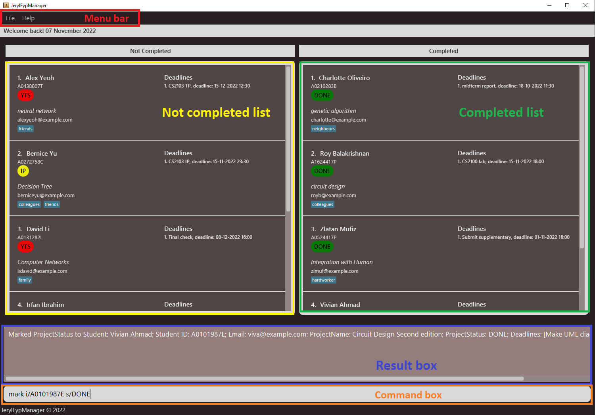

**JerylFypManager** is a desktop application catered to professors and final year project (FYP) students to manage and
track the progress of students’ FYP projects, as well as serving as a platform for professors to provide feedback on
their students’ progress. The application’s simple design provides a nifty platform to navigate through and present the
FYP projects in a concise manner.

* Table of Contents
{:toc}

--------------------------------------------------------------------------------------------------------------------

## 1. Introduction

<!-- Reused from https://ay2122s2-cs2103t-w14-1.github.io/tp/UserGuide.html with minor modifications -->

### 1.1. About the User Guide
The purpose of this guide is to explain to you how to use FypManager and to allow you to have an enjoyable experience. It explains the features and commands compatible with FypManager. It is also structured in a way to let you easily navigate to relevant sections.

### 1.2. Navigating the User Guide
For help with installing and understanding FypManager's GUI, you can head over to our [Quick start](#2-quick-start) section.

For the full documentation of each feature, you can refer to our [Features](#3-features) section.

For a list of frequently asked questions about FypManager, you can refer to our [FAQ](#4-faq) section.

If you are an advanced user, you can refer to our [Command summary](#5-command-summary) section.

--------------------------------------------------------------------------------------------------------------------

## 2. Quick start

### 2.1. Installation
1. Ensure you have Java `11` or above installed on your Computer. Otherwise, you may follow [this guide](https://docs.oracle.com/en/java/javase/11/install/) to install Java `11`.

2. Download the latest `JerylFypManager.jar` from [here](https://github.com/AY2223S1-CS2103-F09-1/tp/releases).

3. Copy the file to the desired folder you want to use as the _home folder_ for your FypManager.

4. Double-click the file to start the app. The GUI, similar to the one shown below, should appear in a few seconds. 
   Note how the app
   contains some sample data (not the same as the image below).   
      

5. Do refer to [GUI Overview](#22-gui-overview) to understand what each component in the GUI does.

6. Do refer to [Tutorial](#23-tutorial) to test a few sample commands.

### 2.2. GUI Overview
<!-- Reused from https://ay2122s2-cs2103t-w14-1.github.io/tp/UserGuide.html with minor modifications -->

The various GUI components of FypManager are described in the picture below:

* `Menu bar`: Menu buttons that you can click to exit FypManager or to open up the help window that contains a link to this user guide.
* `Not completed list`: You can view the list of students who haven't completed their FYP along with their deadlines.
* `Completed list`: You can view the list of students who have completed their FYP.
* `Command box`: You can type and enter commands to run in this box.
* `Result box`: You can view the results from running your commands in this box.

### 2.3. Tutorial
Type the command in the command box and press Enter to execute it. 
Some example commands that you can try:

* **`list`** - lists all FYP projects the professor is supervising.

* **`add -s i/A0123456G n/John Doe p/Automation of Selenium e/johndoe@gmail.com`** - adds the FYP project of the
  student named John Doe with student ID A0123456G, email `johndoe@gmail.com`, 
  and project titled _Automation of Selenium_.

* **`delete -s i/A0123456G`** - deletes the FYP project of the student with student ID A0123456G.

* **`mark i/A0123456G s/IP`** - marks the FYP project of the student with student ID A0123456G as _In Progress_.

* **`find machine`** - searches any FYP project names that has “machine” in its name, for example it will include
  the FYP project named “Machine Learning”.

* **`help add -s`** - shows a message on how to use the `add -s` command.

* **`help`** - shows the list of all commands available.

* **`exit`** - exits the application.

Refer to the [Features](#3-features) section for details of each command.

--------------------------------------------------------------------------------------------------------------------

## 3. Features

**:information_source: Notes about the command format:** 

* Words in `UPPER_CASE` are the parameters to be supplied by the user. 
  e.g. in `add -s n/FYP_NAME`, `FYP_NAME` is a parameter which can be used as `add -s n/Neural Network`.
*  Having multiple prefix parameter as inputs would result in latest (right most input) to be read.  
  e.g. `add -s i/A0123456J i/A6543210J n/Russell Dash` will be read as `add -s i/A6543210J n/Russell Dash`.

* Items in square brackets are optional. 
  e.g. `n/FYP_NAME [t/TAG]` can be used as `n/Neural Network t/SOC` or as `n/Data Caching`.

* Items with `…`​ after them can be used multiple times including zero times. 
  e.g. `[t/TAG]…​` can be used as ` ` (i.e. 0 times), `t/SOC`, `t/SOC t/ML` etc.

* Parameters can be in any order. 
  e.g. if the command specifies `n/FYP_NAME t/TAG`, `t/TAG n/FYP_NAME` is also acceptable.

* Extraneous parameters for commands that do not take in parameters (such as `list` and `exit`) will be ignored. 
  e.g. if the command specifies `list 456`, it will be interpreted as `list`.

* Invalid parameters for `help` command will be ignored. 
  e.g. if the command specifies `help 123`, it will be interpreted as `help`. 
  e.g. if the command specifies `help sort -p 456`, it will be interpreted as `help sort -p'.

* If the flag is not specified for a `help certainCommand` command, where `certainCommand` is a valid command word, the **default** help message for `certainCommand` will be shown. 
  e.g. if the command specifies `help sort`, it will be interpreted as `help sort -p`.

* `STUDENT_ID` should be in the following format: **"A" + (7 digits) + (1 uppercase letter)**.  
  e.g. `A0123456G`.

* `FYP_NAME` and `DEADLINE_NAME` should only include alphanumeric characters and spaces but
**cannot start with a space**. 
  e.g. ` Support vector machine: some improvements` is invalid

* `DEADLINE_DATETIME` can be in the format of **"DD-MM-YYYY HH:mm"** or **"YYYY-MM-DD HH:mm"**. 
  e.g. `05-11-2022 08:00`, `2022-11-05 08:00`.

* For deadline tasks, a priority rank specifies the importance of said task.  
  e.g. `delete -d i/A0123456X r/2` would delete the 2nd highest priority deadline for the student with student 
  ID of A0123456X.

### 3.1. General Features

#### 3.1.1. Viewing help: `help`

Shows a list of valid commands or a help page on a particular command.

Format: `help [COMMAND]`

Examples:

* `help add -s` - This shows a detailed help message on the `add -s` command.
* `help` - This shows an open window revealing the URL to the user guide which could be copied to the user's clipboard.

#### 3.1.2. List of FYPs: `list`

Shows a list of final year projects with the student IDs.

Format: `list`

#### 3.1.3. Sorting the FYP list: `sort`

Shows the sorted list of final year projects based on a specific field.

The two fields that the user can sort by are:

1. `ProjectName`
2. `ProjectStatus`

Format for each variant of `sort`:

1. `ProjectName`: `sort [-p]`, this is the default variant
2. `ProjectStatus`: `sort -s`

#### 3.1.4. Clearing the FYP list: `clear`

Clears the FYP list.

Format: `clear`

#### 3.1.5. Exiting the application: `exit`

Exits the program.

Format: `exit`

### 3.2. Student Features

#### 3.2.1. Adding students FYP: `add -s`

Adds a new FYP of a student to the FYP manager. The same student ID should not exist in the FYP manager previously.

An `add` command without the `-s` flag specified explicitly will be interpreted as `add -s` by default.

Format: `add [-s] i/STUDENT_ID n/STUDENT_NAME p/FYP_NAME e/EMAIL [t/TAG]…​`

:bulb: **Tip:**
A student can have any number of tags! (including 0)

Examples:

* `add -s i/A0123456G n/Jane Doe p/Neural Network e/e0123456@u.nus.edu t/NN t/Difficult`
* `add -s i/A0987654X n/Alex Yeoh p/Data Caching e/e09876567@u.nus.edu`
* `add i/A0987654X n/Alex Yeoh p/Data Caching e/e09876567@u.nus.edu`

#### 3.2.2. Removing students FYP: `delete -s`

Removes a FYP from the FYP manager. The specified student ID must exist in the FYP manager previously.

An `delete` command without the `-s` flag specified explicitly will be interpreted as `delete -s` by default.

Format: `delete [-s] i/STUDENT_ID`

Examples:

* `delete -s i/A0987654X`
* `delete i/A0987654X`

#### 3.2.3. Marking project status: `mark`

Marks a FYP as "Done"/"In Progress"/"Yet to Start", etc.

Format: `mark i/STUDENT_ID s/STATUS`

* Current supported statuses are as follows:
    * **"DONE"** - Done
    * **"IP"** - In Progress
    * **"YTS"** - Yet To Start

* Parsing of status is  *case-sensitive*:  
    * **DONE** instead of *Done*, *done*, etc.

Examples:

* `mark i/A0123456G s/DONE`
* `mark i/A0234567H s/YTS`

#### 3.2.4. Searching keyword: `find`

Finds projects whose field (as specified by user) contains any of the given keyword(s).
The four fields that the user can search by are:

1. `ProjectName`
2. `StudentId`
3. `StudentName`
4. `Tags` (accorded to a student)

Format for each variant of `find`:

1. `ProjectName`: `find [-p] KEYWORD/[KEYWORD2/KEYWORD3/…]`, this is the default variant
2. `StudentId`: `find -i KEYWORD/[KEYWORD2/KEYWORD3/…]`
3. `StudentName`: `find -n KEYWORD/[KEYWORD2/KEYWORD3/…]`
4. `Tags`: `find -t KEYWORD/[KEYWORD2/KEYWORD3/…]`

* the `/` in the above examples shows multiple input parameters.  
  e.g. `find -i A0123456X/A0123456G` will search for all students with either student ID of *A0123456X* or *A0123456G*.
* Only the four specified fields above could be searched, and only one field can be searched at any one time.
* The keyword is case-insensitive, e.g. `Neural NetWORK` will match `neural network`.
* The keyword could contain spaces, e.g. `practical guide of machine learning` is allowed.
* Partial keywords will also be matched, e.g. `Ne` will match `neural network` and `Genetic Algorithm`.
* Leading and trailing spaces are ignored, e.g. ` neural network  ` will match `neural network`.
* Projects matching at least one keyword will be returned (i.e. `OR` search),
  e.g. `find -t neural network/tree` will match project tags containing `neural network` or `decision tree`.

Examples:

* `find -t Neural Network` searches for all projects with at least one tag containing `Neural Network`.
* `find -p Neural/Network / Data` searches for all projects with `Neural` or `Network` or `Data` in their titles.

Remark:

* A neat alternative to `list`: `find -i a` or `find -i /a` will function the same way as `list` and returns a list
  of all students, as student ID always begins with letter 'a'.

#### 3.2.5. Edit student details: `edit`

Edits student details according to the input.

Format: `edit STUDENT_ID [n/STUDENT_NAME] [p/FYP_NAME] [e/EMAIL] [t/TAG]…​`

* At least one of the optional fields must be present.

Examples:

* `edit A0123456G p/Food Genetics` sets the project name of the student with student ID `A0123456G` into
  `Food Genetics`.

* `edit A0234567H n/John Hoe p/Food Genetics` sets the name of the student with student ID `A0123456G` into
  `John Hoe` and at the same time sets the project name into `Food Genetics`.

### 3.3. Deadline Features

#### 3.3.1. Adding a deadline to a student's FYP: `add -d`

Adds a new deadline to a student specified by the student ID. The deadline name should not exist in this student previously.

Format: `add -d i/STUDENT_ID n/DEADLINE_NAME d/DEADLINE_DATETIME`

Example:

* `add -d i/A0123456G n/Random Task d/23-10-2022 23:59`

#### 3.3.2 Removing a student's deadline: `delete -d`

Removes a deadline assigned to a student specified by ID & a priority rank. The specified deadline must exist in the student's deadline list previously.

Format: `delete -d i/STUDENT_ID r/DEADLINE_RANK`

Example:

* `delete -d i/A0123456G r/1`

--------------------------------------------------------------------------------------------------------------------

## 4. FAQ

**Q**: How do I transfer my data to another Computer? 
**A**: Install the app in the other computer and overwrite the empty data file it creates with the file that contains
the data of your previous FypManager home folder.

--------------------------------------------------------------------------------------------------------------------

## 5. Command summary

### 5.1. General Commands

| Action                     | Format, Examples                                                                                                                                    |
|----------------------------|-----------------------------------------------------------------------------------------------------------------------------------------------------|
| **Help**                   | `help [COMMAND]`  e.g., `help add -s`, `help`                                                                                                    |
| **List**                   | `list`                                                                                                                                              |
| **Sort by Project Name**   | `sort [-p]`                                                                                                                                         |
| **Sort by Project Status** | `sort -s`                                                                                                                                           |
| **Clear**                  | `clear`                                                                                                                                             |
| **Exit**                   | `exit`                                                                                                                                              |

### 5.2. Student Commands

| Action                     | Format, Examples                                                                                                                                    |
|----------------------------|-----------------------------------------------------------------------------------------------------------------------------------------------------|
| **Add Student**            | `add [-s] i/STUDENT_ID n/STUDENT_NAME p/FYP_NAME e/EMAIL [t/TAG]…​`   e.g., `add -s i/A0987654X n/John Doe p/Data Caching e/e09876567@u.nus.edu` |
| **Delete Student**         | `delete [-s] id`   e.g., `delete -s i/A0987654X`, `delete i/A0987654X`                                                                           |
| **Mark**                   | `mark i/STUDENT_ID s/STATUS`  e.g.,`mark i/A0123456G s/IP`                                                                                       |
| **Find by Project Name**   | `find [-p] KEYWORD/[KEYWORD2/KEYWORD3/…]`  e.g., `find -p data / software`, `find data / software`                                               |
| **Find by Student ID**     | `find -i KEYWORD/[KEYWORD2/KEYWORD3/…]`  e.g., `find -i 515W/123X/A09281`                                                                        |
| **Find by Student Name**   | `find -n KEYWORD/[KEYWORD2/KEYWORD3/…]`  e.g., `find -n John`                                                                                    |
| **Find by Tags**           | `find -t KEYWORD/[KEYWORD2/KEYWORD3/…]`  e.g., `find -t Handsome/Look`                                                                           |
| **Edit**                   | `edit STUDENT_ID [n/STUDENT_NAME] [p/FYP_NAME] [e/EMAIL]`  e.g., `edit A0234567H n/John Hoe`                                                     |
| **Sort by Project Name**   | `sort [-p]`                                                                                                                                         |
| **Sort by Project Status** | `sort -s`                                                                                                                                           |

### 5.3. Deadline Commands

| Action                     | Format, Examples                                                                                                                                    |
|----------------------------|-----------------------------------------------------------------------------------------------------------------------------------------------------|
| **Add Deadline**           | `add -d i/STUDENT_ID n/DEADLINE_NAME d/DEADLINE_DATETIME`   e.g., `add -d i/A0123456G n/Random Task d/23-10-2022 23:59`                          |
| **Delete Deadline**        | `delete -d i/STUDENT_ID r/DEADLINE_RANK`   e.g., `delete -d i/A0123456G r/1`                                                                     |

--------------------------------------------------------------------------------------------------------------------

## 6. Glossary

<!-- Reused from https://ay2122s2-cs2103t-w14-1.github.io/tp/UserGuide.html with minor modifications -->
| Term                                      | Explanation                                                                                     |
|-------------------------------------------|-------------------------------------------------------------------------------------------------|
| Java                                      | A programming language which was used to built FypManager.                                      |
| Command-line Interface (CLI)              | An interface which involves the users typing text and executing it as commands.                 |
| Graphical User Interface (GUI)            | An interface which involves the users clicking buttons and selecting options from the menu bar. |