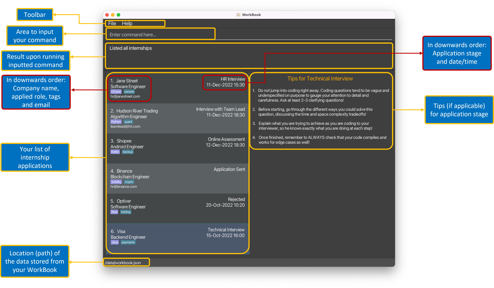

## About

The purpose of this user guide is to help both new and experienced users with using FindMyIntern.

- If you are a new user, we recommend checking out the [introduction](#introduction) to get a better idea of what FindMyIntern can do.
If you have no prior experience with command line interfaces, we recommend reading this [guide](#command-line-guide).

- If you are an experienced user, you can use the [table of contents](#table-of-contents) to jump straight to what you are looking for.

## Introduction
Are you a student applying for internships? Do you have trouble remembering what you have applied?
Or are you tired of using Excel to keep track?
Applying for internships is already painful enough.
There should be an easy way to keep track of various applications and upcoming interviews.
FindMyIntern is the perfect solution for you!

FindMyIntern is a desktop application that helps students easily keep track of
their internship applications.

FindMyIntern helps you to
- Consolidate all applications into a single place
- Find particular internship applications
- Easily visualise different applications

## Table of Contents

The user guide is divided into different sections. Click on any of the sections to jump right into that section!

<div class="card mb-2">
<div markdown="1" class="card-body py-0">
<h6 markdown="1" class="card-title">[Command line guide](#command-line-guide)</h6>
This section teaches you how to use the command line.
</div>
</div>

<div class="card mb-2">
<div markdown="1" class="card-body py-0">
<h6 markdown="1" class="card-title">[Quick Start](#quick-start)</h6>
This section teaches you how to install and **get started** with FindMyIntern.
</div>
</div>

<div class="card mb-2">
<div markdown="1" class="card-body py-0">
<h6 markdown="1" class="card-title">[Features](#features)</h6>
This section contains **everything you need to know** about the features in FindMyIntern.

It includes:
- [Commands](#commands)
- [Saving and Editing](#saving-and-editing)
- [UI Elements](#ui-elements)
</div>
</div>

<div class="card mb-2">
<div markdown="1" class="card-body py-0">
<h6 markdown="1" class="card-title">[FAQ](#faq)</h6>
This section includes all frequently asked questions about FindMyIntern.
</div>
</div>

<div class="card mb-2">
<div markdown="1" class="card-body py-0">
<h6 markdown="1" class="card-title">[Appendix](#appendix)</h6>
This section specifies **the input details** that you have to be aware of in FindMyIntern.
</div>
</div>

<div class="card mb-2">
<div markdown="1" class="card-body py-0">
<h6 markdown="1" class="card-title">[Command Summary](#command-summary)</h6>
This section contains the formats of all commands in FindMyIntern.
</div>
</div>

--------------------------------------------------------------------------------------------------------------------
## Command Line Guide

   <p align="center">
       
   </p>
That’s it! That’s all you need to know about command line to use FindMyIntern. You are now ready to start.

## Quick Start

### Setting up

1. Ensure you have [Java 11](https://www.oracle.com/java/technologies/downloads/#java11) or above installed in your Computer.

2. Download the latest `findmyintern.jar` from [here](https://github.com/AY2223S1-CS2103T-T14-1/tp/releases).

3. Copy the file to the folder you want to use as the _home folder_ for your FindMyIntern.

4. Double-click the file to start the app.

### Adding your first internship application

Now that you've downloaded FindMyIntern, you can start managing your internship applications. Let's start by adding your first internship application.

1. Open FindMyIntern by double-clicking `findmyintern.jar` if you have not already done so.

2. The GUI similar to the below should appear in a few seconds. FindMyIntern will load some sample data.<br>

   <p align="center">
       
   </p>

3. Let's add your first internship application with the [`add` command](#adding-an-internship-application-add)!

4. Type `add c/Shopee l/careers.shopee.sg d/My first internship application a/27 Oct` and press Enter to execute it.

5. Congratulations! You have just added your first internship application to FindMyIntern! A message like the one below showing the result of your command should appear in the result box.
   
   <p align="center">
      
   </p>
   
   If you would like to clear the sample data, use the [`clear` command](#clearing-all-internship-applications-clear).

6. FindMyIntern offers so much more in managing your internship applications. Check out the [commands section](#commands) for more commands you can use.

--------------------------------------------------------------------------------------------------------------------

## Features

<div class="d-flex alert alert-info">
<div class="me-3">
  <span class="badge text-bg-info">INFO</span>
</div>
<div markdown="1">
**Command format**<br>
This section contains **everything you need to know** about the commands used in FindMyIntern.

Below shows the command format used in FindMyIntern.

* Words in `UPPER_CASE` are the parameters to be supplied by the user<br>
  * e.g. in `add c/COMPANY`, `COMPANY` is a parameter which can be used as `add c/Google`

* Items in square brackets are optional<br>
  * e.g. `c/COMPANY [t/TAG]` can be used as `c/Google t/backend` or as `c/Google`

* Items with `…` after them can be used multiple times<br>
  * e.g. `[t/TAG]…` can be used as `t/backend`, `t/backend t/summer`, etc.

* Parameters can be in any order<br>
  * e.g. if the command specifies `d/DESCRIPTION l/LINK`, `l/LINK d/DESCRIPTION` is also acceptable

* If a parameter is expected only once in the command but is specified multiple times, only the last occurrence of the parameter will be taken<br>
  * e.g. if `c/Google c/TikTok` is entered, only `c/TikTok` will be taken

* Extraneous parameters for commands that do not take in parameters (such as `help`, `list`, `exit`) will be ignored<br>
  * e.g. if `help 123` is entered, it will be interpreted as `help`
</div>
</div>

### Commands

To navigate to a specific command, you can just click on any of the commands to jump straight into it.

- [Adding an internship application: `add`](#adding-an-internship-application-add)
- [Editing an internship application: `edit`](#editing-an-internship-application-edit)
- [Marking an internship application status: `mark`](#marking-an-internship-application-status-mark)
- [Listing all internship applications: `list`](#listing-all-internship-applications-list)
- [Deleting an internship application: `delete`](#deleting-an-internship-application-delete)
- [Filtering for internship applications of a specific status: `filter`](#filtering-for-internship-applications-of-a-specific-status-filter)
- [Finding for an internship application: `find`](#finding-for-internship-applications-or-tags-find)
- [Sorting the internship applications: `sort`](#sorting-the-list-of-internship-applications-sort)
- [Clearing all internship applications: `clear`](#clearing-all-internship-applications-clear)
- [Viewing help: `help`](#viewing-help-help)
- [Exiting the program: `exit`](#exiting-the-program-exit)

#### Adding an internship application: `add`

Adds an internship application to FindMyIntern.

<div class="d-flex alert alert-secondary">
    <div class="me-3">
        <span class="badge text-bg-dark">FORMAT</span>
    </div>
    <div markdown="span" class="w-100">
        ```
        add c/COMPANY l/LINK d/DESCRIPTION a/APPLIED_DATE [i/INTERVIEW_DATE_TIME] [t/TAG]…
        ```
    </div>
</div>

* Default [application status](#application-status) is "Applied".
* `INTERVIEW_DATE_TIME` is optional, but if included, will automatically change application status to "Shortlisted".
* `TAG` is optional, but can be used multiple times.
* `TAG` can be used to attach keywords to an internship application which may help in your internship application tracking.
  * There are no restrictions on what can be a `TAG`, other than containing only alphabets and spaces.
* See [Appendix: Field constraints](#field-constraints) for constraints on fields such as `LINK` and `TAG`.

<div class="d-flex alert alert-info mb-2">
<div class="me-3">
  <span class="badge text-bg-info">INFO</span>
</div>
<div markdown="span">
**Changing application status**<br>
To change [application status](#application-status), see [`mark` command](#marking-an-internship-application-status-mark).
</div>
</div>

<div class="d-flex alert alert-warning">
<div class="me-3">
  <span class="badge text-bg-warning">WARNING</span>
</div>
<div markdown="span">
**Date/time formats**<br>
See [Appendix: Date/time formats](#datetime-formats) for the date/time formats allowed.
</div>
</div>

Examples:
* `add c/Apple l/https://jobs.apple.com/en-sg d/Software engineering internship a/11/10/2022`
* `add c/Grab l/https://grab.careers/teams/campus d/Marketing internship a/11 Oct i/23 Nov, 3:00 pm`
* `add c/Shopee l/careers.shopee.sg/students d/Data analyst internship a/20 Oct 2022 i/28 Nov 16:00 t/data analyst t/summer`

<div class="btn-group btn-group-sm mt-2 mb-4">
<a href="#commands" class="btn btn-light link-primary" style="--bs-btn-font-size: .8rem;"><i class="bi bi-chevron-up me-2"></i>Back to commands</a>
<a href="#table-of-contents" class="btn btn-outline-light link-primary" style="--bs-btn-font-size: .8rem;"><i class="bi bi-chevron-bar-up me-2"></i>Back to table of contents</a>
</div>

#### Editing an internship application: `edit`

Edits an existing internship application in FindMyIntern.

<div class="d-flex alert alert-secondary">
    <div class="me-3">
        <span class="badge text-bg-dark">FORMAT</span>
    </div>
    <div markdown="span" class="w-100">
        ```
        edit INDEX [c/COMPANY] [l/LINK] [d/DESCRIPTION] [a/APPLIED_DATE] [i/INTERVIEW_DATE_TIME] [t/TAG]…
        ```
    </div>
</div>

* Edits the internship application at the specified `INDEX`. The index refers to the index number shown in the displayed
  internship application list. The index **must be a positive integer** 1, 2, 3…
* At least one of the optional fields must be provided.
* When editing `INTERVIEW_DATE_TIME`, the [application status](#application-status) will change to "Shortlisted".
* When editing tags, the existing tags will be removed and replaced with the input tags.
* Tags can be removed by typing `t/` without specifying any tags after it.
* See [Appendix: Field constraints](#field-constraints) for constraints on fields such as `LINK` and `TAG`.


<div class="d-flex alert alert-info mb-2">
<div class="me-3">
  <span class="badge text-bg-info">INFO</span>
</div>
<div markdown="span">
**Changing application status**<br>
To change [application status](#application-status), see [`mark` command](#marking-an-internship-application-status-mark).
</div>
</div>

<div class="d-flex alert alert-warning">
<div class="me-3">
  <span class="badge text-bg-warning">WARNING</span>
</div>
<div markdown="span">
**Date/time formats**<br>
See [Appendix: Date/time formats](#datetime-formats) for the date/time formats allowed.
</div>
</div>

Examples:
* `edit 1 d/Data analyst intern` - Edits the description of the 1st internship application
  in the list to `Data analyst intern`.
* `edit 2 i/23/11/2022 15:00` - Edits the interview date/time of the 2nd internship application
  to `23 Nov 2022, 3:00 PM`, and changes the application status to "Shortlisted".
* `edit 3 t/frontend t/summer` - Edits the tags of the 3rd internship application, removing existing tags and
  adding `frontend` and `summer` tags

<div class="btn-group btn-group-sm mt-2 mb-4">
<a href="#commands" class="btn btn-light link-primary" style="--bs-btn-font-size: .8rem;"><i class="bi bi-chevron-up me-2"></i>Back to commands</a>
<a href="#table-of-contents" class="btn btn-outline-light link-primary" style="--bs-btn-font-size: .8rem;"><i class="bi bi-chevron-bar-up me-2"></i>Back to table of contents</a>
</div>

#### Marking an internship application status: `mark`

Marks an internship [application status](#application-status).

<div class="d-flex alert alert-secondary">
    <div class="me-3">
        <span class="badge text-bg-dark">FORMAT</span>
    </div>
    <div markdown="span" class="w-100">
        ```
        mark INDEX s/APPLICATION_STATUS
        ```
    </div>
</div>

* Updates the internship application at the specified `INDEX`. The index refers to the index number shown in the displayed
  internship application list. The index **must be a positive integer** 1, 2, 3…
* Updates the internship application to the specified `APPLICATION_STATUS`.
* [`APPLICATION_STATUS`](#application-status) is case-insensitive.


Examples:
* `mark 3 s/interviewed` - Marks the 3rd internship application status as `interviewed`
* `mark 2 s/Accepted` - Marks the 2nd internship application status as `accepted`
* `mark 4 s/rejecteD` - Marks the 4th internship application status as `rejected`

<div class="btn-group btn-group-sm mt-2 mb-4">
<a href="#commands" class="btn btn-light link-primary" style="--bs-btn-font-size: .8rem;"><i class="bi bi-chevron-up me-2"></i>Back to commands</a>
<a href="#table-of-contents" class="btn btn-outline-light link-primary" style="--bs-btn-font-size: .8rem;"><i class="bi bi-chevron-bar-up me-2"></i>Back to table of contents</a>
</div>

#### Listing all internship applications: `list`

Shows a list of all internship applications.

<div class="d-flex alert alert-secondary">
    <div class="me-3">
        <span class="badge text-bg-dark">FORMAT</span>
    </div>
    <div markdown="span" class="w-100">
        ```
        list
        ```
    </div>
</div>

<div class="btn-group btn-group-sm mt-2 mb-4">
<a href="#commands" class="btn btn-light link-primary" style="--bs-btn-font-size: .8rem;"><i class="bi bi-chevron-up me-2"></i>Back to commands</a>
<a href="#table-of-contents" class="btn btn-outline-light link-primary" style="--bs-btn-font-size: .8rem;"><i class="bi bi-chevron-bar-up me-2"></i>Back to table of contents</a>
</div>

#### Deleting an internship application: `delete`

Deletes an internship application.

<div class="d-flex alert alert-secondary">
    <div class="me-3">
        <span class="badge text-bg-dark">FORMAT</span>
    </div>
    <div markdown="span" class="w-100">
        ```
        delete INDEX
        ```
    </div>
</div>

* Deletes the internship application at the specified `INDEX`.
* The `INDEX` refers to the index number shown in the displayed internship application list.
* The index **must be a positive integer** 1, 2, 3…

Examples:
*  `delete 4` - Deletes the 4th internship application in the list.

<div class="btn-group btn-group-sm mt-2 mb-4">
<a href="#commands" class="btn btn-light link-primary" style="--bs-btn-font-size: .8rem;"><i class="bi bi-chevron-up me-2"></i>Back to commands</a>
<a href="#table-of-contents" class="btn btn-outline-light link-primary" style="--bs-btn-font-size: .8rem;"><i class="bi bi-chevron-bar-up me-2"></i>Back to table of contents</a>
</div>

#### Filtering for internship applications of a specific status: `filter`

<div class="d-flex alert alert-secondary">
    <div class="me-3">
        <span class="badge text-bg-dark">FORMAT</span>
    </div>
    <div markdown="span" class="w-100">
        ```
        filter APPLICATION_STATUS
        ```
    </div>
</div>

* Filters for internship applications of the specified [`APPLICATION_STATUS`](#application-status).
* `APPLICATION_STATUS` is case-insensitive.

Examples:
* `filter accepted` - Shows a list of internship applications marked as `accepted`
* `filter Rejected` - Shows a list of internship applications marked as `rejected`

<div class="btn-group btn-group-sm mt-2 mb-4">
<a href="#commands" class="btn btn-light link-primary" style="--bs-btn-font-size: .8rem;"><i class="bi bi-chevron-up me-2"></i>Back to commands</a>
<a href="#table-of-contents" class="btn btn-outline-light link-primary" style="--bs-btn-font-size: .8rem;"><i class="bi bi-chevron-bar-up me-2"></i>Back to table of contents</a>
</div>

#### Finding for internship applications or tags: `find`

Finds internship applications where the company's name and tags contain any of the given keywords.

<div class="d-flex alert alert-secondary">
    <div class="me-3">
        <span class="badge text-bg-dark">FORMAT</span>
    </div>
    <div markdown="span" class="w-100">
        ```
        find KEYWORD [MORE_KEYWORDS]…
        ```
    </div>
</div>

* The search is case-insensitive e.g `google` will match `Google`
* Partial words will be matched e.g. `goo` will match an application where the company's name or tag contains the word `goo`

<div class="d-flex alert alert-info">
<div class="me-3">
  <span class="badge text-bg-info">INFO</span>
</div>
<div>
<b><code><b>filter</b></code> vs <code><b>find</b></code></b><br>
<code>filter</code> and<code>find</code> commands may seem similar, here are some differences to take note of:<br>
<table class="table table-light table-hover">
  <thead>
    <tr>
      <th scope="col"><code>filter</code></th>
      <th scope="col"><code>find</code></th>
    </tr>
  </thead>
  <tbody>
    <tr>
      <td>Used to filter <b>internship application statuses</b></td>
      <td>Used to search for <b>keywords in company names and tags</b></td>
    </tr>
    <tr>
      <td>Can only accept as input <b>one of 5 allowed <a href="#application-status">application statuses</a></b></td>
      <td>Can accept <b>any input</b></td>
    </tr>
  </tbody>
</table>
</div>
</div>

Examples:
* `find tiktok` returns internship application(s) and tag(s) containing `tiktok`
* `find google backend` returns internship application(s) and tag(s) containing `google` and `backend`

<p align="center">
    
</p>

<div class="btn-group btn-group-sm mt-2 mb-4">
<a href="#commands" class="btn btn-light link-primary" style="--bs-btn-font-size: .8rem;"><i class="bi bi-chevron-up me-2"></i>Back to commands</a>
<a href="#table-of-contents" class="btn btn-outline-light link-primary" style="--bs-btn-font-size: .8rem;"><i class="bi bi-chevron-bar-up me-2"></i>Back to table of contents</a>
</div>

#### Sorting the list of internship applications: `sort`

Sorts the internship applications with the latest date at top to earliest at the bottom.

<div class="d-flex alert alert-secondary">
    <div class="me-3">
        <span class="badge text-bg-dark">FORMAT</span>
    </div>
    <div markdown="span" class="w-100">
        ```
        sort CRITERIA
        ```
    </div>
</div>

* Sort criteria **must be one of the following**:
    * `applied`
    * `interview`

Examples:
* `sort applied` will sort the internship applications according to applied date
* `sort interview` will sort the internship applications according to interview date

<div class="d-flex alert alert-info">
<div class="me-3">
  <span class="badge text-bg-info">INFO</span>
</div>
<div markdown="span">
**Sorting by interview date**<br>
Applications without interview date will remain in the original order at the bottom.
</div>
</div>

<div class="btn-group btn-group-sm mt-2 mb-4">
<a href="#commands" class="btn btn-light link-primary" style="--bs-btn-font-size: .8rem;"><i class="bi bi-chevron-up me-2"></i>Back to commands</a>
<a href="#table-of-contents" class="btn btn-outline-light link-primary" style="--bs-btn-font-size: .8rem;"><i class="bi bi-chevron-bar-up me-2"></i>Back to table of contents</a>
</div>

#### Clearing all internship applications: `clear`

Clears all internship applications from FindMyIntern.

<div class="d-flex alert alert-secondary">
    <div class="me-3">
        <span class="badge text-bg-dark">FORMAT</span>
    </div>
    <div markdown="span" class="w-100">
        ```
        clear
        ```
    </div>
</div>

<div class="d-flex alert alert-danger">
<div class="me-3">
  <span class="badge text-bg-danger">DANGER</span>
</div>
<div markdown="span">

This command will clear the entire list of internships without warning. This command is **irreversible**!
</div>
</div>

<div class="btn-group btn-group-sm mt-2 mb-4">
<a href="#commands" class="btn btn-light link-primary" style="--bs-btn-font-size: .8rem;"><i class="bi bi-chevron-up me-2"></i>Back to commands</a>
<a href="#table-of-contents" class="btn btn-outline-light link-primary" style="--bs-btn-font-size: .8rem;"><i class="bi bi-chevron-bar-up me-2"></i>Back to table of contents</a>
</div>

#### Viewing help: `help`

Shows a message with a link to the user guide, and the data file location.

<div class="d-flex alert alert-secondary">
    <div class="me-3">
        <span class="badge text-bg-dark">FORMAT</span>
    </div>
    <div markdown="span" class="w-100">
        ```
        help
        ```
    </div>
</div>

<p align="center">
    
</p>

<div class="btn-group btn-group-sm mt-2 mb-4">
<a href="#commands" class="btn btn-light link-primary" style="--bs-btn-font-size: .8rem;"><i class="bi bi-chevron-up me-2"></i>Back to commands</a>
<a href="#table-of-contents" class="btn btn-outline-light link-primary" style="--bs-btn-font-size: .8rem;"><i class="bi bi-chevron-bar-up me-2"></i>Back to table of contents</a>
</div>

#### Exiting the program: `exit`

Exits the program.

<div class="d-flex alert alert-secondary">
    <div class="me-3">
        <span class="badge text-bg-dark">FORMAT</span>
    </div>
    <div markdown="span" class="w-100">
        ```
        exit
        ```
    </div>
</div>

<div class="btn-group btn-group-sm mt-2 mb-4">
<a href="#commands" class="btn btn-light link-primary" style="--bs-btn-font-size: .8rem;"><i class="bi bi-chevron-up me-2"></i>Back to commands</a>
<a href="#table-of-contents" class="btn btn-outline-light link-primary" style="--bs-btn-font-size: .8rem;"><i class="bi bi-chevron-bar-up me-2"></i>Back to table of contents</a>
</div>

### Saving and Editing

#### Saving the data

FindMyIntern's data is saved in the hard disk automatically after any command that changes the data. There is no need to save manually.

#### Editing the data

FindMyIntern's data is saved as a JSON file `[JAR file location]/data/findmyintern.json`.
The data file location can also be found in the help message: see [`help` command](#viewing-help-help).

Advanced users are welcome to update data directly by editing that data file.

<div class="d-flex alert alert-danger">
<div class="me-3">
  <span class="badge text-bg-danger">DANGER</span>
</div>
<div markdown="span">
If your changes to the data file makes its format invalid, FindMyIntern will **discard all data** and start with an empty data file at the next run. Your data will **not be recoverable**!
</div>
</div>

<div class="btn-group btn-group-sm mt-2 mb-4">
<a href="#table-of-contents" class="btn btn-outline-light link-primary" style="--bs-btn-font-size: .8rem;"><i class="bi bi-chevron-bar-up me-2"></i>Back to table of contents</a>
</div>

### UI Elements

This section explains how to use certain elements in the user interface which can enhance your FindMyIntern experience. 

#### Links

Clicking on links will copy the URL of the link to the clipboard. The URL can then be pasted into any browser.

A tooltip is shown when the link is hovered.

<p align="center">
    
</p>

#### Tags

Tags are displayed in lexicographical order.

A tooltip containing the full tag name is shown when a tag is hovered.

The maximum number of tags that will be displayed is 5. Additional tags that are not displayed will be shown as a count.
A tooltip containing the additional tags is shown when the count is hovered.

<p align="center">
    
</p>

<div class="btn-group btn-group-sm mt-2 mb-4">
<a href="#table-of-contents" class="btn btn-outline-light link-primary" style="--bs-btn-font-size: .8rem;"><i class="bi bi-chevron-bar-up me-2"></i>Back to table of contents</a>
</div>


--------------------------------------------------------------------------------------------------------------------

## FAQ

**Q**: How do I transfer my data to another Computer?<br>
**A**: Install the app in the other computer and overwrite the empty data file it creates with the file that contains the data of your previous FindMyIntern home folder.

<div class="btn-group btn-group-sm mt-2 mb-4">
<a href="#table-of-contents" class="btn btn-outline-light link-primary" style="--bs-btn-font-size: .8rem;"><i class="bi bi-chevron-bar-up me-2"></i>Back to table of contents</a>
</div>

--------------------------------------------------------------------------------------------------------------------

## Appendix

This section specifies **the input details** that you have to be aware of in FindMyIntern.

- [Field Constraints](#field-constraints)
- [Application Status](#application-status)
- [Date/Time Formats](#datetime-formats)

### Field Constraints

Commands like `add` and `edit` accept fields, their constraints are specified below.

There are no constraints for a field if the constraints box is empty for that field.

<table class="table table-hover">
  <thead>
    <tr>
      <th scope="col">Field</th>
      <th scope="col">Constraints</th>
    </tr>
  </thead>
  <tbody>
    <tr>
      <td><code>c/COMPANY</code></td>
      <td>&nbsp;</td>
    </tr>
    <tr>
      <td><code>l/LINK</code></td>
      <td>Links must be of the format <code>HOSTNAME.PATH</code>, where both <code>HOSTNAME</code> and <code>PATH</code> are alphanumeric</td>
    </tr>
    <tr>
      <td><code>d/DESCRIPTION</code></td>
      <td>&nbsp;</td>
    </tr>
    <tr>
      <td><code>a/APPLIED_DATE</code></td>
      <td>See <a href="#datetime-formats">date/time formats</a></td>
    </tr>
    <tr>
      <td><code>i/INTERVIEW_DATE_TIME</code></td>
      <td>See <a href="#datetime-formats">date/time formats</a></td>
    </tr>
    <tr>
      <td><code>t/TAG</code></td>
      <td>Must only contain alphabets and spaces</td>
    </tr>
  </tbody>
</table>

<div class="btn-group btn-group-sm mt-2 mb-4">
<a href="#appendix" class="btn btn-light link-primary" style="--bs-btn-font-size: .8rem;"><i class="bi bi-chevron-up me-2"></i>Back to appendix</a>
<a href="#table-of-contents" class="btn btn-outline-light link-primary" style="--bs-btn-font-size: .8rem;"><i class="bi bi-chevron-bar-up me-2"></i>Back to table of contents</a>
</div>

### Application Status

Application status refers to the current status of an internship application.
Each internship application is tagged with an application status.

Application status as an input field **must be one of the following**:

<table class="table table-hover">
  <thead>
    <tr>
      <th scope="col">Application status</th>
      <th scope="col">Explanation</th>
      <th scope="col">Remark</th>
    </tr>
  </thead>
  <tbody>
    <tr>
      <td><code>applied</code></td>
      <td>You have applied for this internship</td>
      <td>Default application status</td>
    </tr>
    <tr>
      <td><code>shortlisted</code></td>
      <td>Company has shortlisted you for interview</td>
      <td>Adding/editing the interview date/time of an internship application will change application status to "Shortlisted"</td>
    </tr>
    <tr>
      <td><code>interviewed</code></td>
      <td>You have been interviewed for this internship application</td>
      <td>&nbsp;</td>
    </tr>
    <tr>
      <td><code>accepted</code></td>
      <td>You have accepted this internship</td>
      <td>&nbsp;</td>
    </tr>
    <tr>
      <td><code>rejected</code></td>
      <td>You have rejected or been rejected for this internship</td>
      <td>&nbsp;</td>
    </tr>
  </tbody>
</table>

<div class="btn-group btn-group-sm mt-2 mb-4">
<a href="#appendix" class="btn btn-light link-primary" style="--bs-btn-font-size: .8rem;"><i class="bi bi-chevron-up me-2"></i>Back to appendix</a>
<a href="#table-of-contents" class="btn btn-outline-light link-primary" style="--bs-btn-font-size: .8rem;"><i class="bi bi-chevron-bar-up me-2"></i>Back to table of contents</a>
</div>

### Date/Time Formats

The year can be omitted from `APPLIED_DATE` and `INTERVIEW_DATE_TIME` to default to current year.

For `APPLIED_DATE`, the formats allowed:

<table class="table table-hover">
  <thead>
    <tr>
      <th scope="col">Format</th>
      <th scope="col">Input</th>
    </tr>
  </thead>
  <tbody>
    <tr>
      <td><code>d MMM yyyy</code></td>
      <td>7 Oct 2022</td>
    </tr>
    <tr>
      <td><code>d/M/yyyy</code></td>
      <td>7/10/2022</td>
    </tr>
  </tbody>
</table>

For `INTERVIEW_DATE_TIME`, the formats allowed:

<table class="table table-hover">
  <thead>
    <tr>
      <th scope="col">Format</th>
      <th scope="col">Input</th>
      <th scope="col">Remark</th>
    </tr>
  </thead>
  <tbody>
    <tr>
      <td><code>d MMM yyyy HH:mm</code></td>
      <td>7 Oct 2022 15:00</td>
      <td>&nbsp;</td>
    </tr>
    <tr>
      <td><code>d/M/yyyy HH:mm</code></td>
      <td>7/10/2022 15:00</td>
      <td>&nbsp;</td>
    </tr>
    <tr>
      <td><code>d MMM yyyy, h:mm a</code></td>
      <td>7 Oct 2022, 3:00 pm</td>
      <td>Take note of the <ul><li>comma after the date</li><li>space between the time and AM/PM</li></ul></td>
    </tr>
    <tr>
      <td><code>d/M/yyyy, h:mm a</code></td>
      <td>7/10/2022, 3:00 pm</td>
      <td>Take note of the <ul><li>comma after the date</li><li>space between the time and AM/PM</li></ul></td>
    </tr>
  </tbody>
</table>

<div class="btn-group btn-group-sm mt-2 mb-4">
<a href="#appendix" class="btn btn-light link-primary" style="--bs-btn-font-size: .8rem;"><i class="bi bi-chevron-up me-2"></i>Back to appendix</a>
<a href="#table-of-contents" class="btn btn-outline-light link-primary" style="--bs-btn-font-size: .8rem;"><i class="bi bi-chevron-bar-up me-2"></i>Back to table of contents</a>
</div>

--------------------------------------------------------------------------------------------------------------------

## Command Summary

Action | Format, Examples
--------|------------------
**Help** | `help`
**Add** | `add c/COMPANY l/LINK d/DESCRIPTION a/APPLIED_DATE [i/INTERVIEW_DATE_TIME] [t/TAG]…` <br> e.g., `add c/Apple l/https://jobs.apple.com/en-sg d/Software engineering internship a/11/10/2022`
**Edit** | `edit INDEX [c/COMPANY] [l/LINK] [d/DESCRIPTION] [a/APPLIED_DATE] [i/INTERVIEW_DATE_TIME] [t/TAG]…` <br> e.g., `edit 1 d/Data analyst intern`
**Mark** | `mark INDEX s/APPLICATION_STATUS` <br> e.g., `mark 3 s/interviewed`
**List** | `list`
**Delete** | `delete INDEX` <br> e.g., `delete 4`
**Filter** | `filter APPLICATION_STATUS` <br> e.g., `filter accepted`
**Find** | `find KEYWORD [MORE_KEYWORDS]…`<br> e.g., `find google`
**Sort** | `sort CRITERIA`<br> e.g., `sort applied`
**Clear** | `clear`
**Exit** | `exit`

<div class="btn-group btn-group-sm mt-2 mb-4">
<a href="#table-of-contents" class="btn btn-outline-light link-primary" style="--bs-btn-font-size: .8rem;"><i class="bi bi-chevron-bar-up me-2"></i>Back to table of contents</a>
</div>
