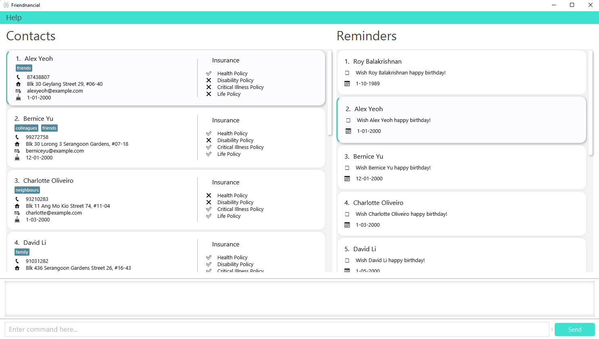
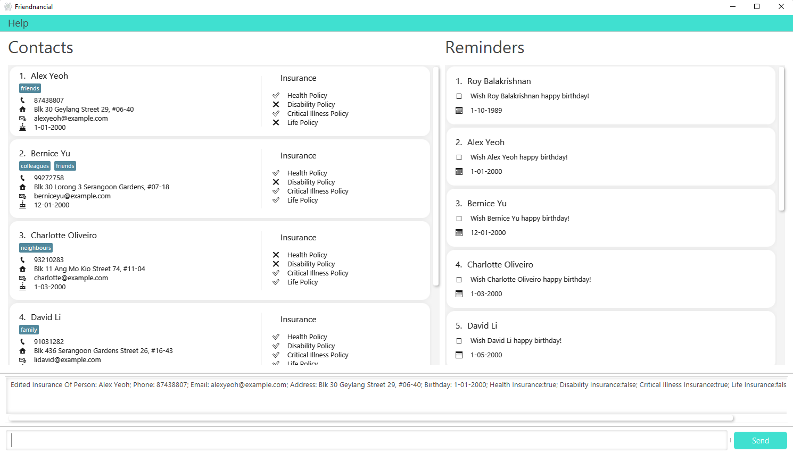

Friendnancial is a tool to help financial advisors manage their clients and friends. It provides an address book with features implemented specifically for financial advisors such as storing insurance information and reminders. Thus Friendnancial is an integrated one-stop solution for financial advisors to manage their contacts!

Friendnancial is a **desktop application, optimized for use by financial advisors via a Command Line Interface (CLI)** while still having the benefits of a Graphical User Interface (GUI). If you can type fast, Friendnancial can get your contact management tasks done faster than traditional GUI apps, saving your precious time.

* Table of Contents
{:toc}

--------------------------------------------------------------------------------------------------------------------
## Short Glossary for non-technical Users.
| Technical Terms | Meaning                                                                                                                                    | 
|-----------------|--------------------------------------------------------------------------------------------------------------------------------------------|
| **GUI**         | Graphical User Interface - A system of interactive visual components for computer software                                                 | 
| **CLI**         | Command Line Interface - A text based user interface to run programs                                                                       | 
| **Index**       | A number indicating the order of a person within the contact list, used in conjunction with commands                                       |
| **Parameter**   | Refers to the information typed along with the commands. For example the command `add n/John Doe` means that the parameter is `n/John Doe` | 

--------------------------------------------------------------------------------------------------------------------
## Quick start

1. Ensure you have Java `11` or above installed in your Computer.

1. Download the latest `.jar` file from [here](https://github.com/AY2223S1-CS2103T-W10-2/tp/releases).

1. Copy the file to the folder you want to use as the _home folder_ for Friendnancial.

1. Double-click the file to start the app. The GUI similar to the below should appear in a few seconds. Note how the app contains some sample data. 
   

1. Type the command in the command box and press Enter to execute it. e.g. typing **`help`** and pressing Enter will open the help window. 
   Some example commands you can try:

   * **`list`** : Lists all contacts.
   * **`add`**`n/John Doe p/98765432 e/johnd@example.com c/family a/John street, block 123, #01-01 b/01-01-2001` : Adds a contact named `John Doe` to the Address Book.

   * **`delete`**`3` : Deletes the 3rd contact shown in the current list along with the reminders linked to the contact.

   * **`clear`** : Deletes all contacts and reminders.

   * **`exit`** : Exits the app.

1. Refer to the [Features](#features) below for details of each command.

--------------------------------------------------------------------------------------------------------------------

## Features

**:information_source: Notes about the command format:** 

* Words in `UPPER_CASE` are the parameters to be supplied by the user. 
  e.g. in `add n/NAME`, `NAME` is a parameter which can be used as `add n/John Doe`.

* Items in square brackets are optional. 
  e.g. `n/NAME [t/TAG]` can be used as `n/John Doe t/friend` or as `n/John Doe`.

* Items with `…`​ after them can be used multiple times including zero times. 
  e.g. `[t/TAG]…​` can be used as ` ` (i.e. 0 times), `t/friend`, `t/friend t/family` etc.

* Parameters can be in any order. 
  e.g. if the command specifies `n/NAME p/PHONE_NUMBER`, `p/PHONE_NUMBER n/NAME` is also acceptable.

* If a parameter is expected only once in the command but you specified it multiple times, only the last occurrence of the parameter will be taken. 
  e.g. if you specify `p/12341234 p/56785678`, only `p/56785678` will be taken.

* Extraneous parameters for commands that do not take in parameters (such as `help`, `list`, `exit` and `clear`) will be ignored. 
  e.g. if the command specifies `help 123`, it will be interpreted as `help`.

### Viewing help : `help`

Shows a message explaining how to access the User Guide page. The link can be copied by clicking the `Copy URL` button.

Format: `help`

### Adding a person: `add`

Adds a contact to Friendnancial.

Format: `add n/NAME p/PHONE_NUMBER e/EMAIL [t/TAG]…​ a/Address b/BIRTHDAY`

:bulb: **Tip:**
A person can have any number of tags (including 0)

:warning: **Note:**
Names should only have alphabet letters or numbers in them

Examples:
* `add n/John Doe p/98765432 e/johnd@example.com a/John street, block 123, #01-01 b/18-08-2000`
* `add n/Betsy Crowe t/friend e/betsycrowe@example.com a/Newgate Prison p/1234567 t/criminal b/01-01-1999`

### Listing all persons : `list`

Shows a list of all persons in the address book.

Format: `list`

### Editing a person : `edit`

Edits an existing person in the address book.

Format: `edit INDEX [n/NAME] [p/PHONE] [e/EMAIL] [a/ADDRESS] [t/TAG]…​ [b/BIRTHDAY]`

* Edits the person at the specified `INDEX`. The index refers to the index number shown in the displayed person list. The index **must be a positive integer** 1, 2, 3, …​
* At least one of the optional fields must be provided.
* Existing values will be updated to the input values.

:warning: **Note:**
When editing tags, the existing tags of the person will be removed
You can remove all the person’s tags by typing `t/` without
    specifying any tags after it.

Examples:
*  `edit 1 p/91234567 e/johndoe@example.com` Edits the phone number and email address of the 1st person to be `91234567` and `johndoe@example.com` respectively.
*  `edit 2 n/Betsy Crower t/` Edits the name of the 2nd person to be `Betsy Crower` and clears all existing tags.

### Locating persons by keyword: `find`

Finds persons by the given keywords.

Format: `find [n/NAME] [p/PHONE] [e/EMAIL] [a/ADDRESS] [t/TAG] [b/BIRTHDAY]`

* Entering `find` without any prefixes will display all contacts.
* Users can only find contacts by one field at each time.  e.g. `find n/Alex a/Geylang` will result in an error. 
* The keywords are case-insensitive.  e.g. `hans` will match `Hans`
* The order of the keywords does not matter.  e.g. `Hans Bo` will match `Bo Hans`
* Only full words will be matched  e.g. `Han` will not match `Hans`
 e.g. `alex` will not match `alexyeoh@example.com`
* Any contact matching at least one keyword will be returned.
  e.g. `find n/Hans Bo` will display contacts named `Hans Gruber` and `Bo Yang`

:warning: **Note:**
When finding a contact based off address, all non-alphanumeric characters (excluding # and -) will be ignored

Examples:
* `find n/John` displays contacts named `john` and `John Doe`
* `find n/alex david` returns `Alex Yeoh`, `David Li`
* `find a/gardens` will display a contact with the address `Serangoon Gardens, #06-40`
* `find a/#06-40` will display a contact with the address `Serangoon Gardens, #06-40`
* `find a/06` or `find a/06-40` will not display a contact with the address `Serangoon Gardens, #06-40`

### Deleting a person : `delete`

Deletes the specified person from Friendnancial.

Format: `delete INDEX` or `delete n/NAME`

* Deletes the person at the specified `INDEX` or with the specified `NAME`.
    * Only full name will be matched e.g. `Han` will not match `Hans`.
* If multiple entries with the same `NAME` are found, sends a message to user to tell the user to delete by `INDEX` instead.
* The index refers to the index number shown in the displayed person list.
* The index **must be a positive integer** 1, 2, 3, ...

Examples:
* `list` followed by `delete 2` deletes the 2nd person in the address book.
* `find Betsy` followed by `delete 1` deletes the 1st person in the results of the `find` command.
* `delete n/Edric` deletes the contact with the `NAME` matching `Edric` unless more than one match is found.

### Clearing all entries : `clear`

Clears all entries from Friendnancial, which includes the contacts and the reminders.

Format: `clear`

### Adding a reminder : `remind`

Adds a reminder for a specified contact.

Format: `remind INDEX r/REMINDER d/DATE`

* Adds a reminder for the contact at the specified `INDEX` with the `REMINDER` and `DATE`.
* The index refers to the index number shown in the displayed person list.
* The index **must be a positive integer** 1, 2, 3, ...
* The date **must be in the format of** `DD-MM-YYYY`.

Examples:
* `remind 2 r/update client information d/20-10-2022` adds a reminder to the 2nd contact in the currently displayed list.

### Deleting a reminder : `deleteR`

Deletes a reminder from the list of reminders.

Format: `deleteR INDEX`

* Deletes the reminder at the specified `INDEX`.
* The index refers to the index number shown in the displayed reminder list.
* The index **must be a positive integer** 1, 2, 3, ...

Examples:
* `deleteR 2` deletes the 2nd reminder in the reminder list.

### Updating insurance information about a contact : `insurance`

Edits whether a contact has the four main types of insurance, namely health, disability, critical illness and life insurance.

Prefixes:
* "hi" - health insurance
* "di" - disability insurance
* "ci" - critical illness insurance
* "li" - life insurance

Format: `insurance INDEX [hi/] [di/] [ci/] [li/]` (Number of insurance prefixes can range from 0-4)

:warning: **Note:**
When editing insurances, the existing insurances of the person will be removed.
You can remove all the person’s tags by typing `insurance [INDEX]` without
    specifying any insurances after it.

Examples:
* `insurance 1 hi/ ci/` sets the 1st person to have health insurance and critical illness insurance.
* `insurance 2` sets the 2nd person to not have any of the insurances.
* `insurance 3 hi/ ci/ di/ li/` sets the 3rd person to have all the insurances.

### Exiting the program : `exit`

Exits the program.

Format: `exit`

### Saving the data

Friendnancial data is saved in the hard disk automatically after any command that changes the data. There is no need to save manually.

--------------------------------------------------------------------------------------------------------------------

## FAQ

**Q**: How do I transfer my data to another Computer? 
**A**: Install the app in the other computer and overwrite the empty data file it creates with the file that contains the data of your previous Friendnancial home folder.

**Q**: Where is the save command? 
**A**: There is no save command as all your contacts and reminders are automatically saved for you. After closing the application, all updated information will be displayed again the next time you open the application.

--------------------------------------------------------------------------------------------------------------------

## Command summary

| Action     | Format, Examples                                                                                                                                    |
|------------|-----------------------------------------------------------------------------------------------------------------------------------------------------|
| **Add**    | `add n/NAME p/PHONE_NUMBER e/EMAIL [t/TAG] a/ADDRESS b/BIRTHDAY`   e.g., `add n/James Ho p/22224444 e/jamesho@example.com t/friend b/18-08-2000` |
| **Clear**  | `clear`                                                                                                                                             |
| **Delete** | `delete INDEX` or `delete n/NAME`  e.g., `delete 3`, `delete n/paul`                                                                              |
| **Find**   | `find [n/KEYWORD, t/TAG, b/BIRTHDAY]`  e.g., `find n/James Jake`                                                                                   |
| **List**   | `list`                                                                                                                                              |
| **Remind** | `remind INDEX r/REMINDER d/DATE`   e.g., `remind 2 r/update client information d/20-10-2022`                                                     |
| **DeleteR** | `deleteR INDEX`  e.g., `deleteR 1`                                                                              |
| **Insurance**   | `insurance INDEX [hi/] [di/] [ci/] [li/]`|                                                                                                           
| **Help**   | `help` |
