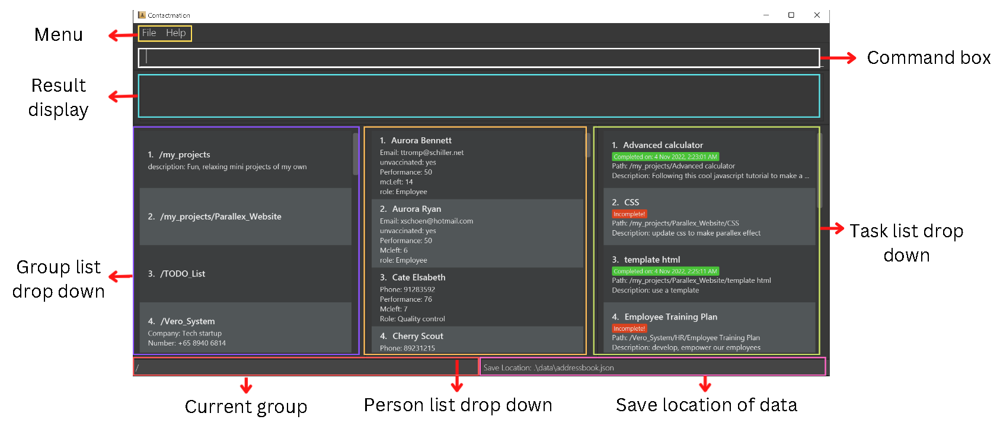

# Contactmation User Guide

## Table of contents

1. [Introduction](#introduction)
2. [About](#about)
3. [Prerequisites](#prerequisites)
4. [Quick start](#quick-start)
5. [Features](#features)
    1. [Definitions](#definitions)
    2. [Scoping](#scoping)
    3. [Basic features](#basic-features)
        1. [Add a contact](#add-a-contact-add)
        2. [Delete a contact](#delete-a-contact-delete)
        3. [Edit a contact](#edit-a-contact-edit)
        4. [Searching for a contact](#searching-for-a-contact-find)
        5. [Listing all contacts](#listing-all-contacts-list)
        6. [Exits the program](#exits-the-program-exit)
    4. [Teams](#teams)
        1. [Creating a team](#creating-a-team-newteam)
        2. [Deleting a team](#deleting-a-team-rmteam)
        3. [Adding people to a team](#adding-people-to-a-team-add-or-team-team-id-add)
        4. [Removing people from team](#removing-people-from-team-delete-or-delete-gteam-id)
        5. [Adding team wide tasks](#adding-team-wide-tasks-task-add)
    5. [Tasks](#tasks)
        1. [Adding a task to a team](#adding-a-task-to-a-team-task-add)
        2. [Deleting a task from team](#deleting-a-task-from-team-task-delete)
        3. [Change task completion status](#change-task-completion-status-task-set-status)
        4. [Set task completion time](#set-task-completion-time-task-set-completed_time)
6. [FAQ](#faq)
7. [Future plans](#future-plans)
8. [Glossary](#glossary)
9. [Commands summary](#commands-summary)
--------------------------------------------------------------------------------------------------------------------
## Introduction

>**What is Contactmation?**

Contactmation is a powerful **desktop based team management solution** that **helps its users efficiently and
effectively manage many projects and groups at once.**

Contactmation will be able to help you save all your contact details, keep track of
each project group and subgroup, and delegate tasks given to each group and group member.

>**Who is Contactmation for?**

Contactmation is for **project managers and supervisors** that want to maintain an organised view of their
projects and streamline the management of their projects.
--------------------------------------------------------------------------------------------------------------------
## About

### Graphic User Interface

The following figure shows the different graphical components of our application.
We will be referring to these terminologies throughout the user guide:

--------------------------------------------------------------------------------------------------------------------
## Prerequisites

- Ensure that `Java 11` and above is installed on your device. If you do not have `Java 11` installed, please refer to
  this [Java 11 installation guide](https://www.codejava.net/java-se/download-and-install-java-11-openjdk-and-oracle-jdk).

--------------------------------------------------------------------------------------------------------------------

## Quick start

1. Ensure that the [prerequisites](#prerequisites) are met before installing Contactmation.

2. Download the latest version of `contactmation.jar` from
   [here](https://github.com/AY2223S1-CS2103T-T11-1/tp/releases).

3. Save `contactmation.jar` into a Desktop folder on your computer. This folder will now be the home folder
   for Contactmation.

4. Double-click on `contactmation.jar` to start up the application. You will be greeted with the current window
   if everything goes well:

5. You may begin by referring to the [basic features](#basic-features) section to get started on using
   Contactmation. For additional, more powerful commands, refer to our [advanced features](#advanced-features),
   especially if you are comfortable with the CLI or have prior programming experience.

--------------------------------------------------------------------------------------------------------------------

## Features

## Definitions

In this user guide, we define any parameters within **square brackets** e.g. `[g/TEAMID]` as
**optional parameters**, and commands within **angled brackets** e.g. `<command>` are **placeholder parameters**.

**Ellipses** `...` indicate that more than 1 argument of a certain type can be given to a single command.
For example, `[USER ID...]` means that an optional number (0 or more) of `USER IDs` can be added to a single
user command, but `USER ID...` means that 1 or more `USER IDs` can be given to a single user command.

**Team ID** refers to a specific ID automatically given by the application during the creation of a team.
Any user commands involving `g/<TEAM ID>` will reference that particular team.

**User ID** refers to a specific ID automatically given by the application during the creation of a contact.

Any user commands involving `u/<USER ID>` will reference that particular contact.

## Scoping

Since Contactmation is a multi team management contact application, the app supports scoping.

- General Scope
    - Commands used within the main menu scope:
        - `<command> [parameters]` regular general scope command.
        - `<command> u/<USER ID>` command targeting a user of UID.
    - Team scope commands from general scope:
        - `<command> [parameters] g/<TEAM ID>`
        - `<command> [parameters] g/<TEAM ID> u/<USER ID>`

- Team Scope
    - Commands used within a team scope:
        - `<TEAM ID> <command> [parameters]`
    - Commands used to target individuals within a team:
        - `<TEAM ID>/<USER ID> <command> [parameters]`

## Basic features

### Add a contact: `add`

Adds a new contact with a name, phone number, email, address and optional tags.

Format: `add n/<NAME> [p/<PHONE_NUMBER>] [e/<EMAIL>] [a/<ADDRESS>] [t/TAG]`

### Delete a contact: `delete`

Delete a contact from the contact list by its `USER ID`.

- `delete <USER ID>`

### Edit a contact: `edit`

Edits a contact based on its `USER ID`.

Format: `edit <USER ID> [n/name] [p/PHONE_NUMBER] [e/EMAIL] [a/ADDRESS] [t/TAG]`

### Searching for a contact: `find`

Searches for a contact that matches the given keyword.

Format: `find <KEYWORD> [MORE_KEYWORDS]`

Examples:
- `find John Doe`
- `find 8881 2345`

### Listing all contacts: `list`

Lists all current contacts in your contact list, based on alphabetical order of contact names.

Format: `list`

### Exits the program: `exit`

Exits the current session.

Format: `exit`

## Teams

### Creating a team: `newteam`

Creates a new team with the specified team name along with optional parameters. These optional parameters are
`USER IDs` that are to be added to the team.

- Format: `newteam n/<team name> [USER ID...]`
    - `<team name>` is the name of the team to be created.
    - `[USER ID]` are optional parameters to add people with corresponding User ID to the team.

### Deleting a team: `rmteam`

Removes an existing team.

- Format: `rmteam <TEAM ID>`
    - `<TEAM ID>` is the ID of the team to be deleted.

### Adding people to a team: `add OR team <TEAM ID> add`

Adding members to an existing team.

- Adding a user under team scope:
    - `team <TEAM ID> add <USER ID>...`
- Adding a user under global scope:
    - `add g/<TEAM ID> <USER ID>...`

### Removing people from team: `delete OR delete g/<TEAM ID>`

- Delete user from team under team scope:
    - `team <TEAM ID> delete <USER ID>...`
- Delete user from team under global scope
    - `delete g/<TEAM ID> <USER ID>...`

### Adding team wide tasks: `task add`

- Adding task to team under team scope:
    - `team <TEAM ID> task add t/<title> [i/INFO]`
- Adding task to team under global scope:
    - `task add g/<TEAM ID> t/<title> [i/INFO]`

See more task related commands under [tasks](#tasks).

## Tasks

You can avoid typing `g/<TEAM ID>` by accessing the task via team scoping!

i.e. `team TEAMID task <related command> [task related details]`

### Adding a task to a team: `task add`

Adds a new task to an existing team.

Format: `task add t/<TITLE> g/<TEAM ID> [s/STATUS]`

- Adds a new task with the specified `TITLE` to the specified `TEAM ID`.
- The status of the new task can be optionally specified with `STATUS`.
- If a task with the same title already exists in the group, no changes will be made.
- The specified group must already exist.

Example:
- `task add t/Complete all CS2103T homework g/Students`

This creates a new task in the team `Students` with the title `Complete all CS2103T homework`.

### Deleting a task from team: `task delete`

Deletes an existing task from a team.

Format: `task delete t/<TITLE> g/<TEAM ID>`
- Delete an existing task with the specified `TITLE` to from specified `TEAM ID`.

Example:
- `task delete t/Complete all CS2103T homework g/Students`

This deletes a task in the team `Students` with the title `Complete all CS2103T homework`.

### Change task completion status: `task set status`

Sets the status of an existing task in a team.

Format: `task set status t/<TITLE> g/<TEAM ID> v/<STATUS>`
- Sets the status of the task with the specified `TITLE` and `TEAM ID` to `STATUS`.
- The existing status of the task will be overwritten by the new status.
- The specified task must already exist in the group.

Example:
- `task set status t/Clean beakers g/Lab v/Done`

This sets the status of the `Clean beakers` task in the `Lab` team to `Done`.

### Set task completion time: `task set completed_time`

Sets the time that a task has been completed.

Format: `task set completed_time t/<TITLE> g/<TEAM ID> v/<VALUE>`

- Sets the completed time of the task with the specified `TITLE` in `TEAM ID` to `VALUE`.
- The `VALUE` for the time should be in UTC format with a precision in minutes: `yyyy-MM-ddThh:mmZ`.
- The existing completed time of the task will be overwritten.
- The specified task must already exist in the group.

Example:
- `task set completed_time t/Generate report g/Accountants v/2022-09-13T10:20Z`

This sets the status of the `Generate report` task in the `Accountants` team to Sep 13, 2022 at 10:20am UTC time.

## Advanced features

## FAQ

> How can I install `Java 11`?

Follow the guide for installing `Java 11` [here](#prerequisites).

## Future plans

Our future plans for Contactmation includes:

- Contacting any person through the application simply by clicking their email, phone number
etc.
- Releasing a version of Contactmation on the mobile platform.
- Ability to synchronize data between multiple copies of Contactmation on your mobile and desktop.

## Glossary

| Vocabulary  | Description |
| ----------- | ----------- |
| Group   | A container that contains people that work on a similar project.  |
| Item    | An item can refer to a group, person or task. |
| Person   | A contact with contact information.  |
| Task  | Assigned to people or groups |

## Commands summary

### General commands

| Command  | Format |
| ----------- | ----------- |
| Group   | A container that contains people that work on a similar project.  |
| Item    | An item can refer to a group, person or task. |
| Person   | A contact with contact information.  |
| Task  | Assigned to people or groups |

### Group commands

| Command  | Format |
| ----------- | ----------- |
| Group   | A container that contains people that work on a similar project.  |
| Item    | An item can refer to a group, person or task. |
| Person   | A contact with contact information.  |
| Task  | Assigned to people or groups |

### Person commands

| Command  | Format |
| ----------- | ----------- |
| Group   | A container that contains people that work on a similar project.  |
| Item    | An item can refer to a group, person or task. |
| Person   | A contact with contact information.  |
| Task  | Assigned to people or groups |

### Task commands

| Command  | Format |
| ----------- | ----------- |
| Group   | A container that contains people that work on a similar project.  |
| Item    | An item can refer to a group, person or task. |
| Person   | A contact with contact information.  |
| Task  | Assigned to people or groups |

[Back to top](#contactmation-user-guide)