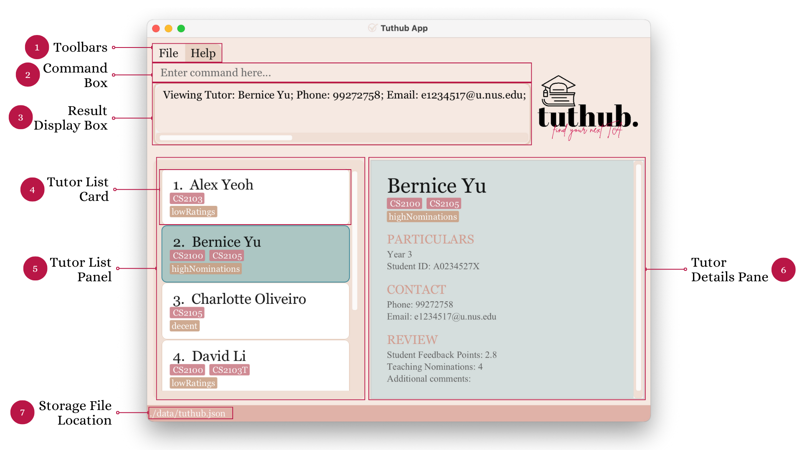

  

* Table of Contents
{:toc}

--------------------------------------------------------------------------------------------------------------------

## Introduction
Hi Profs! Welcome to the User Guide for **Tuthub**, a Command Line Interface (CLI) App that will help you find your next batch of teaching assistants (TA) in no time!

Tuthub is a desktop app for NUS professors who wish to track and choose their next batch of teaching assistants/tutors based on their past performance and records but have little time to spare for tedious administrative work. Tuthub helps profs who can type fast find the best TAs faster than traditional Graphical User Interface (GUI) apps.

--------------------------------------------------------------------------------------------------------------------

## About This Document

This section will introduce you to the symbols frequently used in this User Guide as well as Tuthub application layout and command format to aid your understanding of the document.

If you would like to:
- Find out more about specific terms used, please visit our [Glossary](#glossary).
- Install Tuthub and try out some quick commands, please visit our [Quick Start](#quick-start) section.
- Find out more comprehensive details about Tuthub commands, please visit our [Features](#features) section.

### Symbols and Syntax

| Symbol                  | What it means                                                                |
|-------------------------|------------------------------------------------------------------------------|
| `highlights`            | Executable commands or possible parameters that can be entered into the CLI. |
| :information_source:    | Additional information that may be useful to know                            |
| :bulb:                  | Tips to improve the Tuthub experience                                        |
| :exclamation:           | Things to be cautious of and should be followed closely                      |

### Layout of Tuthub Application Window

The image below shows a Tuthub Application Window (with a tutor profile selected) with all its sections labelled.

The following table describes the sections in detail:

| **No.**  | **Section**           | **Description**                                                                     |
|----------|-----------------------|-------------------------------------------------------------------------------------|
| 1        | Toolbars              | Click on the respective buttons to exit the app/view help.                          |
| 2        | Command Box           | Type in your commands here.                                                         |
| 3        | Result Display Box    | Displays various messages (e.g. success/error messages) after commands are entered. |
| 4        | Tutor List Card       | Displays condensed information of a tutor saved in Tuthub.                          |
| 5        | Tutor List Panel      | Displays the entire/filtered list of tutors saved in Tuthub.                        |
| 6        | Tutor Details Pane    | Displays full details of a tutor saved in Tuthub.                                   |
| 7        | Storage File Location | Displays the location of your Tuthub data file.                                     |

### Notes About Command Format

:information_source: **Some general rules that Tuthub commands follow:**
* Words in `UPPER_CASE` are the parameters to be supplied by you. 
  e.g. in `add n/NAME`, `NAME` is a parameter which can be used as `add n/John Doe`.

* Items in square brackets are optional. 
  e.g. `n/NAME [t/TAG]` can be used as `n/John Doe t/good` or as `n/John Doe`.

* Items with `…` after them can be used as many times as the user would like. 
  e.g. `[t/TAG]…` can be used multiple times like `t/good` or `t/good t/highRatings`, or can be omitted altogether.

:bulb: **Tips:**

* Parameters with a prefix can be in any order. 
  e.g. if the command specifies `n/NAME p/PHONE`, `p/PHONE n/NAME` is also acceptable.

* If a parameter is expected only once in the command but you specified it multiple times, only the last occurrence of the parameter will be taken. 
  e.g. if you specify `p/12341234 p/56785678`, only `p/56785678` will be taken.

* Commands that do not take in parameters (such as `help`, `list`, `exit` and `clear`) will ignore follow-up inputs. 
  e.g. if the command specifies `help 123`, it will be interpreted as `help`.

--------------------------------------------------------------------------------------------------------------------

## Quick Start

1. Ensure you have Java `11` or above installed in your Computer.

1. Download the latest `tuthub.jar` [here](https://github.com/AY2223S1-CS2103T-T15-3/tp/releases).

1. Copy the file to the folder you want to use as the _home folder_ for Tuthub.

1. Double-click the file to start the app. The GUI below should appear within a few seconds. Note how the app contains some sample data. 
   

1. Type the command in the 'Command Box' and press Enter to execute it. 
   Some example commands you can try:

    * `list` : Lists all tutors.

    * `view 3` : Displays full details of the 3rd tutor shown in the current list.

    * `add n/John Doe p/98765432 e/e1234567 m/CS2100 y/3 s/A0123456X tn/1 r/5.0 t/senior` : Adds a tutor named `John Doe` to Tuthub.

    * `find n/alex` : Finds all tutors with names containing alex.

    * `delete 3` : Deletes the 3rd tutor shown in the current list.

    * `clear` : Deletes all tutors.

    * `comment 1 c/Always on time`: Adds a comment to the first tutor that he is always on time.

    * `exit` : Exits the Tuthub app.

1. If you would like to find out more, refer to [Features](#features) below for comprehensive details of each command.

--------------------------------------------------------------------------------------------------------------------

## Features

### Viewing help: `help`

If you are new to Tuthub or need a refresher for available commands, `help` displays a table of Tuthub command summary and a link to our User Guide for your convenience.

Format: `help`

:information_source: **Note:**
Empty commands such as ` ` (whitespace) will display the usage of the `help` command to redirect new users to the list of commands.

:bulb: **Tip:**
You may also click on the Help Toolbar to access the command summary table.

### Adding a tutor: `add`

Adds a tutor to the Tuthub.

Format: `add n/NAME p/PHONE_NUMBER e/EMAIL m/MODULE y/YEAR s/STUDENTID tn/TEACHING NOMINATIONS r/RATING [t/TAG]…​`

:information_source: **Note:**
Tutors are regarded as the same if they have the **same email or student ID**!

:information_source: **About Name:**
- Names must contain at least 1 word, and allow for the following symbols: `/`,`'`,`-`.
- At most 1 space is allowed between 2 words.
- Symbols cannot be surrounded by spaces. e.g. `Smith - Jones` is invalid, but `Smith- Jones` is valid.

:information_source: **About Phone Number:**
- Phone numbers can only contain digits, i.e.`0-9` and must be at least 3 digits long.

:information_source: **About Email:**
- Emails must be the tutor's NUSNet ID, e.g. `E1234567` or `E1234567@u.nus.edu`
- The `E` in front is case-insensitive.
- If `@u.nus.edu` is not provided, Tuthub will automatically append it for you.

:information_source: **About Module:**
- Modules consist of the following in order: 2 compulsory letters, 2 optional letters,
4 compulsory digits, 2 optional letters.

:information_source: **About Year:**
- Year takes in 1 integer from 0 to 6.
- Years 1-4 correspond to the respective undergraduate years, while 5 represents a Masters tutor and 6 represents a PhD tutor.

:information_source: **About Student ID:**
- Student IDs must consist of the following: `A` followed by 7 digits and any capital letter behind.

:information_source: **About Teaching Nomination:**
- Teaching nominations take in positive integers including 0.
- Leading zeros in the teaching nominations will not be allowed. e.g. `0`, `1` is valid but `00001` is invalid.

:information_source: **About Rating:**
- Ratings take in numbers **between 0 and 5 inclusive**.
- Decimal values are optional, but only a **maximum of 2** (no decimals, 1 decimal and 2 decimals are valid) decimals can be provided.
- Ratings only accept "**`.`**" as the decimal seperator (e.g. `4.5` is valid, `4,5` is invalid).

:information_source: **About Tags:**
- A person can have any number of tags (including 0).
- Tags should be alphanumeric and should not contain any spaces.

Examples:
* `add n/John Doe p/98765432 e/e1234567 m/CS2100 y/3 s/A0123456X tn/1 r/5.0`
* `add n/Betsy Crowe t/seniorTa e/e1234567 m/CS1101S y/3 p/1234567 s/A0123456X tn/2 r/4.5`

### Listing all tutors: `list`

Shows a list of all tutors registered in Tuthub.

Format: `list`

### Viewing a tutor: `view`

If you would like to find out more about a particular tutor, view a tutor to see all available information about their contact details and past performance.

Format: `view INDEX`

* Displays the person at the specified `INDEX`.
* The index refers to a **valid** index number shown in the displayed person list.
* The index **must be a positive integer** 1, 2, 3, …​

Examples:
* `view 2` causes the corresponding `Tutor Details Pane` of the 2nd tutor to appear on the right, as shown below:
  

:bulb: **Tip:**
You may also click on a `Tutor List Card` to execute a `view` command instead

### Commenting on a tutor: `comment`

Adds a comment on the specified tutor.

Format: `comment INDEX c/COMMENT`

* Comments on the person at the specified INDEX. The index refers to the index number shown in the displayed person list. The index **must be a positive integer** 1, 2, 3, …​

Examples:
* `comment 1 c/Tasks not Finished` adds a comment of "Tasks not Finished" on the 1st tutor.

### Deleting comments on a tutor: `deletecomment` or `dc`

Deletes a comment from the specified tutor.

Format: `deletecomment TUTORINDEX COMMENTINDEX` or `dc TUTORINDEX COMMENTINDEX`

* Deletes the comment at the specified index of the specified tutor. The tutor index refers to the index number shown in the displayed person list. The comment index refers to the index number of the comment shown in the comment section. Both indices **must be positive integers** 1, 2, 3, …​

Examples:
* `deletecomment 1 1` and `dc 1 1` deletes the 1st comment from the 1st tutor.

### Editing a tutor: `edit`

Edits an existing tutor in Tuthub.

Format: `edit INDEX [n/NAME] [p/PHONE] [e/EMAIL] [m/MODULE] [y/YEAR] [s/STUDENTID] [tn/TEACHING NOMINATIONS] [r/RATING] [t/TAG]…​`

* Edits the person at the specified INDEX. The index refers to the index number shown in the displayed tutor list. The index **must be a positive integer** 1, 2, 3, …​
* At least one of the optional fields must be provided.
* Existing values will be updated to the input values.
* When editing tags, the existing tags of the tutor will be removed i.e. adding of tags is not cumulative.
* You can remove all the tutor’s tags by typing t/ without specifying any tags after it.

Examples:
* `edit 1 p/91234567 e/e7654321` Edits the phone number and email address of the 1st tutor to be 91234567 and johndoe@example.com respectively.
* `edit 2 n/Betsy Crower t/` Edits the name of the 2nd tutor to be Betsy Crower and clears all existing tags.
* `edit 3 m/CS2100 y/3 s/A0654729L` Edits the module code, year, and student id of the 3rd tutor to be CS2100, 3, and A0654729L respectively.
* `edit 3 tn/2 r/4.58` Edits the number of teaching nominations and rating of the 3rd tutor to be 2 and 4.58 respectively.

### Search for tutor by attribute: `find`

Searching for tutors that teach relevant or specific modules? Looking for tutors with the best ratings? The find
command allows you to do so by searching through the list of tutors based on specified attributes of the
tutors along with the search keywords provided.

Format: `find PREFIX/KEYWORDS [KEYWORDS]`
* The find command works by entering only **one** prefix corresponding to a tutor's profile attribute, followed by the keyword(s) to search
* The search is case-insensitive. e.g. hans will match Hans
* The order of the keywords does not matter. e.g. Hans Bo will match Bo Hans
* Only the attribute that corresponds to the prefix entered is searched.
* **Partial words** will be matched e.g. Han will match Hans
* Tutors with attributes being searched that match at least one keyword will be returned (i.e. OR search). e.g. Hans Bo will return Hans Gruber, Bo Yang

Examples:
* `find n/John` returns all tutors with names that contains `John`.
* `find n/alex david` returns all tutors with names that contain `Alex` or `David`.
* `find p/98765432 99999999` returns the tutors with phone number `98765432` or `99999999`.
* `find e/e1234567 e7654321` returns the tutors with email `e1234567@u.nus.edu` or `e7654321@u.nus.edu`.
* `find m/cs2100 cs2105` returns the tutors teaching module `cs2100` or `cs2105`.
* `find y/4` returns all tutors who are in year `4` of their studies.
* `find s/A0123456X A0123456Y` returns the tutors with student id `A0123456X` or `A0123456Y`.
* `find tn/3` returns all tutors that have `3` teaching nominations.
* `find r/4.0` returns all tutors that have rating of `4.0`.
* `find t/senior` returns all tutors that have tag of `senior`.

### Contacting tutors via email: `mail`

Contacting targeted tutors is made easy with the mail command. The command opens the user's default mail client and specifies the "to" section in emails with the targeted tutors.

Format: `mail INDEX` or `mail all`
* `INDEX` refers to any index in range of the tutor list.
* `all` allows you to email all the current tutors displayed in the tutor list.

Examples:
* `mail 3` opens the user's default mail client with the "to" specified as the third tutor's email.
* `mail all` opens the user's default mail client with the "to" specified as all the currently displayed tutors' emails.

### Sorting tutors by quantitative measures: `sort`

Looking for tutors with the best reviews? The sort command allows you to sort the
list of tutors in ascending or descending order based on different quantitative
measures, such as rating and teaching nomination. More specifications on the sort command is visible below.

Format: `sort ORDER PREFIX`
* `ORDER` can be one of the two values: a (ascending) or d (descending).
* `PREFIX` refers to one of the prefixes of quantitative measures (e.g. `r/`).
* Currently, sort is implemented for the prefixes `r/` (`Rating`) and `tn/` (`TeachingNomination`).

Examples:
* `sort a r/` sorts the tutors in ascending order (low to high) based on tutor ratings.
* `sort d tn/` sorts the tutors in descending order (high to low) based on tutor teaching nominations.

:information_source: **Note:**
Sort only accepts **one prefix**, hence `sort a tn/ r/` will return an error.

### Deleting a tutor: `delete`

Deletes the specified tutors from Tuthub.

Format: `delete INDEX`

* Deletes the person at the specified `INDEX`.
* The index refers to the index number shown in the displayed person list.
* The index **must be a positive integer** 1, 2, 3, …​

Examples:
* `list` followed by `delete 2` deletes the 2nd person in Tuthub.
* `find n/Betsy` followed by `delete 1` deletes the 1st tutor with name containing `Betsy` in the results of the `find` command (given that such tutor exists).

### Clearing all entries: `clear`

Clears all entries from Tuthub. This could be particularly useful if you would like to clear all the sample data when using Tuthub for the first time.

Format: `clear`

:exclamation: **Caution:** Clearing all the data is **irreversible**! Only enter this command when you are very sure that all the existing tutor profiles are not needed!

### Saving the data

Tuthub data are saved in the hard disk automatically after any command that changes the data. There is no need to save manually.

### Exiting the program: `exit`

Exits Tuthub app.

Format: `exit`

--------------------------------------------------------------------------------------------------------------------

## FAQ

**Q**: How do I transfer my data to another Computer? 
**A**: Install the app in the other computer and overwrite the empty data file it creates with the file that contains the data of your previous Tuthub home folder.

**Q**: Why is my previous data not loaded properly into Tuthub? 
**A**: It is highly likely that your data storage file has something in the wrong format. It is recommended to check the log files to see what happened when Tuthub started up.

--------------------------------------------------------------------------------------------------------------------

## Command Summary

| Action                     | Format                                                                                                                     | Examples (if any)                                                                                      |
|----------------------------|----------------------------------------------------------------------------------------------------------------------------|--------------------------------------------------------------------------------------------------------|
| See **Help**               | `help`                                                                                                                     |                                                                                                        |
| **List** All Tutors        | `list`                                                                                                                     |                                                                                                        |
| **View** a Tutor           | `view`                                                                                                                     | `view 1`                                                                                               |
| **Add** Tutor              | `add n/NAME p/PHONE_NUMBER e/EMAIL y/YEAR m/MODULE s/STUDENTID tn/TEACHING NOMINATIONS r/RATING [t/TAG]…​`                 | `add n/Betsy Crowe t/  e/E1234567@u.nus.edu  p/1234567 m/CS1101S y/3 s/A0123456X tn/1 r/4.99 t/senior` |
| **Comment** on a Tutor     | `comment INDEX c/COMMENT`                                                                                                  | `comment 1 c/Tasks not Finished`                                                                       |
| **Delete** a _Comment_     | `deletecomment TUTORINDEX COMMENTINDEX` or `dc TUTORINDEX COMMENTINDEX`                                                    | `deletecomment 1 1`, `dc 1 1`                                                                          |
| **Edit** a Tutor's Details | `edit INDEX [n/NAME] [p/PHONE] [e/EMAIL] [m/MODULE] [y/YEAR] [s/STUDENTID] [tn/TEACHING NOMINATIONS] [r/RATING] [t/TAG]…​` | `edit 3 m/CS2100 y/3 s/A0654729L`                                                                      |
| **Find** a Tutor           | `find PREFIX/KEYWORDS [KEYWORDS]`                                                                                          | `find n/Alex`                                                                                          |
| **Mail** Tutor(s)          | `mail INDEX or "all"`                                                                                                      | `mail 3`                                                                                               |
| **Sort** Tutor List        | `sort ORDER PREFIX`                                                                                                        | `sort a r/`                                                                                            |
| **Delete** a _Tutor_       | `delete INDEX`                                                                                                             | `delete 3`                                                                                             |
| **Clear** Tutor List       | `clear`                                                                                                                    |                                                                                                        |
| **Exit** Tuthub            | `exit`                                                                                                                     |                                                                                                        |

--------------------------------------------------------------------------------------------------------------------

## Glossary

| **Term**                              | **Definition**                                                                                                                   |
|---------------------------------------|----------------------------------------------------------------------------------------------------------------------------------|
| **Command Line Interface (CLI)**      | A text-based interface where users may interact with the system by typing in commands.                                           |
| **Graphical User Interface (GUI)**    | A graphic-based interface where users may interact with graphical components (e.g. icons and menus) to interact with the system. |
| **JAR File**                          | Java Archive File with multiple files compressed into one and may be an executable.                                              |
| **Java**                              | A widely used programming language.                                                                                              |
| **Javascript Object Notation (JSON)** | A lightweight format for storing and transporting data.                                                                          |
| **Parameter**                         | A specific tutor detail to be provided for a command to run.                                                                     |
