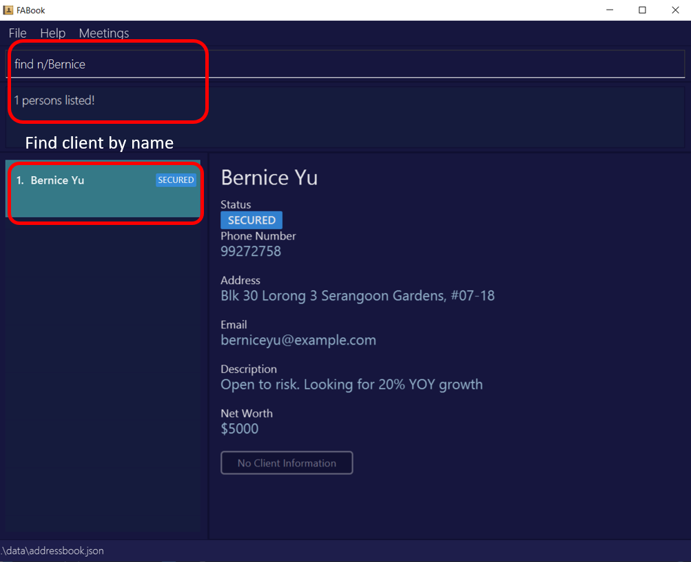
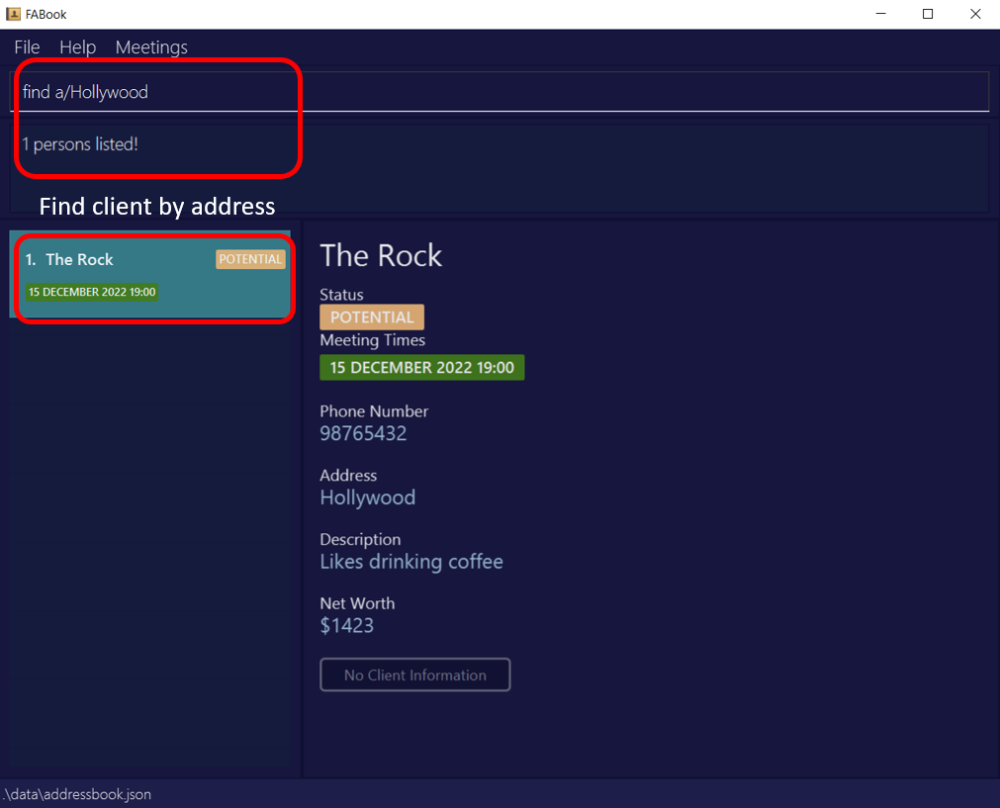
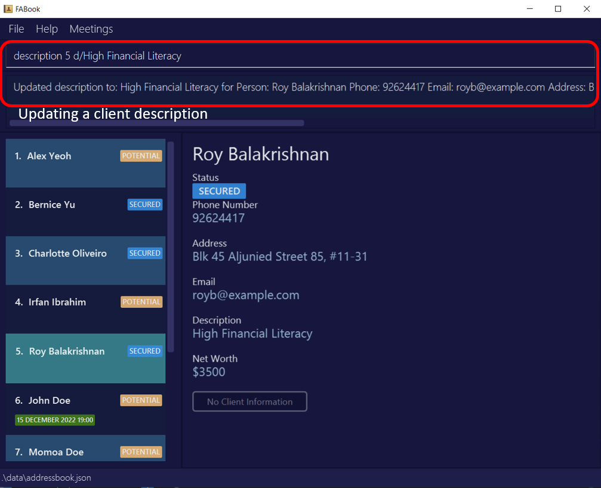
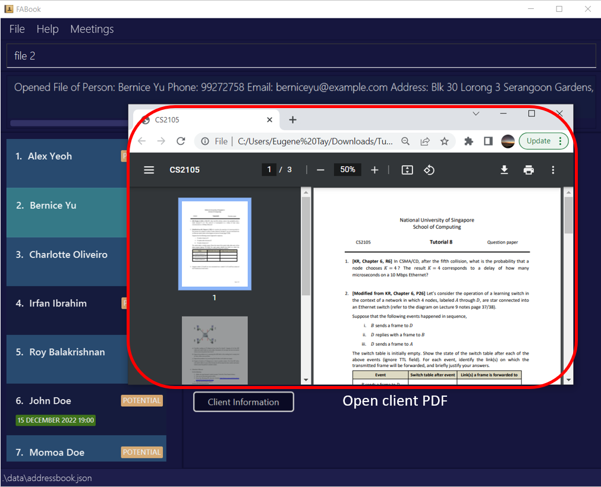
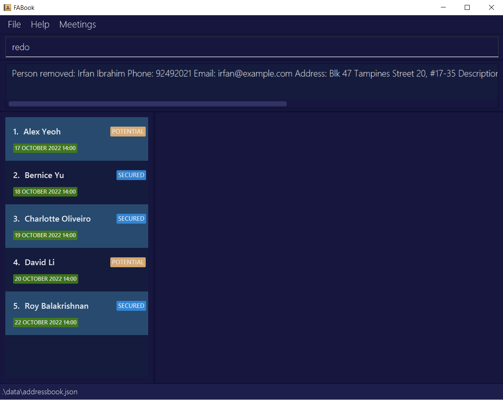

FABook is a **desktop app for managing contacts, optimized for a financial adviser to use via a Command Line Interface (CLI)** (CLI) while still having the benefits of a Graphical User Interface (GUI). If you can type fast, FABook can get your contact management tasks done faster than traditional GUI apps.

* Table of Contents
{:toc}

--------------------------------------------------------------------------------------------------------------------

## Quick start

1. Ensure you have Java `11` or above installed in your Computer.

2. Download the latest `FABook.jar` from [here](https://github.com/AY2223S1-CS2103T-T10-2/tp/releases).

4. Copy the file to the folder you want to use as the _home folder_ for your FABook.

1. Double-click the file to start the app. The GUI similar to the below should appear in a few seconds. Note how the app contains some sample data. 
   

1. Type the command in the command box and press Enter to execute it. e.g. typing **`help`** and pressing Enter will open the help window. 
   Some example commands you can try:

   * **`list`** : Lists all contacts.

   * **`create`**`n/John Doe p/98765432 a/John street, block 123, #01-01` : Adds a contact named `John Doe` to the FABook.

   * **`exit`** : Exits the app.

1. Refer to the [Features](#features) below for details of each command.

--------------------------------------------------------------------------------------------------------------------

## Features

**:information_source: Notes about the command format:** 

* Words in `UPPER_CASE` are the parameters to be supplied by the user. 
  e.g. in `create n/NAME`, `NAME` is a parameter which can be used as `create n/John Doe`.

* Items in square brackets are optional. 
  e.g `n/NAME [a/HOME_ADDRESS]` can be used as `n/John Doe a/Blk 30 Geylang Street 29` or as `n/John Doe`.

* Items with `…`​ after them can be used multiple times. 
  e.g. `NAME…​` can be used as `Jon`, `Jon Jack` etc.

* `INDEX` represents the index of a specific person in the FABook
  e.g. `delete INDEX` can be used as `delete 2`.

* Parameters can be in any order. 
  e.g. if the command specifies `n/NAME p/HP_NUMBER`, `p/HP_NUMBER n/NAME` is also acceptable.

* If a parameter is expected only once in the command but you specified it multiple times, only the last occurrence of the parameter will be taken. 
  e.g. if you specify `p/12341234 p/56785678`, only `p/56785678` will be taken.

* Extraneous parameters for commands that do not take in parameters (such as `help`, `list`, `exit`,`clear`, 'redo' and 'undo') will be ignored. 
  e.g. if the command specifies `help 123`, it will be interpreted as `help`.

### Viewing help : `help`

Shows a message explaining how to access the help page.

Format: `help` or press `F1`

### Creating a contact: `create`

Creates a contact that is stored in the FABook and contains their contact information. Any contact information that is not available can be updated later.

Format: `create n/NAME p/PHONE_NUMBER [e/EMAIL] [a/ADDRESS] [d/DESCRIPTION] [nw/NETWORTH] [mt/TIME] [t/TAG]...`

 
                  
* To input multiple meeting times, repeat the field `mt/TIME` as many times as you need. 

:bulb: **Note:**
Name and Phone number are the only compulsory inputs. Parameters not provided will be left blank.

Examples:
* `create n/John Doe p/98765432 a/John street, block 123, #01-01`
* `create n/Betsy Crowe a/Newgate Prison p/1234567`
* `create n/Benedict Lee p/91281329 e/benedict@gmail.com a/Redhill Ave 3 d/Risk averse nw/$20000 mt/10-11-2022-16:00 t/SECURED`

:white_check_mark: **Tip:**
Input shortcut: `c` can be used in place of `create`.
Format: `c n/NAME p/PHONE_NUMBER [e/EMAIL] [a/ADDRESS] [d/DESCRIPTION] [nw/NETWORTH] [mt/TIME] [t/TAG]...`

### Listing all persons : `list`

Shows a list of all persons in the FABook.

Format: `list`

 

### Updating a person : `update`

Updates the information of a contact stored in the FABook.

Format: `update INDEX [n/NAME] [p/PHONE_NUMBER] [e/EMAIL] [a/ADDRESS] [d/DESCRIPTION] [nw/NETWORTH] [t/TAG]...`
                        
  

:bulb: **Note:**
Parameters not provided will stay unchanged.

* Edits the person with the provided index.
* INDEX is the index of the person in the currently displayed list.
* At least one of the optional fields must be provided.
* Existing values will be updated to the input values.
* Updating description of a contact can also be done through the `description` command.
  See [Description](https://github.com/AY2223S1-CS2103T-T10-2/tp/blob/master/docs/UserGuide.md#Giving-a-description-to-a-person--description)
* Updating meeting time of a contact must be done through the `meeting`, `deletemeeting` and `sync` commands.
  See [Meeting](https://github.com/AY2223S1-CS2103T-T10-2/tp/blob/master/docs/UserGuide.md#Add-meetings--meeting)
  , [Delete Meeting](https://github.com/AY2223S1-CS2103T-T10-2/tp/blob/master/docs/UserGuide.md#Delete-meetings--deletemeeting)
  and [Sync](https://github.com/AY2223S1-CS2103T-T10-2/tp/blob/master/docs/UserGuide.md#Remove-past-meetings--sync)

Example:
* `update 2 n/John Doe p/91234567 a/21 Lower Kent Ridge Rd` Updates the second listed person's 
 name, phone number and address to be `John Doe`, `91234567` and `21 Lower Kent Ridge Rd` respectively.

:white_check_mark: **Tip:**
Input shortcut: `u` can be used in place of `update`.
Format: `u INDEX [n/NAME] [p/PHONE_NUMBER] [e/EMAIL] [a/ADDRESS] [d/DESCRIPTION] [nw/NETWORTH] [t/TAG]`

### Locating persons by name: `find`

Finds persons whose names contain any of the given keywords.

Format: `find n/NAME…`

* The search is case-insensitive. e.g `hans` will match `Hans`
* The order of the keywords does not matter. e.g. `Hans Bo` will match `Bo Hans`
* Only the name is searched. e.g. `find n/Kent` won’t return contacts living on Kent Ridge Road
* Partial words can be matched only if the whole name is included. e.g. `Jack` will match `Jackson`, but `Jackson` won’t match `Jack`
* Persons matching at least one keyword will be returned (i.e. `OR` search).
  e.g. `Hans Bo` will return `Hans Gruber`, `Bo Yang`

Examples:
* `find n/John` returns `john` and `John Doe`
* `find n/alex david` returns `Alex Yeoh`, `David Li` 
  
:white_check_mark: **Tip:**
Input shortcut: `f` can be used in place of `find`.
Format: `f n/NAME…`
  
### Locating persons by phone number: `find`

Finds persons whose stored number matches the given number.
   
Format: `find p/NUMBER...`

     

* Only full numbers will be matched e.g. `7654` will not match `80765432`
* All persons matching the number will be returned. e.g. All contacts in the same household will be returned if they share a home number.

Examples:
* `find p/90333333` returns the person(s) with `90333333` stored as their number

:white_check_mark: **Tip:**
Input shortcut: `f` can be used in place of `find`.
Format: `f p/NUMBER...`

### Locating persons by address: `find`

Format: `find a/ADDRESS...`

     

* The search is case-insensitive. e.g `serangoon` will match `Serangoon`
* The order of the keywords does not matter. e.g. `Kio Mo Ang` will match `Ang Mo Kio`
* Only the address is searched. e.g. `find a/Kent` won’t return contacts with the name 'Kent'
* Words can be matched only if the whole address is included. e.g. `Tamp` won’t match `Tampines`
* Persons with address matching at least one keyword will be returned (i.e. `OR` search).
  e.g. `Buona Clementi` will return `Buona Vista Drive`, `6 Clementi Ave`
* Address can contain numbers. Find results will return all persons with that address keyword. 
  e.g. `find a/30` will return `Blk 30 Geylang Street 29`, `Blk 30 Lorong 3 Serangoon Gardens`

Examples:
* `find a/Bedok` returns the person(s) with `Bedok` stored as their address

:white_check_mark: **Tip:**
Input shortcut: `f` can be used in place of `find`.
Format: `f a/ADDRESS…`

### Filter persons by tag: `find`

Format: `find t/TAG`

* TAG can only be either `SECURED` or `POTENTIAL`
* If multiple tags are given, only the last one is used.

Examples:
* `find t/SECURED` displays the list of all `SECURED` contacts.

:white_check_mark: **Tip:**
Input shortcut: `f` can be used in place of `find`.
Format: `f t/TAG`   

### Giving a description to a person: `description`

Updates the person with a description data field.

Format: `description INDEX d/DESCRIPTION`

     

* INDEX is the index of the person in the currently displayed list.
* Updating description of a contact can also be done through the 'update' command. See [Update](https://github.com/AY2223S1-CS2103T-T10-2/tp/blob/master/docs/UserGuide.md#updating-a-person--update)

:white_check_mark: **Tip:**
Input shortcut: `desc` can be used in place of `description`.
Format: `desc INDEX d/DESCRIPTION…`

### Assigning PDF file to a person: `filepath`

Assigns a PDF file to a person in the FABook.

Format: `filepath INDEX f/FILEPATH`

 

* INDEX is the index of the person in the currently displayed list.
* The filepath is the absolute path of the PDF on the local disk of the computer. e.g. `C:/Users/Ryzen/Downloads/CS2103T-T08-3.pdf`
* Only file paths that lead to a PDF is allowed. e.g. `C:/Users/Ryzen/Downloads/CS2103T-T08-3.docx` is an invalid filepath.
* Moving or renaming the PDF file in the local disk does not change the person's assigned file path, so you would have to assign it manually.

Examples:
* `filepath 2 f/C:/Users/Ryzen/Downloads/CS2103T-T08-3.pdf` assigns second person on the displayed list with the PDF file located at the absolute path `C:/Users/Ryzen/Downloads/CS2103T-T08-3.pdf`

### Opening PDF file of a person: `file`

Opens a person's assigned PDF file in user's PDF file viewer.

Format: `file INDEX`

* INDEX is the index of the person in the currently displayed list.
* Moving or renaming the PDF file in the local disk will cause the command to not work, which will require you to reassign a file path to the person again.

Examples:
* `file 2` opens the PDF file assigned to the second person in the displayed list.

### Add meetings: `meeting`
   
Adds one or more meeting times to a person in the FABook.
   
Format: `meeting INDEX mt/MEETINGTIME...`
   
* INDEX is the index of the person in the currently displayed list.
* MEETINGTIME should be in the format `DD-MM-YYYY-HH:MM`.
* mt/ should be put before each separate meeting time.
* The person's existing meeting times remain unchanged.
   
Examples:
* `meeting 2 mt/09-10-2023-23:50 mt/28-02-2020-15:16` adds two meetings to the second person in the displayed list, 
   one at 9 November 2023 23:50, the other at 28 February 2020 15:16.
   
### Delete meetings: `deletemeeting`
   
Deletes a meeting from a person in the FABook.

Format: `deletemeeting INDEX mt/MEETINGTIME`
   
* INDEX is the index of the person in the currently displayed list.
* MEETINGTIME should be in the format `DD-MM-YYYY-HH:MM`.
* If the given meeting time is not on the list, the person's meetings remain unchanged.
   
Examples:
* `deletemeeting 2 mt/09-10-2023-23:50` deletes the meeting at 9 November 2023 23:50 from to the second person in the displayed list,
   if such a meeting was scheduled.

### Remove past meetings: `sync`

Format: `sync`

    

Removes every scheduled meeting time that has already passed.
   
* This uses your device's present local time as reference. All meetings scheduled to be earlier than the present time will removed.
   
:heavy_exclamation_mark: **Caution:**
As this command syncs with your device's system clock, please make sure the current date, time, and timezone are correct before using this command.

### Get upcoming meetings: `Upcoming Meetings`

Returns a list of clients who has a scheduled meeting in the next 7 days.

* This uses your device's present local time as reference.
* As long as a client has a meeting in the next 7 days, it will be shown.

Format: Menu bar on the top of the application or press `F2`.

:heavy_exclamation_mark: **Caution:**
As this command syncs with your device's system clock, please make sure the current date, time, and timezone are correct before using this command.
   
### Deleting a person : `delete`

Deletes the specified person from the FABook.

Format: `delete INDEX`

 

* INDEX is the index of the person in the currently displayed list.
* Deletes the person with the specified index in the FABook.

Examples:
* `delete 2` deletes the second person in the currently displayed person list in the FABook.

### Clearing all entries : `clear`

Clears all entries from the FABook.

Format: `clear`

   

:heavy_exclamation_mark: **Important**
If you run this command by accident, you can undo the command to restore all previously cleared entries.
See [Undo](https://github.com/AY2223S1-CS2103T-T10-2/tp/blob/master/docs/UserGuide.md#undoing-a-previous-command--undo)

### Undoing a previous command : `undo`                                      

Undos the last command from the FABook.

Format: `undo`

 

* The command intended to be undone should be an undoable command.
* Undoable commands are: 'clear', 'create', 'delete', 'description', 'meeting', 'deletemeeting', 'redo' and 'update'
* Non-undoable commands are: 'exit', 'find */', 'help', 'list', 'file' and 'filepath'

:heavy_exclamation_mark: **Important**
You can undo a `redo` command. See [Redo](https://github.com/AY2223S1-CS2103T-T10-2/tp/blob/master/docs/UserGuide.md#redoing-a-previous-command--redo)

### Redoing a previous command : `redo`

Redos the last undone command from the FABook.

Format: `redo`

 

### Exiting the program : `exit`

Exits the program.

Format: `exit`

:white_check_mark: **Tip:**
Input shortcut: `e` can be used in place of `exit`.
Format: `e`

### Saving the data

FABook data are saved in the hard disk automatically after any command that changes the data. There is no need to save manually.

### Editing the data file

FABook data are saved as a text file `[JAR file location]/data/addressbook.json`. Advanced users are welcome to update data directly by editing that data file.

:exclamation: **Caution:**
If your changes to the data file makes its format invalid, FABook will discard all data and start with an empty data file at the next run.

--------------------------------------------------------------------------------------------------------------------

## FAQ

**Q**: How do I transfer my data to another Computer? 
**A**: Install the app in the other computer and overwrite the empty data file it creates with the file that contains the data of your previous FABook home folder.

--------------------------------------------------------------------------------------------------------------------

## Command summary

| Action                   | Format, Examples                                                                                                                                                  | Shortcut |
|--------------------------|-------------------------------------------------------------------------------------------------------------------------------------------------------------------|----------|
| **Create**               | `create n/NAME p/PHONE_NUMBER [e/EMAIL] [a/ADDRESS] [d/DESCRIPTION] [nw/NETWORTH] [mt/TIME] [t/TAG] `  e.g., `create n/Betsy Crowe a/Newgate Prison p/1234567` | c        |
| **Clear**                | `clear`                                                                                                                                                           | cl       |
| **Delete**               | `delete INDEX`  e.g., `delete 3`                                                                                                                               | d        |
| **Update**               | `update INDEX [n/NAME] [p/PHONE_NUMBER] [e/EMAIL] [a/ADDRESS] [d/DESCRIPTION] [nw/NETWORTH] [t/TAG]`  e.g.,`edit 2 p/91234567 a/21 Lower Kent Ridge Rd`        | u        |
| **Description**          | `description INDEX d/DESCRIPTION`   e.g., `description 3 d/Accident prone`                                                                                     | desc     |
| **Find**                 | `find n/NAME…` or `find p/NUMBER` or `find a/ADDRESS`   e.g., `find n/James Jake` or `find p/09122222` or `find a/Jurong`                                      | f        |
| **Filter**               | `find t/TAG`   e.g., `find t/POTENTIAL`                                                                                                                        | f        |
| **List**                 | `list`                                                                                                                                                            | l        |
| **Open File**            | `file INDEX`  e.g. `file 2`                                                                                                                                   |          |
| **Assign File**          | `filepath INDEX f/FILEPATH`  e.g. `filepath 2 f/C:/Users/Ryzen/Downloads/CS2103T-T08-3.pdf`                                                                   |          |
| **Add Meeting**          | `meeting INDEX mt/TIME`   e.g. `meeting 5 mt/19-11-2022-19:00`                                                                                                |          |
| **Delete Meeting**       | `deletemeeting INDEX mt/TIME`   e.g. `deletemeeting 4 mt/15-12-2022-13:00`                                                                                    |          |
| **Remove past meetings** | `sync`                                                                                                                                                            |          |
| **Undo**                 | `undo`                                                                                                                                                            |          |
| **Redo**                 | `redo`                                                                                                                                                            |          |
| **Help**                 | `help`                                                                                                                                                            |          |
| **Exit**                 | `exit`                                                                                                                                                            | e        |

