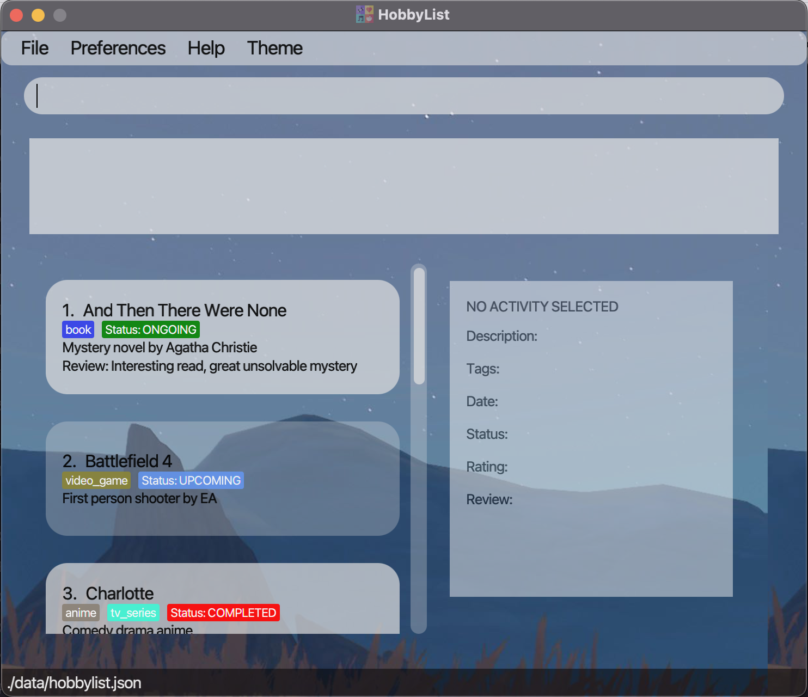

  * Table of Contents
  {:toc}

--------------------------------------------------------------------------------------------------------------------

## 1. Introduction

### 1.1 What is HobbyList?
HobbyList is a **desktop app for managing hobby activities, optimized for use via a Command Line Interface** (CLI) while still having the benefits of a Graphical User Interface (GUI). If you can type fast, HobbyList can get your activity management tasks done faster than traditional GUI apps. If you prefer typing only and want to record your experiences with your hobby activities such as reading books or watching movies, HobbyList is the perfect app for you.

--------------------------------------------------------------------------------------------------------------------

## 2. About this User Guide

### 2.1 How to use this user guide?

#### Table of contents
The [table of contents](#table-of-contents) is at the top of the page. From there, you can click on any of the sections to jump to it.

#### Quick start
If you want to **quick**ly get **start**ed with using HobbyList, you can read and follow the instructions in the [Quick start](#3-quick-start) section

#### Features
The [features](#5-features) section contains a list of all the features that HobbyList currently has. Within each feature, you can read up on how each feature is used and look at some examples.

#### Special boxes
Throughout the entire user guide, there are special boxes like the ones below which gives you additional information.

:information_source: **Additional information:** 

Boxes such as this one with an information symbol :information_source: are used to provide additional information which you should read if you want to use the related features or understand the user guide properly.

:exclamation: **Caution:** 

Boxes such as this one with an exclamation mark :exclamation: are used to warn you about things that you should take note of, as certain actions may cause intended drastic consequences.

:bulb: **Tip:** 

Boxes such as this one with a light bulb :bulb: are used to provide some tips which you can make use of to improve your experience with HobbyList.

--------------------------------------------------------------------------------------------------------------------

## 3. Quick start

1. Ensure you have Java `11` or above installed in your Computer.

2. Download the latest `hobbylist.jar` from [here](https://github.com/AY2223S1-CS2103T-T12-3/tp/releases).

3. Copy the file to the folder you want to use as the _home folder_ for your HobbyList.

4. Double-click the file to start the app. The default GUI similar to the one below should appear in a few seconds. Note how the app contains some sample data. 
   

5. Type the command in the command box and press Enter to execute it. 
   Some example commands you can try:

    * **`list`** : Lists all hobby activities in HobbyList.

    * **`add`**`n/42km run d/NUS Run event [t/sport] [date/2022-09-30]` : Adds a hobby activity named **42km run** to the list.
    
    * **`delete`**`3` : Deletes the 3rd hobby activity shown in the current list.

    * **`find`**`keyword/1973-03` : Finds activities that contain the keyword or located in March 1973.

    * **`exit`** : Exits the app.

6. Click the button located in the top left corner to execute certain task. 
   Some example buttons you can try:
    * **`File`** : To find the exit button.

    * **`Preference`** : To set command words according to user's preference.
    
    * **`Help`** : To open a pop-up window containing more helping information.

    * **`Theme`** : To change different appearance of the app.

7. Refer to the [Features](#5-features) below for details of each command.

--------------------------------------------------------------------------------------------------------------------

## 4. HobbyList User Interface
to be added

--------------------------------------------------------------------------------------------------------------------

## 5. Features

**:information_source: Notes about the command format:** 

* Words in `UPPER_CASE` are the parameters to be supplied by the user. 
  e.g. in `add n/NAME`, `NAME` is a parameter which can be used as `add n/42km run`.

* Items in square brackets are optional. 
  e.g. `n/NAME [t/TAG] [date/DATE] [s/STATUS] ` can be used as `n/42km run t/sport` or as `n/42km run`.

* Items with `…`​ after them can be used multiple times including zero times. 
  e.g. `[t/TAG]…​` can be used as ` ` (i.e. 0 times), `t/sport`, `t/sport t/cardio` etc.

* Parameters can be in any order. 
  e.g. if the command specifies `n/NAME d/DESCRIPTION`, `d/DESCRIPTION n/NAME` is also acceptable.

* If a parameter is expected only once in the command, but you specified it multiple times, only the last occurrence of the parameter will be taken. 
  e.g. if you specify `d/NUS Run d/NUS Biathlon`, only `d/NUS Biathlon` will be taken.

* The date format for `[date/DATE]` should be `yyyy-mm-dd`. e.g. `date/2022-12-25`.

* Extraneous parameters for commands that do not take in parameters (such as `help`, `list`, `exit` and `clear`) will be ignored. 
  e.g. if the command specifies `help 123`, it will be interpreted as `help`.

### 5.1 Adding a hobby activity : `add`

Adds a hobby activity to HobbyList.

Format: `add n/NAME d/DESCRIPTION [t/TAG]... [date/DATE] [s/STATUS]`

* `[t/TAG]...` only accepts alphanumeric with underscores.
* `[s/STATUS]` only accepts **UPCOMING**, **ONGOING** or **COMPLETED** as STATUS. e.g. `s/ongoing`(case-insensitive).
* If `STATUS` is not specified, it will be displayed as **Status: NONE** by default.

Examples:
* `add n/42km run d/NUS Run event t/sport`
* `add n/Badminton d/play badminton t/sport entertainment_2 date/2022-10-19 s/completed`

### 5.2 Editing an activity : `edit`

Edits a specified activity from HobbyList.

Format: `edit INDEX [n/NAME] [d/DESCRIPTION] [t/TAGS]... [date/DATE] [s/STATUS]`

* Edits the activity at the specified `INDEX`. The index refers to the index number shown in the displayed activity list. The `INDEX` **must be a positive integer** 1, 2, 3, …
* At least **one** of the optional fields must be provided.
* Existing values will be updated to the input values.
* When editing tags, the existing tags of the activity will be removed i.e. adding of tags is not cumulative.
* You can remove all the activity's tags by typing `t/` without specifying any tags after it.
* `[s/STATUS]` only accepts **UPCOMING**, **ONGOING** or **COMPLETED** (case-insensitive) as STATUS. e.g. `s/ongoing`.

Examples:

* `edit 1 n/A Clash of Kings d/Epic fantasy novel by George R. R. Martin.`

  *Edits the name and description of the 1st activity to be `A Clash of Kings` and `Epic fantasy novel by George R. R. Martin.` respectively.*

* `edit 2 date/2022-10-21 t/`

  *Removes the tags of the second activity and sets the date to `2022-10-21`.*

### 5.3 Deleting an activity : `delete`

Deletes a specified activity from HobbyList.

Format: `delete INDEX`

* Deletes the activity at the specified `INDEX`.
* The index refers to the index number shown in the displayed activity list.
* The index **must be a positive integer** 1, 2, 3, …​

Example: `delete 1`

### 5.4 Listing all hobby activities : `list`

Shows a list of all hobby activities in HobbyList.

Format: `list`

Example: `list`

### 5.5 Rating an activity: `rate`

Adds rating and/or writes review for an activity in the HobbyList.

Format: `rate INDEX r/RATING [re/REVIEW]`

* The `INDEX` refers to the index number shown in the displayed activity list.
* The `INDEX` **must be a positive integer** 1, 2, 3, …​
* `RATING` only accepts integer numbers from 1 to 5 (inclusive).
* `REVIEW` accepts both alphanumeric and special symbols.

Example:
* `rate 1 r/2`
* `rate 2 r/4 re/Interesting movie`

### 5.6 Selecting an activity: `select`

Displays all details of the selected activity from HobbyList on the panel to the right of the list panel.

Format: `select INDEX`

* Displays all the details of the selected activity.
* Constraints for `INDEX` is similar to those above in **Rating an activity**

Example: `select 1`

### 5.7 Finding activities: `find`

#### With keywords:

Shows a list of all hobby activities whose names or descriptions contain any of the specified keywords.

Format:
    `find KEYWORDS`

* The `KEYWORDS` are case-insensitive.

Example:
* `find run`
* `find mystery novel`

#### With time:

Shows a list of all hobby activities that located on a certain date, or in a certain month of a year, or in a certain year.

Format:
* `find YYYY-MM-DD`
* `find YYYY-MM`
* `find YYYY`

Example:
* `find 2001-01-01`
* `find 1974-02`
* `find 1999`

#### With exact rating value:

Shows a list of all hobby activities whose rating is exactly the required value(between 0-5, both inclusive).

Format: `find rate/VALUE`

* `VALUE` only accepts integer numbers from 0 to 5 (inclusive).
* If given `VALUE` is 0, HobbyList shows all activities which do not have a rating.

Example: `find rate/3`

### 5.8 Finding activities with tags : `findTag`

Shows a list of all hobby activities whose tags match the one specified in the command.

Format: `findTag KEYWORDS`

* The `KEYWORDS` are case-sensitivity.

Example:
* `findTag book`
* `findTag ANIME`

### 5.9 Finding activities with status: `findStatus`

Shows a list of all hobby activities whose status match the status specified in the command.

Format: `findStatus STATUS`

* The feature only works with the `STATUS` being **UPCOMING**, **ONGOING** or **COMPLETED** (case-insensitive).
* If input `STATUS` is different from the three statuses above, it is treated as **NONE** and HobbyList finds all the activities whose status is **NONE**.

Example:
* `findStatus COMPLETED`
* `findStatus ongoing`

### 5.10 Finding activities with rating value above certain value : `r/above`

Shows a list of all hobby activities whose rating value is greater or equal than the required value.

Format: `r/above VALUE`

* `VALUE` only accepts integer numbers from 1 to 5 (inclusive).

Example: `r/above 1`

### 5.11 Getting help : `help`

Shows a message explaining how to access the help page.

Format: `help`

### 5.12 Deleting all activities: `clear`

Deletes all activities from HobbyList

Format: `clear`

Example: `clear`

### 5.13 Exiting the program : `exit`

Exits the program.

Format: `exit`

Example: `exit`

### Renaming the commands

If you do not like the names of the command, you can select `preferences` in the menu bar and `edit aliases` to rename any of the commands.

--------------------------------------------------------------------------------------------------------------------

## 6. Managing data

### 6.1 Saving the data

HobbyList data are saved in the hard disk automatically after any command that changes the data. There is no need to save manually.

### 6.2 Editing the data file

HobbyList data are saved as a JSON file `[JAR file location]/data/hobbylist.json`. Advanced users are welcome to update data directly by editing that data file.

:exclamation: **Caution:**
If your changes to the data file makes its format invalid, HobbyList will discard all data and start with an empty data file at the next run.

--------------------------------------------------------------------------------------------------------------------

## 7. FAQ

**Q**: How do I transfer my data to another computer? 
**A**: Install the app in the other computer and overwrite the empty data file it creates with the file that contains the data of your previous HobbyList home folder.

--------------------------------------------------------------------------------------------------------------------

## 8. Command summary

| Action                            | Format                                                                                     | Examples                                                                               |
|-----------------------------------|--------------------------------------------------------------------------------------------|----------------------------------------------------------------------------------------|
| **Add activity**                  | `add n/NAME d/DESCRIPTION [t/TAG]... [date/DATE] [s/STATUS]`                               | `add n/poutine d/at some place t/food date/2022-09-25 s/completed`                     |
| **Edit activity**                 | `edit INDEX [n/NAME] [d/DESCRIPTION] [t/TAGS]... [date/DATE] [s/STATUS]`                   | `edit 1 n/Bukit Timah Nature Reserve d/3 hour hike t/hike date/2022-08-17 s/completed` |
| **Delete activity**               | `delete INDEX`                                                                             | `delete 3`                                                                             |
| **List activities**               | `list`                                                                                     | `list`                                                                                 |
| **Rate activity**                 | `rate INDEX r/RATING [re/REVIEW]`                                                          | `rate 1 r/4`   `rate 1 r/4 re/Nice food with good vibes`                           |
| **Select activity**               | `select INDEX`                                                                             | `select 1`                                                                             |
| **Find activity**                 | `find KEYWORDS`   `find yyyy-mm-dd` `find yyyy-mm` `find yyyy`   `find rate/value` |                                                                                        |
| **Find activity by tag**          | `findTag KEYWORD`                                                                          | `findTag movie`                                                                        |
| **Find activity by status**       | `findStatus STATUS`                                                                        | `findStatus completed`                                                                 |
| **Find activity by rating value** | `r/above VALUE`                                                                            | `r/above 3`                                                                            |
| **Help**                          | `help`                                                                                     | `help`                                                                                 |
| **Clear**                         | `clear`                                                                                    | `clear`                                                                                | 
| **Exit**                          | `exit`                                                                                     | `exit`                                                                                 |

