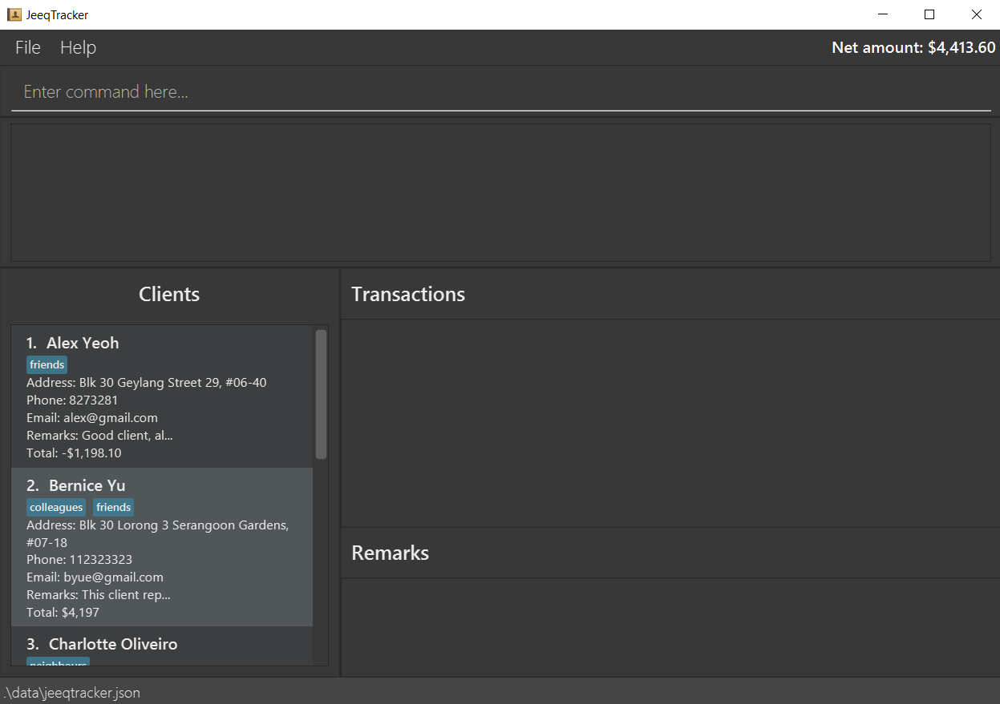
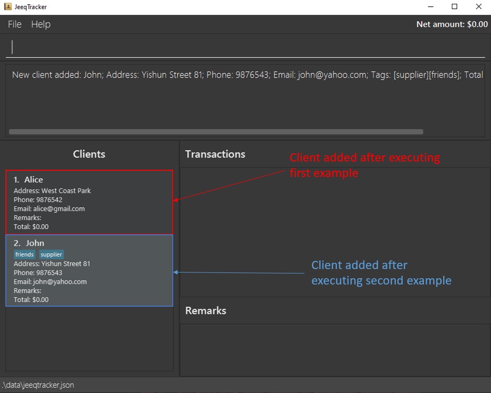

## Introduction

JeeqTracker is a desktop application created for **home-based business owners / resellers** that helps them manage the clients
that they interact with by keeping track of their **`BUY / SELL`** transactions, and **`REMARKS`** of clients.

While it has a GUI (Graphical User Interface), most of the user interactions happen by typing simple commands into a [CLI](#user-interface-overview). (Command Line Interface).
If you can type fast, JeeqTracker can get business
interactions recorded faster and simpler than traditional GUI applications.

To get you started, you might want to read the section on [how to use this User Guide](#how-to-use-the-user-guide)!

An overview of the application's user interface can be found [here](#user-interface-overview).

## Table of Contents

* [Quick Start](#quick-start)
* [User Interface Overview](#user-interface-overview)
* [How to use the User Guide](#how-to-use-the-user-guide)
* [Features](#features)
  * [Client Commands](#client-commands)
    * [Adding a client: `add`](#adding-a-client-add)
    * [Listing all clients: `list`](#listing-all-clients-list)
    * [Editing a client: `edit`](#editing-a-client-edit)
    * [Deleting a client: `delete`](#deleting-a-client-delete)
    * [Locating clients by name: `find`](#locating-clients-by-name-find)
    * [Viewing a client: `view`](#viewing-a-client-view)
  * [Transaction Commands](#transaction-commands)
    * [Creating a transaction: `buy` or `sell` ](#creating-a-transaction-buy-or-sell)
    * [Editing a transaction: `edit`](#editing-a-transaction-edit)
    * [Deleting a transaction: `delete`](#deleting-a-transaction-delete)
    * [Filtering buy or sell transactions: `filter`](#filtering-buy-or-sell-transactions-filter)
    * [Sorting the transactions: `sort`](#sorting-the-transactions-sort)
  * [Remark Commands](#remark-commands)
    * [Creating a remark: `remark`](#creating-a-remark-remark)
    * [Editing a remark: `edit`](#editing-a-remark-edit)
    * [Deleting a remark: `remark`](#deleting-a-remark-delete)
  * [Miscellaneous Commands](#miscellaneous-commands)
    * [Clearing all entries: `clear`](#clearing-all-entries-clear)
    * [Exiting the program: `exit`](#exiting-the-program-exit)
    * [Viewing help: `help`](#viewing-help-help)
    * [Getting the User Guide: `user_guide`](#getting-the-user-guide-user_guide)
  * [Data Storage](#data-storage)
    * [Saving the data](#saving-the-data)
    * [Editing the data file](#editing-the-data-file)
    * [Archiving data files `coming in v2.0`](#archiving-data-files-coming-in-v20)
* [FAQ](#faq)
* [Command Summary](#command-summary)
* [Prefix Summary](#prefix-summary)

--------------------------------------------------------------------------------------------------------------------

## Quick start

1. Ensure you have Java `11` or above installed in your Computer.

2. Download the latest `jeeqtracker.jar` from [here](https://github.com/AY2223S1-CS2103T-T09-1/tp/releases).

3. Copy the file to the folder you want to use as the _home folder_ for your JeeqTracker.

4. Double-click the file to start the app. The GUI similar to the below should appear in a few seconds. Note how the application contains some sample data.  
   

5. Type the command in the command box and press Enter to execute it.  e.g. typing **`help`** and pressing Enter will show the list of commands. 

   Some example commands you can try:

   * **`list`** : Lists all clients.

   * **`add`**`n/Alice a/311 Clementi Ave 2 p/9191919 e/alice@gmail.com t/friends` : Adds a client named `Alice` into JeeqTracker.

   * **`delete`**`1 m/client` : Deletes the client at the first index together with all their transactions and remarks in the current list.

   * **`find`**`Bernice` : Finds `Bernice` from the list of clients and display all clients with name containing `Bernice`. If there is only one find result, you will be able to see the transactions and remarks of `Bernice` as well.

   * **`view`**`2` : Views the second client in the list and shows your transactions and remarks with him.

   * **`exit`** : Exits the app.

6. Refer to the [Features](#features) below for details of each command.

[Back to Table of Contents](#table-of-contents)

--------------------------------------------------------------------------------------------------------------------

## User Interface Overview

This application UI is split into `5 sections`.
* `Input Command`: This is where you should key in your commands, and press enter to execute
* `Application's Reply`: Errors or success messages will appear here after you execute any commands
* `List Of Clients`: Every client that you have will appear here
* `Transaction details`: A list of transactions with a specific client will appear here if you use the [view command](#viewing-a-client-view), or it will show all transactions with every client if you use the [filter command](#filtering-buy-or-sell-transactions-filter)
* `Remarks Of Specified Client`: Remarks of specified client will appear here
* `Net amount` : This section displays the net amount transacted with all clients currently displayed in the `List Of Clients` panel on the left.

[Back to Table of Contents](#table-of-contents)

--------------------------------------------------------------------------------------------------------------------

## How to use the User Guide

This user guide contains detailed explanation on how to use the application. It provides information like what each `command` does, **warnings** for certain commands, and how data is saved in the application.

The [table of contents](#table-of-contents) provides links to every command. But before you head there, below are some notes on how to interpret each command format.

**:information_source: Notes about the command format:** 

* Words in `UPPER_CASE` are the parameters to be supplied by the user. 
  e.g. in `add n/NAME`, `NAME` is a parameter which can be used as `add n/Alice`.

* Items in square brackets are optional. 
  e.g. `n/NAME [t/TAG]` can be used as `n/John Doe t/friend` or as `n/John Doe`.

* Items with `…`​ after them can be used multiple times including zero times. 
  e.g. `[t/TAG]…​` can be used as ` ` (i.e. 0 times), `t/friend`, `t/friend t/family` etc.

* Parameters can be in any order. 
  e.g. if the command specifies `n/NAME p/PHONE_NUMBER`, `p/PHONE_NUMBER n/NAME` is also acceptable.

* If a parameter is expected only once in the command, but you specified it multiple times, only the last occurrence of the parameter will be taken. 
  e.g. if you specify `n/Alice n/Bob`, only `n/Bob` will be taken.

* Extraneous parameters for commands that do not take in parameters (such as `list`, `exit` and `clear`) will be ignored. 
  e.g. if the command specifies `list 123`, it will be interpreted as `list`.

### Symbols

Below are some symbols that you may encounter in the User Guide.

| Symbol                                                                             | Meaning                                                                      |
|------------------------------------------------------------------------------------|------------------------------------------------------------------------------|
| 
:exclamation: Danger Message
 | Danger, something that could cause irreversible damage when done incorrectly |
| 
:warning: Warning Message
   | Warning, something that could go wrong and should be noted                   |
| 
:bulb: Tip Message
             | Tip, something that can aid you to optimally utilise JeeqTracker             |

[Back to Table of Contents](#table-of-contents)

--------------------------------------------------------------------------------------------------------------------

## Features

## **Client Commands**

### Adding a client: `add`

Adds a client to the list.

Format: `add n/NAME a/ADDRESS p/PHONE e/EMAIL [t/TAG]...`

* `TAG` is optional.
* Multiple `TAG` can be tagged to the client.
* No restrictions on the phone input field and email input field, but a warning will be given if it deviates from the standard convention.
    * This facilitates more freedom to input phone numbers like `+606 89987755 (HOME)` and emails like `alice@company.com (WORK)`

> 
:warning: **You cannot add a client with a name that already exists in JeeqTracker**: Names are considered duplicates even if they differ by case sensitivity or whitespaces!

Examples:
* `add n/Alice a/West Coast Park p/9876542 e/alice@gmail.com` creates a new Alice client with the inputted details.
* `add n/John a/Yishun Street 81 p/9876543 e/john@yahoo.com t/friends t/supplier` creates a new John client with the inputted details.

[Back to Table of Contents](#table-of-contents)

### Listing all clients: `list`

Lists all the clients stored in JeeqTracker.

Format: `list`

* Displays all the clients and their details in JeeqTracker.
* If JeeqTracker is empty, the clients name section will be blank.

Example:

* `list` displays all stored clients name and details.

[Back to Table of Contents](#table-of-contents)

### Editing a client: `edit`

Edits the details of the `client` at the specified index number in the displayed client list on the left panel.

Format: `edit INDEX m/client FIELDS [MORE_FIELDS]...`

| Parameter | Description                                                                                                                                                        |
|-----------|--------------------------------------------------------------------------------------------------------------------------------------------------------------------|
| `INDEX`   | Refers to the index number shown in the displayed list.   - **Must be positive integer** e.g 1, 2, 3, …​   - **Must not contain any signs** e.g +1, -3, …​ |
| `FIELDS`  | Refers to the parameters to be changed for the client   - `[n/NAME]`   - `[a/ADDRESS]`   - `[p/PHONE]`   - `[e/EMAIL]`  - `[t/TAG]`            |

> 
:warning:  You must use "view" command first before you can edit a client.

Examples:
* `edit 1 m/client a/Blk 221 Yishun St 81` replaces the 1st client's address with the new input.
* `list` followed by `edit 5 m/client a/Blk 333 Clementi Ave 1 p/8765432` replaces the 5th index client's address and phone number with the new inputs.
* `find lee` followed by `edit 2 m/client e/lee123@gmail.com` replaces the 2nd client's email of the `find` result with the new inputs.
* `list` followed by `view 2` displays the remarks and transactions of the 2nd client in the JeeqTracker.
  Applying `edit 3 m/transaction price/1.9` edits the price of the 3rd transaction of the client.
* `find lim` followed by `view 3` displays the remarks and transactions of the 3rd client of the `find`
  result. Applying `edit 3 m/remark supplier` edits the 3rd remark of the client.

[Back to Table of Contents](#table-of-contents)

### Deleting a client: `delete`
> 
❗ **If you delete a client, it will be gone forever**: Be very careful here!

Deletes the specified `client`from JeeqTracker.

Format: `delete INDEX m/client`

* The `INDEX` refers to the index number shown in the displayed client list.
* `INDEX` **must be a positive integer** e.g 1, 2, 3, …​

Examples:
* `delete 1 m/client` deletes the 1st client in the JeeqTracker.
* `list` followed by `delete 2 m/client` deletes the 2nd client in the JeeqTracker.
* `find koh` followed by `delete 1 m/client` deletes the 1st client in the results of the `find` command.
* `list` followed by `view 2` displays the remarks and transactions of the 2nd client in the JeeqTracker.
  Applying `delete 3 m/transaction` deletes the 3rd transaction of the client.
* `find john` followed by `view 1` displays the remarks and transactions of the 1st client of the `find`
  result. Applying `delete 2 m/remark` deletes the 2nd remark of the client.

[Back to Table of Contents](#table-of-contents)

### Locating clients by name: `find`

Finds clients whose names contain any of the given keywords.

Format: `find KEYWORD [MORE_KEYWORDS]...`

* The search is case-insensitive. e.g. `alice` will match `Alice`
* The order of the keywords does not matter. e.g. `Hans Bo` will match `Bo Hans`
* Only the name is searched.
* Only full words will be matched e.g. `Jame` will not match `James`
* Clients matching at least one keyword will be returned (i.e. `OR` search).
  e.g. `John Bob Lim` will return `John Koh`, `Bob Tan`

Examples:
* `find John` return clients `John`, `John Lim`, `John Koh`
* `find Tan` return clients `John Tan`, `Bob Tan`, `Alice Tan`

[Back to Table of Contents](#table-of-contents)

### Viewing a client: `view`

Displays the remarks and transactions of the specified client.
The client list will only display the specified client.

Format: `view INDEX`

* Views the client at the specified `INDEX`.
* The `INDEX` refers to the index number shown in the displayed client list.
* The `INDEX` **must be a positive integer** 1, 2, 3, …​
* The `INDEX` **must not contain any signs** e.g +1, -3, …​

Example:
* `view 5` displays the remarks and transactions of the client at the 5th index.

[Back to Table of Contents](#table-of-contents)

## **Transaction Commands**

### Creating a transaction: `buy` or `sell`

Creates a  `buy` or `sell` transaction linked to a client.

Formats:

`buy INDEX q/QUANTITY g/GOODS price/PRICE [d/DATE]`

`sell INDEX q/QUANTITY g/GOODS price/PRICE [d/DATE]`

Parameter constraints:

| Parameter  | Constraints                                                                                                                                                                                                   |
|:-----------|:--------------------------------------------------------------------------------------------------------------------------------------------------------------------------------------------------------------|
| `INDEX`    | - Refers to the index number shown in the displayed client list.   - **Must be a positive integer** e.g 1, 2, 3, …​   - **Must not contain any signs** e.g +1, -3, …​                                 |
| `QUANTITY` | - Refers to the amount of the goods transacted.   - Should only contain non-negative unsigned integers and be at least 1 digit long.                                                                      |
| `GOODS`    | - Refers to the name of the goods transacted.   - Should only contain alphanumeric characters, and it should not be blank.                                                                                |
| `PRICE`    | - Refers to the price of the goods transacted.   - Should only contain non-negative unsigned numbers, and it should be at least 1 digit long.   - Prices will be rounded off to 2 decimal places.     |
| `DATE`     | - Refers to the date of the transaction.   - Should only be in the format of DD/MM/YYYY.   - If no `DATE` is entered, the default date will be the current date that the user enters the transaction. |

Examples:
* `buy 3 q/100 g/apples price/1.5` creates a buy transaction from the 3rd client in the list.
* `sell 1 q/50 g/Chicken price/5.55 d/07/11/2000` creates a sell transaction to the 1st client in
the list on the 07/11/2000.

[Back to Table of Contents](#table-of-contents)

### Editing a transaction: `edit`

Edits a `transaction` specified by the index number.

Format: `edit INDEX m/transaction FIELDS [MORE_FIELDS]...`

| Parameter | Constraints                                                                                                                                                                                 |
|:----------|:--------------------------------------------------------------------------------------------------------------------------------------------------------------------------------------------|
| `INDEX`   | - Refers to the index number shown in the display transaction list.   - **Must be a positive integer within the range displayed**   **- Must not contain any signs** e.g +1, -3, …​ |
| `FIELDS`  | - Refers to the parameters to be changed for the entity.   - Parameters allowed: `[q/QUANTITY] [g/GOODS] [price/PRICE] [d/DATE]`                                                        |

Example:

`edit 1 m/transaction q/100 g/Apples price/1.5` edits the transaction at index 1 in the displayed transaction list.

> 
:warning:  You must use "view" command first before you can edit a transaction.

[Back to Table of Contents](#table-of-contents)

### Deleting a transaction: `delete`

Deletes a `transaction` specified by the index number.

Format: `delete INDEX m/transaction`

* `INDEX` refers to the index number shown in the display transaction list. `It must be a positive integer within the range display, and must not contain any signs e.g. +1, -3`.

> 
:warning:  You must use "view" command first before you can delete a transaction.
Example:

`delete 1 m/transaction` deletes the transaction at index 1 in the displayed transaction list.

> 
❗ **Deleting a transaction is an irreversible process! It will be gone forever**: Be very careful here!

[Back to Table of Contents](#table-of-contents)

### Filtering buy or sell transactions: `filter`

Filters the buy or sell transactions of all the clients. After executing this command, the filtered transactions will be 
displayed in the transaction panel while the client list panel will display all the clients.

Format: `filter TYPE`

* The `TYPE` refers to the type of transactions to be displayed.
  It can only be `buy` or `sell`.
* If no clients made any transactions, the transaction section will be blank.
* After calling the `filter` command, the client list panel will display all clients.

Examples:
* `filter buy` displays all buy transactions.
* `filter sell` displays all sell transactions.

[Back to Table of Contents](#table-of-contents)

### Sorting the transactions: `sort`

Sorts the specified client's transaction by either the latest transaction or oldest transaction.

Format: `sort INDEX ORDER`
* If no clients made any transactions, the transaction section will be blank.

| Parameter | Constraints                                                                                                                                                                            |
|:----------|:---------------------------------------------------------------------------------------------------------------------------------------------------------------------------------------|
| `INDEX`   | - Refers to the index number shown in the display client list.   - **Must be a positive integer within the range displayed**   **- Must not contain any signs** e.g +1, -3, …​ |
| `ORDER`   | - Refers to how the transaction will be sorted.   - Order of sorting can only be `oldest` or `latest`.                                                                         |

Examples:
* `sort 1 latest` displays the 1st client transactions sorted by the latest transaction on top.
* `sort 5 oldest` displays the 5th client transactions sorted by the oldest transaction on top.

[Back to Table of Contents](#table-of-contents)

## **Remark Commands**

### Creating a remark: `remark`

Creates a new remark for the specified client.

Format: `remark INDEX REMARK [t/TAG]...`

| Parameter | Constraints                                                                                                                                                                            |
|:----------|:---------------------------------------------------------------------------------------------------------------------------------------------------------------------------------------|
| `INDEX`   | - Refers to the index number shown in the display client list.**    - **Must be a positive integer within the range displayed  **- Must not contain any signs** e.g +1, -3, …​ |
| `REMARK`  | - Refers to the new remark, it is a required field                                                                                                                                     |
| `TAG`     | - Refers to the tag for the new remark, it is an optional field.    - Multiple tags can be tagged to the remark.                                                                   |

Examples:
* `remark 1 punctual buyer` adds the remark `punctual buyer` to the client at index 1.
* `remark 5 fast and decisive t/favourite` adds the remark `fast and decisive` to the client at index 5. The remark
  also has a tag `favourite`.

[Back to Table of Contents](#table-of-contents)

### Editing a remark: `edit`

Edits a `remark` specified by the index number.

Format: `edit INDEX m/remark REMARK`

| Parameter    | Constraints                                                                                                                                                                            |
|:-------------|:---------------------------------------------------------------------------------------------------------------------------------------------------------------------------------------|
| `INDEX`      | - Refers to the index number shown in the display remark list.   - **Must be a positive integer within the range displayed**   **- Must not contain any signs** e.g +1, -3, …​ |
| `REMARK`     | - Refers to the new remark, it is a required field                                                                                                                                     |

Example:

`edit 1 m/remark Client replies very fast` edits the remark at index 1 to 'Client replies very fast' in the displayed remark list. 

> 
:warning:  You must use "view" command first before you can edit a remark.

[Back to Table of Contents](#table-of-contents)

### Deleting a remark: `delete`

Deletes a `remark` specified by the index number.

Format: `delete INDEX m/remark`

* `INDEX` refers to the index number shown in the display remark list. `It must be a positive integer within the range display, and must not contain any signs e.g. +1, -3`.

> 
:warning:  You must use "view" command first before you can delete a remark.

> 
❗ **Deleting a remark is an irreversible process! It will be gone forever**: Be very careful here!

Example:

`delete 1 m/remark` deletes the remark at index 1 in the displayed remark list.

[Back to Table of Contents](#table-of-contents)

## **Miscellaneous Commands**

### Clearing all entries: `clear`

Clears all entries which include `clients`, `remarks` and `transactions` from JeeqTracker.

Format: `clear`

> 
❗ Information cleared by clear command cannot be retrieved. Only use this if you want to clear **all** data of `clients`, `remarks` and `transactions`.

Example:

* `clear` clears all client's entries together with the remarks and transactions.

[Back to Table of Contents](#table-of-contents)

### Exiting the program: `exit`

Exits the program.

Format: `exit`

* All entries will not be deleted.
* All information edited will be saved.

Example:
* `exit` closes the program.

[Back to Table of Contents](#table-of-contents)

### Viewing help: `help`

`help` returns the list of all commands. `help [COMMAND]` returns the detailed description of that specified command.

[//]: # (![help message]&#40;images/helpMessage.png&#41;)

Format: `help` or `help [COMMAND]`

* The `COMMAND` refers to any valid command that is implemented.

Examples:
* `help` shows the list of valid commands.
* `help find` shows the description of `find` command.
* `help add` shows the description of `add` command.

[Back to Table of Contents](#table-of-contents)

### Getting the User Guide: `user_guide`

Returns the url to this user guide.

Format: `user_guide`

* Displays a pop-up that contains the url to this user guide.
* You can click on the `Copy URL` button to copy this url to your clipboard.

Example:
* `user_guide` returns the url of this user guide.

[Back to Table of Contents](#table-of-contents)

## **Data Storage**

### Saving the data

JeeqTracker data are saved in the hard disk automatically after any command that changes the data. There is no need to save manually.

### Editing the data file

JeeqTracker data are saved as a JSON file `[JAR file location]/data/jeeqtracker.json`. Advanced users are welcome to update data directly by editing that data file.

> 
:exclamation: If your changes to the data file makes its format invalid, JeeqTracker will discard all data and start with an empty data file at the next run.

### Archiving data files `[coming in v2.0]`

_Details coming soon ..._

[Back to Table of Contents](#table-of-contents)

--------------------------------------------------------------------------------------------------------------------

## FAQ

**Q**: How do I transfer my data to another Computer? 
**A**: Install the app in the other computer and overwrite the empty data file it creates with the file that contains the data of your previous JeeqTracker home folder.

[Back to Table of Contents](#table-of-contents)

--------------------------------------------------------------------------------------------------------------------

## Command summary

| Action         | Format, Examples                                                                                                                                       |
|----------------|--------------------------------------------------------------------------------------------------------------------------------------------------------|
| **Add**        | `add n/CLIENT a/ADDRESS p/PHONE e/EMAIL [t/TAG]...`  e.g., `add n/Alice a/Yishun Street 81 p/9876543 e/alice@gmail.com`                             |
| **Buy**        | `buy INDEX q/QUANTITY g/GOODS price/PRICE [d/DATE]`   e.g., `buy 2 q/100 g/apples price/1.5`                                                       |
| **Clear**      | `clear`                                                                                                                                                |
| **Delete**     | `delete INDEX m/MODE`  e.g., `delete 3 m/client` or `view 1` followed by `delete 3 m/remark`                                                        |
| **Edit**       | `edit INDEX m/MODE FIELDS [MORE_FIELDS]...`   e.g.,`edit 1 a/Blk 221 Yishun St 81 p/818181` or `view 1` followed by `edit 3 m/transaction g/mango ` |
| **Exit**       | `exit`                                                                                                                                                 |
| **Filter**     | `filter TYPE`   e.g., `filter sell` or `filter buy`                                                                                                 |
| **Find**       | `find KEYWORD [MORE_KEYWORDS]...`  e.g., `find John`                                                                                                |
| **Help**       | `help [COMMAND]`   e.g.,`help` or `help add` or `help sort`                                                                                         |
| **List**       | `list`                                                                                                                                                 |
| **Remark**     | `remark INDEX REMARK [t/TAG]...`  e.g., `remark 3 Punctual Buyer` or `remark 5 Fast and Decisive Buyer t/favourite`                                 |                                                                     |
| **Sell**       | `sell INDEX q/QUANTITY g/GOODS price/PRICE [d/DATE]`   e.g., `sell 2 q/100 g/apples price/1.5 d/07/11/2022`                                        |
| **Sort**       | `sort INDEX ORDER`   e.g.,`sort 1 latest` or `sort 3 oldest`                                                                                        | 
| **User Guide** | `user_guide`                                                                                                                                           |
| **View**       | `view INDEX`   e.g., `view 5`                                                                                                                       |

[Back to Table of Contents](#table-of-contents)

## Prefix Summary

| Prefix     | Meaning                                        | Restrictions                                        | Example                       |
|------------|------------------------------------------------|-----------------------------------------------------|-------------------------------|
| **n/**     | Name of the client                             | Alphanumeric characters and spaces, required        | `n/Alice`                     |
| **a/**     | Address of the client                          | Required                                            | `a/321 Clementi Road, #02-22` |
| **p/**     | Phone number of the client                     | Required                                            | `p/98765432`                  |
| **e/**     | Email of the client                            | Required                                            | `e/alice@gmail.com`           |
| **g/**     | Goods name involved in the transaction         | Alphanumeric characters and spaces, required        | `g/Apples`                    |
| **q/**     | Quantity of goods involved in the transaction  | Positive integer, required                          | `q/10`                        |
| **price/** | Price per quantity of goods in the transaction | Positive number, required                           | `price/1.50`                  |
| **m/**     | Mode of the command                            | Must be either `client`, `transaction`, or `remark` | `m/client`                    |
| **d/**     | Date of transaction                            | In the format `dd/mm/yyyy`                          | `d/07/11/2022`                |
| **t/**     | Tag applied on clients                         | Alphanumeric, single word                           | `t/friends`                   |

[Back to Table of Contents](#table-of-contents)
