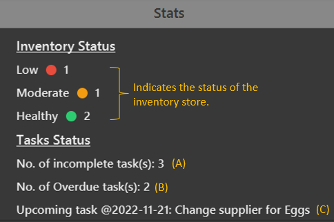

Salesy is an all-in-one tool for NUS canteen vendors who want to keep track of their tasks, inventory and suppliers, optimized for use via a Command Line Interface (CLI) while still having the benefits of a Graphical User Interface (GUI). With Salesy, you can expect a good visualization of your inventory and increased efficiency with your bookkeeping routines.

--------------------------------------------------------------------------------------------------------------------

* Table of Contents
{:toc}

--------------------------------------------------------------------------------------------------------------------

## Quick start

1. Ensure you have Java SDK `11` or above installed in your Computer.

1. Download the latest `Salesy.jar` from [here](https://github.com/AY2223S1-CS2103T-W08-4/tp/releases).

1. Copy the file to the folder you want to use as your home folder in Salesy.

1. Double-click the file to start the app. The GUI should appear in a few seconds.

1. Type in the command box and press Enter to execute it.

1. Refer to the [Features](#features) below for details of each command.

--------------------------------------------------------------------------------------------------------------------
## Important information

- User has to input details for fields that are not in square brackets, but inputting details for fields in square brackets is optional.
  - e.g. `add n/NAME p/PHONE pr/PRICE i/ITEM a/ADDRESS [t/TAG]`
  - The `NAME`, `PHONE`, `PRICE`, `ITEM` and `ADDRESS` fields are compulsory.
  - The `TAG` field is optional.

- For commands that accept tag fields, i.e. `add`, `addTask`, `edit` and `editTask`, multiple tags are allowed but each tag can only contain a single word.
  - `t/Supplier t/Chicken t/Delivery` is allowed
  - `t/Supplier for Chicken` is not allowed

- Index numbers in commands, e.g. `delete <supplier index>` are compulsory.

- When multiple similar prefixes are input by the user, e.g. `i/Chicken i/Egg i/Cups`,
the rightmost prefix and its details, i.e. `Cups` will be taken as input.
  
## Features

### Statistics Panel

A brief display of important information for **inventory** and **tasks**.

**An overview of the information panel**

**More information**

* **(A)** `Incomplete` tasks refers to tasks that are shown as `Not Done`.
* **(B)** `Overdue` tasks refers to tasks that are both `Not Done` and has a deadline that is
  before the current date.
  * For example: Today's date is **_11 Feb 2022_** and your task's deadline is _**10 Feb 2022**_, this will be counted as `Overdue`.
* **(C)** `Upcoming` tasks refers to tasks that have deadlines that are **in the future and inclusive of today**, that are yet to be completed i.e. `Not Done`.
  * For example: You have an incomplete task. Today's date is **_11 Feb 2022_** and your task's deadline is _**11 Feb 2022 or later**_, this will be counted as `Upcoming`.

### Colors used for Inventory

Simple and intuitive colors are used to identify stock levels.

**Examples:**

Inventory Status in the [Stats Panel](#Statistics Panel).

Inventory Cards for Items

**Detailed Explanation**

| Color          | Meaning                                                      | How is it determined ?                                                                              |
|----------------|--------------------------------------------------------------|-----------------------------------------------------------------------------------------------------|
| ️🍎&nbsp;Red   | Running `low`, restock as soon as possible.                  | **Less than 120%** of minimum stock specified.                                                      |
| 🟠&nbsp;Orange | Running at a `moderate` level, can consider restocking soon. | **More than and equal to 120%** of minimum stock specified and **less than 165%** of minimum stock. |
| 🟢&nbsp;Green  | Running at a `healthy` level, no worries about restocking.   | **More than and equal to 165%** of minimum stock specified.                                         |

## Commands

### Add supplier/task/supply item: `add`

Adds an item of a specified type with the given details

**Things you can add:**
* Suppliers
* Tasks
* Supply Item (item in inventory)

***Format:***

`add n/NAME p/PHONE(8 digits) pr/PRICE i/ITEM a/ADDRESS [t/TAG]` **(supplier)**

`addTask d/TASKNAME dl/DEADLINE [t/TAG]` **(task)**

`addItem <supplier index> c/CURRENTSTOCK m/MINIMUMSTOCK` (supply item)

**Note:** Tag rules apply for `add` and `addTask`. Refer to [this section](#important-information).

**Examples:**

Add a supplier to Salesy’s address book

>`add n/ABC PTE LTD p/67009000 pr/$1.10 i/Egg a/Blk 140 Woodlands Ave 3 t/Supplier`

Add a task to Salesy

>`addTask d/Pass ingredients to XXX Pte Ltd dl/2022-12-12`

Add an item to Salesy's inventory

Item from first supplier in address book added

>`addItem 1 c/10 m/3`

### Delete: `delete`

Deletes the specified item of the specified type from Salesy

**Things you can delete:**
* Suppliers
* Tasks
* Supply items

***Format:***

`delete <supplier index>` (supplier)

`deleteTask <task index>` (task)

`deleteItem <item index>` (supply item)

**Examples**

Delete a supplier

> `delete 1`

Delete a task

> `deleteTask 2`

Delete an item in inventory

> `deleteItem 1`

### Mark: `mark`

Marks the specified task as done to keep task list updated

**Things you can mark:**
* Tasks

***Format:***

`mark <task index>`

**Examples**

Mark a task that you have completed

> `mark 2`

### Unmark: `unmark`

Unmarks a previously marked task

**Things you can unmark:**
* Tasks

***Format:***

`unmark <task index>`

**Examples**

Unmark a task that you have completed

> `unmark 3`

### Edit: `edit`

Edits a specified item's details

**Things you can edit:**
* Supplier details
* Tasks
* Item stock

***Format:***

`edit <supplier index> [n/NAME] [p/PHONE] [pr/PRICE] [i/ITEM] [a/ADDRESS] [t/TAG]` (supplier)

`editTask <task index> [d/DESCRIPTION] [dl/DEADLINE] [t/TAG]` (task)

`editStock <item index> c/CURRENTSTOCK` (supply item)

**Note:** At least one field has to be edited for the command to execute successfully.

Tag rules apply for `edit` and `editTask`. Refer to [this section](#important-information).

**Examples**

* Edit supplier details

> `edit 3 pr/$2.50`

* Edit task details

> `editTask 1 dl/2022-10-10`

* Edit item stock count

> `editStock 1 c/7`

### Find: `find`

Finds suppliers based on name or item

***Format:***

`find n/NAMEVALUE` (supplier name)

`find i/ITEMVALUE` (supplier item)

**Examples**

* Find suppliers with name John Cena

> `find n/John Cena`

* Find suppliers who supply Eggs

> `find i/Egg`

### Increment / Decrement current stock in your inventory

Increases or decreases your stock for a particular item in the inventory

**Steps**

1. Take a look at the inventory panel at the bottom-middle section of the application.
2. Decide on which item you want to modify the stock of.
3. Hover your mouse over item and the white text box with a value `1` in it.
4. Key in your desired amount to add or decrease by.

5. Press the `+` icon to add your desired amount (or press the `-` icon to reduce by your desired amount).

***Notice that the current stock of Ginger increased by your desired amount.***

**Limitations**

* Only able to key in up to a 5 digit value.
* Only able to key in positive values

### List all data : `listAll`

Lists all items.

***Format:***

`listAll`

**Examples**

* List all entities

> `listAll`

### List all suppliers/tasks/inventory

Refreshes and lists all suppliers/tasks/items.

**Example of a possible use case**
- After using the `find` command for supplier contacts, `listAll` / `listSuppliers` will list all
contacts in Salesy's address book.

### List all suppliers: `listSuppliers`

List all suppliers

***Format:***

`listSuppliers`

**Examples**

* List all suppliers

> `listSuppliers`

### List all tasks: `listTasks`

Lists all tasks

***Format:***

`listTasks`

**Examples**

* List all tasks

> `listTasks`

**Note:**
Note: All tasks displayed in the GUI is sorted by deadline.
The task with the earliest deadline is found at the top of the list.

### List everything in the inventory: `listInventory`

Lists the whole inventory.

***Format:***

`listInventory`

**Examples**

* List all items

> `listInventory`

### Clear Supplier Address Book: `clear`

Clears and deletes all suppliers in Salesy. 

> ⚠️(**WARNING**) This command is used to reset only the suppliers in the Suppliers panel. Running this command will remove all
> suppliers from Salesy. To regain the sample data again, delete `addressbook.json` from the source folder of the app and 
> re-run Salesy.

--------------------------------------------------------------------------------------------------------------------

## Command summary

| Action                       | Format                                                   | Examples                                                                           |
|------------------------------|----------------------------------------------------------|------------------------------------------------------------------------------------|
| **clear** (supplier)         | `clear`                                                  | `clear`                                                                            |
| **list** (supplier)          | `listSuppliers`                                          | `listSuppliers`                                                                    |
| **add**  (supplier)          | `add n/NAME p/PHONE pr/PRICE i/ITEM a/ADDRESS [t/TAG]`   | `add n/ABC PTE LTD p/67009000 pr/$1.10 i/Egg a/Blk 140 Woodlands Ave 3 t/Supplier` |
| **delete** (supplier)        | `delete <supplier index>`                                | `delete 1`                                                                         |
| **edit**  (supplier)         | `edit <supplier index> <attribute name>/ <new value>`    | `edit 3 pr/#1.70`                                                                  |
| **find**  (supplier)         | `find n/NAMEVALUE`    `find i/ITEMVALUE`              | `find n/John Cena`   `find i/Egg`                                               |
| **list** (task)              | `listTasks`                                              | `listTasks`                                                                        |
| **add** (task)               | `addTask d/DETAILS dl/DEADLINE [t/TAG]`                  | `addTask d/Restock Eggs dl/2022-12-12 t/Urgent`                                    |
| **delete** (task)            | `deleteTask <task index>`                                | `deleteTask 1`                                                                     |
| **edit** (task)              | `editTask <task index> <attribute name>/ <new value>`    | `editTask 1 dl/2029-12-12`                                                         |
| **mark**  (task)             | `mark <task index>`                                      | `mark 1`                                                                           |
| **unmark** (task)            | `unmark <task index>`                                    | `unmark 2`                                                                         |
| **list** (supply item)       | `listInventory`                                          | `listInventory`                                                                    |
| **add** (supply item)        | `addItem <supplier index> c/CURRENTSTOCK m/MINIMUMSTOCK` | `addItem 2 c/10 m/3`                                                               |
| **delete** (supply item)     | `deleteItem <item index>`                                | `deleteItem 2`                                                                     |
| **edit stock** (supply item) | `editStock <item index> c/CURRENTSTOCK`                  | `editStock 2 c/12`                                                                 |
| **list** (all items)         | `listAll`                                                | `listAll`                                                                          |                                                    |
