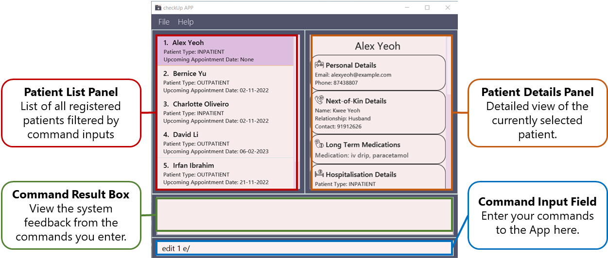
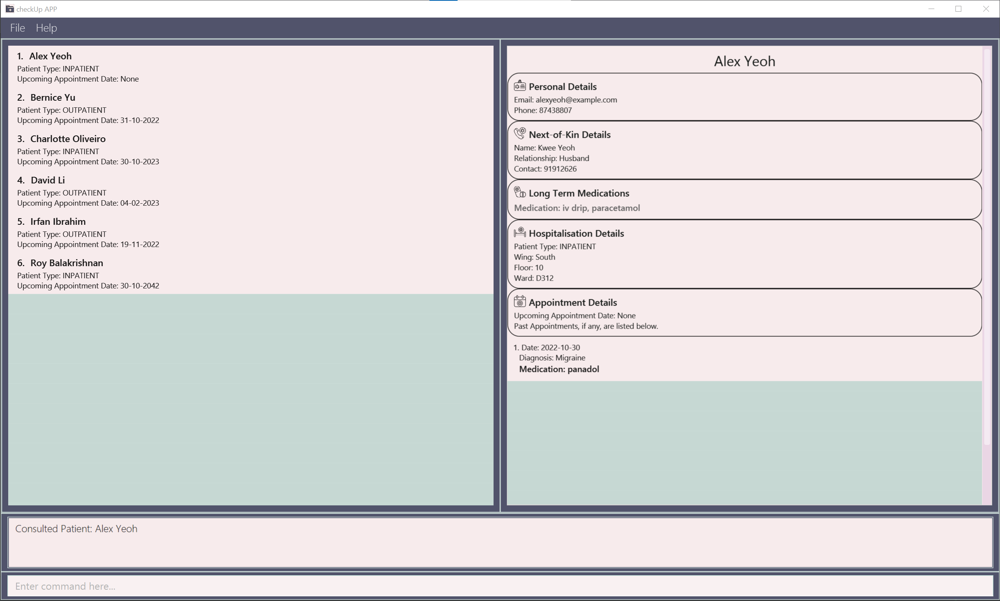

* Table of Contents
{:toc}
---

**checkUp is the perfect desktop app for healthcare establishments**. If you are a healthcare worker looking for an app to better manage 
your patients details then look no further! checkUp can boost your productivity with features to quickly retrieve patients details without the 
need of internet connection. Beyond that, checkUp also has features to help you manage your inventory so that you know when to restock certain medication!

checkUp is available for the Windows, macOS and Linux operating systems. To get started, simply head over to the [Installation Guide](#installation-guide). This user guide 
can also serve as a reference for experienced users, with a convenient [Command Summary](#command-summary).

:notebook: **Note:** We store patient data locally on your device. This means that you can benefit from extremely quick loading times!

--------------------------------------------------------------------------------------------------------------------

## Installation Guide

### System Requirements
Here is everything you need to install and set up checkUp. For the best possible experience, we recommend that you use checkUp on the following supported operating systems:

* Windows
* macOS
* Linux  

You will also require Java 11 or above to run checkUp. If you don't already have Java 11 or above on your system, head over to [Oracle's Java download page](https://www.oracle.com/java/technologies/downloads/). 
To tell if you already have the correct version of Java installed on your system, refer to [Checking your system's Java version](#checking-your-systems-java-version).

### Installation 
1. Download the latest `checkUp.jar` from [here](https://github.com/AY2223S1-CS2103T-W16-3/tp/releases).

2. Copy the file to the folder you want to use as the _home folder_ for your checkUp app.

3. Double-click the file to start the app.

4. The user interface similar to the below will appear in a few seconds. Note how the app contains some sample data. 
   
   

[back to top](#back-to-topt)

---
## Quick start

1. Type your desired command into the command input field and press `<Enter>` to execute it. e.g. typing **`help`** and pressing
   `<Enter>` will open the help window. 
   Some example commands you can try:

    * **`add `**`n/Amy Toh p/98765432 e/johnd@example.com nok/Jane Doe, Wife, 82858285 pt/inpatient hw/south fn/3 wn/D690
      m/panadol m/ibuprofen` : Adds a patient named `Amy Toh` to checkUp.

    * **`delete `** `3` : Deletes the 3rd patient shown in the current patient list panel.

    * **`get `** `/n Alex`: Retrieve patient's information based on the prefix you provided. In this case, patients
      with the name `Alex` will be displayed.

    * **`view `** `1` : Views the 1st patient shown in the current patient list panel by displaying it on the patient details panel.

2. You can refer to the [Features](#features) section for details of each command.
3. When you come across an unfamiliar term used, refer to the [Glossary](#glossary) section.

[back to top](#back-to-topt)

---

## Symbols

| Symbol        | Meaning                                                                                                        |
|---------------|----------------------------------------------------------------------------------------------------------------|
| :bulb:        | Tip that may be useful to know.  This symbol is followed by a label ‘Tip’.                                     |
| :notebook:    | Information that may be useful to know. This symbol is followed by a label ‘Note’.                             |
| :exclamation: | Crucial information you need to know before using the command. This symbol is followed by a label ‘Caution’.   |
| `+`           | Required field.                                                                                                |
| `-`           | Optional field.                                                                                                |
| `*`           | Multiple inputs are allowed.                                                                                   |

[back to top](#back-to-topt)

---

## Features

This section guides you on how to use features available in checkUp. 

Do **take some time to read the following note** to better understand how you can use this section!

**:notebook: Notes about the command format:** 

* Words in `UPPER_CASE` are the parameters to be supplied by you. 
  e.g. in `get /n NAME`, `NAME` is a parameter which can be used as `get /n John Doe`.

* Items in square brackets are optional. 
  e.g. `n/NAME [m/MEDICATION]` can be used as `n/John Doe m/Ibuprofen` or as `n/John Doe`.

* Items with `…`​ after them can be used multiple times including zero times. 
  e.g. `[m/MEDICATION]…​` can be used as ` ` (i.e. 0 times), `m/ibuprofen m/lozenges`, `m/ibuprofen` etc.

* Parameters can be in any order. 
  e.g. if the command specifies `n/NAME p/PHONE_NUMBER`, `p/PHONE_NUMBER n/NAME` is also acceptable.

* Extraneous parameters for commands that do not take in parameters (such as `help`, `list`, `exit` and `clear`) will be
  ignored. 
  e.g. if the command specifies `help 123`, it will be interpreted as `help`.

**The features of CheckUp can be split into 3 main categories:**

* [Creating Patient Info](#creating-patient-info)
* [Retrieving Patient Info](#retrieving-patient-info)
* [General Commands](#general-commands)

[back to top](#back-to-topt)

## Creating Patient Info
The commands in this segment are focused on creating, editing and removing data to and from the application. 
These commands are:

* [Adding a patient](#adding-a-patient-add)
* [Editing a patient](#editing-a-patient-edit)
* [Deleting a patient](#deleting-a-patient-delete)
* [Creating an appointment](#creating-past-appointment-for-patient-appt)
* [Deleting an appointment](#deleting-past-appointment-for-patient-delappt)
* [Consulting a patient](#consulting-a-patient-consult)

### Adding a patient: `add`

Adds a patient to checkUp.

Format: `add {Prefix}/{Parameter}…​`

**The prefixes and their respective parameters are as follows:**

| Status  | Prefix | Parameter                               | Restrictions                                                                                  |
|---------|--------|-----------------------------------------|-----------------------------------------------------------------------------------------------|
| `+`     | n      | NAME                                    | Alphanumeric characters and spaces only.                                                      |
| `+`     | p      | PHONE                                   | Numbers only and at least 3 digits.                                                           |
| `+`     | e      | EMAIL                                   | Must follow a valid email format. See below for more information.                             |
| `+`     | nok    | NEXT-OF-KIN_NAME, RELATIONSHIP, CONTACT | NAME & RELATIONSHIP: Alphabets and spaces only.  CONTACT: Numbers only.                   |
| `+`     | pt     | PATIENT_TYPE                            | Either `inpatient`/`i` or `outpatient`/`o`.  (case-insensitive)                               |
| `-`     | hw     | HOSPITAL_WING                           | Either `north`, `south`, `east` or `west` (case-insensitive) . **Compulsory for inpatients**. |
| `-`     | fn     | FLOOR_NUMBER                            | Positive integer only.                    **Compulsory for inpatients**.                      |
| `-`     | wn     | WARD_NUMBER                             | One uppercase alphabet followed by 3 digits only.    **Compulsory for inpatients**.           |
| `-`     | ua     | UPCOMING_APPOINTMENT                    | `dd-MM-yyyy` format only (i.e. `12-06-2022`), must be current or a future date.               |
| `-` `*` | m      | LONG_TERM_MEDICATION                    | Alphanumeric characters and spaces only.                                                      |

**Email Format**

* Must follow the format `username@domain`.
* **username**: Alphanumeric characters and `+`, `_`, `.`, `-` only.
* **domain**: Consists of domain labels separated by `-` or `.`. Domain labels consist of alphanumeric characters only
  and each domain label must be present (i.e. `johndoe@yahoo-.gmail` is not allowed as the domain label after `yahoo`
  and before `gmail` is empty).
* Examples: `john@checkup.com`, `john-doe@checkup.com`, `john.doe@checkup.com`,  `john_doe@check-up.com`.

:bulb: **Tip:**
A patient can have any number of medications (including 0)!

**:notebook: Notes about Patient Type:** 
When the patient is an outpatient, `add` will throw an error if any values are input for the `hw/`, `fn/` and `wn/` fields.
Similarly, for an inpatient, `add` will throw an error if values are **not** input any of the `hw/`, `fn/` and `wn/` fields.
Please see the [Examples](#add-examples) below for more information.

**Reasons for usage:**

* You want to add the personal information of the patient such as their name and contact details (phone number and email).
* You want to add the personal information of a patient's next-of-kin such as their next-of-kin's name, relationship
  to the patient and contact number.
* You want to add a patient's type (inpatient/outpatient).
* If the patient is an inpatient, you want to add the location of their ward (hospital wing, floor number of the ward 
  and ward number).
* You want to add any upcoming appointments that a patient has.
* You want to add any long-term medication that a patient has been prescribed.

**Upon Execution**

If the command was successfully executed, you should see something similar to the image below in the Command Result Box:

If not, please follow the error message given and format above to enter the correct command.

**Examples:**

If patient type is inpatient:  
`add n/John Doe p/98765432 e/johnd@example.com nok/Jane Doe, Wife, 82858285 pt/inpatient hw/south fn/3 wn/D690 m/panadol
m/ibuprofen`

 

If patient type is outpatient:  
`add n/John Doe p/98765432 e/johnd@example.com nok/Jane Doe, Wife, 82858285 pt/outpatient m/panadol m/ibuprofen`

[back to top](#back-to-topt), [back to features](#features), [back to segment top](#creating-patient-info)

### Editing a patient: `edit`

Edits the details of the patient specified by the index number used in the patient list panel.

Format: `edit INDEX {Prefix}/{Parameter}...`

**The prefixes and their respective parameters are as follows:**

| Status  | Prefix | Parameter                               | Restrictions                                                                                  |
|---------|--------|-----------------------------------------|-----------------------------------------------------------------------------------------------|
| `+`     |        | INDEX                                   | Positive integer only.                                                                        |
| `-`     | n      | NAME                                    | Alphanumeric characters and spaces only.                                                      |
| `-`     | p      | PHONE                                   | Numbers only and at least 3 digits.                                                           |
| `-`     | e      | EMAIL                                   | Must follow a valid email format. See below for more information.                             |
| `-`     | nok    | NEXT-OF-KIN_NAME, RELATIONSHIP, CONTACT | NAME & RELATIONSHIP: Alphabets and spaces only.  CONTACT: Numbers only.                   |
| `-`     | pt     | PATIENT_TYPE                            | Either `inpatient`/`i` or `outpatient`/`o`.                                                   |
| `-`     | hw     | HOSPITAL_WING                           | Either `north`, `south`, `east` or `west` (case-insensitive).  **Compulsory for inpatients**. |
| `-`     | fn     | FLOOR_NUMBER                            | Positive integer only.            **Compulsory for inpatients**.                              |
| `-`     | wn     | WARD_NUMBER                             | One uppercase alphabet followed by 3 digits only.  **Compulsory for inpatients**.             |
| `-`     | ua     | UPCOMING_APPOINTMENT                    | `dd-MM-yyyy` format only (i.e. `12-06-2022`), must be current or a future date.               |
| `-` `*` | m      | LONG_TERM_MEDICATION                    | Alphanumeric characters and spaces only.                                                      |

**Email Format**

* Must follow the format `username@domain`.
* **username**: Alphanumeric characters and `+`, `_`, `.`, `-` only.
* **domain**: Consists of domain labels separated by `-` or `.`. Domain labels consist of alphanumeric characters only
  and each domain label must be present (i.e. `johndoe@yahoo-.gmail` is not allowed as the domain label after `yahoo`
  and before `gmail` is empty).
* Examples: `john@checkup.com`, `john-doe@checkup.com`, `john.doe@checkup.com`,  `john_doe@check-up.com`.

**:notebook: Notes about Patient Type:** 
When the patient type is edited from an inpatient to an outpatient and subsequently back to an inpatient, 
you will have to manually input the hospital wing, floor number and ward number again.

**Requirements**
* At least one of the optional fields must be provided.
* Existing values will be updated to the input values.
* To remove all patient’s medications, just type `m/` without specifying any medication after it.
* To remove all upcoming appointments, just type `ua/` without specifying any date after it.

:exclamation: **Caution:**
When editing medication, the existing medication of the patient will be removed i.e. adding of medication is not
cumulative.

**Reasons for usage:**

* You want to correct any typos when adding a patient's details into checkUp.
* You want to edit the personal information of the patient such as their name and contact details (phone number and email).
* You want to edit the personal information of a patient's next-of-kin such as their next-of-kin's name, relationship 
  to the patient and contact number.
* You want to edit a patient's type (inpatient/outpatient).
* If the patient is an inpatient, you want to edit the location of their ward (hospital wing, floor number of the ward
  and ward number).
* You want to edit any upcoming appointments that a patient has.
* You want to edit any long-term medication that a patient has been prescribed.

**Upon Execution**

If the command was successfully executed, you should see something similar to the image below in the Command Result Box:

If not, please follow the error message given and format above to enter the correct command.

**Examples:**
                                                                                                   
* `edit 1 p/91234567 e/johndoe@example.com` edits the phone number and email address of the 1st patient to be `91234567`
  and `johndoe@example.com` respectively.
  

* `edit 2 n/Betsy Crower m/` edits the name of the 2nd patient to be `Betsy Crower` and clears all existing medication.
  

[back to top](#back-to-topt), [back to features](#features), [back to segment top](#creating-patient-info)

### Deleting a patient: `delete`

:exclamation: **Caution:** Deleted patient records cannot be recovered.

Deletes the patient specified by the index number used in the patient list panel.

Format: `delete INDEX`

* The index **must be a positive integer** 1, 2, 3, …​

**Reasons for usage:**

* You want to remove any personal information or data of a patient in checkUp.
* You want to remove any erroneous information added into checkUp. e.g. You accidentally added an extra patient into 
  checkUp and wish to remove it.

**Upon Execution**

If the command was successfully executed, you should see something similar to the image below in the Command Result Box:

If not, please follow the error message given and format above to enter the correct command.

**Examples:**

* `list` followed by `delete 2` deletes the 2nd patient in checkUp.

* `get /n Betsy` followed by `delete 1` deletes the 1st patient displayed in the patient list panel after the `get /n` 
  command.

[back to top](#back-to-topt), [back to features](#features), [back to segment top](#creating-patient-info)

### Creating past appointment for patient: `appt`

Creates a past appointment for the patient specified by the index number used in the patient list panel.

Format: `appt INDEX {Prefix}/{Parameter}...`

**The prefixes and their respective parameters are as follows:**

| Status  | Prefix | Parameter             | Restrictions                                                                  |
|---------|--------|-----------------------|-------------------------------------------------------------------------------|
| `+`     |        | INDEX                 | Positive integer only.                                                        |
| `+`     | on     | DATE                  | `dd-MM-yyyy` format only (i.e. `12-06-2022`), must be current or a past date. |
| `+`     | diag   | DIAGNOSIS             | -                                                                             |
| `-` `*` | m      | MEDICATION_PRESCRIBED | Alphanumeric characters and spaces only.                                      |

**Reasons for usage:**

* You want to create a past appointment record for a patient.
* You want to record the diagnosis for a patient during a past appointment.
* You want to record the medication prescribed for a patient during a past appointment.
* You want to record the date of the past appointment.

**Upon Execution**

If the command was successfully executed, you should see something similar to the image below in the Command Result Box:

If not, please follow the error message given and format above to enter the correct command.

**Examples:**

* `get /n John` displays `John Doe` at index 1 and `John` at index 2.
* Following this, `appt 1 on/12-06-2022 diag/Common cold, viral flu m/Panadol m/Lozenges` will create a past appointment
  for `John Doe`.

[back to top](#back-to-topt), [back to features](#features), [back to segment top](#creating-patient-info)

### Deleting past appointment for patient: `delappt`

:exclamation: **Caution:** Deleted past appointments cannot be recovered.  

Deletes the most recent past appointment of the patient specified by the index number used in the patient list panel.

Format: `delappt INDEX`

* The index **must be a positive integer**, eg. 1, 2, 3...

**Reasons for usage:**

* You want to delete the most recent past appointment record for a patient.
* The most recent past appointment record was incorrectly created.
* The most recent past appointment data should be recorded under another patient.
* The most recent past appointment record is no longer relevant.

**Upon Execution**

If the command was successfully executed, you should see something similar to the image below in the Command Result Box:

If not, please follow the error message given and format above to enter the correct command.

**Examples:**

* `get /n John` displays `John Doe` at index 1 and `John` at index 2.
* Following this, `delappt 1` will remove `John Doe`'s most recent past appointment.

[back to top](#back-to-topt), [back to features](#features), [back to segment top](#creating-patient-info)

### Consulting a patient: `consult`
Adds the diagnostic report of a patient after the consultation.

Format: `consult INDEX {Prefix}/{Parameter}...`

**The prefixes and their respective parameters are as follows:**

| Status  | Prefix | Parameter             | Restrictions                                  |
|---------|------|-----------------------|-----------------------------------------------|
| `+`     |      | INDEX                 | Positive integer only.                        |
| `+`     | diag | DIAGNOSIS             | -                                             |
| `-` `*` | m    | MEDICATION_PRESCRIBED | Alphanumeric characters and spaces only.      |

**Reasons for usage:**

* You want to record the diagnosis for a patient during a consultation.
* You want to record the medication prescribed for a patient during a consultation.
* You want to record the date of the consultation.
* You want to indicate that a patient's upcoming appointment today has been completed.

**Upon Execution**

If the command was successfully executed, you should see something similar to the image below in the Command Result Box:

If not, please follow the error message given and format above to enter the correct command.

**Examples:**

* Assume `Alex Yeoh` is currently the first displayed person.
* `consult 1 diag/Migraine m/Panadol` will create a past appointment for `Alex Yeoh` for the current date and also 
clear his upcoming appointment which was scheduled for the current date.
  

[back to top](#back-to-topt), [back to features](#features), [back to segment top](#creating-patient-info)

---
## Retrieving Patient Info
The commands in this segment are focused on filtering, processing then retrieving patient information in meaningful ways.
These commands are:
* [Listing all patients](#listing-all-patients-list)
* [Locating patients](#locating-patients-get)
* [Counting all patients](#obtaining-total-patient-count-count)

### Listing all patients: `list`

Lists all the patients in checkUp.

Format: `list`

[back to top](#back-to-topt), [back to features](#features), [back to segment top](#retrieving-patient-info)

### Locating patients: `get`
Finds patients based on the predicates and parameters you input.

Format `get /PREDICATE PARAMETER`

**The predicates you can use to get the patients by are as follows:**

| Predicate                             | Parameter            | Description                                                      |
|---------------------------------------|----------------------|------------------------------------------------------------------|
| [n](#by-name-n)                       | NAME                 | Finds patients by name.                                          |
| [nok](#by-next-of-kin-data-nok)       | PATIENT_NAME         | Finds next-of-kin data of a patient.                             | 
| [hw](#by-hospital-wing-hw)            | HOSPITAL_WING        | Finds all the patients in a hospital wing.                       |
| [fn](#by-floor-number-fn)             | FLOOR_NUMBER         | Finds all the patients on a floor number.                        |
| [wn](#by-ward-number-wn)              | WARD_NUMBER          | Finds all the patients in a ward.                                |
| [m](#by-long-term-medication-m)       | LONG_TERM_MEDICATION | Finds all the patients by their long-term medication.            |
| [inp](#by-patient-type-inp)           | -                    | Finds all the inpatients.                                        |
| [outp](#by-patient-type-outp)         | -                    | Finds all the outpatients.                                       |
| [appt](#by-appointments-appt)         | INDEX                | Finds all past appointments of a patient.                        |
| [appton](#by-appointment-date-appton) | APPOINTMENT_DATE     | Finds all the patients with an appointment on a particular date. |

#### by name: `/n`

Finds patients whose names contain any of the given keywords.

Format: `get /n NAME`

* The search is case-insensitive. e.g. `get /n hans` matches `get /n Hans`.
* The order of the keywords does not matter. e.g. `get /n Hans Bo` matches `get /n Bo Hans`.
* Only full words will be matched e.g. `get /n Han` will not match `get /n Hans`.
* Patients with names that match at least one keyword will be displayed. e.g. `get /n Hans Bo` will display
  `Hans Gruber` and `Bo Yang`.

**Examples:**

* `get /n john` displays `john` and `John Doe`.
* `get /n alex david` displays `Alex Yeoh`, `David Li`. 
  

[back to top](#back-to-topt), [back to features](#features), [back to segment top](#retrieving-patient-info)

#### next-of-kin data: `/nok`

Finds next-of-kin data for patients matching the input `PATIENT_NAME`, and is hence similar to the `get /n` command.

Format: `get /nok PATIENT_NAME`

* The search is case-insensitive. e.g. `get /nok hans` matches `get /nok Hans`.
* The order of the keywords does not matter. e.g. `get /nok Hans Bo` matches `get /nok Bo Hans`.
* Patients with names that match at least one keyword will have their next-of-kin details displayed. e.g.
  `get /nok Hans Bo` will display `Sarar, 12345678, Mom`.

#### by hospital wing: `/hw`

Finds all the patients in that particular hospital wing.

Format: `get /hw HOSPITAL_WING`

* `HOSPITAL_WING` only allows the following values: South, North, West, East.
* The search is case-insensitive. e.g `get /hw souTh` matches `get /hw South`.
* Only fully input values will be used. e.g. `get /hw South No` matches `get /hw south` as `No` does not match
  South, North, West or East.
* `get /hw south /hw north` matches `get /hw south north`, which will return all the patients in the south and north wing.
* All the patients in that hospital wing will be displayed. e.g. `get /hw SOUTH` will display `John` `Peter` `Mary`.

#### by floor number: `/fn`

Finds all the patients in that particular floor number.

Format: `get /fn FLOOR_NUMBER`

* `FLOOR_NUMBER` only allows positive integers.
* All the patients in that floor number will be displayed. e.g. `get /fn 2` will display `John` `Peter` `Mary`.
* Multiple `FLOOR_NUMBER` can be input. e.g. `get /fn 1 3` will display all patients staying in the 1st and 3rd floor.

[back to top](#back-to-topt), [back to features](#features), [back to segment top](#retrieving-patient-info)

#### by ward number: `/wn`

Finds all the patients in that particular ward number.

Format: `get /wn WARD_NUMBER`

* All the patients in that ward number will be displayed. e.g. `get /wn D123` will display `John` `Peter` `Mary`.
* Multiple `WARD_NUMBER` can be input. e.g. `get /wn D001 E301` will display all patients staying in the ward number
  D001 and E301.
* `get /wn D123 /wn E133` matches `get /wn D123 E133`.

#### by long term medication: `/m`

Finds all the patients by the long term medication prescribed to them.

Format: `get /m LONG_TERM_MEDICATION`

Example:
* `get /m ibuprofen` displays `John` `Peter` `Mary`.

#### by patient type: `/inp` 

Finds all the inpatients in checkUp.

Format: `get /inp`

Example:
* `get /inp` displays `Alex`, `Charlotte` and `Roy`.

#### by patient type: `/outp`

Finds all the outpatients in checkUp.

Format: `get /outp`

Example:
* `get /outp` displays `Bernice`, `David` and `Irfan`.

[back to top](#back-to-topt), [back to features](#features), [back to segment top](#retrieving-patient-info)

#### by appointments: `/appt`

Finds all past appointments of a patient specified by the index number used in the patient list panel.

Format: `get /appt INDEX`

* The index **must be a positive integer** 1, 2, 3, …​

Example: `get /appt 3` will display  
`On: 12 Jun 2022; Diagnosis: Common viral flu; Prescribed Medication: [lozenges][panadol]`. 
`On: 01 Jan 2001; Diagnosis: headache, medicine given for 3 days; Prescribed Medication: [ibuprofen]`  
in the command result box.

#### by appointment date: `/appton`

Finds all the patients that have an appointment on a particular date.

Format: `get /appton APPOINTMENT_DATE`

* `APPPOINTMENT_DATE` must be in `dd-MM-yyyy` format.
* The appointment date refers to date the patient has an appointment with the clinic or hospital.
* Multiple `APPOINTMENT_DATE` can be input. e.g. `get /appton 14-12-2020 15-12-2020` will display all patients 
having appointments on 14th December 2020 and 15th December 2020.
* All the patients having appointments on that date will be displayed. e.g. `get /appton 12-12-2020` will display
  `John` `Peter` `Mary`.

**Upon Execution**

If the command was successfully executed, you should see something similar to the image below in the Command Result Box:

If not, please follow the error message given and format above to enter the correct command.

[back to top](#back-to-topt), [back to features](#features), [back to segment top](#retrieving-patient-info)

### Obtaining total patient count: `count`

Gets total number of patients. Also gets the total number of types of long-term medications prescribed to patients, and a breakdown of the number of patients
taking each type of long-term medication.

Format: `count`

* The count will be a non-negative number (>= 0). e.g. `count` displays `452` when there are 452 patients noted within
  the hospital.
* If 32 of those patients are on long-term antidepressants, the count will also display
  `antidepressants: 32`.

**Reasons for usage:**

* You want to know if the hospital is currently oversubscribed.
* You want to keep track of the hospital's medicine inventory.
* You want to look at the breakdown of the number of patients taking each type of long-term medication.

[back to top](#back-to-topt), [back to features](#features), [back to segment top](#retrieving-patient-info)

---
## General Commands
The commands in this segment are essential commands needed for the app to run correctly 
and quality of life commands to improve the user experience.
These commands are:
* [Viewing a patient](#viewing-a-patient-view)
* [Clearing all data](#clearing-all-data--clear)
* [Opening the help page](#open-the-help-page--help)
* [Exiting the program](#exiting-the-program--exit)
* [Mouse interactions](#mouse-interactions)
* [Keyboard shortcuts](#keyboard-shortcuts)

### Viewing a Patient: `view`

Displays the details of a patient specified by the index number from the patient list panel.

Format: `view INDEX`

* The index **must be a positive integer** 1, 2, 3, …​
* Details are displayed on the patient details panel.

**Reason for usage:**

* You want to view a patient's information in detail. 

:bulb: **Tip:**
On startup, the patient details panel will always default to the first patient if present.
 
It will also automatically focus onto the most recent patient added or edited.
 
When the current person displayed on the patient details panel is removed, it defaults to viewing the first patient
in the patient list panel if present, and empty otherwise.

 

**Upon Execution**

If the command was successfully executed, you should see something similar to the image below in the Command Result Box:

If not, please follow the error message given and format above to enter the correct command.

[back to top](#back-to-topt), [back to features](#features), [back to segment top](#general-commands)

### Clearing all data : `clear`

:exclamation: **Caution:** Deleted patient records cannot be recovered.

Empties checkUp of all patients stored.

Format: `clear`

* All patients will be removed from storage.
* This command is **nuclear**, and cannot be reversed. It should only be executed when absolutely necessary.
* This command is provided for privacy reasons, or to start afresh.

**Reasons for usage:**

* You want to reset the app completely.
* You want to clear all patient data from your application.

### Opening the Help Page : `help`

Opens the Help Window, which allows you to copy the URL of the User Guide to your clipboard.

Format: `help`

**Reasons for usage:**
* You are unsure of the commands available and want to access the User Guide.

### Exiting the program : `exit`

Exits checkUp.

Format: `exit`

* GUI settings (window height and width) are preserved during this process.

**Reason for usage:**

* After you have completed your tasks using the app, you want to close the program.

[back to top](#back-to-topt), [back to features](#features), [back to segment top](#general-commands)

### Saving the data

checkUp has been created in such a manner that you do not need to manually save data. Simply executing commands saves
any data created or deleted from the application.

### Editing the data file

* checkUp stores data in the JSON format, improving readability and allowing for manually editing the data file.
* The data file can be found in `data/checkup.json` in the home folder where checkUp's `jar` file is stored.
* Care needs to be taken to follow data storage formats properly, or else the application will **reject** the data file.
  * Rejected data files will be replaced with a new, empty data file when saving data.

### Mouse Interactions

Although CheckUp is built as a Command Line Interface application, it also supports the following mouse interactions:

#### Person List Panel

* Double-clicking on patients in the Patient List Panel will automatically open their info in the Patient Details Panel.

**Reason for usage:**

* You want to quickly view a patient's detailed info without having to enter a command.

Example:

* Double-clicking on the first patient `Alex Yeoh` will display his details on the Patient View Panel.

#### Person Details Panel

* Double-clicking on the fields in the Patient Details Panel will automatically prepare them for editing in the Command Input Box.

**Reason for usage:**

* You want to quickly edit a single field in the patient's details.

Example:

* If the patient is `Alex Yeoh`, double-clicking on his `email` will set the text in the Command Input Box to `edit 1 e/`.

### Keyboard Shortcuts

Similar to other CLI applications, CheckUp supports a few keyboard shortcuts:
  * Navigate past commands with the `UP` and `DOWN` arrow keys.
  * Clear the text currently in the command box with `Ctrl + Shift + C`.

**Reasons for usage:**

* You want to quickly access a previously entered command without having to retype it.
* You want to clear the input line of a long command without having to manually delete it.

[back to top](#back-to-topt), [back to features](#features), [back to segment top](#general-commands)

--------------------------------------------------------------------------------------------------------------------

## FAQ

**Q**: How do I transfer my data to another Computer? 
**A**: Install the app in the other computer and overwrite the empty data file it creates with the file that contains
the data of your previous checkUp home folder.

--------------------------------------------------------------------------------------------------------------------

## Command summary

| Action                                                        | Format, Examples                                                                                                                                                                                                                                                                                                                                    |
|---------------------------------------------------------------|-----------------------------------------------------------------------------------------------------------------------------------------------------------------------------------------------------------------------------------------------------------------------------------------------------------------------------------------------------|
| [**add**](#adding-a-patient-add)                              | `add n/NAME p/PHONE e/EMAIL nok/NEXT-OF-KIN_NAME, RELATIONSHIP, CONTACT pt/PATIENT_TYPE [hw/HOSPITAL_WING] [fn/FLOOR_NUMBER] [wn/WARD_NUMBER] [ua/UPCOMING_APPOINTMENT] [m/LONG_TERM_MEDICATION]…`  e.g., `add n/John Doe p/98765432 e/johnd@example.com nok/Jane Doe, Wife, 82858285 pt/inpatient hw/south fn/3 wn/D690 m/panadol m/ibuprofen`  |
| [**edit**](#editing-a-patient-edit)                           | `edit INDEX [n/NAME] [p/PHONE] [e/EMAIL] [nok/NEXT-OF-KIN_NAME, RELATIONSHIP, CONTACT] [pt/PATIENT_TYPE] [hw/HOSPITAL_WING] [fn/FLOOR_NUMBER] [wn/WARD_NUMBER] [ua/UPCOMING_APPOINTMENT] [m/LONG_TERM_MEDICATION]...`  e.g.,`edit 2 n/James Lee e/jameslee@example.com`                                                                          |
| [**delete**](#deleting-a-patient-delete)                      | `delete INDEX`  e.g., `delete 3`                                                                                                                                                                                                                                                                                                                 |
| [**appt**](#creating-past-appointment-for-patient-appt)       | `appt INDEX on/DATE diag/DIAGNOSIS [m/MEDICATION]...`   e.g., `appt 1 on/12-06-2022 diag/Common cold, viral flu m/panadol m/lozenges`                                                                                                                                                                                                            |                                                                                                                                                                                                                                                                                    
| [**delappt**](#deleting-past-appointment-for-patient-delappt) | `delappt INDEX`   e.g., `delappt 1`                                                                                                                                                                                                                                                                                                              |
| [**consult**](#consulting-a-patient-consult)                  | `consult INDEX diag/DIAGNOSIS [m/MEDICATION_PRESCRIBED]`   e.g., `consult 1 diag/Migraine m/Panadol`                                                                                                                                                                                                                                             |
| [**list**](#listing-all-patients-list)                        | `list`                                                                                                                                                                                                                                                                                                                                              |
| [**get /n**](#by-name-n)                                      | `get /n NAME`  e.g., `get /n John`                                                                                                                                                                                                                                                                                                               |
| [**get /nok**](#by-next-of-kin-data-nok)                      | `get /nok PATIENT_NAME`  e.g., `get /nok John`                                                                                                                                                                                                                                                                                                   |
| [**get /hw**](#by-hospital-wing-hw)                           | `get /hw HOSPITAL_WING`  e.g., `get /hw South`                                                                                                                                                                                                                                                                                                   |
| [**get /fn**](#by-floor-number-fn)                            | `get /fn FLOOR_NUMBER`   e.g., `get /fn 2`                                                                                                                                                                                                                                                                                                       |
| [**get /wn**](#by-ward-number-wn)                             | `get /wn WARD_NUMBER`   e.g., `get /wn D012`                                                                                                                                                                                                                                                                                                     |
| [**get /inp**](#by-patient-type-inp)                          | `get /inp`                                                                                                                                                                                                                                                                                                                                          |
| [**get /outp**](#by-patient-type-outp)                        | `get /outp`                                                                                                                                                                                                                                                                                                                                         |
| [**get /m**](#by-long-term-medication-m)                      | `get /m MEDICATION`   e.g., `get /m ibuprofen`                                                                                                                                                                                                                                                                                                   |
| [**get /appt**](#by-appointments-appt)                        | `get /appt INDEX`   e.g., `get /appt 3`                                                                                                                                                                                                                                                                                                          |
| [**get /appton**](#by-appointment-date-appton)                | `get /appton APPOINTMENT_DATE`   e.g., `get /appton 21-05-2020`                                                                                                                                                                                                                                                                                  |
| [**count**](#obtaining-total-patient-count-count)             | `count`                                                                                                                                                                                                                                                                                                                                             |
| [**view**](#viewing-a-patient-view)                           | `view INDEX`   e.g., `view 1`                                                                                                                                                                                                                                                                                                                    |
| [**clear**](#clearing-all-entries--clear)                     | `clear`                                                                                                                                                                                                                                                                                                                                             |
| [**help**](#open-the-help-page--help)                         | `help`                                                                                                                                                                                                                                                                                                                                              |
| [**exit**](#exiting-the-program--exit)                        | `exit`                                                                                                                                                                                                                                                                                                                                              |

[back to top](#back-to-topt)

## Troubleshooting
### Checking your system's Java version

This section covers the technical issues you may run into while using checkUp.

**Checking your system's Java version**

To check that your system has the correct Java version (Java 11 and above) to run checkUp, you can follow the steps below:

Open your terminal.
* Windows
    * Use Win + S to open search.
    * Type in `Terminal` to open the terminal.
    * In your terminal, type in `java --version` and click enter.

* macOS
    * Use Cmd + Space to open Spotlight search.
    * Type in `Terminal` to open the terminal.
    * In your terminal, type in `java --version` and click enter.

* Linux
    * Use Ctrl + Alt + T to open the Terminal.
    * In your terminal, type in `java --version` and click enter.  

The following image shows an example what will show up in Windows,
but you can expect a similar result in other operating systems.

The number in the red highlight rectangle tells you the Java version installed.
For example, the Java version installed on the example system is Java 11.0.9, which is sufficient to run checkUp as it is greater than Java 11.

If you do not see a similar result in the terminal after Step 3, or have an earlier version of Java,
head over to [Oracle's Java download page](https://www.oracle.com/java/technologies/downloads/) to install Java.

[back to top](#back-to-topt)

## Glossary

| Term              | Definition                                                                                 |
|-------------------|--------------------------------------------------------------------------------------------|
| **Appointment**   | An arrangement to consult the doctor at a particular date.                                 |
| **Diagnosis**     | The identification of diseases by the examination of symptoms and signs.                   |
| **Inpatient**     | A patient who stays in a hospital while under treatment.                                   |
| **Outpatient**    | A patient who goes to a hospital or clinic for treatment without staying there overnight.  |
| **Hospital Wing** | The section of the hospital where the inpatient is in.                                     |
| **Floor Number**  | The floor where the inpatient is on.                                                       |
| **Medication**    | A drug or other form of medicine that is used to treat or prevent disease.                 |
| **Next-Of-Kin**   | The patient's closest living relative.                                                     |
| **Ward Number**   | The ward where the inpatient is in.                                                        |

[back to top](#back-to-topt)
