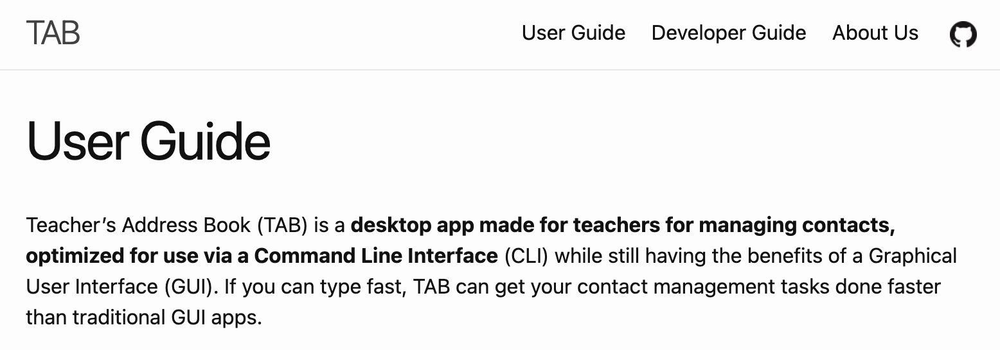

Teacher’s Address Book (TAB) is a **desktop app made for teachers, teaching assistants(TA) and professors for managing contacts of each other, as well as their students, optimized for use via a Command Line Interface** (CLI) while still having the benefits of a Graphical User Interface (GUI). If you can type fast, TAB can get your contact management tasks done faster than traditional GUI apps.

TAs and Professors are now taking on more roles in different modules. As such, TAB allows the creation of multiple addressbooks which can be used to store the contact information of each specific module, which leads to neater organisation of contacts.
* Table of Contents
{:toc}

--------------------------------------------------------------------------------------------------------------------

## Quick start

1. Ensure you have Java `11` or above installed in your Computer.

2. Download the latest `TAB.jar` from [here](https://github.com/AY2223S1-CS2103T-T17-1/tp/releases).

3. Copy the file to the folder you want to use as the _home folder_ for your TAB.

4. Double-click the file to start the app. The GUI similar to the below should appear in a few seconds. Note how the app contains some sample data. 
   

5. Type the command in the command box and press Enter to execute it. e.g. typing **`help`** and pressing Enter will open the help window. 
   Some example commands you can try:

   * **`list`** : Lists all contacts.

   * **`add`**`n/John Doe p/98765432 e/johnd@example.com pos/Student a/John street, block 123, #01-01 t/CS2103T-T17` : Adds a contact named `John Doe` to TAB.

   * **`delete`**`3` : Deletes the 3rd contact shown in the current list.

   * **`clear`** : Deletes all contacts.

   * **`exit`** : Exits the app.

6. Refer to the [Features](#features) below for details of each command.

:bulb: **Tip:**
For teachers who are teaching more than one module, please use one TAB for each module. Refer to relevant commands to see how you can create new TAB and swap between existing TABs.

--------------------------------------------------------------------------------------------------------------------

## Features

**:information_source: Notes about the command format:** 

* All commands are **case sentitive**
* All tokenizers are **case sentitive**
* Words in `UPPER_CASE` are the parameters to be supplied by the user. 
  e.g. in `add n/NAME`, `NAME` is a parameter which can be used as `add n/John Doe`.

* Items in square brackets are optional. 
  e.g. `n/NAME [t/TAG]` can be used as `n/John Doe t/friend` or as `n/John Doe`.

* Items with `…`​ after them can be used multiple times including zero times. 
  e.g. `[t/TAG]…​` can be used as ` ` (i.e. 0 times), `t/CS2103T-T12`, `t/CS2103T-T12 t/CS2103T-15` etc.

* Parameters can be in any order. 
  e.g. if the command specifies `n/NAME p/PHONE_NUMBER`, `p/PHONE_NUMBER n/NAME` is also acceptable.

* If a parameter is expected only once in the command, but you specified it multiple times, only the last occurrence of the parameter will be taken. 
  e.g. if you specify `p/12341234 p/56785678`, only `p/56785678` will be taken.

* Extraneous parameters for commands that do not take in parameters (such as `help`, `list`, `exit` and `clear`) will be ignored. 
  e.g. if the command specifies `help 123`, it will be interpreted as `help`.

### Viewing help : `help`

Launches the user guide in a browser window.

Format: `help`

:bulb: **Tip:**
This can also be done by clicking Help or pressing F1 on the keyboard.

### Adding a person: `add`

Adds a person to TAB.

Format: `add n/NAME p/PHONE_NUMBER e/EMAIL pos/POSITION a/ADDRESS t/MODULE-GROUP`

:bulb: **Tip:**
A teaching assistant or professor can have more than one tag. A student can only have one tag.

Format of parameters:
* `NAME`: Alphanumerical
* `PHONE_NUMBER`: Numerical
* `Email`: local-part@domain
  * local-part: Alphanumerical and the following special characters, excluding the parentheses, (+_.-)
  * domain: The domain name must:
    * end with a domain label at least 2 characters long
    * have each domain label start and end with alphanumeric characters
    * have each domain label consist of alphanumeric characters, separated only by hyphens, if any.
* `Position`: `Student`, `TA`, or `Professor`
* `Address`: Any value, but cannot be blank
* `Tags`: {Alphanumeric Module}-{Alphanumeric Tutorial group}

Adds a new contact with the provided details. Required fields include name, phone number, email, position, and tag. Tags represent the module and tutorial group a person is associated with and must be in the format of module-tutorial group.

Examples:
* `add n/Alex Yeoh p/87438807 e/alexyeoh@example.com pos/Student a/Blk 30 Geylang Street 29, #06-40 t/CS2103T-T17`
* `add n/Betsy Crowe p/92498754 e/betsycrowe@example.com pos/TA a/Blk 30 Lorong 3 Serangoon Gardens, #07-18 t/CS2103T-T17`

### Listing all persons : `list`

Shows a list of all persons in TAB.

Format: `list`

### Displaying the details of a person : `show`

Shows the detailed information of a person.

General displayed information are:
* Name
* Position
* Phone
* Email
* Tags
* Address
* Remarks

There are also additional information unique to each role

Professors:
* Roles: `Coordinator`, `Tutor`, `Lecturer`and/or `Advisor`

TA:
* Availability: `Available` or `Unavailable` 

Student
* Attendance: represented as a fraction _e.g. 9/10_
* Grade: represented as a fraction. This grade is the overall grade calculated from the list of already graded Assignments.
* Graph containing each Assignment and their scores(only if their grae has been updated)
Format: `show INDEX`

* Shows the detailed information of the person at the specified `INDEX`.
* The index refers to the index number shown in the displayed person list.
* The index **must be a positive integer** 1, 2, 3, …​

:bulb: **Tip:**
If you cannot see all the added assignments in the graph, simply enlarge your tab!

Examples:
* `show 3` shows the detailed information of the 3rd person in TAB.

:bulb: **Tip:**
This can also be done by clicking on the person.

### Editing a person : `edit`

Edits an existing person in TAB.

Format: `edit INDEX [n/NAME] [p/PHONE] [e/EMAIL] [pos/POSITION] [t/TAGS]`

Edits the person at the specified `INDEX`. The index refers to the index number shown in the displayed person list. The index **must be a positive integer** 1, 2, 3, …​
* At least one of the optional fields must be provided.
* Existing values will be updated to the input values.
* When editing tags, the existing tags of the person will be removed i.e. adding of tags is not cumulative.
* You can remove all the person’s tags by typing `t/` without
  specifying any tags after it.

Examples:
*  `edit 1 p/91234567 e/johndoe@example.com` edits the phone number and email address of the 1st person to be `91234567` and `johndoe@example.com` respectively.
*  `edit 2 n/Betsy Crower t/` edits the name of the 2nd person to be `Betsy Crower` and clears all existing tags.

### Adding a remark : `remark`

Adds or edits a remark of an existing person in TAB.

Format: `remark INDEX r/REMARK`

Modifies a remark of a person at the specified `INDEX`. The index refers to the index number shown in the displayed person list. The index **must be a positive integer** 1, 2, 3, …​
* A person can have at most 1 remark.
* When editing remark, the existing remark of the person will be removed i.e. adding of remarks is not cumulative.
* You can remove the person's remark field by typing `r/` without
  specifying any message after it.

Examples:
* `remark 1 r/Interested to be a TA` edits the remark field of the 1st person to be `Interested to be a TA`.
* `remark 2 r/remark_one r/remark_two` edits the remark field of the 2nd person to be `remark_two` and not `remark_one`.
* `remark 3 r/` clears the remark field of the 3rd person.

### Editing the attendance of a student : `attendance`

Edits the attendance of an existing student in TAB.

Format: `attendance INDEX attendance/ATTENDANCE`

Edits the attendance of the person (whose position must be student) at the specified `INDEX`. The index refers to the index number shown in the displayed person list. The index **must be a positive integer** 1, 2, 3, …​

Examples:
*  `attendance 1 attendance/10/13` edits the attendance of the 1st person to be `10/13`.

### Adding assignments to all students : `assignments`

Adds assignments to all students in the TAB.

Format: `assignments assignments/ ASSIGNMENT_1 w/ASSIGNMENT_1_WEIGHTAGE, ASSIGNMENT_2 w/ASSIGNMENT_2_WEIGHTAGE…​`

* The assignments are added to all students in the TAB. Students that are added to the TAB afterwards will automatically be instantiated with the assignments.
* The weightage of the assignments must be integers that add up to 100%. The command will fail otherwise.
* At most 10 assignments can be added.

Examples: 
* `assignments assignments/ Assignment 1 w/15, Assignment 2 w/15, Midterms w/30, Finals w/40` adds Assignment 1: 15% weightage, Assignment 2: 15% weightage, Midterms: 30% weightage, and Finals: 40% weightage to all students in the TAB.
* `assignments assignments/ Assignment 1 w/20 Finals w/15` will fail as the weightage does not add up to 100%.

### Editing the grade of a student : `grade`

Edits a student's grade of an assignment of in TAB.

Format: `grade INDEX assignment/INDEX grade/GRADE`

Edits the grade of an assignment of the person (whose position must be student) at the specified `INDEX`. The first index refers to the index number shown in the displayed person list. The second index refers to the index of the assignment to be edited as shown in the assignment list of the specified student. The indices **must be positive integers** 1, 2, 3, …​
* The grade shown on the detail page of a student represent the overall grade that the student has achieved, calculated based on the grade and weightage of each assignment.

Examples:
* `grade 2 assignment/1 grade/68/80` edits the grade of the 1st assignment of the 2nd person (whose position is student) to be `68/80`.
* `grade 1 assignment/1 grade/68/80` will fail if the position of the 1st person in the displayed person list is not student.

### Editing the availability of a TA : `avail`

Edits the availability of an existing TA in TAB.

Format: `avail INDEX avail/AVAILABILITY`

Edits the availability of the person (whose position must be TA) at the specified `INDEX`. The index refers to the index number shown in the displayed person list. The index **must be a positive integer** 1, 2, 3, …​

Examples:
*  `avail 1 avail/Available` edits the availability of the 1st person to be `Available`.

### Editing the roles of a Professor : `roles`

Edits the roles of an existing professor in TAB.

Format: `roles INDEX roles/ROLE1, ROLE2,...`

Edits the roles of the person (whose position must be professor) at the specified `INDEX`. The index refers to the index number shown in the displayed person list. The index **must be a positive integer** 1, 2, 3, …​
*  Multiple roles may be added and must be separated by a comma.

Examples:
*  `roles 1 roles/Coordinator, Lecturer, Advisor` edits the roles of the 1st person to be `Coordinator, Lecturer, Advisor`.

### Locating persons by name: `find`

Finds persons whose names contain any of the given keywords.

Format: `find KEYWORD [MORE_KEYWORDS]`

* The search is case-insensitive. e.g. `hans` will match `Hans`
* The order of the keywords does not matter. e.g. `Hans Bo` will match `Bo Hans`
* Only the name is searched.
* Only full words will be matched e.g. `Han` will not match `Hans`
* Persons matching at least one keyword will be returned (i.e. `OR` search).
  e.g. `Hans Bo` will return `Hans Gruber`, `Bo Yang`

Examples:
* `find John` returns `john` and `John Doe`
* `find alex david` returns `Alex Yeoh`, `David Li` 
  

### Filtering persons by tag: `filter`

Filters persons with the specified tag.

Format: `filter TAG`

* The search is case-insensitive. e.g. `cs2103t-t17` will match `CS2103T-T17`
* Only full word will be matched. e.g. `CS2103T` will not match `CS2103T-T17`

Examples:
* `filter CS2103T-T17` returns persons with the tag `CS2103T-T17`
* `filter CS2103T` returns no result.

### Deleting a person : `delete`

Deletes the specified person from the TAB.

Format: `delete INDEX`

* Deletes the person at the specified `INDEX`.
* The index refers to the index number shown in the displayed person list.
* The index **must be a positive integer** 1, 2, 3, …​

Examples:
* `list` followed by `delete 2` deletes the 2nd person in the TAB.
* `find Betsy` followed by `delete 1` deletes the 1st person in the results of the `find` command.

### Clearing all entries : `clear`

Clears all entries from the TAB.

Format: `clear`

### Saving the data

TAB data are saved in the hard disk automatically after any command that changes the data. There is no need to save manually.

### Editing the data file

TAB data are saved as a JSON file `[JAR file location]/data/addressbook.json`. Advanced users are welcome to update data directly by editing that data file.

:exclamation: **Caution:**
If your changes to the data file makes its format invalid, TAB will discard all data and start with an empty data file at the next run.

### Creating new TAB : `new`

Creates a new TAB and automatically swaps to the newly created data file.

Format: `new`

:bulb: **Tip:**
This can also be done by clicking `File` - `New Book` or using keyboard shortcut `ctrl + shift + n`

### Swapping between TABs : `swap`

Swaps between existing TABs.

Format: `swap`

:bulb: **Tip:**
This can also be done by clicking `File` - `Swap Book` or using keyboard shortcut `shift + tab`

### Renaming the data file : `rename`

Renames the current data file.

Format: `rename {NEW_NAME}`

Renames the current data file as the `NEW_NAME`
* `NEW_NAME`only accepts alphanumeric, '-' and '_' characters.

Example:
* `rename {CS2103T}` renames the current data file as `CS2103T.json`

### Exiting the program : `exit`

Exits the program.

Format: `exit`

:bulb: **Tip:**
This can also be done by clicking File - Exit.

--------------------------------------------------------------------------------------------------------------------

## FAQ

**Q**: How do I transfer my data to another Computer? 
**A**: Install the app in the other computer and overwrite the empty data file it creates with the file that contains the data of your previous TAB home folder.

--------------------------------------------------------------------------------------------------------------------

## Command summary

Action | Format, Examples
--------|------------------
**Help** | `help`
**Add** | `add n/NAME p/PHONE_NUMBER e/EMAIL a/ADDRESS pos/ POSITION [t/TAG]…​`   e.g., `add n/Alex Yeoh p/87438807 e/alexyeoh@example.com pos/Student a/Blk 30 Geylang Street 29, #06-40 t/CS2103T-T17`
**List** | `list`
**Show** | `show INDEX`  e.g., `show 2`
**Edit** | `edit INDEX [n/NAME] [p/PHONE_NUMBER] [e/EMAIL] [pos/POSITION] [a/ADDRESS] [t/TAG]…​`  e.g.,`edit 2 n/James Lee e/jameslee@example.com`
**Remark** | `remark INDEX r/REMARK`  e.g., `remark 1 r/Interested to be a TA`
**Attendance** | `attendance INDEX attendance/ATTENDANCE`   e.g., `attendance 1 attendance/10/13`
**Assignments** | `assignments assignments/ ASSIGNMENT_1 w/ASSIGNMENT_1_WEIGHTAGE, ASSIGNMENT_2 w/ASSIGNMENT_2_WEIGHTAGE…​`  e.g., `assignments assignments/ Assignment 1 w/15, Assignment 2 w/15, Midterms w/30, Finals w/40`
**Grade** | `grade INDEX assignment/INDEX grade/GRADE`   e.g., `grade 2 assignment/1 grade/68/80`
**Availability** | `avail INDEX avail/AVAILABILITY`   e.g., `avail 1 avail/Available`
**Roles** | `roles INDEX roles/ROLE1, ROLE2,...`   e.g., `roles 1 roles/Coordinator, Lecturer, Advisor`
**Find** | `find KEYWORD [MORE_KEYWORDS]`  e.g., `find James Jake`
**Filter** | `filter TAG`  e.g., `filter CS2103T-T17`
**Delete** | `delete INDEX`  e.g., `delete 3`
**Clear** | `clear`
**New** | `new`
**Swap** | `swap`
**Rename** | `rename {NEW_NAME}`  e.g., `rename {CS2103T}`
**Exit** | `exit`
