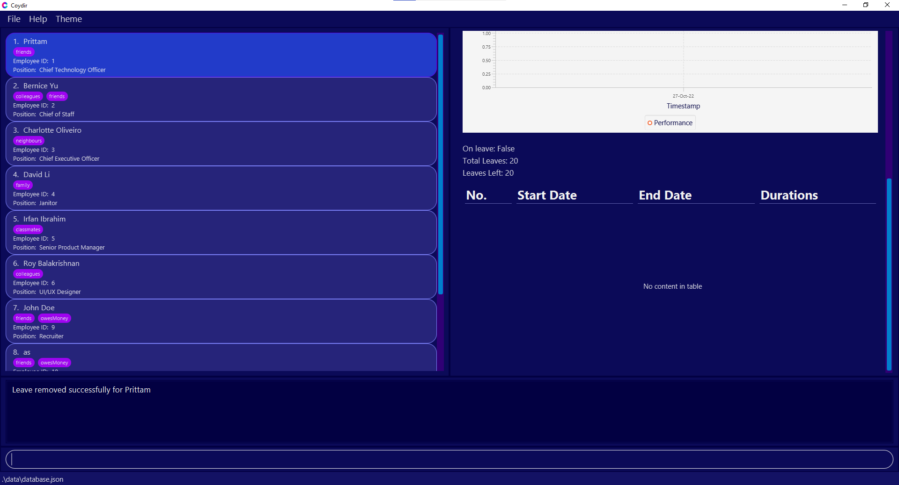

  
  
Coydir

  
The Ultimate Company Directory

## **Coydir /(‘kohy-də)/**

> **Financial Resources may be the lifeblood of a company, but human resources are the brains.** - Rob Silzer

**Revolutionize** your company and become an **Industry Leader** today with Coydir!

---

### Table of Contents

- [Introduction](#introduction)
- [Using this Guide](#using-this-guide)
- [The User Interface](#the-user-interface)
- [Quick Start](#quick-start)
- [Features](#features)
  - [Coydir Commands Format](#coydir-commands-format)
  - [Managing Employee Profiles](#managing-employee-profiles)
    - [What's in an Employee Profile](#whats-in-an-employee-profile)
    - [Adding an employee](#adding-an-employee-add)
    - [Adding multiple employees at once](#adding-multiple-employees-at-once-batch-add)
    - [View details of an employee](#view-details-of-an-employee-view)
    - [Editing an employee](#editing-an-employee-edit)
    - [Deleting an employee](#deleting-an-employee-delete)
    - [Finding an employee](#finding-an-employee-find)
    - [Listing all employees](#listing-all-employees-list)
  - [Managing Employee Leaves](#managing-employee-leaves)
    - [Controlling total leaves for an employee](#controlling-total-leave-for-an-employee)
    - [Checking if an employee is on leave](#checking-if-an-employee-is-on-leave)
    - [Adding a leave period for an employee](#adding-a-leave-period-for-an-employee-add-leave)
    - [Deleting a leave period for an employee](#deleting-a-leave-period-for-an-employee-delete-leave)
  - [Managing Employee Performance](#managing-employee-performance)
    - [Rating the performance of an employee](#rating-the-performance-of-an-employee-rate)
    - [Employee Performance History](#employee-performance-history)
  - [Managing Departments](#managing-departments)
    - [View details of a department](#view-details-of-a-department-view-department)
  - [Additional Features](#additional-features)
    - [Getting help](#getting-help-help)
    - [Exiting the program](#exiting-the-program-exit)
    - [Clearing the data](#clearing-the-data-clear)
    - [Saving the data](#saving-the-data)
    - [Editing the data file](#editing-the-data-file)
- [Frequently Asked Questions](#faq)
- [Glossary](#glossary)
- [Field Formats](#field-formats)
- [Command Summary](#command-summary)

---

## Introduction

Welcome HR executives and Department Heads! **Coydir** is a desktop app to efficiently track key employee details within your company, optimized for use via a Command Line Interface (CLI). **Coydir** would not only allow you to quickly access the list of all employees and their details but also make necessary updates such as leaves and performance rating information.

## Using this Guide

Are you a HR executive or a Department Head seeking a solution to efficiently track employee information and observe key statistics of your company? **Coydir** is here to elegantly solve your problems. This user guide will teach you everything you need to know about the **Coydir** product, and start using our features today!

This guide walks you through the comprehensive features of **Coydir**. Do feel free to refer to this whenever you need help.

Is this your first time using **Coydir**? Check out our [Introduction](#introduction) to learn what **Coydir** is about! Refer to our [Table of Contents](#table-of-contents) to easily navigate between the different sections of our User Guide. If you can't wait to get started on this amazing product, head over to [Quick Start](#quick-start) to install and start using **Coydir**.

All done setting up Coydir? Head over to our [Features](#features) section to learn how to use the features we offer. To summarize, Coydir helps you...

1. [**Manage Employee Profiles**](#managing-employee-profiles)

2. [**Manage Employee Leaves**](#managing-employee-leaves)

3. [**Manage Employee Performance**](#managing-employee-performance)

4. [**Manage Departments**](#managing-departments)

Still have doubts about our product? Head over to [FAQ](#faq) to view some frequently asked questions and answers. If your question is not answered in the _FAQ_, you can always contact us at _coydir@gmail.com_, and we will be happy to answer you.

Just want a quick overview of all the features Coydir can offer? You can head over to [Command Summary](#command-summary) for a quick look of all the commands you can use.

## The User Interface

Below is an image of Coydir User Interface with the main components labelled.

| No. | Component           | Description                                                                                                                                                  |
| --- | ------------------- | ------------------------------------------------------------------------------------------------------------------------------------------------------------ |
| 1   | Toolbar             | Includes information on frequently-used commands. Switch to light/dark mode.                                                                                 |
| 2   | Employee List Panel | Displays the list of employees. Includes basic information such as `tags`, `position`, `employee ID`.                                                        |
| 3   | Display Panel       | Displays the information of an employee or department. The information includes the employee's personal details, leave information, performance information. |
| 4   | Command Panel       | Displays the system message after the execution of a command. The system message describes the outcome of the entered command.                               |

#### 1. Toolbar

This Toolbar can be used to :

1. Exit the application through the **File** button
2. Access the Help guide through the **Help** button
3. Change from Dark mode to Light Mode or vice versa through the **Theme** button

#### 2. Employee List Panel

This shows the whole employee list with basic information such as _Name_, _Employee ID_ and _Position_.

This will come in handy if:

1. You want a general overview of the employees in the company as of this moment.
2. You want to quickly find out their Employee ID to view more details.

#### 3. Display Panel

This shows a specific employee's particulars.
Things to note:

1. On startup of the application, this panel shows Coydir logo.
2. To view an employee's particulars, refer to the [view command]([#view-details-of-an-employee-view).
3. If you delete an employee that you are currently viewing, the employee info view will display the next employee's particulars.
4. If there is no next employee, this panel will revert to the Coydir logo.

#### 4. Command Panel

You can enter your user commands in the bottom section labeled as `Enter command here...`.

The top section displays relevant messages/errors after the command is entered.

## Quick start

1. Ensure you have Java `11` or above installed in your Computer.
   1. If you have installed Java before, check that you have the right version, which is Java `11`.
      - If you are using Windows, open up command prompt and type `java -version` and enter.
      - If you are using Mac, open up terminal and type `java -version` and enter.
   2. If you do not have Java `11`:
      - If you are using Windows, you can install it from [here](https://www.oracle.com/java/technologies/downloads/).
      - If you are using Mac, you can install the Azul build of OpenJDK 11 version from [here](https://www.azul.com/downloads/?version=java-11-lts&os=macos&architecture=arm-64-bit&package=jdk-fx).
2. Download the latest Coydir v1.4.0 jar file from [here](https://github.com/AY2223S1-CS2103T-T15-1/tp/releases).

3. Copy the file to the folder you want to use as the _home folder_ for your Coydir.

4. Double-click the file to start the app. A GUI similar to below should appear in a few seconds. Note how the app contains some sample data. 

  

5. Type the command in the command panel and press Enter to execute it. e.g. typing **`help`** and pressing Enter will open the help window. 
   Some example commands you can try:

   - **`list`** : Lists all employees in the company.

   - **`add`** `n/John Doe p/98765432 e/johnd@example.com j/Recruiter d/Human Resources a/311, Clementi Ave 2, #02-25 l/20 t/friends t/owesMoney` : Adds an employee named `John Doe`, with fields phone number, email, job title, department, address, total leaves, and tags to Coydir.

   - **`delete 3`** : Deletes employee with ID 3.

   - **`exit`** : Exits the app.

6. Refer to the [Features](#features) below for details of each command.

## Symbols and Syntax

Here are some symbols to look out for while using this guide:

| Symbol               | Meaning                                      |
| -------------------- | -------------------------------------------- |
| `code`               | Text relevant to commands or name of a file. |
| :information_source: | Information that is useful to take note of.  |
| :bulb:               | Tips for Coydir Users.                       |
| :warning:            | Be wary and proceed with caution.            |

## Features

With our powerful features, it has never been more convenient to perform HR tasks in companies of all sizes.

Coydir empowers you to take more control with less hassle, through data management and analytics features targeting 4 main fields:

1. [Employee particulars and details](#managing-employee-profiles)
2. [Employee leaves](#managing-employee-leaves)
3. [Employee performance](#managing-employee-performance)
4. [Department macro-view](#managing-departments)

Coydir also has other miscellaneous features for a smooth and comfortable use of the application, that we will cover in:

- [Additional Features](#additional-features)

We will explore each of these fields in great detail as we continue along, but before we get into that, let us take a look at how you can use the commands in Coydir's CLI-based interface.

### Coydir Commands Format

- Words in `UPPER_CASE` are the parameters to be supplied by the user. 
  e.g. in `add n/NAME`, `NAME` is a parameter which can be used as `add n/John Doe`.

- Items in square brackets are optional. 
  e.g `n/NAME [t/TAG]` can be used as `n/John Doe t/friend` or as `n/John Doe`.

- Items with `…`​ after them can be used multiple times including zero times. 
  e.g. `[t/TAG]…​` can be used as ` ` (i.e. 0 times), `t/friend`, `t/friend t/family` etc.

- Parameters can be in any order. 
  e.g. if the command specifies `n/NAME p/PHONE_NUMBER`, `p/PHONE_NUMBER n/NAME` is also acceptable.

- If a parameter is expected only once in the command but you specified it multiple times, only the last occurrence of the parameter will be taken. 
  e.g. if you specify `p/12341234 p/56785678`, only `p/56785678` will be taken.

- Extraneous parameters for commands that do not take in parameters (such as `help`, `list`, `exit` and `clear`) will be ignored. 
  e.g. if the command specifies `help 123`, it will be interpreted as `help`.

- If a parameter is provided, anything after the prefix for that parameter until the end, or until the next parameter, will be taken as the value for the parameter. 
  e.g. if you specify `n/John 91234567 a/Little India`, the entire length of "John 91234567" will be taken as the name.

:warning:
  **Integer input values cannot be too large**: any values greater than 231-1, or 2147483647, is not supported.

For more information about the format of each field, head over to [Field Formats](#field-formats).

### Managing Employee Profiles

What's Human Resources without the Human aspect? (_P.S. It's not "Resources"_)

The **core** of any management tool is the **collection and tracking of data**.
Recognising this, Coydir offers several features for the manipulation of data on your company's employees.

As a _HR professional_, Coydir makes it easy for you to **add and remove data**, **change past entries**, and **look for exactly the information you need**.
All this, while keeping your data packed neatly as individual employee profiles for a clean, organised viewing.

Next, let us look at each feature in detail.

#### What's in an Employee Profile

There's _a lot of data_ that a company might want to keep track of for their employees, and different companies might maintain different standards and policies.
In light of this, Coydir focuses on making it easy to manage key data for employees, for the purpose of making everyday operations smooth.

The complete employee profile allows you to specify _a fair amount_ of details for an employee, though some of these particulars are **optional**, and can be left blank if you are unsure of the information, or if you do not feel the need to keep track of it.

| Particular       | Description                            | Requirement    | Default Value |
| ---------------- | -------------------------------------- | -------------- | ------------- |
| **Employee ID**  | Unique numerical ID of employee        | **Cannot Set** | -             |
| **Name**         | Name of employee                       | **Compulsory** | -             |
| **Position**     | Position/job title of employee         | **Compulsory** | -             |
| **Department**   | Department of employee                 | **Compulsory** | -             |
| **Phone Number** | Phone number of employee               | **Optional**   | N/A           |
| **Email**        | Email of employee                      | **Optional**   | N/A           |
| **Address**      | Address of employee                    | **Optional**   | N/A           |
| **Tag**          | Any tag(s) for simple remarks          | **Optional**   | _None_        |
| **Total Leave**  | Total no. of leave for employee        | **Optional**   | 14            |
| **Leaves Left**  | No. of leaves left for employee        | **Cannot Set** | 14            |
| **Rating**       | Latest performance rating for employee | **Cannot Set** | _None_        |

:information_source: **Bonus Information on the Profile**

- **Employee ID** is a unique number assigned to each employee, and is used for several powerful commands. To ensure the uniqueness of the IDs, Coydir **does not support** any editing/manipulation of the employee IDs.
  - If you really wish to, you can [edit the data file](#editing-the-data-file) directly to "control" the employee IDs. However, this is _strongly discouraged_.
- For simplicity, Coydir (_in v1.4_) currently supports a fixed list of departments.
  - You can find out more about this in the [Department Management section here](#managing-departments).
- For each employee, Coydir supports managing individual employee leaves, as well as performance ratings, helping you to track the particulars that are not meant to be set (no. of leaves left, employee rating)
  - You can find out more about [employee leave management here](#managing-employee-leaves), and about [performance ratings here](#managing-employee-performance).

#### Adding an employee: `add`

Now, how do we build the employee profiles?

The first step is to add a new employee to the database, so Coydir can begin managing their particulars and profile for you.
To do this, you use the `add` command, together with the employee particulars that you have available for this person.

Upon successfully adding a new employee, Coydir will then keep track of the new profile and details in the database, and you are free to access and modify the particulars with other commands later on.

However, this function could fail (and Coydir simply doesn't add anyone), if:

1. There are missing particulars which are **compulsory**. These mandatory details are listed below.
2. The particulars keyed in are in the wrong format. You can find out more about the formats [here](#field-formats).
3. The new employee added is a _duplicate_, i.e. there is someone in the database who already shares the same name.

Format: `add n/NAME j/POSITION d/DEPARTMENT [p/PHONE] [e/EMAIL] [a/ADDRESS] [l/LEAVE] [t/TAG]…​`

| Field        | TAG | Description                     | Requirement    | Default Value |
| ------------ | --- | ------------------------------- | -------------- | ------------- |
| `NAME`       | n/  | Name                            | **Compulsory** | -             |
| `PHONE`      | p/  | Phone number                    | **Optional**   | N/A           |
| `EMAIL`      | e/  | Email                           | **Optional**   | N/A           |
| `POSITION`   | j/  | Job position                    | **Compulsory** | -             |
| `DEPARTMENT` | d/  | Company Department              | **Compulsory** | -             |
| `ADDRESS`    | a/  | Address                         | **Optional**   | N/A           |
| `LEAVE`      | l/  | Total number of entitled leaves | **Optional**   | 14            |
| `TAG`        | t/  | Information tags                | **Optional**   | _None_        |

:bulb: **More on the Various Fields**

- An employee can have any number of tags (including 0).
- The only compulsory fields are name, position and department.
- Leaves will be default 14 while the other fields will be initialised as N/A.

Examples:

- `add n/John Doe p/98765432 e/johnd@example.com j/Recruiter d/Human Resources a/311, Clementi Ave 2, #02-25 l/20 t/Experienced`
- `add n/Peter Mars j/Chief Operating Officer d/General Management`

#### Adding multiple employees at once: `batch-add`

Tired of adding new employees one by one?
Coydir also allows you to add several employees altogether from a `.csv` file.
This feature will come in handy when:

1. You are a new user and have your employee data stored in a `.csv` file.
2. There has been a recruitment cycle and the company has recruited multiple employees.

With this feature, you would not need to spend time to manually add each employee in!

Format: `batch-add FILENAME`

Example:`batch-add coydir.csv`

Below are the steps to use this command:

**Step 1 (Creating CSV file) :**

Things to note:

- A header row is required to indicate the purpose of the field and must be the first row in the `.csv` file.
- For multiple tags for an employee, the tags should be separated by " \ ".

Order of headers is as such (**Order must be followed**):

| Index | Field          | Requirement    | Default Value |
| ----- | -------------- | -------------- | ------------- |
| 1.    | `NAME`         | **Compulsory** | -             |
| 2.    | `PHONE`        | Optional       | N/A           |
| 3.    | `EMAIL`        | Optional       | N/A           |
| 4.    | `POSITION`     | **Compulsory** | -             |
| 5.    | `DEPARTMENT`   | **Compulsory** | -             |
| 6.    | `ADDRESS`      | Optional       | N/A           |
| 7.    | `NO_OF_LEAVES` | Optional       | 14            |
| 8.    | `TAGS`         | Optional       | _None_        |

Sample `.csv` file:

Sample `.xlsx` file:

Note: You can export this to `.csv`.

:warning: **Caution:** No commas are to be used in the file. For the fields, do ensure that they follow the same specifications as in the [Field Formats below](#field-formats).

**Step 2 (Uploading CSV file) :**

1. Go to the folder where you stored the `jar` file.
2. Move CSV file to the `data` folder.
   

_If you are a new user (have not run any command yet), you will not see the `data` folder.
You can run the [`clear` command](#clearing-the-data-clear) to remove the sample employees first.
After this, you should be able to see the `data` folder._

**Step 3 (Running CSV file) :**

1. Once done, run `batch-add FILENAME` in the command panel.

If the command is successful, the employees in the file should be added to the database all at once, and it should look something like the below image.

The command could be unsuccessful, and there are a few potential causes of this: 

1. There could be a *duplicate* entry in the file, i.e. two employees share the same name in the file.
It could also be possible that one of the employees in the file is a duplicate with an employee already in the database.
2. If any of the particulars in the wrong format, Coydir will also not be able to read the file properly, and the command will not run.
To prevent this, do refer to the format for the various fields [here](#field-formats).

In the case of an unsuccessful Batch Add, **NONE** of the employees in the `.csv` will be added.
Also note that as of version `1.4.0` , this feature only supports `.csv` files and adding employees with the fields mentioned above.

In the upcoming versions, we will expand `batch-add` feature to:

1. Support different types of files
2. Include more fields like rating etc.

#### View details of an employee: `view`

After adding new employees to the database, accessing their freshly built employee profile is a simple command away.

Keying in the `view` command allows you to see the profile of a specified employee, and the chosen profile will pop up on the Display Panel.
You can check the details that are contained in the profile by referring to the previous section [here](#whats-in-an-employee-profile).

To use the command, simply key in `view`, followed by the number representing the index of the employee of your choice.

Format: `view INDEX`

Example:

- `view 2` returns the details of the second employee in the current list.

:information_source:
Note that an INDEX is different from an ID.
Because of this, also note that the `view` command can only be used on employees currently listed on the Employee-List-Panel.

More information about the difference in INDEX and ID can be found on the [FAQ page](#faq).

#### Editing an employee: `edit`

There might be times when you have to change an employee's particulars and details after adding them into the database.
It could be a typo in the address, a mobile number change, maybe even a promotion...

In any case, editing an employee's details can be done through a simple command.

- Provide the **index number** of the employee (not the Employee ID) based on the **employee list currently displayed**, along with the updated details you wish to change to.
- Any existing value, if it exists, will be overwritten by the updated value that is keyed in. Otherwise, details that are not specified will remain as they are, unchanged.

Format: `edit INDEX [n/NAME] [p/PHONE] [e/EMAIL] [j/POSITION] [d/DEPARTMENT] [a/ADDRESS] [l/LEAVE] [t/TAG]…​`

| Field        | TAG | Description                         | Requirement    | Default Value |
| ------------ | --- | ----------------------------------- | -------------- | ------------- |
| `INDEX`      | -   | Index of employee in displayed list | **Compulsory** | -             |
| `NAME`       | n/  | Updated name of employee            | **Optional**   | -             |
| `PHONE`      | p/  | Updated phone number of employee    | **Optional**   | -             |
| `EMAIL`      | e/  | Updated email of employee           | **Optional**   | -             |
| `POSITION`   | j/  | Updated position of employee        | **Optional**   | -             |
| `DEPARTMENT` | d/  | Updated department of employee      | **Optional**   | -             |
| `ADDRESS`    | a/  | Updated address of employee         | **Optional**   | -             |
| `LEAVE`      | l/  | Updated total leave of employee     | **Optional**   | -             |
| `TAG`        | t/  | Updated tag(s) of employee          | **Optional**   | -             |

:bulb:
  There must be _at least one_ update parameter provided (such as name, phone, email, etc.). Otherwise, Coydir will not run the command, as you would not be editing anything at all!

Example:

- `edit 2 p/91234567 l/20 t/colleagues` edits the 2nd displayed employee (_Irfan Ibrahim_) to have a phone number `91234567`, a total leave of `20`, and a single tag `colleagues`.

#### Deleting an employee: `delete`

As time passes, you might run into situations where employees leave the company, and need to be removed from the databse.

You can remove these employees' data with the `delete` command, which removes all associated data from Coydir, so long as you provide the employee ID of the person to remove.

Format: `delete ID`

Example:

- `delete 1` deletes the employee with employee ID of 1.

#### Finding an employee: `find`

Once you get familiar with Coydir and batch-adding numerous employees into the database, your database might get a bit larger.
If you start to feel that scrolling through and looking for an employee is getting tedious, we have just the thing for you.

The `find` command is a specific, precise function meant for searching through your employee directory.

You can find employees by searching for:

- Name
- Position
- Department

Or any combination of the above. Coydir will then display all employees that fulfill your search criteria in the Employee List Panel.

Format: `find [n/NAME_KEYWORD] [j/POSITION_KEYWORD] [d/DEPARTMENT_KEYWORD]`

| Field        | TAG | Description                               | Requirement  | Default Value |
| ------------ | --- | ----------------------------------------- | ------------ | ------------- |
| `NAME`       | n/  | Search keyword for name of employee       | **Optional** | -             |
| `POSITION`   | j/  | Search keyword for position of employee   | **Optional** | -             |
| `DEPARTMENT` | d/  | Search keyword for department of employee | **Optional** | -             |

:bulb: **Important Tips!**

- There must be _at least one_ parameter (and keyword) in the search, else Coydir will not know what to search for!
- The keywords you input for searching are **case-insensitive**. Additionally, they need not be full words, just a segment will do. This means that searching for the department "tech" will show results for both "Technology" and "Information Technology".

Example:

- `find j/officer d/Management` displays 2 employees, who are "Officers" in the "General Management" department.

- `find n/Roy j/Design d/Tech` displays 1 employee, "Roy Balakrishnan" who is a "UI/UX Designer" in the "Information Technology" department.

#### Listing all employees: `list`

After searching for employees with the `find` command, you might notice that the Employee List Panel no longer shows all the employees of your company.
In order to get the full employee list again, simply use the list command, and the Employee List Panel will return to the default view of all employees.

Format: `list`

### Managing Employee Leaves

Employee leave management can sometimes be a surprisingly _tedious_ matter to tackle.

However, with Coydir, we can help you to ensure your **company operations run smoothly**, while your **employees get adequate opportunities** to rest and attend to personal matters.

Here is how we support you in leave management.

#### Controlling total leave for an employee

You can set the total leave available for an **incoming new** employee when adding them to the database.
This can be done by including the optional leave field, `l/`, when using the `add` command.

While we do set the inital value of total leaves as 14 by default, this could be useful for leaves that are carried over, or other special leaves and circumstances.

Example: `add n/Yi Long Ma j/Chief Operating Officer d/General Management l/20` adds an employee, and specifies his **total leave** to be **20**.

You can also edit the total leave available for an **existing** employee by using the `edit` command, and editing the `l/` tag for an employee.

Example: `edit 1 l/10` edits the total leave of the **first** employee in the current list to be **10**.

#### Checking if an employee is on leave

There are two ways to check for the live availability of employees, a critical aspect of ensuring smooth daily operations.

1. First is using the [`view-department` command](#view-details-of-a-department-view-department): `view-department general management` opens up a table to show all the employees of the general management department. The number of employees in the department that are available or on leave will be shown.

2. The other way is using the [`view` command](#view-details-of-an-employee-view), or simply just clicking on the profile card of a specific employee: `view 1`, or clicking on the first person card in the current list of employees, opens up the full information of the employee on the right hand side of the screen. You will be able to check if they are on leave by looking for the "On Leave" field.

#### Adding a leave period for an employee: `add-leave`

This adds a leave period to an employee given the employee ID and a start and end date. The leave period will also be displayed in a table which can be seen when viewing the employee's particulars.

Upon adding a leave for an employee, the total leaves remaining will also be deducted accordingly. The employee's "On Leave" status will become "True" when the timeframe is within the leave period.

However, the function could fail if:

1. The employee does not currently possess enough leaves.
2. The date provided is in an incorrect format or does not exist.
3. The leave period specified overlaps with another leave that the employee is taking.

Format: `add-leave id/ID sd/START_DATE ed/END_DATE`

| Field        | TAG | Description                               | Requirement    | Default Value |
| ------------ | --- | ----------------------------------------- | -------------- | ------------- |
| `ID`         | id/ | Employee ID                               | **Compulsory** | N.A.          |
| `START_DATE` | sd/ | Start date of leave, in dd-MM-YYYY format | **Compulsory** | N.A.          |
| `END_DATE`   | ed/ | End date of leave, in dd-MM-YYYY format   | **Compulsory** | N.A.          |

:bulb:
Leaves are ordered by reverse chronological order in the table view.

Example:

- `add-leave id/1 sd/01-01-2022 ed/01-01-2022` adds a leave period to an employee of ID 1 with a leave period from 01-01-2022 to 01-01-2022 of 1 day.

  
   <em>Result of adding leave successfully from example given</em>

#### Deleting a leave period for an employee: `delete-leave`

Added a wrong leave period or the employee wants to change their leave application? Fret not, `delete-leave` helps you to removes a leave period for an employee given the employee ID and index of leave in the table. The leave period deleted will then be removed from the leave table.

Format: `delete-leave id/ID i/INDEX`

| Field   | TAG | Description                       | Requirement    | Default Value |
| ------- | --- | --------------------------------- | -------------- | ------------- |
| `ID`    | id/ | Employee ID                       | **Compulsory** | N.A.          |
| `INDEX` | i/  | Index of leave in the leave table | **Compulsory** | N.A.          |

Example:

- `delete-leave id/1 i/1` deletes the first leave period for an employee of ID 1 in the table of leaves.

  
   <em>Result of deleting leave successfully from example given</em>

### Managing Employee Performance

Understanding the performance of your employees is crucial for _talent development_ in the company.

Key performance indicators, productivity, and progression policies may differ from company to company.
Here, Coydir offers a **simple yet powerful** way of keeping track of and making sense of your employees' performance in the company.

:information_source: **5-point rating scale**

The 5 point performance appraisal ratings system is the most commonly used performance rating scale across the world.

A 1 to 5 rating scale has a total of 5 categories with 2 negative and 2 positive options.
A middle option is a neutral option for those who have met the expectations in terms of work performance.

This rating scale is well-defined with a separate category for the employees who neither fall in the below expectations (requiring performance review) nor in the exceeds expectations categories.

#### Rating the performance of an employee: `rate`

The core of Coydir's performance tracking system is the `rate` command.
This simple command adds a performance rating for an employee, together with today's date as a timestamp record.
You can use and adapt this to your own company policies, by rating according to your desired monthly/quarterly intervals, for example.

To use the command, key in the `rate` command, and provide the employee ID and a numeric rating.
Ratings can take any integer values from 1 - 5, and it should not be blank.

The numeric representation of the ratings follows as such:

5: Outstanding | 4: Exceeds Expectations | 3: Satisfactory | 2: Needs Improvement | 1: Unsatisfactory

After entering the command, the performance rating will be added and the performance field of the employee will be updated accordingly.
This can be viewed easily with the `view` command.

Do ensure that the rating given is valid.
This means that you should only key in a rating that is an integer between **1 to 5 (inclusive)**, as any values outside of the 5-point scale has no meaning to Coydir.

Format: `rate id/ID r/RATING`

| Field    | TAG | Description                    | Requirement    | Default Value |
| -------- | --- | ------------------------------ | -------------- | ------------- |
| `ID`     | id/ | Employee ID                    | **Compulsory** | -             |
| `RATING` | r/  | Performance rating of employee | **Compulsory** | -             |

Example:

- `rate id/1 r/3` adds a performance rating to an employee of ID 1 with a rating of 3: Satisfactory.

:bulb: **Note:** You can only rate the performance of an employee once per day.

#### Employee Performance History

In each employee profile below their current performance rating field, there is a performance history line graph showing all their past `ratings` over time, marked by a `value` and `timestamp`. The line graph allows you to appreciate the employee's performance trend, and make key decisions regarding talent development.

The individual rating values will be displayed beside each node in the performance rating graph.
This makes it clearer for you to visualize an employee's overall performance at a glance.

### Managing Departments

Apart from supporting the core HR functions, Coydir also supports _department-level management_, for other manpower staff and executives (_department heads, operations planning, etc._).

With these features, we offer a view that is broader than an individual employee profile and more specific than the full directory.

Complete with **real-time statistics and analytics**, Coydir makes department management much simpler.
With these information, department heads can easily observe the structure of a particular department, track the number of currently available employees for better tasks delegation, or even perform a department restructure to improve the overall efficiency of the company.

Currently, our application only provides a list of default departments for you to choose from. Future update will include customizable department name. Our current list of valid departments are:

- Administration
- Board of Directors
- Customer Service
- Finance
- General Management
- Human Resources
- Information Technology
- Legal
- Marketing
- Operations
- Product Management
- Production
- Quality Assurance
- Research and Development
- Sales
- Technology

#### View details of a department: `view-department`

For department heads, pulling up data relevant to your department can be done through the `view-department` command.

This allows you to view the summarized details of a department given the name of the department.
Details include the **number of employees** in that particular department, employees who are **currently available**, employees who are **currently on leave**, and a table of employees in that department with their corresponding **performance ratings**.

Simply enter the `view-department` command, followed by the name of the department (which is case-insensitive).
If the department exists, the *Display Panel* will correctly display the summary of the department.

Format: `view-department DEPARTMENT`

  
   <em>Result of view-department on General Management</em>

Example:

- `view-department Finance` displays a brief summary of the Finance department's details on the right panel.

### Additional Features

To wrap up, let us take a look at a couple of additional features that give _a little boost_ to your HR and department management on Coydir.
These features and techniques serve to make your usage of the application **smoother, easier, and more flexible**.

#### Getting help: `help`

If you have read the full User Guide up to this point, well done!
There can be a lot of information to take in, so if you ever _feel lost_ while using Coydir, getting help with the commands is just a simple step away.

Entering the `help` command will open up window with the command summary for the various functions of the application, and if you have more doubts, the _Help Window_ also contains a button to open up this User Guide in your browser.

Format: `help`

With this command, you should see a window like this appear.

#### Exiting the program: `exit`

At the end of your work, you can exit Coydir and close the application by entering in the `exit` command.
Alternatively, you can also click the close button on the window.

Format: `exit`

#### Clearing the data: `clear`

Clears all the data currently stored in the database.

If you are a new user, you can use this command after you have experimented with Coydir to start keying in your actual employee information.

:warning: **Caution:**
Once you run this command, you lose all data immediately.

Format: `clear`

#### Saving the data

Coydir data are saved in the hard disk automatically after any command that changes the data. There is no need to save manually.

#### Editing the data file

Coydir data are saved as a JSON file `[JAR file location]/data/database.json`.
It is possible to manipulate data by editing the data file directly, but even for advanced users, we **strongly discourage** making any changes to the data file.

If you still choose to do so, we **cannot guarantee** that Coydir continues to support your HR operations smoothly.

:warning: **Caution:**
If your changes to the data file makes its format invalid, Coydir will discard all data and start with an empty data file at the next run.

---

<h2 id="faq">Frequently Asked Questions</h2>

**Q**: How do I transfer my data to another computer? 
**A**: Make sure you have Coydir installed on the other computer first.
Then, you can copy the data file on your current company (can be found [here](#editing-the-data-file)) over to the other computer, at the same file location.
This will enable Coydir to use the data you currently have.

**Q**: What is the difference between an INDEX and an ID? 
**A**: INDEX is the numbering of the current list of people displayed on the Employee List Panel, and it changes with commands such as `find`, when searching for employees.
ID, on the other hand, refers to the **unique** and **permanent** employee ID of the employee, which never changes.

**Q**: How do I change the rating of an employee? 
**A**: You can easily change the rating of an employee by using the `rate` command and adjust the RATING accordingly.
Do note that it's impossible for you to change the past rating of an employee, and also, that you cannot rate an employee more than once per day.

**Q**: How do I fill in the currently blank optional particulars for an employee? 
**A**: You can fill them in with the `edit` command!
The command allows you to edit the employee details, regardless of whether the details are already present, or if they are blank.
Simply use the command together with whichever particulars you wish to add in.

---

## Glossary

1. **CLI** : A _text-based_ user interface which allows the user to perform some action through the use of commands.
2. **Parameter** : The additional input provided for the command to run.
3. **GUI** : A visual user interface that uses visual elements such as shapes, diagrams, and buttons to allow the user to interact with a program.
4. **Prefix** : An input to help identify the type of information in Coydir.
5. **Hard disk** : A component in your computer that stores your data.
6. **JSON** : A file which is used to store data, which adheres to a format called [JavaScript Object Notation (JSON)](https://www.json.org/json-en.html).
7. **CSV** : A file which is used to store data, which adheres to a format called [Comma-Separated Values (CSV)](https://en.wikipedia.org/wiki/Comma-separated_values).
8. **JAR** : Otherwise known as [Java ARchive](https://docs.oracle.com/javase/8/docs/technotes/guides/jar/jarGuide.html) file, it is a file format that combines many files into one. It can also be a executable (a file that contains a program).
9. **Integer** : A whole number like 1, 9, 15, 27, etc.

## Field Formats

This table describes the requirements for the input format of the fields.

| Field        | Prefix | Requirement                                                                                                                                                                                                                                                                                                              | Example                                                    |
| ------------ | ------ | ------------------------------------------------------------------------------------------------------------------------------------------------------------------------------------------------------------------------------------------------------------------------------------------------------------------------ | ---------------------------------------------------------- |
| `NAME`       | n/     | Only alphanumeric characters and spaces only.                                                                                                                                                                                                                                                                            | `Prittam Yung`, `Shawn Chang Jun`                          |
| `PHONE`      | p/     | Contain numbers only from 3 digits long to 15 digits long                                                                                                                                                                                                                                                                | `80101126`, `973629831`, `999`                             |
| `EMAIL`      | e/     | Be in the format of local-part@domain. "local-part" should contain only alphanumeric characters and/or certain special characters (+\_.-), and cannot start or end with any special characters. "domain" should start and end with alphanumeric characters, must be at least 2 characters long, and can contain hyphens. | `prittam_yung@example.com`, `shawn@gg.com`                 |
| `POSITION`   | j/     | Can take any value.                                                                                                                                                                                                                                                                                                      | `Software Engineer Level 2`, `Team-Lead `                  |
| `DEPARTMENT` | d/     | Must be within the list of [departments offered by Coydir](#managing-departments).                                                                                                                                                                                                                                       | `Sales`, `General Management`                              |
| `ADDRESS`    | a/     | Can take any value.                                                                                                                                                                                                                                                                                                      | `Little India`, `Blk 30 Lorong 3 Serangoon Gardens #07-18` |
| `LEAVE`      | l/     | Must be an integer.                                                                                                                                                                                                                                                                                                      | `1`, `10`, `20`                                            |
| `TAG`        | t/     | Only alphanumeric characters and spaces only.                                                                                                                                                                                                                                                                            | `Promotion Coming`, `5 Years`                              |
| `START_DATE` | sd/    | Date in DD-MM-YYYY format.                                                                                                                                                                                                                                                                                               | `10-01-2022`, `15-12-2022`                                 |
| `END_DATE`   | ed/    | Date in DD-MM-YYYY format.                                                                                                                                                                                                                                                                                               | `10-01-2022`, `15-12-2022`                                 |
| `RATING`     | r/     | Integer from 1 to 5.                                                                                                                                                                                                                                                                                                     | `1`, `3`, `5`                                              |

## Command Summary

| Action              | Format, Examples                                                                                                                                                                     |
| ------------------- | ------------------------------------------------------------------------------------------------------------------------------------------------------------------------------------ |
| **Add**             | `add n/NAME j/POSITION d/DEPARTMENT p/PHONE e/EMAIL a/ADDRESS l/LEAVE [t/TAG]…​`   e.g. `add n/Betsy Crowe t/friend e/betsycrowe@example.com a/Newgate p/1234567 l/14 t/criminal` |
| **Edit**            | `edit INDEX [n/NAME] [p/PHONE] [e/EMAIL] [j/POSITION] [d/DEPARTMENT] [a/ADDRESS] [l/LEAVE] [t/TAG]…​`   e.g. `edit 1 p/91234567 t/friend e/newemail@example.com`                  |
| **Delete**          | `delete INDEX`  e.g. `delete 3`                                                                                                                                                   |
| **Batch Add**       | `batch-add FILENAME`   e.g. `batch-add newemployees.csv`                                                                                                                          |
| **View Details**    | `view INDEX`   e.g. `view 1`                                                                                                                                                      |
| **List**            | `list`                                                                                                                                                                               |
| **Find**            | `find [n/NAME] [j/POSITION] [d/DEPARTMENT]`  e.g. `find n/John j/engineer d/Tech`                                                                                                 |
| **Add leave**       | `add-leave id/ID sd/START_DATE ed/END_DATE`  e.g. `add-leave id/1 sd/01-01-2022 ed/02-01-2022`                                                                                    |
| **Delete leave**    | `delete-leave id/ID i/INDEX`  e.g. `delete-leave id/1 i/3`                                                                                                                        |
| **Rate**            | `rate id/ID r/RATING`  e.g. `rate id/1 r/3`                                                                                                                                       |
| **View Department** | `view-department DEPARTMENT`  e.g. `view-department Finance`                                                                                                                      |
| **Help**            | `help`                                                                                                                                                                               |
| **Exit**            | `exit`                                                                                                                                                                               |
| **Clear**           | `clear`                                                                                                                                                                              |
