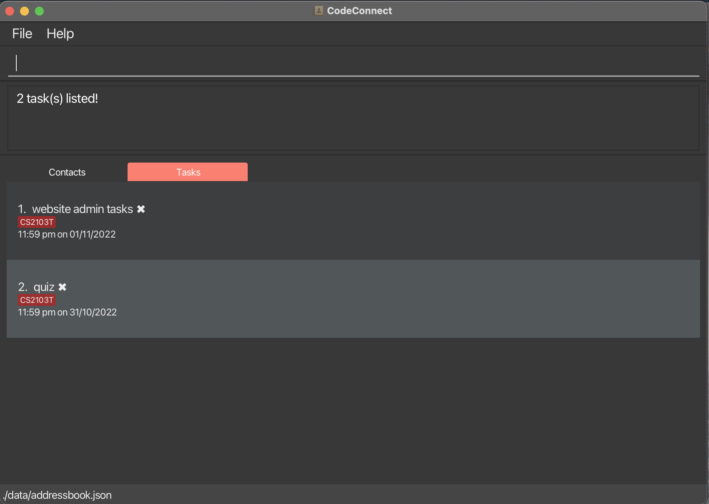

* Table of Contents
{:toc}

--------------------------------------------------------------------------------------------------------------------
## Introduction

CodeConnect is a **desktop app** specially designed for **Computer Science students from NUS**. On top of being able to
manage your **tasks and contacts** effectively, students can conveniently search for peers that are taking the same module
as them to seek help or collaboration.

This app is optimized for use via a **Command Line Interface** (CLI)
while still having the benefits of a Graphical User Interface (GUI).

## How to use this guide?

For new users, it is strongly recommended that you look through this User Guide to gain a comprehensive
understanding of CodeConnect.

However, you may also choose to head over to the relevant sections as described below:

- [Quick start](#Quick start) - To learn how to set up CodeConnect on your computer
- [Features](#features) - To learn the different features and commands used in CodeConnect
- [Command Summary](#Command summary) - To have a complete overview of all the features and their respective command.

## Quick start

1. Ensure you have Java `11` or above installed in your Computer.

2. Download the latest `CodeConnect.jar` from [here](https://github.com/AY2223S1-CS2103T-T14-2/tp/releases).

3. Copy the file to the folder you want to use as the _home folder_.

4. Double-click the file to start the app. The GUI similar to the below should appear in a few seconds. Note how the app contains some sample data. 

    

5. Type the command in the command box and press Enter to execute it. e.g. typing **`help`** and pressing Enter will open the help window. 
   Some example commands you can try:

   * **`listc`** : Lists all contacts.

   * **`add`** `Finish homework by/tomorrow 5pm m/CS2040S` : Adds a task named `Finish homework` to the Task Manager.

   * **`del`** `1` : Deletes the 1st task shown in the current list.

   * **`clear`** : Deletes all contacts.

   * **`exit`** : Exits the app.

6. Refer to the [Features](#features) below for details of all available commands.

--------------------------------------------------------------------------------------------------------------------

## Features

**:information_source: Notes about the command format:** 

* Words in `{curly_braces}` are the parameters to be supplied by the user. 
  e.g. In `addc n/{name}`, `{name}` is a parameter which can be used as `addc n/John Doe`.

* Items in square brackets are optional. 
  e.g. When [adding a contact](#adding-a-contact-addc), it is optional to tag them. Hence, the tag parameter is presented as `[t/{tag}]`

* Items with `…`​ after them can be used multiple times including zero times. 
  e.g. `[t/{tag}]…​` can be used as ` ` (i.e. 0 times), `t/friend`, `t/friend t/family` etc.

* Parameters can be in any order. 
  e.g. If the command specifies `n/{name} p/{phone_number}`, `p/{phone_number} n/{name}` is also acceptable.

* If a parameter is expected only once in the command, but you specified it multiple times, only the **last occurrence** of the parameter will be taken. 
  e.g. If you specify `p/12341234 p/56785678`, only `p/56785678` will be taken.

* Extraneous parameters for commands that do not take in parameters (such as `help`, `list`, `exit` and `clear`) will be ignored. 
  e.g. If the command specifies `help 123`, it will be interpreted as `help`.

:bulb: A Note on Indexes

Several commands below require an `index` to be specified, as they operate on a task/contact specified by the user. For example, the deletion of a particular task.
* Indexes are either `task_index` or `contact_index`
* The index always refers to the index number of the task/contact in the **currently displayed list**
* This value ranges from 1, 2, 3...

### Getting help

#### Viewing help : `help`

Format: `help`

### Managing tasks

#### Adding a task: `add`

Adds a task and its deadline to the task list. Specifying the module the task belongs to is optional.

Format:
`add {task_name} by/{deadline} [m/{module_code}]`

Examples:
* `add finish problem set 5 by/tomorrow 5pm m/CS2040S`
* `add finish SEP application by/2022-12-25 23:59`

:bulb: Deadline Formats

CodeConnect uses the [jchronic](https://github.com/samtingleff/jchronic) natural language date parser, ported from [Ruby's Chronic](https://github.com/deepin-community/ruby-chronic). This means that natural language inputs such as "tomorrow" or "next sunday" will be understood by CodeConnect!
The default time of a task will be set to 11.59pm if it is not specified in the input.

Here are some examples of what deadline formats are accepted:
* "tomorrow" will format the deadline to the next day, 11.59pm
* "tomorrow 3pm" will format it to the next day, 3.00pm
* "this tuesday 05:00" or "this tuesday 0500" will format it to the coming tuesday, 5.00am
* "may 27th" will format it to the 27th of may of the current year, 11.59pm

Due to the library's limitations, "6/4/2022" will format it to 4 June.

:bulb: Flexible Module Format

As a user, you might find yourself adding tasks that don't exactly belong to a module. For example, if you're a student applying for the Student Exchange Programme, you might have tasks like "Write Personal Statement" and "Submit Application". In this case, you could set the module field of both these tasks as `SEP` to increase searchability.

However, only alphanumeric characters are allowed! (i.e. no spaces, special characters, etc.)

#### Editing a task: `edit`

Edits the specified task.

Format:
`edit {task_index} {field_prefix}{field_description}`

Examples:
* `edit 2 n/Rewatch lecture 6` - Renames task at index 2 to "Rewatch lecture 6"
* `edit 3 m/CS2040S by/2022-12-12 23:59` - Changes the module and deadline of the task at index 3

:question: Field Prefixes

`field_prefix` can be any task field used in the [add task command](#adding-a-task-add).

#### Deleting a task: `del`

Deletes the specified task.

Format:
`del {task_index}`

Example:
`del 5`

#### Deleting all completed tasks: `clean`

Deletes all completed tasks.

Format: `clean`

:exclamation: **Caution:**

This command has similar spelling to the [clear command](#clearing-all-contacts--clear), which **deletes all contacts**.

#### Marking a task: `mark`

Marks the specified task as complete.

Format:
`mark {task_index}`

Example:
`mark 2` will mark the task with index 2 as done, as shown by a tick beside the task description.

#### Unmarking a task: `unmark`

Marks the specified task as incomplete.

Format:
`unmark {task_index}`

Example:
`unmark 3`

#### Searching for tasks: `find`

Searches for tasks by their name or module. The search is done by **matching keywords** in a **case-insensitive** manner.

Format:
`find n/{keyword}` `find m/{module}`

Examples:
* `find n/homework` returns `Science homework`, `Math homework`
* `find n/home` returns `Science homework`, `Math homework`
* `find n/tut set` returns `Tutorial 1`, `Problem set 2`
* `find m/CS1101S` returns `Problem set 4`, `Reading assignment 2`
* `find m/1101S` returns `Problem set 4`, `Reading assignment 2`

`find m/CS2103T` returns this:

#### Listing all tasks : `list`

Shows a list of all tasks.

Format: `list`  `list time`

* `list` - displays a list of all tasks in the order of most recent task added
* `list time` - displays a list of all tasks in the order of the earliest deadline

:bulb: About extraneous parameters in `list`

`list time` is the only exception to the list command ignoring extraneous parameters.
* `list abc` and `list time abc` will be both interpreted as `list`.

Click [here](#) to return to the top of the page.

### Managing contacts

#### Adding a contact: `addc`

Adds a contact to the contact list.

Format: `addc n/{name} p/{phone_number} [e/{email}] [a/{address}] [t/{tag_1}]... [m/{module}...] [gh/{github}] [tele/{telegram}]`

Examples:
* `addc n/Bob Martin p/98765432 e/bobbymartini@gmail.com m/CS1101S CS1231S gh/bobby tele/bmartin`
* `addc n/Betsy Crowe p/89985432 tele/croweybetty`

:bulb: Tags and Modules

Every tag must begin with a tag prefix `t/`. If you would like to add multiple tags, enter `t/tag_1 t/tag2 ...`.

Modules, however, may be entered as **space separated**. For example, `m/MOD1 MOD2 MOD3` will correctly assign 3 modules to the contact.

#### Listing all contacts : `listc`

Shows a list of all contacts.

Format: `listc`

#### Deleting a contact : `delc`

Deletes the specified contact.

Format: `delc {contact_index}`

Examples:
* `delc 2` - deletes the contact at index 2 in the contact list.

#### Editing a contact : `editc`

Edits the specified contact.

Format: `editc {contact_index} {field prefix}{field description}`

Examples:
* `editc 4 gh/alicey` - edits the Github profile of the contact at index 4 in the contact list to `alicey`

:question: Field Prefixes

`field_prefix` can be any contact field used in the [add contact command](#adding-a-contact-addc).

#### Searching for contacts: `findc`

Finds contacts whose names contain any of the given keywords, or contacts who take a particular module.

Format:
`findc n/{name}` `findc m/{module}` `findc ts/{task_index}`

Examples:
* `findc n/John` returns `john`, `John Doe`
* `findc n/jo` returns `john`, `John Doe`
* `findc n/jo ja` returns `john`, `james`
* `findc m/CS1231S` returns `Alex Yeoh`, `David Li`
* `findc m/1231` returns `Alex Yeoh`, `David Li`
* `findc ts/2` returns contacts that are taking the module that the task at index 2 belongs to

#### Quick-search for contacts: `saveme`

Finds contacts that can help with the task at the first index of the task list.

Example:
1. The task at **index 1** belongs to the `CS1101S` module.
2. Entering `saveme` will display all contacts that take the `CS1101S` module.

:question: What if I need help with a task that isn't index 1?

There's a command for that! See [finding contacts](#searching-for-contacts-findc).

#### Clearing all contacts : `clear`

Deletes all contacts.

Format: `clear`

:exclamation: Warning! 
Deleted contacts are **unrecoverable**!

Click [here](#) to return to the top of the page.

### Finishing up

#### Exiting the program : `exit`

Exits the program.

Format: `exit`

### Saving the data

CodeConnect data are saved in the hard disk automatically after any command that changes the data. There is no need to save manually.

### Editing the data file

CodeConnect data are saved as a JSON file `[JAR file location]/data/codeconnect.json`. Advanced users are welcome to update data directly by editing that data file.

:exclamation: **Caution:**
If your changes to the data file makes its format invalid, CodeConnect will discard all data and start with an empty data file at the next run.

--------------------------------------------------------------------------------------------------------------------

## FAQ

**Q**: How do I transfer my data to another Computer? 
**A**: Install the app in the other computer and overwrite the empty data file it creates with the file that contains the data of your previous CodeConnect home folder.

**Q**: Why does CodeConnect switch between the task list and contact list? 
**A**: For a smoother user experience, CodeConnect automatically switches to the list that is associated with the previous command type (task or contact command). You can also switch list views manually by clicking the tabs above the lists.

--------------------------------------------------------------------------------------------------------------------

## Command summary

| Action                     | Format, Examples                                                                                                                                                                                              |
|----------------------------|---------------------------------------------------------------------------------------------------------------------------------------------------------------------------------------------------------------|
| **Help**                   | `help`                                                                                                                                                                                                        |
| **Add task**               | `add {task_name} by/{deadline} [m/{module_code}]`   e.g. `add finish problem set 5 by/next week sunday m/CS2040S`                                                                                          |
| **Edit task**              | `edit {task_index} {field prefix}{field description}`   e.g. `edit 2 by/2022-12-12 23:59`                                                                                                                  |
| **Delete task**            | `del {task_index}`   e.g. `del 5`                                                                                                                                                                          |
| **Delete completed tasks** | `clean`                                                                                                                                                                                                       |
| **Mark task**              | `mark {task_index}`   e.g. `mark 3`                                                                                                                                                                        |
| **Unmark task**            | `unmark {task_index}`   e.g. `unmark 3`                                                                                                                                                                    |
| **Find tasks**             | `find n/{task}`   `find m/{module}`  e.g., `find n/homework`,   `find m/CS1101S`                                                                                                                     |
| **List tasks**             | `list` / `list time`                                                                                                                                                                                          |
| **Add contact**            | `addc n/{name} p/{phone_number} [e/{email}] [a/{address}] [t/{tag}]... [m/{module}...] [gh/{github}] [tele/{telegram}]`   e.g., `addc n/Bob Martin p/98765432 tele/bobmartin00 m/CS1101S CS1231S t/friend` |
| **List contacts**          | `listc`                                                                                                                                                                                                       |
| **Delete contact**         | `delc {contact_index}`  e.g., `delc 3`                                                                                                                                                                     |
| **Edit contact**           | `editc {contact_index} {field prefix + field description}`   e.g. `editc 2 p/91919100`                                                                                                                     |
| **Find contacts**          | `findc n/{name}`   `findc m/{module}`  `findc ts/{task_index}`   e.g., `findc n/John`, `findc m/CS1231S`, `findc ts/3`                                                                               |
| **Quick contact search**   | `saveme`                                                                                                                                                                                                      |
| **Clear contacts**         | `clear`                                                                                                                                                                                                       |

## List of Prefixes

| Field    | Prefix  |
|----------|---------|
| Name     | `n/`    |
| Phone    | `p/`    |
| Email    | `e/`    |
| Address  | `a/`    |
| Tag      | `t/`    |
| Module   | `m/`    |
| GitHub   | `gh/`   |
| Telegram | `tele/` |
| Task     | `ts/`   |
| Deadline | `by/`   |

Click [here](#) to return to the top of the page.
