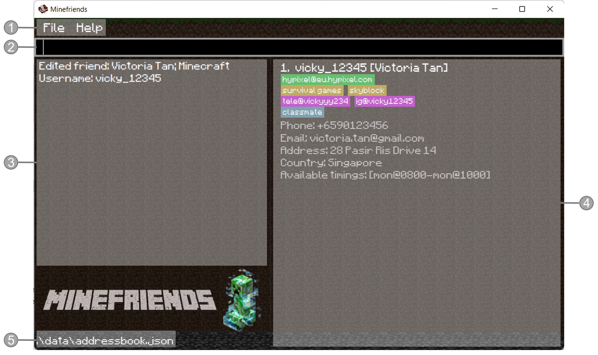
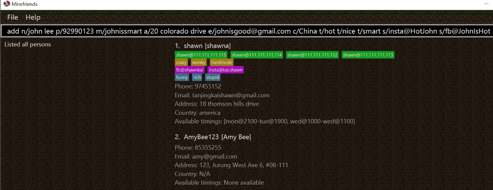
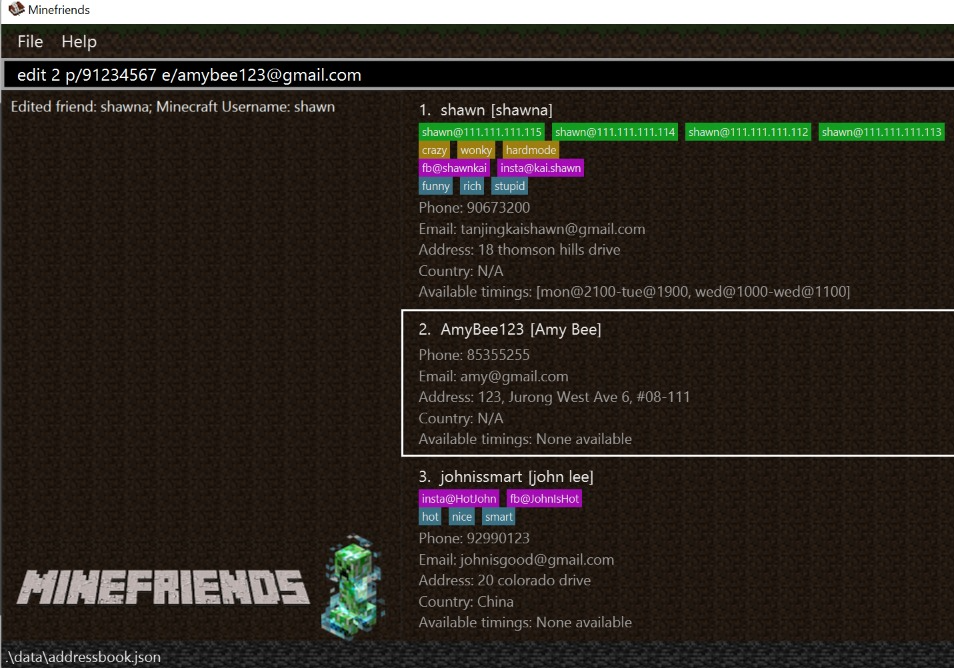
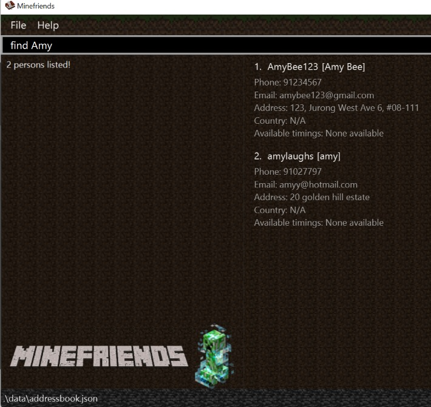
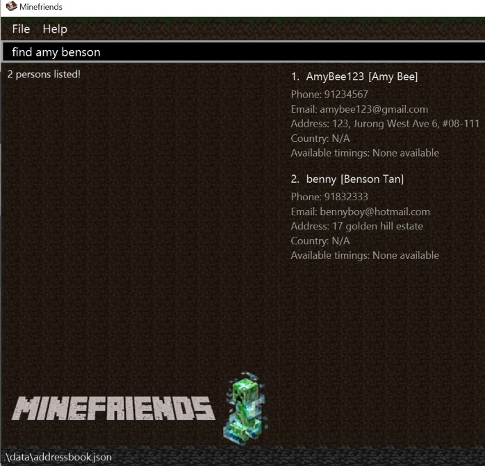

Before we begin, it is important to note that:
* Minefriends is not affiliated with Minecraft, Mojang Studios or Microsoft in any way.
* Minefriends is an independently developed software. It is not a product owned by Mojang Studios or Microsoft.
* Team Minefriends do not own Minecraft, in whole or in part.

Ever asked your friends to play Minecraft together only to be blue-ticked? Well, Minefriends is here for you. 
Minefriends is an address book for you to find friends to play Minecraft multiplayer with,
at the right time, with the right game modes and on the right servers.

This user guide will help you get started with Minefriends and get to know what it can do for you. 
The guide is meant for Minecraft players who are familiar with the game and how multiplayer in Minecraft works.
No other technical knowledge is required.

### How to read this guide

* Text in [blue](#how-to-read-this-guide) are links. You can click on them to navigate to different parts of the guide.
* Text in **bold** are used to place emphasis on certain things. They are noteworthy and important.
* Text in `this` are related to commands and names of things (proper nouns) in Minefriends.
* Tables are used to provide better organisation of command syntax for easy understanding.

* Text in a blue box is used to give important additional information about an aspect of Minefriends.

### Table of contents
To navigate to see a particular command, you can click on the link in blue.
* [Getting started](#getting-started)
* [User interface breakdown](#user-interface-breakdown)
* [Managing your Minecraft friends](#managing-your-minecraft-friends)
  * [help](#viewing-help-help)
  * [add](#adding-a-friend-add)
  * [list](#listing-all-friends-list)
  * [edit](#editing-a-friends-information-edit)
  * [find](#locating-friends-by-name-find)
  * [suggest](#suggest-me-a-friend-suggest)
  * [delete](#deleting-a-friend-delete)
  * [clear](#clearing-all-entries-clear)
  * [exit](#exiting-the-program-exit)
* [Other features](#other-features)
  * [autocomplete](#autocomplete)
  * [saving](#saving-the-data)
* [FAQ](#faq)
* [Summary of commands](#command-summary)

--------------------------------------------------------------------------------------------------------------------

## Getting started

1. Ensure you have Java `11` or above installed in your Computer.
2. Download the latest `minefriends.jar` [here](https://github.com/AY2223S1-CS2103T-T10-4/tp/releases/tag/v1.3).
3. Create a folder called `Minefriends`.
4. Put the `minefriends.jar` file inside the folder.
5. Double-click the file to start the app. A window similar to the one below should appear in a few seconds.  
   

The window is empty because no friends have been added yet. Adding more friends will change the look of the window.

<ol start="5">
6. Type the command in the [command box](#user-interface-breakdown) and press Enter to execute it. e.g. typing **`help`** and pressing Enter will open the help window. 
</ol>
Some sample commands you can try out:

   * **`list`** : Lists all of your friends.
   * **`add`**`n/Victoria Tan m/vicky12345 p/85355255 e/vic@gmail.com a/123, Jurong West Ave 6, #08-111` :  
   Adds a friend named `Victoria Tan` to your friend list.
   * **`delete`**`3` : Deletes the 3rd friend shown in your current friend list.
   
Refer to the [Managing your Minecraft friends](#managing-your-minecraft-friends) below for details of each command.

--------------------------------------------------------------------------------------------------------------------

## User interface breakdown

1. **Topbar**. You can find access the help screen here.
2. **Command box**. You can type in your commands here.
3. **Command result display** You can see the results of your command execution here.
4. **List of friends** You can see all your Minecraft listed here.
5. **Data file name** You can see where the data is being loaded from.

--------------------------------------------------------------------------------------------------------------------

## Managing your Minecraft friends

**Command format legend:** 

* You need to replace the `UPPER_CASE` fields with your desired words. 
  e.g. in `add n/NAME m/MINECRAFT_NAME`, you can replace `NAME` and `MINECRAFT_NAME` with names of your choice.  
  `add n/Amy Bee m/amybee123` is an example of a valid command.

* Items in square brackets are optional and can be left out. 
  e.g. `n/NAME [t/TAG]` can be used as `n/Amy Bee t/friend` or as `n/Amy Bee`.

* For items with a `*`, you can provide more than one of such item. 
  e.g. `n/NAME [t/TAG]*` can be used as `n/Amy Bee`, `n/Amy Bee t/friend` or `n/Amy Bee t/friend t/bestie`.

* The words you give can be in any order. 
  e.g. if the command specifies the fields to be in the order`n/NAME p/PHONE_NUMBER`, 
  arranging them in an alternative order such as `p/PHONE_NUMBER n/NAME` is also acceptable.

* Extra words for standalone commands (such as `help`, `list`, `exit` and `clear`) will be ignored. 
  e.g. if the command specifies `help 123`, it will be interpreted as `help`.

### Viewing help: `help`

Format: `help`

In the `Help` window, upon choosing a specific command, a description,
and an example will be shown for that specific command along with the
specific parameters for that command.

Example: 
Upon typing `help` or clicking on the `help` option, a help window
as such will appear:

You can choose a specific command by clicking on the drop-down menu in order to view the
to view the information for that command.

### Adding a friend: `add`
Format (fields in `[ ]` are optional, `*` indicates multiple entry): `add n/NAME m/MINECRAFT_NAME [p/PHONE_NUMBER] [e/EMAIL] [a/ADDRESS]
[c/COUNTRY] [ms/MINECRAFT_SERVER]* [s/SOCIAL_HANDLES]* [t/TAG]* [gt/GAME_TYPE]* [ti/TIME_INTERVAL]*`

This command allows you to add a person to your friend list.

#### Details of each field:

The following table lists all the fields that you can include when you add your friends,
as well as provide you with additional information for your understanding. 

| Field | Command | Status | Explanation                                                                                                                                                                                                                                                                                                                                                                                                                                                                                                                                                                                   | 
| ----- | --- | --- |-----------------------------------------------------------------------------------------------------------------------------------------------------------------------------------------------------------------------------------------------------------------------------------------------------------------------------------------------------------------------------------------------------------------------------------------------------------------------------------------------------------------------------------------------------------------------------------------------|
| Name | `n/NAME` | **Compulsory** | Name of your friend                                                                                                                                                                                                                                                                                                                                                                                                                                                                                                                                                                           | 
| Minecraft name | `m/MINECRAFT_NAME` | **Compulsory, Unique** | In-game username of your friend. Minecraft usernames cannot contain spaces. Minecraft usernames are used to identify your friends uniquely in Minefriends (and Minecraft too), so they must be unique.    
  If you type in `add n/John Doe` without the friend's Minecraft name, there will be an error thrown. Similarly, if you type in `add m/johndoe123` without the friend's name, there will be an error thrown. 
                                                                                                            |
| Phone Number | `[p/PHONE_NUMBER]` | **Optional** | Contact number of your friend.                                                                                                                                                                                                                                                                                                                                                                                                                                                                                                                                                                |
| Email | `[e/EMAIL]` | **Optional** | Email address of your friend                                                                                                                                                                                                                                                                                                                                                                                                                                                                                                                                                                  |
| Address | `[a/ADDRESS]` | **Optional** | Physical address of your friend                                                                                                                                                                                                                                                                                                                                                                                                                                                                                                                                                               |   
| Country | `[c/COUNTRY]` | **Optional** | The country in which your friend resides in.    There should **not** be any numbers in the country                                                                                                                                                                                                                                                                                                                                                                                                                                                                                      |
 | Minecraft server | `[ms/MINECRAFT_SERVER]*` | **Optional, Multiple** | The minecraft servers that your friend plays on.    Minecraft servers are in the format of `ServerName@ServerAddress`.                                                                                                                                                                                                                                                                                                                                                                                                                                                                  |
| Social Handle | `[s/SOCIAL]*` | **Optional, Multiple** | The social media handles of your friend, such as their Instagram username, Telegram handle etc.    Social handles are in the format of `SocialMedia@Username`.                                                                                                                                                                                                                                                                                                                                                                                                                          |
| Game Type | `[gt/GAME_TYPE]*` | **Optional, Multiple** | Game types refer to the different ways to play multiplayer Minecraft.     They can be anything, such as `survival games`, `skyblock` or `creative`.                                                                                                                                                                                                                                                                                                                                                                                                                                     |
| Tag | `[t/TAG]*` | **Optional, Multiple** | Tags are used to provide additional information about your friend.    They can be anything, as long as there is no spaces.                                                                                                                                                                                                                                                                                                                                                                                                                                                              |
| Time Interval | `[ti/TIME_INTERVAL]*` | **Optional, Multiple** | This refers to the timings in which your friend is available.    Time interval comes in the format `day@hhmm-day@hhmm`, such as `mon@2100-mon@2300`, with the hours and minutes in 24-hour format. The first date-time being the start and the second date-time being the end of their availability period. `day` can be `mon`, `tue`, `wed`, `thu`, `fri`, `sat` or `sun` only.    If the start and end time interval for a friend are the same, it is treated as one point in time at that exact moment. To indicate availability across the whole week, use `mon@0000-sun@2359`. |

**Important note:**

If more than one of the non-multiple fields are provided 
eg. `add m/vicky n/Victor n/Victoria` 
only the last one `Victoria` will be taken.

#### Examples:

##### Adding with a few fields
* Before adding `add n/Amy Bee m/AmyBee123 p/85355255 e/amy@gmail.com a/123, Jurong West Ave 6, #08-111`

 
 
 

* After adding `add n/Amy Bee m/AmyBee123 p/85355255 e/amy@gmail.com a/123, Jurong West Ave 6, #08-111`

 
 
 
##### Adding with several optional fields

* Before adding `add n/john lee p/92990123 m/johnissmart a/20 colorado drive 
e/johnisgood@gmail.com c/China t/hot t/nice t/smart s/insta@HotJohn s/fb@JohnIsHot`

 
 
 

* After adding `add n/john lee p/92990123 m/johnissmart a/20 colorado drive
e/johnisgood@gmail.com c/China t/hot t/nice t/smart s/insta@HotJohn s/fb@JohnIsHot`

 
 
 

### Editing a friend's information: `edit`
Format: `edit INDEX [n/NAME] [m/MINECRAFT_NAME] [p/PHONE_NUMBER] [e/EMAIL] [a/ADDRESS]
[c/COUNTRY] [ms/MINECRAFT_SERVER]* [s/SOCIAL_HANDLES]* [t/TAG]* [gt/GAME_TYPE]* [ti/TIME_INTERVAL]*`  

If you want to change an existing attribute of a friend, or fill in optional attributes that were not provided during the `add` process, 
you can use the `edit` command to easily change that. 

The following explains what you should do to edit a particular person.
* Edits the person at the specified `INDEX`. The index refers to the index number shown in your displayed friend list. The index **must be a positive integer** 1, 2, 3, …​
* At least one field must be provided for editing.
* Existing values will be updated to the input values.
* You should not write an **invalid** index.                                           
  * If you have three friends in your friend list, `edit 4 ...` will result in an error. 

**Important Note:**

* Editing a field with multiple entries will **overwrite all existing values of that field**. 
  e.g. `edit 1 t/amiga` will remove all existing tag of the first person and replace them with only `amiga`

* For fields with multiple entries, you can remove all the person’s information in that field by typing the prefix (eg: `t/`) without
including any information after the prefix.

#### Examples:

##### Editing only single-entry fields
Command: `edit 2 p/91234567 e/amybee123@gmail.com` 

Edits the phone number and email address of the 2nd person in the list 
to be `91234567` and `amybee123@gmail.com` respectively. 

Before editing

 
 
 
After editing

##### Editing both single-entry and multi-entry fields
Command: `edit 2 n/Amy Bee t/` 

Edits the name of the 2nd person in the list to be `Amy Bee` 
and clears all existing tags.

Before editing

 
 
 
After editing

### Deleting a friend: `delete`
Format: `delete INDEX` 

You can remove a specified friend from your friend list.

* Deletes the friend at the specified `INDEX` of your friend list.
* The index **must be a positive integer** 1, 2, 3, …
* You should not write an **invalid** index.
  * If you have three friends in your friend list, `delete 4` will result in an error.

Example:
* `list` followed by `delete 2` deletes the 2nd friend in your friend list. 

Before delete

After delete

### Locating friends by name: `find`
Format: `find KEYWORD [MORE_KEYWORDS]` 

Finds friends whose names contain any of the given keywords.
You can use this command if you remember their names. Otherwise, the [suggest](#suggest-me-a-friend-suggest)
command is a better option.

* The search is case-insensitive. (e.g. `amy` will match `Amy`) 
 
Example:  
`find Amy` returns `amy` and `Amy Bee`

* The order of the keywords does not matter. e.g. `Amy Bee` will match `Bee Amy`.
* You can only search for someone's **name**.
* Only **full words** will be matched. (e.g. `Am` will not match `Amy`)

* Persons matching at least one keyword will be returned
  (e.g. `Amy Tan` will return `Amy Bee`, `Benson Tan`)
         
Example: 
`find amy benson` returns `Amy Bee` and `Benson Tan` 

### Suggest me a friend: `suggest`

Suggest friends to play with given a set of constraints.
This command is very versatile. You can find friends based on any attribute of them, including
their availble timings to play.

Format: `suggest [dt/DAY_TIME_IN_WEEK]* [k/KEYWORD]*`

* At least one instance of either `DAY_TIME_IN_WEEK` or `KEYWORD` must be provided
* The search is case-insensitive (e.g. `amy` will match `Amy`)
* Keywords do not need to be in full (e.g. `just` will match `Justin`)
* The order of the keywords does not matter
* The `Keyword` will be matched against **all** attributes of a friend (eg. Name, Minecraft Name, Address etc.)
* As long as some attribute of a friend contains the `Keyword`, the `Keyword` is considered to have a valid match
* All `Keyword` must be matched, but only 1 `DayTimeInWeek` needs to be matched
* If you wish to find a friend playing at the same time as you, you can type in `suggest dt/now`

 

When you type in `suggest dt/now`, Minefriends uses the current time shown on your computer/device
to search for friends playing at that current time.

Examples:

`suggest dt/tue@2125 dt/sat@1200 k/Victoria k/Vicky` 
will return friends subjected to **all** of the following conditions:
1. Is available at either Tuesday 9:25pm or Saturday 12:00pm
2. Attributes contain the `Keyword` `Victoria` (ignore case)
3. Attributes contain the `Keyword` `Vicky` (ignore case)

* A friend with name `Victoria Tan` and Minecraft name `vicky12345`, who is available from Tuesday 7pm to 11pm
will be matched
* A friend with name `Victoria Tan` but no other attributes containing `Vicky` will not be matched
* A friend with name `Victoria Tan` and Minecraft name `vicky12345`, who is only available from Sunday 1pm to 6pm
will also not be matched

`suggest k/Victoria`
will return friends subjected to the only condition:
1. Attributes contain the `Keyword` `Victoria` (ignore case)

`suggest dt/tue@2125`
will return friends subjected to the only condition:
1. Is available at Tuesday 9:25pm

If you type `suggest dt/now` on Sunday 8:00pm, you will return friends subjected to the only condition:
1. Is available at Sunday 8:00pm

### Listing all friends: `list`
Format: `list` 

Shows a list of all of your Minecraft friends. This command
should be run after a `suggest` or `find` to list out all your friends.

Example:

### Clearing all entries: `clear`

Clears all entries from your friend list.

Format: `clear`

### Exiting the program: `exit`

Exits the program.

Format: `exit`

## Other features

### Autocomplete

Minefriends supports autocomplete for all commands. Simply press the `TAB` or `ENTER` key to autocomplete the command.

The following picture shows the autocomplete feature in action:

In order to navigate the list of autocomplete suggestions, you can either use the `UP` and `DOWN` arrow keys,
or simply click on the desired suggestion.

### Saving the data

Minefriends data are saved in the hard disk automatically after any 
command that changes the data. There is no need to save manually.

--------------------------------------------------------------------------------------------------------------------

## FAQ

**Q: How do I transfer my Minefriends data to another Computer?**  

**A**: 
Install the app in the other computer and overwrite the empty data file it creates with the file that
contains the data of your previous Minefriends home folder.

**Q: What is the recommended window size?**  

**A**:
The recommended window size is 1280 x 720 pixels, anything smaller may cause the UI to be distorted.

**Q: How long can the parameters be?**  

**A**:
As long as you want, however please note that the UI will be distorted if these parameters are too long.

**Q: Why do I need to press `Enter` twice to input the command?**  

**A**:
Unfortunately, this is a limitation of JavaFX. 
The first `Enter` key press will trigger the autocomplete feature, 
the second `Enter` key press will execute the command.

--------------------------------------------------------------------------------------------------------------------

## Command summary

| Action      | Format                                                                                                                                                                          | Examples                                                                                  |
|-------------|---------------------------------------------------------------------------------------------------------------------------------------------------------------------------------|-------------------------------------------------------------------------------------------|
| **Add**     | `add n/NAME m/MINECRAFT_NAME [p/PHONE_NUMBER] [e/EMAIL] [a/ADDRESS] [c/COUNTRY] [ms/MINECRAFT_SERVER]* [s/SOCIAL_HANDLES]* [t/TAG]* [gt/GAME_TYPE]* [ti/TIME_INTERVAL]*`        | `add n/Benson m/benson01 p/92881083 e/bensontan@hotmail.com a/ 4 Leith road s/ig@bensontan01 t/bff` |
| **List**    | `list`                                                                                                                                                                          |                                                                                           |    
| **Edit**    | `edit INDEX [n/NAME] [m/MINECRAFT_NAME] [p/PHONE_NUMBER] [e/EMAIL] [a/ADDRESS] [c/COUNTRY] [ms/MINECRAFT_SERVER]* [s/SOCIAL_HANDLES]* [t/TAG]* [gt/GAME_TYPE]* [ti/TIME_INTERVAL]*` | `edit 2 n/Amy Bee t/`                                                                     |                                                                                                                                                                         |
| **Find**    | `find KEYWORD [MORE_KEYWORDS]*`                                                                                                                  |`find Amy Benson`                                                                          |
| **Delete**  | `delete INDEX`                                                                                                                                         |`delete 3`                                                                                 |
| **Suggest** | `suggest [dt/DAY_TIME_IN_WEEK]* [k/KEYWORD]*`                                                              |`suggest dt/tue@2125 dt/sat@1200 k/Victoria k/Vicky`                                                                                          |
| **Clear**   | `clear`                                                                                                                                                                         |                                                                                           |
| **Exit**    | `exit`                                                                                                                                                                          |                                                                                           |
| **Help**    | `help`                                                                                                                                                                          |                                                                                           |
