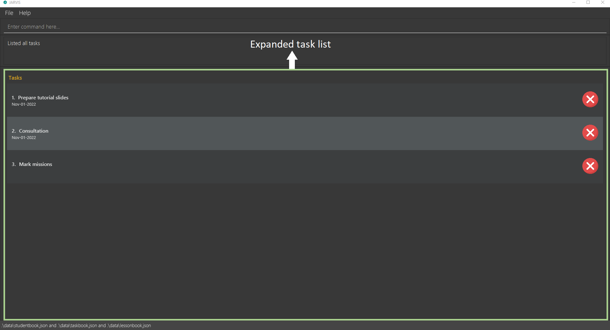
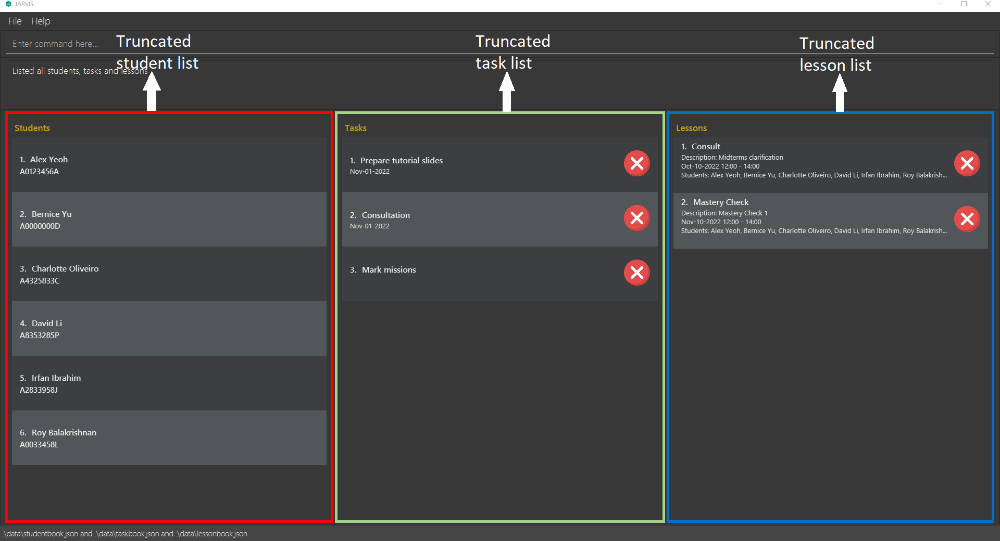
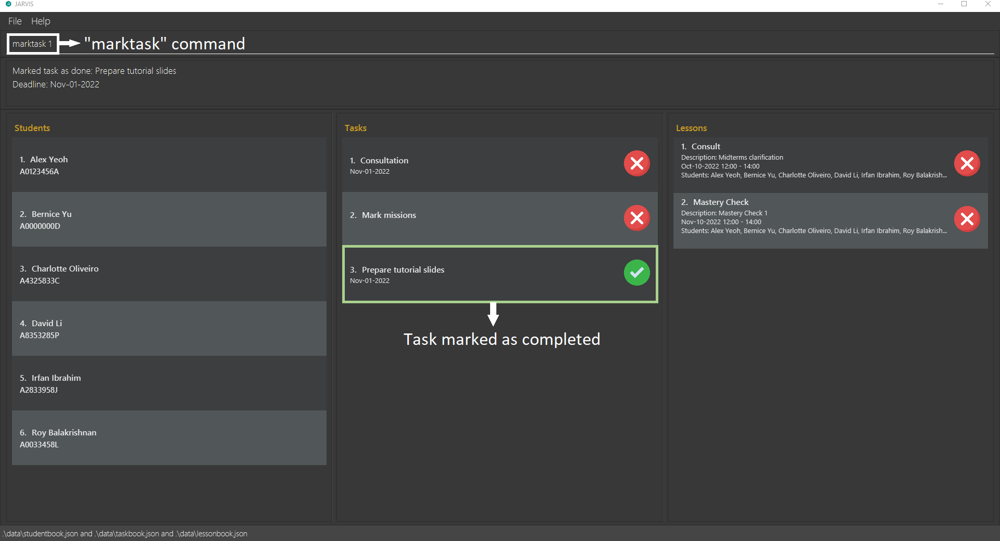
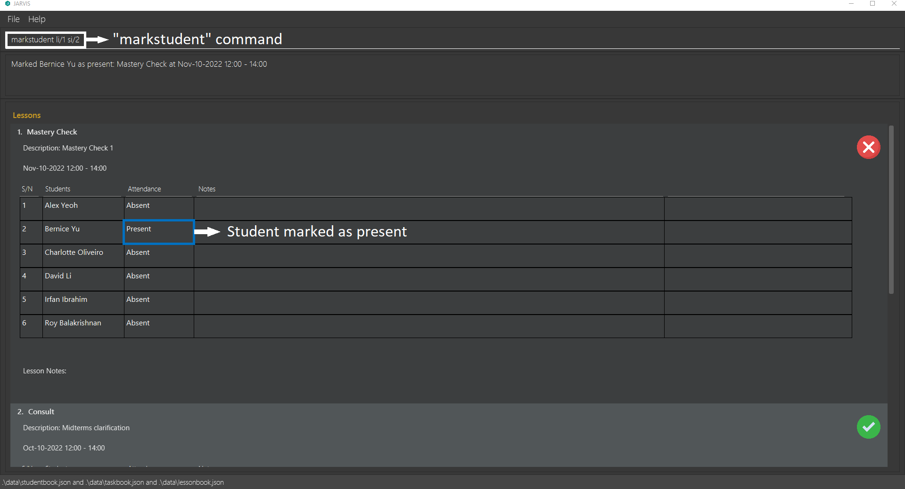

JARVIS is a **desktop app for a CS1101S Teaching Assistant to manage students, tasks and lessons, optimized for use via a Command Line Interface** (CLI) while still having the benefits of a Graphical User Interface (GUI). If you can type fast, JARVIS can help you manage teaching your class efficiently and effectively.

* Table of Contents
{:toc}

--------------------------------------------------------------------------------------------------------------------

## Quick start

1. Ensure you have Java `11` or above installed in your Computer.

1. Download the latest `JARVIS.jar` from [here](https://github.com/AY2223S1-CS2103T-T11-3/tp/releases).

1. Copy the file to the folder you want to use as the _home folder_ for JARVIS.

1. Double-click the file to start the app. The GUI similar to the below should appear in a few seconds. Note how the app contains some sample data. 
   

1. Type the command in the command box and press Enter to execute it. e.g. typing **`help`** and pressing Enter will open the help window. 
   Some example commands you can try:

   * **`liststudent`** : Shows an expanded list of all students.

   * **`addstudent s/John Doe m/A0123459G`** : Adds a student named `John Doe` with matriculation (matric) number `A0123459G` to JARVIS.

   * **`deletestudent 3`** : Deletes the 3rd student shown in the student list.

   * **`clear`** : Deletes all students, tasks and lessons.

   * **`exit`** : Exits the app.

1. Refer to the [Basic features](#basic features) below to get started with the basic commands.

--------------------------------------------------------------------------------------------------------------------

## Command format

**:information_source: Notes about the command format:** 

* Words in `UPPER_CASE` are the parameters to be supplied by the user. 
  e.g. in `addstudent s/STUDENT_NAME m/MATRIC_NUM`, `STUDENT_NAME` and `MATRIC_NUM` are parameters which can be used as `addstudent s/John Doe m/A0123459G`.

* Items in square brackets are optional. 
  e.g. `t/TASK_DESC [d/DEADLINE]` can be used as `t/Mark quest 2 d/2022-11-01` or as `t/Mark quest 2`.

* Parameters can be in any order. 
  e.g. if the command specifies `t/TASK_DESC d/DEADLINE`, `d/DEADLINE t/TASK_DESC` is also acceptable.

* If a parameter is expected multiple times in the command such as student index in adding a consult lesson, all occurrences of the parameter will be considered.  
  e.g. if you specify `si/1 si/2` in a command expecting multiple `si/` parameters, both `si/1` and `si/2` will be considered.

* If a parameter is expected only once in the command, but you specified it multiple times, only the last occurrence of the parameter will be taken. 
  e.g. if you specify `s/John Tan s/Sally Yeoh`, only `s/Sally Yeoh` will be taken.

* Extraneous parameters for commands that do not take in parameters (such as `help`, `listall`, `exit` and `clear`) will be ignored. 
  e.g. if the command specifies `help 123`, it will be interpreted as `help`.

## Basic features
This section contains basic features of JARVIS.

### Viewing help : `help`

Shows a message explaining how to access the help page.

Format: `help`

### Listing all students : `liststudent`

Shows an expanded list of all students.

Format: `liststudent`

* Additional information such as grades for each student will be displayed.

### Listing all tasks : `listtask`

Shows an expanded list of all tasks.

Format: `listtask`

### Listing all students : `listlesson`

Shows an expanded list of all lessons.

Format: `listlesson`

* Additional information such as student participation and notes for each lesson will be displayed.

### Listing all students, tasks and lessons : `listall`

Shows the truncated lists of students, tasks and lessons.

Format: `listall`

* The three lists will be arranged in the order: students, tasks, lessons.
* Additional information will be hidden to provide an overview of all three lists.

### Clearing all entries : `clear`

Clears all students, tasks and lessons from JARVIS.

Format: `clear`

:exclamation: **Caution:**
This action is irreversible! Please think twice before you use this command!

### Exiting the program : `exit`

Exits the program.

Format: `exit`

## Student features
This section contains features for managing students.

### Adding a student: `addstudent`

Adds a student to JARVIS.

Format: `addstudent s/NAME m/MATRIC_NUM`

* `m/MATRIC_NUM` must start with 'A', followed by 7 digits and a capital letter.
* A maximum of 10 students can exist in the student list at any point in time. The user will not be allowed to add more students after reaching the limit of 10 students.

Examples:
* `addstudent s/John Doe m/A0123459G` adds a student named `John Doe` with matric number `A0123459G` to your student list.
* `addstudent s/Alex Yeoh m/A0123456A` adds a student named `Alex Yeoh` with matric number `A0123456A` to your student list. 

### Deleting a student : `deletestudent`

Deletes a student from the student list.

Format: `deletestudent INDEX`

* `INDEX` refer to the index number shown in the student list.
* `INDEX` **must be a positive integer** 1, 2, 3, …​

Examples:
* `deletestudent 2` deletes the 2nd student shown in your student list.

### Editing a student : `editstudent`

Edits an existing student in JARVIS.

Format: `editstudent INDEX [s/NAME] [m/MATRIC_NUM]`

* Edits the student at the specified `INDEX`. The index refers to the index number shown in the displayed student list.
* `INDEX` **must be a positive integer** 1, 2, 3, …​
* At least one of the optional fields must be provided.
* Existing values will be updated to the input values.

Examples:
* `editstudent 1 s/John Do` edits the name of the 1st student in your student list to be `John Do`. The matric number of the 1st student will remain the same.
* `editstudent 2 s/Alex Li m/A1234567Z` edits the name of the 2nd student in your student list to be `Alex Li` and matric number to be `A1234567Z`.

### Locating students by name: `findstudent`

Finds students whose names contain any of the given keywords.

Format: `findstudent KEYWORD [MORE_KEYWORDS]`

* The search is case-insensitive. e.g. `hans` will match `Hans`.
* The order of the keywords does not matter. e.g. `Hans Bo` will match `Bo Hans`.
* Only the name is searched.
* Only full words will be matched e.g. `Han` will not match `Hans`.
* Students matching at least one keyword will be returned (i.e. `OR` search)
  e.g. `Hans Bo` will return `Hans Gruber`, `Bo Yang`

Examples:
* `findstudent yeoh` returns `Alex Yeoh` and `Yeoh Hern Yu` in the sample student list you start with. 

### Adding grades to a student : `grade`

Adds grades to a student.

Format: `grade INDEX [ra1/MARKS] [ra2/MARKS] [mt/MARKS] [pa/MARKS] [fn/MARKS]`

* Add grades to the student at the specified `INDEX`. The index refers to the index number shown in the displayed student list.
* `INDEX` **must be a positive integer** 1, 2, 3, …​
* `ra1/MARKS` is optional, if specified will record a grade for RA1 (Reading Assessment 1).
* `ra2/MARKS` is optional, if specified will record a grade for RA2 (Reading Assessment 2).
* `mt/MARKS` is optional, if specified will record a grade for Midterm.
* `pa/MARKS` is optional, if specified will record a grade for Practical Assessment.
* `fn/MARKS` is optional, if specified will record a grade for Final Assessment.
* At least one of the optional fields must be provided.

Examples:
* `grade 1 ra1/17 mt/55` add to the grades for the 1st student in your student list: 17 marks for RA1 and 55 marks for midterms. 

### Setting mastery check result for a student : `mc`

Sets mastery check result for a student.

Format: `mc INDEX num/MC_NUM r/MC_RESULT`

* Sets mastery check result for the student at the specified `INDEX`. The index refers to the index number shown in the displayed student list.
* `INDEX` **must be a positive integer** 1, 2, 3, …​
* `MC_NUM` must be 1 or 2.
* `MC_RESULT` must be "pass" or "fail".
* `MC_RESULT` is not case-sensitive.

Examples:
* `mc 1 num/1 r/pass` sets the mastery check result for the 1st student in your student list to `PASS`.

## Task features
This section contains features for managing tasks.

### Adding a task: `addtask`

Adds a task to JARVIS.

Format: `addtask t/TASK_DESC [d/DEADLINE]`

* `d/DEADLINE` is optional, if specified will indicate a deadline for the task.
* `d/DEADLINE` should be in the format `yyyy-MM-dd`

Examples:
* `addtask t/Prepare tutorial slides d/2022-11-01` adds a task with description `Prepare tutorial slides` and deadline of `Nov-11-2022` to your task list.
* `addtask t/Mark missions` adds a task with description `Mark missions` with no deadline to your task list.

### Deleting a task : `deletetask`

Deletes a task from the task list.

Format: `deletetask INDEX`

* `INDEX` refer to the index number shown in the task list.
* `INDEX` **must be a positive integer** 1, 2, 3, …​

Examples:
* `deletetask 2` deletes the 2nd task in your task list.

### Marking a task as done : `marktask`

Marks a task as done.

Format: `marktask INDEX`

* `INDEX` refers to the index number shown in the displayed list of tasks.
* `INDEX` **must be a positive integer** 1, 2, 3, …​

Example:
* `marktask 2` marks the 2nd task in your task list as done.

### Marking a task as not done : `unmarktask`

Marks a task as not done.

Format: `unmarktask INDEX`

* `INDEX` refers to the index number shown in the displayed list of tasks.
* `INDEX` **must be a positive integer** 1, 2, 3, …​

Example:
* `unmarktask 2` marks the 2nd task in your task list as not done.

## Lesson features
This section contains features for managing lessons.

### Adding a studio lesson: `addstudio`

Adds a studio lesson to JARVIS.

Format: `addstudio [l/LESSON_DESC] sd/START_DATE st/START_TIME [ed/END_DATE] et/END_TIME`

* `l/LESSON_DESC` is optional
* `sd/START_DATE` and `ed/END_DATE` should be in the format `yyyy-MM-dd`.
* `st/START_TIME` and `et/END_TIME` should be in the format `hh:mm`.
* `ed/END_DATE` is optional, if unspecified `END_DATE` will be assumed to be the same as `START_DATE`

Examples:
* `addstudio l/Studio 3 sd/2022-10-12 st/14:00 et/16:00` adds a studio lesson with description `Studio 3` on `Oct-12-2022` from `14:00` to `16:00`.

### Adding a consult lesson: `addconsult`

Adds a consult lesson to JARVIS.

Format: `addconsult [l/LESSON_DESC] sd/START_DATE st/START_TIME [ed/END_DATE] et/END_TIME si/STUDENT_INDEX...`
  
* `l/LESSON_DESC` is optional
* `sd/START_DATE` and `ed/END_DATE` should be in the format `yyyy-MM-dd`.
* `st/START_TIME` and `et/END_TIME` should be in the format `hh:mm`.
* `ed/END_DATE` is optional, if unspecified `END_DATE` will be assumed to be the same as `START_DATE`
* `si/STUDENT_INDEX` can be specified one or more times according to the number of attending students.

Examples:
* `addconsult l/Consultation on recursion sd/2022-10-14 st/12:00 et/14:00 si/3 si/4` adds a consult lesson with description `Consultation on recursion` on `Oct-14-2022` from `12:00` to `14:00` with the 3rd and 4th student in your student list.
* `addconsult sd/2022-10-15 st/23:00 ed/2022-10-16 et/00:00 si/1` adds a consult lesson from `Oct-15-22 23:00` to `Oct-16-22 00:00` with the 1st student in your student list.

### Adding a mastery check lesson: `addmc`

Adds a mastery check lesson to JARVIS.

Format: `addmc [l/LESSON_DESC] sd/START_DATE st/START_TIME [ed/END_DATE] et/END_TIME si/STUDENT_INDEX...`

* `l/LESSON_DESC` is optional
* `sd/START_DATE` and `ed/END_DATE` should be in the format `yyyy-MM-dd`.
* `st/START_TIME` and `et/END_TIME` should be in the format `hh:mm`.
* `ed/END_DATE` is optional, if unspecified `END_DATE` will be assumed to be the same as `START_DATE`
* `si/STUDENT_INDEX` can be specified one or more times according to the number of attending students.

Examples:
* `addmc l/Mastery check 1 sd/2022-10-12 st/12:00 et/14:00 si/1 si/2` adds a mastery check lesson with description `Mastery check 1` on `Oct-20-2022` from `12:00` to `14:00` with 1st and 2nd student in your student list.
* `addmc sd/2022-11-13 st/23:00 ed/2022-11-14 et/00:00 si/1` adds a mastery check lesson from `Nov-13-2022 23:00` to `Nov-14-2022 00:00` with 1st student in your student list.

### Deleting a lesson : `deletelesson`

Deletes a lesson from the lesson list.

Format: `deletelesson INDEX`

* `INDEX` refer to the index number shown in the lesson list.
* `INDEX` **must be a positive integer** 1, 2, 3, …​

Examples:
* `deletelesson 2` deletes the 2nd lesson in your lesson list.

### Marking a lesson as completed : `marklesson`

Marks a lesson as completed.

Format: `marklesson INDEX`

* `INDEX` refer to the index number shown in the lesson list.
* `INDEX` **must be a positive integer** 1, 2, 3, …​

Example:
* `marklesson 2` marks the 2nd lesson in your lesson list as completed.

### Marking a lesson as not completed : `unmarklesson`

Marks a lesson as not completed.

Format: `unmarklesson INDEX`

* `INDEX` refer to the index number shown in the lesson list.
* `INDEX` **must be a positive integer** 1, 2, 3, …​

Example:
* `unmarklesson 2` marks the 2nd lesson in your lesson list as not completed.

### Marking a student as present for a lesson : `markstudent`

Marks a student as present for a lesson.

Format: `markstudent li/LESSON_INDEX si/STUDENT_INDEX`

* `LESSON_INDEX` refers to the index number shown in the displayed list of lessons.
* `STUDENT_INDEX` refers to the index number shown in the student list for the specified lesson. (use `listlesson` to view the student list for lessons)
* `LESSON_INDEX` and `STUDENT_INDEX` **must be a positive integer** 1, 2, 3, …​

Example:
* `markstudent li/2 si/3` marks the 3rd student in the student list within the 2nd lesson in your lesson list as present.

### Marking a student as absent for a lesson : `unmarkstudent`

Marks a student as absent for a lesson.

Format: `unmarkstudent li/LESSON_INDEX si/STUDENT_INDEX`

* `LESSON_INDEX` refers to the index number shown in the displayed list of lessons.
* `STUDENT_INDEX` refers to the index number shown in the student list for the specified lesson. (use `listlesson` to view the student list for lessons)
* `LESSON_INDEX` and `STUDENT_INDEX` **must be a positive integer** 1, 2, 3, …​

Example:
* `unmarkstudent li/2 si/3` marks the 3rd student in the student list within the 2nd lesson in your lesson list as absent.

### Adding a note to a lesson : `addnote`

Adds a note for a lesson or for a specific student in a lesson.

Format: `addnote n/NOTE li/LESSON_INDEX [si/STUDENT_INDEX]`

* `si/STUDENT_INDEX` is optional, if specified the command will add to corresponding student notes.
* `LESSON_INDEX` refers to the index number shown in the displayed list of lessons.
* `STUDENT_INDEX` refers to the index number shown in the student list for the specified lesson. (use `listlesson` to view the student list for lessons)
* `LESSON_INDEX` and `STUDENT_INDEX` **must be a positive integer** 1, 2, 3, …​

Example:
* `addnote n/Get back to jeff on streams li/1 si/2` adds a note for the 2nd student within the 1st lesson in your lesson list.
* `addnote n/Get back to the class on streams li/2` adds a note for the 2nd lesson in your lesson list.

### Deleting a note from a lesson : `deletenote`

Deletes a note for a lesson or for a specific student in a lesson.

Format: `deletenote ni/NOTE_INDEX li/LESSON_INDEX [si/STUDENT_INDEX]`

* `si/STUDENT_INDEX` is optional, if specified the command will delete from the corresponding student notes.
* `NOTE_INDEX` refers to the index number shown in the displayed list of notes for a lesson or for a specific student in a lesson. (use `listlesson` to view the note lists for lessons)
* `LESSON_INDEX` refers to the index number shown in the displayed list of lessons.
* `STUDENT_INDEX` refers to the index number shown in the student list for the specified lesson. (use `listlesson` to view the student list for lessons)
* `NOTE_INDEX`, `LESSON_INDEX` and `STUDENT_INDEX` **must be a positive integer** 1, 2, 3, …​

Example:
* `deletenote ni/1 li/1 si/2` deletes the 1st note for the 2nd student within the 1st lesson in your lesson list.
* `deletenote ni/2 li/1` deletes the 2nd note from the 1st lesson in your lesson list.

### Adding participation for a student in a lesson : `addpart`

Adds participation for a student in a lesson.

Format: `addpart p/PARTICIPATION li/LESSON_INDEX si/STUDENT_INDEX`

* `PARTICIPATION` **must be a non-negative integer** from 0 to 500.
* `LESSON_INDEX` refers to the index number shown in the displayed list of lessons.
* `LESSON_INDEX` must refer to a studio (not a consult or mastery check lesson).
* `STUDENT_INDEX` refers to the index number shown in the student list for the specified lesson. (use `listlesson` to view the student list for lessons)
* `LESSON_INDEX` and `STUDENT_INDEX` **must be a positive integer** 1, 2, 3, …​

Example:
* `addpart p/100 li/1 si/2` sets participation for the 2nd student within the 1st lesson in your lesson list to be 100.

## Saving the data

JARVIS data is saved in the hard disk automatically after any command that changes the data. There is no need to save manually.

## Editing the data file

JARVIS data is saved in 3 JSON files:
1. `[JAR file location]/data/studentbook.json` for student data
2. `[JAR file location]/data/taskbook.json` for task data
3. `[JAR file location]/data/lessonbook.json` for lesson data

Advanced users are welcome to update data directly by editing the data files.

:exclamation: **Caution:**
If your changes to the data file makes its format invalid, JARVIS will discard all data and start with empty data files at the next run.

--------------------------------------------------------------------------------------------------------------------

## FAQ

**Q**: How do I transfer my data to another Computer? 
**A**: Install the app in the other computer and overwrite the empty data files it creates with the files that contains the data of your previous JARVIS home folder.

--------------------------------------------------------------------------------------------------------------------

## Command summary

Action | Format                                                                                           | Examples
-------|--------------------------------------------------------------------------------------------------|----------
**Help** | `help`                                                                                           |
**List students** | `liststudent`                                                                                    |
**List tasks** | `listtask`                                                                                       |
**List lessons** | `listlesson`                                                                                     |
**List all** | `listall`                                                                                        |
**Clear** | `clear`                                                                                          |
**Add student** | `addstudent s/NAME m/MATRIC_NUM`                                                                 | `addstudent s/John Doe m/A0123459G`
**Delete student** | `deletestudent INDEX`                                                                            | `deletestudent 2`
**Edit student** | `editstudent INDEX [s/NAME] [m/MATRIC_NUM]`                                                      | `editstudent 1 s/John Do`
**Find student** | `findstudent KEYWORD [MORE_KEYWORDS]`                                                            | `findstudent John`
**Add grade** | `grade INDEX [ra1/MARKS] [ra2/MARKS] [mt/MARKS] [pa/MARKS] [fn/MARKS]`                           | `grade 1 ra1/17 mt/55`
**Set mastery check result** | `mc INDEX num/MC_NUM r/MC_RESULT`                                                                | `mc 1 num/1 r/PASS`
**Add task** | `addtask t/TASK_DESC [d/DEADLINE]`                                                               | `addtask t/Prepare tutorial slides d/2022-11-01`
**Delete task** | `deletetask INDEX`                                                                               | `deletetask 2`
**Mark task** | `marktask INDEX`                                                                                 | `marktask 2`
**Unmark task** | `unmarktask INDEX`                                                                               | `unmarktask 2`
**Add studio** | `addstudio [l/LESSON_DESC] sd/START_DATE st/START_TIME [ed/END_DATE] et/END_TIME`                | `addstudio l/Studio 3 sd/2022-10-12 st/14:00 et/16:00`
**Add consult** | `addconsult [l/LESSON_DESC] sd/START_DATE st/START_TIME [ed/END_DATE] et/END_TIME si/STUDENT_INDEX...` | `addconsult l/Consultation on recursion sd/2022-10-14 st/12:00 et/14:00 si/3 si/4`
**Add mastery check** | `addmc [l/LESSON_DESC] sd/START_DATE st/START_TIME [ed/END_DATE] et/END_TIME si/STUDENT_INDEX...` | `addmc l/Mastery check 1 sd/2022-10-12 st/12:00 et/14:00 si/1 si/2`
**Delete lesson** | `deletelesson INDEX`                                                                             | `deletelesson 2`
**Mark lesson** | `marklesson INDEX`                                                                               | `marklesson 2`
**Unmark lesson** | `unmarklesson INDEX`                                                                             | `unmarklesson 2`
**Mark student** | `markstudent li/LESSON_INDEX si/STUDENT_INDEX`                                                   | `markstudent li/2 si/3`
**Unmark student** | `unmarkstudent li/LESSON_INDEX si/STUDENT_INDEX`                                                 | `unmarkstudent li/2 si/3`
**Add note** | `addnote n/NOTE li/LESSON_INDEX [si/STUDENT_INDEX]`                                              | `addnote n/Get back to jeff on streams li/1 si/2`
**Delete note** | `deletenote ni/NOTE INDEX li/LESSON_INDEX [si/STUDENT_INDEX]`                                    | `deletenote ni/1 li/1 si/2`
**Add participation** | `addpart p/PARTICIPATION li/LESSON_INDEX si/STUDENT_INDEX`                                       |  `addpart p/100 li/1 si/2`
