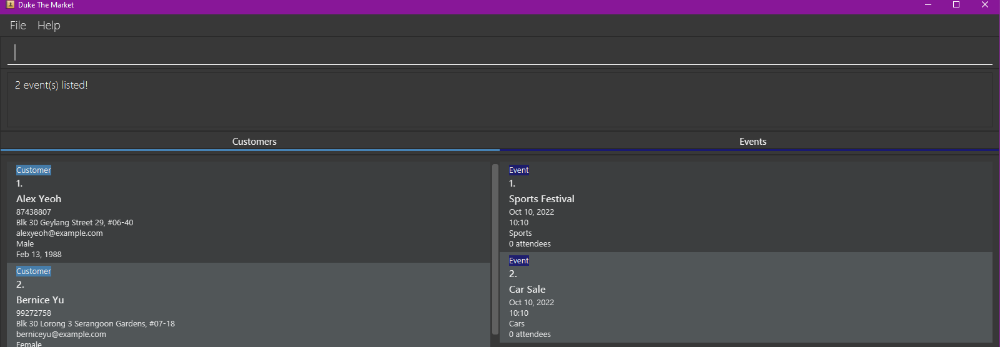

**Duke The Market** is a one-stop marketing tool that allows department stores to keep track of their upcoming
marketing plan roll-outs, monitor its impact, and to target the appropriate subsegment of its customer base for each of those plans.
Also, it is optimised for use via a Command Line Interface (CLI) while still having the benefits of a Graphical User
Interface (GUI). If you can type fast, Duke The Market can help you organise your marketing events and reach out to your target customer base much faster than a traditional GUI app.

* Table of Contents
{:toc}

--------------------------------------------------------------------------------------------------------------------

## Quick start

1. Ensure you have Java `11` or above installed in your Computer.

2. Download the latest `dukeTheMarket.jar` from [here](https://github.com/AY2223S1-CS2103-F09-2/tp/releases).

3. Copy the file to the folder you want to use as the _home folder_ for your application.

4. Double-click the file to start the app. The GUI similar to the below should appear in a few seconds. Note how the app contains some sample data. 
   

5. Type the command in the command box and press Enter to execute it. e.g. typing **`help`** and pressing Enter will open the help window. 
   Some example commands you can try:

   * **`listPersons`** : Lists all contacts.

   * **`addPerson`**`n/John Doe p/98765432 e/johnd@example.com a/John street, block 123, #01-01 g/m d/22/3/1993` : Adds a contact named `John Doe` to the application.

   * **`deletePerson`**`3` : Deletes the 3rd contact shown in the current list.

   * **`clear`** : Deletes all contacts.

   * **`exit`** : Exits the app.

6. Refer to the [Features](#features) below for details of each command.

--------------------------------------------------------------------------------------------------------------------

## Features

**:information_source: Notes about the command format:** 

* Words in `UPPER_CASE` are the parameters to be supplied by the user. 
  e.g. in `add n/NAME`, `NAME` is a parameter which can be used as `add n/John Doe`.

* Parameters can be in any order. 
  e.g. if the command specifies `n/NAME p/PHONE_NUMBER`, `p/PHONE_NUMBER n/NAME` is also acceptable.

* If a parameter is expected only once in the command, but you specified it multiple times, only the last occurrence of the parameter will be taken. 
  e.g. if you specify `p/12341234 p/56785678`, only `p/56785678` will be taken.

* Extraneous parameters for commands that do not take in parameters (such as `help`, `exit` and `clear`) will be ignored. 
  e.g. if the command specifies `help 123`, it will be interpreted as `help`.

### Instantaneous launching
Users that have Java 11 or above installed in their computers can launch the Duke The Market program
by double-clicking on the file.

### Saving the data
Duke The Market data are saved in the hard disk automatically after any command that changes the data.
There is no need to save manually.

### Viewing help : `help`

Shows a message explaining how to access the help page.

Format: `help`

### Adding a contact: `addPerson`

Adds a contact to the application.

Format: `addPerson n/NAME p/PHONE_NUMBER e/EMAIL a/ADDRESS g/GENDER d/DOB`

- The compulsory parameters are: name (`n`), phone number (`p`), email (`e`), address (`a`), gender (`g`), date of birth(`d`).
- Date format accepted is: `dd/mm/yyyy`.
- Date of birth cannot be after the current date.
- The genders accepted by the contact list are: `M`/`m`/`Male`/`male` for male, `F`/`f`/`Female`/`female` for female.

Examples:
* `addPerson n/John Doe p/98765432 e/johnd@example.com a/John street, block 123, #01-01 g/m d/20/03/2002`
* `addPerson n/Betsy Crowe e/betsycrowe@example.com a/Newgate Prison p/1234567 g/f d/14/12/1998`

:information_source: **Note:** The year "0000" is an invalid input for all persons and events.  

### Listing all persons : `listPersons`

Shows a list of all persons in the application.

Format: `listPersons [s/FIELD]`

* Sorts the contacts by the specified field in **ascending** order. `FIELD` must take one of the following values:
  * `n` or `N` sort by name in ascending lexicographical order, ignoring case differences
  * `d` or `D` sort by date of birth from oldest to youngest
  * `g` or `G` sort by gender, females first followed by males

* It is optional to include the sorting prefix and field. If the sorting prefix and field are not included, no sorting is performed.
* At most one field can be specified. i.e. Cannot specify 2nd or 3rd criteria to sort by.

:information_source: **Note:** Lexicographical order is defined as the order in which letters and symbols are listed in the [American Standard Code for Information Interchange (ASCII)](https://en.wikipedia.org/wiki/ASCII).

:information_source: **Note:** The sorted result is permanent on the underlying contact list.  

For example, if `listPersons s/n` and `listPersons` are executed back-to-back, the result of the second `listPersons` command will display the sorted results from the first `listPersons s/n` command since the sorted result is permanent.

Examples:
* `listPersons` Lists all persons without performing any sorting.
* `listPersons s/n` Lists all persons sorted by their names.

### Editing a contact : `editPerson`

Edits an existing contact in the application.

Format: `editPerson INDEX [n/NAME] [p/PHONE] [e/EMAIL] [a/ADDRESS] [g/GENDER] [d/DOB]`

- Edits the person at the specified `INDEX`. The `INDEX` refers to the index number shown in the displayed contact list.
  The `INDEX` must be **a positive integer** 1, 2, 3, …​, and it must be within the range of the contact list index. This command is invalid if `INDEX` is a non-positive integer.
- Existing values will be updated to the input values.
- At least one of the optional fields must be provided.
- Date format accepted is: `dd/mm/yyyy`.
- Date of birth cannot be after the current date.
- The genders accepted by the contact list are: `M`/`m`/`Male`/`male`
for male, `F`/`f`/`Female`/`female` for female.

Examples:
*  `editPerson 1 p/91234567 e/johndoe@example.com` Edits the phone number and email address of the 1st person to be
   `91234567` and `johndoe@example.com` respectively.
*  `editPerson 3 n/Charlotte g/F d/3/4/1998` Edits the 3rd person’s contact: edits name to be `Charlotte`,
edits gender to be `Female` and edits date of birth to be `3/4/1998`.

### Locating persons by name: `findPersons`

Finds all persons whose names contain any of the given keywords.

Format: `findPersons KEYWORD [MORE_KEYWORDS]`

* The search is case-insensitive. e.g. `hans` will match `Hans`
* The order of the keywords does not matter. e.g. `Hans Bo` will match `Bo Hans`
* Only the name is searched.
* Only full words will be matched e.g. `Han` will not match `Hans`
* Persons matching at least one keyword will be returned (i.e. `OR` search).
  e.g. `Hans Bo` will return `Hans Gruber`, `Bo Yang`

Examples:
* `findPersons John` returns `john` and `John Doe`
* `findPersons alex david` returns `Alex Yeoh`, `David Li` 
  

### Deleting a person : `deletePerson`

Deletes the specified person from the application.

Format: `deletePerson INDEX`

* Deletes the person at the specified `INDEX`.
* The `INDEX` refers to the index number shown in the displayed contact list.
* The `INDEX` must be **a positive integer** 1, 2, 3, …​, and it must be within the range of the contact list index. This command is invalid if `INDEX` is a non-positive integer.

Examples:
* `listPersons` followed by `deletePerson 2` deletes the 2nd person in the application.
* `findPersons Betsy` followed by `deletePerson 1` deletes the 1st person in the results of the `findPersons` command.

### Add an event: `addEvent`

Adds a new event in the application.

Format: `addEvent n/EVENT_TITLE d/DATE t/TIME p/PURPOSE`

* The compulsory parameters are: event name (`n`), date (`d`), time (`t`) and purpose (`p`)

Examples:
* `addEvent n/Shoe Sale 30% d/30/05/2022 t/11:00 p/Discount on all shoes for up to 30%`
* `addEvent n/Banana Discount 10% d/20/04/2022 t/14:00 p/10% discount on all bananas`

### Editing an event : `editEvent`

Edits an existing event in the application.

Format: `editEvent INDEX [e/EVENT_TITLE] [d/DATE] [t/TIME] [p/PURPOSE]`

- Edits the event at the specified `INDEX`. The `INDEX` refers to the index number shown in the displayed event list.
  The `INDEX` must be **a positive integer** 1, 2, 3, …​, and it must be within the range of the event list index. This command is invalid if `INDEX` is a non-positive integer.
- At least one of the optional fields must be provided.
- Existing values will be updated to the input values.

Examples:
*  `editEvent 1 e/Toy Dinosaur Sale t/10/10/AM` Edits the event title and time of the 1st event to be
   `Toy Dinosaur Sale` and `10:10 AM` respectively.
*  `editEvent 2 e/Pillow Sale` Edits the event title of the 2nd event to be `Pillow Sale`.
*  `editEvent 3 d/10/09/2022 p/Give 20% off bottles` Edits the 3rd event’s date and purpose to be `10/09/2022` and ,
   `Give 20% off bottles` respectively.

### Locating events by event title: `findEvents`

Finds events whose event titles contain any of the given keywords.

Format: `findEvents KEYWORD [MORE_KEYWORDS]`

* The search is case-insensitive. e.g. `cars` will match `Cars`
* The order of the keywords does not matter. e.g. `Cars Sale` will match `Sale Cars`
* Only the event title is searched.
* Only full words will be matched e.g. `Car` will not match `Cars`
* Events matching at least one keyword will be returned (i.e. `OR` search).
  e.g. `Car Sale` will return `Car Discount`, `Marketing Sale`

Examples:
* `findEvents Sale` returns `sale` and `Marketing Sale`
* `findEvents sports car` returns `Sports Festival`, `Car Sale` 
  

### Deleting an event: `deleteEvent`

Deletes an existing event in the application.

Format: `deleteEvent INDEX`

* Removes the event at the specified `INDEX`.
* The `INDEX` refers to the index number shown in the displayed event list.
* The `INDEX` must be **a positive integer** 1, 2, 3, …, and it must be within the range of the event list index. This command is invalid if `INDEX` is a non-positive integer.

Examples:
* `deleteEvent 2` after listing all events with `listEvents` deletes the event at index 2

### Listing all events: `listEvents`

Shows a list of all events in the application.

Format: `listEvents [s/FIELD]`

* Sorts the events by the specified field in **ascending** order. `FIELD` must take one of the following values:
  * `e` or `E` sort by event title in ascending lexicographical order, ignoring case differences
  * `d` or `D` sort by date from oldest to newest

* It is optional to include the sorting prefix and field. If the sorting prefix and field are not included, no sorting is performed.
* At most one field can be specified. i.e. Cannot specify 2nd or 3rd criteria to sort by.

:information_source: **Note:** Lexicographical order is defined as the order in which letters and symbols are listed in the [American Standard Code for Information Interchange (ASCII)](https://en.wikipedia.org/wiki/ASCII).

:information_source: **Note:** The sorted result is permanent on the underlying events list.  

For example, if `listEvents s/e` and `listEvents` are executed back-to-back, the result of the second `listEvents` command will display the sorted results from the first `listEvents s/e` command since the sorted result is permanent.

Examples:
* `listEvents` Lists all events without performing any sorting.
* `listEvents s/e` Lists all events sorted by their event titles.

### Tag persons to an event : `tagEvent`

Format: `tagEvent EVENT_INDEX p/PERSON_INDEX [MORE_PERSON_INDEXES] ...`

* The `EVENT_INDEX` refers to the index number shown in the displayed event list.
* The `EVENT_INDEX` must be **a positive integer** 1, 2, 3, …, and it must be within the range of the event list index. This command is invalid if `EVENT_INDEX` is a non-positive integer.
* The `PERSON_INDEX` refers to the index number shown in the displayed contact list.
* The `PERSON_INDEX` must be **a positive integer** 1, 2, 3, …, and it must be within the range of the contact list index.
* The `PERSON_INDEX` must refer to a person that is not currently tagged to the event.
* Multiple `PERSON_INDEX` should be separated by white space. At least one `PERSON_INDEX` must be provided.

Example:
* `tagEvent 1 p/2` tags the 2nd person in the contact list to the 1st event in the event list.
* `tagEvent 2 p/2 4 5` tags the 2nd, 4th, 5th person to in the contact list the 2nd event in the event list.

### Untag persons from an event : `untagEvent`

Format: `untagEvent EVENT_INDEX p/PERSON_INDEX [MORE_PERSON_INDEXES] ...`

* The `EVENT_INDEX` refers to the index number shown in the displayed event list.
* The `EVENT_INDEX` must be **a positive integer** 1, 2, 3, …, and it must be within the range of the event list index. This command is invalid if `EVENT_INDEX` is a non-positive integer.
* The `PERSON_INDEX` refers to the index number shown in the displayed contact list.
* The `PERSON_INDEX` must be **a positive integer** 1, 2, 3, …, and it must be within the range of the contact list index.
* The `PERSON_INDEX` must refer to a person that is currently tagged to the event.
* Multiple `PERSON_INDEX` should be separated by white space. At least one `PERSON_INDEX` must be provided.

Example:
* `untagEvent 1 p/2` untags the 2nd person in the contact list from the 1st event in the event list.
* `untagEvent 2 p/2 4 5` untags the 2nd, 4th, 5th person in the contact list from the 2nd event in the event list.

### Create mailing list for an event : `mailEvent`

Format: `mailEvent INDEX`

* The `INDEX` refers to the index number shown in the displayed event list.
* The `INDEX` must be **a positive integer** 1, 2, 3, …, and it must be within the range of the event list index. This command is invalid if `INDEX` is a non-positive integer.
* The mailing list is saved as a CSV file at the following location: `[JAR file location]/data/EVENT_TITLE.csv`. The CSV file has 2 columns:
  `Name` and `Email`, representing the name and email for every person in the event.

Example:
* `mailEvent 2` creates mailing list as a CSV file, the name of the csv file is the same as the title of 2nd event
in the event list.

### Generating pie charts of statistics of the people tagged to an event in the event list : `makeStats`

Format: `makeStats INDEX t/STATISTIC_TYPE`

* The `INDEX` refers to the index number shown in the displayed event list.
* The `INDEX` must be a positive integer 1, 2, 3, …, and it must be within the range of the event list index. This command is invalid if `INDEX` is a non-positive integer.
* The `STATISTIC_TYPE` refers to the type of statistical data being generated.
* The `STATISTIC_TYPE` must be either `a` or `g`, where `a` stands for age and is specified to generate a pie chart showcasing
the distribution of ages across age groups, while `g` stands for gender and is specified to generate a pie chart showcasing
the distribution of genders.

Example:
* `makeStats 1 t/g` generates gender statistics of the persons tagged to the 1st event in the event list
* `makeStats 3 t/a` generates age statistics of the persons tagged to the 3rd event in the event list

### Clearing all entries : `clear`

Clears all entries from the application.

Format: `clear`

### Exiting the program : `exit`

Exits the program.

Format: `exit`

### Editing the data file

The application's data are saved as a JSON file `[JAR file location]/data/addressbook.json`. Advanced users are welcome to update data directly by editing that data file.

:exclamation: **Caution:**
If your changes to the data file makes its format invalid, the application will discard all data and start with an empty data file at the next run.

### Archiving data files `[coming in v2.0]`

_Details coming soon ..._

--------------------------------------------------------------------------------------------------------------------

## FAQ

**Q**: How do I transfer my data to another Computer? 
**A**: Install the app in the other computer and overwrite the empty data file it creates with the file that contains the data of your previous AddressBook home folder.

--------------------------------------------------------------------------------------------------------------------

## Command summary

| Action           | Format, Examples                                                                                                                                                                     |
|------------------|--------------------------------------------------------------------------------------------------------------------------------------------------------------------------------------|
| **AddPerson**    | `addPerson n/NAME p/PHONE_NUMBER e/EMAIL a/ADDRESS g/GENDER d/DOB`   e.g., `addPerson n/John Doe p/98765432 e/johnd@example.com a/John street, block 123, #01-01 g/m d/20/3/2002` |
| **Clear**        | `clear`                                                                                                                                                                              |
| **DeletePerson** | `deletePerson INDEX`  e.g., `deletePerson 3`                                                                                                                                      |
| **EditPerson**   | `editPerson INDEX [n/NAME] [p/PHONE] [e/EMAIL] [a/ADDRESS] [g/GENDER] [d/DOB]`  e.g.,`editPerson 2 n/James Lee e/jameslee@example.com`                                            |
| **FindPersons**  | `findPersons KEYWORD [MORE_KEYWORDS]`  e.g., `findPersons James Jake`                                                                                                             |
| **ListPersons**  | `listPersons [s/FIELD]`   e.g., `listPersons s/n`                                                                                                                                 |
| **AddEvent**     | `addEvent n/EVENT_TITLE d/DATE t/TIME p/PURPOSE`  e.g.,`addEvent n/Shoe Sale 30% d/30/05/2022 t/11:00 p/Discount on all shoes for up to 30%`                                      |
| **DeleteEvent**  | `deleteEvent INDEX`  e.g., `deleteEvent 2`                                                                                                                                        |
| **EditEvent**    | `editEvent INDEX [e/EVENT_TITLE] [d/DATE] [t/TIME] [p/PURPOSE]`  e.g., `editEvent 2 e/Chocolate Sale p/10% off all chocolates`                                                    |
| **FindEvents**   | `findEvents KEYWORD [MORE_KEYWORDS]`  e.g., `findEvents Sale Discount`                                                                                                            |
| **ListEvents**   | `listEvents [s/FIELD]`  e.g., `listEvents s/e`                                                                                                                                    |
| **MakeStats**    | `makeStats INDEX t/STATISTIC_TYPE`  e.g., `makeStats 1 t/g`                                                                                                                       |                                                                                                                                                                                 |
| **MailEvent**    | `mailEvent INDEX`  e.g., `mailEvent 3`                                                                                                                                            |                                                                                                                                      |
| **TagEvent**     | `tagEvent EVENT_INDEX p/PERSON_INDEX [MORE_PERSON_INDEXES]`   e.g., `tagEvent 2 p/1 3`                                                                                            |
| **UntagEvent**   | `untagEvent EVENT_INDEX p/PERSON_INDEX [MORE_PERSON_INDEXES]`   e.g., `untagEvent 3 p/4 5`                                                                                        |
| **Help**         | `help`                                                                                                                                                                               |
