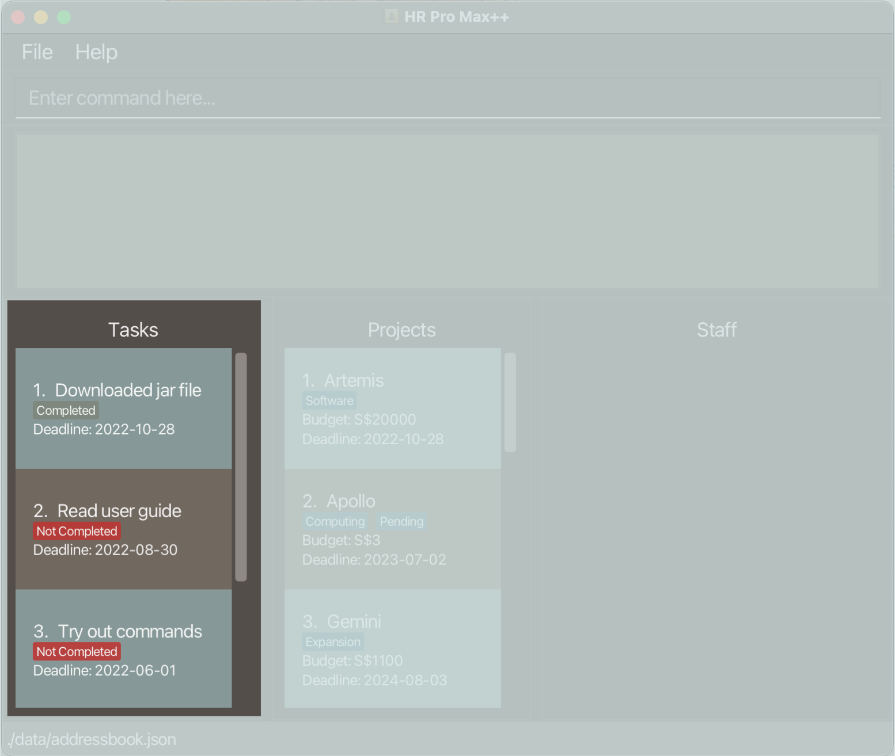

# **Introduction**
HR Pro Max++ is a **desktop app for team leads in SMEs to manage Projects and Staff members under them. 
It is optimized for use via a Command Line Interface** (CLI) while still having the benefits of a Graphical User Interface (GUI).

If you can type fast, HR Pro Max++ can get your Project management Tasks done faster than traditional GUI apps.

--------------------------------------------------------------------------------------------------------------------
## **Table of Contents**

* Table of Contents 
{:toc}

--------------------------------------------------------------------------------------------------------------------
## **Quick start**

1. Ensure you have Java `11` or above installed in your Computer.

2. Download the latest `HR_Pro_Max++.jar` from [here](https://github.com/AY2223S1-CS2103T-T09-3/tp/releases).

3. Copy the file to the folder you want to use as the _home folder_ for your Project management application.

4. Double-click the file to start the app. The GUI similar to the below should appear in a few seconds. Note how the app contains some sample data.<br>
   
5. You can proceed to the next section for a quick [overview of the user interface](#user-interface).
6. Refer to the [Features](#features) below for details of the commands you can use.

[Back to top](#table-of-contents)

--------------------------------------------------------------------------------------------------------------------
## **User Interface**
Our app's user interface is divided into 5 main parts:
1. [Command Box](#command-box)
2. [Result Display](#result-display)
3. [Task Panel](#task-panel)
4. [Project Panel](#project-panel)
5. [Staff Panel](#staff-panel)


### **Command Box**
The command box is where you can type in your commands. 


Type the command in the command box and press Enter to execute it. e.g. typing **`help`** and pressing Enter will open the help window.<br>
Some example commands you can try:

* **`list`** : Lists all Projects and Tasks.

* **`addproj pn/Duke pb/ 20 pd/ 2022-09-27`** : Adds a Project named Duke to HR Pro Max++.

* **`delproj 3`** : Deletes the 3rd Project shown in the current Project Panel.

* **`exit`** : Exits the app.

### **Result Display**
The result display is where the output of your commands will be shown.
For example, entering an incorrect `addproj` command like shown below will cause an error message to be displayed in the result display.


### **Task Panel**
This section in the user interface displays the list of Tasks that you have entered into the app. 
For information on all commands that can be used to manipulate the Task Panel, refer to the [Task Commands](#task-commands) section.



### **Project Panel**
This section in the user interface displays the list of Projects that you have entered into the app.
When first starting the program, the `Project` list will contain some sample data as shown.
FOr information on all commands that can be used to manipulate the Project Panel, refer to the [Project Commands](#project-commands) section.


### **Staff Panel**
This section in the user interface displays the list of Staff that you have entered into the app.
When first starting the program, the `Staff` list will be empty by default. 
To see how to view the `Staff` list attached to a Project, you can check [this](#view-the-staff-list-within-a-project--view) segment of the user guide.
For information on all commands that can be used to manipulate the Staff Panel, refer to the [Staff Commands](#staff-commands) section.


[Back to top](#table-of-contents)

--------------------------------------------------------------------------------------------------------------------
## **Features**

<div markdown="block" class="alert alert-info">

**:information_source: Notes about the command format:**<br>

* Commands word for using a command is case-insensitive.
  e.g. For the `addproj` command, it can be used with these command words: `Addproj`, `addProj`, `ADDPROJ`

* Words in `UPPER_CASE` are the parameters to be supplied by the user.<br>
  e.g. in `addproj pn/PROJECT_NAME`, `PROJECT_NAME` is a parameter which can be used in `addproj pn/2103T TP pb/100000 pd/2022-01-01`.

* Items in square brackets are optional.<br>
  e.g `pn/PROJECT_NAME [t/TAG]` can be used as `pn/2101 t/fun` or as `pn/2101`.

* Items with `…`​ after them can be used multiple times including zero times.<br>
  e.g. `[t/TAG]…​` can be used as ` ` (i.e. 0 times), `t/fun`, `t/fun t/expensive` etc.

* Parameters can be in any order.<br>
  e.g. if the command specifies `pn/PROJECT_NAME pb/PROJECT_BUDGET`, `pb/PROJECT_BUDGET pn/PROJECT_NAME` is also acceptable.

* If a command requires both index and parameters, the index has to come before the parameters. The parameters behind the index can be arranged in any order.
  e.g. For the `delstaff` command, its format is `editstaff INDEX pn/PROJECT_NAME` and this must be strictly adhered to. Putting the index at the back will give an error.

* If a parameter is expected only once in the command but you specified it multiple times, only the last occurrence of the parameter will be taken.<br>
  e.g. if you specify `sp/12341234 sp/56785678`, only `sp/56785678` will be taken.

* Extraneous parameters for commands that do not take in parameters (such as `help`, `list`, `exit` and `clear`) will be ignored.<br>
  e.g. if the command specifies `help 123`, it will be interpreted as `help`.

</div>

[Back to top](#table-of-contents)

--------------------------------------------------------------------------------------------------------------------
### **Help :** `help`

Shows a message explaining how to access the help page.


Format: `help`

[Back to top](#table-of-contents)

--------------------------------------------------------------------------------------------------------------------
## **Project Commands**
This segment contains information regarding all the commands that can be used to manage Projects.
### Project Glossary
| Parameter            | Description, Constraints                                                                                                                                                                                                                                                                                                                          |
|----------------------|---------------------------------------------------------------------------------------------------------------------------------------------------------------------------------------------------------------------------------------------------------------------------------------------------------------------------------------------------|
| **PROJECT_NAME**     | _Name of Project_ <br> - Only alphanumeric characters and spaces are allowed. Special characters such as `.`, `'`, or `-` cannot be used. <br> - No character limit. <br> - Project names must be unique. <br> - If you want to enter two Projects of the same name, you can add a number behind to uniquely identify the Projects e.g. Artemis2. |
| **PROJECT_BUDGET**   | _Budget allocated to the Project_ <br> - Only numbers are allowed. <br> - Budget is in SGD.                                                                                                                                                                                                                                                       |
| **PROJECT_DEADLINE** | _Deadline of the Project_ <br> - PROJECT_DEADLINE should be entered in the YYYY-MM-DD format.                                                                                                                                                                                                                                                     |
| **TAG**              | _Field for additional information_ <br> - Only alphanumeric characters are allowed. <br> - Tags are optional and can only contain one word each. Spaces are not allowed.                                                                                                                                                                          |

[Back to top](#table-of-contents)

--------------------------------------------------------------------------------------------------------------------
### **Adding a Project :** `addproj`

Adds a Project to Project list.

Format: `addproj pn/PROJECT_NAME pb/PROJECT_BUDGET pd/PROJECT_DEADLINE [t/TAG]…​`

```yaml
Note: 
  * A Project can have any number of tags (including 0)
  * PROJECT_BUDGET should be a whole number and entered as Singapore dollars. You do not need to enter any currency symbols.
  * PROJECT_DEADLINE should follow the YYYY-MM-DD format.
```


Examples:
* `addproj pn/2103T TP pb/100000 pd/2022-01-01`
* `addproj pn/CS2100 t/Tiring pb/1000 pd/2022-01-01 t/Funtime`

[Back to top](#table-of-contents)

--------------------------------------------------------------------------------------------------------------------
### **Deleting a Project :** `delproj`

Deletes the Project at the specified `INDEX` from the Project list.

Format: `delproj INDEX`

```yaml
Note:
  * INDEX refers to numbering of the Projects shown in the displayed Project list.
  * INDEX must be a positive integer 1, 2, 3, …​
  * Staff list will not display any Staff by default. You will have to use the [view command](#view-the-staff-list-within-a-project--view) to see the Staff of that Project.
```

Examples:
* `list` followed by `delproj 2` deletes the 2nd Project in Project list.
* `findproj 2103T TP` followed by `delproj 1` deletes the 1st Project in the results of the `findproj` command.

[Back to top](#table-of-contents)

--------------------------------------------------------------------------------------------------------------------
### **Listing all Projects and Tasks :** `list`

Show all the Projects and Tasks in the Project and Task list respectively.

<div markdown="span" class="alert alert-primary"> 
:bulb: **Tip:** After using a find command, you can use `list` to return the display to its original state.
</div>

Format: `list`

[Back to top](#table-of-contents)

--------------------------------------------------------------------------------------------------------------------
### **Finding Projects :** `findproj`

Finds all Projects whose names match any of the specified keywords (case-insensitive) and displays them as a list with index numbers.

Format: `findproj KEYWORD [MORE_KEYWORDS]`

```yaml
Note: 
  * `KEYWORDS` must not be an empty string.
  * The findproj command is case-insensitive such that 'merger' will match 'MERGER'
  * The findproj command will match Project name if there is a partial match, 'me' or 'mE' will both match 'MERGER'
```

Examples:
* `findproj CS2103` returns `CS2103` and `CS2103 TP`.
* `findproj merge develop` returns `Merger with ABC` and `Develop software`.

[Back to top](#table-of-contents)

--------------------------------------------------------------------------------------------------------------------
### **Sorting the Project list :** `sortproj`

Sorts the Project list according to deadline.

```yaml
Warning !!!: 
  * This command is irreversible, you will not be able to get back the original ordering after this command.
```

Format: `sortproj`

[Back to top](#table-of-contents)

--------------------------------------------------------------------------------------------------------------------
### **Editing a Project :** `editproj`

Edits the Project at the specified `INDEX` in the currently displayed Project list. Existing values will be updated to the input values.

Format: `editproj INDEX [pn/PROJECT_NAME] [pb/PROJECT_BUDGET] [pd/PROJECT_DEADLINES] [t/TAG]…​`

```yaml
Note:
  * INDEX must be a positive integer 1, 2, 3, …​
  * At least one of the optional fields must be provided.
  * When editing tags, the existing tags of the person will be removed 
    i.e adding of tags is not cumulative.
```

<div markdown="span" class="alert alert-primary"> 
:bulb: **Tip:** You can remove all tags in a Project by typing `t/` without
  specifying any tags after it.
</div>

Examples:
* `editproj 1 pb/5000` Edits the Project budget of the 1st Project to be `5000`.
* `editproj 2 pn/CS2103 t/` Edits the name of the 2nd Project to be `CS2103` and clears all existing tags.

[Back to top](#table-of-contents)

--------------------------------------------------------------------------------------------------------------------
## **Staff Commands**

Since each Project contains a list of Staff, we recommend that before using Staff commands on any Project, 
you should first use the [view command](#view-the-staff-list-within-a-project--view) to display the Project's attached Staff list.

### Staff Glossary
| Parameter            | Description, Constraints                                                                                                                                                                                                                                                                                                                |
|----------------------|-----------------------------------------------------------------------------------------------------------------------------------------------------------------------------------------------------------------------------------------------------------------------------------------------------------------------------------------|
| **STAFF_NAME**       | _Name of Staff_ <br> - Only alphanumeric characters and spaces are allowed. Special characters such as `.`, `'`, or `-` cannot be used. <br> - No character limit. <br> - Staff names must be unique. <br> - If you want to enter two Staff members of the same name, you can add a number behind to uniquely identify them e.g. John2. |
| **STAFF_PHONE**      | _Staff phone number_ <br> - Only numbers are allowed. <br> - Phone number must be 8 digits, and must start with either 6, 8, or 9 to match Singaporean phone numbers.                                                                                                                                                                   |
| **STAFF_TITLE**      | _Work title of Staff_ <br> - Only alphanumeric characters and spaces are allowed. Special characters such as `.`, `'`, or `-` cannot be used. <br> If `-` should be used, replace it with a space instead.                                                                                                                              |
| **STAFF_DEPARTMENT** | _Department of Staff_ <br> - Only alphanumeric characters and spaces are allowed. Special characters such as `.`, `'`, or `-` cannot be used. <br> If `-` should be used, replace it with a space instead.                                                                                                                              |
| **LEAVE_STATUS**     | _Staff member's leave status_ <br> - Should be specified as a boolean value. Input `true` for a staff member that is on leave, and `false` for one that is present.                                                                                                                                                                     |
| **TAG**              | _Field for additional information_ <br> - Only alphanumeric characters are allowed. <br> - Tags are optional and can only contain one word each. Spaces are not allowed.                                                                                                                                                                |

[Back to top](#table-of-contents)

--------------------------------------------------------------------------------------------------------------------
### **Adding a Staff member to Project :** `addstaff`

Adds a Staff member into the Project at the specified `INDEX`. 


Format: `addstaff INDEX sn/STAFF_NAME sl/LEAVE_STATUS sd/STAFF_DEPARTMENT st/STAFF_TITLE sc/CONTACT_NUMBER [t/TAGS]`

```yaml
Note:
 * Staff names must be unique.
 * INDEX refers to the numbering of the desired Project in the currently displayed Project list.
 * All fields for Staff members are required, except `TAGS`
 * If no Projects are currently shown on the Project list, addstaff will give an error. Use list to display all 
   Projects. If no Projects are present, add a Project first using the addproj command.
 * If Staff is added successfully, the displayed Staff list will be updated to show the Staff list 
   of the Project where the Staff is added to.
```

Examples:
* `addstaff 1 sn/John Doe sp/98765432 sl/true sd/Accounting st/Accountant` Adds Staff member named `John Doe` to the first Project in the Project list.
* `addstaff 3 sn/Betsy Crowe sp/1234567 st/Admin Staff sd/Admin sl/false` Adds Staff member named `Betsy Crown` to the third Project in the Project list.

[Back to top](#table-of-contents)

--------------------------------------------------------------------------------------------------------------------
### **Deleting a Staff member from Project :** `delstaff`

Deletes a Staff member and all their info from the Project which has its name specified. 
The Project must be in the currently displayed Project list for this command to work as expected.

Format: `delstaff INDEX pn/PROJECT_NAME`

```yaml
Note:
  * INDEX refers to Staff in displayed Staff list. It is the Staff to be deleted.
  * PROJECT_NAME refers to the Project in displayed Project list where the Staff is deleted from.
  * Recommended to use the view command on a Project before deleting a Staff from it.
  * A possible interaction is if you view the Staff list of Project A then try 
    to delete Staff at index 1 (call this Staff Tom) from Project B, it will delete 
    Staff Tom from Project B if Staff Tom is also part of Project B.
  * The index must be a positive integer 1, 2, 3, …​
  * If Staff is deleted successfully, it will update the displayed Staff list to show the Staff list 
    of the Project where the Staff was deleted from.
```

Examples:

* `delstaff 1 pn/2103` Delete the 1st Staff within the displayed Staff list from Project `2103`.
* `delstaff 7 pn/Duke` Delete 7th Staff within the displayed Staff list from Project `Duke`.

[Back to top](#table-of-contents)

--------------------------------------------------------------------------------------------------------------------
### **View the Staff list within a Project :** `view`

Views the Staff list of the Project at the specified `INDEX`.

Format: `view INDEX`

```yaml
Note:
  * INDEX refers to the numbering of the Projects in the displayed Project list.
  * The index must be a positive integer 1, 2, 3, …​
```
Examples:
* `list` followed by `view 2` displays the Staff list of the 2nd Project in Project list on the bottom right.
* `find 2103T TP` followed by `view 1` display the Staff list of the 1st Project from the result of the `find` command.

[Back to top](#table-of-contents)

--------------------------------------------------------------------------------------------------------------------
### **Editing a Staff member within a Project :** `editstaff`

Edits the Staff details of a Staff in the Project which has its name specified.
The Project must be in the currently displayed Project list for this command to work as expected.

Format: `editstaff INDEX pn/PROJECT_NAME [sn/STAFF_NAME sl/LEAVE_STATUS sd/STAFF_DEPARTMENT st/STAFF_TITLE sc/CONTACT_NUMBER
t/TAGS]`

```yaml
Note:
  * All fields in the `[]` are optional, but at least one of the optional fields must be provided.
  * Recommended to use the view command on a Project before editing a Staff in its Staff list.
  * INDEX refers to the numbering of the Staff in the displayed Staff list. It is the Staff to be edited.
  * PROJECT_NAME refers to the numbering of the Project in the displayed Project list where the Staff is to be edited.
  * A possible interaction is if you view the Staff list of Project A then try
    to edit Staff at index 1 (call this Staff Tom) from Project B, it will try to edit
    Staff Tom from Project B if Staff Tom is also part of Project B.
  * Index must be a positive integer 1, 2, 3, ...
```

Examples:
* `editstaff 1 pn/CS2103T sn/John Doe` edits the Staff name of the first Staff of the displayed Staff list of `CS2103T` to `John Doe`

[Back to top](#table-of-contents)

--------------------------------------------------------------------------------------------------------------------
### **Finding a Staff member within a Project :** `findstaff`

Changes the displayed Staff list to contain only Staff members with names that match any of the keywords.

Format: `findstaff KEYWORDS`

```yaml
Note:
  * `KEYWORDS` must not be an empty string. 
  * For `findstaff` to work as expected, the current active Staff list must be non-empty.
  * The findstaff command is case-insensitive such that 'hans' will match 'HANS'
  * The findstaff command will match Staff name if there is a partial match, 'ha' or 'hA' will both match 'HANS'
```

Examples:
* `findstaff Jon` returns a filtered view of the Staff list such that all Staff with name `Jon` are listed.
* `findstaff Adrian Lam` returns a filtered view of the Staff list such that all Staff with name `Adrian Lam` are listed. 
Staff whose name contains `Adrian` or `Lam` are also listed. 
* You can use the view command to list all the Staff in a Project if you wish to display the full Staff List again.

[Back to top](#table-of-contents)

--------------------------------------------------------------------------------------------------------------------
## **Task Commands**
This segment contains information on all the commands related to Tasks.

### Task Glossary
| Parameter            | Description, Constraints                                                                                                                                                                                                                                                                                                                |
|----------------------|-----------------------------------------------------------------------------------------------------------------------------------------------------------------------------------------------------------------------------------------------------------------------------------------------------------------------------------------|
| **TASK_DESCRIPTION** | _Description of Task_ <br> - Only alphanumeric characters and spaces are allowed. Special characters such as `.`, `'`, or `-` cannot be used. <br> - No character limit. <br> - Task names must be unique. <br> - If you want to enter two Tasks of the same name, you can add a number behind to uniquely identify them e.g. Meeting2. |
| **TASK_DEADLINE**    | _Deadline of Task_ <br> - TASK_DEADLINE should be entered in the YYYY-MM-DD format.                                                                                                                                                                                                                                                     |
| **TAG**              | _Field for additional information_ <br> - Only alphanumeric characters are allowed. <br> - Tags are optional and can only contain one word each. Spaces are not allowed.                                                                                                                                                                |

[Back to top](#table-of-contents)

--------------------------------------------------------------------------------------------------------------------
### **Adding a Task :** `addtask`

Adds a Task to the Task list. 

Format: `addtask tdesc/TASK_DESCRIPTION td/TASK_DEADLINE`

```yaml
Note:
  * Both Task fields `TASK_DESCRIPTION` and `TASK_DEADLINE` must be present.
  * `TASK_DEADLINE` follows the YYYY-MM-DD format. 
```

Examples:
* `addtask tdesc/Finish Homework td/2022-10-27` creates a Task with the description `Finish Homework` and deadline set to
`2022-10-27`

[Back to top](#table-of-contents)

--------------------------------------------------------------------------------------------------------------------
### **Deleting a Task :** `deltask`

Deletes a Task at the specified `INDEX` from the Task list. 

Format: `delTask INDEX`

```yaml
Note:
  * INDEX must be a positive integer from 1, 2, 3, ... 
```

Examples:
* `deltask 1` deletes the Task at index 1 of the Task list.
* If the Task list has only 4 elements, `deltask 5` would return an error message of
`The task index provided is invalid`.

[Back to top](#table-of-contents)

--------------------------------------------------------------------------------------------------------------------
### **Finding a Task :** `findtask`

Finds all Tasks which have descriptions matching any of the KEYWORDS.

Format: `findtask KEYWORDS`

```yaml
Note:
  * The search is case-insensitive. e.g `call` will match `Call`
  * The findtask command will match Task description if there is a partial match, 
    'Meet' or 'meet' will both match 'Meeting'.
```

Examples:
* `findtask meeting` returns `Meeting` and `Setup Meeting`.
* `findtask submit app` returns `Submit application` and `Submit paperwork`.

[Back to top](#table-of-contents)

--------------------------------------------------------------------------------------------------------------------
### **Sorting the Task list :** `sorttask`

Sorts all Tasks in displayed Task list by deadline. Earlier deadlines will be placed first.

```yaml
Warning !!!: 
* This command is irreversible, you will not be able to get back the original ordering after this command.
```

Format: `sorttask`

[Back to top](#table-of-contents)

--------------------------------------------------------------------------------------------------------------------
### **Filtering the Task list :** `filtertask`

Show Tasks in Task List that are not done at the top of the Task list and the rest at bottom.

Format: `filtertask`

[Back to top](#table-of-contents)

--------------------------------------------------------------------------------------------------------------------
### **Marking a Task as done :** `marktask`

Marks the Task at the specified `INDEX` in the displayed Task list as done.

Format: `marktask INDEX`

```yaml
Note:
  * INDEX must be a positive integer 1, 2, 3, …
```

Examples:
* `marktask 1` Marks the first Task in the active Task list as done.

[Back to top](#table-of-contents)

--------------------------------------------------------------------------------------------------------------------
### **Marking a Task as Undone :** `unmarktask`

Marks the Task at the specified `INDEX` in the displayed Task list as not done.

Format: `unmarktask INDEX`

```yaml
Note:
  * INDEX must be a positive integer 1, 2, 3, …
```
Examples:
* `unmarktask 2` Marks the second Task as not done.

[Back to top](#table-of-contents)

--------------------------------------------------------------------------------------------------------------------
### **Exiting the program :** `exit`

Exits the program.

Format: `exit`

[Back to top](#table-of-contents)

--------------------------------------------------------------------------------------------------------------------
### **Clearing all Data :** `clear`

Clears **all data** from HR Pro Max++.

Format: `clear`

```yaml
Warning !!!: 
* This command is irreversible, you will not be able to recover data after clearing it.
```

[Back to top](#table-of-contents)

--------------------------------------------------------------------------------------------------------------------
### **Saving the data**
Project data is saved in the hard disk automatically after any command that changes the data. 
There is no need to save manually.

[Back to top](#table-of-contents)

--------------------------------------------------------------------------------------------------------------------
## **FAQ**

**Q**: How do I transfer my data to another Computer?<br>
**A**: Install the app in the other computer and overwrite the empty data file it creates with the file that contains the data of your previous HR Pro Max++ home folder.

[Back to top](#table-of-contents)

--------------------------------------------------------------------------------------------------------------------
## **Command Summary**
This segment contains summary tables of all the commands you can use in HR Pro Max++.
### **Project Commands Summary**

| Action                    | Format, Examples                                                                                      |
|---------------------------|-------------------------------------------------------------------------------------------------------|
| **Add Project**           | `addproj pn/PROJECT_NAME  [t/TAG]…​` <br> e.g., `addproj pn/Duke pd/2022-10-25 pb/10000 t/funz`       |
| **Delete Project**        | `delproj INDEX`<br> e.g., `delproj 3`                                                                 |
| **Edit Project**          | `editproj INDEX [pn/PROJECT_NAME] [pd/PROJECT_DEADLINE]…​`<br> e.g.,`editproj 2 pn/Roofus pb/1350000` |
| **Find Projects**         | `findproj KEYWORD`<br> e.g., `findproj Duke`                                                          |
| **Sort Projects**         | `sortproj`                                                                                            |
| **List Project and Task** | `list`                                                                                                |

### **Staff Commands Summary**

| Action              | Format, Examples                                                                                              |
|---------------------|---------------------------------------------------------------------------------------------------------------|
| **Add Staff**       | `addstaff INDEX sn/STAFF_NAME…​` <br> e.g., `addstaff 1 sn/DEXTER sl/true sd/HR st/HR manager sp/98019345`    |
| **Delete Staff**    | `delstaff INDEX pn/PROJECT_NAME` <br> e.g., `delstaff 1 pn/Duke`                                              |
| **Edit Staff**      | `editstaff INDEX pn/PROJECT_NAME [sn/STAFF_NAME]…​`<br> e.g.,`editstaff 1 pn/CS2103T TP sp/98765432 sl/false` |
| **Find Staff**      | `findstaff KEYWORD`<br> e.g., `findstaff Duke`                                                                |
| **View Staff list** | `view INDEX` <br> e.g., `view 1`                                                                              |


### **Task Commands Summary**

| Action           | Format, Examples                                                                                                              |
|------------------|-------------------------------------------------------------------------------------------------------------------------------|
| **Add Task**     | `addtask tdesc/TASK_DESCRIPTION td/TASK_DEADLINE` <br> e.g., `addtask tdesc/Edit user guide td/2022-10-28`                    |
| **Delete Task**  | `deltask INDEX` <br> e.g., `deltask 1`                                                                                        |
| **Edit Task**    | `edittask INDEX [tdesc/TASK_DESCRIPTION] [td/TASK_DEADLINE]` <br> e.g., `edittask 1 tdesc/Edit Developer guide td/2022-10-25` |
| **Find Tasks**   | `findtask KEYWORDS`<br> e.g., `findtask GAME Try`                                                                             |
| **Sort Tasks**   | `sorttask`                                                                                                                    |
| **Filter Tasks** | `filtertask`                                                                                                                  |
| **Mark Tasks**   | `marktask INDEX` <br> e.g., `marktask 1`                                                                                      |
| **Unmark Tasks** | `unmarktask INDEX`<br> e.g., `unmarktask 1`                                                                                   |


### **Miscellaneous Commands Summary**


| Action                    | Format, Examples |
|---------------------------|------------------|
| **Clear save data**       | `clear`          |
| **Help**                  | `help`           |
| **Exit application**      | `exit`           |

[Back to top](#table-of-contents)

--------------------------------------------------------------------------------------------------------------------

## **Prefix Summary**
Prefixes that start with `p` are for Project details.

Prefixes that start with `s` are for Project Staff member details.

Prefixes that start with `t` and are 2 letters long are for Task details.

The prefix `t/` is for tags that are used for Projects and Staff only.


| Prefix     | Meaning            | Format/ Examples       |
|------------|--------------------|------------------------|
| **pb/**    | Project budget     | pb/PROJECT_BUDGET      |
| **pd/**    | Project deadline   | pd/PROJECT_DEADLINE    |
| **pn/**    | Project name       | pn/PROJECT_NAME        |
| **sp/**    | Staff Phone        | sp/STAFF_PHONE         |
| **sd/**    | Staff department   | sd/STAFF_DEPARTMENT    |
| **sl/**    | Staff leave status | si/LEAVE_STATUS        |
| **sn/**    | Staff name         | sn/STAFF_NAME          |
| **st/**    | Staff title        | st/STAFF_TITLE         |
| **td/**    | Task deadline      | td/TASK_DEADLINE       |
| **tdesc/** | Task description   | tdesc/TASK_DESCRIPTION |
| **t/**     | Tag                | t/TAG                  |

[Back to top](#table-of-contents)
